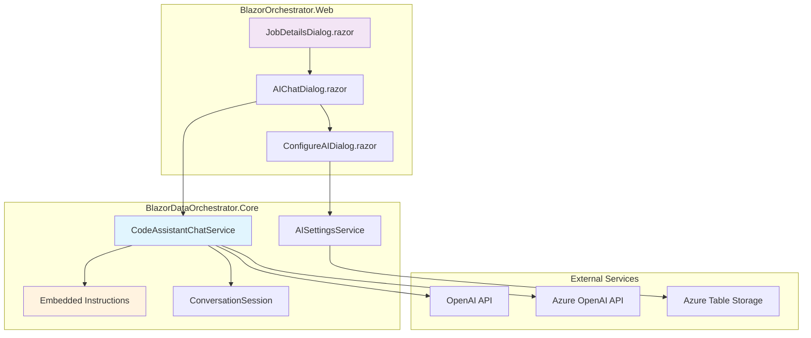
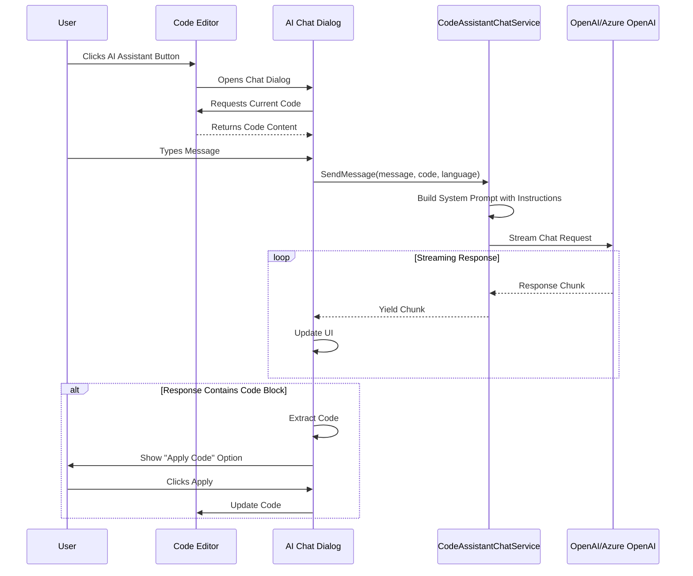
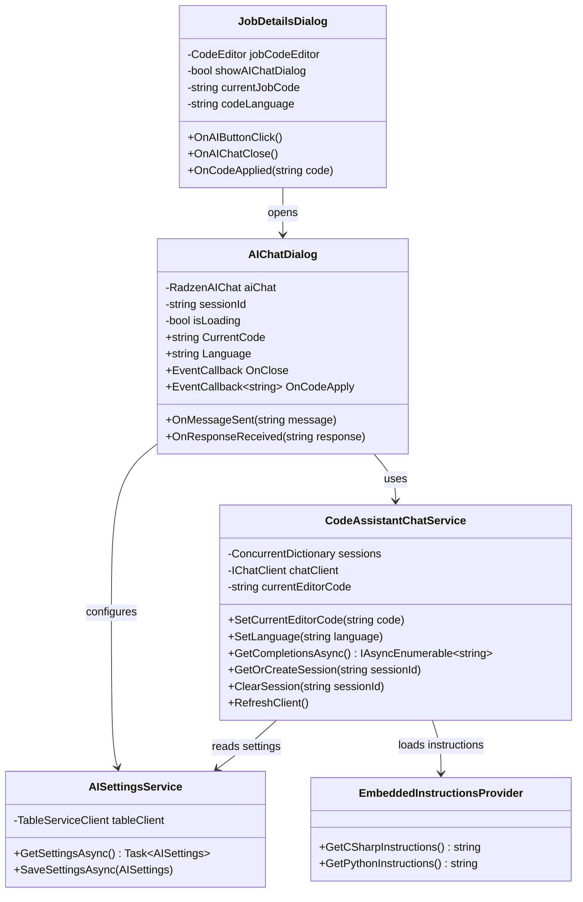
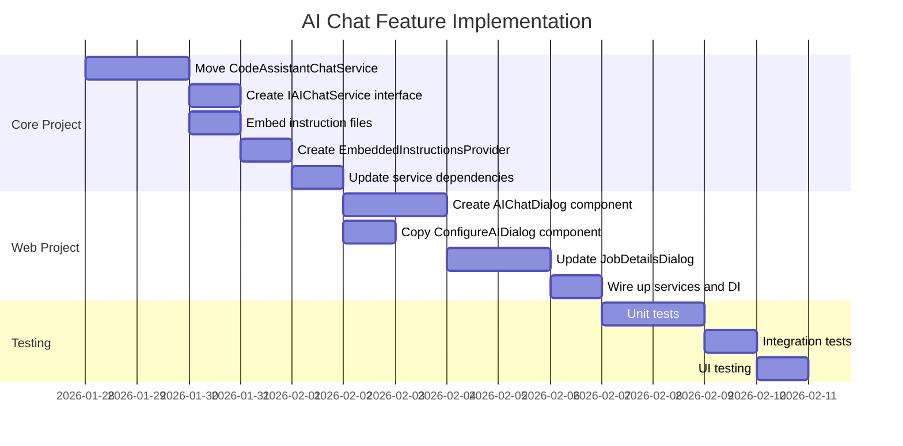

# AI Code Editor Chat Feature Implementation Plan

This document outlines the detailed implementation plan for adding an AI-powered chat dialog to the code editor in the JobDetailsDialog component. The feature will provide developers with AI assistance while editing job code directly within the web application.

---

## Table of Contents

1. [Overview](#overview)
2. [Feature Requirements](#feature-requirements)
3. [Architecture Overview](#architecture-overview)
4. [System Components](#system-components)
5. [Implementation Tasks](#implementation-tasks)
6. [Detailed Implementation Guide](#detailed-implementation-guide)
7. [UI/UX Design](#uiux-design)
8. [Testing Strategy](#testing-strategy)
9. [Appendix](#appendix)

---

## Overview

### Objective

Add an AI-powered chat assistant dialog to the Code tab of the JobDetailsDialog component. The AI assistant will help users write, debug, and optimize their job code (C# or Python) by providing contextual assistance based on the current code in the editor.

### Scope

| Item | Description |
|------|-------------|
| Target Component | `src/BlazorOrchestrator.Web/Components/Pages/Dialogs/JobDetailsDialog.razor` |
| Reference Implementation | `src/BlazorDataOrchestrator.JobCreatorTemplate/Components/Pages/Home.razor` |
| Shared Service | `CodeAssistantChatService` (to be moved to Core project) |
| Embedded Resources | `python.instructions.md`, `csharp.instructions.md` |

---

## Feature Requirements

### Functional Requirements

1. **AI Button Visibility**: An AI assistant button should only be visible when the Code tab is in **Editor** mode
2. **Popup Dialog**: Clicking the AI button opens a chat dialog overlay
3. **Context Awareness**: The AI should receive the current editor code as context
4. **Language Support**: Support both C# and Python code assistance
5. **Code Application**: AI responses containing code blocks should be applicable to the editor
6. **Session Management**: Maintain conversation history during the dialog session
7. **Settings Access**: Allow configuration of AI service (OpenAI/Azure OpenAI)

### Non-Functional Requirements

1. **Reusability**: The chat service should be centralized in the Core project
2. **Performance**: Streaming responses for better UX
3. **Reliability**: Graceful error handling when AI service is unavailable
4. **Maintainability**: Embedded instruction files for easy updates

---

## Architecture Overview

### High-Level System Architecture



### Data Flow Diagram



---

## System Components

### Component Diagram



---

## Implementation Tasks

### Task Breakdown



### Task Checklist

#### Task 1: Move CodeAssistantChatService to Core Project

- [ ] Create `IAIChatService` interface in `BlazorDataOrchestrator.Core/Services/`
- [ ] Move `CodeAssistantChatService.cs` to `BlazorDataOrchestrator.Core/Services/`
- [ ] Create `ConversationSession.cs` model class
- [ ] Update namespace references
- [ ] Add required NuGet packages to Core project

#### Task 2: Embed Instruction Files

- [ ] Copy `python.instructions.md` to `BlazorDataOrchestrator.Core/Resources/`
- [ ] Copy `csharp.instructions.md` to `BlazorDataOrchestrator.Core/Resources/`
- [ ] Update `.csproj` to embed resources
- [ ] Create `EmbeddedInstructionsProvider` service

#### Task 3: Create AIChatDialog Component

- [ ] Create `AIChatDialog.razor` in Web project
- [ ] Implement RadzenAIChat integration
- [ ] Add code extraction and application logic
- [ ] Style the dialog for popup behavior

#### Task 4: Update JobDetailsDialog

- [ ] Add AI button to Code tab toolbar (Editor mode only)
- [ ] Add dialog state management
- [ ] Wire up code context passing
- [ ] Handle code application from AI responses

#### Task 5: Configure Dependency Injection

- [ ] Register services in `Program.cs`
- [ ] Update service lifetimes appropriately

---

## Detailed Implementation Guide

### Step 1: Create IAIChatService Interface

**File**: `src/BlazorDataOrchestrator.Core/Services/IAIChatService.cs`

```csharp
namespace BlazorDataOrchestrator.Core.Services;

/// <summary>
/// Interface for AI chat services supporting code assistance.
/// </summary>
public interface IAIChatService
{
    /// <summary>
    /// Sets the current code from the editor to be included in AI requests.
    /// </summary>
    void SetCurrentEditorCode(string code);
    
    /// <summary>
    /// Sets the current programming language context.
    /// </summary>
    void SetLanguage(string language);
    
    /// <summary>
    /// Gets streaming completions from the AI service.
    /// </summary>
    IAsyncEnumerable<string> GetCompletionsAsync(
        string userInput,
        string? sessionId = null,
        CancellationToken cancellationToken = default,
        string? model = null,
        string? systemPrompt = null,
        double? temperature = null,
        int? maxTokens = null,
        string? endpoint = null,
        string? proxy = null,
        string? apiKey = null,
        string? apiKeyHeader = null);
    
    /// <summary>
    /// Gets or creates a conversation session.
    /// </summary>
    ConversationSession GetOrCreateSession(string? sessionId = null);
    
    /// <summary>
    /// Clears a conversation session.
    /// </summary>
    void ClearSession(string sessionId);
    
    /// <summary>
    /// Refreshes the chat client when settings change.
    /// </summary>
    void RefreshClient();
}
```

### Step 2: Create ConversationSession Model

**File**: `src/BlazorDataOrchestrator.Core/Models/ConversationSession.cs`

```csharp
namespace BlazorDataOrchestrator.Core.Models;

/// <summary>
/// Represents an AI chat conversation session.
/// </summary>
public class ConversationSession
{
    public string Id { get; set; } = Guid.NewGuid().ToString();
    public DateTime CreatedAt { get; set; } = DateTime.UtcNow;
    public List<ChatMessageRecord> Messages { get; set; } = new();
}

/// <summary>
/// Represents a single chat message in a conversation.
/// </summary>
public class ChatMessageRecord
{
    public bool IsUser { get; set; }
    public string Content { get; set; } = string.Empty;
    public DateTime Timestamp { get; set; } = DateTime.UtcNow;
}
```

### Step 3: Update Core Project File for Embedded Resources

**File**: `src/BlazorDataOrchestrator.Core/BlazorDataOrchestrator.Core.csproj`

Add the following ItemGroup:

```xml
<ItemGroup>
  <EmbeddedResource Include="Resources\csharp.instructions.md" />
  <EmbeddedResource Include="Resources\python.instructions.md" />
</ItemGroup>

<ItemGroup>
  <!-- Required packages for AI functionality -->
  <PackageReference Include="Microsoft.Extensions.AI" Version="9.0.0-preview.1.24570.5" />
  <PackageReference Include="Microsoft.Extensions.AI.OpenAI" Version="9.0.0-preview.1.24570.5" />
  <PackageReference Include="Azure.AI.OpenAI" Version="2.0.0" />
  <PackageReference Include="OpenAI" Version="2.0.0" />
</ItemGroup>
```

### Step 4: Create Embedded Instructions Provider

**File**: `src/BlazorDataOrchestrator.Core/Services/EmbeddedInstructionsProvider.cs`

```csharp
using System.Reflection;

namespace BlazorDataOrchestrator.Core.Services;

/// <summary>
/// Provides access to embedded instruction files for AI code assistance.
/// </summary>
public class EmbeddedInstructionsProvider
{
    private readonly Assembly _assembly;
    private string? _cachedCSharpInstructions;
    private string? _cachedPythonInstructions;

    public EmbeddedInstructionsProvider()
    {
        _assembly = typeof(EmbeddedInstructionsProvider).Assembly;
    }

    /// <summary>
    /// Gets the C# code generation instructions.
    /// </summary>
    public string GetCSharpInstructions()
    {
        if (_cachedCSharpInstructions != null)
            return _cachedCSharpInstructions;

        _cachedCSharpInstructions = LoadEmbeddedResource("csharp.instructions.md");
        return _cachedCSharpInstructions;
    }

    /// <summary>
    /// Gets the Python code generation instructions.
    /// </summary>
    public string GetPythonInstructions()
    {
        if (_cachedPythonInstructions != null)
            return _cachedPythonInstructions;

        _cachedPythonInstructions = LoadEmbeddedResource("python.instructions.md");
        return _cachedPythonInstructions;
    }

    /// <summary>
    /// Gets instructions for the specified language.
    /// </summary>
    public string GetInstructionsForLanguage(string language)
    {
        return language?.ToLowerInvariant() switch
        {
            "python" => GetPythonInstructions(),
            "csharp" or "c#" => GetCSharpInstructions(),
            _ => GetCSharpInstructions()
        };
    }

    private string LoadEmbeddedResource(string resourceName)
    {
        var fullResourceName = _assembly.GetManifestResourceNames()
            .FirstOrDefault(n => n.EndsWith(resourceName, StringComparison.OrdinalIgnoreCase));

        if (fullResourceName == null)
            return string.Empty;

        using var stream = _assembly.GetManifestResourceStream(fullResourceName);
        if (stream == null)
            return string.Empty;

        using var reader = new StreamReader(stream);
        return reader.ReadToEnd();
    }
}
```

### Step 5: Move and Update CodeAssistantChatService

**File**: `src/BlazorDataOrchestrator.Core/Services/CodeAssistantChatService.cs`

Key modifications from the original:

```csharp
using System.Collections.Concurrent;
using System.Runtime.CompilerServices;
using System.ClientModel;
using Microsoft.Extensions.AI;
using OpenAI;
using Azure.AI.OpenAI;
using BlazorDataOrchestrator.Core.Models;

namespace BlazorDataOrchestrator.Core.Services;

/// <summary>
/// AI Chat service for code assistance using Microsoft.Extensions.AI.
/// Supports OpenAI and Azure OpenAI services.
/// </summary>
public class CodeAssistantChatService : IAIChatService
{
    private readonly ConcurrentDictionary<string, ConversationSession> _sessions = new();
    private readonly AISettingsService _settingsService;
    private readonly EmbeddedInstructionsProvider _instructionsProvider;
    private AISettings? _cachedSettings;
    private IChatClient? _chatClient;
    private string _currentEditorCode = "";
    private string _currentLanguage = "csharp";
    
    private const string BaseSystemPrompt = @"You are a helpful code assistant specializing in Python and C# development. 
You help developers with:
- Writing and debugging code
- Explaining programming concepts
- Best practices and code optimization
- Understanding libraries and frameworks
Keep responses concise and focused on the code task at hand.";

    public CodeAssistantChatService(
        AISettingsService settingsService, 
        EmbeddedInstructionsProvider instructionsProvider)
    {
        _settingsService = settingsService;
        _instructionsProvider = instructionsProvider;
    }
    
    /// <summary>
    /// Sets the current code from the editor to be included in AI requests.
    /// </summary>
    public void SetCurrentEditorCode(string code)
    {
        _currentEditorCode = code ?? "";
    }
    
    /// <summary>
    /// Sets the current programming language context.
    /// </summary>
    public void SetLanguage(string language)
    {
        _currentLanguage = language ?? "csharp";
    }
    
    /// <summary>
    /// Builds the dynamic system prompt with language-specific instructions.
    /// </summary>
    private string BuildSystemPrompt(bool isNewSession)
    {
        var promptBuilder = new System.Text.StringBuilder();
        promptBuilder.AppendLine(BaseSystemPrompt);
        
        if (isNewSession)
        {
            var instructions = _instructionsProvider.GetInstructionsForLanguage(_currentLanguage);
            if (!string.IsNullOrWhiteSpace(instructions))
            {
                promptBuilder.AppendLine();
                promptBuilder.AppendLine("## Custom Instructions for Code Generation");
                promptBuilder.AppendLine(instructions);
            }
        }
        
        return promptBuilder.ToString();
    }

    // ... rest of the implementation similar to original
    // with namespace and dependency updates
}
```

### Step 6: Create AIChatDialog Component

**File**: `src/BlazorOrchestrator.Web/Components/Pages/Dialogs/AIChatDialog.razor`

```razor
@using Radzen
@using Radzen.Blazor
@using BlazorDataOrchestrator.Core.Services
@using BlazorDataOrchestrator.Core.Models
@inject IAIChatService ChatService
@inject AISettingsService SettingsService
@inject NotificationService NotificationService
@inject DialogService DialogService

<div class="ai-chat-dialog-overlay" @onclick="OnOverlayClick">
    <div class="ai-chat-dialog" @onclick:stopPropagation="true">
        @* Header *@
        <RadzenStack Orientation="Orientation.Horizontal" AlignItems="AlignItems.Center"
                     JustifyContent="JustifyContent.SpaceBetween"
                     Style="padding: 16px 20px; background: #5c6bc0; color: white; border-radius: 12px 12px 0 0;">
            <RadzenStack Orientation="Orientation.Horizontal" AlignItems="AlignItems.Center" Gap="8">
                <RadzenIcon Icon="smart_toy" Style="font-size: 24px;" />
                <RadzenText TextStyle="TextStyle.H6" Style="color: white; margin: 0;">
                    AI Code Assistant
                </RadzenText>
                <RadzenBadge Text="@Language.ToUpperInvariant()" BadgeStyle="BadgeStyle.Light" />
            </RadzenStack>
            <RadzenStack Orientation="Orientation.Horizontal" Gap="8">
                <RadzenButton Icon="settings" Size="ButtonSize.Small" ButtonStyle="ButtonStyle.Light"
                              title="Configure AI Service" Click="@OpenSettingsDialog"
                              Style="color: white;" />
                <RadzenButton Icon="close" Size="ButtonSize.Small" ButtonStyle="ButtonStyle.Light"
                              title="Close" Click="@OnCloseClick"
                              Style="color: white;" />
            </RadzenStack>
        </RadzenStack>

        @* Chat Content *@
        <div class="chat-content">
            <RadzenAIChat @ref="aiChat"
                          Style="height: 100%; --rz-aichat-background-color: #ffffff;"
                          ShowClearButton="true"
                          MessageSent="@OnChatMessageSent"
                          ResponseReceived="@OnChatResponseReceived"
                          MessageAdded="@OnChatMessageAdded" />
        </div>

        @* Footer with Apply Code Button *@
        @if (HasPendingCodeUpdate)
        {
            <RadzenStack Orientation="Orientation.Horizontal" AlignItems="AlignItems.Center"
                         JustifyContent="JustifyContent.Center" Gap="12"
                         Style="padding: 12px 20px; background: #e8f5e9; border-top: 1px solid #c8e6c9;">
                <RadzenIcon Icon="code" Style="color: #4caf50;" />
                <RadzenText TextStyle="TextStyle.Body2" Style="color: #2e7d32;">
                    AI generated new code
                </RadzenText>
                <RadzenButton Text="Apply to Editor" Icon="check" 
                              ButtonStyle="ButtonStyle.Success" Size="ButtonSize.Small"
                              Click="@ApplyCodeToEditor" />
                <RadzenButton Text="Dismiss" Icon="close" 
                              ButtonStyle="ButtonStyle.Light" Size="ButtonSize.Small"
                              Click="@DismissPendingCode" />
            </RadzenStack>
        }
    </div>
</div>

@* Loading Overlay *@
@if (IsCallingAI)
{
    <div class="ai-loading-overlay">
        <RadzenStack AlignItems="AlignItems.Center" Gap="16">
            <RadzenProgressBarCircular ShowValue="false" Mode="ProgressBarMode.Indeterminate" />
            <RadzenText TextStyle="TextStyle.Body1" Style="color: white;">
                AI is thinking...
            </RadzenText>
        </RadzenStack>
    </div>
}

<style>
    .ai-chat-dialog-overlay {
        position: fixed;
        top: 0;
        left: 0;
        right: 0;
        bottom: 0;
        background: rgba(0, 0, 0, 0.5);
        display: flex;
        align-items: center;
        justify-content: center;
        z-index: 10000;
    }

    .ai-chat-dialog {
        width: 600px;
        max-width: 90vw;
        height: 70vh;
        max-height: 700px;
        background: white;
        border-radius: 12px;
        box-shadow: 0 8px 32px rgba(0, 0, 0, 0.3);
        display: flex;
        flex-direction: column;
        overflow: hidden;
    }

    .chat-content {
        flex-grow: 1;
        overflow: hidden;
        padding: 12px;
    }

    .ai-loading-overlay {
        position: fixed;
        top: 0;
        left: 0;
        right: 0;
        bottom: 0;
        background: rgba(0, 0, 0, 0.7);
        display: flex;
        align-items: center;
        justify-content: center;
        z-index: 10001;
    }
</style>

@code {
    [Parameter] public string CurrentCode { get; set; } = "";
    [Parameter] public string Language { get; set; } = "csharp";
    [Parameter] public EventCallback OnClose { get; set; }
    [Parameter] public EventCallback<string> OnCodeApply { get; set; }

    private RadzenAIChat? aiChat;
    private string sessionId = Guid.NewGuid().ToString();
    private bool IsCallingAI = false;
    private bool HasPendingCodeUpdate = false;
    private string? pendingCode = null;

    private const string CodeBeginMarker = "###UPDATED CODE BEGIN###";
    private const string CodeEndMarker = "###UPDATED CODE END###";

    protected override void OnInitialized()
    {
        ChatService.SetLanguage(Language);
    }

    private async Task OnChatMessageSent(string message)
    {
        IsCallingAI = true;
        StateHasChanged();

        // Update the ChatService with the current code context
        ChatService.SetCurrentEditorCode(CurrentCode);
        ChatService.SetLanguage(Language);
    }

    private void OnChatResponseReceived(string response)
    {
        IsCallingAI = false;

        // Check for code markers
        if (response.Contains(CodeBeginMarker) && response.Contains(CodeEndMarker))
        {
            pendingCode = ExtractCodeFromResponse(response);
            HasPendingCodeUpdate = !string.IsNullOrEmpty(pendingCode);
        }

        StateHasChanged();
    }

    private void OnChatMessageAdded(Radzen.Blazor.ChatMessage message)
    {
        // Strip code markers from displayed message
        if (!message.IsUser && message.Content != null)
        {
            if (message.Content.Contains(CodeBeginMarker) || message.Content.Contains(CodeEndMarker))
            {
                message.Content = StripCodeMarkersFromMessage(message.Content);
            }
        }
    }

    private string? ExtractCodeFromResponse(string response)
    {
        var beginIndex = response.IndexOf(CodeBeginMarker);
        var endIndex = response.IndexOf(CodeEndMarker);

        if (beginIndex >= 0 && endIndex > beginIndex)
        {
            var codeStart = beginIndex + CodeBeginMarker.Length;
            var code = response.Substring(codeStart, endIndex - codeStart).Trim();

            // Remove markdown code block markers
            code = System.Text.RegularExpressions.Regex.Replace(
                code, @"^```[\w]*\n?", "", System.Text.RegularExpressions.RegexOptions.Multiline);
            code = System.Text.RegularExpressions.Regex.Replace(
                code, @"\n?```$", "", System.Text.RegularExpressions.RegexOptions.Multiline);

            return code.Trim();
        }
        return null;
    }

    private string StripCodeMarkersFromMessage(string content)
    {
        var beginIndex = content.IndexOf(CodeBeginMarker);
        var endIndex = content.IndexOf(CodeEndMarker);

        if (beginIndex >= 0 && endIndex > beginIndex)
        {
            var beforeCode = content.Substring(0, beginIndex).TrimEnd();
            var afterCode = content.Substring(endIndex + CodeEndMarker.Length).TrimStart();

            var result = beforeCode;
            if (!string.IsNullOrEmpty(result)) result += "\n\n";
            result += "✅ **Code is ready to apply to the editor.**";
            if (!string.IsNullOrEmpty(afterCode)) result += "\n\n" + afterCode;

            return result;
        }
        return content;
    }

    private async Task ApplyCodeToEditor()
    {
        if (!string.IsNullOrEmpty(pendingCode))
        {
            await OnCodeApply.InvokeAsync(pendingCode);
            HasPendingCodeUpdate = false;
            pendingCode = null;
            NotificationService.Notify(NotificationSeverity.Success, "Success", "Code applied to editor.");
        }
    }

    private void DismissPendingCode()
    {
        HasPendingCodeUpdate = false;
        pendingCode = null;
    }

    private async Task OnCloseClick()
    {
        await OnClose.InvokeAsync();
    }

    private void OnOverlayClick()
    {
        // Optional: Close on overlay click
        // await OnClose.InvokeAsync();
    }

    private async Task OpenSettingsDialog()
    {
        await DialogService.OpenAsync<ConfigureAIDialog>("Configure AI Service",
            new Dictionary<string, object>
            {
                { "OnSettingsSaved", EventCallback.Factory.Create(this, OnSettingsSaved) }
            },
            new DialogOptions
            {
                Width = "500px",
                CloseDialogOnOverlayClick = true,
                ShowClose = true
            });
    }

    private void OnSettingsSaved()
    {
        ChatService.RefreshClient();
        DialogService.Close();
        NotificationService.Notify(NotificationSeverity.Success, "Success", "AI settings updated.");
    }
}
```

### Step 7: Update JobDetailsDialog.razor

Add the following modifications to the Code tab in `JobDetailsDialog.razor`:

#### 7.1 Add State Variables

```csharp
// AI Chat Dialog State
private bool showAIChatDialog = false;
```

#### 7.2 Add AI Button to Code Tab Toolbar (Editor Mode Only)

In the toolbar section within the Code tab, add the AI button:

```razor
<RadzenStack Orientation="Orientation.Horizontal" Gap="0.5rem">
    @if (codeEditMode == CodeEditMode.Editor)
    {
        <RadzenButton Text="AI Assistant" Icon="smart_toy" 
                      ButtonStyle="ButtonStyle.Info" Size="ButtonSize.Medium" 
                      Click="@OpenAIChatDialog"
                      title="Open AI Code Assistant" />
        <RadzenButton Text="Save & Compile" Icon="save" ButtonStyle="ButtonStyle.Success" 
                      Size="ButtonSize.Medium" Click="@SaveAndCompileCode" 
                      IsBusy="@isCompilingCode" />
        <RadzenButton Text="Run Job Now" Icon="play_arrow" ButtonStyle="ButtonStyle.Success" 
                      Size="ButtonSize.Medium" Click="@RunJobWithCode" 
                      IsBusy="@isRunningJobWithCode" />
    }
</RadzenStack>
```

#### 7.3 Add AI Chat Dialog Component

At the end of the component markup (before closing tags):

```razor
@* AI Chat Dialog *@
@if (showAIChatDialog)
{
    <AIChatDialog CurrentCode="@currentJobCode"
                  Language="@codeLanguage"
                  OnClose="@CloseAIChatDialog"
                  OnCodeApply="@OnAICodeApplied" />
}
```

#### 7.4 Add Supporting Methods

```csharp
private void OpenAIChatDialog()
{
    // Ensure we have the latest code from the editor
    if (jobCodeEditor != null)
    {
        _ = Task.Run(async () =>
        {
            currentJobCode = await jobCodeEditor.GetCodeAsync() ?? currentJobCode;
            await InvokeAsync(StateHasChanged);
        });
    }
    showAIChatDialog = true;
}

private void CloseAIChatDialog()
{
    showAIChatDialog = false;
}

private async Task OnAICodeApplied(string code)
{
    // Apply the AI-generated code to the editor
    currentJobCode = code;
    
    if (jobCodeEditor != null)
    {
        await jobCodeEditor.UpdateCodeAsync(code);
    }
    
    // Update file storage
    if (!string.IsNullOrEmpty(selectedCodeFile))
    {
        FileStorage.SetFile(JobId, selectedCodeFile, code);
    }
    
    showAIChatDialog = false;
    NotificationService.Notify(NotificationSeverity.Success, "Code Applied", 
        "AI-generated code has been applied to the editor.");
}
```

### Step 8: Configure Dependency Injection

**File**: `src/BlazorOrchestrator.Web/Program.cs`

Add the following service registrations:

```csharp
// AI Services
builder.Services.AddSingleton<EmbeddedInstructionsProvider>();
builder.Services.AddScoped<IAIChatService, CodeAssistantChatService>();
```

---

## UI/UX Design

### Dialog Layout Wireframe

```
┌─────────────────────────────────────────────────────────────┐
│ ┌─────────────────────────────────────────────────────────┐ │
│ │ 🤖 AI Code Assistant                    [C#] [⚙️] [✕]  │ │
│ └─────────────────────────────────────────────────────────┘ │
│ ┌─────────────────────────────────────────────────────────┐ │
│ │                                                         │ │
│ │  [Chat Messages Area]                                   │ │
│ │                                                         │ │
│ │  User: How do I connect to SQL Server?                  │ │
│ │                                                         │ │
│ │  AI: Here's how to connect to SQL Server using          │ │
│ │      Entity Framework Core...                           │ │
│ │                                                         │ │
│ │  ✅ Code is ready to apply to the editor.               │ │
│ │                                                         │ │
│ └─────────────────────────────────────────────────────────┘ │
│ ┌─────────────────────────────────────────────────────────┐ │
│ │ 📝 AI generated new code  [Apply to Editor] [Dismiss]   │ │
│ └─────────────────────────────────────────────────────────┘ │
│ ┌─────────────────────────────────────────────────────────┐ │
│ │ [Type your message...                              ] 📤 │ │
│ └─────────────────────────────────────────────────────────┘ │
└─────────────────────────────────────────────────────────────┘
```

### Button Placement in Code Tab

```
┌─────────────────────────────────────────────────────────────────┐
│ Mode: [Editor] [Upload]                                         │
├─────────────────────────────────────────────────────────────────┤
│ Language: [C#▼]  File: [main.cs▼]    [🤖 AI Assistant]         │
│                                       [💾 Save & Compile]       │
│                                       [▶️ Run Job Now]          │
├─────────────────────────────────────────────────────────────────┤
│                                                                 │
│                      CODE EDITOR                                │
│                                                                 │
└─────────────────────────────────────────────────────────────────┘
```

---

## Testing Strategy

### Unit Tests

1. **EmbeddedInstructionsProvider Tests**
   - Verify C# instructions load correctly
   - Verify Python instructions load correctly
   - Verify fallback behavior for unknown languages

2. **CodeAssistantChatService Tests**
   - Test session creation and retrieval
   - Test code context setting
   - Test language switching
   - Test system prompt building

### Integration Tests

1. **AI Service Integration**
   - Test OpenAI connectivity
   - Test Azure OpenAI connectivity
   - Test streaming response handling

2. **Code Application Flow**
   - Test code extraction from AI responses
   - Test code marker stripping
   - Test editor update flow

### UI Tests

1. **Dialog Behavior**
   - Test AI button visibility in Editor mode only
   - Test dialog open/close behavior
   - Test code apply functionality

---

## Appendix

### File Structure After Implementation

```
src/
├── BlazorDataOrchestrator.Core/
│   ├── Models/
│   │   ├── AISettings.cs
│   │   └── ConversationSession.cs     [NEW]
│   ├── Resources/
│   │   ├── csharp.instructions.md     [NEW - Embedded]
│   │   └── python.instructions.md     [NEW - Embedded]
│   ├── Services/
│   │   ├── AISettingsService.cs
│   │   ├── CodeAssistantChatService.cs [MOVED]
│   │   ├── EmbeddedInstructionsProvider.cs [NEW]
│   │   └── IAIChatService.cs          [NEW]
│   └── BlazorDataOrchestrator.Core.csproj [UPDATED]
│
├── BlazorOrchestrator.Web/
│   ├── Components/
│   │   └── Pages/
│   │       └── Dialogs/
│   │           ├── AIChatDialog.razor [NEW]
│   │           ├── ConfigureAIDialog.razor [COPIED]
│   │           └── JobDetailsDialog.razor [UPDATED]
│   └── Program.cs                     [UPDATED]
```

### Required NuGet Packages for Core Project

| Package | Version | Purpose |
|---------|---------|---------|
| Microsoft.Extensions.AI | 9.0.0-preview.* | AI abstractions |
| Microsoft.Extensions.AI.OpenAI | 9.0.0-preview.* | OpenAI integration |
| Azure.AI.OpenAI | 2.0.0 | Azure OpenAI client |
| OpenAI | 2.0.0 | OpenAI client |

### Code Markers Convention

The AI is instructed to wrap updated code with markers:

```
###UPDATED CODE BEGIN###
// Your code here
###UPDATED CODE END###
```

This allows the system to:
1. Detect when AI provides code updates
2. Extract the code programmatically
3. Display a user-friendly message instead of raw markers
4. Offer "Apply to Editor" functionality
