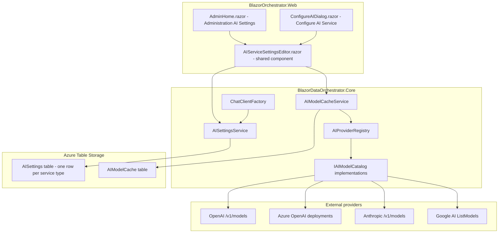
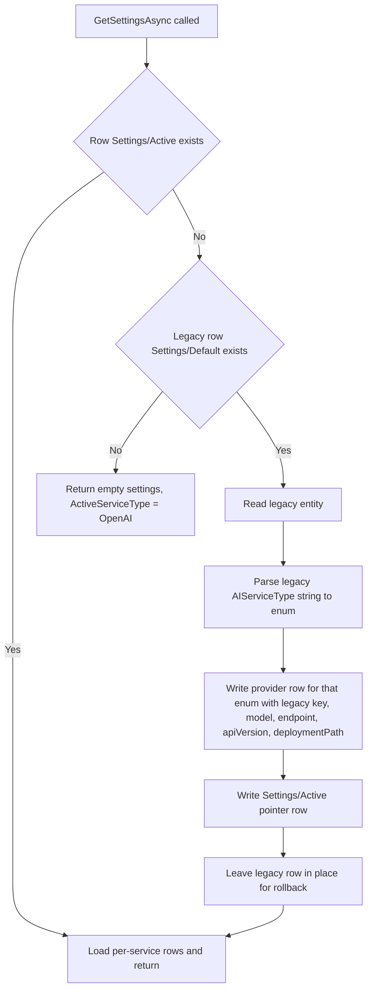
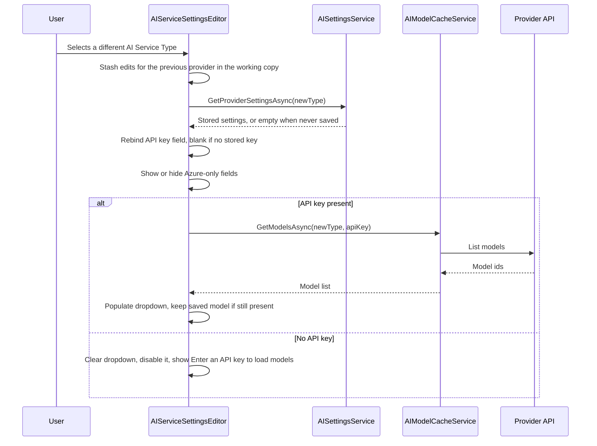
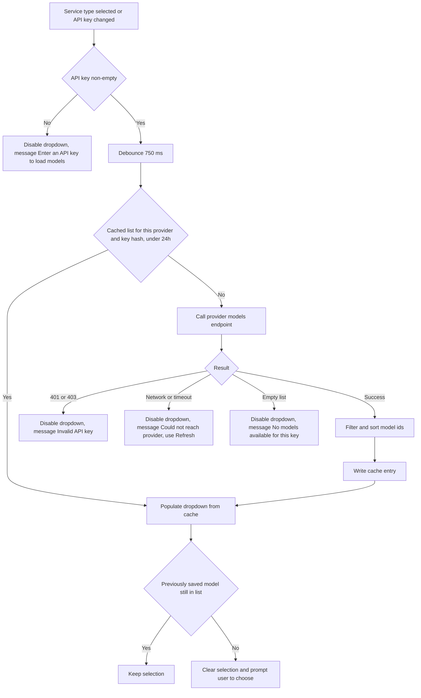

# AI Settings — Per-Service API Keys & Dynamic Model List Plan

**Project:** `BlazorOrchestrator.Web` (UI) + `BlazorDataOrchestrator.Core` (services & storage)
**Status:** Implemented
**Scope:** AI Settings UI in two locations, both backed by the same Core services:

1. **Administration → AI Settings** — `src/BlazorOrchestrator.Web/Components/Pages/Admin/AdminHome.razor`
2. **Edit Job → Code → Editor → AI Assistant → gear icon (Configure AI Service)** — `src/BlazorOrchestrator.Web/Components/Pages/Dialogs/ConfigureAIDialog.razor`

**Explicitly out of scope:** `src/BlazorDataOrchestrator.JobCreatorTemplate/Components/ConfigureAIDialog.razor`. That template targets the GitHub Copilot CLI and is a separate feature; it must not be changed by this work.

---

## 1. Problem Statement

### Bug 1 — Wrong dropdown label + API key not switching per service

- The dropdown is labeled **"OpenAI Service Type"** but offers four providers. It must be labeled **"AI Service Type"**.
- `AISettings` holds a single `ApiKey` property. Switching the service type in the UI leaves the same key in the field, so the OpenAI key leaks into the Anthropic selection, is saved over the top of the previous provider's key, and the user silently loses credentials.
- Required behaviour: each service type keeps its **own independent** API key (and provider-specific settings). Selecting a service shows that service's stored key, or a blank field when none has been saved.

### Bug 2 — Model dropdown is hard-coded

- `AIModelCacheService` contains static `Known*Models` lists used as fallbacks; the Anthropic path is static-only and never calls the provider.
- Required behaviour: once a service type is selected **and** a non-empty API key is present, call the provider's models endpoint live, populate the dropdown from the response, and show an explicit error/empty state when the call fails or the key is rejected. **All hard-coded model lists are removed** — there is no silent fallback.

---

## 2. Current State

| Concern | Location | Notes |
| --- | --- | --- |
| Settings model | `src/BlazorDataOrchestrator.Core/Models/AISettings.cs` | Flat POCO, single `ApiKey` |
| Persistence | `src/BlazorDataOrchestrator.Core/Services/AISettingsService.cs` | Azure Table Storage, table `AISettings`, `PartitionKey="Settings"`, `RowKey="Default"` |
| Model list | `src/BlazorDataOrchestrator.Core/Services/AIModelCacheService.cs` | Table `AIModelCache`, 24h TTL, hard-coded fallbacks |
| Chat client | `src/BlazorDataOrchestrator.Core/Services/ChatClientFactory.cs` | `switch` on `AIServiceType` string |
| Admin UI | `.../Pages/Admin/AdminHome.razor` | Radzen, inline `@code` block |
| Dialog UI | `.../Pages/Dialogs/ConfigureAIDialog.razor` | Radzen, inline `@code` block, duplicated field logic |
| Service types | string literals | No enum; list duplicated in several files |
| DI | `src/BlazorOrchestrator.Web/Program.cs` | `AISettingsService`, `AIModelCacheService` registered scoped |

Key limitations driving this design: one settings row for all providers; provider selection strings duplicated; model fetching hidden behind fallbacks so failures are invisible.

---

## 3. Target Architecture



### Design decisions (confirmed)

1. **Storage shape:** one Table Storage row per service type — `PartitionKey = "Settings"`, `RowKey = <service key>` (`OpenAI`, `AzureOpenAI`, `Anthropic`, `GoogleAI`). A separate pointer row records which provider is active.
2. **Per-service fields:** `ApiKey`, `Endpoint`, `ApiVersion`, `DeploymentPath`, `AIModel`, and `EmbeddingModel` are all per service type.
3. **No fallbacks:** hard-coded model lists are deleted; failures surface in the UI.
4. **Encryption:** out of scope for this work. Keys remain plain text in Table Storage — tracked as a follow-up (see §11).

---

## 4. Data Model Changes

### 4.1 New enum

`src/BlazorDataOrchestrator.Core/Models/AIServiceType.cs`

```csharp
public enum AIServiceType
{
    OpenAI = 0,
    AzureOpenAI = 1,
    Anthropic = 2,
    GoogleAI = 3
}
```

Add a helper for display/storage conversion so the four literal strings are defined once:

`src/BlazorDataOrchestrator.Core/Models/AIServiceTypes.cs`

```csharp
public static class AIServiceTypes
{
    // Display text shown in the "AI Service Type" dropdown.
    public static string ToDisplayName(AIServiceType t) => t switch
    {
        AIServiceType.AzureOpenAI => "Azure OpenAI",
        AIServiceType.Anthropic   => "Anthropic",
        AIServiceType.GoogleAI    => "Google AI",
        _                         => "OpenAI"
    };

    // Stable Table Storage RowKey; never localise or change these.
    public static string ToStorageKey(AIServiceType t) => t.ToString();

    public static bool TryParse(string? value, out AIServiceType result) { /* accepts display name, storage key, and legacy strings */ }

    public static IReadOnlyList<AIServiceType> All { get; }
}
```

`ChatClientFactory`, `AIModelCacheService`, and both UI files must be updated to use these helpers instead of literals.

### 4.2 Per-service settings model

`src/BlazorDataOrchestrator.Core/Models/AISettings.cs` becomes a container:

```csharp
public class AIProviderSettings
{
    public AIServiceType ServiceType { get; set; }
    public string ApiKey { get; set; } = "";
    public string AIModel { get; set; } = "";
    public string Endpoint { get; set; } = "";      // Azure OpenAI
    public string ApiVersion { get; set; } = "";    // Azure OpenAI
    public string DeploymentPath { get; set; } = "";// Azure OpenAI
    public string EmbeddingModel { get; set; } = "";
    public bool IsConfigured => !string.IsNullOrWhiteSpace(ApiKey);
}

public class AISettings
{
    public AIServiceType ActiveServiceType { get; set; } = AIServiceType.OpenAI;
    public Dictionary<AIServiceType, AIProviderSettings> Providers { get; set; } = new();

    public AIProviderSettings Active => GetOrCreate(ActiveServiceType);
    public AIProviderSettings GetOrCreate(AIServiceType type);
    public bool IsConfigured => Active.IsConfigured;
}
```

**Compatibility shim:** keep `AIServiceType` (string), `ApiKey`, `AIModel`, `Endpoint`, `ApiVersion`, `DeploymentPath`, and `EmbeddingModel` on `AISettings` as `[Obsolete]` pass-through properties that read/write `Active`. This keeps `ChatClientFactory`, `CodeAssistantChatService`, and the agent/scheduler consumers compiling while call sites are migrated. Remove the shim in a follow-up once no references remain.

### 4.3 Table entities

`src/BlazorDataOrchestrator.Core/Services/AISettingsService.cs`

```csharp
// RowKey = AIServiceTypes.ToStorageKey(...)  e.g. "OpenAI", "AzureOpenAI"
public class AIProviderSettingsEntity : ITableEntity
{
    public string PartitionKey { get; set; } = "Settings";
    public string RowKey { get; set; } = "";
    public string? ApiKey { get; set; }
    public string? AIModel { get; set; }
    public string? Endpoint { get; set; }
    public string? ApiVersion { get; set; }
    public string? DeploymentPath { get; set; }
    public string? EmbeddingModel { get; set; }
    public DateTimeOffset? Timestamp { get; set; }
    public ETag ETag { get; set; }
}

// PartitionKey = "Settings", RowKey = "Active"
public class AIActiveServiceEntity : ITableEntity
{
    public string? ActiveServiceType { get; set; }
    // ...ITableEntity members
}
```

The legacy `RowKey = "Default"` entity is retained on disk (read-only) purely so migration is idempotent and reversible.

---

## 5. Migration of Existing Settings

Runs inside `AISettingsService.GetSettingsAsync()` on first read (lazy, idempotent), so no deployment step is required.



Rules:

- The legacy key is attributed **only** to the service type recorded in the legacy row. Other providers start blank.
- If the legacy `AIServiceType` string is unrecognised, default to `OpenAI` and log a warning.
- Migration writes use `ETag.All` upsert; a concurrent second migration is harmless.
- Rollback: delete the `Active` and per-service rows; the untouched `Default` row restores previous behaviour.

---

## 6. Settings Service API

`AISettingsService` gains:

```csharp
Task<AISettings> GetSettingsAsync(CancellationToken ct = default);           // all providers + active
Task<AIProviderSettings> GetProviderSettingsAsync(AIServiceType type, CancellationToken ct = default);
Task SaveProviderSettingsAsync(AIProviderSettings settings, CancellationToken ct = default);
Task SetActiveServiceTypeAsync(AIServiceType type, CancellationToken ct = default);
Task SaveSettingsAsync(AISettings settings, CancellationToken ct = default);  // writes active + all dirty providers
Task ClearProviderSettingsAsync(AIServiceType type, CancellationToken ct = default);
```

Notes:

- `SaveProviderSettingsAsync` must **not** blank an existing stored key when the incoming key is the masked placeholder (see §7.3).
- All methods are resilient to a missing table (`CreateIfNotExistsAsync`).

---

## 7. UI Changes

### 7.1 Shared component

Create `src/BlazorOrchestrator.Web/Components/Shared/AIServiceSettingsEditor.razor` containing the entire form (service type, API key, provider-specific fields, model dropdown, validation, refresh button). Both `AdminHome.razor` and `ConfigureAIDialog.razor` consume it, eliminating the duplicated field logic that allowed the two screens to drift.

Parameters:

| Parameter | Type | Purpose |
| --- | --- | --- |
| `Settings` | `AISettings` | Two-way bound working copy |
| `SettingsChanged` | `EventCallback<AISettings>` | Binding support |
| `ShowSaveButton` | `bool` | Admin page renders its own save bar |
| `Compact` | `bool` | Denser layout inside the dialog |
| `OnValidationStateChanged` | `EventCallback<bool>` | Lets the dialog enable/disable OK |

### 7.2 Field layout

```razor
<RadzenFormField Text="AI Service Type">
    <RadzenDropDown Data="@ServiceTypeOptions"
                    TextProperty="Text" ValueProperty="Value"
                    @bind-Value="@SelectedServiceType"
                    Change="@OnServiceTypeChangedAsync" />
</RadzenFormField>

<RadzenFormField Text="@ApiKeyLabel">   @* e.g. "Anthropic API Key" *@
    <RadzenPassword @bind-Value="@Current.ApiKey"
                    Placeholder="@ApiKeyPlaceholder"
                    Change="@OnApiKeyChangedAsync" />
</RadzenFormField>

@if (SelectedServiceType == AIServiceType.AzureOpenAI)
{
    @* Endpoint, ApiVersion, DeploymentPath — now also rendered on the Admin page *@
}

<RadzenFormField Text="Model">
    <RadzenDropDown Data="@AvailableModels" @bind-Value="@Current.AIModel"
                    AllowFiltering="true" Disabled="@(!CanSelectModel)"
                    Placeholder="@ModelPlaceholder" />
    <RadzenButton Icon="refresh" Click="@(() => LoadModelsAsync(forceRefresh: true))"
                  Disabled="@(!Current.IsConfigured)" />
</RadzenFormField>
@if (ModelLoadError is not null) { <RadzenAlert Severity="AlertSeverity.Warning">@ModelLoadError</RadzenAlert> }
```

Label rename (Bug 1, part 1): every occurrence of `"OpenAI Service Type"` becomes `"AI Service Type"` — currently in `AdminHome.razor` and `ConfigureAIDialog.razor`.

### 7.3 API key masking

- On load, if a stored key exists, display a masked placeholder (`sk-••••••••1234`) in the field and keep the real value in the in-memory `AISettings`.
- Treat the field as "unchanged" while it still equals the mask; only send a new value to the server once the user edits it.
- A cleared field explicitly means "delete this provider's key".

### 7.4 Service-type switch flow (Bug 1)



Critical detail: the working copy is a **deep clone** of `AISettings` held by the component. Switching service types must never copy `ApiKey` across providers, and edits to provider A must survive a round trip to provider B and back before the user saves.

### 7.5 Model loading flow (Bug 2)



- Debounce API-key keystrokes (750 ms) and cancel the in-flight request via `CancellationTokenSource` when the user types again or switches provider.
- The refresh button bypasses the cache (`forceRefresh: true`).

---

## 8. Dynamic Model Catalog (Core)

### 8.1 Abstraction

`src/BlazorDataOrchestrator.Core/Services/ModelCatalog/IAIModelCatalog.cs`

```csharp
public interface IAIModelCatalog
{
    AIServiceType ServiceType { get; }
    Task<ModelListResult> ListModelsAsync(AIProviderSettings settings, CancellationToken ct);
}

public sealed record ModelListResult(
    IReadOnlyList<string> Models,
    ModelListStatus Status,
    string? ErrorMessage);

public enum ModelListStatus { Success, InvalidKey, Unreachable, Empty, NotConfigured }
```

### 8.2 Implementations

| Class | Provider call | Notes |
| --- | --- | --- |
| `OpenAIModelCatalog` | `GET https://api.openai.com/v1/models` (`Authorization: Bearer`) | Filter to chat-capable ids; sort descending |
| `AzureOpenAIModelCatalog` | `GET {Endpoint}/openai/deployments?api-version={ApiVersion}` | Returns **deployment names**; requires `Endpoint` + `ApiVersion`, else `NotConfigured` |
| `AnthropicModelCatalog` | `GET https://api.anthropic.com/v1/models` (`x-api-key`, `anthropic-version: 2023-06-01`) | Paginated via `has_more`/`last_id` |
| `GoogleAIModelCatalog` | `GET https://generativelanguage.googleapis.com/v1beta/models?key={ApiKey}` | Keep only models whose `supportedGenerationMethods` contains `generateContent`; strip the `models/` prefix |

All catalogs:

- Use `IHttpClientFactory` with a named client, 10 s timeout, and one retry on transient 5xx/timeout.
- Map `401`/`403` → `InvalidKey`, other failures → `Unreachable`.
- **Never** return a hard-coded list. Log at `Warning` with the provider name and status code, never the key.

Register in `Program.cs`:

```csharp
builder.Services.AddHttpClient();
builder.Services.AddScoped<IAIModelCatalog, OpenAIModelCatalog>();
builder.Services.AddScoped<IAIModelCatalog, AzureOpenAIModelCatalog>();
builder.Services.AddScoped<IAIModelCatalog, AnthropicModelCatalog>();
builder.Services.AddScoped<IAIModelCatalog, GoogleAIModelCatalog>();
```

`AIProviderRegistry` resolves `IEnumerable<IAIModelCatalog>` and indexes by `ServiceType`.

### 8.3 `AIModelCacheService` rewrite

- **Delete** `KnownOpenAIModels`, `KnownAzureOpenAIModels`, `KnownAnthropicModels`, `KnownGoogleAIModels` and every fallback branch.
- Signature: `Task<ModelListResult> GetModelsAsync(AIProviderSettings settings, bool forceRefresh, CancellationToken ct)`.
- Cache row: `PartitionKey = <service storage key>`, `RowKey = <SHA-256 hash of API key, first 16 hex chars>` so switching keys does not serve another key's models. Never store the key itself.
- Only `Status == Success` results are cached; TTL stays 24 h.
- Non-success results are returned to the caller unchanged so the UI can render the correct message.

---

## 9. Consumer Updates

| Consumer | Change |
| --- | --- |
| `ChatClientFactory` | Switch on `AIServiceType` enum via `settings.Active`; remove string literals |
| `CodeAssistantChatService` | Read active provider settings; no behaviour change |
| `AdminHome.razor` | Use shared editor; rename label; add Azure `DeploymentPath`/`Endpoint`/`ApiVersion` fields |
| `ConfigureAIDialog.razor` | Use shared editor; rename label |
| `Program.cs` | Register catalogs, `AIProviderRegistry`, `IHttpClientFactory` |
| Agent / Scheduler | Verify they read via `AISettingsService`; compile-check against the obsolete shim |

---

## 10. Implementation Steps

1. **Core models** — add `AIServiceType` enum, `AIServiceTypes` helper, `AIProviderSettings`, restructured `AISettings` with the obsolete shim. Build the solution and fix compile errors.
2. **Persistence** — add `AIProviderSettingsEntity` / `AIActiveServiceEntity`, new `AISettingsService` methods, and the lazy migration in §5.
3. **Model catalog** — add `IAIModelCatalog`, four implementations, `AIProviderRegistry`; register in DI.
4. **Cache rewrite** — strip all hard-coded lists from `AIModelCacheService`, switch to `ModelListResult`, key-hash cache rows.
5. **Shared UI component** — build `AIServiceSettingsEditor.razor` with the switch flow (§7.4), masking (§7.3), and model loading (§7.5).
6. **Wire up both screens** — replace the duplicated markup in `AdminHome.razor` and `ConfigureAIDialog.razor`; rename the label.
7. **Consumer sweep** — migrate `ChatClientFactory` and other call sites off the obsolete shim.
8. **Verify** — run through §12; run `aspire run` and exercise both screens.

Steps 1–2 and 3–4 can proceed in parallel; step 5 depends on both.

---

## 11. Risks & Follow-ups

| Risk | Mitigation |
| --- | --- |
| Existing key mis-attributed during migration | Attribute only to the recorded legacy service type; keep the legacy row for rollback |
| Provider model endpoints change shape | Isolated behind `IAIModelCatalog`; one class to update |
| Removing fallbacks breaks offline/dev use | Accepted per decision; the refresh button plus a clear error message covers it. A previously saved model id remains usable even when the list cannot load |
| Rate limiting on model endpoints | 24 h cache, debounce, cancel in-flight requests |
| API keys still plain text in Table Storage | **Follow-up:** encrypt at rest (Data Protection API or Key Vault). Not in this work item |
| Duplicate `ConfigureAIDialog` in JobCreatorTemplate | Intentionally untouched — Copilot CLI feature |

---

## 12. Test Plan

Verification is manual; no automated test project is added for this work.

Manual verification (both locations):

1. Label reads **AI Service Type**.
2. Save an OpenAI key → switch to Anthropic → key field is **blank**.
3. Enter an Anthropic key → switch back to OpenAI → the OpenAI key returns; switch to Anthropic → the Anthropic key returns.
4. Save, reload the page, and confirm both keys persist independently.
5. Valid key → model dropdown populates from the live API; no hard-coded ids appear.
6. Invalid key → dropdown is disabled with an "Invalid API key" message.
7. Provider unreachable (block the host) → "Could not reach provider" message, refresh retries.
8. Azure OpenAI shows Endpoint / ApiVersion / DeploymentPath on **both** screens and lists deployments.
9. Settings saved in Administration are reflected in the job editor dialog and vice versa.
10. Existing pre-upgrade installation still works after migration without re-entering the key.
