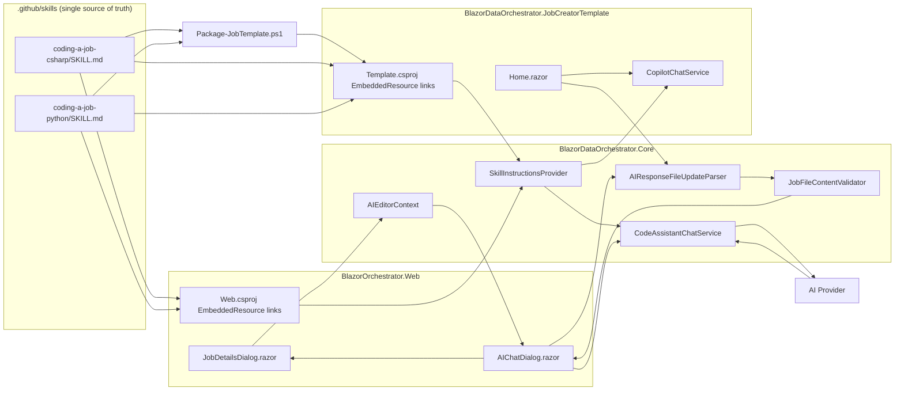
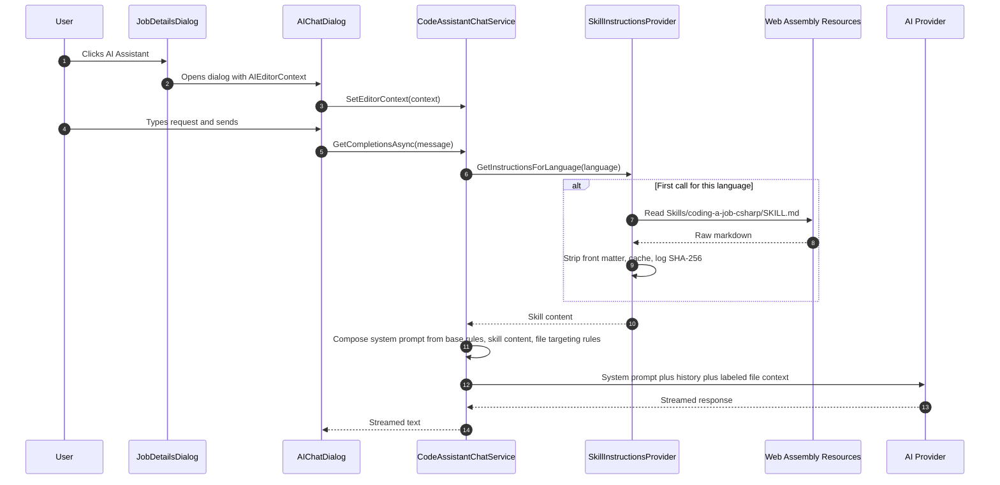
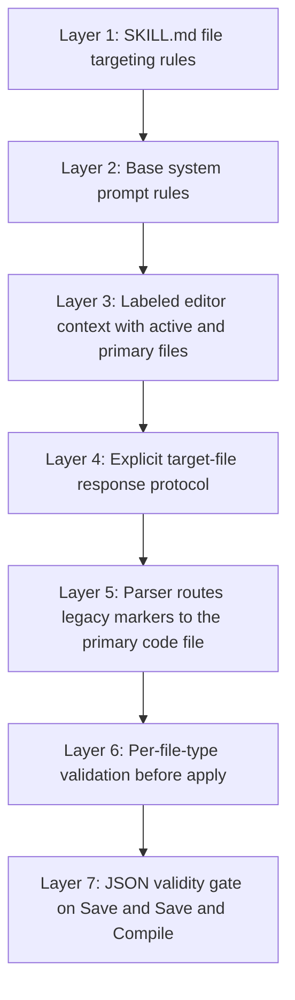
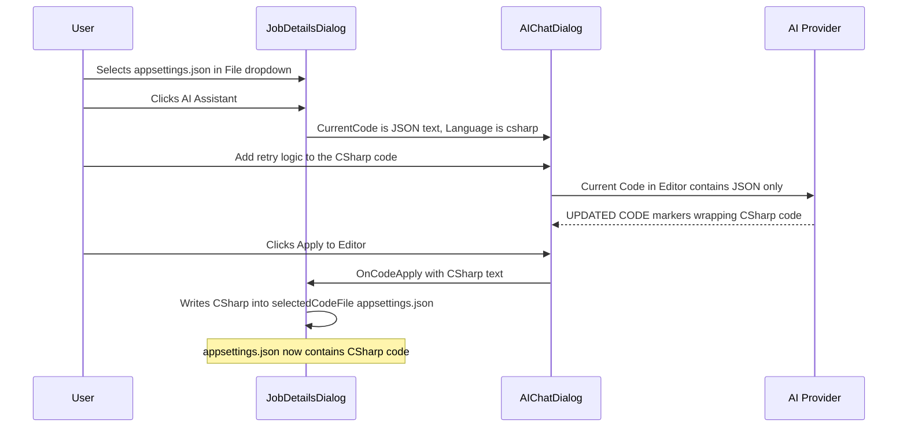
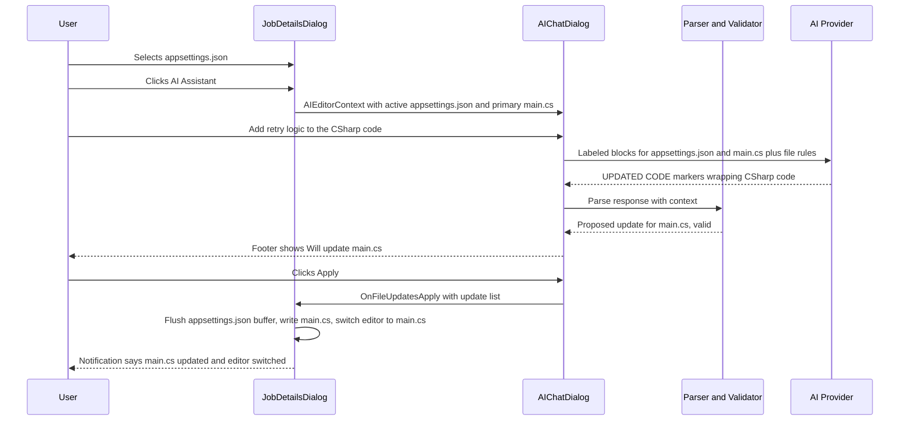
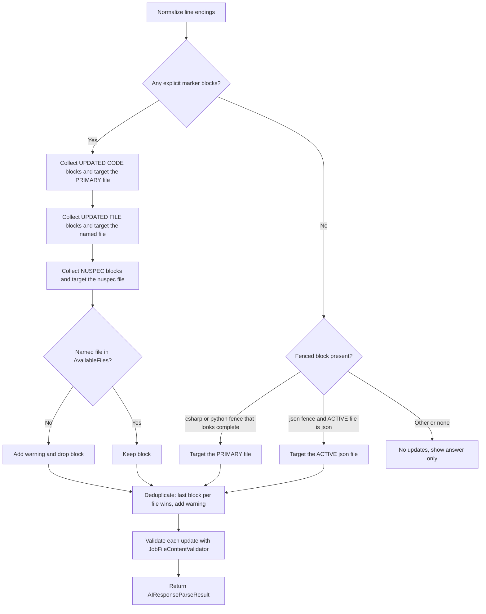
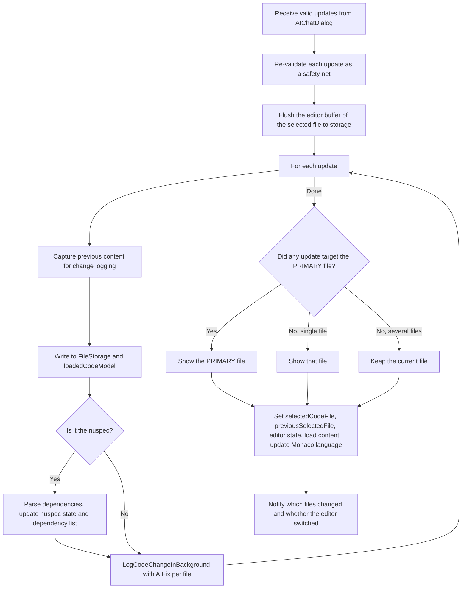
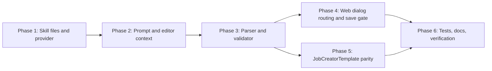

# AI Skill Injection and File-Targeting Safety Plan

## 1. Overview

This plan covers two related improvements to the AI Code Assistant used to write job code.

| # | Feature | Summary |
|---|---------|---------|
| 1 | **Skill file injection** | When a user invokes the AI in the web project (and in the JobCreatorTemplate), the full content of the `.github/skills/*/SKILL.md` files must be injected into the AI system prompt so the model writes code that follows the current rules. |
| 2 | **File-targeting bug fix** | In the web **Job → Code** tab, with `appsettings.json` selected, asking the AI to change the C# code caused the C# code to be written **into `appsettings.json`**. The skill instructions, the prompt context, and the apply pipeline must be hardened so code is never written into `.json` files and every `.json` file stays valid JSON. |

### 1.1 Goals

- `SKILL.md` becomes the **single source of truth** for AI coding instructions (C# and Python).
- The web project's AI chat (`CodeAssistantChatService`) and the JobCreatorTemplate's AI chat (`CopilotChatService`) both inject the same embedded `SKILL.md` content.
- The AI always knows **which file is open**, **which file is the primary code file**, and **which files exist**.
- AI responses identify their **target file** explicitly. Code is routed to `main.cs` / `main.py` even when a `.json` file is selected, and the editor switches to that file.
- Every proposed write is **validated by file type** before it is applied. C# code can never land in a `.json` file, and malformed JSON can never be applied or saved.

### 1.2 Non-Goals

- Changing AI providers, model selection, or AI settings UI.
- Changing how the Agent executes jobs at runtime.
- Adding new Copilot agent skills beyond the two existing ones.

### 1.3 Decisions Confirmed With the Product Owner

| Question | Decision |
|----------|----------|
| "Ensure all .json files are valid xml" | Means **valid JSON**. `.json` content is validated as strict JSON before it is applied or saved. |
| Source of AI instructions | `.github/skills/<skill>/SKILL.md` is the **single source of truth**. Embed it directly and **delete** the stale `Resources/*.instructions.md` copies. |
| AI asked to change C# while `appsettings.json` is selected | **Route it.** The AI tags the target file, the change is applied to `main.cs` / `main.py`, and the editor switches to that file. |
| Scope | Web project **and** `BlazorDataOrchestrator.JobCreatorTemplate` (`CopilotChatService` + `Home.razor`). |

---

## 2. Current State (Findings)

### 2.1 Instruction sources today

| Location | Size | Used by | Problem |
|----------|------|---------|---------|
| `.github/skills/coding-a-job-csharp/SKILL.md` | ~23.8 KB | Nothing at runtime | The authoritative, up-to-date rules are **never sent to the AI**. |
| `.github/skills/coding-a-job-python/SKILL.md` | ~20.5 KB | Nothing at runtime | Same as above. |
| `src/BlazorDataOrchestrator.Core/Resources/csharp.instructions.md` | ~9.4 KB | Web `EmbeddedInstructionsProvider` → `CodeAssistantChatService` | Stale copy (different hash). |
| `src/BlazorDataOrchestrator.Core/Resources/python.instructions.md` | ~9.4 KB | Same | Stale copy. |
| `src/BlazorDataOrchestrator.JobCreatorTemplate/Resources/*.instructions.md` | ~9.4 KB | `CopilotChatService` tier 1 ("local Resources folder") | Stale copy, and it **always wins** because the file exists in the content root. |
| `CopilotChatService` tier 3 fallback | n/a | n/a | Looks for `.github/skills/csharp.instructions.md`, a path that **does not exist**. |

### 2.2 How the web AI chat is wired today

- `Program.cs` registers `IInstructionsProvider` → `EmbeddedInstructionsProvider` (singleton) and `IAIChatService` → `CodeAssistantChatService` (scoped).
- `CodeAssistantChatService.BuildSystemPrompt()` = `BaseSystemPrompt` + `"## Custom Instructions for Code Generation"` + embedded instructions.
- `ProcessAIRequestAsync()` prefixes the latest user message with `## Current Code in Editor:` and an **unlabeled** code fence containing whatever text is in the editor.

### 2.3 Root cause of the `appsettings.json` bug

| Step | Code | What goes wrong |
|------|------|-----------------|
| Open AI dialog | `JobDetailsDialog.OpenAIChatDialogWithPrompt()` | `currentJobCode` = content of the **selected file** (`appsettings.json`). |
| Provide context | `<AIChatDialog CurrentCode="@currentJobCode" Language="@codeLanguage" />` | The dialog receives the JSON text but `Language="csharp"`. **No file name** is passed. |
| Build prompt | `CodeAssistantChatService.ProcessAIRequestAsync()` | The AI sees "Current Code in Editor" (actually JSON) and is told to return updated C# code. It cannot tell which file it is editing. |
| Extract response | `AIChatDialog.ExtractCodeFromResponse()` | Takes the text between `###UPDATED CODE BEGIN###` / `END###` with no target file. |
| Apply | `JobDetailsDialog.OnAICodeApplied()` | Writes the code to `selectedCodeFile`, which is `appsettings.json`. **No type validation.** |

The JobCreatorTemplate has the same latent defect: `Home.razor` → `ApplyCodeUpdateAsync(code)` writes AI output into whatever file is open in the editor.

Two smaller related defects found during analysis:

- `OnAICodeApplied()` only finds a `###NUSPEC BEGIN###` block if it is **inside** the code markers. A NUSPEC block placed after `###UPDATED CODE END###` (as the instructions describe) is silently lost.
- `SaveAndCompileCode()` falls back to `currentJobCode` when `main.cs` is missing from storage (`FileStorage.GetFile(JobId, mainFileName) ?? currentJobCode`), so it could compile JSON as C#.

### 2.4 Build and packaging constraints

| Build | Context | Impact on design |
|-------|---------|------------------|
| Agent container (`src/BlazorOrchestrator.Agent/Dockerfile`) | Build context is `src/`. It copies `Core/`, `Agent/`, `ServiceDefaults/` only. | `Core.csproj` **must not** reference files under `.github/`; the Agent build would fail. Skill files must be embedded in **host** projects, not Core. |
| Web (`AddProject` + `PublishAsAzureContainerApp`) | Built from the repo working tree by the .NET SDK. | `Web.csproj` **can** link `..\..\.github\skills\**`. |
| JobCreatorTemplate zip (`scripts/Package-JobTemplate.ps1`) | Stages only the template folder. The extracted project has no `.github/`. | The packaging script must **copy** the SKILL.md files into the staged template, and the template csproj must embed from either location. |
| Template zip freshness (`Web.csproj` `PackageJobTemplate` target) | Rebuilds the zip when the hash of `JobTemplateInputs` changes. | Add `.github/skills/**/SKILL.md` to `JobTemplateInputs`. |

---

## 3. Target Architecture



### 3.1 New and changed components

| Component | Project | Type | Responsibility |
|-----------|---------|------|----------------|
| `SkillInstructionsProvider` | Core | **New** class implementing `IInstructionsProvider` | Loads `SKILL.md` content from embedded resources of a **host-supplied assembly**, strips YAML front matter, caches, logs source and hash. |
| `EmbeddedInstructionsProvider` | Core | **Deleted** | Replaced by `SkillInstructionsProvider`. |
| `Resources/*.instructions.md` | Core, JobCreatorTemplate | **Deleted** | Stale copies. |
| `AIEditorContext` | Core (`Models/AI`) | **New** record | Active file, primary code file, available files, nuspec, language. |
| `IAIChatService.SetEditorContext()` | Core | **New** member | Replaces `SetCurrentEditorCode` + `SetLanguage` as the primary API. |
| `ProposedFileUpdate`, `FileValidationResult` | Core (`Models/AI`) | **New** records | Parsed and validated file writes. |
| `AIResponseFileUpdateParser` | Core (`Services/AI`) | **New** static class | Converts an AI response into a list of `ProposedFileUpdate`. |
| `JobFileContentValidator` | Core (`Services/AI`) | **New** static class | Per-file-type validation and content-kind mismatch detection. |
| `ContentKindDetector` | Core (`Services/AI`) | **New** internal static class | Heuristic detection of JSON / XML / C# / Python content. |
| `CodeAssistantChatService` | Core | Changed | New prompt composition with skill content and labeled file context. |
| `CopilotChatService` | JobCreatorTemplate | Changed | Uses `SkillInstructionsProvider`, drops stale tiers, uses `AIEditorContext`. |
| `AIChatDialog.razor` | Web | Changed | Accepts `AIEditorContext`, uses the parser and validator, shows target files, emits `ProposedFileUpdate` list. |
| `JobDetailsDialog.razor` | Web | Changed | Builds `AIEditorContext`, routes updates to target files, switches the editor, adds a JSON save gate. |
| `Home.razor` | JobCreatorTemplate | Changed | Same routing and validation as the web dialog. |
| `.github/skills/*/SKILL.md` | Repo | Changed | New "File Targeting and File-Type Rules" section, cleanup of stale content, YAML front matter. |
| `Web.csproj`, `JobCreatorTemplate.csproj`, `Core.csproj` | Build | Changed | Embed / remove resources, build guard. |
| `scripts/Package-JobTemplate.ps1` | Build | Changed | Stage `SKILL.md` files into the template zip. |

---

## 4. Feature 1 — Inject `SKILL.md` Content Into the AI Prompt

### 4.1 Process flow



### 4.2 Make `SKILL.md` the single source of truth

1. Delete:
   - `src/BlazorDataOrchestrator.Core/Resources/csharp.instructions.md`
   - `src/BlazorDataOrchestrator.Core/Resources/python.instructions.md`
   - `src/BlazorDataOrchestrator.JobCreatorTemplate/Resources/csharp.instructions.md`
   - `src/BlazorDataOrchestrator.JobCreatorTemplate/Resources/python.instructions.md`
   - `src/BlazorDataOrchestrator.Core/Services/EmbeddedInstructionsProvider.cs`
2. Remove the matching `<EmbeddedResource>` items from `BlazorDataOrchestrator.Core.csproj` and `BlazorDataOrchestrator.JobCreatorTemplate.csproj`.
3. Search for any remaining references (`instructions.md`, `EmbeddedInstructionsProvider`) and update them, including docs and tests.

### 4.3 Resource naming convention

Every host embeds the skills with **identical logical names** so one provider works everywhere:

| Language | Logical resource name |
|----------|-----------------------|
| C# | `Skills/coding-a-job-csharp/SKILL.md` |
| Python | `Skills/coding-a-job-python/SKILL.md` |

Define these once in Core:

```csharp
namespace BlazorDataOrchestrator.Core.Services;

public static class SkillResourceNames
{
    public const string CSharp = "Skills/coding-a-job-csharp/SKILL.md";
    public const string Python = "Skills/coding-a-job-python/SKILL.md";

    public static string ForLanguage(string? language) =>
        language?.Trim().ToLowerInvariant() switch
        {
            "python" or "py" => Python,
            _ => CSharp
        };
}
```

### 4.4 Web project build wiring (`BlazorOrchestrator.Web.csproj`)

```xml
<PropertyGroup>
  <AISkillsRoot>$(MSBuildProjectDirectory)\..\..\.github\skills</AISkillsRoot>
</PropertyGroup>

<ItemGroup>
  <EmbeddedResource Include="$(AISkillsRoot)\coding-a-job-csharp\SKILL.md"
                    LogicalName="Skills/coding-a-job-csharp/SKILL.md"
                    Link="Skills\coding-a-job-csharp\SKILL.md" />
  <EmbeddedResource Include="$(AISkillsRoot)\coding-a-job-python\SKILL.md"
                    LogicalName="Skills/coding-a-job-python/SKILL.md"
                    Link="Skills\coding-a-job-python\SKILL.md" />
</ItemGroup>

<!-- Fail fast instead of shipping an AI assistant with no instructions. -->
<Target Name="EnsureAISkillFiles" BeforeTargets="BeforeBuild">
  <Error Condition="!Exists('$(AISkillsRoot)\coding-a-job-csharp\SKILL.md')"
         Text="Missing AI skill file: $(AISkillsRoot)\coding-a-job-csharp\SKILL.md" />
  <Error Condition="!Exists('$(AISkillsRoot)\coding-a-job-python\SKILL.md')"
         Text="Missing AI skill file: $(AISkillsRoot)\coding-a-job-python\SKILL.md" />
</Target>
```

Also add the skills to the template zip hash inputs so the zip rebuilds when a skill changes:

```xml
<JobTemplateInputs Include="$(MSBuildProjectDirectory)\..\..\.github\skills\**\SKILL.md" />
```

> **Do not** add the skill files to `BlazorDataOrchestrator.Core.csproj`. The Agent Dockerfile uses `src/` as its build context and cannot see `.github/`.

### 4.5 JobCreatorTemplate build wiring

The template must build both inside the repo and after extraction from the zip, where `.github/` does not exist.

**`BlazorDataOrchestrator.JobCreatorTemplate.csproj`:**

```xml
<PropertyGroup>
  <RepoAISkillsRoot>$(MSBuildProjectDirectory)\..\..\.github\skills</RepoAISkillsRoot>
  <LocalAISkillsRoot>$(MSBuildProjectDirectory)\Skills</LocalAISkillsRoot>
  <AISkillsRoot Condition="Exists('$(RepoAISkillsRoot)\coding-a-job-csharp\SKILL.md')">$(RepoAISkillsRoot)</AISkillsRoot>
  <AISkillsRoot Condition="'$(AISkillsRoot)' == ''">$(LocalAISkillsRoot)</AISkillsRoot>
</PropertyGroup>

<ItemGroup>
  <EmbeddedResource Include="$(AISkillsRoot)\coding-a-job-csharp\SKILL.md"
                    LogicalName="Skills/coding-a-job-csharp/SKILL.md"
                    Link="Skills\coding-a-job-csharp\SKILL.md" />
  <EmbeddedResource Include="$(AISkillsRoot)\coding-a-job-python\SKILL.md"
                    LogicalName="Skills/coding-a-job-python/SKILL.md"
                    Link="Skills\coding-a-job-python\SKILL.md" />
  <!-- Prevent the staged copy from also being picked up as Content/None. -->
  <None Remove="Skills\**" />
  <Content Remove="Skills\**" />
</ItemGroup>

<Target Name="EnsureAISkillFiles" BeforeTargets="BeforeBuild">
  <Error Condition="!Exists('$(AISkillsRoot)\coding-a-job-csharp\SKILL.md')"
         Text="Missing AI skill file for C#. Expected under $(RepoAISkillsRoot) or $(LocalAISkillsRoot)." />
  <Error Condition="!Exists('$(AISkillsRoot)\coding-a-job-python\SKILL.md')"
         Text="Missing AI skill file for Python. Expected under $(RepoAISkillsRoot) or $(LocalAISkillsRoot)." />
</Target>
```

**`scripts/Package-JobTemplate.ps1`:** after staging the template folder, copy the skills:

```powershell
# Stage AI skill files so the extracted template can embed them without the repo's .github folder.
$skillsSource = Join-Path $PSScriptRoot '..\.github\skills'
foreach ($skill in @('coding-a-job-csharp', 'coding-a-job-python')) {
    $src = Join-Path $skillsSource "$skill\SKILL.md"
    if (-not (Test-Path $src)) { throw "Missing AI skill file: $src" }
    $destDir = Join-Path $templateDir "Skills\$skill"
    New-Item -ItemType Directory -Path $destDir -Force | Out-Null
    Copy-Item -LiteralPath $src -Destination (Join-Path $destDir 'SKILL.md') -Force
    Write-Host "  Included Skills/$skill/SKILL.md"
}
```

Add `Skills/` to the repo's `.gitignore` under the template folder so a locally staged copy is never committed:

```text
src/BlazorDataOrchestrator.JobCreatorTemplate/Skills/
```

### 4.6 `SkillInstructionsProvider` (Core)

`IInstructionsProvider` keeps its existing members so existing callers compile. Add one diagnostic member.

```csharp
public interface IInstructionsProvider
{
    string GetCSharpInstructions();
    string GetPythonInstructions();
    string GetInstructionsForLanguage(string language);

    /// <summary>Returns metadata about the loaded skill (resource name, length, SHA-256) for logging and diagnostics.</summary>
    SkillInstructionsInfo GetInfo(string language);
}

public sealed record SkillInstructionsInfo(string ResourceName, bool Found, int Length, string Sha256);
```

```csharp
using System.Collections.Concurrent;
using System.Reflection;
using System.Security.Cryptography;
using System.Text;
using System.Text.RegularExpressions;
using Microsoft.Extensions.Logging;

namespace BlazorDataOrchestrator.Core.Services;

/// <summary>
/// Loads AI coding instructions from SKILL.md files embedded in the host assembly.
/// The host (Web or JobCreatorTemplate) embeds the files; Core only reads them, so the
/// Agent container build (src/ context) never needs access to .github/.
/// </summary>
public sealed partial class SkillInstructionsProvider : IInstructionsProvider
{
    private readonly Assembly _resourceAssembly;
    private readonly ILogger<SkillInstructionsProvider>? _logger;
    private readonly ConcurrentDictionary<string, (string Content, SkillInstructionsInfo Info)> _cache = new();

    public SkillInstructionsProvider(Assembly resourceAssembly, ILogger<SkillInstructionsProvider>? logger = null)
    {
        _resourceAssembly = resourceAssembly;
        _logger = logger;
    }

    public string GetCSharpInstructions() => Load(SkillResourceNames.CSharp).Content;
    public string GetPythonInstructions() => Load(SkillResourceNames.Python).Content;
    public string GetInstructionsForLanguage(string language) => Load(SkillResourceNames.ForLanguage(language)).Content;
    public SkillInstructionsInfo GetInfo(string language) => Load(SkillResourceNames.ForLanguage(language)).Info;

    private (string Content, SkillInstructionsInfo Info) Load(string resourceName) =>
        _cache.GetOrAdd(resourceName, name =>
        {
            using var stream = _resourceAssembly.GetManifestResourceStream(name);
            if (stream is null)
            {
                _logger?.LogError("AI skill resource {Resource} is not embedded in {Assembly}. The AI will run without project instructions.",
                    name, _resourceAssembly.GetName().Name);
                return (string.Empty, new SkillInstructionsInfo(name, false, 0, string.Empty));
            }

            using var reader = new StreamReader(stream, Encoding.UTF8);
            var content = StripFrontMatter(reader.ReadToEnd()).Trim();
            var sha = Convert.ToHexString(SHA256.HashData(Encoding.UTF8.GetBytes(content)))[..12];

            _logger?.LogInformation("Loaded AI skill {Resource} ({Length} chars, sha256 {Sha})", name, content.Length, sha);
            return (content, new SkillInstructionsInfo(name, true, content.Length, sha));
        });

    internal static string StripFrontMatter(string markdown) =>
        FrontMatterRegex().Replace(markdown, string.Empty, 1);

    [GeneratedRegex(@"\A\s*---\r?\n.*?\r?\n---\r?\n", RegexOptions.Singleline)]
    private static partial Regex FrontMatterRegex();
}
```

Design notes:

- **Front matter is stripped** because it is Copilot-skill metadata, not instructions (see section 6.1).
- **A missing resource is logged at Error** rather than thrown, so a misconfigured host still loads. The build guards in 4.4 and 4.5 plus the tests in section 8 prevent this in practice.
- The cache is per instance and the provider is a singleton, so each file is read once per process.

### 4.7 DI registration

**Web `Program.cs`:**

```csharp
builder.Services.AddSingleton<IInstructionsProvider>(sp =>
    new SkillInstructionsProvider(
        typeof(Program).Assembly,
        sp.GetService<ILogger<SkillInstructionsProvider>>()));
```

**JobCreatorTemplate `Program.cs`:** use the same registration with the template's `Program` assembly. Change the `CopilotChatService` constructor parameter from `EmbeddedInstructionsProvider` to `IInstructionsProvider`.

### 4.8 Prompt composition in `CodeAssistantChatService`

Replace `BuildSystemPrompt` so the order is deterministic and the skill content is clearly delimited:

```text
[BaseSystemPrompt]                      (general behavior + response formatting)
[FileTargetingRules]                    (new constant, short, always present; see 5.4)
## Project Skill: coding-a-job-csharp   (header names the skill)
<!-- BEGIN SKILL -->
...full SKILL.md content...
<!-- END SKILL -->
```

```csharp
internal string BuildSystemPrompt()
{
    var sb = new StringBuilder();
    sb.AppendLine(BaseSystemPrompt);
    sb.AppendLine();
    sb.AppendLine(FileTargetingRules);

    var info = _instructionsProvider.GetInfo(_editorContext.Language);
    var skill = _instructionsProvider.GetInstructionsForLanguage(_editorContext.Language);
    if (!string.IsNullOrWhiteSpace(skill))
    {
        var skillName = Path.GetFileName(Path.GetDirectoryName(info.ResourceName));
        sb.AppendLine();
        sb.AppendLine($"## Project Skill: {skillName}");
        sb.AppendLine("The following skill is authoritative. Follow it exactly.");
        sb.AppendLine("<!-- BEGIN SKILL -->");
        sb.AppendLine(skill);
        sb.AppendLine("<!-- END SKILL -->");
    }
    else
    {
        _logger?.LogWarning("No AI skill content for {Language}; prompt contains base rules only.", _editorContext.Language);
    }

    return sb.ToString();
}
```

- Mark it `internal` so `BlazorDataOrchestrator.Core.Tests` (already in `InternalsVisibleTo`) can assert on it.
- Remove the unused `isNewSession` parameter.
- Log `info.Sha256` at Debug level on each request so support can confirm which skill version answered. **Never log the full prompt or user code.**

### 4.9 Prompt size considerations

| Item | Approx. size |
|------|--------------|
| `BaseSystemPrompt` + `FileTargetingRules` | ~2.5 KB |
| C# `SKILL.md` | ~24 KB (~6k tokens) |
| Python `SKILL.md` | ~21 KB (~5k tokens) |

This fits within every supported provider's context window. Keep the existing "last 10 messages" history cap. If a provider later reports context overflow, a follow-up can trim the `OnRunCode` "Execution Logic" section (see 6.2), which describes the host harness rather than how to write a job.

### 4.10 JobCreatorTemplate `CopilotChatService` alignment

1. Replace the three-tier `GetLanguageInstructionsAsync()` with a call to the injected `IInstructionsProvider`:
   - Remove tier 1 (`ContentRoot/Resources/*.instructions.md`). It served stale files.
   - Remove tier 3 (`.github/skills/<lang>.instructions.md`). The path never existed.
2. Compose the system prompt with the same structure as 4.8. Extract the shared composition into a Core helper, `AIPromptComposer.Compose(string basePrompt, IInstructionsProvider provider, AIEditorContext context)`, so both services produce identical skill and targeting sections.
3. Keep `SystemMessageMode.Append` for the Copilot SDK session.
4. Because Copilot sessions are cached by `sessionId`, a **language change must start a new session** (or call `RefreshClient`/clear the session) so the new skill is applied. Today `SetLanguage` only clears the cached instructions string.

---

## 5. Feature 2 — Never Write Code Into `.json` Files

### 5.1 Defense-in-depth strategy



Layers 1 to 4 make the model **less likely** to produce a wrong target. Layers 5 to 7 make it **impossible** for a wrong target to reach storage, regardless of what the model returns.

### 5.2 Bug sequence today versus after the fix

**Today:**



**After the fix:**



### 5.3 Skill file enhancements (Layer 1)

Insert a new section at the **top** of each `SKILL.md`, immediately after the `#` title, so it carries the most weight.

#### 5.3.1 Text to add to `.github/skills/coding-a-job-csharp/SKILL.md`

````markdown
## 0. File Targeting and File-Type Rules (READ FIRST)

Every request includes an **Editor Context** that lists the job's files and marks:

* the **Active File**: the file currently open in the editor, and
* the **Primary Code File**: `main.cs`, where all C# job code lives.

The Active File is **not** automatically the file you should change. Decide the target from the user's request.

### Where each kind of content belongs

| Content | Allowed file(s) |
|---|---|
| C# code (classes, methods, `using` directives, `// NUGET:` headers) | `main.cs` (or another `.cs` file listed in the Editor Context) |
| Runtime configuration (connection strings, API keys, feature flags) | `appsettings.json`, `appsettings.Development.json`, `appsettings.Staging.json`, `appsettings.Production.json` |
| NuGet package manifest | the `.nuspec` file listed in the Editor Context |

### Hard rules

1. **NEVER** write C# code, or code of any kind, into a `.json`, `.nuspec`, or `.txt` file.
2. If the user asks to change code, logic, behavior, error handling, logging, or packages, change **`main.cs`**, even when the Active File is a `.json` file.
3. Change a `.json` file **only** when the user explicitly asks to change settings or configuration.
4. Every `.json` file you output **must be strictly valid JSON (RFC 8259)**:
   * a single root object `{ ... }`
   * property names and string values in **double quotes**
   * **no** comments (`//` or `/* */`)
   * **no** trailing commas
   * **no** code, markdown, or ellipses (`...`)
   * escape backslashes and quotes inside strings (`"C:\\temp"`, `"say \"hi\""`)
5. In appsettings files, keep the reserved connection strings `blobs`, `queues`, `tables`, and `blazororchestratordb` **present and blank** (`""`). Never delete them.
6. Always return the **complete** content of every file you change. Never return a diff, a fragment, or placeholders such as `// ... existing code ...`.
7. Only use file names that appear in the Editor Context. Do not invent new files.

### Output format

* **C# code for `main.cs`**: wrap the full file in `###UPDATED CODE BEGIN###` and `###UPDATED CODE END###`. These markers **always** mean `main.cs`, whatever file is active.
* **Any other file**: wrap the full file in `###UPDATED FILE BEGIN: <file name>###` and `###UPDATED FILE END###`, using the exact file name from the Editor Context.
* **`.nuspec`**: use `###NUSPEC BEGIN###` and `###NUSPEC END###` as described in section 1b.
* Put a fenced code block with the correct language (`csharp`, `json`, `xml`) **inside** each marker pair.
* Emit one block per changed file. Do not emit a block for a file you did not change.

Example: the user asks for a new API key setting **and** code that reads it:

###UPDATED CODE BEGIN###
```csharp
// full main.cs here
```
###UPDATED CODE END###

###UPDATED FILE BEGIN: appsettings.json###
```json
{
  "ConnectionStrings": {
    "blobs": "",
    "queues": "",
    "tables": "",
    "blazororchestratordb": ""
  },
  "WeatherApi": {
    "ApiKey": ""
  }
}
```
###UPDATED FILE END###

### Self-check before you respond

* [ ] Is every block of C# code inside `###UPDATED CODE BEGIN###` (main.cs) or a `.cs` file block?
* [ ] Did I avoid putting any code in a `.json` file?
* [ ] Would every `.json` block pass a strict JSON parser?
* [ ] Did I return complete files only for the files I changed?
````

#### 5.3.2 Text to add to `.github/skills/coding-a-job-python/SKILL.md`

Use the same section with these substitutions:

| C# version | Python version |
|------------|----------------|
| Primary Code File `main.cs` | Primary Code File `main.py` |
| "C# code (classes, methods, `using` directives, `// NUGET:` headers)" | "Python code (functions, classes, imports, `# ADD TO REQUIREMENTS.txt:` headers)" |
| NuGet package manifest → `.nuspec` | Python package list → `requirements.txt` (one `package==version` per line, no code) |
| Rule 2 "change `main.cs`" | "change `main.py`" |
| `###UPDATED CODE BEGIN###` "always mean `main.cs`" | "always mean `main.py`" |
| `.nuspec` output bullet | "**`requirements.txt`**: use `###UPDATED FILE BEGIN: requirements.txt###`" |
| Fence languages `csharp`, `json`, `xml` | `python`, `json`, `text` |
| Example code block `csharp` / `main.cs` | `python` / `main.py` |

### 5.4 Base system prompt additions (Layer 2)

Add a `FileTargetingRules` constant to `CodeAssistantChatService` (and use it from `AIPromptComposer`). It is short and language-neutral, so the rules still apply if a skill fails to load:

```csharp
private const string FileTargetingRules = @"## File Targeting Rules (always apply)
- The user message contains an Editor Context listing job files, the ACTIVE file, and the PRIMARY code file.
- Code changes go to the PRIMARY code file, even when a .json file is ACTIVE.
- Never put source code inside .json, .nuspec, or .txt files.
- Every .json file you output must be strictly valid JSON: one root object, double-quoted names and strings, no comments, no trailing commas.
- ###UPDATED CODE BEGIN### / ###UPDATED CODE END### always targets the PRIMARY code file.
- For any other file use ###UPDATED FILE BEGIN: <exact file name>### / ###UPDATED FILE END###.
- Return complete file contents only for files you changed.";
```

Update the existing `BaseSystemPrompt` sentence "When the response is a code update ... surround the full code with the markers" to say "...the full **primary code file**...".

### 5.5 Editor context model and prompt format (Layer 3)

#### 5.5.1 `AIEditorContext` (Core)

```csharp
namespace BlazorDataOrchestrator.Core.Models.AI;

public sealed record AIEditorContext
{
    public required string Language { get; init; }                 // "csharp" | "python"
    public required string ActiveFileName { get; init; }           // e.g. "appsettings.json"
    public required string ActiveFileContent { get; init; }        // current editor buffer
    public required string PrimaryCodeFileName { get; init; }      // "main.cs" | "main.py"
    public required string PrimaryCodeContent { get; init; }       // from storage, or buffer if active
    public IReadOnlyList<string> AvailableFiles { get; init; } = [];
    public string? NuspecFileName { get; init; }
    public string? NuspecContent { get; init; }

    public bool ActiveIsPrimary =>
        string.Equals(ActiveFileName, PrimaryCodeFileName, StringComparison.OrdinalIgnoreCase);

    public static AIEditorContext ForSingleFile(string language, string code)
    {
        var primary = string.Equals(language, "python", StringComparison.OrdinalIgnoreCase) ? "main.py" : "main.cs";
        return new()
        {
            Language = language,
            ActiveFileName = primary,
            ActiveFileContent = code,
            PrimaryCodeFileName = primary,
            PrimaryCodeContent = code,
            AvailableFiles = [primary]
        };
    }
}
```

#### 5.5.2 `IAIChatService` changes

```csharp
public interface IAIChatService
{
    void SetEditorContext(AIEditorContext context);

    [Obsolete("Use SetEditorContext. Kept for callers that only have a single code buffer.")]
    void SetCurrentEditorCode(string code);

    [Obsolete("Use SetEditorContext.")]
    void SetLanguage(string language);

    // ...existing members unchanged
}
```

The obsolete members map to `AIEditorContext.ForSingleFile(...)` so existing callers keep working. `CopilotChatService` also implements the Core interface and must implement `SetEditorContext`.

#### 5.5.3 Prompt format for the latest user message

`ProcessAIRequestAsync()` replaces the unlabeled `## Current Code in Editor:` block with labeled file blocks. A helper, `EditorContextFormatter.Format(AIEditorContext ctx)`, keeps this testable:

````text
## Editor Context
Job files:
- main.cs  (PRIMARY code file)
- appsettings.json  (ACTIVE in editor)
- appsettings.Development.json
- appsettings.Staging.json
- appsettings.Production.json
- BlazorDataOrchestrator.Job.nuspec

### ACTIVE file: appsettings.json (json)
```json
{ ...current buffer... }
```

### PRIMARY code file: main.cs (csharp)
```csharp
...main.cs content...
```

### NuGet manifest: BlazorDataOrchestrator.Job.nuspec (xml)
```xml
...nuspec content...
```

## User Request:
Add retry logic to the HTTP call.
````

Rules:

- When `ActiveIsPrimary` is true, emit the primary block once and label it `(PRIMARY code file, ACTIVE in editor)`.
- When the active file is the `.nuspec`, emit it once as ACTIVE and skip the separate manifest block.
- The fence language comes from the file extension (`.cs` → `csharp`, `.py` → `python`, `.json` → `json`, `.nuspec` → `xml`, `.txt` → `text`), never from the job language.
- Replace the `// === Current .nuspec content ===` concatenation in `AIChatDialog.BuildEditorContextWithNuspec()`, which appended XML to C# and also confused the model.

### 5.6 Response protocol (Layer 4)

| Marker pair | Target file | Notes |
|-------------|-------------|-------|
| `###UPDATED CODE BEGIN###` … `###UPDATED CODE END###` | **Always** `PrimaryCodeFileName` | Backward compatible. Never the active file. |
| `###UPDATED FILE BEGIN: <name>###` … `###UPDATED FILE END###` | `<name>` | Name must match an entry in `AvailableFiles` (case-insensitive) or the block is rejected. |
| `###NUSPEC BEGIN###` … `###NUSPEC END###` | `NuspecFileName` (default `BlazorDataOrchestrator.Job.nuspec`) | Now found **anywhere** in the response, not only inside the code markers. C# only. |

Marker regexes, multiline and case-sensitive on the marker text:

```csharp
const string PrimaryBlock = @"###UPDATED CODE BEGIN###\s*(?<body>.*?)\s*###UPDATED CODE END###";
const string NamedBlock   = @"###UPDATED FILE BEGIN:\s*(?<name>[^#\r\n]+?)\s*###\s*(?<body>.*?)\s*###UPDATED FILE END###";
const string NuspecBlock  = @"###NUSPEC BEGIN###\s*(?<body>.*?)\s*###NUSPEC END###";
```

Each body has one surrounding fenced block stripped (opening ```` ```lang ```` and closing ```` ``` ````), the same as `ExtractCodeFromResponse` does today.

### 5.7 `AIResponseFileUpdateParser` (Layer 5)

```csharp
namespace BlazorDataOrchestrator.Core.Models.AI;

public enum FileUpdateSource { PrimaryCodeMarkers, NamedFileMarkers, NuspecMarkers, FencedBlockFallback }

public sealed record ProposedFileUpdate(
    string FileName,
    string Content,
    FileUpdateSource Source,
    FileValidationResult Validation);

public sealed record FileValidationResult(
    bool IsValid,
    IReadOnlyList<string> Errors,
    IReadOnlyList<string> Warnings)
{
    public static FileValidationResult Ok(params string[] warnings) => new(true, [], warnings);
    public static FileValidationResult Fail(params string[] errors) => new(false, errors, []);
}

public sealed record AIResponseParseResult(
    IReadOnlyList<ProposedFileUpdate> Updates,
    IReadOnlyList<string> Warnings)
{
    public bool HasApplicableUpdates => Updates.Any(u => u.Validation.IsValid);
}
```

```csharp
namespace BlazorDataOrchestrator.Core.Services.AI;

public static class AIResponseFileUpdateParser
{
    public static AIResponseParseResult Parse(string response, AIEditorContext context,
        IReadOnlyDictionary<string, string>? previousContents = null);
}
```

Algorithm:



Rules:

- The **legacy marker never targets the active file.** This single rule fixes the reported bug even if the model ignores every instruction.
- The fallback "looks complete" heuristic stays as today (`class `, `def `, `public static`, `namespace `, or at least 10 lines). It targets **only** the primary file.
- A `json` fence fallback is accepted only when the active file is a `.json` file. Otherwise no Apply is offered.
- If multiple blocks target the same file, keep the **last** one and add a warning.
- File name matching is case-insensitive, but the update uses the canonical name from `AvailableFiles`.
- The parser is pure (no I/O) so it is fully unit-testable.

### 5.8 `JobFileContentValidator` (Layer 6)

```csharp
public static class JobFileContentValidator
{
    public static FileValidationResult Validate(string fileName, string content, string language,
        string? previousContent = null);
}
```

#### 5.8.1 Content-kind detection (`ContentKindDetector`)

| Kind | Detection heuristic (evaluated in order on trimmed content) |
|------|-------------------------------------------------------------|
| `Json` | Starts with `{` or `[` **and** `JsonDocument.Parse` succeeds, or starts with `{` and contains `"…":` |
| `Xml` | Starts with `<?xml` or `<package` |
| `CSharp` | Multiline regex for `^\s*using\s+[\w.]+\s*;`, `^\s*namespace\s+`, `\b(public|internal)\s+(static\s+)?(sealed\s+)?class\s+\w+`, `^\s*//\s*(REQUIRES\s+)?NUGET:` |
| `Python` | Multiline regex for `^\s*def\s+\w+\(`, `^\s*(from\s+\S+\s+)?import\s+\w+`, `^\s*#\s*ADD TO REQUIREMENTS` |
| `Unknown` | None of the above |

#### 5.8.2 Rules by target file type

| Target | Blocking errors (Apply disabled) | Warnings (Apply allowed) |
|--------|----------------------------------|--------------------------|
| `*.json` | Detected kind is `CSharp`, `Python`, or `Xml` ("C# code cannot be written to appsettings.json"). `JsonDocument.Parse` fails with **default (strict) options**; report `JsonException.LineNumber` and `BytePositionInLine`. Root is not an object. Content is empty. | A reserved connection string (`blobs`, `queues`, `tables`, `blazororchestratordb`) that existed in `previousContent` is missing. A reserved connection string has a non-empty value (the host overwrites it). |
| `*.cs` | Detected kind is `Json` or `Xml`. Content is empty. | `CSharpSyntaxTree.ParseText` reports syntax errors (first 3 listed). The primary file lacks `class BlazorDataOrchestratorJob` or `ExecuteJob(`. |
| `*.py` | Detected kind is `Json`, `Xml`, or `CSharp`. Content is empty. | The primary file lacks `def execute_job(`. |
| `*.nuspec` | `XDocument.Parse` fails. Root element local name is not `package`. Detected kind is `CSharp` or `Python`. | No `<dependencies>` element. `targetFramework` is not `net10.0`. |
| `requirements.txt` | Detected kind is `CSharp`, `Json`, or `Xml`. | A non-comment line does not match `^[A-Za-z0-9_.\-\[\],]+\s*(==|>=|<=|~=|!=|>|<)?.*$`. A line uses a version operator other than `==`. |
| Other | Detected kind does not match the extension. | None. |

Strict JSON means `new JsonDocumentOptions { CommentHandling = JsonCommentHandling.Disallow, AllowTrailingCommas = false }`. This matches what the Python runner (`json.loads`) and the packaging script accept.

The validator uses `Microsoft.CodeAnalysis.CSharp`, which Core already references.

### 5.9 `AIChatDialog.razor` changes

| Area | Change |
|------|--------|
| Parameters | Replace `CurrentCode`, `NuspecContent`, and `Language` with `[Parameter, EditorRequired] public AIEditorContext EditorContext { get; set; }`. Replace `EventCallback<string> OnCodeApply` with `EventCallback<IReadOnlyList<ProposedFileUpdate>> OnFileUpdatesApply`. |
| Initialization | `OnInitialized` / `OnParametersSet` / `SendMessage` call `ChatService.SetEditorContext(EditorContext)`. Delete `BuildEditorContextWithNuspec()`. |
| Header | Keep the language badge. Add a chip: `Active: appsettings.json`. When the active file is not the primary file, add the hint "Code changes will be applied to main.cs". |
| Response handling | Replace `CheckForCodeUpdate`, `ExtractFallbackCodeBlock`, and `ExtractCodeFromResponse` with one call: `parseResult = AIResponseFileUpdateParser.Parse(response, EditorContext, previousContents)`. Keep `StripCodeMarkersForDisplay`, extended to strip the `UPDATED FILE` and `NUSPEC` markers. |
| Footer | List each proposed update: a check icon with "main.cs" for valid updates, and an error icon with "appsettings.json — Invalid JSON at line 4, position 12" for invalid ones. Show warnings in a collapsible list. |
| Apply button | Text is `Apply to main.cs` for one valid file, or `Apply 2 files` for several. Disabled when there are no valid updates. Only **valid** updates are emitted. |
| Ask AI to fix | When any update is invalid, show **Ask AI to fix** to send a follow-up: "Your previous response had these problems: … Return corrected complete files using the required markers." No automatic retry loops. |
| Dismiss | Clears `parseResult`. |

### 5.10 `JobDetailsDialog.razor` changes (routing)

#### 5.10.1 Building the context

```csharp
private async Task<AIEditorContext> BuildAIEditorContextAsync()
{
    var buffer = jobCodeEditor != null ? await jobCodeEditor.GetCodeAsync() ?? currentJobCode : currentJobCode;
    var primary = codeLanguage == "python" ? "main.py" : "main.cs";
    var active = selectedCodeFile ?? primary;

    string ReadFile(string name) =>
        string.Equals(name, active, StringComparison.OrdinalIgnoreCase) ? buffer
        : loadedCodeModel != null ? CodeEditorService.GetFileContent(loadedCodeModel, name)
        : FileStorage.GetFile(JobId, name) ?? "";

    var nuspecName = codeLanguage == "csharp"
        ? codeFileList.FirstOrDefault(f => f.EndsWith(".nuspec", StringComparison.OrdinalIgnoreCase))
        : null;

    return new AIEditorContext
    {
        Language = codeLanguage,
        ActiveFileName = active,
        ActiveFileContent = buffer,
        PrimaryCodeFileName = primary,
        PrimaryCodeContent = ReadFile(primary),
        AvailableFiles = codeFileList.ToList(),
        NuspecFileName = nuspecName,
        NuspecContent = nuspecName != null ? ReadFile(nuspecName) : null
    };
}
```

`OpenAIChatDialogWithPrompt()` stores the result in a field `aiEditorContext` and renders `<AIChatDialog EditorContext="@aiEditorContext" OnFileUpdatesApply="@OnAIFileUpdatesApplied" ... />`. The "Please fix build errors" path uses the same context, so build fixes also go to the primary file.

#### 5.10.2 Applying updates

Replace `OnAICodeApplied(string code)` with `OnAIFileUpdatesApplied(IReadOnlyList<ProposedFileUpdate> updates)`:



Implementation details:

1. **Extract** the "save current buffer" block at the top of `OnCodeFileChanged()` into `private async Task FlushEditorBufferAsync()`. Reuse it in `OnCodeFileChanged`, `OnAIFileUpdatesApplied`, and `SaveAndCompileCode`.
2. **Extract** the "load file into editor" block into `private async Task ShowFileInEditorAsync(string fileName)`, which sets `selectedCodeFile`, `previousSelectedFile`, `currentJobCode`, and `EditorState.SelectedFile`, then calls `UpdateCodeAsync` and `UpdateLanguageAsync(GetMonacoLanguageForJob())`.
3. **Re-validate** each update with `JobFileContentValidator` before writing. Drop and report any update that fails, even though the dialog already filtered it.
4. Only write file names already in `codeFileList`. The parser already restricts this.
5. Notification text, for example: `"AI changes applied to main.cs. Switched editor from appsettings.json to main.cs."`
6. Delete the inline NUSPEC regex handling. The parser now produces a `.nuspec` update, and the nuspec branch in the flow handles it.

### 5.11 JSON validity gate on save (Layer 7)

Even with the AI fixed, a user can type invalid JSON. Add a gate to `SaveAndCompileCode()` and to the code-saving path of `SaveJob()`:

1. `await FlushEditorBufferAsync()`.
2. For every file in `codeFileList` ending in `.json`, run `JobFileContentValidator.Validate(...)`.
3. If any file fails, **abort** the save or compile and show a notification such as:
   `"appsettings.Production.json is not valid JSON (line 7, position 3): 'u' is an invalid start of a value. Fix it before saving."`
   Then call `ShowFileInEditorAsync(thatFile)` so the user lands on the problem.
4. Remove the `?? currentJobCode` fallback when reading the main file for compilation. If `main.cs` / `main.py` is missing, report an error instead of compiling the active buffer.

Make sure Monaco uses the `json` language for `.json` files. `GetMonacoLanguageForFile` already maps by file name, which gives users inline JSON squiggles as a non-blocking first signal.

### 5.12 JobCreatorTemplate `Home.razor` parity

| Today | Change |
|-------|--------|
| `ChatService.SetCurrentEditorCode(code)` at three call sites | Build an `AIEditorContext` from `selectedFile`, `fileList`, and on-disk contents. Call `SetEditorContext`. The primary file is the template's main job file (`main.cs` / `main.py` under `Code/`). Read the actual names from the existing file list logic. |
| `ApplyCodeUpdateAsync(string code)` writes to the open file | Parse with `AIResponseFileUpdateParser`. For each valid update, write the file to disk at its path, push the previous content to the undo stack when it is the open file, then switch `selectedFile` to the primary file if it was targeted. |
| No JSON validation | Validate before writing. Show errors in the existing alert and log output. |
| `SetCurrentFileName` used for tool context | Derive it from `AIEditorContext.ActiveFileName`. Keep the method for the Copilot tools. |

---

## 6. `SKILL.md` Content Cleanup

The skills become the live prompt, so contradictions now directly harm AI output. Fix these while adding section 0.

### 6.1 Add YAML front matter (both files)

Copilot agent skills are discovered by front matter. The provider strips it before injection.

```markdown
---
name: coding-a-job-csharp
description: Rules for writing Blazor Data Orchestrator C# jobs (main.cs, appsettings, .nuspec), including file targeting and strict JSON rules.
---
```

```markdown
---
name: coding-a-job-python
description: Rules for writing Blazor Data Orchestrator Python jobs (main.py, appsettings, requirements.txt), including file targeting and strict JSON rules.
---
```

### 6.2 Fix stale or conflicting content

| File | Location | Issue | Fix |
|------|----------|-------|-----|
| C# `SKILL.md` | Section 1, line 6 | Says `// REQUIRES NUGET:` but every example and `CodeExecutorService` use `// NUGET:`. The web parser accepts both; the Core executor only accepts `// NUGET:`. | Standardize on `// NUGET: <PackageId>, <Version>`. |
| C# `SKILL.md` | Section 4 sample (`OnRunCode`) | Uses `appsettingsProduction.json`, a name that is no longer recognized. | Use `JobEnvironments.GetFileName(environment)`, or the dotted names `appsettings.Production.json` / `appsettings.Staging.json`. |
| C# `SKILL.md` | Section 3 reference implementation | `ExecuteJob` signature has 5 parameters; section 2 requires 6 (`webAPIParameter`). | Make the reference implementation use the 6-parameter signature. |
| Both | Missing | No section on the four appsettings files and reserved connection strings. | Add "AppSettings Files": always the four dotted files, reserved keys present and blank, strict JSON. Cross-reference section 0. |
| Python `SKILL.md` | Section 3 sample (`OnRunCode`) | Verify for the same `appsettingsProduction.json` naming. | Same fix as the C# file. |

### 6.3 Ownership

Add a comment at the top of each `SKILL.md`, after the front matter:

```markdown
<!-- This file is injected verbatim into the web AI Code Assistant and the JobCreatorTemplate AI chat. Keep it accurate; contradictions here become AI bugs. -->
```

---

## 7. File Change Inventory

| File | Action | Feature |
|------|--------|---------|
| `.github/skills/coding-a-job-csharp/SKILL.md` | Edit: front matter, section 0, cleanup | 1, 2 |
| `.github/skills/coding-a-job-python/SKILL.md` | Edit: front matter, section 0, cleanup | 1, 2 |
| `src/BlazorDataOrchestrator.Core/BlazorDataOrchestrator.Core.csproj` | Remove `Resources/*.instructions.md` embeds | 1 |
| `src/BlazorDataOrchestrator.Core/Resources/*.instructions.md` | Delete | 1 |
| `src/BlazorDataOrchestrator.Core/Services/EmbeddedInstructionsProvider.cs` | Delete | 1 |
| `src/BlazorDataOrchestrator.Core/Services/IInstructionsProvider.cs` | Add `GetInfo`, `SkillInstructionsInfo` | 1 |
| `src/BlazorDataOrchestrator.Core/Services/SkillResourceNames.cs` | New | 1 |
| `src/BlazorDataOrchestrator.Core/Services/SkillInstructionsProvider.cs` | New | 1 |
| `src/BlazorDataOrchestrator.Core/Services/AI/AIPromptComposer.cs` | New | 1, 2 |
| `src/BlazorDataOrchestrator.Core/Services/AI/EditorContextFormatter.cs` | New | 2 |
| `src/BlazorDataOrchestrator.Core/Services/AI/AIResponseFileUpdateParser.cs` | New | 2 |
| `src/BlazorDataOrchestrator.Core/Services/AI/JobFileContentValidator.cs` | New | 2 |
| `src/BlazorDataOrchestrator.Core/Services/AI/ContentKindDetector.cs` | New (internal) | 2 |
| `src/BlazorDataOrchestrator.Core/Models/AI/AIEditorContext.cs` | New | 2 |
| `src/BlazorDataOrchestrator.Core/Models/AI/ProposedFileUpdate.cs` | New (includes `FileValidationResult`, `AIResponseParseResult`, `FileUpdateSource`) | 2 |
| `src/BlazorDataOrchestrator.Core/Services/IAIChatService.cs` | Add `SetEditorContext`, obsolete the old setters | 2 |
| `src/BlazorDataOrchestrator.Core/Services/CodeAssistantChatService.cs` | New prompt composition and labeled context | 1, 2 |
| `src/BlazorOrchestrator.Web/BlazorOrchestrator.Web.csproj` | Embed skills, guard target, add to `JobTemplateInputs` | 1 |
| `src/BlazorOrchestrator.Web/Program.cs` | Register `SkillInstructionsProvider` | 1 |
| `src/BlazorOrchestrator.Web/Components/Pages/Dialogs/AIChatDialog.razor` | Context parameter, parser, validation UI, multi-file apply | 2 |
| `src/BlazorOrchestrator.Web/Components/Pages/Dialogs/JobDetailsDialog.razor` | Build context, route updates, flush and show helpers, JSON save gate | 2 |
| `src/BlazorDataOrchestrator.JobCreatorTemplate/BlazorDataOrchestrator.JobCreatorTemplate.csproj` | Remove old embeds, embed skills with repo or local fallback, guard | 1 |
| `src/BlazorDataOrchestrator.JobCreatorTemplate/Resources/*.instructions.md` | Delete | 1 |
| `src/BlazorDataOrchestrator.JobCreatorTemplate/Program.cs` | Register `SkillInstructionsProvider` | 1 |
| `src/BlazorDataOrchestrator.JobCreatorTemplate/Services/CopilotChatService.cs` | Use `IInstructionsProvider` and `AIPromptComposer`, implement `SetEditorContext`, new session on language change | 1, 2 |
| `src/BlazorDataOrchestrator.JobCreatorTemplate/Components/Pages/Home.razor` | Context, parser, validation, routing | 2 |
| `scripts/Package-JobTemplate.ps1` | Stage `Skills/*/SKILL.md` | 1 |
| `.gitignore` | Ignore `src/BlazorDataOrchestrator.JobCreatorTemplate/Skills/` | 1 |
| `docs/` (any plan or wiki page referencing `*.instructions.md`) | Update references | 1 |

---

## 8. Testing Plan

### 8.1 Unit tests — `tests/BlazorDataOrchestrator.Core.Tests`

| Test class | Key cases |
|------------|-----------|
| `SkillInstructionsProviderTests` | Loads `Skills/coding-a-job-csharp/SKILL.md` from a test assembly with embedded fixture resources. Python mapping (`"python"`, `"py"`). Unknown language falls back to C#. Front matter is stripped; content without front matter is unchanged. A missing resource returns empty, `Found == false`, and logs Error. Repeated calls hit the cache (stream opened once). |
| `CodeAssistantChatServicePromptTests` | `BuildSystemPrompt()` contains `FileTargetingRules`, `## Project Skill: coding-a-job-csharp`, and the fake skill text between the `BEGIN SKILL` / `END SKILL` markers. When the skill is empty, the prompt still contains `FileTargetingRules`. |
| `EditorContextFormatterTests` | Active json plus primary main.cs gives two labeled blocks with `json` / `csharp` fences. Active equals primary gives one block labeled with both roles. Active nuspec is not duplicated. Python context uses `python` fences. |
| `AIResponseFileUpdateParserTests` | **Regression:** active `appsettings.json` plus a legacy `UPDATED CODE` block containing C# gives exactly one update targeting `main.cs`. Named block for `appsettings.json` targets that file. Named block for an unknown file is dropped with a warning. A NUSPEC block **outside** the code markers is captured. Multiple blocks: last wins, with a warning. A `csharp` fence fallback targets primary. A `json` fence fallback targets the active json only when it is json. Prose-only responses give no updates. CRLF responses parse the same. |
| `JobFileContentValidatorTests` | C# into `.json` is blocked with a C# mismatch message. JSON with `//` comments is blocked. A trailing comma is blocked. A root array is blocked. Valid appsettings passes. A removed reserved key gives a warning. JSON into `.cs` is blocked. C# with a syntax error gives a warning only. Malformed or non-`package` nuspec is blocked. C# into `requirements.txt` is blocked. `requests>=2` gives a warning. |
| `ContentKindDetectorTests` | Table-driven samples for each kind, including edge cases: a C# string containing `{`, JSON containing the word `class`, Python with leading comments. |

### 8.2 Integration and packaging tests — `tests/BlazorOrchestrator.Web.Tests`

| Test | Assertion |
|------|-----------|
| `WebAssembly_EmbedsCurrentSkillFiles` | `typeof(Program).Assembly.GetManifestResourceStream("Skills/coding-a-job-csharp/SKILL.md")` (and the Python one) is not null, and its bytes equal `.github/skills/.../SKILL.md` on disk. This guards against drift. |
| `TemplateZip_ContainsSkillFiles` | The template zip contains `.../Skills/coding-a-job-csharp/SKILL.md` and the Python one, byte-equal to the repo files. Extend `TemplateZipTests`. |
| `TemplateZip_ContainsNoInstructionsMd` | No entry ends with `.instructions.md`. |
| `CoreProject_DoesNotReferenceGithubFolder` | Text check that `BlazorDataOrchestrator.Core.csproj` contains no `.github`. This protects the Agent Docker build. |

### 8.3 Component tests (bUnit, if available in `BlazorOrchestrator.Web.Tests`)

- `AIChatDialog` with a fake `IAIChatService` that streams a fixed response:
  - Active `appsettings.json` and a legacy-marker C# response: the footer shows "main.cs" and the button reads "Apply to main.cs".
  - An invalid JSON named block: the error is shown, Apply is disabled, and **Ask AI to fix** is visible.
  - Clicking Apply raises `OnFileUpdatesApply` with only valid updates.

### 8.4 End-to-end — `tests/BlazorOrchestrator.E2E.Tests` (Playwright)

If the E2E host allows replacing `IAIChatService` with a stub:

1. Open a C# job and go to the **Code** tab, **Editor** mode.
2. Select `appsettings.json` in the **File** dropdown.
3. Open **AI Assistant** and send "Add a log line at job start". The stub returns C# inside the legacy markers.
4. Click **Apply**.
5. Assert the File dropdown shows `main.cs`, the editor contains the new log line, and switching back to `appsettings.json` shows the **original** JSON, still parseable.
6. Type invalid JSON into `appsettings.json` and click **Save & Compile**. Assert the error notification appears and nothing is saved.

### 8.5 Manual verification checklist

- [ ] `aspire run`, then open a job, open the AI Assistant, and check the web resource logs for `Loaded AI skill Skills/coding-a-job-csharp/SKILL.md (… chars, sha256 …)`.
- [ ] Switch a job to Python and confirm the Python skill is logged.
- [ ] Reproduce the original bug scenario against a real provider and confirm the code goes to `main.cs`.
- [ ] Ask "change the API key setting to X" with `main.cs` active and confirm a named `appsettings.json` block is produced and applied.
- [ ] Build the Agent container (`aspire run` builds it through `AddDockerfile`) and confirm it still builds.
- [ ] Download the Visual Studio project, open it in the repo layout, build, and confirm the JobCreatorTemplate AI chat logs the skill load.

---

## 9. Implementation Phases



### Phase 1 — Skill files and provider (Feature 1)

- [ ] Add front matter, section 0, and the section 6.2 cleanup to both `SKILL.md` files.
- [ ] Add `SkillResourceNames`, `SkillInstructionsInfo`, `IInstructionsProvider.GetInfo`, and `SkillInstructionsProvider`.
- [ ] Wire `Web.csproj` (embeds, guard target, `JobTemplateInputs`).
- [ ] Wire `JobCreatorTemplate.csproj` (repo or local fallback, guard) and `Package-JobTemplate.ps1` staging. Update `.gitignore`.
- [ ] Register the provider in both `Program.cs` files.
- [ ] Delete `EmbeddedInstructionsProvider` and all `*.instructions.md` resources and embeds.
- [ ] `dotnet build` the solution and run `aspire run` to confirm Web, Agent, and Scheduler all build.

### Phase 2 — Prompt and editor context

- [ ] Add `AIEditorContext`, `EditorContextFormatter`, and `AIPromptComposer` with `FileTargetingRules`.
- [ ] Add `IAIChatService.SetEditorContext` and obsolete the old setters.
- [ ] Update `CodeAssistantChatService` (`BuildSystemPrompt`, `ProcessAIRequestAsync`).
- [ ] Update `CopilotChatService` (provider, composer, `SetEditorContext`, new session on language change).

### Phase 3 — Parser and validator

- [ ] Add `ProposedFileUpdate`, `FileValidationResult`, `AIResponseParseResult`, and `FileUpdateSource`.
- [ ] Implement `ContentKindDetector`, `JobFileContentValidator`, and `AIResponseFileUpdateParser`.
- [ ] Write the unit tests from 8.1, including the regression test, **before** the UI changes.

### Phase 4 — Web dialog routing and save gate

- [ ] `AIChatDialog`: new parameters, parser integration, footer UI, Ask AI to fix, marker stripping.
- [ ] `JobDetailsDialog`: `BuildAIEditorContextAsync`, `FlushEditorBufferAsync`, `ShowFileInEditorAsync`, `OnAIFileUpdatesApplied`, the JSON save gate, and removal of the `?? currentJobCode` compile fallback.

### Phase 5 — JobCreatorTemplate parity

- [ ] `Home.razor`: build the context, parse, validate, route, and keep undo working.
- [ ] Rebuild the template zip and run `TemplateZipTests`.

### Phase 6 — Tests, docs, verification

- [ ] Packaging and integration tests (8.2), plus bUnit and E2E tests where the harness supports them.
- [ ] Update docs and wiki pages that mention `csharp.instructions.md` / `python.instructions.md`.
- [ ] Complete the manual checklist (8.5).

---

## 10. Risks and Mitigations

| Risk | Impact | Mitigation |
|------|--------|------------|
| Linking `.github` from Core breaks the Agent Docker build (`src/` context). | Agent image fails to build. | Embed skills only in host projects (Web, JobCreatorTemplate). Test 8.2 asserts Core has no `.github` reference. |
| The extracted template zip has no `.github` folder. | Template fails to build or AI has no instructions. | `Package-JobTemplate.ps1` stages `Skills/`. The csproj falls back to the local copy. The build guard fails loudly. Zip test asserts presence. |
| A stale zip after editing a skill. | Template ships old instructions. | Add skills to `JobTemplateInputs` so the zip hash changes. A zip test compares bytes. |
| Larger system prompt (~6k extra tokens). | Higher cost and latency; possible limits on small models. | Acceptable for supported providers. The existing 10-message cap keeps history small. A follow-up option is trimming the `OnRunCode` harness section. |
| The model ignores the new markers. | Wrong target or no Apply offered. | The legacy marker always maps to the primary file, the validator blocks mismatches, and **Ask AI to fix** gives a quick recovery. |
| False positives in `ContentKindDetector` (for example a C# file whose first line is `{`). | A valid update is blocked. | Only block on strong signals (a JSON parse succeeding, or an XML prolog). C# syntax problems are warnings, not errors. Table-driven tests cover edge cases. |
| Strict JSON rejects user files that contain comments. | Existing jobs with commented appsettings can't be saved. | Error messages name the file, line, and fix. Strict JSON matches the Python runner and packaging script, so such files are already broken at runtime for Python jobs. If needed, a one-time migration note goes in release notes. |
| Interface change to `IAIChatService`. | Compile breaks in other implementers. | Only two implementers exist (`CodeAssistantChatService`, `CopilotChatService`); both are updated. Old setters remain as `[Obsolete]` shims. |
| Copilot SDK sessions keep the old system prompt after a language switch. | Wrong skill for that session. | Create a new session when the language changes (section 4.10, step 4). |

---

## 11. Acceptance Criteria

1. With any job open in the web app, the first AI request logs that `Skills/coding-a-job-<language>/SKILL.md` was loaded, and the system prompt sent to the provider contains that skill's full content (front matter removed).
2. No `*.instructions.md` files or `EmbeddedInstructionsProvider` remain in the solution. Editing a `SKILL.md` and rebuilding changes the AI prompt in both the web app and the JobCreatorTemplate without any other edit.
3. The Agent container, Web, Scheduler, and the downloaded JobCreatorTemplate all build successfully.
4. **Bug regression:** with `appsettings.json` selected, asking the AI for a C# change results in `main.cs` being updated and shown in the editor, while `appsettings.json` is unchanged.
5. The AI can still update an appsettings file when explicitly asked. That update is applied only if it is strictly valid JSON.
6. No path (AI apply, Save, Save & Compile) can persist a `.json` file that fails strict JSON parsing, or a `.json` file containing C# or Python code.
7. A NUSPEC block anywhere in an AI response is applied to the `.nuspec` file and its dependencies are re-parsed.
8. All new unit, packaging, and (where supported) component and E2E tests pass, along with the existing `TemplateZipTests`.

---

## 12. Out of Scope and Follow-Ups

- Moving the `OnRunCode` "Execution Logic" sections out of the skills into developer docs to reduce prompt size.
- Multi-file job support beyond the files already listed in the Code tab dropdown (for example, user-added helper `.cs` files). The protocol already supports them by name once they appear in `AvailableFiles`.
- An automatic, bounded self-repair loop that re-prompts the AI on validation failure. This plan only adds the manual **Ask AI to fix** button.
