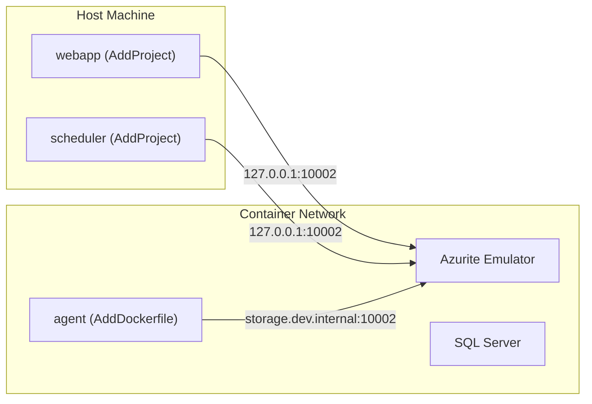
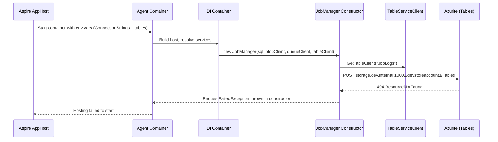
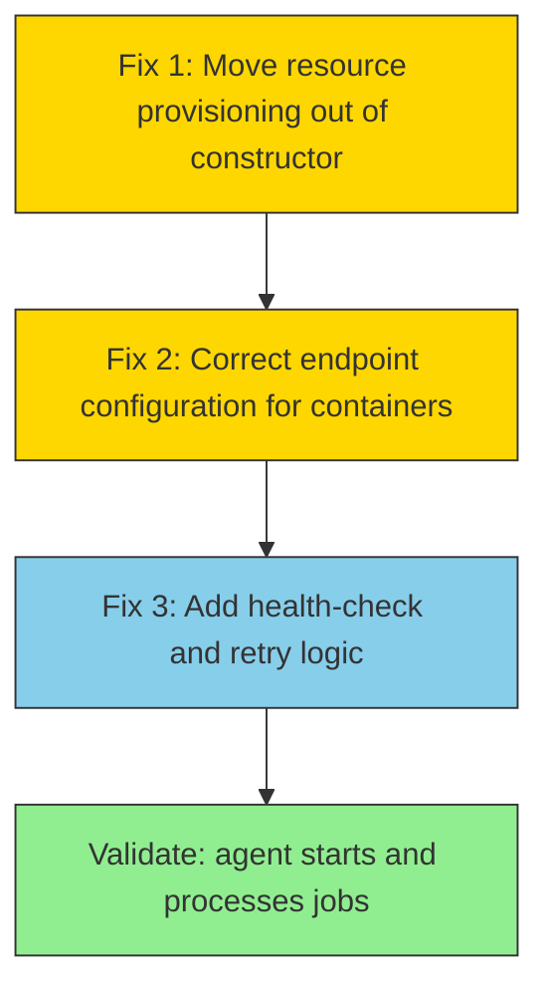
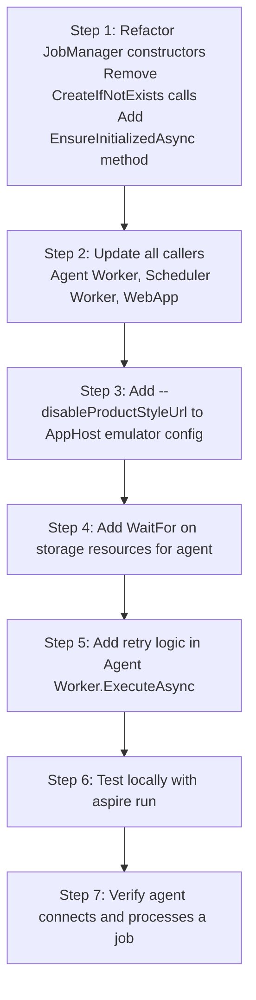
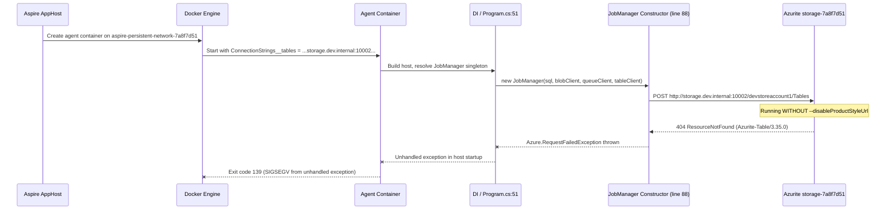
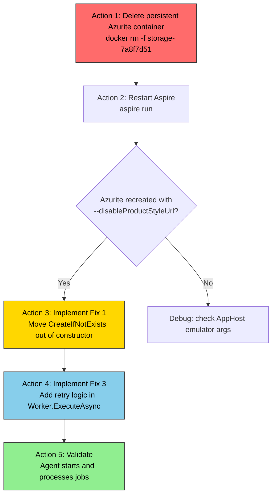

# Agent Azure Tables Container Endpoint Fix Plan

## 1. Problem Summary

The containerized **agent** service crashes on startup with a fatal `Azure.RequestFailedException: 404 ResourceNotFound` when calling `TableClient.CreateIfNotExists()` inside the `JobManager` constructor. The **scheduler** and **webapp** (both host-based projects) connect to the same Azurite emulator without issues.

The root cause is an **endpoint/connection-string mismatch** between the container-internal Azurite hostname and how the Azure Tables SDK resolves paths against Azurite.

> **Status (2026-03-31):** Fix 2 Option A (`--disableProductStyleUrl`) and Option C (`WaitFor`) have been applied to the AppHost code. However, the **persistent Azurite container was not recreated**, so the fix is not active at runtime. Fix 1 (move `CreateIfNotExists` out of the constructor) and Fix 3 (retry logic) are **not yet implemented**. See [Section 9](#9-live-diagnostic-findings-2026-03-31) for details.

---

## 2. Architecture Context

### 2.1 How Each Service Connects to Storage

| Service | AppHost Registration | Network Context | Azurite Endpoint Seen |
|-----------|----------------------|-----------------------|-----------------------------------------|
| **webapp** | `AddProject` | Host network | `http://127.0.0.1:10002/devstoreaccount1` |
| **scheduler** | `AddProject` | Host network | `http://127.0.0.1:10002/devstoreaccount1` |
| **agent** | `AddDockerfile` | Container network | `http://storage.dev.internal:10002/devstoreaccount1` |

### 2.2 System Topology



### 2.3 Relevant AppHost Wiring (Program.cs)

The AppHost registers storage and references it identically for all three services:

```csharp
var storage = builder.AddAzureStorage("storage")
    .RunAsEmulator(emulator => { /* ports: 10000, 10001, 10002 */ });

var blobs = storage.AddBlobs("blobs");
var tables = storage.AddTables("tables");
var queues = storage.AddQueues("queues");

// Host-based (works)
var webApp = builder.AddProject<...>("webapp")
    .WithReference(blobs).WithReference(tables).WithReference(queues);

var scheduler = builder.AddProject<...>("scheduler")
    .WithReference(blobs).WithReference(tables).WithReference(queues);

// Containerized (fails)
var agent = builder.AddDockerfile("agent", "..", "BlazorOrchestrator.Agent/Dockerfile")
    .WithReference(blobs).WithReference(tables).WithReference(queues);
```

Aspire generates different connection strings for `AddProject` vs `AddDockerfile` resources. Container resources receive an **internal Docker DNS hostname** (`storage.dev.internal` or similar) rather than `127.0.0.1`.

---

## 3. Detailed Diagnosis

### 3.1 The Crash Path



### 3.2 Why the 404 Occurs

Azurite's Table service has known quirks with custom hostnames:

1. **Path-style vs product-style URL resolution** - Azurite may not correctly resolve `http://storage.dev.internal:10002/devstoreaccount1/Tables` when the hostname is not `127.0.0.1` or `localhost`. The account name in the path (`devstoreaccount1`) may fail validation against the expected well-known dev account.

2. **Connection string endpoint shape** - The Azure Tables SDK constructs request URLs from the connection string. When Aspire injects a container-friendly endpoint, the SDK may produce a URL that Azurite rejects at the table-provisioning level.

3. **Account key vs endpoint alignment** - The well-known Azurite dev credentials (`devstoreaccount1` / `Eby8vd...`) are tied to specific endpoint patterns. Changing the hostname can break the HMAC signature verification or path resolution.

### 3.3 What Is NOT the Problem

| Symptom | Explanation |
|---------|-------------|
| Scheduler gets 404 on `Settings(PartitionKey='AppSettings',RowKey='TimezoneId')` | Normal: entity does not exist yet. Handled gracefully. |
| SQL Server connectivity | Agent connects to SQL successfully before the Tables call fails. |
| Blob and Queue services | May also fail but Tables fails first, crashing the process. |
| Azurite being down | Azurite responds with a valid HTTP 404, confirming it is running. |

---

## 4. Proposed Fixes

### 4.1 Overview of Fix Strategy



### 4.2 Fix 1 - Move CreateIfNotExists Out of the Constructor (Critical)

**Problem:** `JobManager` calls `CreateIfNotExists()` on Tables, Queues, and Blobs directly in its constructor. If the storage endpoint is temporarily unavailable or misconfigured, the entire DI container fails to build and the host crashes.

**File:** `src/BlazorDataOrchestrator.Core/JobManager.cs`

**Current Code (both constructors):**

```csharp
_logTableClient = tableServiceClient.GetTableClient("JobLogs");
_logTableClient.CreateIfNotExists();       // <-- Throws here

_jobQueueClient = queueServiceClient.GetQueueClient("default");
_jobQueueClient.CreateIfNotExists();

_packageContainerClient = blobServiceClient.GetBlobContainerClient("jobs");
_packageContainerClient.CreateIfNotExists();
```

**Proposed Change:**

```csharp
public class JobManager
{
    private bool _initialized;
    private readonly SemaphoreSlim _initLock = new(1, 1);

    // Constructor: only assign clients, no I/O
    public JobManager(string sqlConnectionString, BlobServiceClient blobServiceClient,
                      QueueServiceClient queueServiceClient, TableServiceClient tableServiceClient)
    {
        _sqlConnectionString = sqlConnectionString;
        _tableServiceClient = tableServiceClient;
        _logTableClient = tableServiceClient.GetTableClient("JobLogs");
        _queueServiceClient = queueServiceClient;
        _jobQueueClient = queueServiceClient.GetQueueClient("default");
        _blobServiceClient = blobServiceClient;
        _packageContainerClient = blobServiceClient.GetBlobContainerClient("jobs");
    }

    /// <summary>
    /// Ensures storage resources (tables, queues, containers) exist.
    /// Safe to call multiple times; only runs once.
    /// </summary>
    public async Task EnsureInitializedAsync(CancellationToken cancellationToken = default)
    {
        if (_initialized) return;

        await _initLock.WaitAsync(cancellationToken);
        try
        {
            if (_initialized) return;

            await _logTableClient.CreateIfNotExistsAsync(cancellationToken);
            await _jobQueueClient.CreateIfNotExistsAsync(cancellationToken);
            await _packageContainerClient.CreateIfNotExistsAsync(cancellationToken);

            _initialized = true;
        }
        finally
        {
            _initLock.Release();
        }
    }
}
```

**Callers must be updated** to call `EnsureInitializedAsync()` before first use:

| Caller | Where to add the call |
|--------|----------------------|
| `Worker.ExecuteAsync()` (Agent) | At the top, before entering the queue-polling loop |
| Scheduler `Worker.ExecuteAsync()` | At the top, before entering the scheduling loop |
| WebApp startup | In `BackgroundInitializer` or on first request via middleware |

### 4.3 Fix 2 - Correct the Container Endpoint Configuration (Critical)

There are several sub-options. Choose the one that best fits the project constraints.

#### Option A: Force Azurite to Accept Any Hostname (Recommended for Dev)

Add `--disableProductStyleUrl` to the Azurite emulator arguments in the AppHost:

**File:** `src/BlazorOrchestrator.AppHost/Program.cs`

```csharp
var storage = builder.AddAzureStorage("storage")
    .RunAsEmulator(emulator =>
    {
        emulator.WithLifetime(ContainerLifetime.Persistent);
        emulator.WithDataVolume();
        emulator.WithEndpoint("blob", endpoint => endpoint.Port = 10000);
        emulator.WithEndpoint("queue", endpoint => endpoint.Port = 10001);
        emulator.WithEndpoint("table", endpoint => endpoint.Port = 10002);
        // Allow any hostname for table requests (fixes container DNS issues)
        emulator.WithArgs("--disableProductStyleUrl");
    });
```

`--disableProductStyleUrl` tells Azurite to always use path-style URLs, which avoids hostname-based account resolution that fails with Docker-internal hostnames.

#### Option B: Explicitly Override the Agent Connection String

If Option A is insufficient, set an explicit environment variable on the agent container that uses the well-known Azurite connection string with the container-resolvable hostname:

**File:** `src/BlazorOrchestrator.AppHost/Program.cs`

```csharp
var agent = builder.AddDockerfile("agent", "..", "BlazorOrchestrator.Agent/Dockerfile")
    .WithReference(db).WaitFor(db)
    .WithReference(blobs).WithReference(tables).WithReference(queues)
    .WithEnvironment("ConnectionStrings__tables",
        "DefaultEndpointsProtocol=http;" +
        "AccountName=devstoreaccount1;" +
        "AccountKey=Eby8vdM02xNOcqFlqUwJPLlmEtlCDXJ1OUzFT50uSRZ6IFsuFq2UVErCz4I6tq/K1SZFPTOtr/KBHBeksoGMGw==;" +
        "TableEndpoint=http://storage:10002/devstoreaccount1;");
```

> **Note:** Replace `storage` with the actual container name Aspire assigns to the Azurite emulator. Inspect the Aspire dashboard or `aspire run` output to find the exact name.

#### Option C: Use WaitFor on Storage (Complementary)

Ensure the agent waits for storage to be healthy before starting. This does not fix the endpoint issue alone but prevents races:

```csharp
var agent = builder.AddDockerfile("agent", "..", "BlazorOrchestrator.Agent/Dockerfile")
    .WithReference(db).WaitFor(db)
    .WithReference(blobs).WaitFor(blobs)
    .WithReference(tables).WaitFor(tables)
    .WithReference(queues).WaitFor(queues);
```

#### Decision Matrix

| Option | Fixes endpoint mismatch | Complexity | Side effects |
|--------|------------------------|------------|--------------|
| A: `--disableProductStyleUrl` | Yes | Low | None for dev; do not use in production |
| B: Explicit connection string | Yes | Medium | Must maintain manually; fragile |
| C: `WaitFor` on storage | No (complementary) | Low | Slightly slower startup |

**Recommendation:** Apply **Option A + Option C** together. Option A fixes the root cause; Option C adds resilience.

### 4.4 Fix 3 - Add Retry Logic to Initialization (Recommended)

Wrap the `EnsureInitializedAsync` call in the Agent `Worker` with a retry loop using Polly or a simple manual retry, so transient failures during container startup do not crash the host:

**File:** `src/BlazorOrchestrator.Agent/Worker.cs`

```csharp
protected override async Task ExecuteAsync(CancellationToken stoppingToken)
{
    _logger.LogInformation("Agent {AgentId} starting...", _agentId);

    // Retry storage initialization up to 5 times with exponential backoff
    const int maxRetries = 5;
    for (int attempt = 1; attempt <= maxRetries; attempt++)
    {
        try
        {
            await _jobManager.EnsureInitializedAsync(stoppingToken);
            _logger.LogInformation("Storage initialization succeeded on attempt {Attempt}", attempt);
            break;
        }
        catch (Exception ex) when (attempt < maxRetries)
        {
            var delay = TimeSpan.FromSeconds(Math.Pow(2, attempt));
            _logger.LogWarning(ex,
                "Storage initialization failed (attempt {Attempt}/{Max}). Retrying in {Delay}s...",
                attempt, maxRetries, delay.TotalSeconds);
            await Task.Delay(delay, stoppingToken);
        }
    }

    // Continue with queue polling loop...
}
```

---

## 5. Implementation Plan

### 5.1 Step-by-Step



### 5.2 Files to Modify

| # | File | Change |
|---|------|--------|
| 1 | `src/BlazorDataOrchestrator.Core/JobManager.cs` | Remove `CreateIfNotExists()` from both constructors; add `EnsureInitializedAsync()` |
| 2 | `src/BlazorOrchestrator.Agent/Worker.cs` | Call `EnsureInitializedAsync()` with retry at top of `ExecuteAsync` |
| 3 | `src/BlazorOrchestrator.Scheduler/Worker.cs` | Call `EnsureInitializedAsync()` at top of `ExecuteAsync` (if it uses `JobManager`) |
| 4 | `src/BlazorOrchestrator.Web/Program.cs` | Call `EnsureInitializedAsync()` in startup path (if applicable) |
| 5 | `src/BlazorOrchestrator.AppHost/Program.cs` | Add `--disableProductStyleUrl` arg and `WaitFor` on storage for agent |

### 5.3 Files NOT Modified

| File | Reason |
|------|--------|
| `Dockerfile` | No container build changes needed |
| `appsettings.json` (any project) | Connection strings are injected by Aspire, not hardcoded |
| `BlazorDataOrchestrator.Core.csproj` | No new package dependencies |

---

## 6. Testing and Validation

### 6.1 Local Validation Steps

1. Run `aspire run` from the AppHost directory
2. Check Aspire dashboard: all three services (webapp, scheduler, agent) should show **Running**
3. Inspect agent logs in the dashboard for:
   - `Storage initialization succeeded on attempt 1`
   - `Agent ... starting...`
   - No `RequestFailedException` entries
4. Create a test job and verify the agent picks it up from the queue

### 6.2 Regression Checks

| Check | Expected Result |
|-------|-----------------|
| Webapp can read/write to `JobLogs` table | 200 OK responses in traces |
| Scheduler can query tables | Normal operation, no 404 on table creation |
| Agent starts without crash | Host logs show successful startup |
| Agent processes a queued job | Job moves through `Queued` -> `Running` -> `Completed` |
| Restarting Aspire preserves data | Persistent volumes retain Azurite data |

### 6.3 Azure Deployment Check

The `--disableProductStyleUrl` flag is only applied in `RunAsEmulator()` and does **not** affect Azure deployment. In production, Aspire provisions a real Azure Storage Account with managed identity, so the container endpoint issue does not arise.

---

## 7. Risk Assessment

| Risk | Likelihood | Impact | Mitigation |
|------|-----------|--------|------------|
| `EnsureInitializedAsync` called concurrently by multiple threads | Low | Low | `SemaphoreSlim` guard in implementation |
| `--disableProductStyleUrl` masks a deeper Azurite bug | Low | Low | Only applies to local dev; production uses real Azure Storage |
| Retry loop delays agent startup | Low | Low | Exponential backoff maxes out at about 60s total |
| Other services also hit constructor crash (less likely since they run on host) | Very Low | Medium | Fix 1 protects all services equally |

---

## 8. Summary

The agent crashes because Aspire injects a container-internal Azurite hostname (`storage.dev.internal`) that the Table service rejects with 404. The fix has three parts:

1. **Decouple resource provisioning from construction** - Move `CreateIfNotExists()` out of the `JobManager` constructor into an async initialization method.
2. **Fix the Azurite endpoint** - Add `--disableProductStyleUrl` to the emulator configuration and `WaitFor` on storage resources.
3. **Add resilience** - Retry storage initialization in the agent worker with exponential backoff.

These changes are local-dev-only in scope (the Azurite flag) and defensive-coding improvements (async init, retries) that benefit all environments.

---

## 9. Live Diagnostic Findings (2026-03-31)

### 9.1 What Was Applied vs What Is Running

The AppHost code (`Program.cs`) was updated with:
- `emulator.WithArgs("--disableProductStyleUrl")` (Fix 2, Option A)
- `.WaitFor(blobs)`, `.WaitFor(tables)`, `.WaitFor(queues)` on the agent (Fix 2, Option C)

However, the **persistent Azurite container was never recreated**, so these changes have no effect at runtime.

### 9.2 Container State Evidence

Inspection of the running Docker containers (via `docker ps -a`) shows:

| Container | Status | Network | Notes |
|-----------|--------|---------|-------|
| `agent-mngkfpgy` | **Exited (139)** | `aspire-persistent-network-7a8f7d51-BlazorOrchestrator` | Crashed with SIGSEGV after unhandled exception |
| `storage-7a8f7d51` | Up 2 weeks | `aspire-persistent-network-7a8f7d51-BlazorOrchestrator` | Missing `--disableProductStyleUrl` |
| `sqlserver-7a8f7d51` | Up 2 weeks | `aspire-persistent-network-7a8f7d51-BlazorOrchestrator` | Healthy |

The agent and storage containers **are on the same Docker network**, confirming DNS resolution of `storage.dev.internal` works. The problem is purely Azurite rejecting the product-style URL.

### 9.3 Azurite Container Command (Actual vs Expected)

**Actual** (what is running):
```
azurite -l /data --blobHost 0.0.0.0 --queueHost 0.0.0.0 --tableHost 0.0.0.0 --skipApiVersionCheck
```

**Expected** (what should be running after fix):
```
azurite -l /data --blobHost 0.0.0.0 --queueHost 0.0.0.0 --tableHost 0.0.0.0 --skipApiVersionCheck --disableProductStyleUrl
```

The `--disableProductStyleUrl` flag is **absent** because the container is persistent and was created before the AppHost code change.

### 9.4 Agent Connection Strings (Actual)

Extracted from the agent container environment variables:

```
ConnectionStrings__tables=DefaultEndpointsProtocol=http;AccountName=devstoreaccount1;
  AccountKey=Eby8vdM02xNOcqFlqUwJPLlmEtlCDXJ1OUzFT50uSRZ6IFsuFq2UVErCz4I6tq/K1SZFPTOtr/KBHBeksoGMGw==;
  TableEndpoint=http://storage.dev.internal:10002/devstoreaccount1;

ConnectionStrings__queues=DefaultEndpointsProtocol=http;AccountName=devstoreaccount1;
  AccountKey=Eby8vdM02xNOcqFlqUwJPLlmEtlCDXJ1OUzFT50uSRZ6IFsuFq2UVErCz4I6tq/K1SZFPTOtr/KBHBeksoGMGw==;
  QueueEndpoint=http://storage.dev.internal:10001/devstoreaccount1;

ConnectionStrings__blobs=DefaultEndpointsProtocol=http;AccountName=devstoreaccount1;
  AccountKey=Eby8vdM02xNOcqFlqUwJPLlmEtlCDXJ1OUzFT50uSRZ6IFsuFq2UVErCz4I6tq/K1SZFPTOtr/KBHBeksoGMGw==;
  BlobEndpoint=http://storage.dev.internal:10000/devstoreaccount1;
```

All three use `storage.dev.internal` as expected for a container-to-container connection. The connection strings are correct — **Azurite just rejects them without `--disableProductStyleUrl`**.

### 9.5 Agent Crash Logs (Reproduced)

The exact crash from `docker logs agent-mngkfpgy`:

```
info: Azure.Core[1]
      Request POST http://storage.dev.internal:10002/devstoreaccount1/Tables?$format=...
      User-Agent: azsdk-net-Data.Tables/12.11.0 (.NET 10.0.5; Ubuntu 24.04.4 LTS)

warn: Azure.Core[8]
      Error response 404 Not Found (00.1s)
      Server: Azurite-Table/3.35.0
      x-ms-error-code: REDACTED

fail: Microsoft.Extensions.Hosting.Internal.Host[11]
      Hosting failed to start
      Azure.RequestFailedException: Service request failed.
      Status: 404 (Not Found)
      Code: ResourceNotFound
         at Azure.Data.Tables.TableClient.CreateIfNotExists(...)
         at BlazorDataOrchestrator.Core.JobManager..ctor(...) in JobManager.cs:line 88
         at Program.<>c.<<Main>$>b__0_4(IServiceProvider sp) in Program.cs:line 51
```

This confirms:
1. The agent successfully resolves `storage.dev.internal` and reaches Azurite
2. Azurite processes the HTTP request but returns 404 for the `POST /devstoreaccount1/Tables` call
3. The `CreateIfNotExists()` call is still synchronous in the constructor (Fix 1 not yet applied)
4. The crash brings down the entire host (no retry, no graceful fallback)

### 9.6 Crash Sequence (Actual, From Logs)



### 9.7 Required Actions to Complete the Fix



| # | Action | Status | Blocking? |
|---|--------|--------|-----------|
| 1 | Delete persistent `storage-7a8f7d51` container so Aspire recreates it with `--disableProductStyleUrl` | **Not done** | Yes - blocks all other fixes from being testable |
| 2 | Restart Aspire (`aspire run`) to recreate the storage container | **Not done** | Yes |
| 3 | Implement Fix 1: Move `CreateIfNotExists()` out of `JobManager` constructor | **Not done** | No - but required for resilience |
| 4 | Implement Fix 3: Add retry logic in `Worker.ExecuteAsync` | **Not done** | No - but required for resilience |
| 5 | Validate agent starts and connects to storage | **Not done** | - |

### 9.8 Key Lesson: Persistent Containers and Config Changes

When an Aspire resource uses `ContainerLifetime.Persistent`, the container is **not recreated** on subsequent `aspire run` invocations. This means:

- **Code changes to `RunAsEmulator()`** (like adding `--disableProductStyleUrl`) do not take effect until the old container is deleted
- The container must be manually removed: `docker rm -f storage-7a8f7d51`
- Aspire will then recreate it on next `aspire run` with the updated configuration
- This applies to all persistent containers (SQL Server, Azurite, etc.)

> **Warning:** Deleting the storage container will also delete any Azurite data (tables, queues, blobs) stored in its volume unless `WithDataVolume()` uses a named volume that persists independently. Check `docker volume ls` before deleting if data preservation is important.
