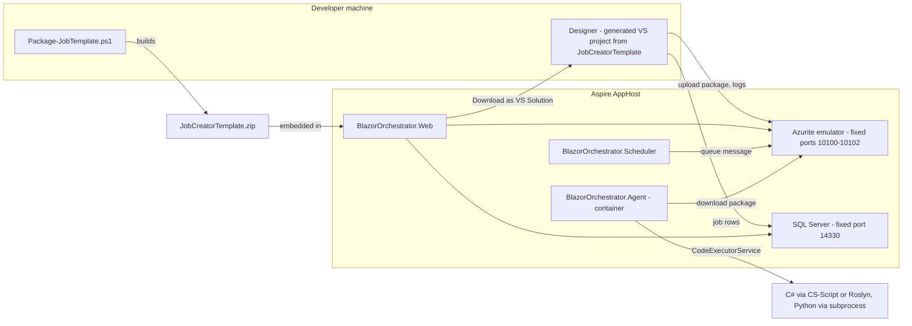
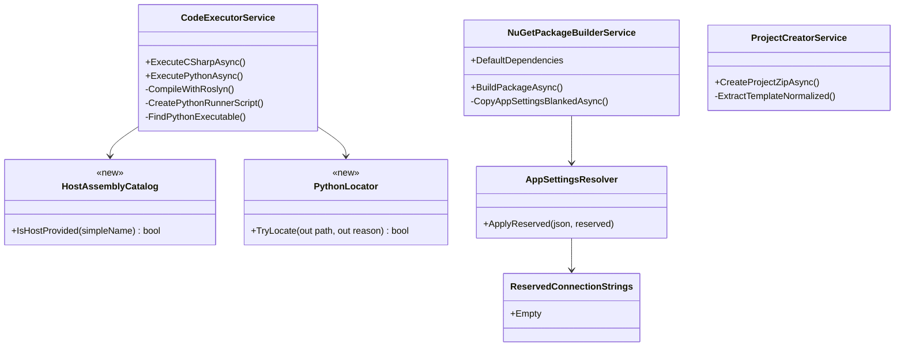
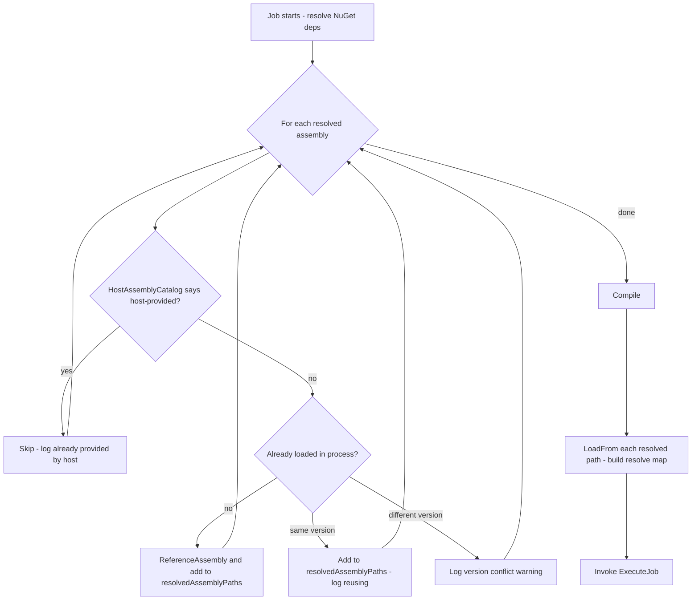
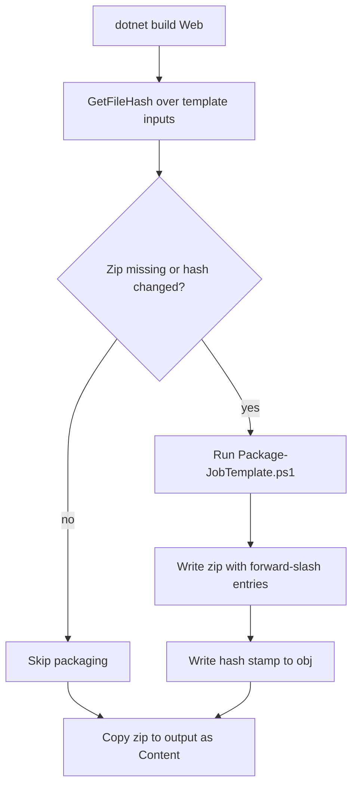
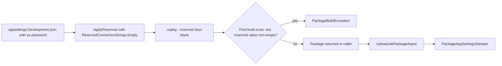
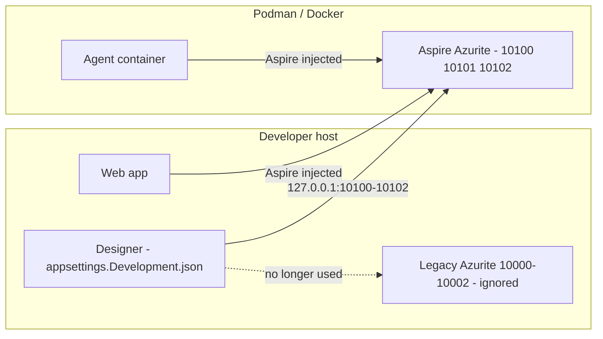
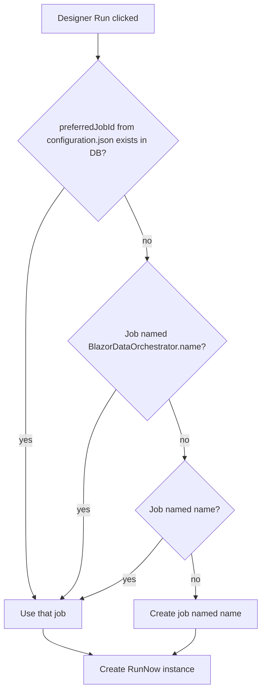
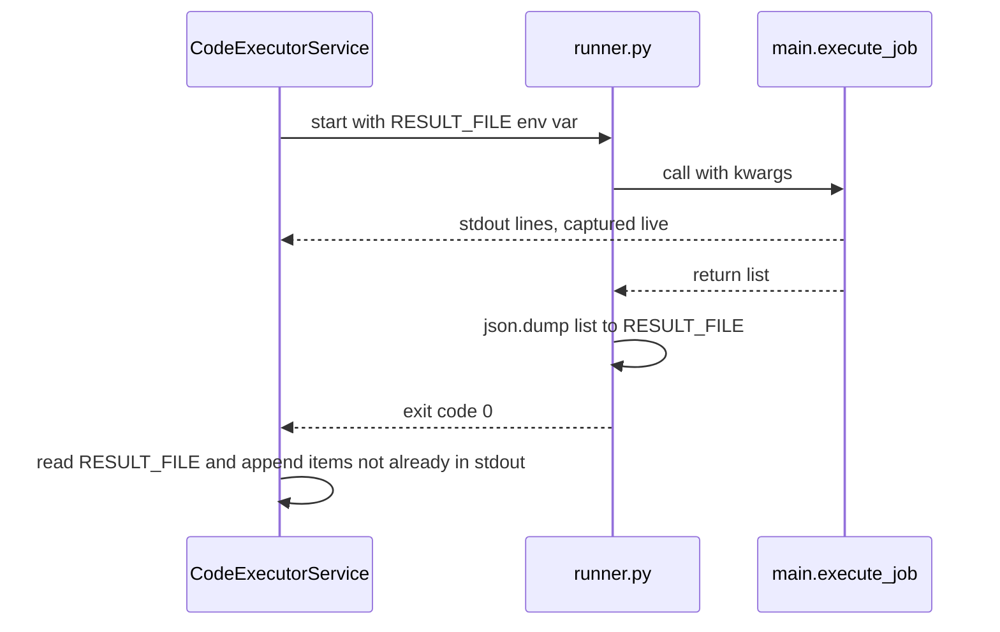
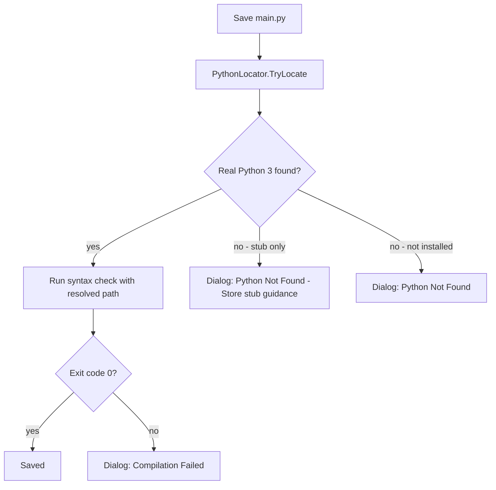
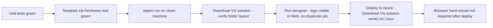

# Agent, Designer & Template Reliability and Security Fixes Plan

## 1. Overview

This plan covers fourteen defects found after the designer/platform merge. Five are **Serious** (they cause cross-job failures, broken downloads, credential leaks, or split storage). Nine are **Other** (incorrect behavior, confusing errors, or cosmetic duplication).

Each item has these sections:

- **Problem**: what the user sees
- **Root cause**: where it happens in the code
- **Changes**: what to implement, file by file
- **Tests**: automated tests to add
- **Acceptance criteria**: how to tell the fix is done

### 1.1 Decisions already made

| Topic | Decision |
|---|---|
| Storage ports (S5) | Azurite uses **dedicated, fixed, non-standard ports** (`10100`/`10101`/`10102`). This matches how SQL is pinned to `14330`. |
| Template zip in git (S2) | **Stop tracking** the zip in git (it is already in `.gitignore`). Build it on every build where its inputs have changed, using a content hash. |
| Existing duplicate jobs (O1) | **Stop creating new duplicates only.** No cleanup of existing data. |
| Package version clashes (O7) | **Keep one designer project.** Remove the host package whose dependencies cause the conflict. No separate job `.csproj`. |

### 1.2 Priority and phasing

| Phase | Items | Why this order |
|---|---|---|
| Phase 1: Security & isolation | S4, S1 | Credential leak, and one failed job breaking other jobs |
| Phase 2: Template pipeline | S2, S3, O7 | All three change the template zip and must ship together |
| Phase 3: Environment alignment | S5, O1, O6 | The designer, the platform, and the generated projects must agree on storage, jobs, and EF Core |
| Phase 4: Python parity | O2, O3, O4, O8 | Python runner and editor fixes |
| Phase 5: Compiler & web hygiene | O5, O9 | `dynamic` support, cache-busting |

### 1.3 Item index

| ID | Title | Severity | Primary files |
|---|---|---|---|
| S1 | A failed NuGet compile breaks later jobs on the same agent | Serious | `Core/Services/CodeExecutorService.cs` |
| S2 | Template zip is stale | Serious | `Web/BlazorOrchestrator.Web.csproj`, `scripts/Package-JobTemplate.ps1` |
| S3 | Template zip uses backslash paths, which breaks on Linux | Serious | `scripts/Package-JobTemplate.ps1`, `Web/Services/ProjectCreatorService.cs` |
| S4 | Designer packages ship `appsettings.Development.json` including the `sa` password | Serious | `Core/Services/NuGetPackageBuilderService.cs` |
| S5 | Designer and platform use different storage | Serious | `AppHost/Program.cs`, `JobCreatorTemplate/appsettings.Development.json` |
| O1 | Duplicate `BlazorDataOrchestrator.<name>` jobs | Other | `JobCreatorTemplate/Components/Pages/Home.razor`, `Core/JobManager.cs` |
| O2 | Python webhook parameter is dropped | Other | `Core/Services/CodeExecutorService.cs` |
| O3 | Python logs appear twice | Other | `Core/Services/CodeExecutorService.cs` |
| O4 | Python editor file list is missing settings files | Other | `Web/Services/JobCodeEditorService.cs` |
| O5 | `dynamic` compiles only in the designer | Other | `Core/Services/CodeExecutorService.cs` |
| O6 | EF Core version mismatch (10.0.0 vs 10.0.11) | Other | `Core/Services/NuGetPackageBuilderService.cs` |
| O7 | Package version clashes in VS projects (Humanizer.Core) | Other | `Core/*.csproj`, `JobCreatorTemplate/*.csproj` |
| O8 | Windows Store Python stub is reported as "Compilation Failed" | Other | `JobCreatorTemplate/Components/Pages/Home.razor`, `CodeExecutorService.cs` |
| O9 | Browsers keep running a stale `site.js` | Other | `Web/Components/App.razor`, `Web/Program.cs` |

---

## 2. System Context



### 2.1 Shared components touched by this plan



---

## 3. Serious Issues

### S1. A failed NuGet compile breaks later jobs on the same agent

#### Problem

Say a C# job that uses NuGet package *X* fails to compile. From then on, every job on that agent process that uses *X* fails at runtime with `Could not load file or assembly 'X'`. This lasts until the agent restarts.

#### Root cause

In [CodeExecutorService.cs](../src/BlazorDataOrchestrator.Core/Services/CodeExecutorService.cs), `ExecuteCSharpAsync` builds `hostAssemblyNames` from the **live** `AppDomain.CurrentDomain.GetAssemblies()` on every run (around lines 166–196):

```csharp
var hostAssemblyNames = new HashSet<string>(
    AppDomain.CurrentDomain.GetAssemblies().Select(a => a.GetName().Name)...);
...
if (hostAssemblyNames.Contains(simpleName))
{
    result.Logs.Add($"  ~ Skipping {Path.GetFileName(assemblyPath)} (already provided by host)");
    continue;   // never added to resolvedAssemblyPaths
}
```

The failure happens in this order:

1. Job A calls `evaluator.ReferenceAssembly(path)` and/or `Assembly.LoadFrom(path)` for *X*. This loads *X* into the process.
2. Job A's compile fails. *X* stays loaded because assemblies loaded this way cannot be unloaded.
3. Job B builds `hostAssemblyNames` again. *X* now looks like it was "provided by host", so it is skipped.
4. Because *X* was skipped, it is never added to `resolvedAssemblyPaths` or to the `loadedAssemblies` map that the `AssemblyResolve` handler uses.
5. At runtime the job's assembly asks for *X*. The resolve handler returns `null`, so the job fails with `FileNotFoundException`.

The check was meant to detect assemblies that **ship with the host** (Core, EF Core, and so on). Instead it detects **anything loaded so far**, including assemblies that earlier jobs loaded.

#### Changes

1. **Add `HostAssemblyCatalog`** (new, `Core/Services/HostAssemblyCatalog.cs`). This is a static, lazily-initialized set of the assembly names that shipped with the host. It is taken from the Trusted Platform Assemblies list once per process. That list is fixed at startup and contains the framework plus the app's `deps.json` assemblies. It never contains assemblies loaded later by jobs.

   ```csharp
   internal static class HostAssemblyCatalog
   {
       private static readonly Lazy<HashSet<string>> Names = new(() =>
       {
           var tpa = (AppContext.GetData("TRUSTED_PLATFORM_ASSEMBLIES") as string)
               ?.Split(Path.PathSeparator) ?? Array.Empty<string>();
           return new HashSet<string>(
               tpa.Select(Path.GetFileNameWithoutExtension).Where(n => !string.IsNullOrEmpty(n))!,
               StringComparer.OrdinalIgnoreCase);
       });

       public static bool IsHostProvided(string simpleName) => Names.Value.Contains(simpleName);
   }
   ```

2. **Replace the per-run `hostAssemblyNames` set** with `HostAssemblyCatalog.IsHostProvided(simpleName)`. Keep the `~ Skipping ... (already provided by host)` log message, but it should now fire only for true host assemblies.

3. **Handle assemblies that an earlier job already loaded.** If an assembly is not host-provided but is already loaded (from the same path in the NuGet cache), still add it to `resolvedAssemblyPaths`. `Assembly.LoadFrom` on the same path returns the loaded instance, so the `loadedAssemblies` map and the resolve handler work as they should. Add a log line, `  = Reusing X.dll (loaded by an earlier job)`, to help with diagnostics.

4. **Version conflict warning.** Suppose the requested path differs from the loaded assembly's `Location`, and the versions differ (job B wants *X* 2.0 while job A loaded *X* 1.0). Log a clear warning that names both versions and says a restart is needed. Default-context loading cannot hold two versions side by side. Full per-job isolation is listed under follow-ups, below.

5. **No behavior change for the Roslyn path.** `CompileWithRoslyn` already adds NuGet paths from `resolvedAssemblyPaths`, so step 3 fixes that path as well.

#### Process flow (after fix)



#### Tests (`tests/BlazorDataOrchestrator.Core.Tests`)

- `CSharp_FailedCompileWithNuGet_DoesNotBreakNextJob`: Run 1 is a job that references `Humanizer.Core` and contains a deliberate syntax error, so it is expected to fail. Run 2 is a valid job with the same dependency, in the same `CodeExecutorService` instance. Run 2 must succeed.
- `HostAssemblyCatalog_DoesNotContainJobLoadedAssemblies`: Load a NuGet assembly with `LoadFrom`, then assert that `IsHostProvided` returns `false` for it.
- `HostAssemblyCatalog_ContainsCoreAndEfCore`: Assert `true` for `BlazorDataOrchestrator.Core` and `Microsoft.EntityFrameworkCore`.

#### Acceptance criteria

- After a failed compile, the next job that uses the same package runs successfully without restarting the agent.
- Agent logs show `Reusing` rather than `already provided by host` for that package.

#### Follow-up (out of scope)

- Load each job and its NuGet assemblies into a dedicated collectible `AssemblyLoadContext` with a `Resolving` handler. This would allow different package versions per job and would release the memory.

---

### S2. The template zip given to users is stale

#### Problem

`src/BlazorOrchestrator.Web/JobTemplate/BlazorDataOrchestrator.JobCreatorTemplate.zip` is committed to git. It was last regenerated on Sep 25, so it lacks the Sep 26 designer fix (commit `d7b13ea`, which added `HideSavingOverlayAsync()` in `Home.razor`). Designers downloaded from the platform therefore still have the old bug: if a Python save fails, the full-screen **"Saving & Compiling…"** overlay (`z-index: 9999`) stays above the Radzen error dialog, and the user cannot dismiss it.

#### Root cause

- The zip is listed in [.gitignore](../.gitignore) (line 94), but it was committed before that line was added, so git still tracks it.
- In [BlazorOrchestrator.Web.csproj](../src/BlazorOrchestrator.Web/BlazorOrchestrator.Web.csproj), the `PackageJobTemplate` target (lines 9–16) uses **timestamp-based** `Inputs`/`Outputs`. A checkout writes the source files and the tracked zip with roughly the same modification time. MSBuild therefore considers the zip up to date and skips regeneration.

#### Changes

1. **Untrack the zip.** Remove it from the git index but keep the `.gitignore` entry. After this, a fresh clone has no zip, which forces the target to run.

2. **Use a content-hash stamp instead of timestamps.** Rewrite the target:

   ```xml
   <PropertyGroup>
     <JobTemplateZip>$(MSBuildProjectDirectory)\JobTemplate\BlazorDataOrchestrator.JobCreatorTemplate.zip</JobTemplateZip>
     <JobTemplateHashFile>$(IntermediateOutputPath)jobtemplate.inputs.hash</JobTemplateHashFile>
     <JobTemplatePowerShell Condition="$([MSBuild]::IsOSPlatform('Windows'))">powershell.exe</JobTemplatePowerShell>
     <JobTemplatePowerShell Condition="'$(JobTemplatePowerShell)' == ''">pwsh</JobTemplatePowerShell>
   </PropertyGroup>

   <Target Name="PackageJobTemplate" BeforeTargets="BeforeBuild">
     <GetFileHash Files="@(JobTemplateInputs)" Algorithm="SHA256">
       <Output TaskParameter="Items" ItemName="_JobTemplateHashed" />
     </GetFileHash>
     <PropertyGroup>
       <_JobTemplateCombined>@(_JobTemplateHashed->'%(RecursiveDir)%(Filename)%(Extension)=%(FileHash)', ';')</_JobTemplateCombined>
       <_JobTemplatePrevious Condition="Exists('$(JobTemplateHashFile)')">$([System.IO.File]::ReadAllText('$(JobTemplateHashFile)'))</_JobTemplatePrevious>
     </PropertyGroup>
     <Exec Condition="!Exists('$(JobTemplateZip)') Or '$(_JobTemplateCombined)' != '$(_JobTemplatePrevious)'"
           Command="$(JobTemplatePowerShell) -NoProfile -ExecutionPolicy Bypass -File &quot;$(MSBuildProjectDirectory)\..\..\scripts\Package-JobTemplate.ps1&quot; -SourceDir &quot;$(MSBuildProjectDirectory)\..\BlazorDataOrchestrator.JobCreatorTemplate&quot; -OutputZip &quot;$(JobTemplateZip)&quot;" />
     <WriteLinesToFile File="$(JobTemplateHashFile)" Lines="$(_JobTemplateCombined)" Overwrite="true" WriteOnlyWhenDifferent="true" />
   </Target>
   ```

   - Also exclude `.vs\**`, `*.csproj.user`, `execution_errors.log`, and `Code\**\__pycache__\**` from `JobTemplateInputs`. These files change often but are never shipped.
   - Choosing `pwsh` on non-Windows systems lets Linux CI build the Web project.

3. **Defense-in-depth for the overlay.** In `JobCreatorTemplate/Components/Pages/Home.razor`, lower the Saving overlay's `z-index` from `9999` to `900`, which matches the Executing overlay. Any future code path that forgets `HideSavingOverlayAsync()` will then still show dialogs above the spinner. Apply the same change to the "Calling AI" and "Creating Package" overlays.

#### Build flow (after fix)



#### Tests (`tests/BlazorOrchestrator.Web.Tests`)

- `TemplateZip_MatchesTemplateSource`: For every file under `src/BlazorDataOrchestrator.JobCreatorTemplate` except the ones the script excludes, the zip entry `BlazorDataOrchestrator.JobCreatorTemplate/<relative path>` must have identical bytes. The `.csproj` is the one exception, because the script patches its `ProjectReference`. This test fails CI whenever the zip goes stale.
- `TemplateZip_ContainsSavingOverlayFix`: The zipped `Home.razor` must contain `HideSavingOverlayAsync`. This is a regression guard for `d7b13ea`.

#### Acceptance criteria

- A fresh clone followed by a build produces a zip that includes `d7b13ea`.
- Editing any template file and building again regenerates the zip.
- A Python save error in a downloaded designer shows a dialog that can be dismissed.

---

### S3. "Download as VS Solution" breaks on Azure (Linux)

#### Problem

On Azure Container Apps, which runs Linux, extracting the template zip gives **86 loose files** in the output root instead of a `BlazorDataOrchestrator.<name>/` project folder. The downloaded solution does not open.

#### Root cause

[Package-JobTemplate.ps1](../scripts/Package-JobTemplate.ps1) (line 138) uses `Compress-Archive` under Windows PowerShell 5.1, which writes entry names with `\`. On Linux, `ZipFile.ExtractToDirectory` in [ProjectCreatorService.cs](../src/BlazorOrchestrator.Web/Services/ProjectCreatorService.cs) (lines 69 and 272) treats `\` as an ordinary filename character. `BlazorDataOrchestrator.JobCreatorTemplate\Program.cs` therefore becomes a single file with that literal name. Later, `ResolveProjectDirectory` finds no subfolder that contains a `.csproj`.

#### Changes

1. **Write forward-slash entries in the script.** Replace `Compress-Archive` with explicit `System.IO.Compression` calls:

   ```powershell
   Add-Type -AssemblyName System.IO.Compression, System.IO.Compression.FileSystem
   $zip = [System.IO.Compression.ZipFile]::Open($OutputZip, 'Create')
   try {
       Get-ChildItem -Path $stagingDir -Recurse -File | ForEach-Object {
           $rel = [System.IO.Path]::GetRelativePath($stagingDir, $_.FullName).Replace('\', '/')
           [System.IO.Compression.ZipFileExtensions]::CreateEntryFromFile($zip, $_.FullName, $rel, 'Optimal') | Out-Null
       }
   }
   finally { $zip.Dispose() }
   ```

   `[System.IO.Path]::GetRelativePath` is not available on .NET Framework, which Windows PowerShell 5.1 uses. Compute the relative path with `$_.FullName.Substring($stagingDir.Length).TrimStart('\','/')` instead.

2. **Add an assertion to the script.** After creating the zip, reopen it and `throw` if any entry name contains `\`.

3. **Normalize during extraction in `ProjectCreatorService`.** This protects against old or third-party zips. Replace both `ZipFile.ExtractToDirectory` calls with a private helper, `ExtractTemplateNormalized(zipPath, outputDirectory)`, which:
   - replaces `\` with `/` in `entry.FullName`
   - resolves the full destination path and **rejects any entry that resolves outside `outputDirectory`**. This is the zip-slip guard that `ExtractToDirectory` provided and must be kept.
   - creates directories for directory entries and extracts files with `entry.ExtractToFile(dest, overwrite: false)`

4. **Fail clearly in `ResolveProjectDirectory`.** If no `.csproj` subfolder is found, throw an error that names the output directory, instead of logging a warning and falling back to a guessed path.

#### Tests

- `TemplateZip_HasNoBackslashEntries` (Web.Tests)
- `ExtractTemplateNormalized_BackslashZip_CreatesFolders`: Build an in-memory zip with `a\b\c.txt` and assert that `a/b/c.txt` exists after extraction.
- `ExtractTemplateNormalized_RejectsTraversal`: An entry `..\evil.txt` must throw.
- The E2E test in `tests/BlazorOrchestrator.E2E.Tests` runs "Download as VS Solution" in the Linux container and asserts that the downloaded zip has a `BlazorDataOrchestrator.<name>/BlazorDataOrchestrator.<name>.csproj` entry.

#### Acceptance criteria

- The downloaded solution zip has the same folder layout on Windows and Linux hosts.

---

### S4. Security: designer packages include `appsettings.Development.json` as-is

#### Problem

The designer's `appsettings.Development.json` contains the local SQL `sa` password (`Server=127.0.0.1,14330;...;User ID=sa;Password=...`). `NuGetPackageBuilderService.BuildPackageAsync` copies all four appsettings files into the `.nupkg` byte for byte. The password therefore ends up in:

- every package downloaded from the designer
- the `.nupkg` built by "Create Package"
- the in-memory package before `UploadJobPackageAsync` stamps it

The rule is that the four reserved connection strings (`blobs`, `queues`, `tables`, `blazororchestratordb`) are **blank** in packages.

#### Root cause

In [NuGetPackageBuilderService.cs](../src/BlazorDataOrchestrator.Core/Services/NuGetPackageBuilderService.cs), lines 191–212 call `CopyFileAsync` for `config.AppSettingsPath` and for each `EnvironmentAppSettingsPaths` entry. No content transformation happens. The root `Code/*.json` copy loop (lines 177–189) has the same problem if an appsettings file is ever placed there.

#### Changes

1. **Blank the reserved keys while building.** Add a private helper:

   ```csharp
   private static async Task CopyAppSettingsBlankedAsync(string sourcePath, string destPath)
   {
       var json = await File.ReadAllTextAsync(sourcePath);
       var blanked = AppSettingsResolver.ApplyReserved(json, ReservedConnectionStrings.Empty);
       await File.WriteAllTextAsync(destPath, blanked);
   }
   ```

   Use it for the base `appsettings.json` and all three environment overlays. Only the four reserved keys change. All other settings (API keys, custom connection strings, feature flags) are copied as packaged, as the product rules require.

2. **Handle invalid JSON.** `ApplyReserved` returns the input unchanged when the JSON is invalid. In that case, **fail the build** with a `PackageBuildException` that names the file. Packaging it as-is could leak secrets.

3. **Cover root JSON files.** In the root `Code/*.json` loop, send any file whose name is in `JobEnvironments.AllFileNames` through `CopyAppSettingsBlankedAsync`.

4. **Add a log line.** Log `Blanked reserved connection strings in <file>` for each file.

5. **Scan the finished package.** After `ZipFile.CreateFromDirectory`, reopen the `.nupkg`. Fail the build if any appsettings entry has a non-empty value for one of the four reserved keys.

#### Data flow (after fix)



#### Related finding: decision needed

`JobManager.UploadJobPackageAsync` (around line 883) calls `PackageAppSettingsStamper.StampAsync(fileStream, _reserved)`. This writes the **live host** connection strings into the package that is stored in blob storage. Any later download of the stored package ("Download Package", "Download as VS Solution") can therefore expose production connection strings. Both the product rules ("the executing host always overwrites them") and the agent's run-time overwrite suggest the stamper should write `ReservedConnectionStrings.Empty` rather than host values. **This needs a product decision before it changes.** It is recorded here and is not part of S4.

#### Tests (Core.Tests)

- `BuildPackage_BlanksReservedConnectionStrings_AllFourFiles`: Source files contain non-empty reserved values. Every appsettings entry in the resulting `.nupkg` has `""` for all four keys.
- `BuildPackage_PreservesNonReservedSettings`: A custom `ConnectionStrings:myapi` value and a `Settings:ApiKey` value both survive.
- `BuildPackage_InvalidAppSettingsJson_Fails`

#### Acceptance criteria

- A search of any designer-built `.nupkg` for `Password=` finds nothing.

---

### S5. After the merge, the designer and platform use different storage

#### Problem

The generated designer projects use `UseDevelopmentStorage=true`, which points to Azurite on the well-known ports `10000`/`10001`/`10002`. After the merge, the [AppHost](../src/BlazorOrchestrator.AppHost/Program.cs) (lines 35–43) runs Azurite on **dynamic** ports on purpose. As a result:

- On a clean machine, nothing listens on 10000–10002, so the designer cannot reach storage at all.
- On machines with an older, leftover Azurite on 10000–10002, the designer silently writes packages and logs there. The Web app never reads from it.

#### Decision

Pin the platform's Azurite to **dedicated, non-standard fixed host ports**:

| Service | Port |
|---|---|
| Blob | `10100` |
| Queue | `10101` |
| Table | `10102` |

Generated projects point to these ports with explicit connection strings. This matches the existing fixed SQL port `14330`, and it avoids clashing with any standalone Azurite on 10000–10002.

#### Changes

1. **AppHost** (`src/BlazorOrchestrator.AppHost/Program.cs`):

   ```csharp
   var storage = builder.AddAzureStorage("storage")
       .RunAsEmulator(emulator =>
       {
           emulator.WithDataVolume();
           // Dedicated ports so generated designer projects can reach this Azurite, not a stray one on 10000-10002.
           emulator.WithBlobPort(10100).WithQueuePort(10101).WithTablePort(10102);
           emulator.WithArgs("--disableProductStyleUrl");
       });
   ```

   Replace the old comment, "No fixed host ports…".

2. **Template settings** (`src/BlazorDataOrchestrator.JobCreatorTemplate/appsettings.Development.json`): Replace `UseDevelopmentStorage=true` with explicit Azurite connection strings. The account name and key are the public, well-known Azurite development values.

   ```json
   "blobs":  "DefaultEndpointsProtocol=http;AccountName=devstoreaccount1;AccountKey=Eby8vdM02xNOcqFlqUwJPLlmEtlCDXJ1OUzFT50uSRZ6IFsuFq2UVErCz4I6tq/K1SZFPTOtr/KBHBeksoGMGw==;BlobEndpoint=http://127.0.0.1:10100/devstoreaccount1;",
   "queues": "DefaultEndpointsProtocol=http;AccountName=devstoreaccount1;AccountKey=Eby8vdM02xNOcqFlqUwJPLlmEtlCDXJ1OUzFT50uSRZ6IFsuFq2UVErCz4I6tq/K1SZFPTOtr/KBHBeksoGMGw==;QueueEndpoint=http://127.0.0.1:10101/devstoreaccount1;",
   "tables": "DefaultEndpointsProtocol=http;AccountName=devstoreaccount1;AccountKey=Eby8vdM02xNOcqFlqUwJPLlmEtlCDXJ1OUzFT50uSRZ6IFsuFq2UVErCz4I6tq/K1SZFPTOtr/KBHBeksoGMGw==;TableEndpoint=http://127.0.0.1:10102/devstoreaccount1;"
   ```

3. **Keep the constants in one place.** Add `LocalDevEndpoints` in `Core/Configuration/`, with the port numbers and connection-string builders. Reference it from the AppHost if the project graph allows. If it does not, add a unit test that asserts the AppHost source and the template JSON use the same ports.

4. **Update the packaging script guard.** `Package-JobTemplate.ps1` currently rejects `UseDevelopmentStorage=true` outside the Development file. Extend the check so it also rejects `127.0.0.1:1010[0-2]` and `devstoreaccount1` in non-Development files.

5. **Probe storage at designer startup.** In `JobCreatorTemplate/Program.cs`, run a 3-second check against the blob endpoint in the background, for example `GetPropertiesAsync` on the service client. If it fails, show a banner in `Home.razor`: *"Storage emulator not reachable at 127.0.0.1:10100. Start the platform with `aspire run` first."* The designer must not fall back silently.

6. **Podman/WSL.** Fixed host ports work the same way under Podman Desktop. Two conditions apply:
   - The Podman machine must be **rootless**. With a rootful machine, published ports are not forwarded to Windows.
   - A **pre-merge persistent storage container** (fixed on 10000–10002) can still be attached to the Aspire network with the alias `storage.dev.internal`. If so, the agent resolves that alias to the old container or the new one at random. The troubleshooting docs must explain how to disconnect or remove it.

   The Agent container keeps receiving its connection strings from Aspire's `WithReference`.

7. **Azure.** No impact. `RunAsEmulator` applies only when running locally, and `azd` provisions a real Storage account.

8. **Documentation.** Update `docs/AppSettings.md` and the wiki "Local development" page with the new ports. Tell users to stop any old standalone Azurite if they want to free 10000–10002. After this change, that is optional rather than required.

#### Topology (after fix)



#### Tests

- `TemplateDevSettings_UseDedicatedAzuritePorts` (Web.Tests): Parse the template's `appsettings.Development.json` and assert that it contains the ports `10100`, `10101`, and `10102`.
- Manual test on a clean machine with no Azurite on 10000: run `aspire run`, download a VS solution, and run the designer. The job run's logs must appear on the Web app's Logs page.

#### Acceptance criteria

- The designer and the Web app read and write the same Azurite instance.
- With the platform stopped, the designer shows the "Storage emulator not reachable" banner.

---

## 4. Other Issues

### O1. Duplicate jobs from designer runs

#### Problem

Running a job in the designer creates a second job named `BlazorDataOrchestrator.<name>` in the "Designer" organization. That job has a disabled "RunNow" schedule. The dashboard then shows every VS project twice.

#### Root cause

`Home.razor` (line 621) derives the job name from the entry assembly. In a generated project, that is `BlazorDataOrchestrator.<name>`. `JobManager.CreateDesignerJobInstanceAsync(jobName)` ([JobManager.cs](../src/BlazorDataOrchestrator.Core/JobManager.cs), lines 738–775) looks up jobs **by exact name** only. The platform's job is named `<name>`, so no match is found and a new job is created. `configuration.json` already carries `LastJobId`, and `Home.razor` loads it into `currentJobId`, but this code path ignores it.

#### Changes

1. **Change the `JobManager` signature**:

   ```csharp
   public async Task<int> CreateDesignerJobInstanceAsync(string jobName, int preferredJobId = 0)
   ```

   It resolves the job in this order:
   1. `preferredJobId > 0` and a job with that ID exists: use it.
   2. A job exists whose `JobName == jobName`.
   3. A job exists whose `JobName == StripDesignerPrefix(jobName)`, where `StripDesignerPrefix` removes a leading `BlazorDataOrchestrator.`.
   4. Otherwise, create a new job. This is the current behavior for a brand-new template with no platform job. Name it `StripDesignerPrefix(jobName)`, not the prefixed name.

2. **Caller change in `Home.razor`.** Pass `currentJobId`, which is loaded from `configuration.json`, as `preferredJobId`.

3. **Web download.** In `ProjectCreatorService.InjectCodeFiles`, when the caller passes a `jobId`, rewrite `Code/configuration.json` so that `LastJobId = jobId` and `LastJobInstanceId = 0`. A package last uploaded from a duplicate designer job would otherwise carry that duplicate's ID. Add an optional `int jobId` parameter to `CreateProjectWithCodeAsync` and `CreateProjectZipAsync`, and pass `JobId` from `JobDetailsDialog.razor` (lines 1059 and 1073) and from `Home.razor` in the Web project (line 1080).

4. **Schedule.** Reusing a real job still adds a disabled `RunNow` schedule to it, as before. That is harmless and keeps designer instances grouped. Document the behavior in the plan's release notes.

#### Flow (after fix)



#### Tests (Core.Tests, in-memory or SQL container)

- `CreateDesignerJobInstance_PreferredJobId_ReusesJob`
- `CreateDesignerJobInstance_PrefixedName_MatchesUnprefixedJob`
- `CreateDesignerJobInstance_NoMatch_CreatesUnprefixedName`

#### Acceptance criteria

- Running a downloaded VS project in the designer adds instances to the existing platform job. No new dashboard row appears.

---

### O2. Python jobs never receive the web API parameter

#### Problem

C# jobs receive `webAPIParameter` as a 6th argument. Python jobs always receive nothing, even though the template's `main.py` declares `web_api_parameter: str = ""`.

#### Root cause

In `CodeExecutorService.ExecutePythonAsync`, lines 559–562 set only the app settings, job ID, instance ID, and schedule ID as environment variables. The runner script from `CreatePythonRunnerScript` (lines 690–731) calls `execute_job` with five keyword arguments.

#### Changes

1. **Add an environment variable.** Set `psi.Environment["BLAZOR_ORCHESTRATOR_WEB_API_PARAMETER"] = context.WebAPIParameter ?? string.Empty;`.
2. **Make the runner signature-aware.** Stay backward-compatible with 5-parameter jobs:

   ```python
   import inspect
   web_api_parameter = os.environ.get('BLAZOR_ORCHESTRATOR_WEB_API_PARAMETER', '')
   kwargs = dict(app_settings=app_settings, job_agent_id=0, job_id=job_id,
                 job_instance_id=job_instance_id, job_schedule_id=job_schedule_id)
   params = inspect.signature({mainModule}.execute_job).parameters
   if 'web_api_parameter' in params or any(p.kind == p.VAR_KEYWORD for p in params.values()):
       kwargs['web_api_parameter'] = web_api_parameter
   result = {mainModule}.execute_job(**kwargs)
   ```

3. **Designer parity.** The designer runner in `JobCreatorTemplate/Components/Pages/Home.razor` (lines 704–713) calls `execute_job(app_settings, -1, -1, job_instance_id, -1, '')` positionally, which breaks 5-parameter jobs. Switch it to the same signature-aware keyword call. Take the parameter from the designer's existing "Web API parameter" input if there is one. Otherwise pass `''`.
4. **Documentation and AI instructions.** Add the optional `web_api_parameter: str = ""` parameter to the Python signature in:
   - `.github/copilot-instructions.md` (Python section)
   - `src/BlazorDataOrchestrator.Core/Resources/python.instructions.md`
   - `src/BlazorDataOrchestrator.JobCreatorTemplate/Resources/python.instructions.md`
   - the wiki Python job page

#### Tests (Core.Tests, skipped when Python is missing)

- `Python_WebApiParameter_IsPassed`: `main.py` returns `[web_api_parameter]`, and the result logs contain the value.
- `Python_FiveParameterSignature_StillRuns`

#### Acceptance criteria

- A webhook call with `?webAPIParameter=Seattle` makes a Python job log `Seattle`.

---

### O3. Duplicate Python log lines

#### Problem

Consider a Python job that prints a message and also returns it (the template's `JobLogger.log_progress` prints, and `logs.append` returns). The message appears twice in the agent's result logs.

#### Root cause

- `process.OutputDataReceived` (line 568) adds **every stdout line** to `result.Logs`.
- The runner then does `for log in result: print(log)`, which sends every returned item through stdout **again**.

#### Changes

1. **Separate returned values from stdout.** The runner writes the returned list as JSON to a file whose path is passed in `BLAZOR_ORCHESTRATOR_RESULT_FILE`. The C# side creates the file name under `Path.GetTempPath()` with a GUID and deletes the file in `finally`. The runner no longer prints the returned list.
2. **Merge without duplicates.** After the process exits, read the JSON list. Append a returned item only when **no captured stdout line equals it or ends with it**. The suffix check covers the template's `[timestamp] [level] message` print format. Keep stdout order and add the remaining returned items at the end.
3. **Invalid result file.** If the file is missing or not valid JSON (for example, the job returned something that is not a list), add a warning log and continue.

#### Flow (after fix)



#### Tests

- `Python_PrintedAndReturnedMessage_LoggedOnce`
- `Python_ReturnedOnlyMessage_StillLogged`

---

### O4. Python editor shows only two settings files

#### Problem

The online Python editor lists only `appsettings.json` and `appsettings.Production.json`. `appsettings.Development.json` and `appsettings.Staging.json` are missing.

#### Root cause

`JobCodeEditorService.GetFileListForLanguage` ([JobCodeEditorService.cs](../src/BlazorOrchestrator.Web/Services/JobCodeEditorService.cs), lines 1426–1434) hardcodes the lists. The C# and default branches are hardcoded the same way. The C# editor probably shows all four files because a different path fills in `DiscoveredFiles`.

#### Changes

Build the lists from `JobEnvironments.AllFileNames` so they cannot drift again:

```csharp
public List<string> GetFileListForLanguage(string language)
{
    var isPython = language.Equals("python", StringComparison.OrdinalIgnoreCase)
                || language.Equals("py", StringComparison.OrdinalIgnoreCase);
    var files = new List<string> { isPython ? "main.py" : "main.cs" };
    if (isPython) files.Add("requirements.txt");
    files.AddRange(JobEnvironments.AllFileNames);
    if (!isPython) files.Add("BlazorDataOrchestrator.Job.nuspec");
    return files;
}
```

Check that the Python editor's load path (the `ExtractAllFilesFromPackageAsync` branches around lines 794 and 971) fills in content for all four environment files. For a package that is missing an overlay, the editor should show the seed content created by `PackageAppSettingsStamper`.

#### Tests

- `GetFileListForLanguage_Python_ContainsAllFourAppSettings`
- `GetFileListForLanguage_CSharp_ContainsAllFourAppSettings`

---

### O5. `dynamic` compiles in the designer but not on the agent

#### Problem

Job code that uses `dynamic` compiles in the designer. On the agent it fails with `CS0656: Missing compiler required member 'Microsoft.CSharp.RuntimeBinder...'`.

#### Root cause

The designer compiles against every assembly loaded in its process, and `Microsoft.CSharp` is always among them because Radzen and Roslyn load it. The agent's **local CS-Script path** references only `System.Text.Json`, EF Core, and Core, plus NuGet assemblies (lines 212–217). `Microsoft.CSharp.dll` is not loaded in the agent until some code needs it, so it is never referenced. In addition, `NuGetResolverService` excludes a `Microsoft.CSharp` NuGet dependency as a "system" package, so a job cannot bring it in either.

#### Changes

1. In `ExecuteCSharpAsync`, next to the other common references, add:

   ```csharp
   evaluator.ReferenceAssembly(typeof(Microsoft.CSharp.RuntimeBinder.Binder).Assembly);
   ```

2. In `CompileWithRoslyn`, explicitly add `MetadataReference.CreateFromFile(typeof(Microsoft.CSharp.RuntimeBinder.Binder).Assembly.Location)`. It usually arrives through the Trusted Platform Assemblies list already, but adding it makes the dependency explicit.
3. **Share the list.** Move the "common references" into one static array, `JobCompilationReferences.Common`, in Core. Use it from both the agent paths and the designer's `CompileAndExecuteCodeAsync` so the two cannot drift again.

#### Tests

- `CSharp_DynamicKeyword_CompilesOnCsScriptPath`
- `CSharp_DynamicKeyword_CompilesOnRoslynPath`: Run it as a multi-file job to force the Roslyn path.

---

### O6. EF Core version mismatch in package builder

#### Problem

`NuGetPackageBuilderService.DefaultDependencies` (lines 96–97) hardcodes `Microsoft.EntityFrameworkCore` and `Microsoft.EntityFrameworkCore.SqlServer` at `10.0.0`. Core resolves `10.0.11` through `Aspire.Microsoft.EntityFrameworkCore.SqlServer 13.5.4`. The injected default is older than what the host provides, which causes restore and binding mismatches.

#### Changes

1. **Derive the version at runtime** from the EF Core assembly Core loads, using its informational version (the NuGet package version, for example `10.0.11+<sha>`):

   ```csharp
   private static string EfCoreVersion { get; } =
       typeof(Microsoft.EntityFrameworkCore.DbContext).Assembly
           .GetCustomAttribute<AssemblyInformationalVersionAttribute>()?.InformationalVersion
           .Split('+')[0] ?? "10.0.11";
   ```

   Use `EfCoreVersion` for both EF entries in `DefaultDependencies`. The file-version property (`10.0.0.0`) is not the package version, so do not use it.
2. **Template.** Update `Code/CodeCSharp/dependencies.json` and the template `.nuspec`, if present, to `10.0.11`.
3. **Instructions.** The C# instructions already say to "declare EF Core explicitly at the version Core uses". Change that line in `.github/copilot-instructions.md` and both `csharp.instructions.md` resources so it names the concrete version.

#### Tests

- `DefaultDependencies_EfCore_MatchesLoadedAssemblyVersion`: Assert that both EF entries equal the informational version of the loaded `DbContext` assembly, and that the value is not `10.0.0`.

---

### O7. Package version clashes in generated VS projects (Humanizer.Core)

#### Problem

In a downloaded VS project, adding a job dependency to the (shared) designer project file can fail restore. For example, `Humanizer.Core 2.14.1` fails with a `NU1605` package-downgrade error.

#### Root cause

Both `BlazorDataOrchestrator.Core.csproj` and `BlazorDataOrchestrator.JobCreatorTemplate.csproj` reference **`Aspire.Hosting.Azure.Storage` 13.5.4**. That is an **AppHost-only** hosting package; neither project uses any `Aspire.Hosting.*` type. It brings in `Aspire.Hosting`, which pins **`Humanizer.Core 3.0.10`**, along with KubernetesClient, gRPC, ModelContextProtocol, and more. A job that asks for `Humanizer.Core 2.14.1` then counts as a downgrade, and restore fails.

#### Changes (keep one project; remove the conflicting transitive source)

1. **Remove `Aspire.Hosting.Azure.Storage`** from:
   - `src/BlazorDataOrchestrator.Core/BlazorDataOrchestrator.Core.csproj`
   - `src/BlazorDataOrchestrator.JobCreatorTemplate/BlazorDataOrchestrator.JobCreatorTemplate.csproj`

   The client packages (`Aspire.Azure.Data.Tables`, `Aspire.Azure.Storage.Blobs`, `Aspire.Azure.Storage.Queues`) stay.
2. **Check what else changes.** Build the solution and run all tests. Confirm that no code relied on the removed package, then compare `dotnet list package --include-transitive` before and after. Check the Agent separately, because the host assembly catalog from S1 will shrink. Assemblies that used to be "host provided" are now resolved from NuGet, which is the intended result.
3. **Guard against other conflicts.** In `NuGetPackageService.ExtractAndSaveDependenciesFromProjectAsync` (designer), after extraction, run a restore-free check. If a job dependency's version is **lower** than the version the designer's `obj/project.assets.json` resolved for the same ID, show a clear warning in the designer log. The warning names the package that constrains it, which can be found by walking the `dependencies` entries of `project.assets.json`. This turns a cryptic NU1605 into a clear message.
4. **Update the exclusion list.** Remove `"Aspire."` from `ExtractDependenciesFromProjectAsync`'s default exclusions only if it no longer matches anything. Keep it otherwise.

#### Tests

- `CoreAndTemplate_DoNotReferenceAspireHosting` (a static csproj check)
- CI job: generate a VS project that uses the canonical Humanizer job (`CanonicalJobSources.CSharpDependencyId`, version `2.14.1`), then restore and build it. The run must succeed.

---

### O8. Windows Store Python stub reported as "Compilation Failed"

#### Problem

On Windows machines where only the Microsoft Store "App Execution Alias" `python.exe` is installed (`%LOCALAPPDATA%\Microsoft\WindowsApps\python.exe`), saving `main.py` in the designer shows **"Compilation Failed"** with the stub's message ("Python was not found; run without arguments to install from the Microsoft Store…"). The correct message is **"Python Not Found"**.

#### Root cause

`Home.razor` `OnSaveFile` (lines 1236–1300) starts `python` directly. The stub **starts successfully**, so no `Win32Exception` is thrown and the "Python Not Found" branch (line 1302) is never reached. The stub then exits with a non-zero code (9009), which the code treats as a syntax error. The run path (line 740) and the agent's `FindPythonExecutable` have the same blind spot for diagnosis.

#### Changes

1. **Add `PythonLocator`** (new, `Core/Services/PythonLocator.cs`). It is shared by the agent and the designer:
   - Walk the existing candidate list from `FindPythonExecutable`.
   - For each candidate, resolve the full path through `PATH`. **Reject** paths under `%LOCALAPPDATA%\Microsoft\WindowsApps` whose file length is 0, because App Execution Aliases are 0-byte reparse points.
   - Run `--version`. Accept the candidate only if the exit code is 0 **and** stdout or stderr matches `^Python 3\.\d+`.
   - Return `(path, reason)`. When nothing is found, `reason` is one of `NotInstalled` or `WindowsStoreStubOnly`.
   - Cache a positive result for the lifetime of the process.
2. **Agent.** `CodeExecutorService.FindPythonExecutable` delegates to `PythonLocator`. Its error message includes the reason.
3. **Designer.** In `OnSaveFile` and in the Python run path, call `PythonLocator.TryLocate` **before** starting the process, and use the path it returns instead of `"python"`. When the locator fails, show the existing "Python Not Found" dialog. For `WindowsStoreStubOnly`, add this line: *"Only the Microsoft Store placeholder was found. Install Python from python.org, or turn off the 'App execution aliases' for python.exe in Windows Settings."*
4. **Safety net.** Keep the existing `Win32Exception` catch.

#### Decision flow



#### Tests

- `PythonLocator_RejectsZeroByteWindowsAppsAlias`: Create a 0-byte `python.exe` in a temp folder that stands in for `WindowsApps`, and assert that it is rejected.
- `PythonLocator_RejectsNonPython3VersionOutput`

---

### O9. Stale `site.js` after deploys

#### Problem

[App.razor](../src/BlazorOrchestrator.Web/Components/App.razor) (line 20) loads `<script src="js/site.js"></script>` with no version in the URL. `Program.cs` (line 332) serves it through `app.UseStaticFiles()`, which sets no `Cache-Control` header. Browsers apply their own caching rules and can keep running old JavaScript after a deploy, for example an old `downloadFileFromStream` or old Monaco disposal logic.

#### Changes

1. **Switch to build-time static asset fingerprinting** (.NET 9+). The designer already does this.
   - `Program.cs`: add `app.MapStaticAssets();` before `app.MapRazorComponents<App>()`. Keep `app.UseStaticFiles()` only if some files are added at runtime, outside `wwwroot` at build time. Otherwise remove it.
   - `App.razor`: `<script src="@Assets["js/site.js"]"></script>`. Apply the same change to every other local `wwwroot` reference in `App.razor` (CSS, favicon, and so on). Add `<ImportMap />` in `<head>` if it is not there already.
2. **Result.** `MapStaticAssets` serves fingerprinted URLs (`site.<hash>.js`) with `Cache-Control: max-age=31536000, immutable`, and serves non-fingerprinted URLs with ETags plus `no-cache`. A deploy that changes `site.js` therefore produces a new URL.
3. **Azure.** No infrastructure change is needed. Check that Azure Container Apps ingress passes the headers through unchanged. No CDN is in front of the app today.

#### Tests

- E2E test: fetch the home page, parse the `site.js` URL, and assert that it contains a fingerprint. Then assert that the response has `Cache-Control` containing `immutable`.

---

## 5. Cross-Cutting Work

### 5.1 Documentation updates

| Document | Update |
|---|---|
| `.github/copilot-instructions.md` | Python signature with `web_api_parameter` (O2), concrete EF Core version (O6) |
| `Core/Resources/*.instructions.md`, `JobCreatorTemplate/Resources/*.instructions.md` | Same as above |
| `docs/AppSettings.md` | New Azurite ports (S5); reserved keys blanked at build time (S4) |
| `wiki-content/` | Local development ports, Python webhook parameter, "Python Not Found" troubleshooting |
| `README.md` | Note that the template zip is generated at build time and is no longer committed (S2) |

### 5.2 Release validation checklist



- [ ] S1: the "failed compile then successful compile" repro passes on the agent container
- [ ] S2: a fresh clone and build produces a zip that contains `HideSavingOverlayAsync`
- [ ] S3: the zip has no `\` entries, and Linux extraction produces a project folder
- [ ] S4: no `Password=` in any designer-built `.nupkg`
- [ ] S5: the designer's logs appear on the Web Logs page with no Azurite on 10000–10002
- [ ] O1: the dashboard shows one row per VS project after designer runs
- [ ] O2: a Python job receives the webhook parameter
- [ ] O3: each Python log line appears once
- [ ] O4: the Python editor lists four appsettings files
- [ ] O5: `dynamic` compiles on the agent
- [ ] O6: package default EF Core version = 10.0.11
- [ ] O7: a generated project with `Humanizer.Core 2.14.1` restores and builds
- [ ] O8: a machine with only the Store stub shows "Python Not Found"
- [ ] O9: the `site.js` URL is fingerprinted and has `immutable` caching

### 5.3 Risks

| Risk | Mitigation |
|---|---|
| Removing `Aspire.Hosting.Azure.Storage` changes the host assembly set, so some NuGet assemblies that used to be skipped are now loaded from NuGet | Run the full Core and E2E suites. S1's catalog is built from the Trusted Platform Assemblies list, so it follows the new set automatically. |
| Ports 10100–10102 are already used on some developer machines | Aspire reports a clear port conflict at startup. Document how to override the ports through AppHost configuration if needed. |
| `pwsh` is not installed on Linux CI | Add `pwsh` to the CI image, or keep Web builds on Windows agents until it is. |
| Existing duplicate jobs stay in databases (by decision) | Document how to delete them manually from the dashboard. |
