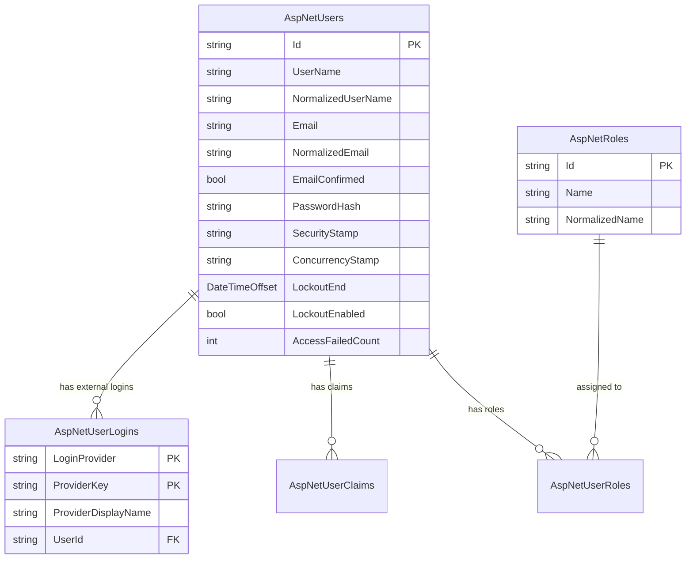
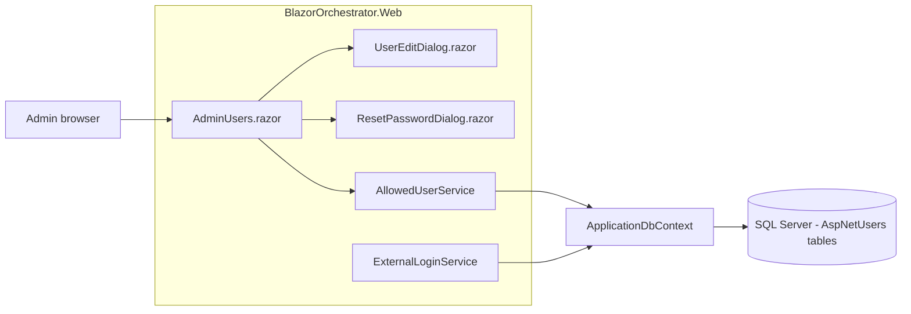
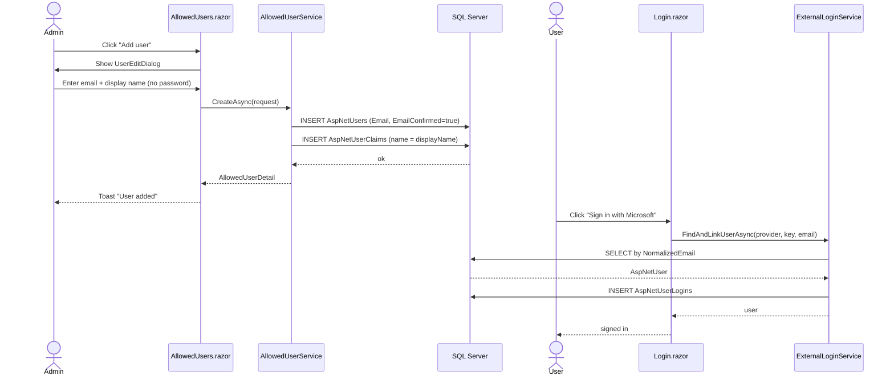
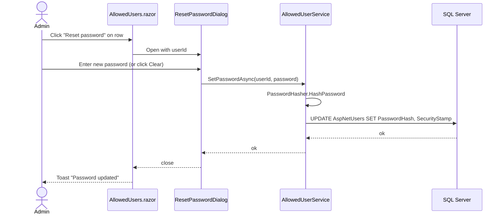
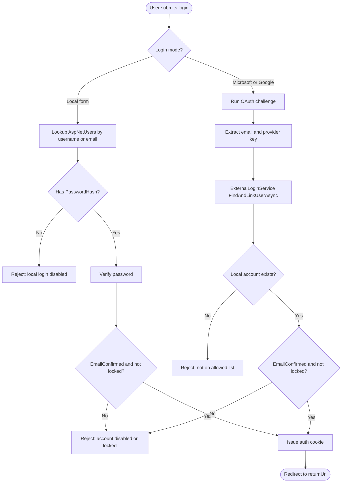

# Allowed Users Administration Screen — Implementation Plan

## 1. Overview

This document describes the design and implementation plan for a new **Allowed Users** administration screen in the Blazor Data Orchestrator. The screen lets an administrator create and manage the list of users who are permitted to sign in to the application using:

- **Microsoft** external authentication (Entra ID and personal Microsoft accounts)
- **Google** external authentication
- A local **username + password** account

The feature builds on the existing ASP.NET Core Identity tables (`AspNetUsers`, `AspNetUserLogins`, `AspNetUserClaims`) that already back authentication in the app. It explicitly does **not** auto-provision users: the admin must add an account before that user can log in.

### Goals

- Provide a single CRUD surface for managing user accounts.
- Allow an admin to invite a user by email so that user can log in with Microsoft or Google without needing a password.
- Allow an admin to set or reset a local password.
- Allow an admin to lock, unlock, enable or disable an account.
- Show which external providers are currently linked to each user, and let the admin unlink them.
- Enforce that the last enabled admin cannot be deleted or demoted (no lock-out scenario).

### Non-goals

- Self-service user registration (still admin-managed only).
- Role/permission management UI (covered separately — this screen only assigns the `Admin` flag).
- SSO group / tenant mapping.

---

## 2. User Stories

| ID | As a... | I want to... | So that... |
|----|---------|--------------|------------|
| US-1 | Admin | See a paged, searchable list of all allowed users | I can find any user quickly |
| US-2 | Admin | Add a new user with an email and optional password | They can sign in with Microsoft, Google, or locally |
| US-3 | Admin | Edit a user's display name, email, and admin flag | I can keep the directory accurate |
| US-4 | Admin | Reset or clear a user's password | I can help users locked out of local login |
| US-5 | Admin | Lock or unlock a user | I can revoke access temporarily |
| US-6 | Admin | Delete a user | I can remove users who have left |
| US-7 | Admin | See which external providers are linked to a user | I can audit account binding |
| US-8 | Admin | Unlink an external provider from a user | I can force re-linking after a key compromise |
| US-9 | System | Prevent the last admin from being removed | The app stays manageable |

---

## 3. Data Model

The feature reuses the existing Identity schema. No new tables are required, but two existing columns on `AspNetUsers` are repurposed for this UI:

- `EmailConfirmed` — interpreted as "user is enabled".
- `LockoutEnd` — interpreted as "user is locked until this UTC time" (use `DateTimeOffset.MaxValue` for an indefinite lock).

### Entity reference



### Admin flag

The "is admin" flag is determined by membership in the `AspNetRoles` row whose `NormalizedName = 'ADMIN'`. The seed data already creates an `Admin` role; the new UI exposes it as a single boolean toggle.

---

## 4. UX Design

### 4.1 Navigation

A new tab is added inside the existing `AdminHome.razor` page, alongside the current `Authentication Providers` tab:

```
Admin
  ├── General
  ├── Authentication Providers   (existing)
  └── Allowed Users              (new)
```

Alternatively, if `AdminHome.razor` is becoming too large, the screen can live at `/admin/users` and be linked from `AdminHome`. The plan assumes a dedicated route.

### 4.2 List view (`/admin/users`)

Uses Radzen `RadzenDataGrid` with:

- Columns: **Email**, **Username**, **Display name**, **Admin**, **Status**, **Providers**, **Created**, **Actions**
- Toolbar: free-text search, "+ Add user" button, "Refresh" button.
- Row actions: **Edit**, **Reset password**, **Lock / Unlock**, **Delete**.
- Status badge: `Enabled` (green), `Disabled` (grey), `Locked` (red).
- Providers cell: small chips for `Microsoft`, `Google`, `Local` — `Local` shown only when `PasswordHash != null`.

### 4.3 Add / Edit dialog

A `RadzenDialog` with the fields:

- **Email** (required, validated, unique against `NormalizedEmail`)
- **Username** (required, defaults to email, unique against `NormalizedUserName`)
- **Display name** (optional, stored in `AspNetUserClaims` as `name`)
- **Is administrator** (checkbox)
- **Enabled** (checkbox — maps to `EmailConfirmed`)
- **Allow Microsoft login** (checkbox — informational; actual login still requires the provider to be configured globally)
- **Allow Google login** (checkbox — same)
- **Set initial password** (optional; if provided, hashed into `PasswordHash`)

On save the dialog returns the saved `Guid`, the grid refreshes, and a toast confirms the action.

### 4.4 Reset / clear password dialog

- "New password" (optional). If left blank, `PasswordHash` is cleared and the user becomes external-only.
- "Force change at next login" — out of scope for v1.

### 4.5 Unlink provider confirmation

Triggered from the edit dialog's "Linked providers" section. Lists each `AspNetUserLogins` row with provider name, display name, and the linked `ProviderKey`. A trash icon removes the row after a confirmation prompt.

### 4.6 Empty / first-run state

If only the seeded `admin` user exists, the grid shows a banner: _"Add another user before disabling the seed account."_

---

## 5. System Architecture

### 5.1 Component diagram



### 5.2 New service — `AllowedUserService`

Lives at `src/BlazorOrchestrator.Web/Services/AllowedUserService.cs`. Scoped lifetime, registered in `Program.cs` next to `AuthService` and `ExternalLoginService`.

#### Public surface

```csharp
public class AllowedUserService
{
    Task<IReadOnlyList<AllowedUserListItem>> ListAsync(string? search, int skip, int take);
    Task<int> CountAsync(string? search);
    Task<AllowedUserDetail?> GetAsync(string userId);

    Task<AllowedUserDetail> CreateAsync(CreateAllowedUserRequest request);
    Task<AllowedUserDetail> UpdateAsync(string userId, UpdateAllowedUserRequest request);
    Task DeleteAsync(string userId);

    Task SetPasswordAsync(string userId, string? newPassword);
    Task SetLockoutAsync(string userId, DateTimeOffset? lockoutEnd);
    Task SetEnabledAsync(string userId, bool enabled);
    Task SetIsAdminAsync(string userId, bool isAdmin);

    Task UnlinkProviderAsync(string userId, string provider, string providerKey);
}
```

#### Supporting DTOs (in `Models/`)

- `AllowedUserListItem` — `Id`, `Email`, `UserName`, `DisplayName`, `IsAdmin`, `IsEnabled`, `IsLocked`, `LinkedProviders` (list of strings), `HasLocalPassword`, `CreatedUtc`.
- `AllowedUserDetail` — list item plus `LockoutEnd`, `Logins` (provider + key + display name).
- `CreateAllowedUserRequest` — `Email`, `UserName`, `DisplayName`, `IsAdmin`, `IsEnabled`, `InitialPassword`.
- `UpdateAllowedUserRequest` — `Email`, `UserName`, `DisplayName`, `IsAdmin`, `IsEnabled`.

#### Implementation notes

- Use `PasswordHasher<AspNetUser>` (already used in `AuthService`) for password hashing.
- Normalize `Email` / `UserName` with `ToUpperInvariant()` when writing.
- Always regenerate `SecurityStamp` and `ConcurrencyStamp` (new `Guid.NewGuid().ToString()`) on any sensitive change (password reset, email change, role change) so existing cookies become invalid on the next refresh.
- Wrap multi-table writes in a single `SaveChangesAsync` per request; the EF Core change tracker handles the transaction.

### 5.3 Existing components touched

| File | Change |
|------|--------|
| `Program.cs` | `builder.Services.AddScoped<AllowedUserService>();` |
| `Components/Routes.razor` | No change (already authorizes `/admin/*`). |
| `Components/Layout/NavMenu.razor` | Add **Users** link under Admin. |
| `Services/ExternalLoginService.cs` | No code change required; the existing `FindAndLinkUserAsync` already refuses to create accounts, which is exactly the behavior we want. |
| `Services/AuthService.cs` | No change — but verify that the lockout / disabled checks are honored on local login (see Section 8). |

---

## 6. Pages and Components

```
src/BlazorOrchestrator.Web/Components/Pages/Admin/
├── AdminHome.razor                (existing)
├── AllowedUsers.razor             (NEW — list page, route /admin/users)
└── Dialogs/
    ├── UserEditDialog.razor       (NEW — used for add + edit)
    └── ResetPasswordDialog.razor  (NEW)
```

### 6.1 `AllowedUsers.razor`

Skeleton outline:

```razor
@page "/admin/users"
@attribute [Authorize(Roles = "Admin")]
@inject AllowedUserService Users
@inject DialogService DialogService
@inject NotificationService Notify

<RadzenStack>
    <RadzenRow AlignItems="AlignItems.Center" JustifyContent="JustifyContent.SpaceBetween">
        <RadzenText TextStyle="TextStyle.H4">Allowed Users</RadzenText>
        <RadzenButton Text="Add user" Icon="add" Click="@OpenCreateAsync" />
    </RadzenRow>

    <RadzenTextBox @bind-Value="search" Placeholder="Search by email or name" />

    <RadzenDataGrid Data="@items"
                    Count="@total"
                    LoadData="@LoadAsync"
                    AllowPaging="true"
                    PageSize="25">
        <Columns>
            <RadzenDataGridColumn Property="Email"        Title="Email" />
            <RadzenDataGridColumn Property="UserName"     Title="Username" />
            <RadzenDataGridColumn Property="DisplayName"  Title="Name" />
            <RadzenDataGridColumn Property="IsAdmin"      Title="Admin" />
            <RadzenDataGridColumn Title="Status">
                <Template Context="u">
                    <StatusBadge User="u" />
                </Template>
            </RadzenDataGridColumn>
            <RadzenDataGridColumn Title="Providers">
                <Template Context="u">
                    <ProviderChips Providers="u.LinkedProviders" HasLocal="u.HasLocalPassword" />
                </Template>
            </RadzenDataGridColumn>
            <RadzenDataGridColumn Title="Actions">
                <Template Context="u">
                    <RowActions User="u" OnEdit="@OpenEditAsync"
                                          OnResetPassword="@OpenResetAsync"
                                          OnToggleLock="@ToggleLockAsync"
                                          OnDelete="@DeleteAsync" />
                </Template>
            </RadzenDataGridColumn>
        </Columns>
    </RadzenDataGrid>
</RadzenStack>
```

### 6.2 `UserEditDialog.razor`

- Accepts an optional `AllowedUserDetail` parameter; null means "create".
- Uses `EditForm` with `DataAnnotationsValidator`.
- Disables the **Is administrator** unchecking control when editing the last admin.

### 6.3 `ResetPasswordDialog.razor`

- Single password field with a "Show / hide" toggle and a strength meter.
- "Clear password" button that calls `SetPasswordAsync(userId, null)`.

---

## 7. End-to-end Flows

### 7.1 Add a user who will log in with Microsoft



### 7.2 Reset a local password



### 7.3 Login decision flow (after this feature)



---

## 8. Authorization and Safety Rules

1. The `/admin/users` route is protected by `[Authorize(Roles = "Admin")]`.
2. `AllowedUserService` re-checks the caller's role server-side before any mutation (defence in depth — Blazor Server already enforces, but service-level checks guard future API surfaces).
3. `DeleteAsync` and `SetIsAdminAsync(_, false)` must:
   - Refuse if the target user is the **only enabled member of the Admin role**.
   - Return a typed `AdminLockoutException` that the UI maps to a friendly toast.
4. `AuthService.AuthenticateAsync` must reject login when:
   - `EmailConfirmed == false`, OR
   - `LockoutEnd != null && LockoutEnd > DateTimeOffset.UtcNow`.
   This may already be present; verify and add tests.
5. `ExternalLoginService.FindAndLinkUserAsync` must apply the same checks before linking — a disabled/locked user must not be silently linked.
6. All password changes regenerate `SecurityStamp` so cached cookies on other devices are invalidated on the next refresh.

---

## 9. Validation Rules

| Field | Rule |
|-------|------|
| Email | Required, RFC-5321 format, unique on `NormalizedEmail`, max 256 chars |
| Username | Required, unique on `NormalizedUserName`, max 256 chars, no whitespace |
| Display name | Optional, max 100 chars |
| Initial password | Optional. If set: min 12 chars, must contain upper, lower, digit, symbol |
| Is admin | Boolean. Cannot be unset on the last admin |
| Enabled | Boolean. Cannot be set to false on the last enabled admin |

Validation is enforced both via `DataAnnotations` on the request DTOs and re-checked inside `AllowedUserService`.

---

## 10. Telemetry and Audit

- Every mutation in `AllowedUserService` writes an `ILogger` entry of the form `User {ActorId} {Action} {TargetUserId} {Details}`.
- Optionally, append a row to a new `UserAuditLog` Azure Table (out of scope for v1 — leave a TODO comment in the service).

---

## 11. Testing Strategy

### 11.1 Unit tests (`tests/BlazorOrchestrator.Web.Tests/Services/AllowedUserServiceTests.cs`)

- Create user with password — hash present, providers empty.
- Create user without password — hash null.
- Duplicate email rejected.
- Set password to null clears hash and bumps `SecurityStamp`.
- Lockout sets `LockoutEnd`; unlock clears it.
- Deleting last admin throws `AdminLockoutException`.
- Unlink provider removes only the targeted `AspNetUserLogins` row.

Use the in-memory EF provider or `Microsoft.EntityFrameworkCore.Sqlite` for tests.

### 11.2 Integration tests

- Spin up the app via `WebApplicationFactory`, sign in as the seed admin, exercise the admin endpoints.
- Verify that after creating a user, the external login callback (`AccountController.ExternalLoginCallback`) successfully links the Microsoft `NameIdentifier` to that user on first login.

### 11.3 Manual QA checklist

- [ ] Add user → user can log in with Microsoft (Entra) using matching email or `preferred_username`.
- [ ] Add user → user can log in with Google.
- [ ] Add user with password → user can log in locally.
- [ ] Disable user → all three login paths reject them.
- [ ] Lock user with future `LockoutEnd` → login rejected; auto-unlocks after the date.
- [ ] Unlink Microsoft provider → next Microsoft sign-in re-links on the same row.
- [ ] Delete user → all `AspNetUserLogins` and `AspNetUserClaims` are cascade-removed.
- [ ] Attempt to delete the only admin → blocked with a clear message.

---

## 12. Migration and Rollout

1. **Database** — no schema changes required; reuse existing Identity tables.
2. **Seed data** — keep the existing seeded `admin` user. Add a startup check that logs a warning if no enabled user is in the `Admin` role.
3. **Feature flag** — none required. Ship behind the existing `[Authorize(Roles = "Admin")]` gate.
4. **Docs** — update `wiki-content/Operation.md` with a "Managing users" section linking to this screen.
5. **Release notes** — call out that external sign-in still requires the user to be pre-added; this is unchanged behavior but newly surfaced through UI.

---

## 13. Open Questions

1. Should the admin be able to **invite** a user via email (sending a magic link), or only create the row silently? — Recommend silent in v1; email invitation in v2.
2. Should `LockoutEnabled` and `AccessFailedCount` be surfaced in the UI? — Recommend no; keep them internal.
3. Do we need per-provider allow lists (e.g. allow Google for some users, Microsoft only for others)? — Recommend no; gate at the global provider configuration screen.
4. Where do display names live — `AspNetUserClaims` row with type `name`, or a new column on `AspNetUsers`? — Recommend claims row to avoid a schema migration.

---

## 14. Estimated Work Breakdown

| Task | Notes |
|------|-------|
| `AllowedUserService` + DTOs + DI registration | Core business logic |
| `AllowedUsers.razor` list page with grid, search, paging | UI shell |
| `UserEditDialog.razor` add/edit dialog | Includes validation |
| `ResetPasswordDialog.razor` | Includes "clear password" |
| Unlink-provider section in edit dialog | Reads `AspNetUserLogins` |
| Lockout / enable / admin toggles wired into `AuthService` and `ExternalLoginService` | Verify and patch existing code |
| Last-admin guard + `AdminLockoutException` | Across service + UI |
| Unit + integration tests | Per Section 11 |
| Wiki docs update | `wiki-content/Operation.md` |

---

## 15. Acceptance Criteria

The feature is considered done when:

- An admin can complete every flow in the User Stories table without leaving the `/admin/users` screen.
- A newly-added user can log in with Microsoft, Google, or local credentials (according to what was configured) on the first attempt.
- Disabling, locking, or deleting a user blocks all three login paths within one minute.
- The last enabled admin cannot be removed or demoted, and the protective error is shown in the UI.
- All unit and integration tests pass in CI.
