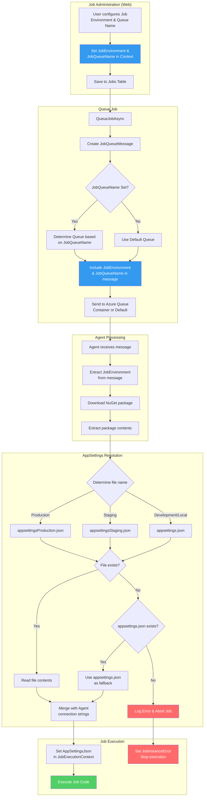

# Environment-Specific AppSettings and Container-Based Queueing for Job Execution

Enable jobs to use environment-specific appsettings files (e.g., appsettingsProduction.json) and route job execution to specific Azure Queues based on "Container Size" configurations defined in Job Administration.

## Flow Diagram

## Implementation Steps

### Agent Queue Configuration

Update BlazorOrchestrator.Agent to monitor the queue based on the "QueueName" setting in appsettings.json
Pass the QueName to the JobManager when executing jobs.
Update BlazorDataOrchestrator.Core\JobManager.cs to accept the QueueName parameter and use it when processing jobs.

### Environment Naming Convention

Continue using the `appsettings{Environment}.json` convention:
- **Production** → `appsettingsProduction.json`
- **Staging** → `appsettingsStaging.json`
- **Development/Local** → `appsettings.json`

### 1. Update Job Table & Edit Screen

- Create a new page called Admin/AdminHome.razor with a link on the /temporary page called Administration.
- Update the Administration page to add a tab at the top of the page to allow users to create and Edit Queue Names for Jobs in the JobQueue table.
- Update the Job Edit Details tab on JobDetails.razor to allow users to select a Queue Name from the JobQueue table using a dropdown. It is not required, allow it to be null.

### 2. Update JobQueueMessage

Add `JobEnvironment` and `JobQueueName` string properties to `src/BlazorDataOrchestrator.Core/Models/JobQueueMessage.cs`.

### 3. Modify Queue Selection Logic (JobService)

In `QueueJobAsync`, retrieve the `JobQueueName` from the Job definition.

Implement logic to determine the target Azure Queue (create the queue if it does not exist):
- **If JobQueueName is set:** Map the name to a specific queue (e.g., `jobs-large-container`).
- **If JobQueueName is null:** Use the 'default' job queue name.

Populate the `JobQueueMessage` with the `JobEnvironment` and the determined `JobQueueName`.

### 4. Send to Target Queue

Update the Azure Queue client to send the message to the dynamically determined queue rather than a hardcoded default.

### 5. Modify JobManager to read packaged appsettings

In `src/BlazorDataOrchestrator.Core/JobManager.cs` `ExecuteJobAsync`, after extracting the NuGet package, locate the appropriate appsettings file based on `JobEnvironment` (e.g., `appsettingsProduction.json`).

### 6. Merge packaged appsettings with runtime connection strings

Update `JobManager.cs` to load the JSON from the packaged file first, then merge/override the `ConnectionStrings` section with the Agent's configured values.

### 7. Add error handling for missing appsettings

If `appsettings.json` is missing entirely, log an error and abort job execution with a descriptive error in `JobInstance.JobInstanceError`.

### 8. Update JobExecutionContext (Optional)

Add `Environment` property to `src/BlazorDataOrchestrator.Core/Models/JobExecutionContext.cs` so the executing job code can access which environment it's running under.

## Files to Modify

| Area | File | Changes Needed |
|------|------|----------------|
| **Database** | `Core/Data/Job.cs` | Add `JobQueueName` column |
| **Queue Message** | `Core/Models/JobQueueMessage.cs` | Add `JobEnvironment` and `JobQueueName` fields |
| **Execution Context** | `Core/Models/JobExecutionContext.cs` | Add `Environment` property |
| **Job Processing** | `Core/JobManager.cs` | Read packaged appsettings based on environment |
| **Job Service** | `Web/Services/JobService.cs` | Queue selection logic, populate message fields |
| **Job Admin UI** | `Web/Components/Pages/JobDetails.razor` | Add Container Size dropdown |
