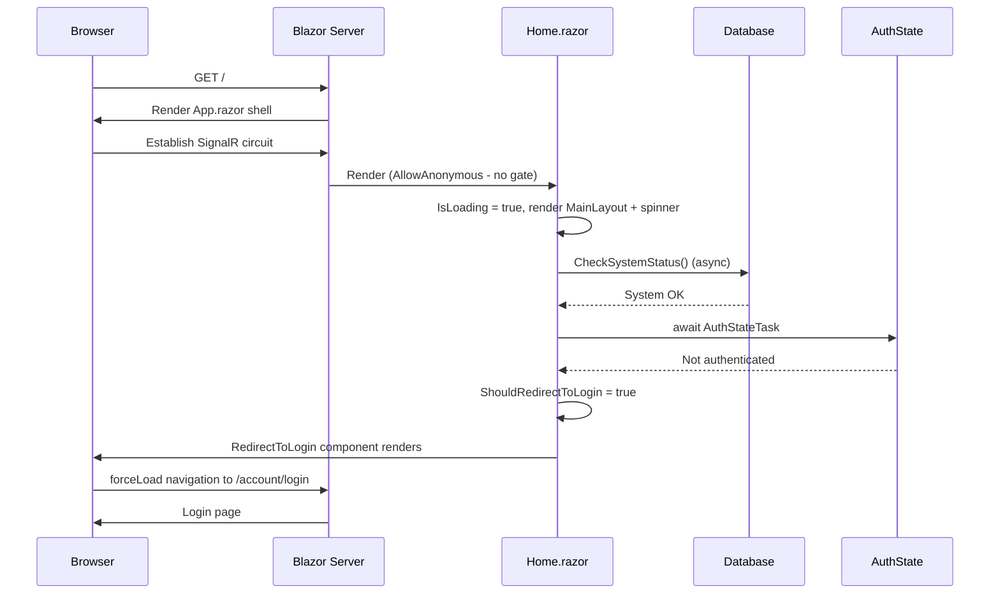
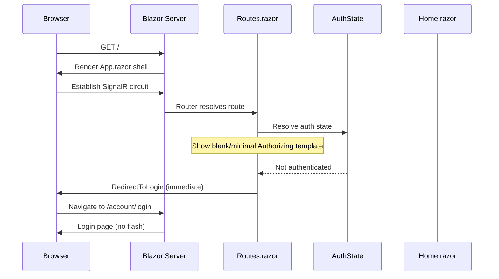
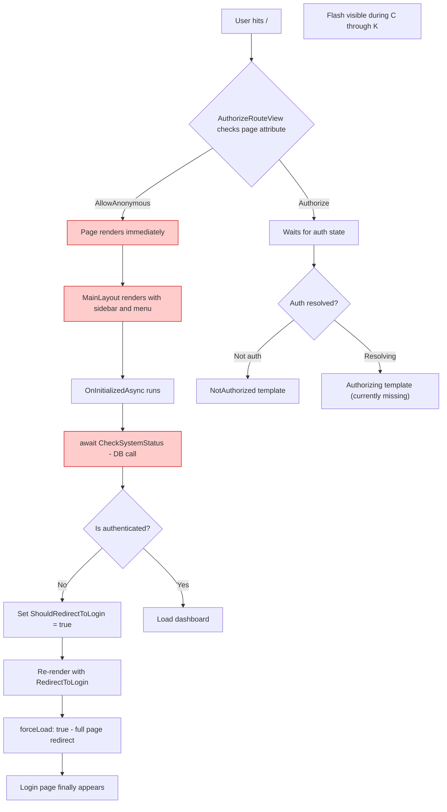
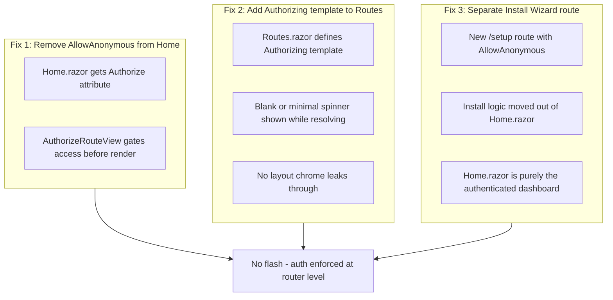
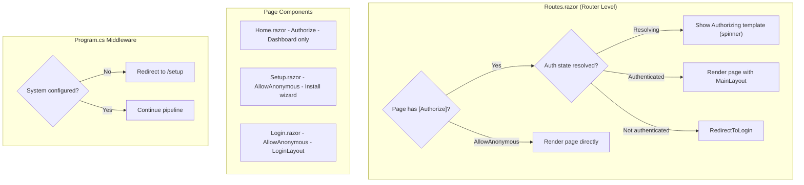
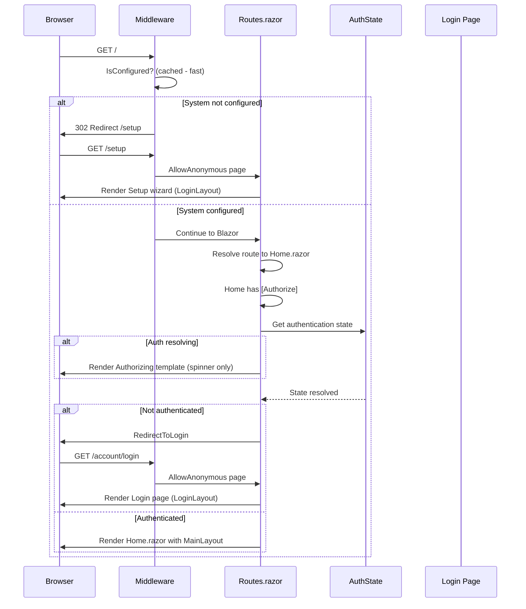

# Authentication Flash Fix Plan

## Problem Statement

When a user navigates to the application, the **home page with its menu and layout briefly renders** before the login screen appears. This "flash of unauthenticated content" (FOUC) occurs because:

1. `Home.razor` is marked `[AllowAnonymous]` — so `AuthorizeRouteView` never blocks it.
2. The page performs an async `CheckSystemStatus()` database call **before** checking authentication state.
3. Only after the async system check completes does the page evaluate auth and trigger a full-page `forceLoad: true` redirect to `/account/login`.
4. `Routes.razor` has no `<Authorizing>` template, so there is no placeholder while the auth state resolves.

The user sees the MainLayout chrome (sidebar, top bar) and a loading spinner for a visible period before being redirected.

## Current Architecture



**Problem window**: Between "Render MainLayout + spinner" and the final redirect, the user sees a flash of the authenticated layout.

## Desired Behavior



## Root Cause Analysis



## Solution Architecture

The fix involves three coordinated changes:



## Detailed Implementation Plan

### Step 1: Add Authorizing Template to Routes.razor

The `<Authorizing>` template ensures nothing renders while the `AuthenticationState` is being resolved asynchronously.

**File**: `Components/Routes.razor`

**Current:**
```razor
<Router AppAssembly="typeof(Program).Assembly">
    <Found Context="routeData">
        <AuthorizeRouteView RouteData="routeData" DefaultLayout="typeof(Layout.MainLayout)">
            <NotAuthorized>
                <RedirectToLogin />
            </NotAuthorized>
        </AuthorizeRouteView>
        <FocusOnNavigate RouteData="routeData" Selector="h1" />
    </Found>
</Router>
```

**Updated:**
```razor
<Router AppAssembly="typeof(Program).Assembly">
    <Found Context="routeData">
        <AuthorizeRouteView RouteData="routeData" DefaultLayout="typeof(Layout.MainLayout)">
            <Authorizing>
                <div class="auth-loading-container">
                    <div class="spinner-border text-primary" role="status">
                        <span class="visually-hidden">Loading...</span>
                    </div>
                </div>
            </Authorizing>
            <NotAuthorized>
                <RedirectToLogin />
            </NotAuthorized>
        </AuthorizeRouteView>
        <FocusOnNavigate RouteData="routeData" Selector="h1" />
    </Found>
</Router>
```

**Key**: The `<Authorizing>` template renders **outside** `MainLayout`, so no sidebar or nav will appear during auth resolution.

### Step 2: Create a Dedicated Setup/Install Route

The reason `Home.razor` is `[AllowAnonymous]` is that it doubles as the install wizard entry point. Separating these concerns eliminates the conflict.

**New File**: `Components/Pages/Setup.razor`

```razor
@page "/setup"
@attribute [AllowAnonymous]
@layout LoginLayout
```

This page handles:
- Database connection check
- Initial table creation
- Admin user creation

It uses `LoginLayout` (minimal, no nav chrome) so even if accessed directly, there is no flash of the full dashboard layout.

### Step 3: Change Home.razor to Authorize-Only

**File**: `Components/Pages/Home.razor`

**Change:**
```razor
@page "/"
@attribute [AllowAnonymous]   ← REMOVE THIS
```

**To:**
```razor
@page "/"
@attribute [Authorize]
```

With `[Authorize]`, the `AuthorizeRouteView` in `Routes.razor` will:
1. Show the `<Authorizing>` template while auth state resolves
2. Immediately render `<NotAuthorized>` → `<RedirectToLogin />` if unauthenticated
3. Only render `Home.razor` content if authenticated

**No async system check runs for unauthenticated users** — the redirect happens at the router level before the page component even instantiates.

### Step 4: Add Startup Redirect Logic for Unconfigured Systems

Since `/` is now `[Authorize]`, a fresh install (no DB, no users) would be stuck in a redirect loop. Add middleware to detect this and redirect to `/setup`.

**File**: `Program.cs`

Add a lightweight middleware **before** `UseAuthentication()`:

```csharp
// Redirect to setup if system is not configured
app.Use(async (context, next) =>
{
    if (!context.Request.Path.StartsWithSegments("/setup") &&
        !context.Request.Path.StartsWithSegments("/account") &&
        !context.Request.Path.StartsWithSegments("/_blazor") &&
        !context.Request.Path.StartsWithSegments("/_framework"))
    {
        var systemCheck = context.RequestServices.GetService<ISystemStatusService>();
        if (systemCheck != null && !await systemCheck.IsConfiguredAsync())
        {
            context.Response.Redirect("/setup");
            return;
        }
    }
    await next();
});
```

### Step 5: Create ISystemStatusService

**New File**: `Services/ISystemStatusService.cs`

```csharp
public interface ISystemStatusService
{
    Task<bool> IsConfiguredAsync();
}
```

**New File**: `Services/SystemStatusService.cs`

Caches the "is configured" result so the middleware check is near-zero cost after first evaluation:

```csharp
public class SystemStatusService : ISystemStatusService
{
    private bool? _isConfigured;
    private readonly IServiceProvider _serviceProvider;

    public SystemStatusService(IServiceProvider serviceProvider)
    {
        _serviceProvider = serviceProvider;
    }

    public async Task<bool> IsConfiguredAsync()
    {
        if (_isConfigured.HasValue)
            return _isConfigured.Value;

        // Check if database is reachable and has tables/admin
        using var scope = _serviceProvider.CreateScope();
        var dbContext = scope.ServiceProvider.GetService<ApplicationDbContext>();
        if (dbContext == null)
        {
            _isConfigured = false;
            return false;
        }

        try
        {
            var canConnect = await dbContext.Database.CanConnectAsync();
            if (!canConnect)
            {
                _isConfigured = false;
                return false;
            }

            // Check if admin user exists (system is configured)
            var hasAdmin = await dbContext.Users.AnyAsync();
            _isConfigured = hasAdmin;
            return hasAdmin;
        }
        catch
        {
            _isConfigured = false;
            return false;
        }
    }
}
```

Register as singleton so the cached result persists for the lifetime of the app:

```csharp
builder.Services.AddSingleton<ISystemStatusService, SystemStatusService>();
```

### Step 6: Ensure MainLayout Does Not Render for Unauthenticated Users

The `AuthorizeRouteView` with `DefaultLayout` only applies the layout **after** authorization succeeds. However, verify that `MainLayout.razor` wraps its nav chrome in an auth check:

**File**: `Components/Layout/MainLayout.razor`

Ensure the sidebar and top bar are inside:
```razor
<AuthorizeView>
    <Authorized>
        <!-- Sidebar, nav menu, top bar -->
        <div class="page">
            <div class="sidebar">
                <NavMenu />
            </div>
            <main>
                @Body
            </main>
        </div>
    </Authorized>
    <NotAuthorized>
        @Body
    </NotAuthorized>
</AuthorizeView>
```

This provides a fallback: even if somehow the layout renders for an unauthenticated user, they see only `@Body` (no nav chrome).

### Step 7: Style the Auth Loading State

**File**: `wwwroot/css/app.css` (or equivalent)

```css
.auth-loading-container {
    display: flex;
    justify-content: center;
    align-items: center;
    height: 100vh;
    background-color: var(--bs-body-bg, #fff);
}
```

This ensures the loading state is a clean full-screen spinner with no layout artifacts.

## Component Responsibility After Refactor



## Complete Request Flow After Fix



## Migration Strategy

Since this changes the fundamental routing of the application, the migration must be done carefully:

```mermaid
flowchart LR
    subgraph Phase1["Phase 1: Non-Breaking Prep"]
        A["Add Authorizing template to Routes.razor"]
        B["Create ISystemStatusService"]
        C["Create Setup.razor page"]
        D["Add auth-loading-container CSS"]
    end

    subgraph Phase2["Phase 2: Move Install Logic"]
        E["Extract install wizard logic from Home.razor"]
        F["Move to Setup.razor"]
        G["Add middleware redirect for unconfigured systems"]
    end

    subgraph Phase3["Phase 3: Lock Down Home"]
        H["Change Home.razor from AllowAnonymous to Authorize"]
        I["Remove manual auth check from OnInitializedAsync"]
        J["Remove ShouldRedirectToLogin logic"]
        K["Simplify Home.razor to dashboard-only"]
    end

    subgraph Phase4["Phase 4: Verify"]
        L["Test fresh install flow via /setup"]
        M["Test unauthenticated access - no flash"]
        N["Test authenticated access - immediate dashboard"]
        O["Test session expiry - clean redirect"]
    end

    Phase1 --> Phase2 --> Phase3 --> Phase4
```



## File Changes Summary

| File | Change |
|---|---|
| `Components/Routes.razor` | Add `<Authorizing>` template with minimal spinner |
| `Components/Pages/Home.razor` | Change `[AllowAnonymous]` to `[Authorize]`; remove manual auth checks |
| `Components/Pages/Setup.razor` | **New** — Install wizard with `[AllowAnonymous]` and `LoginLayout` |
| `Components/Layout/MainLayout.razor` | Wrap nav chrome in `<AuthorizeView>` guard |
| `Program.cs` | Add `ISystemStatusService` registration; add middleware for unconfigured redirect |
| `Services/ISystemStatusService.cs` | **New** — Interface for system configuration check |
| `Services/SystemStatusService.cs` | **New** — Cached implementation |
| `wwwroot/css/app.css` | Add `.auth-loading-container` styles |

## Testing Scenarios

| Scenario | Expected Behavior |
|---|---|
| Fresh install, no DB | Middleware redirects to `/setup` immediately |
| Configured system, unauthenticated user | Spinner briefly, then login page (no nav flash) |
| Configured system, authenticated user | Dashboard renders directly |
| Session expires mid-use | Next navigation shows spinner then login |
| Direct URL to protected page (e.g. `/jobs`) | Spinner then login, returnUrl preserved |
| Direct URL to `/setup` when configured | Setup page loads (harmless, shows "already configured") |

## Key Principles

1. **Authentication enforcement belongs at the router level**, not inside individual page components.
2. **The `<Authorizing>` template prevents any layout chrome from rendering** during the async auth state resolution window.
3. **Separate concerns**: Install wizard and dashboard are different responsibilities requiring different auth policies — they should be different routes.
4. **Middleware handles the edge case** of a completely unconfigured system needing anonymous access to set up.
5. **Cache the system status check** so it adds negligible overhead to every request after the first evaluation.
