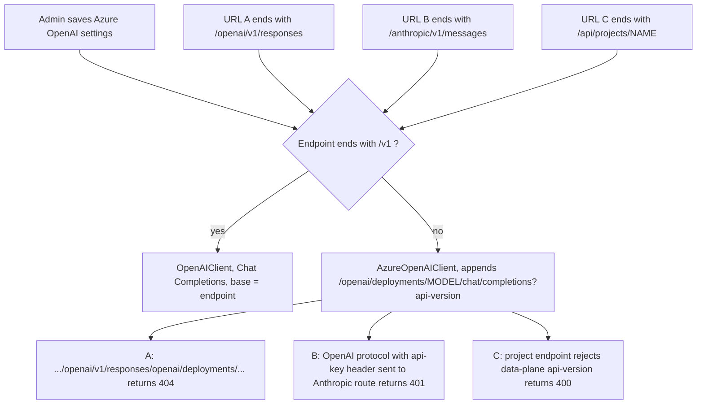
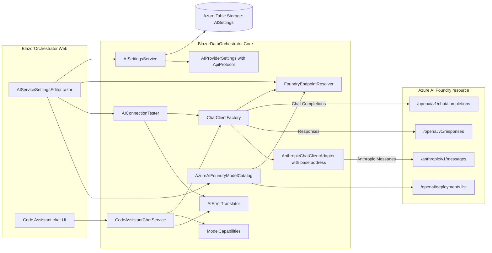
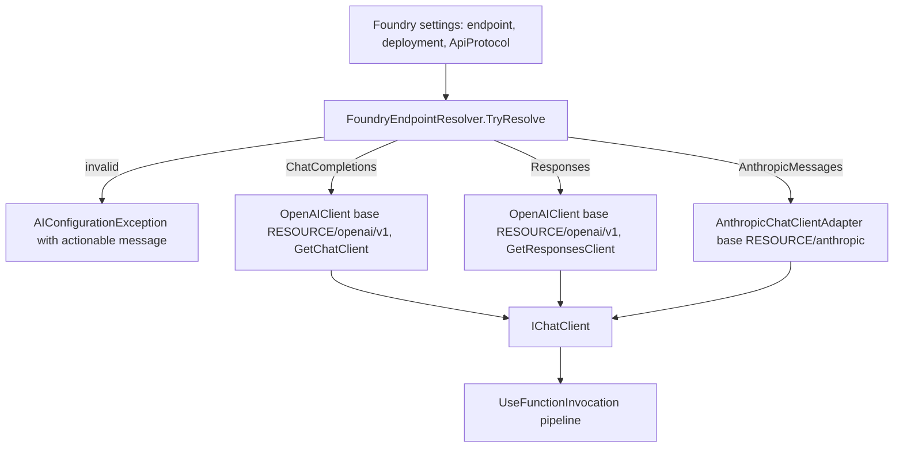
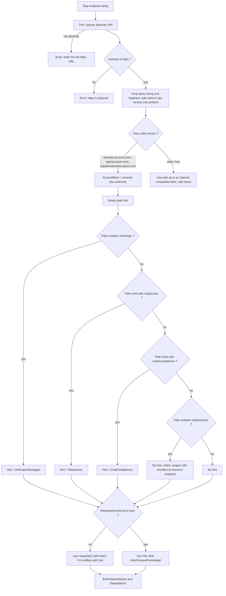
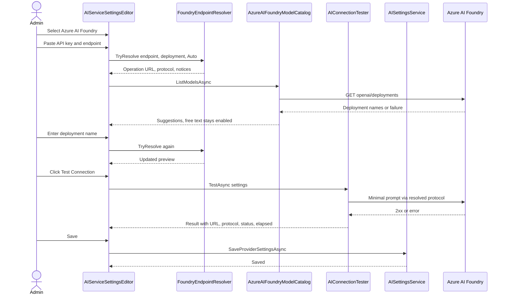
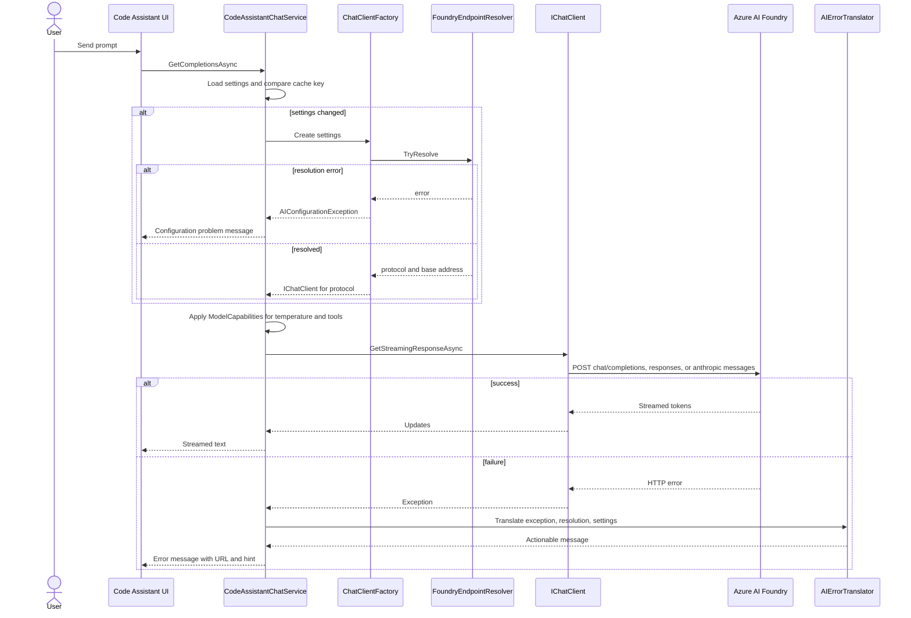
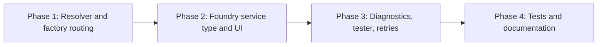

# Azure AI Foundry Endpoint Fix Plan

## 1. Overview

Admins who configure the Code Assistant against the Azure AI Foundry resource `lacoeaidevaifoundry` get three different failures, depending on which Foundry URL they paste into **Admin > AI Settings**:

| # | Endpoint entered | Error shown in chat |
|---|---|---|
| A | `https://lacoeaidevaifoundry.services.ai.azure.com/openai/v1/responses` | `❌ Error communicating with AI service: HTTP 404 (404) Resource not found` |
| B | `https://lacoeaidevaifoundry.services.ai.azure.com/anthropic/v1/messages` | `❌ Error communicating with AI service: HTTP 401 (401) Access denied due to invalid subscription key or wrong API endpoint...` |
| C | `https://lacoeaidevaifoundry.services.ai.azure.com/api/projects/lacoeaidevproject` | `❌ Error communicating with AI service: HTTP 400 (BadRequest) API version not supported` |

All three were entered with **AI Service Type = Azure OpenAI**, because that is the only provider that shows an Endpoint field.

This plan fixes all three by adding a new **Azure AI Foundry** service type. It accepts any Foundry URL, normalises it to the right base address, and sends each request over the correct wire protocol: OpenAI Chat Completions, OpenAI Responses, or Anthropic Messages. Existing **Azure OpenAI** configurations that point at `*.services.ai.azure.com` are routed through the same logic without any change from the admin.

### 1.1 Decisions (confirmed with stakeholder)

| Topic | Decision |
|---|---|
| Models that must work | OpenAI GPT (gpt-4o, gpt-4.1, gpt-5), Responses-only models (gpt-5-codex, o3-pro, codex-mini), Anthropic Claude, other Foundry models (Llama, Mistral, DeepSeek, Grok) |
| UX approach | New **Azure AI Foundry** service type. Admin pastes any Foundry URL and the app routes it automatically. |
| Authentication | API key only. Entra ID and managed identity are out of scope. |
| Scope | Web app only: Code Assistant chat and the Admin AI Settings editor |

### 1.2 Goals

- All three reported URLs work, or fail with a clear message that tells the admin what to fix.
- One Foundry API key and one endpoint can serve GPT, Responses-only, Claude, and partner models. Only the deployment name changes.
- Existing saved settings keep working. No data migration is needed.
- Error messages show the resolved URL, the protocol, and the likely cause. They never show the key.

### 1.3 Out of scope

- Microsoft Entra ID or managed identity authentication. Claude Mythos models support Entra ID only, so they stay unsupported.
- UI changes to `ConfigureAIDialog.razor` in `BlazorDataOrchestrator.JobCreatorTemplate` and the generated job projects. They get the backend routing fix for free through the shared `ChatClientFactory`.
- Foundry Agents service (project-scoped agents, threads, files).
- Embeddings through Foundry.
- Tool calling (MCP tools) for Claude. `AnthropicChatClientAdapter` does not map tools today, and this plan doesn't change that.

---

## 2. Root Cause Analysis

### 2.1 Current code path

The relevant code is in `src/BlazorDataOrchestrator.Core/Services/ChatClientFactory.cs`:

- `IsAIFoundryEndpoint(endpoint)` returns `true` **only** when the endpoint ends with `/v1`.
- If it returns `true`, the code uses `OpenAIClient` with `Endpoint = <url>` and the Chat Completions API.
- Otherwise it uses `AzureOpenAIClient` (Azure.AI.OpenAI 2.1.0). That client appends `/openai/deployments/{model}/chat/completions?api-version=<default or configured>` to whatever endpoint it was given.
- `ServiceKind.Anthropic` builds `AnthropicChatClientAdapter(apiKey, model)`. That adapter **ignores the endpoint** and always calls `api.anthropic.com`. The Anthropic provider also has no Endpoint field in the UI.



### 2.2 Per-URL diagnosis

| URL | Why it fails | Correct handling |
|---|---|---|
| **A** `/openai/v1/responses` | The URL ends with `/responses`, not `/v1`, so the legacy `AzureOpenAIClient` branch runs. That branch appends the classic deployment route to an operation URL, and the combined path does not exist, so the service returns 404. | Strip the operation suffix. Use base `https://RESOURCE.services.ai.azure.com/openai/v1` with `OpenAIClient`. The `/responses` suffix tells us the admin wants the **Responses API**, which Responses-only models such as gpt-5-codex require. |
| **B** `/anthropic/v1/messages` | Claude deployments speak the **Anthropic Messages** protocol and expect `x-api-key` plus `anthropic-version: 2023-06-01`. The app sent an OpenAI Chat Completions request with the Azure `api-key` header to the Anthropic route, so it was rejected with 401. | Use `AnthropicChatClientAdapter` with base `https://RESOURCE.services.ai.azure.com/anthropic`. The SDK then calls `/v1/messages` with `x-api-key` and `anthropic-version`. |
| **C** `/api/projects/NAME` | This is the **Foundry project endpoint**, used for the Agents and Projects APIs. It does not serve `openai/deployments/.../chat/completions` with the api-version that Azure.AI.OpenAI 2.1.0 sends by default, so it returns 400. | Rewrite to the account root and pick the protocol from the deployment. For example, `https://RESOURCE.services.ai.azure.com/openai/v1` for GPT or `/anthropic` for Claude. Show a notice that the project URL was rewritten. |

### 2.3 Secondary defects found

1. **Client-creation errors are swallowed.** `CodeAssistantChatService.GetOrCreateChatClientAsync()` catches every exception and sets `_chatClient = null`. The user then sees *"AI service is not configured"*, which is misleading when the real problem is a bad endpoint.
2. **Error messages hide the target.** `ProcessAIRequestAsync` shows only `ex.Message`. It doesn't show which URL, protocol, or deployment was called.
3. **Temperature is sent to models that reject it.** `isRestrictedModel` covers `gpt-5*` and `o1*` only. It misses `o3`, `o4`, `codex`, and Claude models where adaptive thinking is always on (for example Claude Opus 5.5). Those models can reject a non-default temperature with a 400.
4. **Tool calls go to models without tool support.** `options.Tools` (MCP tools) is sent to every model. Some Foundry partner models, such as DeepSeek-R1, reject `tools` with a 400.

---

## 3. Target Architecture

### 3.1 Component view



### 3.2 Protocol routing overview



---

## 4. Endpoint Resolution Design

### 4.1 New types

**File:** `src/BlazorDataOrchestrator.Core/Models/FoundryApiProtocol.cs`

```csharp
namespace BlazorDataOrchestrator.Core.Models;

public enum FoundryApiProtocol
{
    Auto = 0,
    ChatCompletions = 1,
    Responses = 2,
    AnthropicMessages = 3
}
```

**File:** `src/BlazorDataOrchestrator.Core/Services/Foundry/FoundryEndpointResolver.cs`

```csharp
namespace BlazorDataOrchestrator.Core.Services.Foundry;

public sealed record FoundryEndpointResolution(
    Uri AccountRoot,                 // https://RESOURCE.services.ai.azure.com
    FoundryApiProtocol Protocol,     // never Auto
    Uri BaseAddress,                 // what the SDK client is constructed with
    string OperationUrl,             // full URL shown in UI and error messages
    IReadOnlyList<string> Notices);  // informational messages for the admin

public static class FoundryEndpointResolver
{
    public static bool TryResolve(
        string endpoint,
        string deploymentName,
        FoundryApiProtocol requested,
        out FoundryEndpointResolution? resolution,
        out string? error);

    // True when an Azure OpenAI configuration should use the Foundry/v1 path instead of AzureOpenAIClient.
    public static bool ShouldUseV1Routing(string endpoint);

    public static FoundryApiProtocol InferProtocolFromModel(string deploymentName);
}
```

The resolver is a **pure function**. It has no I/O, so the UI can call it on every keystroke to show a live preview, and unit tests can drive it from a table.

### 4.2 Resolution algorithm



**Base address and operation URL by protocol:**

| Protocol | `BaseAddress` | `OperationUrl` |
|---|---|---|
| ChatCompletions | `{AccountRoot}/openai/v1` | `{AccountRoot}/openai/v1/chat/completions` |
| Responses | `{AccountRoot}/openai/v1` | `{AccountRoot}/openai/v1/responses` |
| AnthropicMessages | `{AccountRoot}/anthropic` | `{AccountRoot}/anthropic/v1/messages` |

**Model heuristic (`InferProtocolFromModel`)**, applied only when `Auto` is selected and the URL gives no hint:

| Deployment name (case-insensitive) | Protocol |
|---|---|
| starts with `claude` | AnthropicMessages |
| contains `codex`, or starts with `o1-pro`, `o3-pro`, `gpt-5-pro`, or `computer-use` | Responses |
| anything else (gpt-4o, gpt-4.1, gpt-5, Llama, Mistral, DeepSeek, Grok, Phi) | ChatCompletions |

> Deployment names can differ from model IDs. For example, a Claude deployment might be named `code-helper`. The explicit **API Protocol** dropdown exists for those cases.

### 4.3 Expected resolution of the reported URLs

| Input | Deployment | Protocol (Auto) | OperationUrl | Notices |
|---|---|---|---|---|
| `.../openai/v1/responses` | `gpt-5-codex` | Responses | `https://lacoeaidevaifoundry.services.ai.azure.com/openai/v1/responses` | none |
| `.../openai/v1/responses` | `gpt-4o` | Responses (URL hint wins) | same as above | none |
| `.../anthropic/v1/messages` | `claude-sonnet-4-6` | AnthropicMessages | `https://lacoeaidevaifoundry.services.ai.azure.com/anthropic/v1/messages` | none |
| `.../api/projects/lacoeaidevproject` | `gpt-4.1` | ChatCompletions | `https://lacoeaidevaifoundry.services.ai.azure.com/openai/v1/chat/completions` | "Project endpoint rewritten to resource endpoint" |
| `.../api/projects/lacoeaidevproject` | `claude-opus-5-5` | AnthropicMessages | `.../anthropic/v1/messages` | "Project endpoint rewritten to resource endpoint" |
| `https://lacoeaidevaifoundry.services.ai.azure.com` | `Llama-4-Maverick` | ChatCompletions | `.../openai/v1/chat/completions` | none |
| `http://lacoeaidevaifoundry.services.ai.azure.com` | any | error | n/a | "https is required" |

---

## 5. Settings Model and Persistence

### 5.1 `AIServiceType` enum

**File:** `src/BlazorDataOrchestrator.Core/Models/AIServiceType.cs`

```csharp
public enum AIServiceType
{
    OpenAI = 0,
    AzureOpenAI = 1,
    Anthropic = 2,
    GoogleAI = 3,
    AzureAIFoundry = 4
}
```

### 5.2 `AIServiceTypes` helper

**File:** `src/BlazorDataOrchestrator.Core/Models/AIServiceTypes.cs`

- `ToDisplayName`: add `ServiceKind.AzureAIFoundry => "Azure AI Foundry"`.
- `ToStorageKey`: unchanged. The RowKey becomes `"AzureAIFoundry"`.
- `TryParse` legacy aliases: add `foundry`, `aifoundry`, `azurefoundry`, `azureaifoundry`, and `microsoftfoundry` so they map to `AzureAIFoundry`.
- `All`: add `ServiceKind.AzureAIFoundry` after `AzureOpenAI`.

Search the solution for `ServiceKind.GoogleAI` and `AIServiceType.GoogleAI` to find every `switch` that needs a new arm. Known locations: `AIServiceSettingsEditor.razor` (labels, help text, links), `ChatClientFactory.Create`, and `AIModelCacheService` fallback defaults.

### 5.3 `AIProviderSettings`

**File:** `src/BlazorDataOrchestrator.Core/Models/AISettings.cs`

```csharp
public string ApiProtocol { get; set; } = "";   // stored as FoundryApiProtocol name; "" means Auto

public FoundryApiProtocol ParsedApiProtocol =>
    Enum.TryParse<FoundryApiProtocol>(ApiProtocol, ignoreCase: true, out var p) ? p : FoundryApiProtocol.Auto;
```

- Add `ApiProtocol` to `Clone()`.

### 5.4 `AISettingsService` and table entity

**File:** `src/BlazorDataOrchestrator.Core/Services/AISettingsService.cs`

- `AIProviderSettingsEntity`: add `public string? ApiProtocol { get; set; }`.
- `SaveProviderInternalAsync`: write `ApiProtocol = settings.ApiProtocol`.
- `ToModel`: read `ApiProtocol = entity.ApiProtocol ?? ""`.
- `ValidateApiKey`: no prefix check for `AzureAIFoundry`. The current fall-through already behaves this way.

Table Storage is schemaless, so older rows simply read `ApiProtocol = null`, which means Auto. **No migration is required.**

---

## 6. Chat Client Factory Changes

**File:** `src/BlazorDataOrchestrator.Core/Services/ChatClientFactory.cs`

### 6.1 Provider dispatch

```csharp
return settings.ServiceType switch
{
    ServiceKind.AzureAIFoundry => CreateFoundry(settings),
    ServiceKind.AzureOpenAI    => CreateAzureOpenAI(settings),
    ServiceKind.Anthropic      => new AnthropicChatClientAdapter(settings.ApiKey, settings.AIModel),
    ServiceKind.GoogleAI       => new GoogleAIChatClientAdapter(settings.ApiKey, settings.AIModel),
    _                          => CreateOpenAI(settings),
};
```

### 6.2 `CreateFoundry`

```csharp
private static IChatClient CreateFoundry(AIProviderSettings settings)
{
    if (!FoundryEndpointResolver.TryResolve(settings.Endpoint, settings.AIModel,
            settings.ParsedApiProtocol, out var r, out var error))
    {
        throw new AIConfigurationException(error!);
    }

    return r!.Protocol switch
    {
        FoundryApiProtocol.AnthropicMessages =>
            new AnthropicChatClientAdapter(settings.ApiKey, settings.AIModel, r.BaseAddress),

        FoundryApiProtocol.Responses =>
            CreateOpenAICompatibleClient(settings.ApiKey, r.BaseAddress)
                .GetResponsesClient(settings.AIModel)   // see note below
                .AsIChatClient(),

        _ =>
            CreateOpenAICompatibleClient(settings.ApiKey, r.BaseAddress)
                .GetChatClient(settings.AIModel)
                .AsIChatClient(),
    };
}

private static OpenAIClient CreateOpenAICompatibleClient(string apiKey, Uri baseAddress)
    => new(new ApiKeyCredential(apiKey.Trim()), new OpenAIClientOptions { Endpoint = baseAddress });
```

**Notes for the implementer:**

- The Responses client accessor was renamed during OpenAI .NET 2.x. It is `GetOpenAIResponseClient(model)` in older builds and `GetResponsesClient(model)` in newer ones. Use whichever accessor the pinned `OpenAI 2.11.0` exposes. The Responses API is marked experimental, so wrap the call in `#pragma warning disable OPENAI001` / `restore`. `Microsoft.Extensions.AI.OpenAI 10.7.0` provides the `AsIChatClient()` extension for that client.
- `OpenAIClient` sends the key as `Authorization: Bearer <key>`, which the Foundry `/openai/v1` surface accepts. That is how the current `/v1` branch already works. If a resource rejects Bearer, add a `PipelinePolicy` that also sets the `api-key` header.

### 6.3 Backward-compatible fix for the existing Azure OpenAI type

```csharp
private static IChatClient CreateAzureOpenAI(AIProviderSettings settings)
{
    // Foundry hosts and /openai/v1 or /anthropic URLs can't use the classic deployments route.
    if (FoundryEndpointResolver.ShouldUseV1Routing(settings.Endpoint))
    {
        return CreateFoundry(settings);
    }

    // existing AzureOpenAIClient path unchanged
}
```

`ShouldUseV1Routing` returns `true` when any of the following holds:

- The host ends with `.services.ai.azure.com`.
- The path contains `/openai/v1`.
- The path contains `/anthropic`.
- The path contains `/api/projects/`.

With this change, the three reported URLs start working **under the existing Azure OpenAI setting**, before anyone switches to the new service type. The JobCreatorTemplate dialog also benefits, because it calls `ChatClientFactory.Create`.

- Replace the body of `IsAIFoundryEndpoint` with a call to `ShouldUseV1Routing`. `AzureOpenAIModelCatalog` calls it, so the catalog and chat agree on routing.

### 6.4 New exception type

**File:** `src/BlazorDataOrchestrator.Core/Services/AIConfigurationException.cs`

```csharp
public sealed class AIConfigurationException(string message) : Exception(message);
```

It is thrown only for configuration problems found before any network call, such as an invalid URL or `http` instead of `https`.

---

## 7. Anthropic Adapter: Foundry Base Address

**File:** `src/BlazorDataOrchestrator.Core/Services/AnthropicChatClientAdapter.cs`

### 7.1 Constructor

```csharp
public AnthropicChatClientAdapter(string apiKey, string model, Uri? baseAddress = null)
{
    _model = model;
    _client = baseAddress is null
        ? new AnthropicClient(apiKey)
        : new AnthropicClient(new APIAuthentication(apiKey), CreateFoundryHttpClient(baseAddress));
}
```

### 7.2 Redirect handler

Anthropic.SDK 5.10.0 builds request URLs against `https://api.anthropic.com/v1/...`. A small `DelegatingHandler` rewrites the scheme, host, and path prefix to the Foundry base. It leaves the SDK's `x-api-key` and `anthropic-version` headers untouched, and those are exactly what Foundry expects.

```csharp
internal sealed class AnthropicBaseAddressHandler(Uri foundryBase) : DelegatingHandler
{
    private static readonly Uri AnthropicBase = new("https://api.anthropic.com/");

    protected override Task<HttpResponseMessage> SendAsync(HttpRequestMessage request, CancellationToken ct)
    {
        if (request.RequestUri is { } uri && AnthropicBase.IsBaseOf(uri))
        {
            var relative = AnthropicBase.MakeRelativeUri(uri).ToString();   // "v1/messages"
            request.RequestUri = new Uri($"{foundryBase.ToString().TrimEnd('/')}/{relative}");
        }
        return base.SendAsync(request, ct);
    }
}
```

- Share one static `SocketsHttpHandler` (with `PooledConnectionLifetime = 2 minutes`) as the `InnerHandler`, so rebuilding clients does not exhaust sockets.
- If `AnthropicClient` in 5.10.0 exposes a settable base URL (for example `ApiUrlFormat`), you may use that instead of the handler. Either way, the request target must be `{AccountRoot}/anthropic/v1/messages`.

### 7.3 Foundry Claude request requirements

| Item | Value |
|---|---|
| URL | `https://RESOURCE.services.ai.azure.com/anthropic/v1/messages` |
| Auth header | `x-api-key: <Foundry key>` |
| Version header | `anthropic-version: 2023-06-01` |
| `model` | Foundry **deployment name** |
| `max_tokens` | required. The existing `MaxOutputTokens` (16384) is sent. |

---

## 8. Model Capability Handling

**File:** `src/BlazorDataOrchestrator.Core/Services/ModelCapabilities.cs`

This helper replaces the inline `isRestrictedModel` logic in `CodeAssistantChatService.ProcessAIRequestAsync`.

```csharp
public static class ModelCapabilities
{
    public static bool SupportsTemperature(string model, FoundryApiProtocol protocol);
    public static bool SupportsTools(string model, FoundryApiProtocol protocol);
}
```

| Rule | Models |
|---|---|
| Omit `Temperature` | names starting with `o1`, `o3`, `o4`, or `gpt-5`; names containing `codex`; any AnthropicMessages deployment (Claude models with adaptive or extended thinking reject non-default temperature) |
| Omit `Tools` | AnthropicMessages (the adapter doesn't map tools yet); names containing `deepseek-r1` |

Runtime safety net (Phase 3): if a request fails with 400 and the body mentions `temperature` or `tools`, retry **once** without that option. Record the result for the session so the retry doesn't repeat on every message.

---

## 9. Code Assistant Chat Service Changes

**File:** `src/BlazorDataOrchestrator.Core/Services/CodeAssistantChatService.cs`

1. **Cache key.** Add `ApiProtocol` to the settings-changed comparison in `GetOrCreateChatClientAsync()`. It currently compares ServiceType, ApiKey, AIModel, Endpoint, ApiVersion, and DeploymentPath.
2. **Surface configuration errors.** Replace the empty `catch (Exception)` with:
   - `catch (AIConfigurationException ex)`: store the message in `_clientCreationError`.
   - In `GetCompletionsAsync`, if `_clientCreationError` is set, return `⚠️ AI configuration problem: {message}` instead of the "not configured" message.
3. **Store the resolution.** Keep the last `FoundryEndpointResolution` (it's `null` for non-Foundry providers) so the error translator can include the operation URL.
4. **Translate errors.** In `ProcessAIRequestAsync`, replace the error message with:
   `AIErrorTranslator.Translate(ex, _lastResolution, _cachedSettings.Active)`.
5. **Capabilities.** Use `ModelCapabilities` for `Temperature` and `Tools`.
6. **Logging.** Inject `ILogger<CodeAssistantChatService>` if it's not already there. Log at `Information` when a client is built: host, path, protocol, and deployment. Log at `Warning` on failures, with status code and operation URL. **Never log the API key.**

---

## 10. Error Translation

**File:** `src/BlazorDataOrchestrator.Core/Services/AIErrorTranslator.cs`

```csharp
public static class AIErrorTranslator
{
    public static string Translate(Exception ex, FoundryEndpointResolution? resolution, AIProviderSettings settings);
}
```

### 10.1 Status extraction

- OpenAI SDK: `System.ClientModel.ClientResultException.Status`.
- Anthropic.SDK: `HttpRequestException.StatusCode` where available. Otherwise match `(\d{3})` against the message.
- `AIConfigurationException`: return its message verbatim.

### 10.2 Message mapping

| Status | Body contains | Message template |
|---|---|---|
| 400 | `API version not supported` | "The endpoint {url} rejected the API version. If you pasted a Foundry **project** URL, use the resource URL `https://RESOURCE.services.ai.azure.com` or select **Azure AI Foundry** as the service type." |
| 400 | `operation does not work with the specified model`, `unsupported_operation`, or `chat completions` | "Deployment '{model}' does not support {protocol}. Set **API Protocol** to **Responses**." |
| 400 | `temperature` | "Deployment '{model}' does not accept a custom temperature." (a retry is attempted automatically) |
| 400 | `tools` | "Deployment '{model}' does not support tool calling." (a retry is attempted automatically) |
| 401 | any | "The key was rejected by {host} for {protocol}. Check that the key belongs to this Foundry resource. Claude deployments need the **Anthropic Messages** protocol." |
| 403 | any | "The key is valid but lacks access to deployment '{model}'. Check the deployment's access settings in the Foundry portal." |
| 404 | any | "Deployment '{model}' was not found at {url}. Check the deployment name in Foundry portal > Deployments." |
| 429 | any | "Rate limit or quota exceeded for '{model}'. Wait and retry, or raise the quota in the Foundry portal." |
| other | any | "HTTP {status} from {url}: {first 300 chars of service message}" |

Every message is prefixed with `❌ Error communicating with AI service:` to stay consistent with the current UI. Message text is HTML-encoded by the Radzen chat component, so passing service text through is safe.

---

## 11. Admin UI Changes

**File:** `src/BlazorOrchestrator.Web/Components/Shared/AIServiceSettingsEditor.razor`

### 11.1 Fields shown for Azure AI Foundry

| Field | Control | Notes |
|---|---|---|
| API Key | `RadzenTextBox` (masked, existing) | Help: "Keys and Endpoint on the Foundry resource Overview page, or Project API key in the Foundry portal." |
| Foundry Endpoint | `RadzenTextBox` | Placeholder `https://your-resource.services.ai.azure.com`. Help: "Paste any Foundry URL. Project, /openai/v1, and /anthropic URLs are normalised automatically." |
| API Protocol | `RadzenDropDown<FoundryApiProtocol>` | Options: Auto (recommended), Chat Completions, Responses, Anthropic Messages |
| Deployment Name | Existing model dropdown or free text | Label "Deployment Name". Always allow free text, because the catalog can't list every partner deployment. |
| Resolved request | Read-only `RadzenText` | Live output of `FoundryEndpointResolver`: operation URL and effective protocol |
| Notices | `RadzenAlert` Info | Resolver notices, such as "Project URL rewritten" |
| Validation error | `RadzenAlert` Danger | Resolver error. Save is disabled while an error is present. |
| Test Connection | `RadzenButton` | Calls `AIConnectionTester`. Busy state while running. |

The **API Version** and **Deployment Path** fields are hidden for Azure AI Foundry because the v1 surfaces don't use them.

### 11.2 Azure OpenAI section hint

When `SelectedServiceType == AzureOpenAI` and the endpoint host ends with `.services.ai.azure.com`, show an info alert: *"This is an Azure AI Foundry endpoint. Requests will be routed automatically. For Claude or Responses-only models, switch the service type to Azure AI Foundry to choose the protocol explicitly."* Add a **Switch** button that copies the key, endpoint, and model into the Foundry provider and selects it.

### 11.3 Admin configuration flow



---

## 12. Connection Tester

**File:** `src/BlazorDataOrchestrator.Core/Services/AIConnectionTester.cs` (register as scoped in `BlazorOrchestrator.Web/Program.cs`)

```csharp
public sealed record AIConnectionTestResult(
    bool Success,
    string OperationUrl,
    string Protocol,
    int? StatusCode,
    string Message,
    TimeSpan Elapsed);

public sealed class AIConnectionTester
{
    public Task<AIConnectionTestResult> TestAsync(AIProviderSettings settings, CancellationToken ct);
}
```

- Build the client through `ChatClientFactory.Create(settings)`, without function invocation.
- Send one user message, `Reply with OK`, with `MaxOutputTokens = 32` and no temperature or tools.
- Treat any 2xx as success, **even with empty text**. Reasoning models may spend the small token budget on reasoning.
- Apply a 30-second timeout through a linked `CancellationTokenSource`.
- Build the failure message with `AIErrorTranslator`.
- The tester works for every provider type, but the button is shown only for Azure AI Foundry and Azure OpenAI in this phase.

---

## 13. Model Catalog for Foundry

**File:** `src/BlazorDataOrchestrator.Core/Services/ModelCatalog/AzureAIFoundryModelCatalog.cs`

- `ServiceType => ServiceKind.AzureAIFoundry`.
- Resolve `AccountRoot` with `FoundryEndpointResolver`. If resolution fails, return `ModelListResult.NotConfigured(error)`.
- Candidate URLs, tried in order with the `api-key` header:
  - `{AccountRoot}/openai/deployments?api-version=2023-03-15-preview`
  - `{AccountRoot}/openai/v1/models`
- Reuse `ParseModels` from `AzureOpenAIModelCatalog`. Move it into `HttpModelCatalogBase` or a shared internal static helper.
- A failed listing is **not** an error for the admin. The editor keeps free-text entry and shows "Could not list deployments. Enter the deployment name from the Foundry portal."
- Register it in `src/BlazorOrchestrator.Web/Program.cs` next to the existing `AzureOpenAIModelCatalog` registration.

---

## 14. Runtime Chat Flow After the Fix



---

## 15. File Change Summary

| File | Change |
|---|---|
| `src/BlazorDataOrchestrator.Core/Models/AIServiceType.cs` | Add `AzureAIFoundry = 4` |
| `src/BlazorDataOrchestrator.Core/Models/AIServiceTypes.cs` | Display name, aliases, `All` list |
| `src/BlazorDataOrchestrator.Core/Models/FoundryApiProtocol.cs` | **New** enum |
| `src/BlazorDataOrchestrator.Core/Models/AISettings.cs` | `ApiProtocol`, `ParsedApiProtocol`, `Clone()` |
| `src/BlazorDataOrchestrator.Core/Services/AISettingsService.cs` | Persist and read `ApiProtocol` |
| `src/BlazorDataOrchestrator.Core/Services/Foundry/FoundryEndpointResolver.cs` | **New** pure resolver |
| `src/BlazorDataOrchestrator.Core/Services/AIConfigurationException.cs` | **New** |
| `src/BlazorDataOrchestrator.Core/Services/ChatClientFactory.cs` | `CreateFoundry`, v1 routing for Azure OpenAI, `IsAIFoundryEndpoint` delegates to resolver |
| `src/BlazorDataOrchestrator.Core/Services/AnthropicChatClientAdapter.cs` | Optional base address and redirect handler |
| `src/BlazorDataOrchestrator.Core/Services/ModelCapabilities.cs` | **New** |
| `src/BlazorDataOrchestrator.Core/Services/AIErrorTranslator.cs` | **New** |
| `src/BlazorDataOrchestrator.Core/Services/AIConnectionTester.cs` | **New** |
| `src/BlazorDataOrchestrator.Core/Services/CodeAssistantChatService.cs` | Cache key, error surfacing, translator, capabilities, logging |
| `src/BlazorDataOrchestrator.Core/Services/ModelCatalog/AzureAIFoundryModelCatalog.cs` | **New** |
| `src/BlazorDataOrchestrator.Core/Services/ModelCatalog/AzureOpenAIModelCatalog.cs` | Share `ParseModels`, use resolver for Foundry detection |
| `src/BlazorOrchestrator.Web/Components/Shared/AIServiceSettingsEditor.razor` | Foundry section, preview, protocol dropdown, Test Connection, Azure OpenAI hint |
| `src/BlazorOrchestrator.Web/Program.cs` | Register `AzureAIFoundryModelCatalog` and `AIConnectionTester` |
| `wiki-content/` (AI settings page) | Document the Foundry service type and supported URLs |

No new NuGet packages are required. The existing `OpenAI 2.11.0`, `Microsoft.Extensions.AI.OpenAI 10.7.0`, and `Anthropic.SDK 5.10.0` cover every protocol.

---

## 16. Implementation Phases



### Phase 1: Resolver and factory routing (fixes all three reported errors)

1. Add `FoundryApiProtocol` and `FoundryEndpointResolver` with the rules in Section 4.
2. Add `AIConfigurationException`.
3. Add the base-address support to `AnthropicChatClientAdapter` (Section 7).
4. Add `CreateFoundry`, and route `CreateAzureOpenAI` through it when `ShouldUseV1Routing` is true (Section 6).
5. Stop swallowing client-creation errors in `CodeAssistantChatService`.
6. Verify URLs A, B, and C with **Azure OpenAI** as the service type.

### Phase 2: Azure AI Foundry service type and UI

1. Add the enum value, helpers, `ApiProtocol` persistence, and the cache key update.
2. Add the Foundry section to `AIServiceSettingsEditor.razor` with the live resolver preview.
3. Add `AzureAIFoundryModelCatalog` and register it.
4. Add the Azure OpenAI "Switch to Azure AI Foundry" hint.

### Phase 3: Diagnostics

1. Add `AIErrorTranslator` and wire it into chat.
2. Add `AIConnectionTester` and the **Test Connection** button.
3. Add `ModelCapabilities` and the one-time retry without temperature or tools.
4. Add structured logging without secrets.

### Phase 4: Tests and documentation

1. Create the xUnit project `tests/BlazorDataOrchestrator.Core.Tests` (net10.0) with table-driven tests for `FoundryEndpointResolver`, `InferProtocolFromModel`, `ModelCapabilities`, and `AIErrorTranslator`.
2. Run the manual test matrix in Section 17 against `lacoeaidevaifoundry`.
3. Update the AI settings page in `wiki-content/`.

---

## 17. Test Plan

### 17.1 Unit tests (resolver)

| Case | Input endpoint | Deployment | Requested | Expected protocol | Expected base | Notice / error |
|---|---|---|---|---|---|---|
| U1 | `https://r.services.ai.azure.com/openai/v1/responses` | `gpt-5-codex` | Auto | Responses | `https://r.services.ai.azure.com/openai/v1` | none |
| U2 | `https://r.services.ai.azure.com/anthropic/v1/messages` | `claude-sonnet-4-6` | Auto | AnthropicMessages | `https://r.services.ai.azure.com/anthropic` | none |
| U3 | `https://r.services.ai.azure.com/api/projects/p1` | `gpt-4.1` | Auto | ChatCompletions | `https://r.services.ai.azure.com/openai/v1` | project rewritten |
| U4 | `https://r.services.ai.azure.com/` | `claude-opus-5-5` | Auto | AnthropicMessages | `.../anthropic` | none |
| U5 | `https://r.services.ai.azure.com/` | `my-claude` | AnthropicMessages | AnthropicMessages | `.../anthropic` | none |
| U6 | `https://r.services.ai.azure.com/openai/v1/responses` | `gpt-4o` | ChatCompletions | ChatCompletions | `.../openai/v1` | conflict notice |
| U7 | `https://r.openai.azure.com/openai/v1?api-version=2024-10-21` | `gpt-4o` | Auto | ChatCompletions | `https://r.openai.azure.com/openai/v1` | api-version dropped |
| U8 | `http://r.services.ai.azure.com` | any | Auto | error | n/a | https required |
| U9 | `not a url` | any | Auto | error | n/a | full URL required |
| U10 | `https://r.services.ai.azure.com/` | `Llama-4-Maverick` | Auto | ChatCompletions | `.../openai/v1` | none |

### 17.2 Manual test matrix (lacoeaidevaifoundry)

| # | Service type | Endpoint | Deployment | Expected |
|---|---|---|---|---|
| M1 | Azure OpenAI (legacy) | URL A | GPT deployment | Chat works through Responses |
| M2 | Azure OpenAI (legacy) | URL B | Claude deployment | Chat works through Anthropic Messages |
| M3 | Azure OpenAI (legacy) | URL C | GPT deployment | Chat works; no 400 |
| M4 | Azure AI Foundry | resource root | GPT deployment, Auto | Chat Completions works |
| M5 | Azure AI Foundry | resource root | Responses-only deployment, Auto | Responses works |
| M6 | Azure AI Foundry | resource root | Claude deployment, Auto | Anthropic Messages works |
| M7 | Azure AI Foundry | resource root | Llama, Mistral, DeepSeek, or Grok deployment | Chat Completions works; DeepSeek-R1 runs without tools |
| M8 | Azure AI Foundry | resource root | wrong deployment name | 404 message names the deployment and URL |
| M9 | Azure AI Foundry | resource root | valid, with wrong key | 401 message, no key echoed |
| M10 | Azure OpenAI | `https://x.openai.azure.com` classic | GPT deployment | Unchanged behaviour (regression check) |
| M11 | OpenAI, Anthropic, Google AI | n/a | n/a | Unchanged behaviour (regression check) |
| M12 | JobCreatorTemplate dialog, Azure OpenAI | URL A | GPT deployment | Test in the dialog succeeds (shared factory) |

Run M1 to M12 both locally (Aspire with Podman Desktop) and in the Azure Container Apps deployment. Outbound HTTPS is the only dependency, so behaviour should be identical.

---

## 18. Security Considerations

- **Secrets:** API keys are never written to logs, error messages, the resolved-URL preview, or telemetry. The translator builds messages from the status code, URL, deployment, and service text only.
- **Transport:** The resolver rejects non-`https` endpoints.
- **Input handling:** Query strings and fragments are stripped before use. Only scheme, authority, and known path segments are used to build URLs, which prevents admins from injecting path or query tricks by accident.
- **Unknown hosts:** Unknown hosts are allowed so that APIM or gateway front doors keep working. The UI shows a warning so the admin knows the key will go to a non-Azure host.
- **Output encoding:** Service error text is shown through Radzen components, which HTML-encode content.
- **Storage:** Plain-text key storage in Table Storage doesn't change. Moving keys to Key Vault is tracked separately.

---

## 19. Risks and Mitigations

| Risk | Impact | Mitigation |
|---|---|---|
| The deployment name doesn't reveal the model family, for example a Claude deployment named `helper` | Auto picks the wrong protocol and the request fails with 401 or 404 | Explicit **API Protocol** dropdown; the translator's 401 message suggests Anthropic Messages |
| The OpenAI SDK Responses accessor name differs in 2.11.0 | Build error | Check the pinned package and use the accessor it exposes (Section 6.2) |
| Anthropic.SDK changes its base URL handling | Requests go to api.anthropic.com | The `DelegatingHandler` rewrite doesn't depend on SDK internals; unit-test the handler |
| A model rejects temperature or tools | 400 on first message | `ModelCapabilities` rules plus a one-time automatic retry |
| Entra-only Claude models (Mythos) | 401 even with a valid key | Documented as out of scope; the 401 message mentions that some models need Entra ID |
| Deployment listing doesn't return partner deployments | Empty dropdown | Free-text deployment entry is always enabled |

---

## 20. Acceptance Criteria

1. URL **A** with a GPT or Responses-only deployment returns a streamed answer, under both Azure OpenAI and Azure AI Foundry service types.
2. URL **B** with a Claude deployment returns a streamed answer, under both service types.
3. URL **C** is accepted, rewritten to the resource endpoint with a visible notice, and returns a streamed answer.
4. Partner models (Llama, Mistral, DeepSeek, Grok) work through Chat Completions with the same key and endpoint.
5. **Test Connection** reports success or an actionable failure within 30 seconds.
6. Every failure message includes the operation URL, protocol, deployment, and a remediation hint, and never the key.
7. Existing OpenAI, Anthropic, Google AI, and classic Azure OpenAI configurations behave exactly as before.
8. Resolver unit tests U1 to U10 pass.
