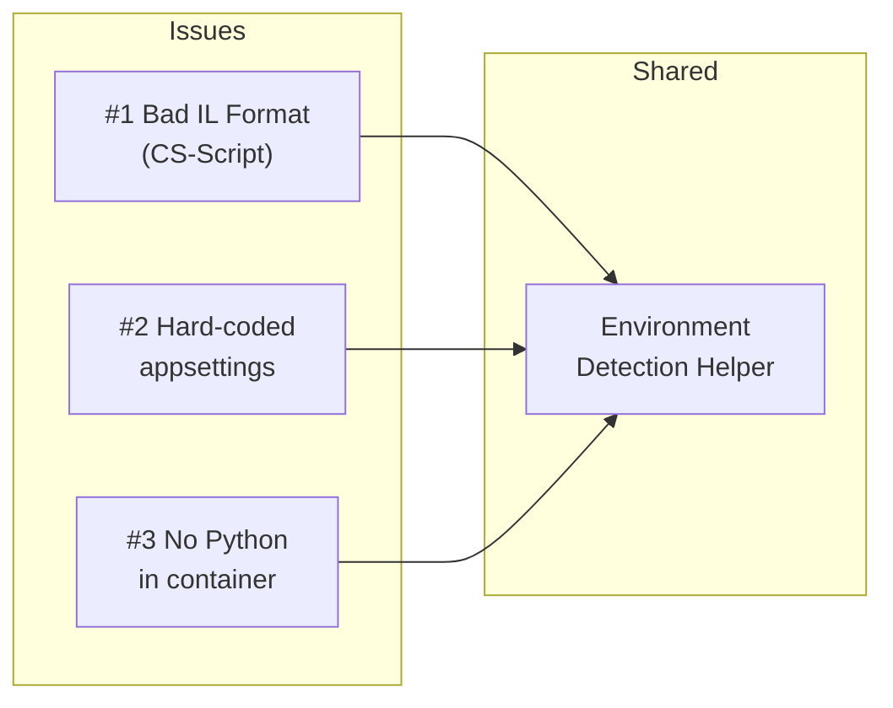
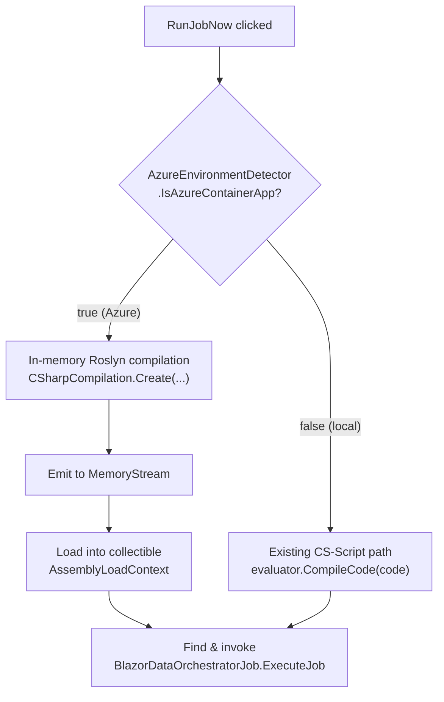
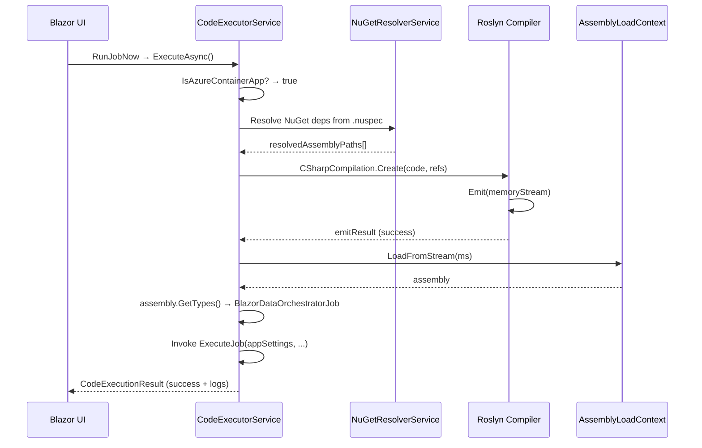
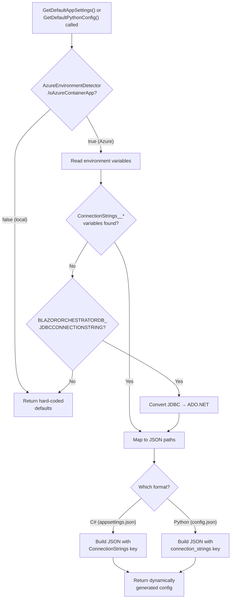
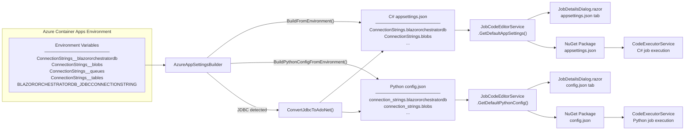
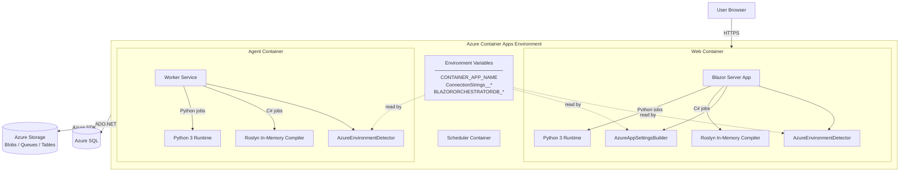
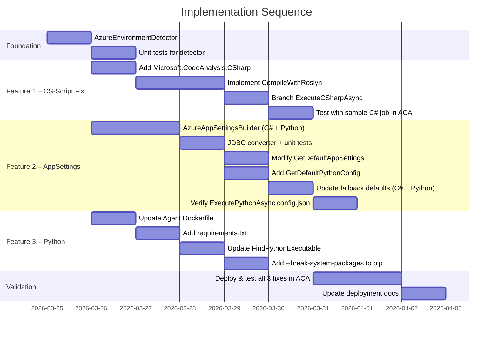
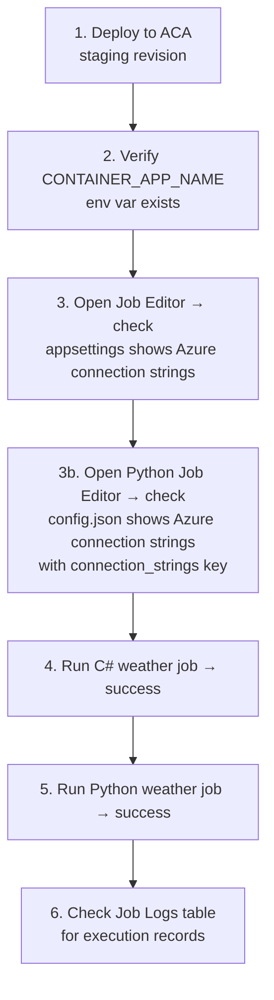

# Azure Container Apps Runtime Fixes — Implementation Plan

> **Date:** 2026-03-24  
> **Status:** Draft  
> **Affected Projects:** `BlazorDataOrchestrator.Core`, `BlazorOrchestrator.Web`, `BlazorOrchestrator.Agent`  
> **Scope:** Three runtime failures that occur exclusively when the application is deployed to Azure Container Apps.

---

## Table of Contents

1. [Summary of Issues](#1-summary-of-issues)
2. [Shared Prerequisite — Environment Detection](#2-shared-prerequisite--environment-detection)
3. [Feature #1 — C# Job Execution Fails with "Bad IL format"](#3-feature-1--c-job-execution-fails-with-bad-il-format)
4. [Feature #2 — Derive appsettings.json from Azure Environment Variables](#4-feature-2--derive-appsettingsjson-from-azure-environment-variables)
5. [Feature #3 — Python Jobs Fail ("Python executable not found")](#5-feature-3--python-jobs-fail-python-executable-not-found)
6. [Full System Architecture](#6-full-system-architecture)
7. [Implementation Order & Checklist](#7-implementation-order--checklist)
8. [Testing Strategy](#8-testing-strategy)

---

## 1. Summary of Issues

| # | Error | Root Cause |
|---|-------|------------|
| 1 | `Bad IL format. The format of the file '/app/BlazorDataOrchestrator.Core' is invalid.` | CS-Script's `ReferenceAssembliesFromCode` probes `/app/` and resolves the **directory** `/app/BlazorDataOrchestrator.Core` (or the extensionless host binary) instead of the `.dll`. `Assembly.LoadFile` fails because the path is not a valid PE file. |
| 2 | `appsettings.json` / `appsettings.Production.json` contain hard-coded localhost connection strings | `DefaultAppSettings` in `JobCodeEditorService` is a compile-time constant pointing at `127.0.0.1,14330`. When running in Azure the settings should be derived from Container App environment variables such as `ConnectionStrings__blazororchestratordb`. |
| 3 | `Python executable not found. Ensure Python is installed and in PATH.` | The `mcr.microsoft.com/dotnet/aspnet` base image does not include Python. `FindPythonExecutable()` in `CodeExecutorService` tries candidates like `python`, `python3`, `/usr/bin/python3` — none exist in the container. |



---

## 2. Shared Prerequisite — Environment Detection

The codebase already uses a loopback check in `Home.razor`:

```csharp
// Home.razor line 237
private bool IsRunningLocally => new Uri(NavigationManager.BaseUri).IsLoopback;

// Home.razor line 952
var uri = new Uri(NavigationManager.BaseUri);
if (!uri.IsLoopback) { /* Running in Azure */ }
```

This works in Razor components but **cannot be used in services** (no `NavigationManager`). We need a centralised, DI-friendly helper.

### 2.1 Create `AzureEnvironmentDetector`

**File:** `BlazorDataOrchestrator.Core/Services/AzureEnvironmentDetector.cs`

```csharp
namespace BlazorDataOrchestrator.Core.Services;

/// <summary>
/// Determines whether the application is running inside
/// Azure Container Apps or locally.
/// </summary>
public static class AzureEnvironmentDetector
{
    /// <summary>
    /// Azure Container Apps injects CONTAINER_APP_NAME automatically
    /// into every revision. This is the most reliable signal.
    /// </summary>
    public static bool IsAzureContainerApp =>
        !string.IsNullOrEmpty(
            Environment.GetEnvironmentVariable("CONTAINER_APP_NAME"));

    /// <summary>
    /// Fallback: checks whether the given base URI is non-loopback.
    /// Intended for Razor components that have access to NavigationManager.
    /// </summary>
    public static bool IsRemoteHost(string baseUri)
    {
        try { return !new Uri(baseUri).IsLoopback; }
        catch { return false; }
    }
}
```

### 2.2 Why `CONTAINER_APP_NAME`?

Azure Container Apps automatically injects several environment variables:

| Variable | Example Value |
|----------|---------------|
| `CONTAINER_APP_NAME` | `blazor-web` |
| `CONTAINER_APP_REVISION` | `blazor-web--abc1234` |
| `CONTAINER_APP_REPLICA_NAME` | `blazor-web--abc1234-5b8c9d7f6-xk2lp` |
| `CONTAINER_APP_ENV_DNS_SUFFIX` | `orangedesert-abc123.eastus.azurecontainerapps.io` |

Checking `CONTAINER_APP_NAME` requires **zero configuration** and works in any service or background worker.

---

## 3. Feature #1 — C# Job Execution Fails with "Bad IL format"

### 3.1 Root Cause Deep Dive

The error call-chain is:

```
CodeExecutorService.ExecuteCSharpAsync (line 203)
  → evaluator.CompileCode(code)
    → EvaluatorBase.ReferenceAssembliesFromCode(code, searchDirs)
      → EvaluatorBase.ReferenceAssembly(assembly)
        → Assembly.LoadFile("/app/BlazorDataOrchestrator.Core")   ← FAILS
```

CS-Script scans `using` directives in the user's code and tries to resolve matching assemblies by searching the **application base directory** (`/app/`). On Linux, publish output places everything flat in `/app/`. The probing logic finds a path like `/app/BlazorDataOrchestrator.Core` — which is either:

- The **directory** if the publish layout creates one, or  
- A **native host executable** (extensionless on Linux when `UseAppHost=true`)

Neither is a valid managed assembly, so `Assembly.LoadFile` throws `BadImageFormatException`.

This does **not** happen on Windows because:
1. File extension `.dll` is always present.
2. The directory name would be `BlazorDataOrchestrator.Core\` (backslash), not matching assembly probing.

### 3.2 Solution — In-Memory Roslyn Compilation for Azure

When running in Azure, bypass CS-Script entirely and use the Roslyn compiler APIs (`Microsoft.CodeAnalysis.CSharp`) to compile in-memory. This avoids all file-system assembly probing.



### 3.3 Detailed Changes

#### 3.3.1 Add NuGet Package

**File:** `BlazorDataOrchestrator.Core/BlazorDataOrchestrator.Core.csproj`

Add:
```xml
<PackageReference Include="Microsoft.CodeAnalysis.CSharp" Version="4.*" />
```

This package is already an indirect dependency of CS-Script but must be referenced directly for the in-memory path.

#### 3.3.2 New Method: `CompileWithRoslynAsync`

**File:** `BlazorDataOrchestrator.Core/Services/CodeExecutorService.cs`

Add a new private method:

```csharp
using Microsoft.CodeAnalysis;
using Microsoft.CodeAnalysis.CSharp;

private Assembly CompileWithRoslyn(string code, List<string> logs,
    List<string> resolvedAssemblyPaths)
{
    logs.Add("Using in-memory Roslyn compilation (Azure Container Apps).");

    var syntaxTree = CSharpSyntaxTree.ParseText(code);

    // 1. Gather MetadataReferences from currently loaded assemblies
    var references = new List<MetadataReference>();

    foreach (var asm in AppDomain.CurrentDomain.GetAssemblies())
    {
        if (asm.IsDynamic || string.IsNullOrEmpty(asm.Location))
            continue;

        try { references.Add(MetadataReference.CreateFromFile(asm.Location)); }
        catch { /* skip unreadable assemblies */ }
    }

    // 2. Add Trusted Platform Assemblies (runtime facades)
    var tpa = (AppContext.GetData("TRUSTED_PLATFORM_ASSEMBLIES") as string)
        ?.Split(Path.PathSeparator) ?? Array.Empty<string>();

    var existingPaths = new HashSet<string>(
        references.Select(r => r.Display ?? ""), StringComparer.OrdinalIgnoreCase);

    foreach (var path in tpa)
    {
        if (!existingPaths.Contains(path) && File.Exists(path))
        {
            try { references.Add(MetadataReference.CreateFromFile(path)); }
            catch { }
        }
    }

    // 3. Add NuGet-resolved assemblies
    foreach (var asmPath in resolvedAssemblyPaths)
    {
        if (!existingPaths.Contains(asmPath) && File.Exists(asmPath))
        {
            try
            {
                references.Add(MetadataReference.CreateFromFile(asmPath));
                logs.Add($"  + Roslyn ref: {Path.GetFileName(asmPath)}");
            }
            catch { }
        }
    }

    // 4. Compile
    var compilation = CSharpCompilation.Create(
        assemblyName: $"Job_{Guid.NewGuid():N}",
        syntaxTrees: new[] { syntaxTree },
        references: references,
        options: new CSharpCompilationOptions(OutputKind.DynamicallyLinkedLibrary)
            .WithOptimizationLevel(OptimizationLevel.Release));

    using var ms = new MemoryStream();
    var emitResult = compilation.Emit(ms);

    if (!emitResult.Success)
    {
        var errors = emitResult.Diagnostics
            .Where(d => d.Severity == DiagnosticSeverity.Error)
            .Select(d => d.ToString());
        throw new InvalidOperationException(
            $"Roslyn compilation failed:\n{string.Join("\n", errors)}");
    }

    ms.Seek(0, SeekOrigin.Begin);

    // 5. Load into a collectible ALC to avoid leaking assemblies
    var alc = new System.Runtime.Loader.AssemblyLoadContext(
        $"JobALC_{Guid.NewGuid():N}", isCollectible: true);
    return alc.LoadFromStream(ms);
}
```

#### 3.3.3 Branch in `ExecuteCSharpAsync`

In the existing `ExecuteCSharpAsync` method, **after** NuGet resolution and **before** the existing `evaluator.CompileCode(code)` call (around line 203), add a branch:

```csharp
Assembly assembly;

if (AzureEnvironmentDetector.IsAzureContainerApp)
{
    // Azure path — compile in-memory to avoid CS-Script assembly probing issues
    assembly = CompileWithRoslyn(code, result.Logs, resolvedAssemblyPaths);
}
else
{
    // Local path — use existing CS-Script evaluator
    result.Logs.Add("Compiling C# code...");
    assembly = evaluator.CompileCode(code);
}
```

#### 3.3.4 Defence-in-Depth: Filter CS-Script Search Dirs

Even for the local CS-Script path, add protection against the directory-name collision:

```csharp
// Before evaluator.CompileCode(code):
CSScript.EvaluatorConfig.SearchDirs = new[]
{
    AppContext.BaseDirectory
};
```

### 3.4 Process Flow — Complete C# Execution (Azure Path)



---

## 4. Feature #2 — Derive appsettings.json from Azure Environment Variables

### 4.1 Current Behaviour

`JobCodeEditorService` defines a hard-coded `DefaultAppSettings` constant for C# jobs:

```json
{
  "ConnectionStrings": {
    "blobs": "UseDevelopmentStorage=true",
    "tables": "UseDevelopmentStorage=true",
    "queues": "UseDevelopmentStorage=true",
    "blazororchestratordb": "Server=127.0.0.1,14330;Database=blazororchestratordb;..."
  }
}
```

It also defines a hard-coded `DefaultPythonConfig` constant used as the default `config.json` for Python jobs:

```json
{
  "connection_strings": {
    "blobs": "UseDevelopmentStorage=true",
    "tables": "UseDevelopmentStorage=true",
    "queues": "UseDevelopmentStorage=true",
    "blazororchestratordb": "Server=127.0.0.1,14330;Database=blazororchestratordb;..."
  }
}
```

These constants are used in:
- `GetDefaultAppSettings()` (called by `JobDetailsDialog.razor` for C# jobs)
- `GetDefaultPythonConfig()` (called by `JobDetailsDialog.razor` for Python jobs)
- `ExtractCodeFromPackageAsync()` as fallback for both languages
- `ExtractAllFilesFromPackageAsync()` as fallback for both languages

When the app runs in Azure, these localhost connection strings are baked into every job's configuration, causing database and storage connections to fail for **both C# and Python jobs**.

### 4.2 Known Environment Variables

Azure Container Apps and Aspire expose connection strings as environment variables using the `ConnectionStrings__<key>` convention:

| Environment Variable | Maps To (C# `appsettings.json` Path) | Maps To (Python `config.json` Path) |
|----------------------|---------------------------------------|--------------------------------------|
| `ConnectionStrings__blazororchestratordb` | `ConnectionStrings.blazororchestratordb` | `connection_strings.blazororchestratordb` |
| `ConnectionStrings__blobs` | `ConnectionStrings.blobs` | `connection_strings.blobs` |
| `ConnectionStrings__queues` | `ConnectionStrings.queues` | `connection_strings.queues` |
| `ConnectionStrings__tables` | `ConnectionStrings.tables` | `connection_strings.tables` |
| `BLAZORORCHESTRATORDB_JDBCCONNECTIONSTRING` | `ConnectionStrings.blazororchestratordb` | `connection_strings.blazororchestratordb` *(JDBC → ADO.NET conversion)* |

### 4.3 Solution Design



### 4.4 Detailed Changes

#### 4.4.1 New Helper: `AzureAppSettingsBuilder`

**File:** `BlazorDataOrchestrator.Core/Services/AzureAppSettingsBuilder.cs`

```csharp
using System.Collections;
using System.Text.Json;

namespace BlazorDataOrchestrator.Core.Services;

/// <summary>
/// Builds appsettings / config JSON content by reading environment variables
/// injected by Azure Container Apps / .NET Aspire.
/// Supports both C# (appsettings.json) and Python (config.json) formats.
/// </summary>
public static class AzureAppSettingsBuilder
{
    /// <summary>
    /// Well-known environment variable → config key mappings.
    /// Uses the standard .NET __ → : convention plus platform-specific keys.
    /// </summary>
    private static readonly Dictionary<string, string> KnownEnvVarMappings = new()
    {
        // Standard .NET double-underscore convention
        ["ConnectionStrings__blazororchestratordb"] = "blazororchestratordb",
        ["ConnectionStrings__blobs"]                = "blobs",
        ["ConnectionStrings__queues"]               = "queues",
        ["ConnectionStrings__tables"]               = "tables",
        // Azure/Aspire JDBC-style key
        ["BLAZORORCHESTRATORDB_JDBCCONNECTIONSTRING"] = "blazororchestratordb",
    };

    /// <summary>
    /// Resolves connection strings from environment variables.
    /// Returns null if no known environment variables are found.
    /// Shared by both C# and Python config builders.
    /// </summary>
    private static Dictionary<string, string>? ResolveConnectionStrings()
    {
        if (!AzureEnvironmentDetector.IsAzureContainerApp)
            return null;

        var connectionStrings = new Dictionary<string, string>();
        bool foundAny = false;

        foreach (var (envVar, key) in KnownEnvVarMappings)
        {
            var value = Environment.GetEnvironmentVariable(envVar);
            if (string.IsNullOrEmpty(value))
                continue;

            foundAny = true;

            // Convert JDBC to ADO.NET if necessary
            if (envVar.Contains("JDBC", StringComparison.OrdinalIgnoreCase))
                value = ConvertJdbcToAdoNet(value);

            connectionStrings[key] = value;
        }

        // Also scan for any ConnectionStrings__* env vars we didn't explicitly map
        foreach (DictionaryEntry entry in Environment.GetEnvironmentVariables())
        {
            var envKey = entry.Key?.ToString() ?? "";
            if (envKey.StartsWith("ConnectionStrings__", StringComparison.OrdinalIgnoreCase))
            {
                var settingKey = envKey["ConnectionStrings__".Length..];
                if (!connectionStrings.ContainsKey(settingKey))
                {
                    connectionStrings[settingKey] = entry.Value?.ToString() ?? "";
                    foundAny = true;
                }
            }
        }

        return foundAny ? connectionStrings : null;
    }

    /// <summary>
    /// Builds a complete C# appsettings.json string from environment variables.
    /// Uses "ConnectionStrings" as the top-level key (standard .NET convention).
    /// Returns null if no known environment variables are found.
    /// </summary>
    public static string? BuildFromEnvironment()
    {
        var connectionStrings = ResolveConnectionStrings();
        if (connectionStrings == null)
            return null;

        var settingsObj = new Dictionary<string, object>
        {
            ["ConnectionStrings"] = connectionStrings,
            ["Logging"] = new Dictionary<string, object>
            {
                ["LogLevel"] = new Dictionary<string, string>
                {
                    ["Default"] = "Information",
                    ["Microsoft.AspNetCore"] = "Warning"
                }
            },
            ["AllowedHosts"] = "*"
        };

        return JsonSerializer.Serialize(settingsObj, new JsonSerializerOptions
        {
            WriteIndented = true
        });
    }

    /// <summary>
    /// Builds a complete Python config.json string from environment variables.
    /// Uses "connection_strings" as the top-level key (Python snake_case convention).
    /// Returns null if no known environment variables are found.
    /// </summary>
    public static string? BuildPythonConfigFromEnvironment()
    {
        var connectionStrings = ResolveConnectionStrings();
        if (connectionStrings == null)
            return null;

        var configObj = new Dictionary<string, object>
        {
            ["connection_strings"] = connectionStrings,
            ["logging"] = new Dictionary<string, object>
            {
                ["level"] = "INFO"
            }
        };

        return JsonSerializer.Serialize(configObj, new JsonSerializerOptions
        {
            WriteIndented = true
        });
    }

    /// <summary>
    /// Converts a JDBC connection string to an ADO.NET connection string.
    /// Supports both SQL Server (jdbc:sqlserver://...) and PostgreSQL (jdbc:postgresql://...) formats.
    /// </summary>
    public static string ConvertJdbcToAdoNet(string jdbc)
    {
        if (string.IsNullOrWhiteSpace(jdbc))
            return jdbc;

        // Strip "jdbc:" prefix
        var raw = jdbc;
        if (raw.StartsWith("jdbc:", StringComparison.OrdinalIgnoreCase))
            raw = raw[5..];

        // SQL Server: jdbc:sqlserver://host:port;database=...;user=...;password=...
        if (jdbc.Contains("sqlserver", StringComparison.OrdinalIgnoreCase))
            return ConvertJdbcSqlServer(jdbc);

        // PostgreSQL: jdbc:postgresql://host:port/dbname?user=x&password=y
        if (jdbc.Contains("postgresql", StringComparison.OrdinalIgnoreCase))
            return ConvertJdbcPostgresql(raw);

        // Unknown format — return as-is
        return jdbc;
    }

    private static string ConvertJdbcSqlServer(string jdbc)
    {
        // jdbc:sqlserver://host:port;property=value;...
        // Extract the part after "jdbc:sqlserver://"
        var prefix = "jdbc:sqlserver://";
        var idx = jdbc.IndexOf(prefix, StringComparison.OrdinalIgnoreCase);
        if (idx < 0) return jdbc;

        var remainder = jdbc[(idx + prefix.Length)..];

        // Split host:port from properties
        var semiIdx = remainder.IndexOf(';');
        var hostPort = semiIdx >= 0 ? remainder[..semiIdx] : remainder;
        var props = semiIdx >= 0 ? remainder[(semiIdx + 1)..] : "";

        var parts = hostPort.Split(':');
        var host = parts[0];
        var port = parts.Length > 1 ? parts[1] : "1433";

        // Parse properties (key=value;key=value)
        var propDict = new Dictionary<string, string>(StringComparer.OrdinalIgnoreCase);
        foreach (var prop in props.Split(';', StringSplitOptions.RemoveEmptyEntries))
        {
            var eqIdx = prop.IndexOf('=');
            if (eqIdx > 0)
                propDict[prop[..eqIdx].Trim()] = prop[(eqIdx + 1)..].Trim();
        }

        var sb = new System.Text.StringBuilder();
        sb.Append($"Server={host},{port}");
        if (propDict.TryGetValue("database", out var db) ||
            propDict.TryGetValue("databaseName", out db))
            sb.Append($";Database={db}");
        if (propDict.TryGetValue("user", out var user) ||
            propDict.TryGetValue("userName", out user))
            sb.Append($";User ID={user}");
        if (propDict.TryGetValue("password", out var pw))
            sb.Append($";Password={pw}");
        sb.Append(";TrustServerCertificate=true");

        return sb.ToString();
    }

    private static string ConvertJdbcPostgresql(string raw)
    {
        try
        {
            var uri = new Uri(raw);
            var query = System.Web.HttpUtility.ParseQueryString(uri.Query);

            var host = uri.Host;
            var port = uri.Port > 0 ? uri.Port : 5432;
            var database = uri.AbsolutePath.TrimStart('/');
            var user = query["user"] ?? query["username"] ?? "";
            var password = query["password"] ?? "";

            return $"Host={host};Port={port};Database={database};Username={user};Password={password};SSL Mode=Require";
        }
        catch
        {
            return raw;
        }
    }
}
```

#### 4.4.2 Modify `JobCodeEditorService.GetDefaultAppSettings()`

**File:** `BlazorOrchestrator.Web/Services/JobCodeEditorService.cs`

Change `GetDefaultAppSettings()` from:

```csharp
public string GetDefaultAppSettings()
{
    return DefaultAppSettings;
}
```

To:

```csharp
public string GetDefaultAppSettings()
{
    // When running in Azure, derive settings from environment variables
    var azureSettings = AzureAppSettingsBuilder.BuildFromEnvironment();
    if (azureSettings != null)
    {
        _logger.LogInformation(
            "Generated appsettings from Azure environment variables.");
        return azureSettings;
    }

    return DefaultAppSettings;
}
```

#### 4.4.3 Add/Modify `GetDefaultPythonConfig()` with Azure Support

**File:** `BlazorOrchestrator.Web/Services/JobCodeEditorService.cs`

If a `GetDefaultPythonConfig()` method already exists, update it. Otherwise, add it:

```csharp
public string GetDefaultPythonConfig()
{
    // When running in Azure, derive config from environment variables
    var azureConfig = AzureAppSettingsBuilder.BuildPythonConfigFromEnvironment();
    if (azureConfig != null)
    {
        _logger.LogInformation(
            "Generated Python config.json from Azure environment variables.");
        return azureConfig;
    }

    return DefaultPythonConfig;
}
```

#### 4.4.4 Modify Fallback Defaults in `ExtractCodeFromPackageAsync`

In the same file, wherever `DefaultAppSettings` or `DefaultPythonConfig` is used as a fallback, replace with calls to the dynamic methods:

```csharp
// Before (C# jobs):
if (string.IsNullOrEmpty(model.AppSettings))
{
    model.AppSettings = DefaultAppSettings;
}
if (string.IsNullOrEmpty(model.AppSettingsProduction))
{
    model.AppSettingsProduction = DefaultAppSettings;
}

// After (C# jobs):
var effectiveDefaults = GetDefaultAppSettings();
if (string.IsNullOrEmpty(model.AppSettings))
{
    model.AppSettings = effectiveDefaults;
}
if (string.IsNullOrEmpty(model.AppSettingsProduction))
{
    model.AppSettingsProduction = effectiveDefaults;
}

// Before (Python jobs):
if (string.IsNullOrEmpty(model.PythonConfig))
{
    model.PythonConfig = DefaultPythonConfig;
}

// After (Python jobs):
var effectivePythonDefaults = GetDefaultPythonConfig();
if (string.IsNullOrEmpty(model.PythonConfig))
{
    model.PythonConfig = effectivePythonDefaults;
}
```

#### 4.4.5 Update `ExtractAllFilesFromPackageAsync` Similarly

Apply the same pattern to `ExtractAllFilesFromPackageAsync`:

```csharp
// Before:
if (string.IsNullOrEmpty(model.PythonConfig))
{
    model.PythonConfig = DefaultPythonConfig;
}

// After:
if (string.IsNullOrEmpty(model.PythonConfig))
{
    model.PythonConfig = GetDefaultPythonConfig();
}
```

#### 4.4.6 Ensure Python Runner Passes Azure-Derived Config to Script

Verify that `CodeExecutorService` writes the resolved `config.json` to the temporary execution directory before invoking the Python script. The existing `_runner.py` wrapper should already load `config.json` from the working directory and pass it to `execute_job()`. No change is needed if the runner already does this — but confirm that the `config.json` content written to disk comes from the job model (which now uses Azure-derived values) rather than a separate hard-coded default.

In `CodeExecutorService.ExecutePythonAsync()`, ensure:

```csharp
// Write the job's config.json to the temp execution directory
var configPath = Path.Combine(tempDir, "config.json");
await File.WriteAllTextAsync(configPath, context.PythonConfigJson ?? GetDefaultPythonConfig());
```

#### 4.4.7 Data Flow Diagram



---

## 5. Feature #3 — Python Jobs Fail ("Python executable not found")

### 5.1 Current Behaviour

`CodeExecutorService.FindPythonExecutable()` (line ~640) iterates these candidates:

```csharp
var candidates = new[]
{
    "python", "python3", "py",
    @"C:\Python311\python.exe",
    @"C:\Python310\python.exe",
    @"C:\Python39\python.exe",
    @"C:\Program Files\Python311\python.exe",
    @"C:\Program Files\Python310\python.exe",
    "/usr/bin/python3",
    "/usr/local/bin/python3"
};
```

The current Dockerfile (`BlazorOrchestrator.Agent/Dockerfile`) is:

```dockerfile
FROM mcr.microsoft.com/dotnet/aspnet:8.0 AS base
# ... no Python installation ...
```

None of the candidates exist inside the container.

### 5.2 Solution — Two-Part Fix

1. **Dockerfile:** Install Python 3 + pip into the runtime image.  
2. **Code:** Improve `FindPythonExecutable()` and add runtime `pip install` for job-specific `requirements.txt`.

### 5.3 Dockerfile Changes

The Agent is the component that executes jobs. All Dockerfiles that run the Agent or Web app (which also executes jobs via "Run Now") must include Python.

**File:** `BlazorOrchestrator.Agent/Dockerfile`

```dockerfile
# ---- Build Stage ----
FROM mcr.microsoft.com/dotnet/sdk:8.0 AS build
WORKDIR /src
COPY ["BlazorOrchestrator.Agent.csproj", "."]
RUN dotnet restore "./BlazorOrchestrator.Agent.csproj"
COPY . .
WORKDIR "/src/."
RUN dotnet build "BlazorOrchestrator.Agent.csproj" -c Release -o /app/build

FROM build AS publish
RUN dotnet publish "BlazorOrchestrator.Agent.csproj" -c Release -o /app/publish /p:UseAppHost=false

# ---- Runtime Stage ----
FROM mcr.microsoft.com/dotnet/aspnet:8.0 AS final
WORKDIR /app

# Install Python 3 and pip for Python job execution
RUN apt-get update && \
    apt-get install -y --no-install-recommends \
        python3 \
        python3-pip \
        python3-venv && \
    ln -sf /usr/bin/python3 /usr/bin/python && \
    apt-get clean && \
    rm -rf /var/lib/apt/lists/*

# Pre-install common Python packages used by jobs
COPY requirements.txt /tmp/requirements.txt
RUN pip3 install --no-cache-dir --break-system-packages \
    -r /tmp/requirements.txt || true && \
    rm /tmp/requirements.txt

COPY --from=publish /app/publish .
ENTRYPOINT ["dotnet", "BlazorOrchestrator.Agent.dll"]
```

**New file:** `BlazorOrchestrator.Agent/requirements.txt`

```
requests>=2.31
pyodbc>=5.1
azure-data-tables>=12.5
```

> **Note:** If the Web project also executes jobs (via "Run Now"), its Dockerfile (or Aspire container definition) must include the same Python installation steps.

### 5.4 Improve `FindPythonExecutable()`

**File:** `BlazorDataOrchestrator.Core/Services/CodeExecutorService.cs`

Replace the existing `FindPythonExecutable()` with a version that also checks for the symlink we create in the Dockerfile and logs what it finds:

```csharp
private string? FindPythonExecutable()
{
    // Platform-appropriate ordered candidates
    string[] candidates;
    if (System.Runtime.InteropServices.RuntimeInformation
            .IsOSPlatform(System.Runtime.InteropServices.OSPlatform.Windows))
    {
        candidates = new[]
        {
            "python", "python3", "py",
            @"C:\Python313\python.exe",
            @"C:\Python312\python.exe",
            @"C:\Python311\python.exe",
            @"C:\Python310\python.exe",
            @"C:\Python39\python.exe",
            @"C:\Program Files\Python313\python.exe",
            @"C:\Program Files\Python312\python.exe",
            @"C:\Program Files\Python311\python.exe",
            @"C:\Program Files\Python310\python.exe",
        };
    }
    else
    {
        // Linux / Container — check the symlink we create in the Dockerfile first
        candidates = new[]
        {
            "/usr/bin/python3",
            "/usr/local/bin/python3",
            "/usr/bin/python",
            "/usr/local/bin/python",
            "python3",
            "python",
        };
    }

    foreach (var candidate in candidates)
    {
        try
        {
            var psi = new ProcessStartInfo
            {
                FileName = candidate,
                Arguments = "--version",
                RedirectStandardOutput = true,
                RedirectStandardError = true,
                UseShellExecute = false,
                CreateNoWindow = true
            };

            using var process = new Process { StartInfo = psi };
            process.Start();
            var output = process.StandardOutput.ReadToEnd();
            process.WaitForExit(5000);

            if (process.ExitCode == 0)
                return candidate;
        }
        catch
        {
            // Try next candidate
        }
    }

    return null;
}
```

### 5.5 Runtime `pip install` for Job Requirements

The existing `InstallPythonDependenciesAsync` method already handles this, but add `--break-system-packages` for Debian 12+ containers where system Python is protected by PEP 668:

```csharp
private async Task InstallPythonDependenciesAsync(string requirementsPath, List<string> logs)
{
    var pythonPath = FindPythonExecutable();
    if (pythonPath == null)
    {
        logs.Add("Warning: Python not found, skipping dependency installation.");
        return;
    }

    var psi = new ProcessStartInfo
    {
        FileName = pythonPath,
        // Add --break-system-packages for Debian 12+ containers
        Arguments = $"-m pip install -r \"{requirementsPath}\" --quiet --break-system-packages",
        RedirectStandardOutput = true,
        RedirectStandardError = true,
        UseShellExecute = false,
        CreateNoWindow = true
    };

    // ... rest unchanged ...
}
```

### 5.6 Process Flow — Python Job Execution in Azure

```mermaid
sequenceDiagram
    participant UI as Blazor UI
    participant CES as CodeExecutorService
    participant FS as File System
    participant PIP as pip
    participant PY as Python 3

    UI->>CES: RunJobNow → ExecuteAsync()
    CES->>CES: language == "Python"
    CES->>FS: Find CodePython/main.py
    CES->>FS: Check requirements.txt
    alt requirements.txt exists
        CES->>PIP: python3 -m pip install -r requirements.txt
        PIP-->>CES: installed
    end
    CES->>FS: Write _runner.py
    CES->>CES: FindPythonExecutable()
    CES-->>CES: /usr/bin/python3
    CES->>PY: python3 _runner.py
    PY->>PY: import main; main.execute_job(...)
    PY-->>CES: stdout + exit code
    CES-->>UI: CodeExecutionResult
```

---

## 6. Full System Architecture



---

## 7. Implementation Order & Checklist



### File Change Summary

| Order | Task | File(s) |
|-------|------|---------|
| 1 | Create `AzureEnvironmentDetector` | `Core/Services/AzureEnvironmentDetector.cs` *(new)* |
| 2 | Add Roslyn NuGet package | `Core/BlazorDataOrchestrator.Core.csproj` |
| 3 | Implement `CompileWithRoslyn()` | `Core/Services/CodeExecutorService.cs` |
| 4 | Add Azure branch in `ExecuteCSharpAsync()` | `Core/Services/CodeExecutorService.cs` |
| 5 | Create `AzureAppSettingsBuilder` (C# + Python config builders) | `Core/Services/AzureAppSettingsBuilder.cs` *(new)* |
| 6 | Modify `GetDefaultAppSettings()` | `Web/Services/JobCodeEditorService.cs` |
| 7 | Add/modify `GetDefaultPythonConfig()` | `Web/Services/JobCodeEditorService.cs` |
| 8 | Update fallback defaults in `ExtractCodeFromPackageAsync()` (C# + Python) | `Web/Services/JobCodeEditorService.cs` |
| 9 | Update fallback defaults in `ExtractAllFilesFromPackageAsync()` (C# + Python) | `Web/Services/JobCodeEditorService.cs` |
| 10 | Verify `ExecutePythonAsync` writes Azure-derived `config.json` | `Core/Services/CodeExecutorService.cs` |
| 11 | Update `FindPythonExecutable()` | `Core/Services/CodeExecutorService.cs` |
| 12 | Add `--break-system-packages` to pip install | `Core/Services/CodeExecutorService.cs` |
| 13 | Update Agent Dockerfile with Python 3 | `Agent/Dockerfile` |
| 14 | Add base `requirements.txt` | `Agent/requirements.txt` *(new)* |
| 15 | *(Optional)* Update Web Dockerfile with Python 3 | Web Dockerfile / Aspire config |

---

## 8. Testing Strategy

### 8.1 Unit Tests

| Test Name | Validates |
|-----------|-----------|
| `AzureEnvironmentDetector_ReturnsTrue_WhenContainerAppNameSet` | `IsAzureContainerApp` returns `true` when env var present |
| `AzureEnvironmentDetector_ReturnsFalse_WhenNoEnvVar` | `IsAzureContainerApp` returns `false` locally |
| `AzureAppSettingsBuilder_BuildsJson_FromConnectionStringsEnvVars` | Correct nested JSON from `ConnectionStrings__*` vars (C# format) |
| `AzureAppSettingsBuilder_BuildsPythonConfig_FromConnectionStringsEnvVars` | Correct nested JSON from `ConnectionStrings__*` vars (Python format with `connection_strings` key) |
| `AzureAppSettingsBuilder_ConvertsJdbcSqlServer` | JDBC SQL Server → ADO.NET conversion |
| `AzureAppSettingsBuilder_ConvertsJdbcPostgresql` | JDBC PostgreSQL → Npgsql conversion |
| `AzureAppSettingsBuilder_ReturnsNull_WhenNoEnvVars` | Both `BuildFromEnvironment()` and `BuildPythonConfigFromEnvironment()` return null when not in Azure |
| `AzureAppSettingsBuilder_ScansWildcardEnvVars` | Picks up arbitrary `ConnectionStrings__custom` vars in both C# and Python formats |
| `AzureAppSettingsBuilder_PythonConfig_UsesSnakeCaseKeys` | Python config uses `connection_strings` not `ConnectionStrings` |
| `CompileWithRoslyn_CompilesSimpleCode` | Compiles `BlazorDataOrchestratorJob` class in-memory |
| `CompileWithRoslyn_ReturnsErrors_ForInvalidCode` | Returns compilation errors |
| `FindPythonExecutable_ReturnsPath_WhenAvailable` | Finds Python on current platform |

### 8.2 Integration Tests (Azure)



### 8.3 Local Simulation

Developers can test the Azure code paths locally by setting environment variables:

```powershell
# PowerShell
$env:CONTAINER_APP_NAME = "local-test"
$env:ConnectionStrings__blazororchestratordb = "Server=127.0.0.1,14330;Database=blazororchestratordb;User ID=sa;Password=YourStrong@Passw0rd;TrustServerCertificate=true"
$env:ConnectionStrings__blobs = "UseDevelopmentStorage=true"
$env:ConnectionStrings__queues = "UseDevelopmentStorage=true"
$env:ConnectionStrings__tables = "UseDevelopmentStorage=true"
dotnet run
```

To test the JDBC conversion path:

```powershell
$env:BLAZORORCHESTRATORDB_JDBCCONNECTIONSTRING = "jdbc:sqlserver://myserver.database.windows.net:1433;database=blazororchestratordb;user=admin;password=Secret123"
```

---

> **Next Steps:** Create a feature branch, implement the `AzureEnvironmentDetector` (shared dependency), then work on all three features in parallel. Deploy to a staging Container Apps revision for end-to-end validation before merging.
