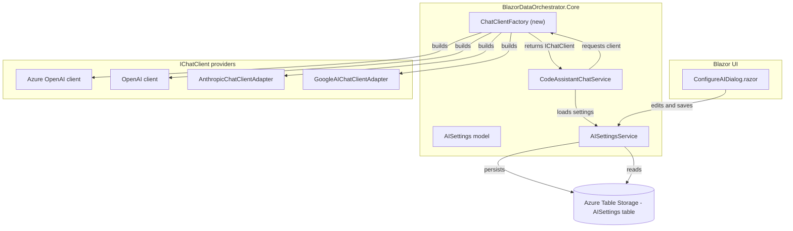
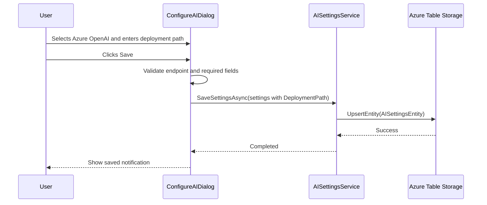
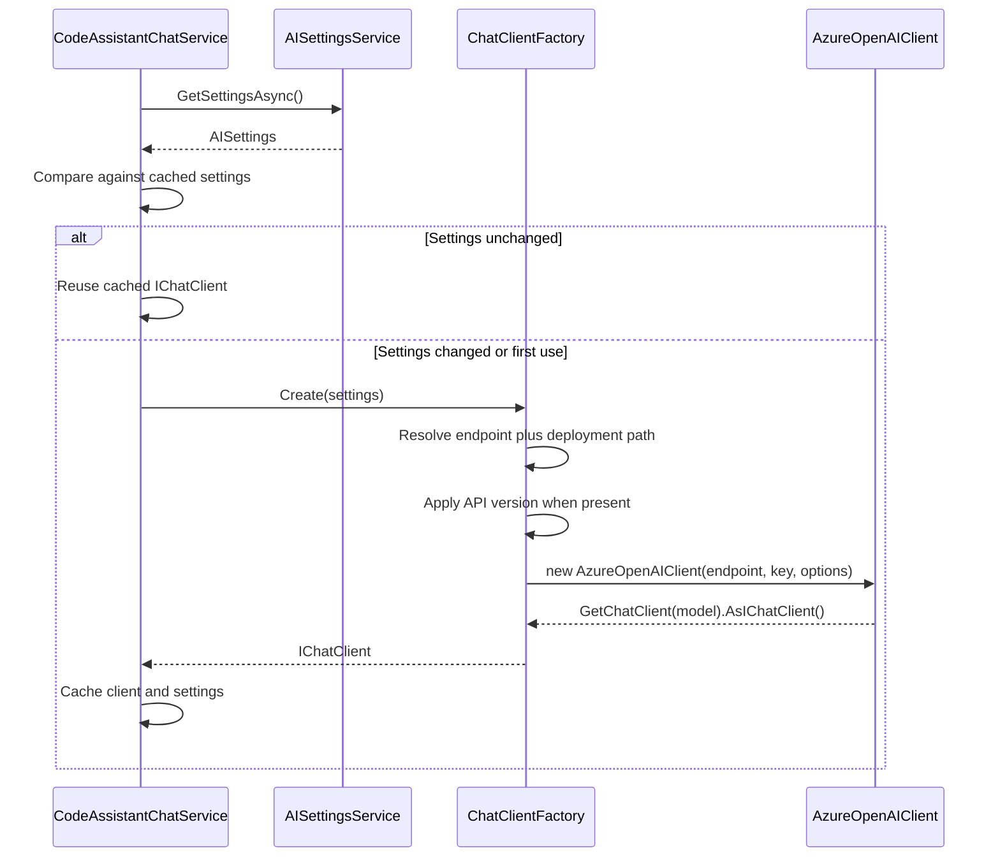
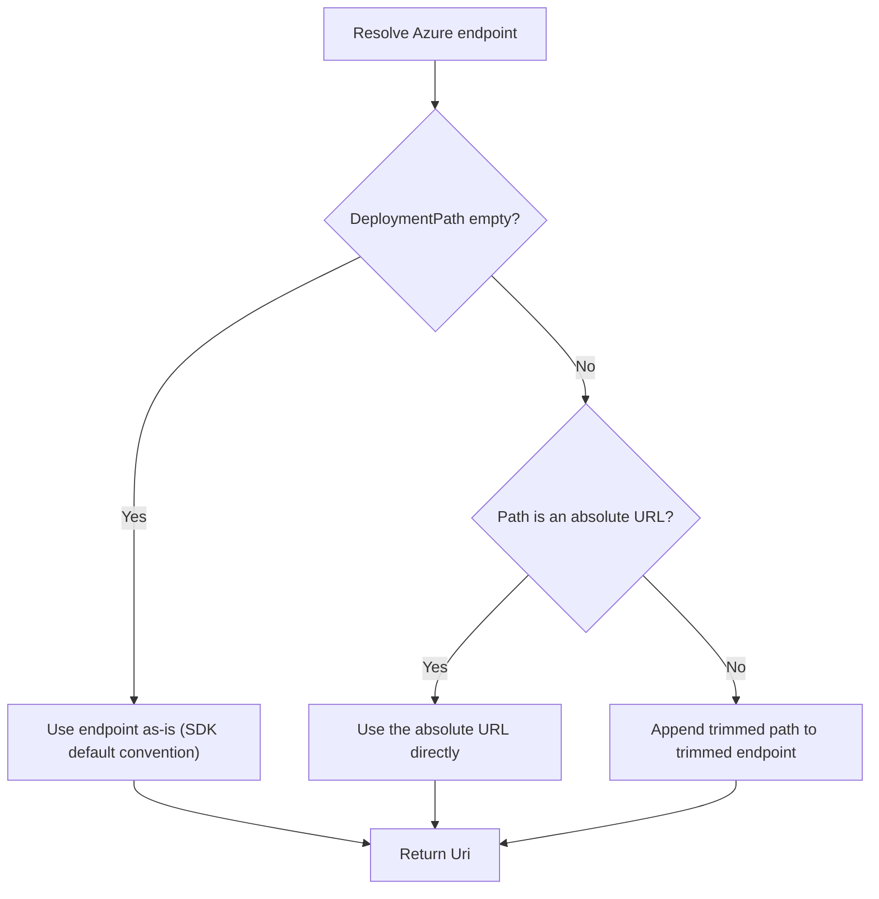

# Azure OpenAI Deployment Path Configuration Plan

## Overview

This document describes the implementation plan for two related features that improve the
Blazor Data Orchestrator's AI chat configuration:

1. **Feature #1 — Configurable Azure OpenAI deployment path.** When the user selects the
   *Azure OpenAI* service type, the application must allow an explicit **deployment path**
   (the URL route used to reach a specific model deployment) to be configured, instead of
   relying solely on the SDK's default convention of
   `https://{resource}.openai.azure.com/openai/deployments/{deployment-name}`.
2. **Feature #2 — Adopt patterns from the SimpleChat reference project.** The
   [ADefWebserver/SimpleChat](https://github.com/ADefWebserver/SimpleChat) repository is a
   provider-agnostic Blazor AI chat starter. We will use its `Services/AI` layer
   (`ChatClientFactory`, `AIConfigurationService`, `AIModelService`, `ChatService`,
   `AnthropicChatClient`, `GoogleAIChatClient`) as the reference for refactoring how chat
   clients are created and configured.

Both features converge on the same area of the codebase: the construction of the
`IChatClient` for Azure OpenAI and the settings model that drives it.

---

## Background — Current State

The relevant code lives in three files:

| Concern | File |
| --- | --- |
| Settings model | [src/BlazorDataOrchestrator.Core/Models/AISettings.cs](../src/BlazorDataOrchestrator.Core/Models/AISettings.cs) |
| Settings persistence (Azure Table Storage) | [src/BlazorDataOrchestrator.Core/Services/AISettingsService.cs](../src/BlazorDataOrchestrator.Core/Services/AISettingsService.cs) |
| Chat client creation | [src/BlazorDataOrchestrator.Core/Services/CodeAssistantChatService.cs](../src/BlazorDataOrchestrator.Core/Services/CodeAssistantChatService.cs) |
| Settings UI | [src/BlazorDataOrchestrator.JobCreatorTemplate/Components/ConfigureAIDialog.razor](../src/BlazorDataOrchestrator.JobCreatorTemplate/Components/ConfigureAIDialog.razor) |

### Current Azure OpenAI client construction

```csharp
if (settings.AIServiceType == "Azure OpenAI")
{
    var azureClient = new AzureOpenAIClient(
        new Uri(settings.Endpoint),
        new ApiKeyCredential(settings.ApiKey));
    _chatClient = azureClient.GetChatClient(settings.AIModel).AsIChatClient();
}
```

### Problems with the current approach

- The **deployment path cannot be customized**. The SDK derives the request URL from the
  endpoint plus the deployment name (`settings.AIModel`). This fails when the resource sits
  behind an API Management / AI Gateway, uses a custom route, or exposes the deployment under
  a non-default path.
- The **API version** (`settings.ApiVersion`) is collected by the UI and persisted, but it is
  **never applied** when the client is created.
- Client creation logic is **inline and duplicated** per provider inside
  `CodeAssistantChatService`. There is no factory, so adding or adjusting providers is
  error-prone — exactly the problem the SimpleChat `ChatClientFactory` solves.

---

## Goals

- Allow an optional, explicit Azure OpenAI **deployment path** to be entered and persisted.
- Apply the configured **API version** when constructing the Azure OpenAI client.
- Refactor client creation into a dedicated **`ChatClientFactory`**, modeled on SimpleChat,
  so each provider's setup is isolated and testable.
- Preserve full backward compatibility: existing saved settings (no deployment path) must
  continue to work using the SDK default behavior.

## Non-Goals

- Changing the persisted storage backend (remains Azure Table Storage).
- Adding new AI providers beyond those already present (OpenAI, Azure OpenAI, Anthropic,
  Google AI).
- Altering the streaming/`IAsyncEnumerable` chat contract in `IAIChatService`.

---

## System Structure

The diagram below shows the components after the refactor. The new `ChatClientFactory`
becomes the single place that translates `AISettings` into an `IChatClient`.



---

## Detailed Design

### 1. Extend the `AISettings` model

Add a `DeploymentPath` property. Keep it optional so that omitting it preserves current
behavior.

```csharp
public class AISettings
{
    public string AIServiceType { get; set; } = "OpenAI";
    public string ApiKey { get; set; } = "";
    public string AIModel { get; set; } = "gpt-4-turbo-preview";
    public string Endpoint { get; set; } = "";
    public string ApiVersion { get; set; } = "";
    public string EmbeddingModel { get; set; } = "";

    // NEW: optional explicit Azure OpenAI deployment path.
    // Example: "openai/deployments/my-gpt4o" or a full custom route.
    // When empty, the SDK default convention is used.
    public string DeploymentPath { get; set; } = "";

    public bool IsConfigured => !string.IsNullOrWhiteSpace(ApiKey);
}
```

### 2. Persist `DeploymentPath`

Update `AISettingsEntity` and both the read and write paths in `AISettingsService`.

```csharp
public class AISettingsEntity : ITableEntity
{
    // existing members...
    public string? DeploymentPath { get; set; }
}
```

In `GetSettingsAsync`, map the new field with a safe default:

```csharp
DeploymentPath = response.Value.DeploymentPath ?? ""
```

In `SaveSettingsAsync`, write it back:

```csharp
DeploymentPath = settings.DeploymentPath
```

> **Backward compatibility:** Azure Table Storage entities are schemaless per-row. Existing
> rows without a `DeploymentPath` column return `null`, which the `?? ""` mapping converts to
> an empty string — triggering the default SDK behavior.

### 3. Introduce `ChatClientFactory` (SimpleChat pattern)

Create `src/BlazorDataOrchestrator.Core/Services/ChatClientFactory.cs`. This mirrors the
responsibility of SimpleChat's `ChatClientFactory`: take a settings object and return an
`IChatClient`, isolating per-provider construction.

```csharp
using System.ClientModel;
using Microsoft.Extensions.AI;
using OpenAI;
using Azure.AI.OpenAI;
using BlazorDataOrchestrator.Core.Models;

namespace BlazorDataOrchestrator.Core.Services;

/// <summary>
/// Builds an IChatClient for a given AISettings configuration.
/// Modeled on the SimpleChat ChatClientFactory pattern.
/// </summary>
public static class ChatClientFactory
{
    public static IChatClient? Create(AISettings settings)
    {
        if (!settings.IsConfigured)
        {
            return null;
        }

        return settings.AIServiceType switch
        {
            "Azure OpenAI" => CreateAzureOpenAI(settings),
            "Anthropic"    => new AnthropicChatClientAdapter(settings.ApiKey, settings.AIModel),
            "Google AI"    => new GoogleAIChatClientAdapter(settings.ApiKey, settings.AIModel),
            _              => CreateOpenAI(settings),
        };
    }

    private static IChatClient CreateAzureOpenAI(AISettings settings)
    {
        var options = new AzureOpenAIClientOptions();

        // Apply the configured API version when supplied.
        if (!string.IsNullOrWhiteSpace(settings.ApiVersion))
        {
            options.SetApiVersion(settings.ApiVersion);
        }

        // Resolve the base endpoint, optionally combining a custom deployment path.
        var endpoint = ResolveAzureEndpoint(settings);

        var azureClient = new AzureOpenAIClient(
            endpoint,
            new ApiKeyCredential(settings.ApiKey),
            options);

        return azureClient.GetChatClient(settings.AIModel).AsIChatClient();
    }

    private static Uri ResolveAzureEndpoint(AISettings settings)
    {
        var baseEndpoint = settings.Endpoint.TrimEnd('/');

        if (string.IsNullOrWhiteSpace(settings.DeploymentPath))
        {
            return new Uri(baseEndpoint);
        }

        var path = settings.DeploymentPath.Trim();

        // Allow a full absolute URL or a relative path appended to the endpoint.
        return Uri.TryCreate(path, UriKind.Absolute, out var absolute)
            ? absolute
            : new Uri($"{baseEndpoint}/{path.TrimStart('/')}");
    }

    private static IChatClient CreateOpenAI(AISettings settings)
    {
        var openAIClient = new OpenAIClient(new ApiKeyCredential(settings.ApiKey));
        return openAIClient.GetChatClient(settings.AIModel).AsIChatClient();
    }
}
```

> **Note on `SetApiVersion`:** The exact API-version accessor differs by SDK version. If the
> installed `Azure.AI.OpenAI` build does not expose a setter, set the version via
> `AzureOpenAIClientOptions.Version` (the `ServiceVersion` enum) and map known strings. The
> developer should confirm the available API surface against the referenced package version
> during implementation.

### 4. Use the factory from `CodeAssistantChatService`

Replace the inline `if/else` block in `GetOrCreateChatClientAsync` with a single factory call,
and include `DeploymentPath` and `ApiVersion` in the cache-invalidation comparison.

```csharp
// Cache-invalidation check now also considers DeploymentPath and ApiVersion.
if (_cachedSettings != null &&
    _cachedSettings.AIServiceType == settings.AIServiceType &&
    _cachedSettings.ApiKey == settings.ApiKey &&
    _cachedSettings.AIModel == settings.AIModel &&
    _cachedSettings.Endpoint == settings.Endpoint &&
    _cachedSettings.ApiVersion == settings.ApiVersion &&
    _cachedSettings.DeploymentPath == settings.DeploymentPath)
{
    return _chatClient;
}

_cachedSettings = settings;

try
{
    _chatClient = ChatClientFactory.Create(settings);
}
catch (Exception)
{
    _chatClient = null;
}

return _chatClient;
```

### 5. Surface the deployment path in the UI

In `ConfigureAIDialog.razor`, add a new field inside the `Azure OpenAI` branch and bind it to
a backing field that maps to `AISettings.DeploymentPath`.

```razor
else if (aiServiceType == "Azure OpenAI")
{
    <RadzenFormField Text="Azure OpenAI Model Deployment Name:" Variant="Variant.Outlined">
        <RadzenTextBox @bind-Value="@aiModel" Style="width: 100%;" />
    </RadzenFormField>

    <RadzenFormField Text="Azure OpenAI Deployment Path (optional):" Variant="Variant.Outlined">
        <RadzenTextBox @bind-Value="@deploymentPath" Style="width: 100%;"
                       Placeholder="openai/deployments/my-deployment" />
    </RadzenFormField>

    <RadzenFormField Text="Azure OpenAI Embedding Model Deployment Name:" Variant="Variant.Outlined">
        <RadzenTextBox @bind-Value="@embeddingModel" Style="width: 100%;" />
    </RadzenFormField>

    <RadzenFormField Text="Azure OpenAI Endpoint:" Variant="Variant.Outlined">
        <RadzenTextBox @bind-Value="@endpoint" Style="width: 100%;"
                       Placeholder="https://your-resource.openai.azure.com/" />
    </RadzenFormField>

    <RadzenFormField Text="Azure OpenAI API Version:" Variant="Variant.Outlined">
        <RadzenTextBox @bind-Value="@apiVersion" Style="width: 100%;"
                       Placeholder="2024-02-15-preview" />
    </RadzenFormField>
}
```

Add the backing field and wire it into load/save:

```csharp
private string deploymentPath = "";

// In OnInitializedAsync:
deploymentPath = settings.DeploymentPath;

// In OnSave, when building the AISettings to persist:
DeploymentPath = deploymentPath
```

---

## Process Flow — Saving Settings



## Process Flow — Building the Chat Client



---

## Endpoint and Deployment Path Resolution Rules

The resolution logic in `ResolveAzureEndpoint` follows these rules:



| Endpoint | DeploymentPath | Resulting base Uri |
| --- | --- | --- |
| `https://r.openai.azure.com/` | (empty) | `https://r.openai.azure.com` |
| `https://r.openai.azure.com/` | `openai/deployments/gpt4o` | `https://r.openai.azure.com/openai/deployments/gpt4o` |
| `https://gw.contoso.com/ai/` | `https://gw.contoso.com/ai/route` | `https://gw.contoso.com/ai/route` |

---

## Reference Mapping — SimpleChat to This Codebase

| SimpleChat component | Role | Maps to |
| --- | --- | --- |
| `Services/AI/ChatClientFactory.cs` | Creates an `IChatClient` per provider | New `ChatClientFactory` in Core |
| `Services/AI/AIConfigurationService.cs` | Loads and stores provider config | Existing `AISettingsService` |
| `Services/AI/ChatService.cs` | Orchestrates conversation and streaming | Existing `CodeAssistantChatService` |
| `Services/AI/AIModelService.cs` | Lists/selects models per provider | Optional future enhancement |
| `Services/AI/AnthropicChatClient.cs` | Anthropic provider adapter | Existing `AnthropicChatClientAdapter` |
| `Services/AI/GoogleAIChatClient.cs` | Google provider adapter | Existing `GoogleAIChatClientAdapter` |

> Fetch the concrete implementations from the
> [SimpleChat Services/AI directory](https://github.com/ADefWebserver/SimpleChat/tree/main/SimpleChat/Services/AI)
> when implementing the factory, to match the construction details (timeouts, SSE streaming
> options) that SimpleChat applies.

---

## Implementation Steps

1. Add `DeploymentPath` to `AISettings`.
2. Add `DeploymentPath` to `AISettingsEntity` and map it in `GetSettingsAsync` /
   `SaveSettingsAsync`.
3. Create `ChatClientFactory` with `ResolveAzureEndpoint` and API-version handling.
4. Refactor `CodeAssistantChatService.GetOrCreateChatClientAsync` to call the factory and
   extend the cache-invalidation comparison.
5. Add the deployment-path field to `ConfigureAIDialog.razor` and wire load/save.
6. Verify the `Azure.AI.OpenAI` package version supports the API-version accessor used; adjust
   if necessary.

---

## Validation and Edge Cases

- **Empty deployment path:** Falls back to SDK default; existing users unaffected.
- **Trailing/leading slashes:** Normalized via `TrimEnd('/')` and `TrimStart('/')`.
- **Absolute vs relative path:** Detected with `Uri.TryCreate(..., UriKind.Absolute, ...)`.
- **Invalid endpoint:** `new Uri(...)` throws; caught in `CodeAssistantChatService`, leaving
  `_chatClient` null and surfacing as "not configured" downstream.
- **API version not applied previously:** Now applied; confirm the chosen version string is
  valid for the target resource to avoid 404/400 responses.

## Testing Strategy

- **Unit tests** for `ChatClientFactory.ResolveAzureEndpoint` covering the table cases above
  (empty path, relative path, absolute URL, slash normalization).
- **Unit test** confirming `ChatClientFactory.Create` returns `null` when `IsConfigured` is
  false.
- **Manual / integration test:** Configure a real Azure OpenAI resource with a custom
  deployment path through `ConfigureAIDialog`, save, and verify a chat completion succeeds.
- **Regression test:** Load a pre-existing settings row (no `DeploymentPath`) and confirm chat
  still works using the default convention.

## Rollback Plan

The change is additive. To roll back, revert the factory usage in
`CodeAssistantChatService` to the inline construction and hide the new UI field. The persisted
`DeploymentPath` column can remain in storage harmlessly, since older code ignores it.
