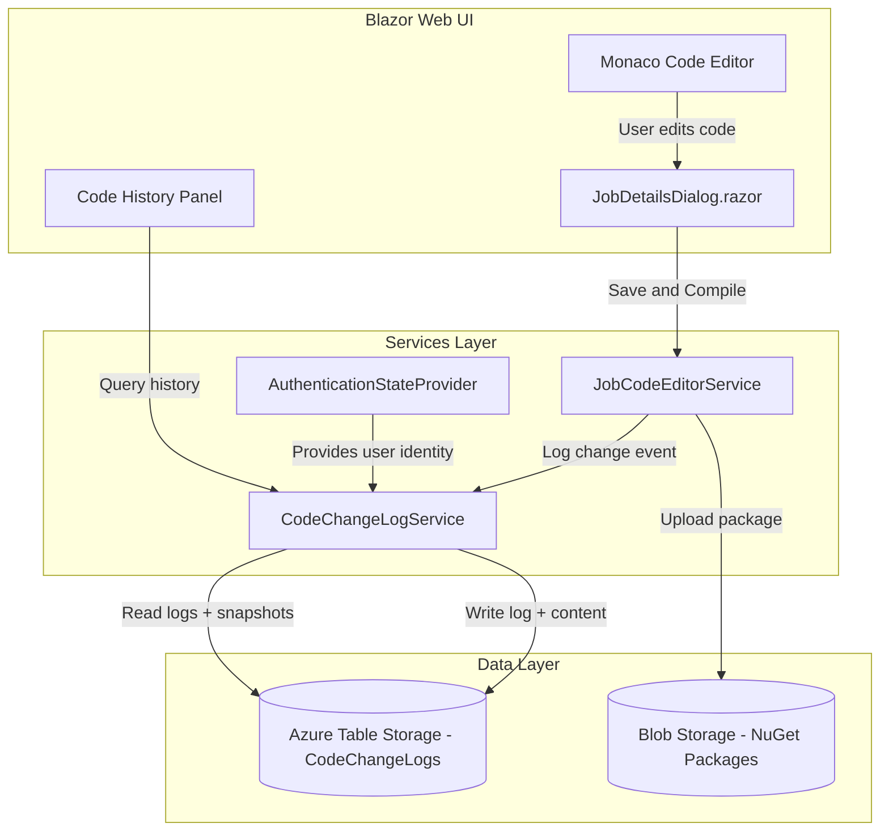
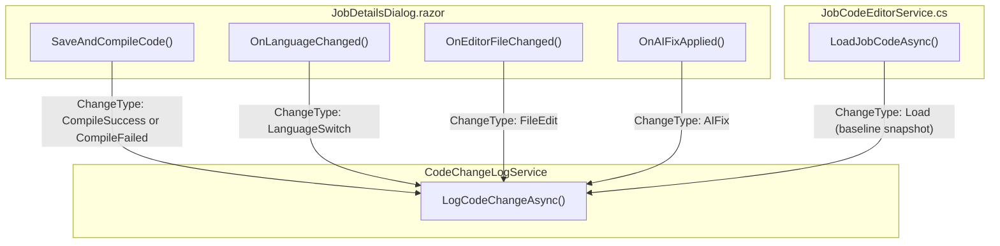
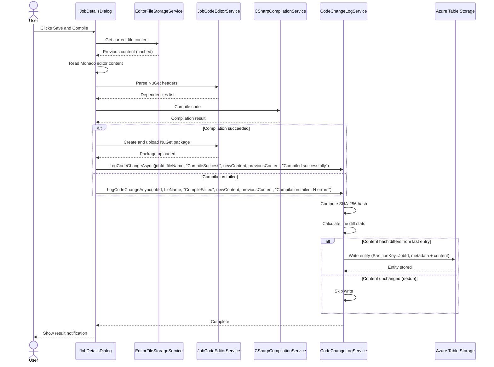
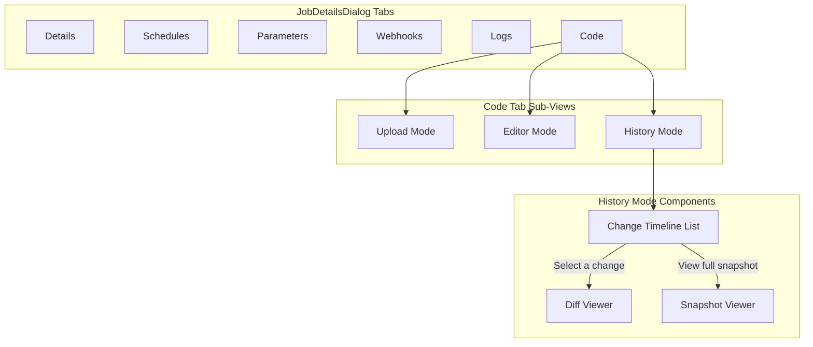

# Code Change Logging Feature Plan

## Overview

Implement a comprehensive audit trail for all code editor changes made through the web interface. Every save, compile, language switch, file edit, and AI-assisted fix will be recorded with full attribution (who, what, when) so that teams can review the history of any job's code over time.

---

## Goals

- Track **every code modification** made via the online Monaco editor (saves, compiles, template resets, AI fixes, language switches).
- Record **who** made the change (authenticated user), **what** changed (before/after snapshots or diffs), and **when**.
- Provide a **UI for browsing change history** per job, with diff viewing.
- Store change logs durably in **Azure Table Storage** (metadata + content snapshots in a single table) for simplicity and scalability. **No SQL Server changes required.**
- Integrate seamlessly with the existing `JobDetailsDialog` code tab without disrupting current workflows.

---

## System Architecture



---

## Data Model

### Azure Table Storage: `CodeChangeLogs` Table

All change log data (metadata and code snapshots) is stored in a **single Azure Table Storage table**. No SQL Server schema changes are required.

| Field | Type | Description |
|-------|------|-------------|
| `PartitionKey` | string | `{JobId}` — groups all changes for a job |
| `RowKey` | string | `{InvertedTicks}_{Guid}` — ensures newest-first sort order |
| `UserId` | string | The authenticated user who made the change |
| `UserName` | string | Denormalized username for display |
| `ChangeType` | string | `Load`, `CompileSuccess`, `CompileFailed`, `LanguageSwitch`, `AIFix`, `Restore` |
| `FileName` | string | The file that was changed (e.g., `main.cs`, `main.py`, `.nuspec`) |
| `Language` | string | `csharp` or `python` |
| `Summary` | string | Human-readable summary of the change |
| `LinesAdded` | int | Count of lines added vs previous version |
| `LinesRemoved` | int | Count of lines removed vs previous version |
| `Content` | string | Full file content at time of change (up to 64 KB) |
| `ContentHash` | string | SHA-256 hash of the content (for deduplication) |
| `CreatedDateUtc` | DateTime | Timestamp of the change (UTC) |

### POCO Model

```csharp
public class CodeChangeEntry
{
    public int JobId { get; set; }
    public string RowKey { get; set; } = "";
    public string UserId { get; set; } = "";
    public string UserName { get; set; } = "";
    public string ChangeType { get; set; } = "";
    public string FileName { get; set; } = "";
    public string Language { get; set; } = "";
    public string? Summary { get; set; }
    public int LinesAdded { get; set; }
    public int LinesRemoved { get; set; }
    public DateTime CreatedDate { get; set; }
}
```

### Key Design Decisions

- **No SQL Server changes**: All data lives in Azure Table Storage. No EF Core model, no DbSet, no migration scripts.
- **Single table**: Both metadata and content are stored in the same `CodeChangeLogs` table entity, eliminating the need for cross-store joins.
- **Inverted tick RowKey**: Uses `(DateTime.MaxValue.Ticks - DateTime.UtcNow.Ticks)` as the RowKey prefix so Table Storage's default ascending sort returns newest entries first.
- **64 KB content limit**: Azure Table Storage properties are capped at 64 KB. Files exceeding this are logged without content.
- **Partition-per-job**: `PartitionKey = JobId` co-locates all changes for efficient queries and bulk deletes.

---

## Service Layer Design

### `CodeChangeLogService`

A new service registered via DI that handles all change logging operations.

**Constructor Dependencies:**
- `TableServiceClient` (Azure Table Storage for all reads/writes)
- `AuthenticationStateProvider` (resolve current user)
- `ILogger<CodeChangeLogService>` (operational logging)
- `IConfiguration` (feature toggles)

**Public Methods:**

| Method | Signature | Purpose |
|--------|-----------|---------|
| `LogCodeChangeAsync` | `Task LogCodeChangeAsync(int jobId, string fileName, string language, string changeType, string content, string? previousContent, string? summary)` | Primary method called on every code change event |
| `GetChangeHistoryAsync` | `Task<List<CodeChangeEntry>> GetChangeHistoryAsync(int jobId, int? take, int? skip)` | Paginated change history for a job |
| `GetSnapshotContentAsync` | `Task<string?> GetSnapshotContentAsync(int jobId, string rowKey)` | Retrieve full file content from Table Storage |
| `GetDiffAsync` | `Task<DiffResult> GetDiffAsync(int jobId, string olderRowKey, string newerRowKey)` | Compute diff between two snapshots |
| `GetChangeCountAsync` | `Task<int> GetChangeCountAsync(int jobId)` | Total number of changes for a job |

### `DiffResult` Model

```csharp
public class DiffResult
{
    public string OlderContent { get; set; }
    public string NewerContent { get; set; }
    public List<DiffLine> Lines { get; set; }
    public int LinesAdded { get; set; }
    public int LinesRemoved { get; set; }
}

public class DiffLine
{
    public DiffLineType Type { get; set; } // Added, Removed, Unchanged
    public string Content { get; set; }
    public int? OldLineNumber { get; set; }
    public int? NewLineNumber { get; set; }
}
```

### Content Deduplication

Before writing a snapshot to Table Storage, compute a SHA-256 hash of the content. If the hash matches the most recent snapshot for the same `JobId` + `FileName`, skip the write and reuse the existing `RowKey`. This prevents storing identical snapshots on repeated saves without changes.

---

## Integration Points

### Where to Capture Change Events

The following methods in the existing codebase must be instrumented to call `CodeChangeLogService.LogCodeChangeAsync`:



### Detailed Hook Locations

#### 1. Save and Compile (`SaveAndCompileCode` in `JobDetailsDialog.razor`)

**When:** After the compile attempt completes (success or failure).

**What to log:**
- `ChangeType`: `CompileSuccess` or `CompileFailed`
- `FileName`: The currently active file (e.g., `main.cs`)
- `Content`: The full code content from the Monaco editor
- `Summary`: Compilation result message (error count if failed)

**Implementation notes:**
- Capture the code content *before* any auto-generated modifications (e.g., nuspec header injection)
- Store previous content from `EditorFileStorageService` for diff calculation
- Log after `WebNuGetPackageService.CreateAndUploadPackageAsync` succeeds or after compilation errors are returned

#### 2. Language Switch (`OnLanguageChanged`)

**When:** User switches between C# and Python.

**What to log:**
- `ChangeType`: `LanguageSwitch`
- `Summary`: "Switched from {oldLanguage} to {newLanguage}"
- `Content`: Snapshot of the old language code before reset (preservation record)
- `FileName`: `main.cs` or `main.py` (the file being replaced)

#### 3. File Tab Switch with Unsaved Edits (`OnEditorFileChanged`)

**When:** User switches between files (main.cs, appsettings.json, etc.) and the editor content has been modified.

**What to log:**
- `ChangeType`: `FileEdit`
- `FileName`: The file being switched *away from*
- `Content`: Current editor content for that file

**Implementation notes:**
- Compare against `EditorFileStorageService` cached content using hash comparison
- Only log if content actually changed (avoid noise from tab switches without edits)

#### 4. AI Fix Applied

**When:** User accepts an AI-suggested code fix from the Copilot chat integration.

**What to log:**
- `ChangeType`: `AIFix`
- `Summary`: "AI fix applied for build errors"
- `Content`: The new code after the fix is applied
- `FileName`: The file that was fixed

#### 5. Initial Code Load (Baseline)

**When:** `LoadJobCodeAsync` successfully extracts code from the existing NuGet package.

**What to log:**
- `ChangeType`: `Load`
- `Content`: The extracted code
- This creates a baseline snapshot so the first edit has a previous version to diff against

---

## Process Flow: Save and Compile with Change Logging



---

## UI Design

### Change History Tab

Add a **"History"** sub-tab within the Code tab of `JobDetailsDialog.razor`. This tab shows a chronological list of all code changes for the job.



### Change Timeline List

Each entry in the timeline displays:

| Element | Content |
|---------|---------|
| **Icon** | Color-coded by `ChangeType` (green check for CompileSuccess, red X for CompileFailed, blue arrow for LanguageSwitch, purple star for AIFix) |
| **Title** | `{ChangeType}` - `{FileName}` |
| **Subtitle** | `{Summary}` |
| **Attribution** | `{UserName}` at `{CreatedDate}` (formatted to user timezone) |
| **Stats** | `+{LinesAdded} -{LinesRemoved}` (in green/red) |
| **Actions** | "View Diff" button, "View Full Code" button, "Restore" button |

### Diff Viewer

Use the Monaco Editor's built-in diff editor (`MonacoDiffEditor`) to display side-by-side comparisons:

- **Left pane:** Previous version (from Table Storage snapshot)
- **Right pane:** Selected version
- **Header:** Shows the two timestamps and usernames being compared
- Read-only mode with syntax highlighting matching the file language

### Restore Action

The "Restore" button on a history entry allows a user to:
1. Load the historical snapshot content into the current Monaco editor
2. This does **not** auto-save or compile; the user must explicitly Save and Compile
3. A confirmation dialog warns: "This will replace the current editor content with the version from {date}. You can undo this before saving."
4. Restoring itself is logged as `ChangeType: Restore`

---

## Storage Provisioning

No database migration or SQL scripts are required. The `CodeChangeLogs` Azure Table is **auto-created on first write** via `TableServiceClient.CreateTableIfNotExistsAsync()`. The table uses the existing Azure Table Storage connection already configured in the application (`tables` connection string).

### Cleanup on Job Deletion

When a job is deleted, its change log entries should be cleaned up by deleting all entities in the `CodeChangeLogs` table with `PartitionKey = {JobId}`. This can be done via a batch delete or as part of existing job cleanup logic.

---

## Implementation Steps

### Phase 1: Data Layer (Azure Table Storage only)

1. **Create `CodeChangeEntry` POCO** in `CodeChangeLogService.cs` (lightweight data transfer object, no EF Core dependency)
2. **Create the `CodeChangeLogs` Azure Table** (auto-created on first write via `TableServiceClient.CreateTableIfNotExistsAsync`)
3. **No SQL changes required** — no EF model, no DbSet, no migration scripts

### Phase 2: Service Layer

4. **Create `CodeChangeLogService.cs`** in `BlazorOrchestrator.Web/Services/`
5. **Implement `LogCodeChangeAsync`** with content hashing, deduplication, and single-table writes
6. **Implement `GetChangeHistoryAsync`** with pagination using inverted-tick RowKey ordering
7. **Implement `GetSnapshotContentAsync`** for retrieving content from the same table entity
8. **Implement `GetDiffAsync`** using a line-based LCS diff algorithm
9. **Register `CodeChangeLogService`** in `Program.cs` DI container

### Phase 3: Editor Integration

12. **Instrument `SaveAndCompileCode()`** in `JobDetailsDialog.razor` to call `LogCodeChangeAsync` after compile
13. **Instrument `OnLanguageChanged()`** to log language switch events
14. **Instrument file tab switching** to detect and log unsaved edits
15. **Instrument AI fix application** to log AI-generated code changes
16. **Add baseline snapshot logging** in `LoadJobCodeAsync` when code is first loaded into the editor

### Phase 4: History UI

17. **Add "History" toggle/button** to the Code tab toolbar in `JobDetailsDialog.razor`
18. **Build the change timeline list** component with pagination
19. **Integrate Monaco diff editor** for side-by-side comparison
20. **Implement the "Restore" action** with confirmation dialog
21. **Add change count badge** to the History button showing total changes

### Phase 5: Polish and Cleanup

22. **Add data retention policy**: Optionally purge snapshots older than a configurable period (default 90 days) via a scheduled cleanup job
23. **Add export capability**: Allow downloading change history as a CSV or JSON file
24. **Performance testing**: Verify that large code files and frequent saves do not degrade editor responsiveness (logging should be fire-and-forget with error handling)

---

## Change Type Reference

| ChangeType | Trigger | Logged Content |
|------------|---------|----------------|
| `Load` | Code loaded from NuGet package into editor | Baseline snapshot of extracted code |
| `Save` | Manual save without compile (if supported) | Current editor content |
| `CompileSuccess` | Save and Compile succeeds | Code that was compiled |
| `CompileFailed` | Save and Compile fails | Code that failed compilation |
| `LanguageSwitch` | User changes language dropdown | Old language code before reset |
| `TemplateReset` | User resets to default template | Default template content |
| `AIFix` | AI-generated fix applied to code | Code after AI fix |
| `FileEdit` | File content changed on tab switch | Modified file content |
| `Restore` | User restores a historical snapshot | Restored content |

---

## Security Considerations

- **Authentication required**: All logging operations must verify the user is authenticated via `AuthenticationStateProvider`. Anonymous changes must not be possible.
- **Organization scoping**: Change history queries must be scoped to the user's organization. A user should only see change logs for jobs within their `JobOrganization`.
- **Content sanitization**: Code content stored in snapshots is treated as raw text. It must never be rendered as HTML or executed on retrieval.
- **Cascade delete**: When a job is deleted, all change log entries for that job should be deleted from Table Storage (batch delete by PartitionKey).
- **No sensitive data in summaries**: The `Summary` field should not contain connection strings, secrets, or other sensitive values that might appear in code.

---

## Performance Considerations

- **Fire-and-forget logging**: The `LogCodeChangeAsync` call in the save/compile flow should not block the user. Use `Task.Run` to enqueue the log write so the UI remains responsive. Catch and log exceptions internally.
- **Content hashing for deduplication**: SHA-256 comparison against the last entry avoids redundant writes when a user clicks Save and Compile multiple times without changes.
- **Pagination**: The history UI must use server-side pagination (default 20 items per page) to avoid loading thousands of records.
- **Inverted tick RowKey**: Ensures newest entries are returned first by Table Storage's default ascending RowKey sort, eliminating the need for client-side sorting.
- **Table Storage partitioning**: Using `JobId` as the partition key ensures all entries for one job are co-located for efficient range queries and batch deletes.
- **64 KB content limit**: Azure Table Storage properties are limited to 64 KB. Files exceeding this are logged without content snapshots.

---

## Configuration

Add the following settings to `appsettings.json`:

```json
{
  "CodeChangeLogging": {
    "Enabled": true,
    "RetentionDays": 90,
    "MaxSnapshotSizeBytes": 65536,
    "DeduplicateSnapshots": true
  }
}
```

| Setting | Default | Description |
|---------|---------|-------------|
| `Enabled` | `true` | Master toggle to enable/disable code change logging |
| `RetentionDays` | `90` | Days to retain snapshots before cleanup (0 = forever) |
| `MaxSnapshotSizeBytes` | `65536` (64 KB) | Maximum file size to store as a snapshot. Azure Table Storage property limit is 64 KB |
| `DeduplicateSnapshots` | `true` | Skip writing snapshots when content hash matches the previous snapshot |

---

## Testing Strategy

| Test Type | Scope | Description |
|-----------|-------|-------------|
| **Unit** | `CodeChangeLogService` | Verify hash computation, deduplication logic, diff calculation, and metadata mapping |
| **Unit** | `DiffResult` generation | Verify line-based diff output for add, remove, and modify scenarios |
| **Integration** | SQL + Table Storage writes | Verify `LogCodeChangeAsync` persists to both stores correctly |
| **Integration** | Cascade delete | Verify deleting a job removes all `JobCodeChangeLog` rows |
| **Integration** | Pagination | Verify `GetChangeHistoryAsync` returns correct page sizes and ordering |
| **E2E** | Save and Compile flow | Verify a code change in the editor produces a log entry visible in the History tab |
| **E2E** | Diff viewer | Verify selecting two history entries shows correct side-by-side diff |
| **E2E** | Restore | Verify restoring a snapshot loads content into the editor and creates a Restore log entry |
| **Performance** | Rapid saves | Verify 50 rapid Save and Compile clicks do not degrade UI or produce duplicate snapshots |

---

## File Manifest

Files to create or modify:

| Action | File Path | Description |
|--------|-----------|-------------|
| **Create** | `src/BlazorOrchestrator.Web/Services/CodeChangeLogService.cs` | Service + `CodeChangeEntry` POCO for logging and querying (Azure Table Storage only) |
| **Modify** | `src/BlazorOrchestrator.Web/Program.cs` | Register `CodeChangeLogService` in DI |
| **Modify** | `src/BlazorOrchestrator.Web/Components/Pages/Dialogs/JobDetailsDialog.razor` | Add logging calls and History sub-tab |
| **Modify** | `src/BlazorOrchestrator.Web/appsettings.json` | Add `CodeChangeLogging` config section |
