# Copilot Chat Improvements Plan

This document covers four interrelated improvements to the AI-powered code-editing experience in the **Job Creator Template** (`Home.razor` + `CopilotChatService`).

| # | Feature | Priority |
|---|---------|----------|
| 1 | Detect missing Copilot CLI and guide the user | High |
| 2 | Surface all available GitHub Copilot models | Medium |
| 3 | Ensure system prompt includes `csharp.instructions.md` / `python.instructions.md` | High |
| 4 | Refresh the CodeEditor after AI updates the code | High |

---

## 1. Detect Missing Copilot CLI & Inform the User

### 1.1 Problem Statement

The GitHub Copilot SDK (`GitHub.Copilot.SDK`) requires a local **Copilot CLI** binary to be installed and authenticated. If the CLI is absent or not authenticated the `CopilotClient.StartAsync()` call fails silently or times out, giving the user no actionable feedback.

### 1.2 Detection Points

There are three moments at which the system should verify the CLI:

| Moment | Component | Current Behaviour | Desired Behaviour |
|--------|-----------|-------------------|-------------------|
| **App startup** | `Program.cs` — `copilotClient.StartAsync()` | Exception is thrown; app may crash | Catch, log, and set a flag so the UI can warn |
| **First chat message** | `CopilotChatService.ProcessCopilotRequestAsync` | Timeout after 120 s → generic error | Detect `ConnectionState` early and return specific guidance |
| **Settings dialog opened** | `ConfigureCopilotDialog.razor` | No check | Run a quick health-check and display a banner |

### 1.3 Architecture


### 1.4 Implementation Details

#### 1.4.1 New: `CopilotHealthService`

Create a lightweight singleton service that tracks CLI availability.

```
Services/CopilotHealthService.cs
```

**Responsibilities:**

| Method | Description |
|--------|-------------|
| `CheckCliInstalledAsync()` | Runs `copilot --version` via `Process` and returns `bool` |
| `CheckAuthenticatedAsync()` | Checks for `GITHUB_TOKEN` env var, or runs `copilot auth status` |
| `IsReady` | Computed property: CLI installed **and** authenticated **and** `CopilotClient.State == Connected` |
| `StatusMessage` | Human-readable status string for the UI |
| `InstallInstructions` | Markdown string with step-by-step resolution |

#### 1.4.2 Startup Health Check (`Program.cs`)

Wrap the existing `copilotClient.StartAsync()` in a try-catch. On failure, populate `CopilotHealthService` with the error details instead of crashing.

```mermaid
sequenceDiagram
    participant App as Program.cs
    participant Client as CopilotClient
    participant Health as CopilotHealthService

    App->>Health: CheckCliInstalledAsync()
    Health-->>App: installed = true/false
    alt CLI not installed
        App->>Health: SetStatus("CLI not found", installInstructions)
        Note over App: Skip StartAsync – app still boots
    else CLI installed
        App->>Client: StartAsync()
        alt Start failed
            Client-->>App: Exception
            App->>Health: SetStatus("Connection failed", authInstructions)
        else Start succeeded
            App->>Health: SetStatus("Connected")
        end
    end
```



#### 1.4.3 UI Warning Banner (`Home.razor`)

Inject `CopilotHealthService` and render a warning at the top of the chat pane when `IsReady == false`.

```
@inject CopilotHealthService CopilotHealth
```

Display a `RadzenAlert` inside the chat section:

```
┌─────────────────────────────────────────────┐
│ ⚠️ Copilot CLI is not installed.            │
│                                             │
│ The AI Chat feature requires the GitHub     │
│ Copilot CLI. To install:                    │
│                                             │
│  1. Download from <link>                    │
│  2. Run `copilot --version` to verify       │
│  3. Run `copilot login` or set GITHUB_TOKEN │
│  4. Restart this application                │
│                                             │
│ [Check Again]                               │
└─────────────────────────────────────────────┘
```

#### 1.4.4 Chat-Level Error Improvement (`CopilotChatService`)

In `ProcessCopilotRequestAsync`, before attempting `StartAsync()`, check `CopilotHealthService.IsReady`. If false, immediately yield a structured error message with install/auth instructions instead of waiting for a 120-second timeout.

#### 1.4.5 Resolution Instructions

The user-facing message should cover all common failure modes:

| Issue | Resolution |
|-------|------------|
| CLI binary not found | Download and install from `https://github.com/github/copilot-sdk/releases` or via npm: `npm install -g @github/copilot` |
| CLI not authenticated | Run `copilot login` **or** set the `GITHUB_TOKEN` environment variable **or** run `gh auth login` if GitHub CLI is installed |
| CLI process crashes | Check logs; ensure `AutoRestart = true` in `CopilotClientOptions`; restart the app |
| Firewall blocks connection | Ensure outbound HTTPS to `api.githubcopilot.com` is allowed |

### 1.5 File Changes

| File | Action |
|------|--------|
| `Services/CopilotHealthService.cs` | **Create** |
| `Program.cs` | **Modify** — register `CopilotHealthService`, wrap startup |
| `Components/Pages/Home.razor` | **Modify** — inject health service, add warning banner |
| `Services/CopilotChatService.cs` | **Modify** — early-exit with guidance on CLI missing |
| `Components/ConfigureCopilotDialog.razor` | **Modify** — show CLI status |

---

## 2. Surface All Available GitHub Copilot Models

### 2.1 Problem Statement

The `ConfigureCopilotDialog.razor` currently has a **hardcoded** list of models:

```csharp
private List<string> availableModels = new()
{
    "gpt-4.1",
    "gpt-5",
    "gpt-5.2",
    "claude-sonnet-4.5",
    "o1",
    "o1-mini"
};
```

Users cannot see models they have access to via their GitHub Copilot subscription (e.g. different Claude variants, Gemini models, newer GPT versions). Additionally, enterprise-managed organizations may enable/disable specific models.

### 2.2 Root Cause

The Copilot SDK does not automatically expose a "list models" endpoint to the UI. The hardcoded list was a quick stand-in.

### 2.3 Solution: Dynamic Model Discovery


#### 2.3.1 Model Discovery Flow


#### 2.3.2 Implementation

**Option A — SDK provides `ListModelsAsync`:**

If the Copilot SDK exposes a method to enumerate available models (check `CopilotClient` API surface), call it directly:

```
var models = await _client.ListModelsAsync();
```

Map the result to the dropdown.

**Option B — SDK does not expose model listing:**

If the SDK does not have a model-listing API, use the **GitHub REST API** via an authenticated HTTP call:

```
GET https://api.githubcopilot.com/models
Authorization: Bearer <GITHUB_TOKEN>
```

Parse the JSON response to extract model IDs and display names.

**Option C — Hybrid with caching:**

1. On app startup (or first dialog open), attempt to fetch models from the API.
2. Cache the result in `CopilotHealthService` or a dedicated `CopilotModelService`.
3. Merge with the hardcoded fallback list (union, not replace) so users always see at least the baseline models.
4. Show a "Last refreshed: …" timestamp and a refresh button.

#### 2.3.3 Updated `ConfigureCopilotDialog.razor`

```
┌──────────────────────────────────────────────┐
│  Configure Copilot                           │
│                                              │
│  Model:   [▼ gpt-4.1              ] [↻]     │
│                                              │
│  Available models are fetched from your      │
│  GitHub Copilot subscription.                │
│                                              │
│  ⓘ Some models may not be available if       │
│    your organization restricts them.         │
│                                              │
│  [Save]                                      │
└──────────────────────────────────────────────┘
```

#### 2.3.4 Why Some Models May Not Appear

Document these reasons in the dialog's help text and in a tooltip:

| Reason | Explanation |
|--------|-------------|
| Subscription tier | Free-tier Copilot users may not have access to all models (e.g. Claude, o1) |
| Organization policy | Enterprise admins can restrict which models are available to members |
| Model deprecation | Older models may be removed from the API |
| Regional availability | Some models may not be available in all regions |
| Preview / beta | Models in preview may require opt-in via GitHub settings |

#### 2.3.5 User Guidance

If a user expects to see a model but it does not appear:

1. Verify your GitHub Copilot subscription tier at `https://github.com/settings/copilot`.
2. Check if your organization has restricted model access (Settings → Copilot → Policies).
3. Ensure your `GITHUB_TOKEN` has the `copilot` scope.
4. Click the **Refresh** button in the model selector to re-fetch the list.

### 2.4 File Changes

| File | Action |
|------|--------|
| `Services/CopilotModelService.cs` | **Create** — model discovery + caching |
| `Components/ConfigureCopilotDialog.razor` | **Modify** — dynamic model list, refresh button, help text |
| `Services/CopilotHealthService.cs` | **Modify** — optionally expose cached model list |

---

## 3. Ensure System Prompt Includes Language-Specific Instructions

### 3.1 Problem Statement

The `CopilotChatService` is supposed to inject the contents of `csharp.instructions.md` or `python.instructions.md` into the system prompt so the AI generates code that conforms to the project's conventions (`BlazorDataOrchestratorJob` class, `ExecuteJob` signature, NuGet header syntax, etc.).

Currently, `GetLanguageInstructionsAsync()` looks for the files at:

```
ContentRootPath/../../.github/skills/csharp.instructions.md
ContentRootPath/../../.github/skills/python.instructions.md
```

This path is fragile and may not resolve correctly in all deployment scenarios (e.g. Docker, published output, different working directories). The project also has **embedded copies** in:

- `BlazorDataOrchestrator.Core/Resources/csharp.instructions.md`
- `BlazorDataOrchestrator.Core/Resources/python.instructions.md`
- `BlazorDataOrchestrator.JobCreatorTemplate/Resources/csharp.instructions.md`
- `BlazorDataOrchestrator.JobCreatorTemplate/Resources/python.instructions.md`

And an `EmbeddedInstructionsProvider` in Core that reads them from assembly resources.

### 3.2 Current Instruction Loading Flow

```mermaid
flowchart TD
    A[CopilotChatService.BuildSystemPromptAsync] --> B[GetLanguageInstructionsAsync]
    B --> C{Cached?}
    C -- Yes --> D[Return cached]
    C -- No --> E[Read file from disk]
    E --> F{File exists?}
    F -- Yes --> G[Cache + return]
    F -- No --> H[Return empty string ⚠️]

    style H fill:#ffcccc
```



**Problem:** If the file is not found at the relative path, the instructions are silently skipped — the AI generates code without the project-specific conventions.

### 3.3 Proposed Instruction Loading Flow


### 3.4 Implementation Details

#### 3.4.1 Use `EmbeddedInstructionsProvider` as Primary Source

The `EmbeddedInstructionsProvider` in `BlazorDataOrchestrator.Core` reads instructions from **embedded resources** in the assembly. This is the most reliable source because it is always available regardless of deployment layout.

**Changes to `CopilotChatService`:**

1. **Inject** `EmbeddedInstructionsProvider` via constructor.
2. **Update** `GetLanguageInstructionsAsync()` to use a fallback chain:
   - First: `Resources/` folder under `ContentRootPath` (allows runtime overrides).
   - Second: `EmbeddedInstructionsProvider.GetInstructionsForLanguage(language)`.
   - Third: Original `.github/skills/` relative path (development convenience).
3. **Log a warning** if no instructions are found at any location.

#### 3.4.2 Ensure Instructions Are Sent on Every New Session

Currently, `BuildSystemPromptAsync` only appends instructions when `isNewSession == true`. This is correct for the session-level system message. However, if a session is **resumed** (`ResumeSessionAsync`), the system message from the original session creation is preserved — so instructions should have been set at creation time.

**Validation:** Confirm that `CreateSessionAsync` always receives the full system prompt including instructions. Add a log line at `INFO` level showing the length of the instructions loaded.

#### 3.4.3 Instruction Content Verification

Add a startup-time log entry confirming that instructions were loaded:

```
[INFO] Loaded C# instructions (168 lines, 5,432 chars)
[INFO] Loaded Python instructions (231 lines, 7,891 chars)
```

If either file is missing or empty, log a `WARNING`.

#### 3.4.4 Updated `GetLanguageInstructionsAsync` Pseudocode

```
async Task<string> GetLanguageInstructionsAsync():
    language = GetSelectedLanguage()
    if cached and language matches: return cached

    // 1. Try local Resources folder
    localPath = ContentRootPath / "Resources" / "{language}.instructions.md"
    if File.Exists(localPath):
        return cache(await ReadAllText(localPath))

    // 2. Try embedded resource (always available)
    embedded = _embeddedProvider.GetInstructionsForLanguage(language)
    if not empty:
        return cache(embedded)

    // 3. Try .github/skills path (dev only)
    githubPath = ContentRootPath / "../../.github/skills/{language}.instructions.md"
    if File.Exists(githubPath):
        return cache(await ReadAllText(githubPath))

    // 4. Nothing found
    _logger.LogWarning("No instructions found for {Language}", language)
    return cache("")
```

### 3.5 Interaction with System Prompt

The full system prompt sent to the Copilot session is assembled as:


### 3.6 File Changes

| File | Action |
|------|--------|
| `Services/CopilotChatService.cs` | **Modify** — inject `EmbeddedInstructionsProvider`, update `GetLanguageInstructionsAsync` with fallback chain |
| `Program.cs` | **Modify** — register `EmbeddedInstructionsProvider` as singleton |
| `Resources/csharp.instructions.md` | **Verify** — ensure embedded as resource in `.csproj` |
| `Resources/python.instructions.md` | **Verify** — ensure embedded as resource in `.csproj` |

---

## 4. Refresh the CodeEditor After AI Updates Code

### 4.1 Problem Statement

When the AI responds with updated code (via `###UPDATED CODE BEGIN###` / `###UPDATED CODE END###` markers or the `apply_code_to_editor` tool), the code is extracted and `ApplyCodeUpdateAsync` is called. However, the **Monaco editor** (`CodeEditor` component from `SimpleBlazorMonaco`) may not reliably reflect the update because:

1. `ApplyCodeUpdateAsync` calls `codeEditor.UpdateCodeAsync(code)` from a non-UI context (fired inside `OnChatMessageAdded`).
2. Blazor's rendering pipeline may not trigger a visual refresh of the Monaco editor after the JS interop call.
3. The `_pendingCodeUpdate` pattern (set in `OnChatResponseReceived`, consumed in `OnChatMessageAdded`) uses fire-and-forget (`_ = ApplyCodeUpdateAsync(...)`) which loses error context and does not guarantee ordering relative to Blazor's render cycle.
4. The 2-second polling timer (`CheckForChanges`) may detect the update as a "user edit" and push it to the undo stack twice.

### 4.2 Current Update Flow (Broken)

```mermaid
sequenceDiagram
    participant Chat as RadzenAIChat
    participant Home as Home.razor
    participant Svc as CopilotChatService
    participant Editor as CodeEditor (Monaco)

    Chat->>Home: OnChatResponseReceived(response)
    Home->>Home: ExtractCodeFromResponse → _pendingCodeUpdate
    Chat->>Home: OnChatMessageAdded(message)
    Home->>Home: StripCodeMarkersFromMessage
    Home->>Home: _ = ApplyCodeUpdateAsync(_pendingCodeUpdate) 🔥 fire-and-forget
    Home->>Editor: UpdateCodeAsync(code)
    Note over Editor: ⚠️ Monaco may not refresh visually
    Note over Home: ⚠️ Polling timer may double-push to undo stack
```



### 4.3 Proposed Update Flow (Fixed)


### 4.4 Implementation Details

#### 4.4.1 Fix Fire-and-Forget in `OnChatMessageAdded`

Replace the fire-and-forget call with an awaited call wrapped in `InvokeAsync`:

**Current:**
```csharp
if (!string.IsNullOrEmpty(_pendingCodeUpdate))
{
    _ = ApplyCodeUpdateAsync(_pendingCodeUpdate);
    _pendingCodeUpdate = null;
}
```

**Proposed:**
```csharp
if (!string.IsNullOrEmpty(_pendingCodeUpdate))
{
    var codeToApply = _pendingCodeUpdate;
    _pendingCodeUpdate = null;
    await InvokeAsync(async () => await ApplyCodeUpdateAsync(codeToApply));
}
```

> **Note:** `OnChatMessageAdded` is a `void` callback on `RadzenAIChat`. If it cannot be made `async Task`, schedule the work via `InvokeAsync` and capture the task reference for error logging.

#### 4.4.2 Guard the Polling Timer

Add a flag `_isApplyingAICode` to prevent the polling timer from detecting the AI-applied code as a user edit:

```csharp
private bool _isApplyingAICode = false;

private async Task CheckForChanges()
{
    if (_disposed || _isApplyingAICode) return;
    // ... existing logic
}
```

Set the flag in `ApplyCodeUpdateAsync`:

```csharp
private async Task ApplyCodeUpdateAsync(string code)
{
    _isApplyingAICode = true;
    try
    {
        // ... existing logic (push undo, update editor, StateHasChanged)
    }
    finally
    {
        _isApplyingAICode = false;
    }
}
```

#### 4.4.3 Force Monaco Refresh via JS Interop

If `UpdateCodeAsync` alone does not visually refresh Monaco, add an explicit JS interop call to force a layout update:

```javascript
// wwwroot/js/editor-helpers.js
window.forceMonacoLayout = function () {
    var editors = monaco.editor.getEditors();
    editors.forEach(function (editor) {
        editor.layout();
    });
};
```

Call after `UpdateCodeAsync`:

```csharp
await codeEditor.UpdateCodeAsync(code);
await JSRuntime.InvokeVoidAsync("forceMonacoLayout");
```

#### 4.4.4 Handle the `apply_code_to_editor` Tool Path

The `CopilotChatService` also supports code updates via the `apply_code_to_editor` custom tool, which sets `_pendingCodeUpdate` on the service. This path needs the same treatment:


Update `OnChatResponseReceived` to also check the tool-based pending update:

```csharp
private async Task OnChatResponseReceived(string response)
{
    isCallingAI = false;

    // Check for marker-based code updates
    if (response.Contains(CodeBeginMarker) && response.Contains(CodeEndMarker))
    {
        var extracted = ExtractCodeFromResponse(response);
        if (!string.IsNullOrEmpty(extracted))
        {
            _pendingCodeUpdate = extracted;
        }
    }

    // Also check for tool-based code updates
    var toolUpdate = ChatService.ConsumePendingCodeUpdate();
    if (!string.IsNullOrEmpty(toolUpdate))
    {
        _pendingCodeUpdate = toolUpdate;
    }

    StateHasChanged();
}
```

#### 4.4.5 Consolidated Code Update Sequence


### 4.5 Edge Cases

| Scenario | Handling |
|----------|----------|
| AI response arrives while user is typing | Undo stack preserves user's version; user can undo |
| Two rapid AI responses | Second update replaces first; both are in undo stack |
| `codeEditor` is null (race condition on first render) | Guard with `if (codeEditor != null)` — already present |
| `UpdateCodeAsync` throws JS interop exception | Catch, log, and show toast notification |
| Component disposed during async update | Check `_disposed` flag before `StateHasChanged` — already present |

### 4.6 File Changes

| File | Action |
|------|--------|
| `Components/Pages/Home.razor` | **Modify** — fix fire-and-forget, add `_isApplyingAICode` guard, add `forceMonacoLayout` call, check tool-based updates |
| `wwwroot/js/editor-helpers.js` | **Create** (if needed) — `forceMonacoLayout` function |
| `Components/Pages/Home.razor` (`@code`) | **Modify** — update `CheckForChanges` to skip during AI apply |

---

## 5. Cross-Cutting: Complete System Diagram


---

## 6. Implementation Order


**Recommended order:** 3 → 4 → 1 → 2

- **Feature 3** is foundational — correct instructions make AI output better and reduce the need for manual fixes.
- **Feature 4** has the highest user-visible impact — code not refreshing is confusing.
- **Feature 1** prevents users from getting stuck with no feedback.
- **Feature 2** is a quality-of-life improvement.

---

## 7. Testing Checklist

| # | Test | Feature | Expected Result |
|---|------|---------|-----------------|
| 1 | Remove Copilot CLI from PATH, start app | 1 | Warning banner appears; chat returns install instructions |
| 2 | CLI installed but not authenticated, send message | 1 | Chat returns auth instructions within seconds (no 120s wait) |
| 3 | Click "Check Again" after installing CLI | 1 | Banner disappears; chat works |
| 4 | Open model selector with valid token | 2 | All subscription-available models appear |
| 5 | Open model selector with free-tier token | 2 | Subset of models appears; help text explains why |
| 6 | Click refresh on model selector | 2 | Models re-fetched from API |
| 7 | Select C#, send chat message, inspect system prompt (via logging) | 3 | System prompt contains `csharp.instructions.md` content |
| 8 | Switch to Python, send chat message | 3 | System prompt switches to `python.instructions.md` content |
| 9 | Delete all instruction files from disk | 3 | Embedded resource fallback kicks in; instructions still loaded |
| 10 | Ask AI to "add error handling to the code" | 4 | Editor immediately shows updated code after response |
| 11 | After AI update, click Undo | 4 | Previous code restored; undo stack correct |
| 12 | After AI update, check polling timer | 4 | No duplicate undo-stack entry from polling |
| 13 | AI uses `apply_code_to_editor` tool | 4 | Code appears in editor; chat shows "✅ Code has been applied" |
| 14 | Two rapid AI responses with code | 4 | Both updates applied sequentially; undo stack has both previous states |
