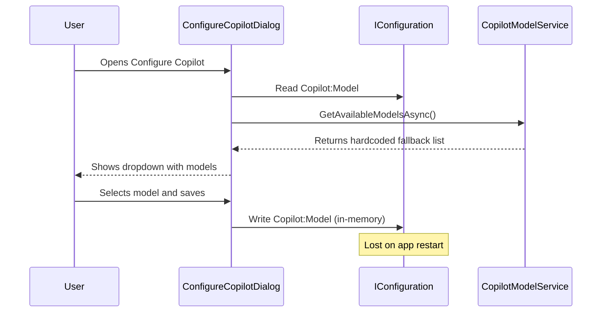
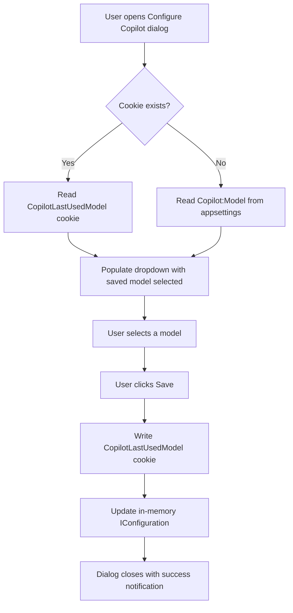
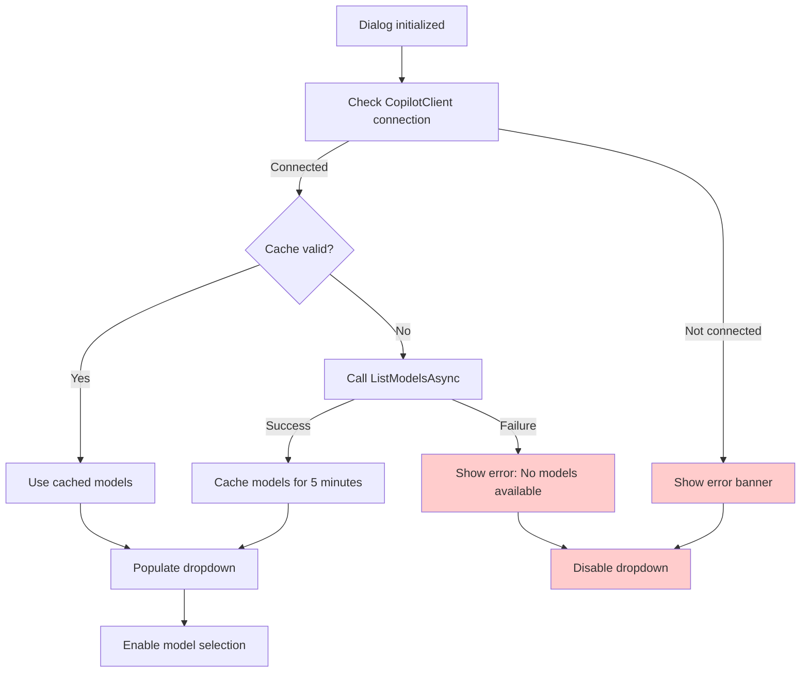
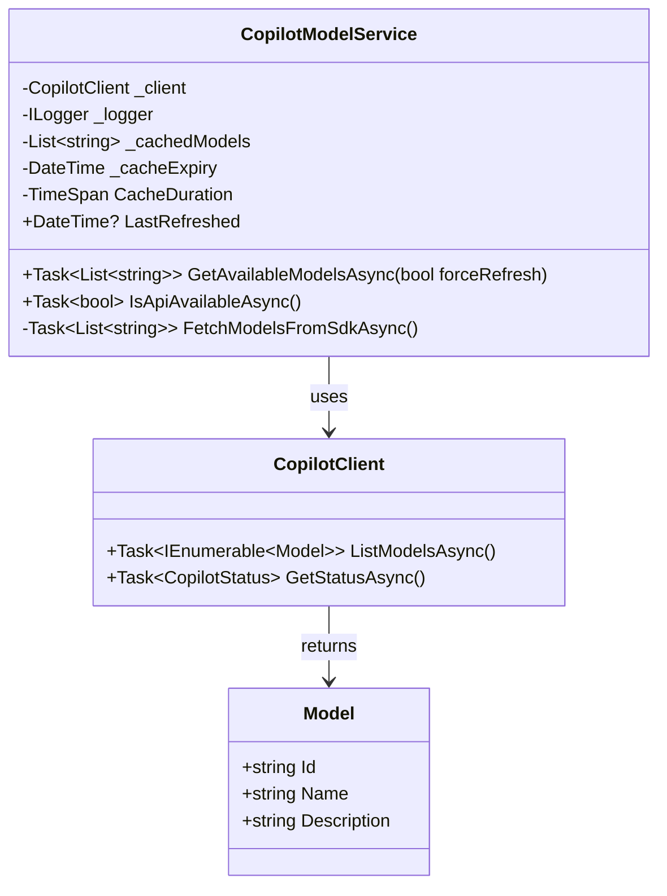
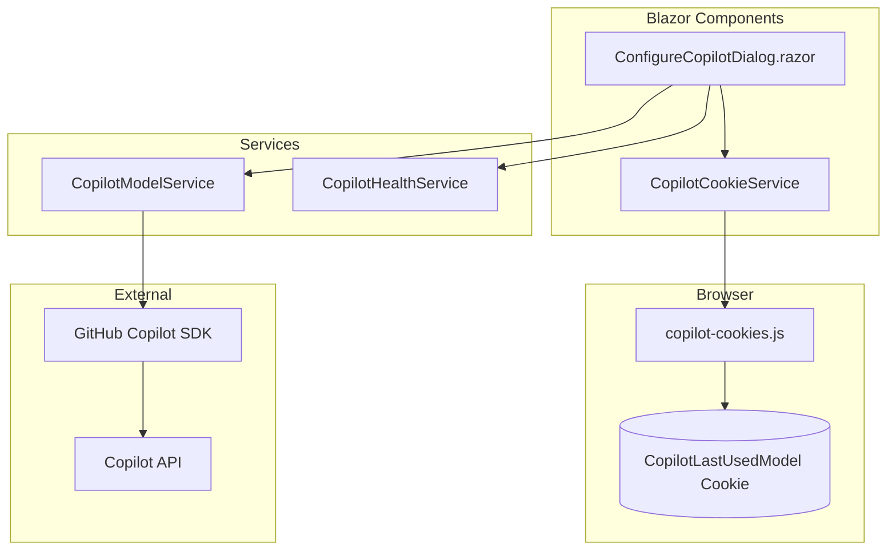
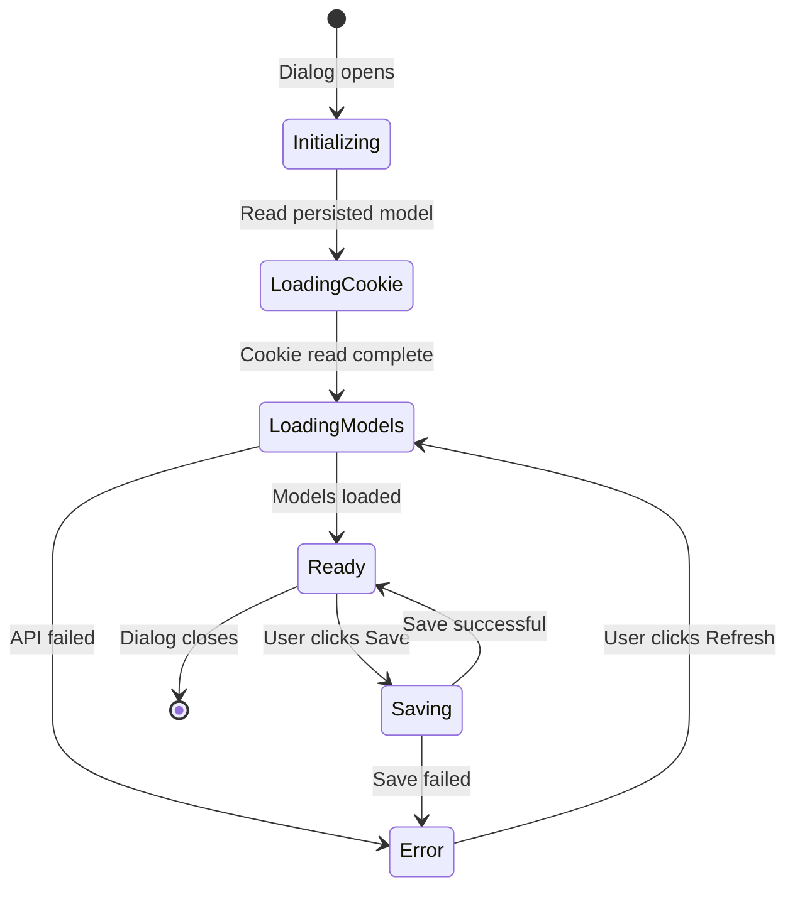
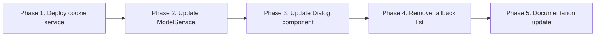

# Copilot Model Persistence and Dynamic Model List Feature Plan

This document outlines the implementation plan for two features in the **BlazorDataOrchestrator.JobCreatorTemplate** project's "Configure Copilot" dialog:

1. **Save the Last Used Model** - Persist the user's selected model in a browser cookie
2. **Dynamic Model Dropdown** - Populate the model dropdown with actual models from the GitHub Copilot SDK API

---

## Table of Contents

1. [Current State Analysis](#current-state-analysis)
2. [Feature 1: Last Used Model Persistence](#feature-1-last-used-model-persistence)
3. [Feature 2: Dynamic Model Dropdown via API](#feature-2-dynamic-model-dropdown-via-api)
4. [System Architecture](#system-architecture)
5. [Implementation Details](#implementation-details)
6. [Testing Strategy](#testing-strategy)
7. [Migration and Rollout](#migration-and-rollout)

---

## Current State Analysis

### Existing Components

| Component | Location | Current Behavior |
|-----------|----------|------------------|
| `ConfigureCopilotDialog.razor` | `Components/` | Reads model from `IConfiguration`, stores in-memory only |
| `CopilotModelService.cs` | `Services/` | Attempts SDK API fetch, falls back to hardcoded list |
| `appsettings.json` | Root | Contains `Copilot:Model` default value |

### Current Flow



### Problems with Current Implementation

1. **Model selection is not persisted** - The `Configuration["Copilot:Model"]` write is in-memory only; it reverts to `appsettings.json` default on restart
2. **Hardcoded fallback dominates** - The SDK's `ListModelsAsync()` method is called via reflection but often fails, causing the hardcoded list to appear
3. **No user-specific persistence** - Different users on the same machine share the same configuration

---

## Feature 1: Last Used Model Persistence

### Overview

Store the user's last selected Copilot model in a **persistent browser cookie** so it survives page refreshes and application restarts.

### Design Decisions

| Aspect | Decision | Rationale |
|--------|----------|-----------|
| Storage mechanism | Browser cookie | User-specific, survives app restarts, no server-side storage needed |
| Cookie name | `CopilotLastUsedModel` | Clear, descriptive naming |
| Cookie lifetime | 365 days | Long-term persistence |
| Cookie attributes | `SameSite=Strict`, `Secure` (if HTTPS) | Security best practices |
| Fallback behavior | Use `appsettings.json` default | Graceful degradation for new users |

### Cookie Data Flow



### Cookie Service Interface

```csharp
public interface ICopilotCookieService
{
    /// <summary>
    /// Retrieves the last used Copilot model from the browser cookie.
    /// </summary>
    /// <returns>The model name or null if not set.</returns>
    Task<string?> GetLastUsedModelAsync();

    /// <summary>
    /// Persists the selected Copilot model to a browser cookie.
    /// </summary>
    /// <param name="modelName">The model name to persist.</param>
    Task SetLastUsedModelAsync(string modelName);
}
```

### JavaScript Interop Requirements

The cookie operations require JavaScript interop since Blazor WebAssembly cannot directly access `document.cookie`:

```javascript
// wwwroot/js/copilot-cookies.js
window.copilotCookies = {
    get: function(name) {
        const value = `; ${document.cookie}`;
        const parts = value.split(`; ${name}=`);
        if (parts.length === 2) {
            return parts.pop().split(';').shift();
        }
        return null;
    },
    set: function(name, value, days) {
        const expires = new Date();
        expires.setTime(expires.getTime() + (days * 24 * 60 * 60 * 1000));
        const secure = location.protocol === 'https:' ? ';Secure' : '';
        document.cookie = `${name}=${value};expires=${expires.toUTCString()};path=/;SameSite=Strict${secure}`;
    }
};
```

---

## Feature 2: Dynamic Model Dropdown via API

### Overview

Remove the hardcoded fallback model list and populate the dropdown **exclusively** with models returned by the GitHub Copilot SDK API.

### Design Decisions

| Aspect | Decision | Rationale |
|--------|----------|-----------|
| API source | GitHub Copilot SDK `ListModelsAsync()` | Native SDK method, most accurate for user's subscription |
| Fallback list | **Removed** | User requirement: only show actual available models |
| Cache duration | 5 minutes | Balance between freshness and API rate limits |
| Error handling | Show error message, disable dropdown | Clear feedback when API unavailable |
| Loading state | Show spinner in dropdown | Visual feedback during API call |

### API Discovery Flow



### Enhanced CopilotModelService



### API Response Handling

The `ListModelsAsync()` method returns a collection of model objects. The service must:

1. Extract the model identifier (try `Id`, `ModelId`, or `Name` properties)
2. Filter out any null or empty entries
3. Sort alphabetically for consistent display
4. Cache the result with a 5-minute expiry

### Error States and UI Feedback

| API State | UI Behavior |
|-----------|-------------|
| Loading | Dropdown disabled, spinner visible |
| Success | Dropdown enabled, models listed |
| Empty response | Dropdown disabled, message: "No models available" |
| Connection failed | Warning banner, dropdown disabled |
| Rate limited | Retry after delay, show cached if available |

---

## System Architecture

### Component Interaction Diagram



### State Management



---

## Implementation Details

### Files to Create

| File | Purpose |
|------|---------|
| `wwwroot/js/copilot-cookies.js` | JavaScript cookie helper functions |
| `Services/CopilotCookieService.cs` | C# service wrapping JS interop for cookies |

### Files to Modify

| File | Changes Required |
|------|------------------|
| `Components/ConfigureCopilotDialog.razor` | Inject cookie service, load/save from cookie |
| `Services/CopilotModelService.cs` | Remove fallback list, enhance error handling |
| `Program.cs` | Register `CopilotCookieService` |
| `_Host.cshtml` or `index.html` | Add script reference for cookies JS |

### CopilotCookieService Implementation

```csharp
using Microsoft.JSInterop;

namespace BlazorDataOrchestrator.JobCreatorTemplate.Services;

/// <summary>
/// Service for managing Copilot-related browser cookies via JS interop.
/// </summary>
public class CopilotCookieService : ICopilotCookieService
{
    private readonly IJSRuntime _jsRuntime;
    private const string CookieName = "CopilotLastUsedModel";
    private const int CookieExpiryDays = 365;

    public CopilotCookieService(IJSRuntime jsRuntime)
    {
        _jsRuntime = jsRuntime;
    }

    public async Task<string?> GetLastUsedModelAsync()
    {
        try
        {
            return await _jsRuntime.InvokeAsync<string?>(
                "copilotCookies.get", 
                CookieName);
        }
        catch (JSException)
        {
            return null;
        }
    }

    public async Task SetLastUsedModelAsync(string modelName)
    {
        await _jsRuntime.InvokeVoidAsync(
            "copilotCookies.set", 
            CookieName, 
            modelName, 
            CookieExpiryDays);
    }
}
```

### Updated CopilotModelService

Key changes from current implementation:

```csharp
public class CopilotModelService
{
    private readonly CopilotClient _client;
    private readonly ILogger<CopilotModelService> _logger;

    private List<string>? _cachedModels;
    private DateTime _cacheExpiry = DateTime.MinValue;
    private static readonly TimeSpan CacheDuration = TimeSpan.FromMinutes(5);

    // REMOVED: Hardcoded FallbackModels list

    public CopilotModelService(CopilotClient client, ILogger<CopilotModelService> logger)
    {
        _client = client;
        _logger = logger;
    }

    public DateTime? LastRefreshed { get; private set; }

    /// <summary>
    /// Checks if the Copilot API is currently available.
    /// </summary>
    public async Task<bool> IsApiAvailableAsync()
    {
        try
        {
            await _client.GetStatusAsync();
            return true;
        }
        catch
        {
            return false;
        }
    }

    public async Task<List<string>> GetAvailableModelsAsync(bool forceRefresh = false)
    {
        // Return cached if valid and not forcing refresh
        if (!forceRefresh && _cachedModels != null && DateTime.UtcNow < _cacheExpiry)
        {
            return _cachedModels;
        }

        // Verify connectivity
        if (!await IsApiAvailableAsync())
        {
            _logger.LogWarning("Copilot API not available");
            throw new InvalidOperationException(
                "Cannot fetch models: Copilot CLI is not connected. " +
                "Please ensure the CLI is installed and authenticated.");
        }

        // Fetch from API
        var models = await FetchModelsFromSdkAsync();
        
        if (models == null || models.Count == 0)
        {
            throw new InvalidOperationException(
                "No models returned from the Copilot API. " +
                "This may indicate a subscription or permissions issue.");
        }

        _cachedModels = models.OrderBy(m => m).ToList();
        _cacheExpiry = DateTime.UtcNow.Add(CacheDuration);
        LastRefreshed = DateTime.UtcNow;

        _logger.LogInformation("Fetched {Count} models from Copilot API", models.Count);
        return _cachedModels;
    }

    // FetchModelsFromSdkAsync remains similar but without fallback
}
```

### Updated ConfigureCopilotDialog.razor

```razor
@inject CopilotCookieService CookieService
@inject CopilotModelService ModelService
@inject CopilotHealthService CopilotHealth
@inject IConfiguration Configuration
@inject NotificationService NotificationService

<RadzenStack Gap="16" Style="padding: 8px;">
    @if (!CopilotHealth.IsReady)
    {
        <RadzenAlert AlertStyle="AlertStyle.Warning" ShowIcon="true" 
                     Variant="Variant.Flat" AllowClose="false">
            <strong>@CopilotHealth.StatusMessage</strong>
            <p style="font-size: 0.85em; margin: 4px 0 0 0;">
                Copilot CLI is not connected. Model selection is unavailable.
            </p>
        </RadzenAlert>
    }

    @if (!string.IsNullOrEmpty(errorMessage))
    {
        <RadzenAlert AlertStyle="AlertStyle.Danger" ShowIcon="true" 
                     Variant="Variant.Flat" AllowClose="true">
            @errorMessage
        </RadzenAlert>
    }

    <RadzenFormField Text="Model:" Variant="Variant.Outlined">
        <RadzenStack Orientation="Orientation.Horizontal" 
                     AlignItems="AlignItems.Center" Gap="4">
            <RadzenDropDown Data="@availableModels" 
                            @bind-Value="@selectedModel"
                            Style="width: 100%;" 
                            AllowClear="false"
                            Disabled="@(isLoadingModels || !hasModels)" 
                            Placeholder="@dropdownPlaceholder" />
            <RadzenButton Icon="refresh" 
                          Size="ButtonSize.Small" 
                          ButtonStyle="ButtonStyle.Light"
                          title="Refresh available models from API" 
                          Click="@OnRefreshModels"
                          IsBusy="@isLoadingModels"
                          Disabled="@(!CopilotHealth.IsReady)"
                          Style="padding: 4px 8px; min-width: auto;" />
        </RadzenStack>
    </RadzenFormField>

    @if (ModelService.LastRefreshed.HasValue)
    {
        <RadzenText TextStyle="TextStyle.Caption" Style="color: #999;">
            Models last refreshed: @ModelService.LastRefreshed.Value.ToLocalTime().ToString("g")
        </RadzenText>
    }

    <RadzenButton Text="Save" 
                  ButtonStyle="ButtonStyle.Primary"
                  Click="@OnSave" 
                  Style="width: 100%;"
                  Disabled="@(!hasModels || string.IsNullOrEmpty(selectedModel))" />
</RadzenStack>

@code {
    [Parameter] public EventCallback OnSettingsSaved { get; set; }

    private string selectedModel = "";
    private List<string> availableModels = new();
    private bool isLoadingModels = false;
    private bool hasModels = false;
    private string? errorMessage = null;
    private string dropdownPlaceholder => isLoadingModels 
        ? "Loading models..." 
        : (hasModels ? "Select a model" : "No models available");

    protected override async Task OnInitializedAsync()
    {
        // Priority 1: Try to load from cookie (persisted last selection)
        var cookieModel = await CookieService.GetLastUsedModelAsync();
        
        // Priority 2: Fall back to appsettings.json default
        if (string.IsNullOrWhiteSpace(cookieModel))
        {
            cookieModel = Configuration.GetValue<string>("Copilot:Model");
        }

        if (!string.IsNullOrWhiteSpace(cookieModel))
        {
            selectedModel = cookieModel;
        }

        await LoadModelsAsync();
    }

    private async Task LoadModelsAsync()
    {
        isLoadingModels = true;
        errorMessage = null;
        StateHasChanged();

        try
        {
            availableModels = await ModelService.GetAvailableModelsAsync();
            hasModels = availableModels.Count > 0;

            // Validate that selected model is in the list
            if (!string.IsNullOrWhiteSpace(selectedModel) && 
                !availableModels.Contains(selectedModel))
            {
                // Model no longer available, select first available
                selectedModel = availableModels.FirstOrDefault() ?? "";
            }
            else if (string.IsNullOrWhiteSpace(selectedModel) && hasModels)
            {
                selectedModel = availableModels.First();
            }
        }
        catch (Exception ex)
        {
            errorMessage = ex.Message;
            hasModels = false;
            availableModels.Clear();
        }
        finally
        {
            isLoadingModels = false;
            StateHasChanged();
        }
    }

    private async Task OnRefreshModels()
    {
        isLoadingModels = true;
        errorMessage = null;
        StateHasChanged();

        try
        {
            availableModels = await ModelService.GetAvailableModelsAsync(forceRefresh: true);
            hasModels = availableModels.Count > 0;

            if (!availableModels.Contains(selectedModel) && hasModels)
            {
                selectedModel = availableModels.First();
            }

            NotificationService.Notify(new NotificationMessage
            {
                Severity = NotificationSeverity.Info,
                Summary = "Models refreshed",
                Detail = $"Found {availableModels.Count} models.",
                Duration = 3000
            });
        }
        catch (Exception ex)
        {
            errorMessage = ex.Message;
            NotificationService.Notify(new NotificationMessage
            {
                Severity = NotificationSeverity.Warning,
                Summary = "Refresh failed",
                Detail = ex.Message,
                Duration = 4000
            });
        }
        finally
        {
            isLoadingModels = false;
            StateHasChanged();
        }
    }

    private async Task OnSave()
    {
        try
        {
            // Persist to browser cookie for next session
            await CookieService.SetLastUsedModelAsync(selectedModel);

            // Update in-memory configuration for current session
            Configuration["Copilot:Model"] = selectedModel;

            NotificationService.Notify(new NotificationMessage
            {
                Severity = NotificationSeverity.Success,
                Summary = "Success",
                Detail = $"Copilot model set to: {selectedModel}",
                Duration = 4000
            });

            await OnSettingsSaved.InvokeAsync();
        }
        catch (Exception ex)
        {
            NotificationService.Notify(new NotificationMessage
            {
                Severity = NotificationSeverity.Error,
                Summary = "Error",
                Detail = $"Failed to save settings: {ex.Message}",
                Duration = 4000
            });
        }
    }
}
```

### Program.cs Registration

Add the cookie service registration:

```csharp
// In Program.cs, after other service registrations
builder.Services.AddScoped<CopilotCookieService>();
```

---

## Testing Strategy

### Unit Tests

| Test Case | Description |
|-----------|-------------|
| `CookieService_GetLastUsedModel_ReturnsNull_WhenNotSet` | Verify graceful handling of missing cookie |
| `CookieService_SetLastUsedModel_PersistsCookie` | Verify cookie is written correctly |
| `ModelService_GetModels_ThrowsWhenApiUnavailable` | Verify no fallback behavior |
| `ModelService_GetModels_CachesResult` | Verify 5-minute cache works |
| `ModelService_GetModels_ForceRefreshBypassesCache` | Verify force refresh works |

### Integration Tests

| Test Case | Description |
|-----------|-------------|
| `Dialog_LoadsModelFromCookie` | Opens dialog, verifies cookie value is pre-selected |
| `Dialog_SavesModelToCookie` | Selects model, saves, verifies cookie updated |
| `Dialog_ShowsErrorWhenApiUnavailable` | Disconnects Copilot, verifies error banner |
| `Dialog_RefreshButtonFetchesNewModels` | Click refresh, verify API called |

### Manual Testing Checklist

- [ ] Open Configure Copilot dialog with no cookie set
- [ ] Verify models load from API (no hardcoded models appear)
- [ ] Select a model and save
- [ ] Close and reopen dialog - verify same model is selected
- [ ] Restart the application - verify cookie persists selection
- [ ] Disconnect Copilot CLI - verify appropriate error message
- [ ] Click refresh button - verify models reload from API

---

## Migration and Rollout

### Backward Compatibility

| Scenario | Behavior |
|----------|----------|
| Existing users with `appsettings.json` model | Will use config value until they save a new selection |
| New users | Will see first model from API, or error if API unavailable |
| Users with cookies disabled | Fall back to `appsettings.json` value |

### Rollout Steps



### Phase Details

1. **Phase 1: Deploy Cookie Service**
   - Add `copilot-cookies.js`
   - Add `CopilotCookieService.cs`
   - Register service in `Program.cs`
   - No user-facing changes

2. **Phase 2: Update ModelService**
   - Remove `FallbackModels` list
   - Add `IsApiAvailableAsync()` method
   - Enhance error messages
   - Test API-only behavior

3. **Phase 3: Update Dialog Component**
   - Inject `CopilotCookieService`
   - Update initialization to read cookie first
   - Update save to write cookie
   - Add error state UI

4. **Phase 4: Final Cleanup**
   - Remove any remaining fallback references
   - Update logging messages
   - Performance testing

5. **Phase 5: Documentation**
   - Update wiki with new behavior
   - Document cookie usage for privacy policy if needed

---

## Appendix: Cookie Security Considerations

| Attribute | Value | Purpose |
|-----------|-------|---------|
| `HttpOnly` | `false` | Must be readable by JavaScript |
| `Secure` | `true` (if HTTPS) | Prevents transmission over unencrypted connections |
| `SameSite` | `Strict` | Prevents CSRF attacks |
| `Path` | `/` | Available throughout the application |
| `Expires` | 365 days | Long-term persistence |

The cookie stores only the model name (e.g., `"gpt-4.1"`), which is non-sensitive information. No API keys, tokens, or personal data are stored in this cookie.
