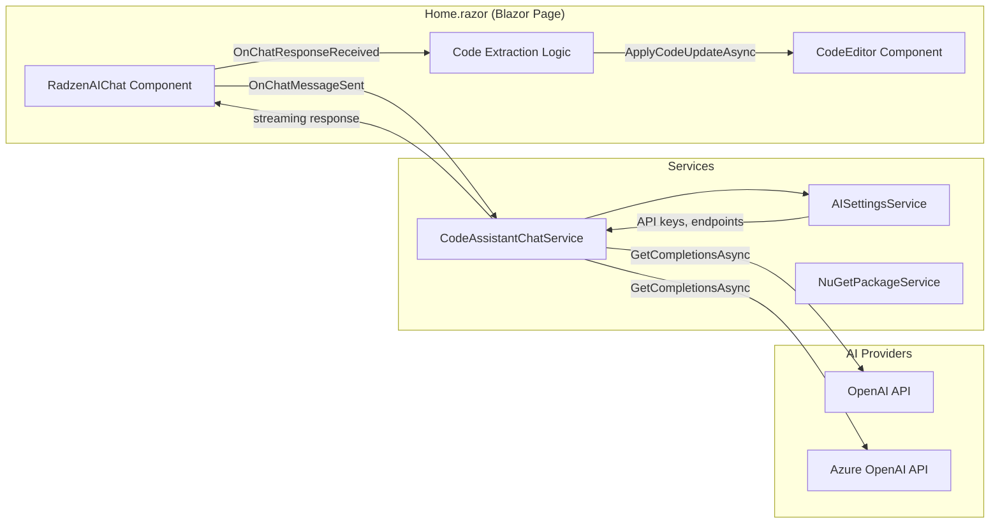
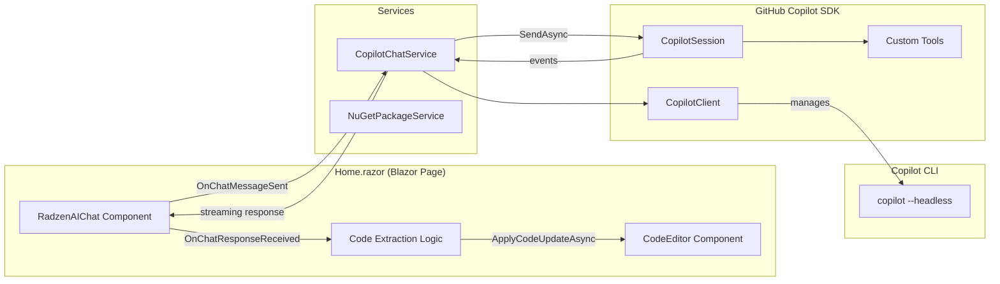
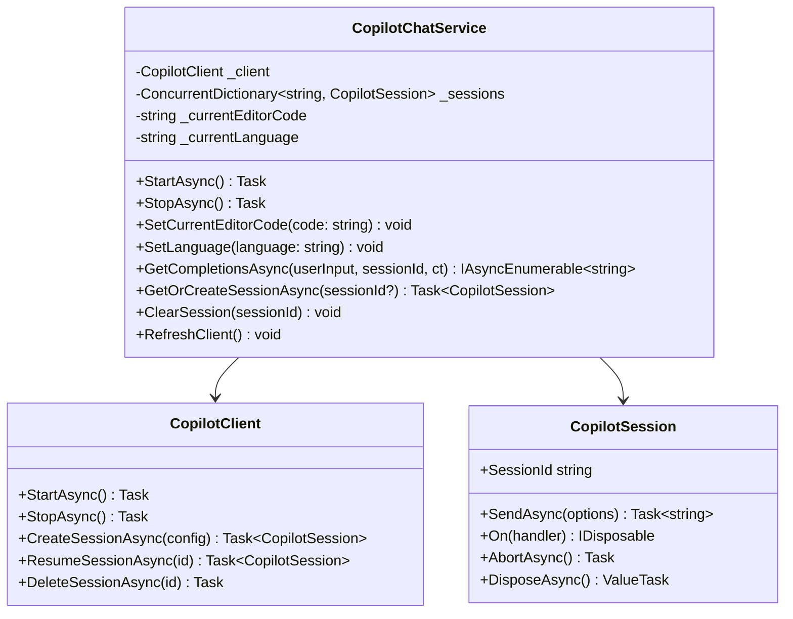
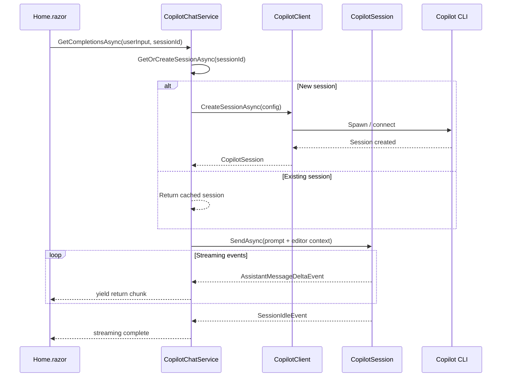
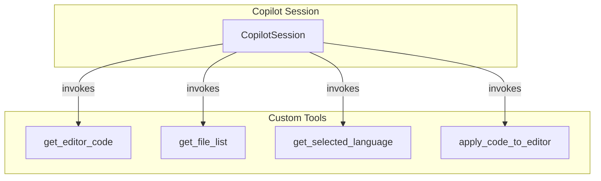
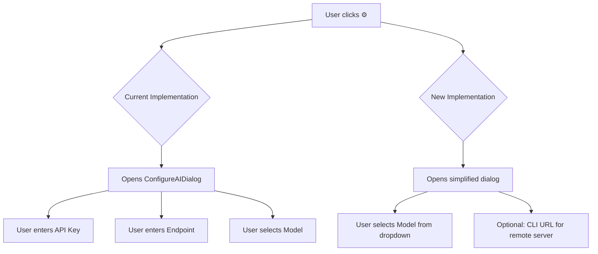
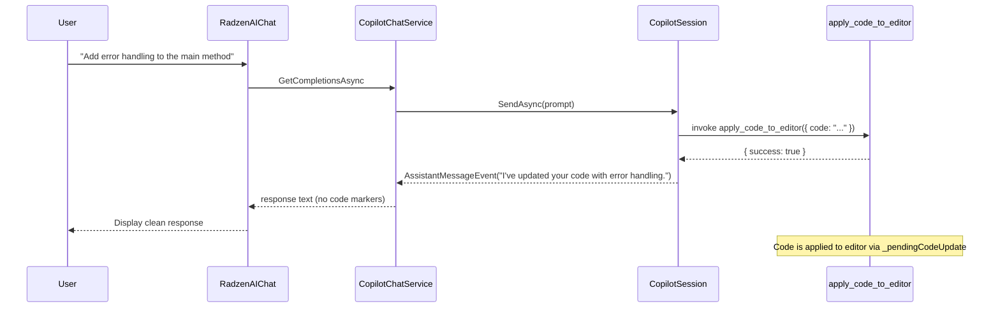
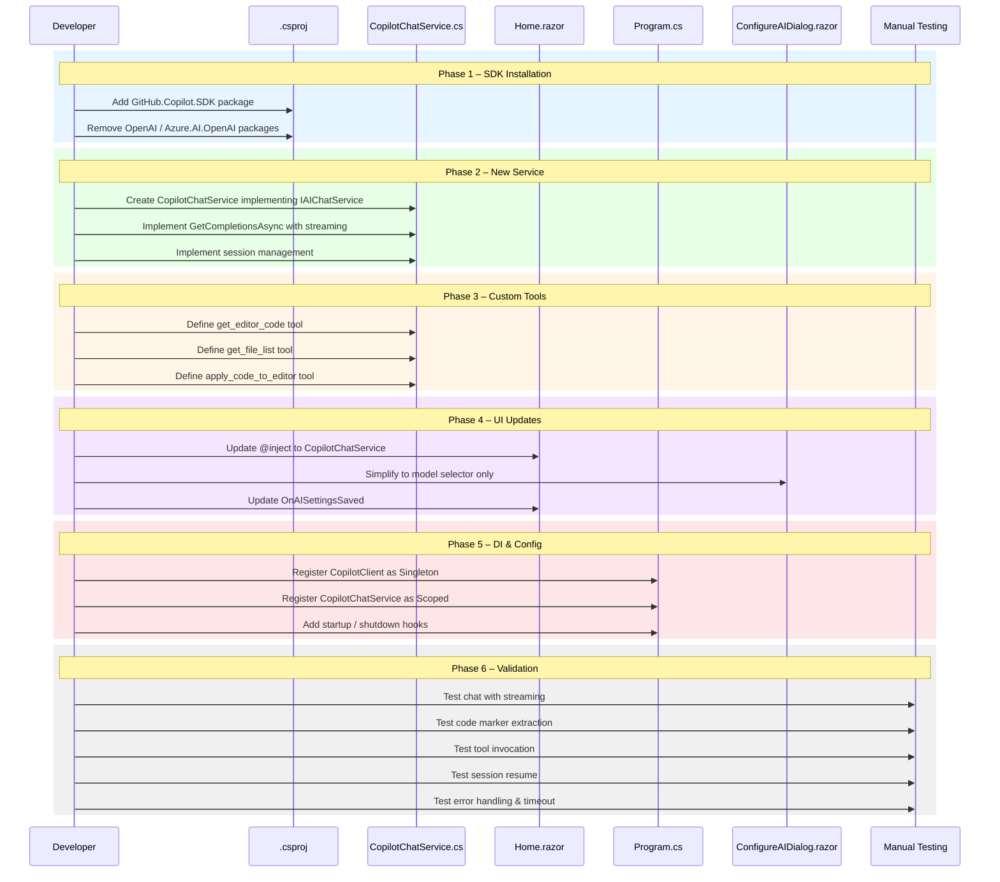
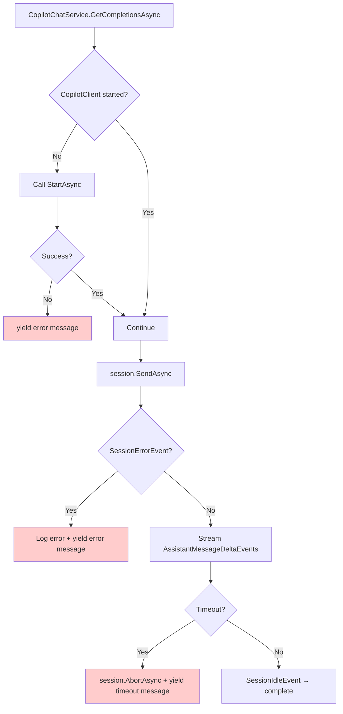

# Copilot SDK Integration Plan for Job Creator Template

## 1. Overview

This document describes the plan to replace the existing AI chat implementation in `Home.razor` (the Job Creator Template) with the [GitHub Copilot SDK for .NET](https://github.com/github/copilot-sdk). The current implementation relies on `Microsoft.Extensions.AI`, `OpenAI`, and `Azure.AI.OpenAI` NuGet packages orchestrated through a custom `CodeAssistantChatService`. The new implementation will use the `GitHub.Copilot.SDK` NuGet package to provide AI-powered code assistance directly through the Copilot platform.

### 1.1 Goals

| # | Goal | Description |
|---|------|-------------|
| 1 | Replace AI backend | Swap `OpenAI` / `Azure.AI.OpenAI` / `Microsoft.Extensions.AI` with `GitHub.Copilot.SDK` |
| 2 | Simplify authentication | Leverage Copilot CLI authentication instead of manual API key management |
| 3 | Streaming support | Maintain real-time streaming of AI responses in the `RadzenAIChat` component |
| 4 | Custom tools | Expose editor context (current code, language, file info) as Copilot tools |
| 5 | Session persistence | Support resuming chat sessions across page navigations |
| 6 | Backward compatibility | Keep the existing UX (chat panel, code markers, undo/redo) unchanged |

---

## 2. Current Architecture

### 2.1 Component Map



### 2.2 Current Service Chain

1. **`Home.razor`** – The Blazor page hosts `RadzenAIChat` and a `CodeEditor`. When the user sends a chat message, `OnChatMessageSent` fires, grabs the current editor code, and passes it to `CodeAssistantChatService`.
2. **`CodeAssistantChatService`** – Implements `IAIChatService`. Manages conversation sessions (`ConcurrentDictionary`), builds system prompts with language-specific instructions, and calls OpenAI/Azure OpenAI via `IChatClient.GetStreamingResponseAsync`.
3. **`AISettingsService`** – Persists API keys, endpoint URLs, model names, and service type (`OpenAI` vs `Azure OpenAI`) to a local JSON file.
4. **`ConfigureAIDialog.razor`** – A Radzen dialog for the user to configure AI provider settings (API key, endpoint, model).

### 2.3 Key NuGet Dependencies (to be replaced)

| Package | Version | Purpose |
|---------|---------|---------|
| `Microsoft.Extensions.AI` | 10.2.0 | Abstraction layer (`IChatClient`) |
| `Microsoft.Extensions.AI.OpenAI` | 10.2.0-preview | OpenAI adapter for `IChatClient` |
| `Azure.AI.OpenAI` | 2.3.0-beta.1 | Azure OpenAI client |

---

## 3. Target Architecture

### 3.1 Component Map (After Migration)



### 3.2 New Service: `CopilotChatService`

Replaces `CodeAssistantChatService`. Manages a long-lived `CopilotClient` and per-user `CopilotSession` instances.



---

## 4. Implementation Plan

### 4.1 Phase 1 – Install SDK & Prerequisites

#### 4.1.1 Install GitHub Copilot CLI

The Copilot SDK requires the Copilot CLI to be installed and authenticated on the host machine.

```
# Verify CLI is installed
copilot --version
```

#### 4.1.2 Add NuGet Package

Add `GitHub.Copilot.SDK` to the `BlazorDataOrchestrator.JobCreatorTemplate` project:

```xml
<PackageReference Include="GitHub.Copilot.SDK" Version="*" />
```

#### 4.1.3 Remove Old Packages

Remove or mark as unused (some may still be needed elsewhere in the solution):

```xml
<!-- REMOVE from JobCreatorTemplate.csproj -->
<PackageReference Include="Microsoft.Extensions.AI" Version="10.2.0" />
<PackageReference Include="Microsoft.Extensions.AI.OpenAI" Version="10.2.0-preview.1.26063.2" />
<PackageReference Include="Azure.AI.OpenAI" Version="2.3.0-beta.1" />
```

> **Note:** If `BlazorDataOrchestrator.Core` still depends on these packages for other features (e.g. the Web project's chat), those references remain in the Core `.csproj`.

### 4.2 Phase 2 – Create `CopilotChatService`

Create a new service that wraps the Copilot SDK and implements `IAIChatService`.

#### 4.2.1 File: `Services/CopilotChatService.cs`



**Key implementation details:**

| Aspect | Detail |
|--------|--------|
| **Client lifetime** | Singleton `CopilotClient` started once and stopped on app shutdown via `IHostApplicationLifetime` |
| **Session lifetime** | Scoped per Blazor circuit; stored in `ConcurrentDictionary<string, CopilotSession>` |
| **Model selection** | Configurable via `appsettings.json` under `Copilot:Model` (default: `"gpt-4.1"`) |
| **System message** | Uses `SystemMessageConfig` with `Mode = Append` to inject code-assistant persona + language-specific instructions |
| **Streaming** | `SessionConfig.Streaming = true`; events handled via `session.On(evt => ...)` pattern matching |
| **Editor context** | The current editor code is prepended to the user's prompt in the `SendAsync` call, matching the current behavior |

#### 4.2.2 Session Configuration

```csharp
var session = await _client.CreateSessionAsync(new SessionConfig
{
    SessionId = sessionId,
    Model = _model,             // e.g. "gpt-4.1"
    Streaming = true,
    SystemMessage = new SystemMessageConfig
    {
        Mode = SystemMessageMode.Append,
        Content = systemPrompt   // Code assistant persona + language instructions
    },
    Tools = _tools              // Custom tools (see Phase 3)
});
```

#### 4.2.3 Streaming Response Collection

```csharp
var done = new TaskCompletionSource();
var responseBuilder = new StringBuilder();

session.On(evt =>
{
    switch (evt)
    {
        case AssistantMessageDeltaEvent delta:
            var chunk = delta.Data.DeltaContent;
            responseBuilder.Append(chunk);
            // Push chunk to IAsyncEnumerable via Channel<string>
            _channel.Writer.TryWrite(chunk);
            break;
        case SessionIdleEvent:
            _channel.Writer.Complete();
            done.SetResult();
            break;
        case SessionErrorEvent err:
            _channel.Writer.Complete(new Exception(err.Data.Message));
            done.SetResult();
            break;
    }
});
```

### 4.3 Phase 3 – Define Custom Tools

Expose contextual tools that the Copilot model can invoke to get information about the user's editor state.



#### 4.3.1 Tool Definitions

| Tool Name | Description | Parameters | Returns |
|-----------|-------------|------------|---------|
| `get_editor_code` | Returns the current code in the editor | *none* | `{ code: string, fileName: string, language: string }` |
| `get_file_list` | Lists available files in the current code folder | *none* | `string[]` |
| `get_selected_language` | Returns the currently selected programming language | *none* | `{ language: string }` |
| `apply_code_to_editor` | Applies updated code to the editor (replaces `###UPDATED CODE###` markers) | `{ code: string }` | `{ success: bool }` |

#### 4.3.2 Tool Implementation Pattern

Tools are defined using `AIFunctionFactory.Create` from `Microsoft.Extensions.AI`:

```csharp
using Microsoft.Extensions.AI;
using System.ComponentModel;

var getEditorCode = AIFunctionFactory.Create(
    ([Description("No parameters needed")] string? _ = null) =>
    {
        return new
        {
            code = _currentEditorCode,
            fileName = _currentFileName,
            language = _currentLanguage
        };
    },
    "get_editor_code",
    "Returns the current code open in the user's editor"
);

var applyCode = AIFunctionFactory.Create(
    ([Description("The complete updated code to apply")] string code) =>
    {
        _pendingCodeUpdate = code;
        return new { success = true };
    },
    "apply_code_to_editor",
    "Applies updated code to the editor, replacing the current content"
);
```

### 4.4 Phase 4 – Update `Home.razor`

#### 4.4.1 Service Injection Changes

```diff
- @inject CodeAssistantChatService ChatService
+ @inject CopilotChatService ChatService
```

#### 4.4.2 Settings Dialog Replacement

The `ConfigureAIDialog` (for API keys / endpoints) can be simplified or replaced:

| Current | New |
|---------|-----|
| Configure API key, endpoint, model, service type | Configure model name only (auth handled by Copilot CLI) |
| `AISettingsService` persists to JSON file | Simple model selector in `appsettings.json` or a lightweight dialog |
| `OpenAISettingsDialog` button in chat header | Optional "Model" dropdown in chat header |

The settings gear button (`OpenAISettingsDialog`) behavior changes:



#### 4.4.3 Event Handler Changes

The `OnChatMessageSent`, `OnChatResponseReceived`, and `OnChatMessageAdded` handlers remain structurally the same. The key difference is how the service is called:

**Current flow:**
```
OnChatMessageSent → ChatService.SetCurrentEditorCode() → RadzenAIChat calls GetCompletionsAsync internally
```

**New flow:**
```
OnChatMessageSent → ChatService.SetCurrentEditorCode() → RadzenAIChat calls GetCompletionsAsync
    → CopilotChatService.GetCompletionsAsync → session.SendAsync → stream events back
```

The `RadzenAIChat` component uses the `IAIChatService` interface for its completions. Since `CopilotChatService` implements the same interface, the component requires no changes.

#### 4.4.4 Code Marker Handling (Unchanged)

The code extraction markers (`###UPDATED CODE BEGIN###` / `###UPDATED CODE END###`) remain in the system prompt and the `OnChatResponseReceived` / `OnChatMessageAdded` handlers continue to parse them. Alternatively, with the `apply_code_to_editor` custom tool, the model can directly apply code changes without markers—this is documented as a stretch goal in Phase 6.

### 4.5 Phase 5 – Update DI Registration (`Program.cs`)

#### 4.5.1 Current Registration

```csharp
builder.Services.AddScoped<AISettingsService>();
builder.Services.AddScoped<CodeAssistantChatService>();
builder.Services.AddScoped<IAIChatService>(sp => sp.GetRequiredService<CodeAssistantChatService>());
```

#### 4.5.2 New Registration

```csharp
// Copilot Client as Singleton (one CLI process for the app)
builder.Services.AddSingleton<CopilotClient>(sp =>
{
    var config = sp.GetRequiredService<IConfiguration>();
    var cliUrl = config.GetValue<string>("Copilot:CliUrl");
    var options = new CopilotClientOptions
    {
        AutoStart = true,
        AutoRestart = true,
        UseStdio = true,
        LogLevel = "info"
    };
    if (!string.IsNullOrEmpty(cliUrl))
    {
        options.CliUrl = cliUrl;
    }
    return new CopilotClient(options);
});

// CopilotChatService as Scoped (per Blazor circuit)
builder.Services.AddScoped<CopilotChatService>();
builder.Services.AddScoped<IAIChatService>(sp => sp.GetRequiredService<CopilotChatService>());

// Start the CopilotClient when the app starts
var app = builder.Build();
var copilotClient = app.Services.GetRequiredService<CopilotClient>();
await copilotClient.StartAsync();

// Ensure cleanup on shutdown
var lifetime = app.Services.GetRequiredService<IHostApplicationLifetime>();
lifetime.ApplicationStopping.Register(() =>
{
    copilotClient.StopAsync().GetAwaiter().GetResult();
});
```

#### 4.5.3 Configuration (`appsettings.json`)

```json
{
  "Copilot": {
    "Model": "gpt-4.1",
    "CliUrl": null,
    "SystemPromptMode": "Append"
  }
}
```

### 4.6 Phase 6 – Stretch Goals

#### 4.6.1 Tool-Based Code Application

Instead of using `###UPDATED CODE BEGIN###` / `###UPDATED CODE END###` markers in the prompt, register an `apply_code_to_editor` tool so the model can apply code changes directly:



#### 4.6.2 MCP Server Integration

Connect to GitHub's MCP server for repository-aware assistance:

```csharp
var session = await _client.CreateSessionAsync(new SessionConfig
{
    Model = "gpt-4.1",
    Streaming = true,
    McpServers = new Dictionary<string, McpServerConfig>
    {
        ["github"] = new McpServerConfig
        {
            Type = "http",
            Url = "https://api.githubcopilot.com/mcp/"
        }
    }
});
```

#### 4.6.3 Session Persistence Across Page Navigations

Use custom session IDs tied to the user/job context and `ResumeSessionAsync` to restore conversations:

```csharp
// On page load
var sessionId = $"job-creator-{currentJobId}";
try
{
    session = await _client.ResumeSessionAsync(sessionId);
}
catch
{
    session = await _client.CreateSessionAsync(new SessionConfig { SessionId = sessionId, ... });
}
```

---

## 5. Migration Sequence Diagram



---

## 6. File Change Summary

| File | Action | Description |
|------|--------|-------------|
| `BlazorDataOrchestrator.JobCreatorTemplate.csproj` | **Modify** | Add `GitHub.Copilot.SDK`; remove `Microsoft.Extensions.AI.OpenAI`, `Azure.AI.OpenAI` |
| `Services/CopilotChatService.cs` | **Create** | New service wrapping Copilot SDK; implements `IAIChatService` |
| `Services/CodeAssistantChatService.cs` | **Deprecate / Delete** | Replaced by `CopilotChatService` |
| `Program.cs` | **Modify** | Update DI to register `CopilotClient` (singleton) and `CopilotChatService` (scoped) |
| `Components/Pages/Home.razor` | **Modify** | Change `@inject` from `CodeAssistantChatService` to `CopilotChatService` |
| `Components/ConfigureAIDialog.razor` | **Modify** | Simplify to model selector; remove API key / endpoint fields |
| `appsettings.json` | **Modify** | Add `Copilot` section with `Model`, `CliUrl`, `SystemPromptMode` |

---

## 7. Error Handling Strategy



### 7.1 Error Scenarios

| Scenario | Handling |
|----------|----------|
| Copilot CLI not installed | `FileNotFoundException` → yield user-friendly error with install instructions |
| CLI connection failure | `HttpRequestException` → retry once, then yield error |
| Request timeout (30s) | `CancellationTokenSource` + `WaitAsync` → `session.AbortAsync()` |
| Session error event | `SessionErrorEvent` → log and yield error message |
| Unexpected exception | Catch-all → log and yield generic error |
| App shutdown | `IHostApplicationLifetime.ApplicationStopping` → `client.StopAsync()` |

---

## 8. Testing Plan

### 8.1 Manual Test Cases

| # | Test Case | Expected Result |
|---|-----------|-----------------|
| 1 | Send a simple chat message | Streaming response appears in RadzenAIChat |
| 2 | Ask AI to modify code | Code markers detected, code applied to editor |
| 3 | Check undo after AI code application | Previous code restored via undo stack |
| 4 | Switch language (C# → Python) | New session with correct language instructions |
| 5 | Clear chat | Session cleared, new session created on next message |
| 6 | Change model in settings | New session uses updated model |
| 7 | Kill Copilot CLI process | Auto-restart via `AutoRestart = true`, next message succeeds |
| 8 | Send message with no CLI installed | User-friendly error in chat |
| 9 | Large code file in editor (>10K lines) | Context truncated appropriately, no timeout |
| 10 | Rapid successive messages | Messages queued, responses arrive in order |

### 8.2 Integration Test Considerations

- The `CopilotClient` requires the Copilot CLI binary. Integration tests should use a mock or the `--headless` mode with a test token.
- Unit tests for `CopilotChatService` can mock `CopilotClient` and `CopilotSession` by extracting interfaces or using wrapper classes.

---

## 9. Risks & Mitigations

| Risk | Impact | Mitigation |
|------|--------|------------|
| Copilot SDK is in technical preview | Breaking changes possible | Pin to a specific SDK version; wrap in adapter |
| CLI must be installed on host | Deployment complexity | Document as prerequisite; consider Docker layer |
| `RadzenAIChat` expects `IAsyncEnumerable<string>` | SDK uses event-based streaming | Bridge with `Channel<string>` to `IAsyncEnumerable` |
| System prompt behavior differs from OpenAI | Prompt tuning required | Use `SystemMessageMode.Append` and test iteratively |
| `Microsoft.Extensions.AI` still used for tool definitions | Package not fully removable | Keep `Microsoft.Extensions.AI` for `AIFunctionFactory.Create` |

---

## 10. References

- [GitHub Copilot SDK – Getting Started](https://github.com/github/copilot-sdk/blob/main/docs/getting-started.md)
- [GitHub Copilot SDK – .NET Reference](https://github.com/github/copilot-sdk/blob/main/dotnet/README.md)
- [Copilot SDK Cookbook – .NET Recipes](https://github.com/github/awesome-copilot/blob/main/cookbook/copilot-sdk/dotnet/README.md)
- [Copilot SDK – Error Handling (.NET)](https://github.com/github/awesome-copilot/blob/main/cookbook/copilot-sdk/dotnet/error-handling.md)
- [Copilot SDK – Session Persistence (.NET)](https://github.com/github/awesome-copilot/blob/main/cookbook/copilot-sdk/dotnet/persisting-sessions.md)
- [Copilot SDK – Multiple Sessions (.NET)](https://github.com/github/awesome-copilot/blob/main/cookbook/copilot-sdk/dotnet/multiple-sessions.md)
