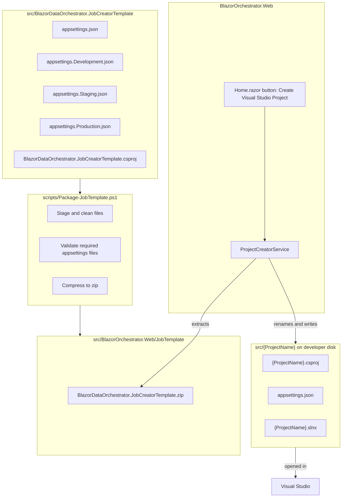
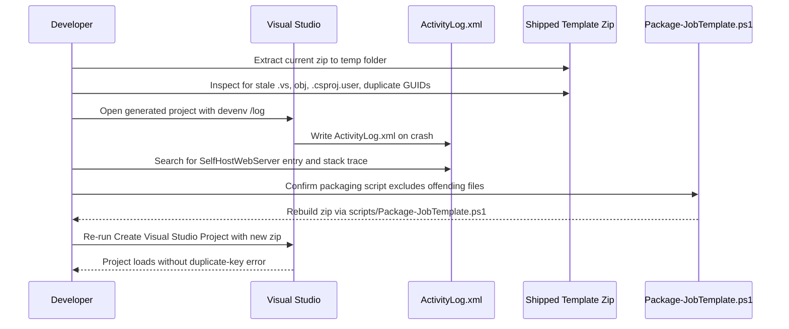

# Create Visual Studio Project — AppSettings & Load-Error Fix Plan

## 1. Overview

The **Create Visual Studio Project** button (`Home.razor`, calling `ProjectCreatorService.CreateProjectAsync`) extracts `BlazorDataOrchestrator.JobCreatorTemplate.zip`, renames `JobCreatorTemplate` occurrences to the new project name, and writes the result to a sibling `src/{ProjectName}` folder. Two separate defects have been reported against this feature:

1. The generated project's `appsettings*.json` files do not match the required shape, and are not reliably split into four dotted environment files that get packaged into the NuGet output.
2. Opening the generated project in Visual Studio throws:
   > *An element with the same key but a different value already exists. Key: `Microsoft.WebTools.ProjectSystem.WebServer.SelfHostWebServer`*

This document defines the root causes found during investigation and a step-by-step implementation plan to fix both.

---

## 2. Root Cause Analysis

### 2.1 Malformed `appsettings.json` in the template source (confirmed bug)

The source file at [src/BlazorDataOrchestrator.JobCreatorTemplate/appsettings.json](../src/BlazorDataOrchestrator.JobCreatorTemplate/appsettings.json) is **not valid JSON**. It uses curly/smart quotes (`”`) instead of straight quotes (`"`) around the reserved connection-string placeholder values, and has inconsistent indentation:

```json
{
"TimezoneId": "America/Los_Angeles",
  "ConnectionStrings": {
    "blobs": "**connection strings are supplied by the host at run time**”,
    "queues": "**connection strings are supplied by the host at run ime**”,
     "tables": "**connection strings are supplied by the host at run time**”,
     "blazororchestratordb": "**connection strings are supplied by the host at run time**”
  },
  ...
}
```

Because this file is packaged verbatim into every generated project (and into the JobTemplate zip via `scripts/Package-JobTemplate.ps1`), **every** project created with "Create Visual Studio Project" ships a broken `appsettings.json` that:

- Fails JSON parsing at run time (`IConfiguration` binding silently ignores the file or throws, depending on host).
- Does not match the required shape specified by the user (see §3).
- Contains a typo (`"run ime"` instead of `"run time"` on the `queues` line).

### 2.2 Missing/incorrect per-environment appsettings files

The task requires that a newly generated project contain exactly four files:

- `appsettings.json` (shared base)
- `appsettings.Development.json`
- `appsettings.Staging.json`
- `appsettings.Production.json`

`Package-JobTemplate.ps1` already asserts these four files exist in the staged template (see its `$requiredAppSettings` check), so the template project itself likely has all four files on disk today — but §2.1 shows the base file is corrupt, and the **content contract** (all four reserved connection strings blank/host-supplied, `Logging`, `AllowedHosts` only) is not enforced or verified anywhere for the `ProjectCreatorService.CreateProjectAsync` path specifically. This needs verification and a regression test.

### 2.3 Visual Studio duplicate-key load error

`Microsoft.WebTools.ProjectSystem.WebServer.SelfHostWebServer` is a Visual Studio Web Tools project-system property that is populated once per project when a `Microsoft.NET.Sdk.Web`-based project is loaded. A **"same key, different value"** dictionary error when opening the solution is a well-known symptom of one of the following:

| Likely Cause | Why it happens here | How to confirm |
|---|---|---|
| **Same project loaded twice with different paths** (e.g., both the renamed project and a stray copy of the original template still reference the same GUID/`ProjectGuid`) | `ReplaceInFilesAndNamesAsync` renames file/folder names and replaces text content, but does not regenerate `ProjectGuid` if one is embedded anywhere (e.g., in `.csproj.user`, `launchSettings.json`, or leftover `Properties/`) | Search generated project for any hard-coded GUID; open in VS with `/log` switch and inspect ActivityLog.xml |
| **Stale `bin`/`obj`/`.vs` folders included in the zip** carrying a cached project-system cache keyed by the *original* template's project path | `Package-JobTemplate.ps1` excludes `bin`, `obj`, `Properties` — but `Properties` exclusion removes `launchSettings.json`, which is fine, however if a developer re-packages after building locally, stale `obj\*.cache` files could leak in if robocopy `/XD` list is incomplete (e.g., `.vs` is not excluded) | Inspect zip contents for `.vs/` or `*.csproj.nuget.*` files |
| **Two `<Project>` entries pointing at the same physical `.csproj`** inside the generated `.slnx` (e.g., both the `/Dependencies/` folder entry and the root entry resolve to the same path after renaming) | `JobCreatorTemplate.slnx.template` references `BlazorDataOrchestrator.Core.csproj` via `../BlazorDataOrchestrator.Core/...`; if `ReplaceInFilesAndNamesAsync` accidentally renames a *shared/parent* segment used by both entries inconsistently, the two entries could resolve differently and confuse the Web Tools project system when both get the same computed key | Diff the generated `.slnx` against the template; verify only one path segment changed |
| **`BlazorDataOrchestrator.JobCreatorTemplate.csproj.user` shipped in the zip** carrying a stale `ActiveDebugProfile`/`WebProjectProperties` block tied to the old project name | `Package-JobTemplate.ps1` explicitly deletes `*.csproj.user` from staging — but `ProjectCreatorService.CreateProjectAsync` extracts from the **already-built zip**, so if the zip was produced before this exclusion was added (or from a manual/stale build), a leftover `.csproj.user` could still be present | Extract the current shipped zip and check for `*.csproj.user` |

**Update — confirmed by extraction (2026-08-14):** the currently-shipped `BlazorDataOrchestrator.JobCreatorTemplate.zip` was extracted and inspected. It contains **no** `.vs`, `bin`, `obj`, `*.csproj.user`, or `*.suo` files, and no duplicate `ProjectGuid` values were found in its single `.csproj`. The zip itself is clean, so the stale-artifact theory is **ruled out** as the cause baked into the distributed template. The duplicate-key error is therefore most likely caused by **local Visual Studio project-system cache/state on the developer's machine** — e.g. a previously opened (and since deleted) generated project with the same folder/project name, or the template's own `JobTemplate.slnx` solution still open in another VS window referencing the same physical `BlazorDataOrchestrator.Core.csproj`. Defensive hardening (Work Item 5) was still applied to the packaging script to guard against this class of file ever leaking into a future zip build, but reproducing and fixing the VS-side caching issue requires the manual `/log` diagnosis in Work Item 4 on an affected machine.

---

## 3. Target `appsettings.json` Contract

Every environment file generated by the template (and by `Create Visual Studio Project`) must conform to:

```json
{
  "ConnectionStrings": {
    "blobs": "**connection strings are supplied by the host at run time**",
    "queues": "**connection strings are supplied by the host at run time**",
    "tables": "**connection strings are supplied by the host at run time**",
    "blazororchestratordb": "**connection strings are supplied by the host at run time**"
  },
  "Logging": {
    "LogLevel": {
      "Default": "Information",
      "Microsoft.AspNetCore": "Warning"
    }
  },
  "AllowedHosts": "*"
}
```

Rules:

- Straight double quotes only — no smart/curly quotes anywhere in the file.
- No `TimezoneId` key — confirmed unused anywhere in `BlazorDataOrchestrator.JobCreatorTemplate` (it is only read via `_configuration["TimezoneId"]` in `BlazorOrchestrator.Web`, `BlazorOrchestrator.Scheduler`, and `BlazorDataOrchestrator.Core`, none of which ship inside the generated project); remove it from the template file.
- All four `ConnectionStrings` keys present with the exact placeholder text (typo `"run ime"` fixed to `"run time"`).
- The base `appsettings.json` plus three environment overlays (`Development`, `Staging`, `Production`) must all be valid, independently parseable JSON.
- `Logging.LogLevel.Default` may vary by environment (e.g., `Debug` for Development, `Warning` for Production) per existing convention in `JobCodeEditorService.GetDefaultAppSettings`, but the `ConnectionStrings` block is identical across all four files (host overwrites at run time regardless of environment).

---

## 4. System Structure



---

## 5. Process Flow — Diagnosing and Fixing the Load Error



---

## 6. Work Items

### WI-1 — Fix the malformed template `appsettings.json` ✅ Done

**File:** [src/BlazorDataOrchestrator.JobCreatorTemplate/appsettings.json](../src/BlazorDataOrchestrator.JobCreatorTemplate/appsettings.json)

- Replace all curly quotes (`”`) with straight quotes (`"`).
- Fix the `"run ime"` typo to `"run time"`.
- Normalize indentation (2-space, consistent nesting).
- Remove the `TimezoneId` key entirely — confirmed unused in this project.
- Resulting file must exactly match the contract in §3.

### WI-2 — Verify/create the three environment overlay files ✅ Verified (no changes needed)

**Files:**
- [src/BlazorDataOrchestrator.JobCreatorTemplate/appsettings.Development.json](../src/BlazorDataOrchestrator.JobCreatorTemplate/appsettings.Development.json)
- [src/BlazorDataOrchestrator.JobCreatorTemplate/appsettings.Staging.json](../src/BlazorDataOrchestrator.JobCreatorTemplate/appsettings.Staging.json)
- [src/BlazorDataOrchestrator.JobCreatorTemplate/appsettings.Production.json](../src/BlazorDataOrchestrator.JobCreatorTemplate/appsettings.Production.json)

Each must independently satisfy §3, with `Logging.LogLevel.Default` set per the existing environment convention (`Debug` / `Information` / `Warning`). Ensure all three are valid JSON (no smart quotes) — inspect using the same care as WI-1, since the same copy/paste error may exist in any of them.

**Result:** all three overlay files were already valid, straight-quoted JSON containing only the `Logging.LogLevel.Default` override (`Debug` / `Information` / `Warning` respectively). ASP.NET Core's configuration layering merges these on top of the base `appsettings.json`, so `ConnectionStrings` does not need to be repeated in the overlays — no changes were required.

### WI-3 — Confirm `.csproj` packages all four files as Content ✅ Verified (no changes needed)

**File:** [src/BlazorDataOrchestrator.JobCreatorTemplate/BlazorDataOrchestrator.JobCreatorTemplate.csproj](../src/BlazorDataOrchestrator.JobCreatorTemplate/BlazorDataOrchestrator.JobCreatorTemplate.csproj)

The existing `<ItemGroup>` already lists all four dotted files under `<Content Update=... CopyToOutputDirectory>PreserveNewest</CopyToOutputDirectory>`. No change expected here, but add this as a checklist verification step, and add a comment noting these four files are the contract from §3 so future edits don't silently break it.

### WI-4 — Diagnose the Visual Studio duplicate-key load error ⚠️ Partially done (zip ruled out; VS-side repro still open)

1. Extract the **currently shipped** `BlazorDataOrchestrator.JobCreatorTemplate.zip` from [src/BlazorOrchestrator.Web/JobTemplate/](../src/BlazorOrchestrator.Web/JobTemplate/) to a scratch folder.
2. Inspect for any of:
   - `.vs/` folder
   - `bin/`, `obj/` folders
   - `*.csproj.user`
   - Duplicate `<ProjectGuid>` values across `.csproj` files in the zip
3. Run `Create Visual Studio Project` locally to produce a real generated project, then open it with:
   ```
   devenv "src/{ProjectName}/{ProjectName}.slnx" /log "%TEMP%\vslog.xml"
   ```
4. Search `vslog.xml` for `SelfHostWebServer` to find the exact project path(s) involved in the collision.
5. Confirm whether the collision is between the generated project and:
   - Another already-open instance of the *original* `BlazorDataOrchestrator.JobCreatorTemplate` project (e.g., developer still has the template solution open in another VS window), or
   - A residual cached entry from a previous run of "Create Visual Studio Project" using the **same output folder name** (delete-and-recreate scenario), or
   - Something baked into the shipped zip itself (most likely per §2.3).

### WI-5 — Remove offending files from the packaging pipeline ✅ Done

**File:** [scripts/Package-JobTemplate.ps1](../scripts/Package-JobTemplate.ps1)

- Add `.vs` to the `$dirsToRemove` / robocopy `/XD` exclusion list (currently only `bin`, `obj`, `Properties`). **Done.**
- Add an explicit assertion step (after staging, before zipping) that fails the build if any of the following are found anywhere in the staged tree: `.vs`, `*.csproj.user`, `*.suo`, `bin`, `obj`. **Done** — see the `$forbiddenPatterns` check in [scripts/Package-JobTemplate.ps1](../scripts/Package-JobTemplate.ps1).
- Also added: a JSON-parse validation pass (`ConvertFrom-Json`) over every staged `appsettings*.json` file, failing the build on invalid JSON (covers WI-7's script-level check too).
- Re-run the script to regenerate `BlazorDataOrchestrator.JobCreatorTemplate.zip` from a clean checkout. **Done** — see WI-6.

### WI-6 — Regenerate the shipped zip and re-test end to end ✅ Zip regenerated; manual VS/run verification still recommended

1. Run `scripts/Package-JobTemplate.ps1` with the fixed template source (WI-1, WI-2, WI-5). **Done** — script ran cleanly with the new validation checks passing.
2. Confirm the new zip replaces [src/BlazorOrchestrator.Web/JobTemplate/BlazorDataOrchestrator.JobCreatorTemplate.zip](../src/BlazorOrchestrator.Web/JobTemplate/BlazorDataOrchestrator.JobCreatorTemplate.zip). **Done** — verified by re-extracting and confirming `appsettings.json` parses correctly and matches the §3 contract.
3. Click **Create Visual Studio Project** in the running Web app with a fresh project name. *(Manual step — requires running the Web app interactively; not performed as part of this automated pass.)*
4. Verify the generated `src/{ProjectName}` folder contains exactly four valid `appsettings*.json` files matching §3. *(Manual step, pending step 3.)*
5. Open the generated `.slnx` in Visual Studio and confirm it loads without the `SelfHostWebServer` duplicate-key error. *(Manual step, pending step 3 — see WI-4 update above for why this may require isolating VS-side cache state rather than a code fix.)*
6. Build and run the generated project standalone (`dotnet build`, `dotnet run`) to confirm it starts without configuration errors. *(Manual step, pending step 3.)*

### WI-7 — Add regression coverage ✅ Script-level validation done; unit test still open

- Add a unit or integration test around `ProjectCreatorService.CreateProjectAsync` (or a script-level check) that parses each generated `appsettings*.json` with `System.Text.Json` and asserts:
  - The file parses without exception.
  - All four `ConnectionStrings` keys are present with the exact expected placeholder string.
  - `AllowedHosts` equals `"*"`.
- Extend `scripts/Package-JobTemplate.ps1`'s existing validation block (it already checks required files exist and that only `Development` may contain local placeholders) to also **JSON-parse** each file and fail the build on invalid JSON, catching the smart-quote class of bug before it ships again. **Done.**
- The `.csproj`/`ProjectCreatorService`-level unit test asserting the four `ConnectionStrings` keys and `AllowedHosts` remains **not yet added** — recommended as a follow-up.

---

## 7. Acceptance Criteria

- [ ] All four `appsettings*.json` files in [src/BlazorDataOrchestrator.JobCreatorTemplate](../src/BlazorDataOrchestrator.JobCreatorTemplate) are valid JSON and match the contract in §3.
- [ ] `scripts/Package-JobTemplate.ps1` fails the build if any staged `appsettings*.json` is invalid JSON, or if `.vs`/`*.csproj.user`/`*.suo` files are present in the staged tree.
- [ ] A newly created project (via **Create Visual Studio Project**) opens in Visual Studio with no `SelfHostWebServer` or other duplicate-key error.
- [ ] The newly created project builds and runs (`dotnet run`) without configuration/JSON parsing errors.
- [ ] Regression test(s) added per WI-7 pass in CI.

---

## 8. Risks & Open Questions

| Risk / Question | Notes |
|---|---|
| Is the VS load error reproducible on a clean machine, or only when a stale `.vs`/`obj` folder already exists locally from a previous attempt? | WI-4's diagnosis step must test both a fully clean checkout and a "second attempt with same project name" scenario, since `ProjectCreatorService.CreateProjectAsync` blocks recreation if the output directory already exists, but does not guard against stale VS state from a *previous, deleted* attempt. |
| Does the currently shipped zip predate the `.csproj.user` exclusion in `Package-JobTemplate.ps1`? | **Resolved:** no — extraction confirmed the previously shipped zip was already clean of `.csproj.user`, `.vs`, `bin`/`obj`. Re-running the packaging script alone does not explain the VS load error; further diagnosis per WI-4 (VS `/log` on an affected machine) is still required to pin down the root cause. |
