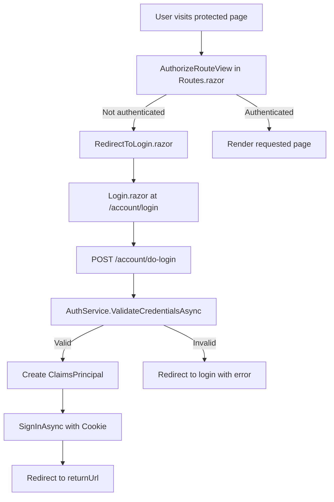
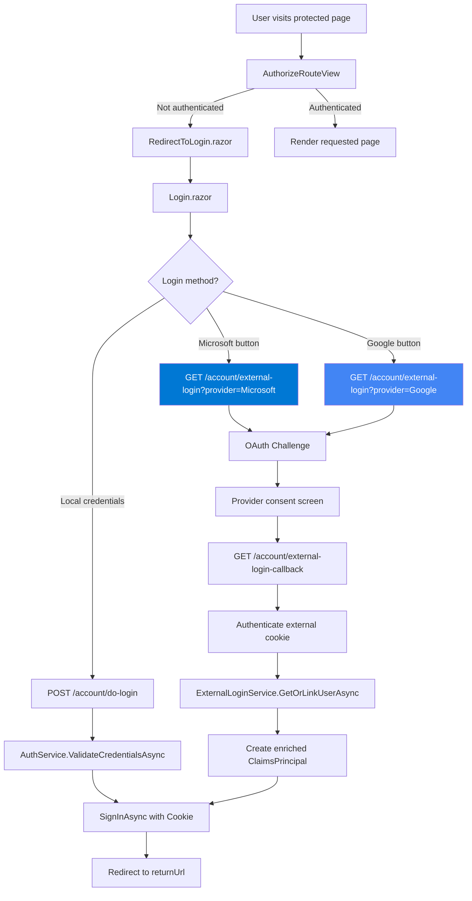
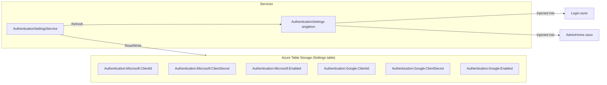
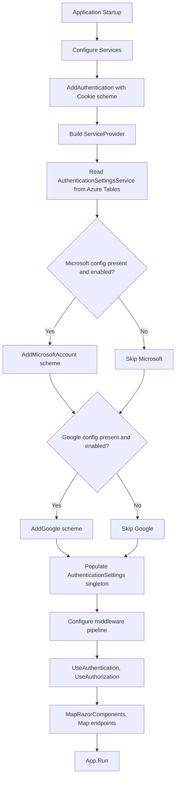
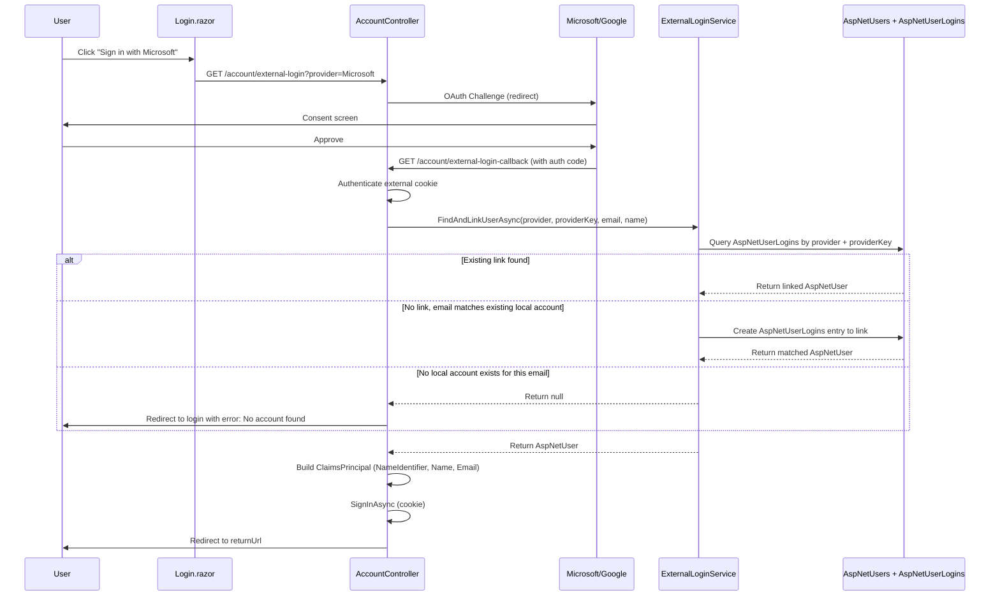
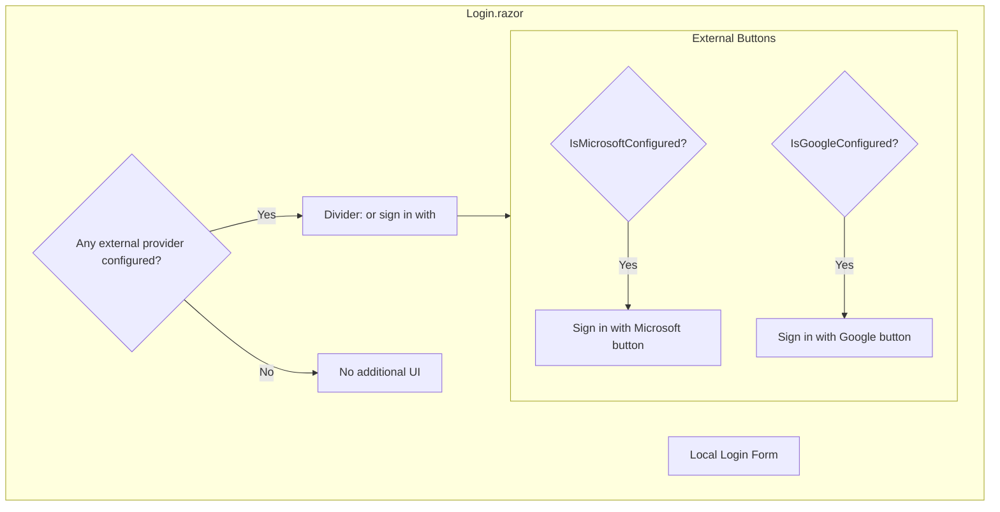
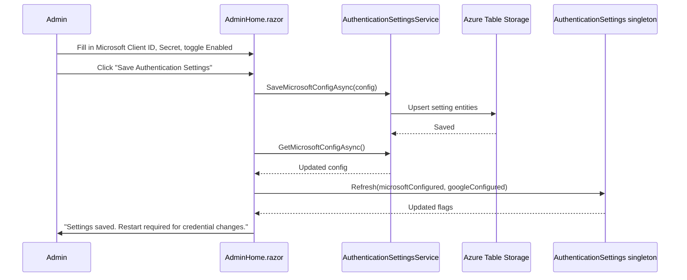
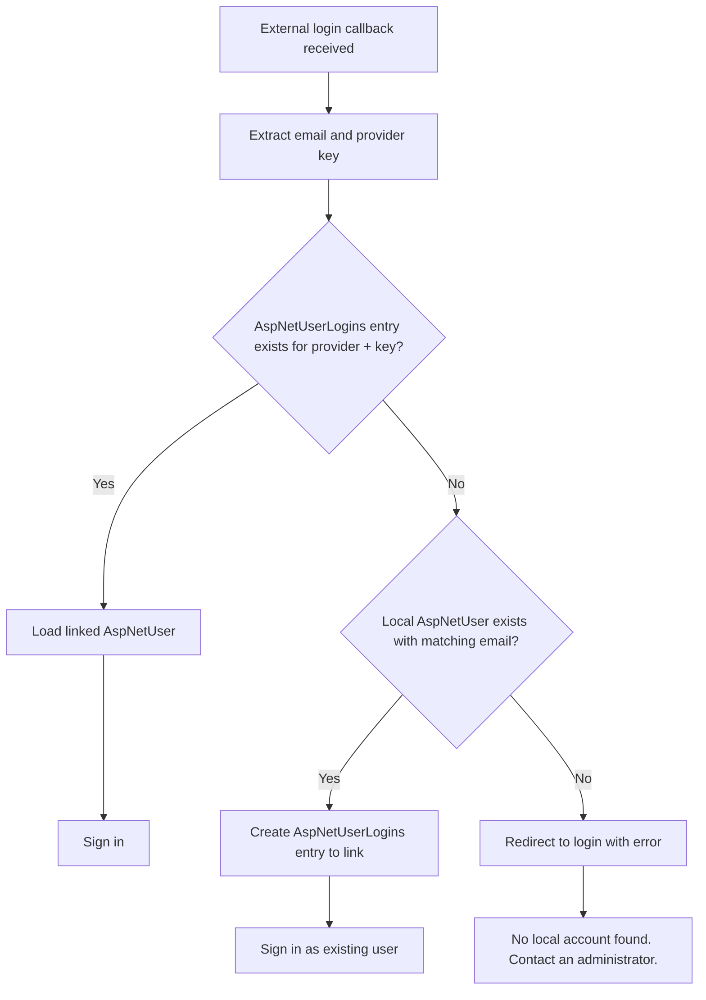
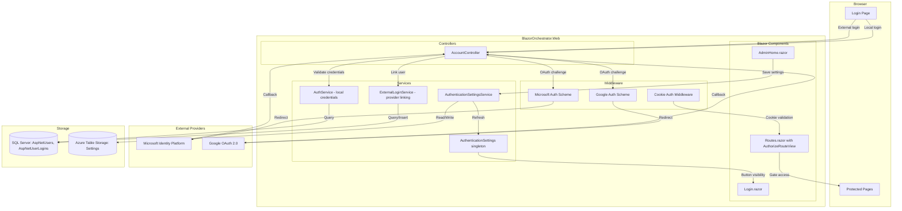

# External Authentication Providers Plan

This document describes the implementation plan for adding optional Microsoft and Google external authentication to BlazorOrchestrator.Web, with an administration screen for configuring provider credentials at runtime.

---

## Table of Contents

1. [Overview](#1-overview)
2. [Current Authentication Architecture](#2-current-authentication-architecture)
3. [Target Architecture](#3-target-architecture)
4. [Reference Implementations](#4-reference-implementations)
5. [Implementation Plan](#5-implementation-plan)
   - [Phase 1: Settings Storage](#phase-1-settings-storage)
   - [Phase 2: Auth Middleware Configuration](#phase-2-auth-middleware-configuration)
   - [Phase 3: Login Callback Endpoints](#phase-3-login-callback-endpoints)
   - [Phase 4: Login Page Updates](#phase-4-login-page-updates)
   - [Phase 5: Administration Screen](#phase-5-administration-screen)
   - [Phase 6: User Account Linking](#phase-6-user-account-linking)
6. [Database Changes](#6-database-changes)
7. [Security Considerations](#7-security-considerations)
8. [Testing Strategy](#8-testing-strategy)
9. [Configuration Reference](#9-configuration-reference)

---

## 1. Overview

BlazorOrchestrator.Web currently uses cookie-based authentication with local username/password credentials stored in the `AspNetUsers` table. This plan adds **optional** Microsoft and Google OAuth 2.0 / OpenID Connect external login providers that administrators can enable and configure through an admin UI without modifying code or configuration files.

### Goals

- Users can optionally sign in with Microsoft or Google accounts
- Local username/password login remains fully functional
- Administrators can enable, disable, and configure providers via the admin screen
- Provider credentials are stored securely in Azure Table Storage (consistent with existing settings pattern)
- External login users are linked to `AspNetUsers` records
- No app restart required to show/hide provider buttons on the login page

### Non-Goals

- Replacing local authentication entirely
- Self-service user registration via external providers (users must have a local account created by an administrator first)
- Auto-provisioning of user accounts from external logins
- Additional providers beyond Microsoft and Google in this phase

### Prerequisite: Local Account Required

All users who wish to sign in with an external provider **must already have a local account** in the `AspNetUsers` table. External authentication is treated as an alternative sign-in method for existing users, not as a registration mechanism. When a user signs in with Microsoft or Google, the system matches the external identity to a local account by email address. If no matching local account exists, the user is redirected to the login page with an error message instructing them to contact an administrator.

---

## 2. Current Authentication Architecture



### Current Components

| Component | Role |
|---|---|
| `Program.cs` | Registers cookie authentication scheme with 30-day expiry |
| `AccountController.cs` | Handles `POST /account/do-login` and `GET/POST /account/logout` |
| `AuthService.cs` | Validates credentials against `AspNetUsers` table using `PasswordHasher` |
| `Login.razor` | HTML form that POSTs username/password to the controller |
| `Routes.razor` | Uses `AuthorizeRouteView` to gate all pages |
| `RedirectToLogin.razor` | Captures current URL and forces navigation to login |

### Current Limitations

- Only local credentials are supported
- No external identity provider integration
- No admin-configurable authentication settings

---

## 3. Target Architecture



### New Components

| Component | Role |
|---|---|
| `AuthenticationSettingsService.cs` | Reads/writes provider credentials from Azure Table Storage |
| `AuthenticationSettings.cs` | Singleton holding `IsMicrosoftConfigured` / `IsGoogleConfigured` flags |
| `ExternalLoginService.cs` | Handles user lookup/creation/linking for external logins |
| Admin tab in `AdminHome.razor` | UI for configuring provider Client ID and Client Secret |
| Updated `Login.razor` | Shows external provider buttons when configured |
| Updated `AccountController.cs` | New endpoints for external login challenge and callback |
| Updated `Program.cs` | Conditional registration of Microsoft and Google auth schemes |

---

## 4. Reference Implementations

This plan draws from two proven implementations:

### AIExchange.BlazorApp (Conditional Provider Registration)

- Providers registered conditionally at startup based on config presence
- `AuthenticationSettings` singleton exposes `IsMicrosoftConfigured` / `IsGoogleConfigured`
- Minimal API endpoints handle challenge and callback
- `GetOrCreateUserAsync` on callback creates or links user records
- Login page conditionally renders provider buttons based on `AuthenticationSettings`
- Activity logging to Azure Table Storage on every auth event

### ADefHelpDesk (Admin-Configurable Settings)

- Auth credentials stored in a database key-value settings table
- Admin page (`ApplicationSettings.razor`) exposes text fields for Client ID and Client Secret
- `GeneralSettings` class reads settings at startup for middleware configuration
- Login page dynamically shows/hides buttons by checking settings at render time
- Providers always registered in middleware (with dummy values when unconfigured)

### Chosen Approach for BlazorOrchestrator

We combine both patterns, adapted to the existing architecture:

| Concern | Approach | Source |
|---|---|---|
| Settings storage | Azure Table Storage via `SettingsService` | Existing pattern in BlazorOrchestrator |
| Provider registration | Conditional at startup; re-read on admin save | AIExchange pattern |
| Login/callback endpoints | Minimal API endpoints on `AccountController` | AIExchange pattern |
| Admin UI | New tab on existing `AdminHome.razor` | ADefHelpDesk pattern |
| Button visibility | `AuthenticationSettings` singleton checked at render | AIExchange pattern |
| User linking | `AspNetUserLogins` table + `ExternalLoginService` | Both patterns |

---

## 5. Implementation Plan

### Phase 1: Settings Storage

**Objective:** Store and retrieve external auth provider credentials in Azure Table Storage using the existing `SettingsService` pattern.

#### 1.1 Define Setting Keys

Add constants for the authentication setting keys:

```csharp
// In a new file: Constants/AuthSettingKeys.cs
public static class AuthSettingKeys
{
    public const string MicrosoftClientId = "Authentication:Microsoft:ClientId";
    public const string MicrosoftClientSecret = "Authentication:Microsoft:ClientSecret";
    public const string MicrosoftEnabled = "Authentication:Microsoft:Enabled";

    public const string GoogleClientId = "Authentication:Google:ClientId";
    public const string GoogleClientSecret = "Authentication:Google:ClientSecret";
    public const string GoogleEnabled = "Authentication:Google:Enabled";
}
```

#### 1.2 Create AuthenticationSettingsService

This service wraps `SettingsService` with typed methods specific to auth configuration:

```csharp
// In: Services/AuthenticationSettingsService.cs
public class AuthenticationSettingsService
{
    private readonly SettingsService _settingsService;

    public AuthenticationSettingsService(SettingsService settingsService)
    {
        _settingsService = settingsService;
    }

    public async Task<AuthProviderConfig> GetMicrosoftConfigAsync();
    public async Task<AuthProviderConfig> GetGoogleConfigAsync();
    public async Task SaveMicrosoftConfigAsync(AuthProviderConfig config);
    public async Task SaveGoogleConfigAsync(AuthProviderConfig config);
}
```

#### 1.3 Define AuthProviderConfig Model

```csharp
public class AuthProviderConfig
{
    public bool Enabled { get; set; }
    public string ClientId { get; set; } = string.Empty;
    public string ClientSecret { get; set; } = string.Empty;

    public bool IsFullyConfigured =>
        Enabled
        && !string.IsNullOrWhiteSpace(ClientId)
        && !string.IsNullOrWhiteSpace(ClientSecret);
}
```

#### 1.4 Create AuthenticationSettings Singleton

A singleton service injected into Blazor components to determine which buttons to show. Updated at startup and whenever admin saves settings.

```csharp
public class AuthenticationSettings
{
    public bool IsMicrosoftConfigured { get; set; }
    public bool IsGoogleConfigured { get; set; }

    public void Refresh(bool microsoftConfigured, bool googleConfigured)
    {
        IsMicrosoftConfigured = microsoftConfigured;
        IsGoogleConfigured = googleConfigured;
    }
}
```

Registered as a singleton in `Program.cs`:

```csharp
builder.Services.AddSingleton<AuthenticationSettings>();
```



---

### Phase 2: Auth Middleware Configuration

**Objective:** Register Microsoft and Google authentication schemes in `Program.cs`, conditionally based on stored settings.

#### 2.1 Add NuGet Packages

Add to `BlazorOrchestrator.Web.csproj`:

```xml
<PackageReference Include="Microsoft.AspNetCore.Authentication.Google" Version="10.0.0" />
<PackageReference Include="Microsoft.AspNetCore.Authentication.MicrosoftAccount" Version="10.0.0" />
```

> **Note:** Match the version to the project's target framework (net10.0). Use the latest stable release.

#### 2.2 Update Program.cs Authentication Configuration

Read settings from Azure Table Storage at startup and conditionally add external schemes:

```csharp
// After builder.Services are configured but before builder.Build()

var authBuilder = builder.Services.AddAuthentication(options =>
{
    options.DefaultScheme = CookieAuthenticationDefaults.AuthenticationScheme;
    options.DefaultChallengeScheme = CookieAuthenticationDefaults.AuthenticationScheme;
})
.AddCookie(options =>
{
    options.LoginPath = "/account/login";
    options.LogoutPath = "/account/logout";
    options.ExpireTimeSpan = TimeSpan.FromDays(30);
    options.SlidingExpiration = true;
    options.Cookie.HttpOnly = true;
});

// Read auth settings from Azure Table Storage
var authSettings = app.Services.GetRequiredService<AuthenticationSettings>();
var authSettingsService = app.Services.GetRequiredService<AuthenticationSettingsService>();

var microsoftConfig = await authSettingsService.GetMicrosoftConfigAsync();
var googleConfig = await authSettingsService.GetGoogleConfigAsync();

if (microsoftConfig.IsFullyConfigured)
{
    authBuilder.AddMicrosoftAccount("Microsoft", options =>
    {
        options.ClientId = microsoftConfig.ClientId;
        options.ClientSecret = microsoftConfig.ClientSecret;
        options.AuthorizationEndpoint =
            "https://login.microsoftonline.com/common/oauth2/v2.0/authorize?prompt=select_account";
        options.SaveTokens = true;
    });
    authSettings.IsMicrosoftConfigured = true;
}

if (googleConfig.IsFullyConfigured)
{
    authBuilder.AddGoogle("Google", options =>
    {
        options.ClientId = googleConfig.ClientId;
        options.ClientSecret = googleConfig.ClientSecret;
        options.SaveTokens = true;
    });
    authSettings.IsGoogleConfigured = true;
}
```

#### 2.3 Startup Sequence



> **Important:** Because authentication schemes are registered at startup, changing provider credentials via the admin screen requires an application restart for the middleware to pick up new values. The admin UI should display a notice about this. However, toggling the **Enabled** flag and button visibility can be reflected immediately via the `AuthenticationSettings` singleton for the login page buttons.

---

### Phase 3: Login Callback Endpoints

**Objective:** Add controller endpoints to initiate external login challenges and handle OAuth callbacks.

#### 3.1 Create ExternalLoginService

This service handles the core logic of finding or creating a user from an external login:

```csharp
// In: Services/ExternalLoginService.cs
public class ExternalLoginService
{
    private readonly ApplicationDbContext _dbContext;

    public ExternalLoginService(ApplicationDbContext dbContext)
    {
        _dbContext = dbContext;
    }

    /// <summary>
    /// Given an external login provider name and the authenticated claims,
    /// find an existing local AspNetUser and link the external identity.
    /// Returns null if no local account exists — users are never auto-created.
    /// </summary>
    public async Task<AspNetUser?> FindAndLinkUserAsync(
        string provider,
        string providerKey,
        string email,
        string displayName)
    {
        // 1. Check AspNetUserLogins for existing link
        // 2. If found, return the linked AspNetUser
        // 3. If not found, check AspNetUsers by NormalizedEmail
        // 4. If email match, create AspNetUserLogins entry to link
        // 5. If no match, return null (admin must pre-create the account)
    }
}
```

#### 3.2 Add Endpoints to AccountController

```csharp
// GET /account/external-login?provider=Microsoft&returnUrl=/
[AllowAnonymous]
[HttpGet("external-login")]
public IActionResult ExternalLogin(string provider, string? returnUrl = "/")
{
    var properties = new AuthenticationProperties
    {
        RedirectUri = Url.Action("ExternalLoginCallback", new { returnUrl }),
        Items = { { "provider", provider } }
    };
    return Challenge(properties, provider);
}

// GET /account/external-login-callback?returnUrl=/
[AllowAnonymous]
[HttpGet("external-login-callback")]
public async Task<IActionResult> ExternalLoginCallback(string? returnUrl = "/")
{
    // 1. Authenticate the external cookie
    // 2. Extract claims (email, name, nameidentifier)
    // 3. Call ExternalLoginService.FindAndLinkUserAsync()
    // 4. If null, redirect to login with error: "No local account found for this email.
    //    Please contact an administrator to create your account."
    // 5. Build enriched ClaimsPrincipal
    // 6. SignInAsync with cookie scheme
    // 7. Redirect to returnUrl (validated as local)
}
```

#### 3.3 External Login Flow



---

### Phase 4: Login Page Updates

**Objective:** Update `Login.razor` to conditionally display external provider buttons alongside the existing local login form.

#### 4.1 Updated Login.razor Layout

The login page will have two sections:

1. **Local credentials form** (existing, unchanged)
2. **External provider buttons** (new, conditional)

```
+-------------------------------------------+
|          Blazor Data Orchestrator          |
|                                           |
|  Username: [___________________________]  |
|  Password: [___________________________]  |
|           [ Sign In ]                     |
|                                           |
|  ---- or sign in with ----               |
|                                           |
|  [  Sign in with Microsoft  ]            |
|  [  Sign in with Google     ]            |
|                                           |
+-------------------------------------------+
```

#### 4.2 Key Implementation Details

- Inject `AuthenticationSettings` to check `IsMicrosoftConfigured` / `IsGoogleConfigured`
- External login buttons are anchor tags (`<a>`) with `data-enhance="false"` to bypass Blazor enhanced navigation (required for OAuth redirect flow)
- The buttons link to `/account/external-login?provider=Microsoft&returnUrl=...`
- The divider ("or sign in with") only appears if at least one provider is configured
- When no providers are configured, the login page looks exactly as it does today

#### 4.3 Login Page Component Hierarchy



---

### Phase 5: Administration Screen

**Objective:** Add a new tab to `AdminHome.razor` where administrators can configure external authentication providers.

#### 5.1 New Tab: "Authentication Settings"

Add a fifth tab to the existing `RadzenTabs` in `AdminHome.razor`:

| Field | Type | Description |
|---|---|---|
| **Microsoft Authentication** | Section header | |
| Enabled | `RadzenSwitch` | Toggle Microsoft login on/off |
| Client ID | `RadzenTextBox` | Azure App Registration Application (client) ID |
| Client Secret | `RadzenTextBox` (masked) | Azure App Registration client secret |
| **Google Authentication** | Section header | |
| Enabled | `RadzenSwitch` | Toggle Google login on/off |
| Client ID | `RadzenTextBox` | Google OAuth 2.0 Client ID |
| Client Secret | `RadzenTextBox` (masked) | Google OAuth 2.0 Client Secret |
| | `RadzenButton` | Save Authentication Settings |
| | Notice | "Changes to Client ID or Client Secret require an application restart to take effect." |

#### 5.2 Admin Screen Wireframe

```
+-----------------------------------------------------------------------+
| Admin                                                                  |
|                                                                        |
| [ Manage Job Groups | Job Queues | Timezone | AI Settings | Auth ]    |
|                                                                        |
|  Authentication Settings                                               |
|  -------------------------------------------------------------------- |
|                                                                        |
|  Microsoft Authentication                                              |
|  +--------------------------------------------------------------+     |
|  | Enabled:       [ON/OFF toggle]                                |     |
|  | Client ID:     [_________________________________________]    |     |
|  | Client Secret: [*****************************************]    |     |
|  +--------------------------------------------------------------+     |
|  (i) Register at https://portal.azure.com > App registrations         |
|  (i) Set redirect URI to: https://yoursite/signin-microsoft            |
|                                                                        |
|  Google Authentication                                                 |
|  +--------------------------------------------------------------+     |
|  | Enabled:       [ON/OFF toggle]                                |     |
|  | Client ID:     [_________________________________________]    |     |
|  | Client Secret: [*****************************************]    |     |
|  +--------------------------------------------------------------+     |
|  (i) Configure at https://console.cloud.google.com/apis/credentials   |
|  (i) Set redirect URI to: https://yoursite/signin-google               |
|                                                                        |
|  [ Save Authentication Settings ]                                      |
|                                                                        |
|  (!) Changes to Client ID or Secret require an application restart.   |
+-----------------------------------------------------------------------+
```

#### 5.3 Admin Save Flow



#### 5.4 Immediate vs Restart-Required Changes

| Change | Effect | Restart Required? |
|---|---|---|
| Toggle Enabled on/off | Button appears/disappears on login page | No |
| Change Client ID | New OAuth app used for authentication | Yes |
| Change Client Secret | New OAuth credential | Yes |

The `AuthenticationSettings` singleton is updated immediately when the admin saves, so the Enabled toggle takes effect for the login page buttons without a restart. However, the actual OAuth middleware only reads credentials at startup, so credential changes require a restart.

---

### Phase 6: User Account Linking

**Objective:** Handle the relationship between external identities and local `AspNetUsers` records.

#### 6.1 Linking Strategy

External authentication is only available to users who already have a local account in the `AspNetUsers` table. When an external login callback arrives, the system follows this resolution order:



> **Important:** Users are never auto-created from external logins. An administrator must first create the user account (with a matching email address) through the existing user management process. The external login only serves as an alternative authentication method for that pre-existing account.

#### 6.2 AspNetUserLogins Table

The existing database schema already includes the `AspNetUserLogins` table (created in `01.00.00.sql`):

```sql
CREATE TABLE [dbo].[AspNetUserLogins] (
    [LoginProvider]       NVARCHAR(128) NOT NULL,
    [ProviderKey]         NVARCHAR(128) NOT NULL,
    [ProviderDisplayName] NVARCHAR(MAX) NULL,
    [UserId]              NVARCHAR(450) NOT NULL,
    CONSTRAINT [PK_AspNetUserLogins] PRIMARY KEY ([LoginProvider], [ProviderKey]),
    CONSTRAINT [FK_AspNetUserLogins_AspNetUsers_UserId] FOREIGN KEY ([UserId])
        REFERENCES [AspNetUsers]([Id]) ON DELETE CASCADE
);
```

This table is already present in the `ApplicationDbContext` as the `AspNetUserLogins` DbSet.

#### 6.3 Account Requirement

External logins **never** create new user accounts. The `ExternalLoginService.FindAndLinkUserAsync` method returns `null` when no local account matches the external email, and the callback endpoint redirects the user to the login page with a clear error message.

This design ensures that:
- Administrators retain full control over who can access the system
- External authentication is purely a convenience for existing users
- No unexpected accounts are created from OAuth sign-ins
- The existing user provisioning workflow (install wizard, admin tools, or direct SQL) remains the single source of truth for user management

---

## 6. Database Changes

### No Schema Changes Required

The existing database schema already supports external logins via the `AspNetUserLogins` table. All new configuration is stored in Azure Table Storage via the existing `SettingsService` pattern.

### Azure Table Storage Entries

New entries in the `Settings` table (partition key `AppSettings`):

| RowKey | Value | Description |
|---|---|---|
| `Authentication:Microsoft:ClientId` | (App registration client ID) | Microsoft OAuth client ID |
| `Authentication:Microsoft:ClientSecret` | (App registration client secret) | Microsoft OAuth client secret |
| `Authentication:Microsoft:Enabled` | `true` / `false` | Whether Microsoft login is enabled |
| `Authentication:Google:ClientId` | (Google OAuth client ID) | Google OAuth client ID |
| `Authentication:Google:ClientSecret` | (Google OAuth client secret) | Google OAuth client secret |
| `Authentication:Google:Enabled` | `true` / `false` | Whether Google login is enabled |

---

## 7. Security Considerations

### 7.1 Client Secret Storage

- Client secrets are stored in Azure Table Storage, which supports encryption at rest
- Secrets are never logged or included in error messages
- The admin UI masks the Client Secret field (input type `password`)
- Consider using Azure Key Vault references for production deployments

### 7.2 OAuth Redirect Validation

- The `returnUrl` parameter in the external login callback must be validated as a local URL to prevent open redirect attacks (same pattern as existing `AccountController.Login`)
- Use `Url.IsLocalUrl(returnUrl)` before redirecting

### 7.3 CSRF Protection

- External login initiation uses `GET` requests with `AuthenticationProperties` (standard ASP.NET Core pattern)
- The callback validates the correlation cookie set during the challenge
- The existing local login form continues to use `data-enhance="false"` for proper antiforgery handling

### 7.4 Email Verification and Account Matching

- When linking an external login to an existing user by email match, the email from the OAuth provider is considered verified (Google and Microsoft verify emails)
- The email match uses the `NormalizedEmail` column in `AspNetUsers` for case-insensitive comparison
- If no local account exists with a matching email, the external login is rejected — no account is auto-created
- Administrators should ensure that user accounts are created with the same email address the user will use with their Microsoft or Google account

### 7.5 Provider Scope Limitations

- Microsoft: Request only `openid`, `profile`, `email` scopes (minimum required)
- Google: Default scopes include `openid`, `profile`, `email` (sufficient)
- Do not request additional scopes unless required by future features

### 7.6 Admin Access Control

- The Authentication Settings tab is only accessible to authenticated administrators
- The existing admin authorization pattern in `AdminHome.razor` applies to the new tab
- Settings changes are auditable via Azure Table Storage timestamps

---

## 8. Testing Strategy

### 8.1 Unit Tests

| Test | Description |
|---|---|
| `AuthenticationSettingsService_GetMicrosoftConfig_ReturnsDefaults_WhenNoSettings` | No settings stored returns disabled config |
| `AuthenticationSettingsService_SaveAndRetrieve_RoundTrips` | Save config, read it back, values match |
| `ExternalLoginService_ExistingLink_ReturnsUser` | User with existing `AspNetUserLogins` entry is found |
| `ExternalLoginService_EmailMatch_CreatesLink` | User with matching email gets a new login entry |
| `ExternalLoginService_NoLocalAccount_ReturnsNull` | No local account with matching email returns null |
| `ExternalLoginService_CaseInsensitiveEmailMatch` | Email matching is case-insensitive via NormalizedEmail |
| `AuthProviderConfig_IsFullyConfigured_Logic` | Enabled + non-empty ID + non-empty secret = true |

### 8.2 Integration Tests

| Test | Description |
|---|---|
| External login challenge returns redirect to provider | `GET /account/external-login?provider=Microsoft` returns 302 |
| Callback with valid external cookie signs in user | Mock external auth result, verify cookie issued |
| Login page shows buttons when configured | Render `Login.razor` with configured settings, assert buttons present |
| Login page hides buttons when not configured | Render `Login.razor` with empty settings, assert no buttons |
| Admin save persists to Azure Tables | Save settings via admin, read from Table Storage, verify |

### 8.3 Manual Testing Checklist

- [ ] Local login continues to work unchanged
- [ ] Microsoft login: full flow from button click to authenticated session
- [ ] Google login: full flow from button click to authenticated session
- [ ] Login page with no providers configured shows no external buttons
- [ ] Login page with only Microsoft configured shows only Microsoft button
- [ ] Login page with only Google configured shows only Google button
- [ ] Login page with both configured shows both buttons
- [ ] Admin can save and update provider settings
- [ ] Admin sees restart notice for credential changes
- [ ] Existing user with matching email gets linked on first external login
- [ ] User with no local account sees clear error message on external login attempt
- [ ] Error message instructs user to contact an administrator
- [ ] Logout works for externally authenticated users
- [ ] `returnUrl` is preserved through external login flow

---

## 9. Configuration Reference

### Microsoft App Registration Setup

1. Go to [Azure Portal > App registrations](https://portal.azure.com/#view/Microsoft_AAD_RegisteredApps/ApplicationsListBlade)
2. Click **New registration**
3. Name: `BlazorOrchestrator`
4. Supported account types: **Accounts in any organizational directory and personal Microsoft accounts**
5. Redirect URI: **Web** platform, URI: `https://{your-domain}/signin-microsoft`
6. After creation, note the **Application (client) ID**
7. Go to **Certificates & secrets** > **New client secret**, note the secret value

### Google OAuth Setup

1. Go to [Google Cloud Console > APIs & Services > Credentials](https://console.cloud.google.com/apis/credentials)
2. Click **Create Credentials** > **OAuth client ID**
3. Application type: **Web application**
4. Name: `BlazorOrchestrator`
5. Authorized redirect URIs: `https://{your-domain}/signin-google`
6. Note the **Client ID** and **Client secret**

### Azure Container Apps (Production)

When deployed to Azure Container Apps, the redirect URIs must use the production domain:

- Microsoft: `https://{container-app-url}/signin-microsoft`
- Google: `https://{container-app-url}/signin-google`

Ensure the Aspire service defaults configure HTTPS forwarding correctly so the OAuth redirect URIs match.

---

## System Architecture Overview



---

## File Change Summary

| File | Action | Description |
|---|---|---|
| `BlazorOrchestrator.Web.csproj` | Modify | Add Google and MicrosoftAccount NuGet packages |
| `Program.cs` | Modify | Add conditional external auth scheme registration |
| `Constants/AuthSettingKeys.cs` | Create | Setting key constants |
| `Models/AuthProviderConfig.cs` | Create | Provider configuration model |
| `Services/AuthenticationSettings.cs` | Create | Singleton for provider availability flags |
| `Services/AuthenticationSettingsService.cs` | Create | Read/write auth settings from Azure Tables |
| `Services/ExternalLoginService.cs` | Create | User lookup and provider linking (no account creation) |
| `Controllers/AccountController.cs` | Modify | Add external login and callback endpoints |
| `Components/Pages/Account/Login.razor` | Modify | Add conditional external provider buttons |
| `Components/Pages/Admin/AdminHome.razor` | Modify | Add Authentication Settings tab |
