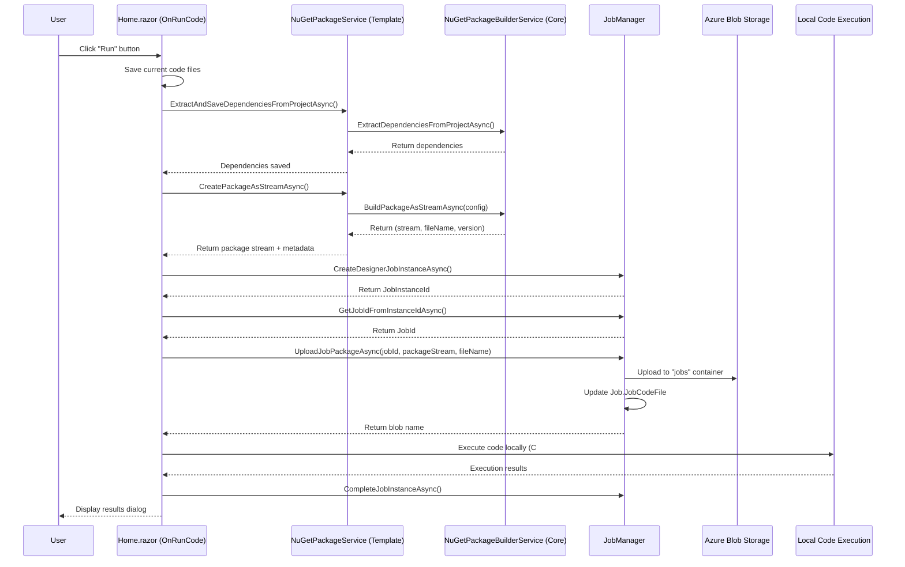

# Implementation Plan: Job Creator "Run Code" Feature - NuGet Upload & Job Association

## Status: ✅ Complete

---

## Overview

This plan implements functionality to enhance the `OnRunCode` method in `Home.razor` (JobCreatorTemplate) to:
1. **Create a NuGet package** from the current code files
2. **Upload the package to Azure Blob Storage**
3. **Associate the uploaded package with the Job record** that is created
4. **Continue to execute the code locally** for debugging in Visual Studio

The goal is to ensure that every time code is run from the Job Creator, a deployable NuGet package is created, stored, and linked to the job - enabling the same job to be executed later by the Agent service.

---

## Architecture Overview



---

## Phase 1: Update NuGetPackageService

### 1.1 Add Method to Return Package as Stream
- [x] **File:** `src/BlazorDataOrchestrator.JobCreatorTemplate/Services/NuGetPackageService.cs`

**Implementation:** The `NuGetPackageService` now wraps the Core `NuGetPackageBuilderService` and provides the `CreatePackageAsStreamAsync()` method:

```csharp
/// <summary>
/// Creates a NuGet package and returns it as a MemoryStream along with metadata.
/// </summary>
/// <param name="packageId">The package identifier.</param>
/// <param name="version">The package version (auto-generated if not provided).</param>
/// <param name="description">The package description.</param>
/// <param name="authors">The package authors.</param>
/// <returns>Tuple containing the package stream, full filename, and version.</returns>
public async Task<(MemoryStream PackageStream, string FileName, string Version)> CreatePackageAsStreamAsync(
    string packageId = "BlazorDataOrchestrator.Job",
    string? version = null,
    string? description = null,
    string? authors = null)
{
    var config = CreateBuildConfiguration(packageId, version, description, authors);
    
    var result = await _builderService.BuildPackageAsStreamAsync(config);

    if (result == null)
    {
        _logger.LogError("Failed to create package as stream");
        throw new InvalidOperationException("Failed to create package as stream");
    }

    _logger.LogInformation("Created package as stream: {FileName} (version {Version})", result.Value.FileName, result.Value.Version);

    return result.Value;
}

/// <summary>
/// Creates the build configuration for the Core service.
/// </summary>
private NuGetPackageBuilderService.PackageBuildConfiguration CreateBuildConfiguration(
    string packageId,
    string? version,
    string? description,
    string? authors)
{
    var baseCodeFolder = Path.Combine(_environment.ContentRootPath, "Code");
    var csharpFolder = Path.Combine(baseCodeFolder, "CodeCSharp");

    return new NuGetPackageBuilderService.PackageBuildConfiguration
    {
        CodeRootPath = baseCodeFolder,
        PackageId = packageId,
        Version = version,
        Description = description,
        Authors = authors,
        AppSettingsPath = Path.Combine(_environment.ContentRootPath, "appsettings.json"),
        AppSettingsProductionPath = Path.Combine(_environment.ContentRootPath, "appsettingsProduction.json"),
        DependenciesFilePath = Path.Combine(csharpFolder, "dependencies.json")
    };
}
```

---

## Phase 2: Register JobManager in JobCreatorTemplate

### 2.1 Add JobManager Service Registration
- [x] **File:** `src/BlazorDataOrchestrator.JobCreatorTemplate/Program.cs`

**Changes:**
- Add `Azure.Storage.Blobs` package reference if not present
- Register `BlobServiceClient` for package upload
- Register `JobManager` as a scoped service

```csharp
// Add after existing service registrations
builder.Services.AddScoped<JobManager>(sp =>
{
    var config = sp.GetRequiredService<IConfiguration>();
    var sqlConnectionString = config.GetConnectionString("blazororchestratordb") ?? "";
    var blobConnectionString = config.GetConnectionString("blobs") ?? "";
    var queueConnectionString = config.GetConnectionString("queues") ?? "";
    var tableConnectionString = config.GetConnectionString("tables") ?? "";
    return new JobManager(sqlConnectionString, blobConnectionString, queueConnectionString, tableConnectionString);
});
```

---

## Phase 3: Update Home.razor OnRunCode Method

### 3.1 Inject Required Services
- [x] **File:** `src/BlazorDataOrchestrator.JobCreatorTemplate/Components/Pages/Home.razor`

**Added to top of file:**
```razor
@inject JobManager InjectedJobManager
```

### 3.2 Modify OnRunCode Method
- [x] **File:** `src/BlazorDataOrchestrator.JobCreatorTemplate/Components/Pages/Home.razor`

**The updated flow (all implemented inline):**
1. Save current code files
2. Create NuGet package as stream
3. Load and patch AppSettings with connection strings from Aspire environment
4. Create Job Instance (get JobId from existing or create new)
5. Upload package to Azure Blob Storage and associate with Job
6. Execute code locally for debugging (C# or Python)
7. Complete job instance and display results

**Actual Implementation:**
```csharp
private async Task OnRunCode(RadzenSplitButtonItem? item)
{
    if (_disposed) return;

    // Save before running
    if (!await OnSaveFile())
    {
        logOutput += $"[{DateTime.Now:HH:mm:ss}] Save failed. Aborting run.\n";
        return;
    }

    if (_disposed) return;

    var environment = item?.Value?.ToString() ?? "Development";
    logOutput = $"[{DateTime.Now:HH:mm:ss}] Running code in {environment} mode...\n";
    
    isExecuting = true;
    StateHasChanged();
    await Task.Delay(1); // Allow UI to update

    if (_disposed) return;

    if (codeEditor != null)
    {
        var currentCode = await codeEditor.GetCodeAsync();
        logOutput += $"[{DateTime.Now:HH:mm:ss}] Code retrieved ({currentCode?.Length ?? 0} characters)\n";

        // 1. Create NuGet package
        MemoryStream? packageStream = null;
        string? packageFileName = null;
        try
        {
            logOutput += $"[{DateTime.Now:HH:mm:ss}] Creating NuGet package...\n";
            StateHasChanged();
            
            // Extract dependencies first
            await PackageService.ExtractAndSaveDependenciesFromProjectAsync();
            
            // Create package as stream
            var packageResult = await PackageService.CreatePackageAsStreamAsync(
                packageId: "BlazorDataOrchestrator.Job",
                description: $"Job package from Job Creator - {environment}");
            packageStream = packageResult.PackageStream;
            packageFileName = packageResult.FileName;
            
            logOutput += $"[{DateTime.Now:HH:mm:ss}] Package created: {packageFileName}\n";
            StateHasChanged();
        }
        catch (Exception ex)
        {
            logOutput += $"[{DateTime.Now:HH:mm:ss}] Warning: Failed to create package: {ex.Message}\n";
            // Continue with execution even if package creation fails
        }

        // 2. Get AppSettings and patch connection strings
        string appSettingsFileName = environment == "Production" ? "appsettingsProduction.json" : "appsettings.json";
        string appSettingsContent = "{}";
        string appSettingsFile = Path.Combine(Environment.ContentRootPath, appSettingsFileName);
        
        if (File.Exists(appSettingsFile))
        {
            appSettingsContent = await File.ReadAllTextAsync(appSettingsFile);
            logOutput += $"[{DateTime.Now:HH:mm:ss}] Loaded {appSettingsFileName}\n";
        }

        // Patch connection strings from Configuration (Aspire environment variables)
        try
        {
            var jsonNode = System.Text.Json.Nodes.JsonNode.Parse(appSettingsContent) ?? new System.Text.Json.Nodes.JsonObject();
            
            var connString = Configuration.GetConnectionString("blazororchestratordb");
            if (!string.IsNullOrEmpty(connString))
            {
                if (jsonNode["ConnectionStrings"] == null)
                    jsonNode["ConnectionStrings"] = new System.Text.Json.Nodes.JsonObject();
                jsonNode["ConnectionStrings"]!["blazororchestratordb"] = connString;
            }

            var tableConnString = Configuration.GetConnectionString("tables");
            if (!string.IsNullOrEmpty(tableConnString))
            {
                if (jsonNode["ConnectionStrings"] == null)
                    jsonNode["ConnectionStrings"] = new System.Text.Json.Nodes.JsonObject();
                jsonNode["ConnectionStrings"]!["tables"] = tableConnString;
            }
            
            appSettingsContent = jsonNode.ToJsonString();
            logOutput += $"[{DateTime.Now:HH:mm:ss}] Patched connection strings from environment\n";
        }
        catch (Exception ex)
        {
            logOutput += $"[{DateTime.Now:HH:mm:ss}] Warning: Failed to patch connection strings: {ex.Message}\n";
        }

        // 3. Create Job Instance
        int jobInstanceId = 0;
        var activeJobManager = jobManager ?? InjectedJobManager;
        if (activeJobManager != null)
        {
            try
            {
                string jobName = System.Reflection.Assembly.GetEntryAssembly()?.GetName().Name ?? "DesignerJob";
                jobInstanceId = await activeJobManager.CreateDesignerJobInstanceAsync(jobName);
                currentJobInstanceId = jobInstanceId;
                
                // Resolve and update currentJobId from the newly created instance
                var resolvedJobId = await activeJobManager.GetJobIdFromInstanceIdAsync(currentJobInstanceId);
                if (resolvedJobId.HasValue)
                {
                    currentJobId = resolvedJobId.Value;
                }
                
                logOutput += $"[{DateTime.Now:HH:mm:ss}] Created Job Instance ID: {jobInstanceId} for Job ID: {currentJobId}\n";
                
                // 4. Upload package and associate with Job
                if (packageStream != null && !string.IsNullOrEmpty(packageFileName) && currentJobId > 0)
                {
                    try
                    {
                        logOutput += $"[{DateTime.Now:HH:mm:ss}] Uploading package to Azure Storage...\n";
                        StateHasChanged();
                        
                        packageStream.Position = 0;
                        var blobName = await activeJobManager.UploadJobPackageAsync(currentJobId, packageStream, packageFileName);
                        
                        logOutput += $"[{DateTime.Now:HH:mm:ss}] Package uploaded as: {blobName}\n";
                        logOutput += $"[{DateTime.Now:HH:mm:ss}] Job.JobCodeFile updated for Job ID: {currentJobId}\n";
                        StateHasChanged();
                    }
                    catch (Exception ex)
                    {
                        logOutput += $"[{DateTime.Now:HH:mm:ss}] Warning: Failed to upload package: {ex.Message}\n";
                        // Continue with local execution even if upload fails
                    }
                }
                
                SaveConfiguration(); // Persist the updated IDs
            }
            catch (Exception ex)
            {
                logOutput += $"[{DateTime.Now:HH:mm:ss}] Error creating job instance: {ex.Message}\n";
                return;
            }
            finally
            {
                if (packageStream != null)
                    await packageStream.DisposeAsync();
            }
        }

        // 5. Execute Code locally (C# or Python)
        List<string> results = new List<string>();
        try
        {
            if (selectedLanguage == "csharp")
            {
                logOutput += $"[{DateTime.Now:HH:mm:ss}] Executing ExecuteJob...\n";
                results = await BlazorDataOrchestratorJob.ExecuteJob(appSettingsContent, -1, -1, currentJobInstanceId, -1, "");
            }
            else if (selectedLanguage == "python")
            {
                logOutput += $"[{DateTime.Now:HH:mm:ss}] Executing Python job...\n";
                // Python execution via subprocess...
            }

            logOutput += $"[{DateTime.Now:HH:mm:ss}] Execution complete.\n";

            if (activeJobManager != null && currentJobInstanceId > 0)
            {
                await activeJobManager.CompleteJobInstanceAsync(currentJobInstanceId, false);
            }

            // 6. Display Results
            if (results.Any())
            {
                await DialogService.OpenAsync("Execution Results", ds =>
                    @<RadzenStack Gap="10">
                        <RadzenTextArea Value="@string.Join("\n", results)" Style="width: 100%; height: 300px;" ReadOnly="true" />
                        <RadzenButton Text="Close" Click="() => ds.Close(true)" Style="width: 100px; align-self: center;" />
                    </RadzenStack>
                );
            }
        }
        catch (Exception ex)
        {
            logOutput += $"[{DateTime.Now:HH:mm:ss}] Error executing code: {ex.Message}\n";
            if (activeJobManager != null && currentJobInstanceId > 0)
            {
                await activeJobManager.CompleteJobInstanceAsync(currentJobInstanceId, true);
            }
        }
        finally
        {
            isExecuting = false;
        }
    }

    if (!_disposed) StateHasChanged();
}
```

### 3.3 Helper Methods
- [x] **Note:** Helper methods (`LoadAndPatchAppSettings`, `ExecuteCodeLocally`) were NOT extracted into separate methods. The logic is implemented inline within `OnRunCode` for simplicity and to reduce method call overhead during execution.

---

## Phase 4: Testing Checklist

### Manual Testing
- [x] Run code in Development mode
  - [x] Package is created successfully
  - [x] Package is uploaded to Azure Blob Storage
  - [x] Job.JobCodeFile is updated with blob name
  - [x] Code executes locally for debugging
  - [x] Results are displayed correctly
- [x] Run code in Production mode
  - [x] Same tests as Development mode
- [x] Verify package contents
  - [x] Download package from blob storage
  - [x] Verify it contains all code files
  - [x] Verify dependencies are correct
- [x] Verify Job record in database
  - [x] JobCodeFile contains correct blob name
  - [x] Job can be run later by Agent using the package

### Edge Cases
- [x] Run when Azure Storage is unavailable
  - [x] Should log error but still execute locally
- [x] Run multiple times in succession
  - [x] Each run should create new package with unique name
  - [x] Old package should be replaced (per existing JobManager logic)
- [x] Run with unsaved changes
  - [x] Changes should be saved before package creation

---

## Phase 5: Future Enhancements (Optional)

### 5.1 Add Package Version Tracking
- Store package version in JobInstance for traceability
- Display package version in logs UI

### 5.2 Add Package Caching
- Only create/upload new package if code has changed
- Use hash comparison to detect changes

### 5.3 Add "Create & Upload Only" Option
- Button to create and upload package without executing
- Useful for preparing jobs for scheduled execution

---

## Files Modified

| File | Changes |
|------|---------|
| `src/BlazorDataOrchestrator.Core/Services/NuGetPackageBuilderService.cs` | **NEW** - Shared NuGet package building logic (~526 lines) with `PackageBuildConfiguration`, `PackageBuildResult`, `BuildPackageAsync()`, `BuildPackageAsStreamAsync()`, and dependency management |
| `src/BlazorDataOrchestrator.Core/Models/NuGetDependency.cs` | **NEW** - Added `PackageDependency`, `DependenciesConfig`, `NuGetDependency`, `NuGetDependencyGroup`, and `NuGetResolutionResult` classes for shared use |
| `src/BlazorDataOrchestrator.JobCreatorTemplate/Services/NuGetPackageService.cs` | Refactored to be a thin wrapper around `NuGetPackageBuilderService` from Core, added `CreatePackageAsStreamAsync()` and `CreateBuildConfiguration()` |
| `src/BlazorDataOrchestrator.JobCreatorTemplate/Program.cs` | Registered `JobManager` as scoped service with connection strings from configuration |
| `src/BlazorDataOrchestrator.JobCreatorTemplate/Components/Pages/Home.razor` | Injected `InjectedJobManager`, updated `OnRunCode` to create/upload package, create job instance, and execute locally with proper error handling and job completion |

---

## Implementation Notes

### Key Implementation Details

1. **JobManager Fallback Pattern**: The `OnRunCode` method uses `var activeJobManager = jobManager ?? InjectedJobManager;` to support both manual initialization and dependency injection patterns.

2. **Graceful Degradation**: Package creation and upload failures are logged as warnings but do not prevent local code execution, ensuring developers can still debug even if Azure services are unavailable.

3. **Stream Management**: Package streams are properly disposed in a `finally` block to prevent memory leaks, even when errors occur during upload.

4. **Connection String Patching**: The implementation patches connection strings from Aspire environment variables into the appsettings JSON at runtime, supporting both `blazororchestratordb` and `tables` connection strings.

5. **Job Instance Lifecycle**: The implementation properly calls `CompleteJobInstanceAsync()` with success/failure status after code execution, ensuring accurate job tracking in the database.

6. **Package Versioning**: Package versions are auto-generated using the format `1.0.{DateTime.Now:yyyyMMddHHmmss}` to ensure uniqueness.

7. **Content Files Structure**: NuGet packages are created with the standard `contentFiles/any/any/` structure for proper content file deployment.

---

## Dependencies

This feature relies on existing infrastructure:
- **JobManager** (`BlazorDataOrchestrator.Core/JobManager.cs`) - Already has `UploadJobPackageAsync` method
- **JobStorageService** (`BlazorDataOrchestrator.Core/Services/JobStorageService.cs`) - Handles blob storage
- **NuGetPackageBuilderService** (`BlazorDataOrchestrator.Core/Services/NuGetPackageBuilderService.cs`) - **NEW** Shared package creation logic
- **NuGetPackageService** (`BlazorDataOrchestrator.JobCreatorTemplate/Services/NuGetPackageService.cs`) - Wrapper for template-specific functionality
- **Azure Blob Storage** - "jobs" container for package storage

---

## Code Refactoring Summary

The following code was moved from `JobCreatorTemplate` to `BlazorDataOrchestrator.Core` for shared use:

### Moved to Core:
1. **`PackageDependency`**, **`DependenciesConfig`**, **`NuGetDependency`**, **`NuGetDependencyGroup`**, and **`NuGetResolutionResult`** classes → `BlazorDataOrchestrator.Core.Models.NuGetDependency.cs`
2. **Package building logic** → `NuGetPackageBuilderService` in `BlazorDataOrchestrator.Core.Services`
   - `PackageBuildConfiguration` - Configuration class for package building
   - `PackageBuildResult` - Result class with success status, paths, and logs
   - `BuildPackageAsync()` - Creates NuGet package from code files
   - `BuildPackageAsStreamAsync()` - Creates package and returns as stream
   - `ExtractDependenciesFromProjectAsync()` - Extracts dependencies from .csproj
   - `SaveDependenciesAsync()` - Saves dependencies to JSON file
   - `LoadDependenciesAsync()` - Loads dependencies from JSON file
   - `CleanupPackage()` - Cleans up temporary package files
   - `DefaultDependencies` - Static list of default required dependencies:
     - `Microsoft.EntityFrameworkCore` v10.0.0
     - `Microsoft.EntityFrameworkCore.SqlServer` v10.0.0
     - `Azure.Data.Tables` v12.9.1

### JobCreatorTemplate Wrapper:
The `NuGetPackageService` in JobCreatorTemplate is now a thin wrapper that:
- Injects `IWebHostEnvironment` for environment-specific paths
- Uses `NuGetPackageBuilderService` from Core for actual package building
- Creates `PackageBuildConfiguration` with template-specific paths (Code folder, appsettings files)
- Provides `ExtractAndSaveDependenciesFromProjectAsync()` to extract from .csproj and save to `dependencies.json`

### Benefits of this refactoring:
- The Core project can now create NuGet packages independently (useful for Agent, Web, or other components)
- Shared models eliminate duplication
- JobCreatorTemplate uses the Core service via a thin wrapper for environment-specific paths
- Better separation of concerns between core logic and environment-specific configuration

---

## Summary

This feature enables a seamless workflow where:
1. Developer writes/edits code in the Job Creator
2. Clicking "Run" automatically packages the code
3. Package is uploaded and associated with the Job record
4. Code is also executed locally for immediate debugging
5. The same job can later be run by the Agent service using the uploaded package

This bridges the gap between development/debugging in the Job Creator and production execution by the Agent.
