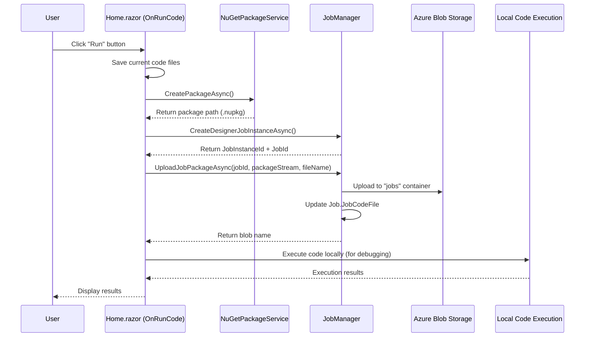

# Implementation Plan: Job Creator "Run Code" Feature - NuGet Upload & Job Association

## Status: ✅ Complete

---

## Overview

This plan implements functionality to enhance the `OnRunCode` method in `Home.razor` (JobCreatorTemplate) to:
1. **Create a NuGet package** from the current code files
2. **Upload the package to Azure Blob Storage**
3. **Associate the uploaded package with the Job record** that is created
4. **Continue to execute the code locally** for debugging in Visual Studio

The goal is to ensure that every time code is run from the Job Creator, a deployable NuGet package is created, stored, and linked to the job - enabling the same job to be executed later by the Agent service.

---

## Architecture Overview



---

## Phase 1: Update NuGetPackageService

### 1.1 Add Method to Return Package as Stream
- [x] **File:** `src/BlazorDataOrchestrator.JobCreatorTemplate/Services/NuGetPackageService.cs`

**New Method:** `CreatePackageAsStreamAsync()`

```csharp
/// <summary>
/// Creates a NuGet package and returns it as a MemoryStream along with metadata.
/// </summary>
/// <param name="packageId">The package identifier.</param>
/// <param name="version">The package version.</param>
/// <param name="description">The package description.</param>
/// <param name="authors">The package authors.</param>
/// <returns>Tuple containing the package stream, full filename, and version.</returns>
public async Task<(MemoryStream PackageStream, string FileName, string Version)> CreatePackageAsStreamAsync(
    string packageId = "BlazorDataOrchestrator.Job",
    string? version = null,
    string? description = null,
    string? authors = null)
{
    // Generate unique version if not provided
    version ??= $"1.0.{DateTime.Now:yyyyMMddHHmmss}";
    
    // Create package to temp location
    var packagePath = await CreatePackageAsync(packageId, version, description, authors);
    
    // Read into memory stream
    var memoryStream = new MemoryStream();
    await using (var fileStream = File.OpenRead(packagePath))
    {
        await fileStream.CopyToAsync(memoryStream);
    }
    memoryStream.Position = 0;
    
    // Get filename
    var fileName = Path.GetFileName(packagePath);
    
    // Cleanup temp file
    CleanupPackage(packagePath);
    
    return (memoryStream, fileName, version);
}
```

---

## Phase 2: Register JobManager in JobCreatorTemplate

### 2.1 Add JobManager Service Registration
- [x] **File:** `src/BlazorDataOrchestrator.JobCreatorTemplate/Program.cs`

**Changes:**
- Add `Azure.Storage.Blobs` package reference if not present
- Register `BlobServiceClient` for package upload
- Register `JobManager` as a scoped service

```csharp
// Add after existing service registrations
builder.Services.AddScoped<JobManager>(sp =>
{
    var config = sp.GetRequiredService<IConfiguration>();
    var sqlConnectionString = config.GetConnectionString("blazororchestratordb") ?? "";
    var blobConnectionString = config.GetConnectionString("blobs") ?? "";
    var queueConnectionString = config.GetConnectionString("queues") ?? "";
    var tableConnectionString = config.GetConnectionString("tables") ?? "";
    return new JobManager(sqlConnectionString, blobConnectionString, queueConnectionString, tableConnectionString);
});
```

---

## Phase 3: Update Home.razor OnRunCode Method

### 3.1 Inject Required Services
- [x] **File:** `src/BlazorDataOrchestrator.JobCreatorTemplate/Components/Pages/Home.razor`

**Add to top of file:**
```razor
@inject JobManager InjectedJobManager
```

### 3.2 Modify OnRunCode Method
- [x] **File:** `src/BlazorDataOrchestrator.JobCreatorTemplate/Components/Pages/Home.razor`

**Changes to `OnRunCode` method:**

The updated flow should be:
1. Save current code files
2. Create NuGet package as stream
3. Create Job Instance (get JobId from existing or create new)
4. Upload package to Azure Blob Storage and associate with Job
5. Execute code locally for debugging
6. Display results

**Updated Method Logic:**
```csharp
private async Task OnRunCode(RadzenSplitButtonItem? item)
{
    if (_disposed) return;

    // 1. Save before running
    if (!await OnSaveFile())
    {
        logOutput += $"[{DateTime.Now:HH:mm:ss}] Save failed. Aborting run.\n";
        return;
    }

    if (_disposed) return;

    var environment = item?.Value?.ToString() ?? "Development";
    logOutput = $"[{DateTime.Now:HH:mm:ss}] Running code in {environment} mode...\n";
    
    isExecuting = true;
    StateHasChanged();
    await Task.Delay(1);

    if (_disposed) return;

    try
    {
        // 2. Create NuGet package
        logOutput += $"[{DateTime.Now:HH:mm:ss}] Creating NuGet package...\n";
        StateHasChanged();
        
        // Extract dependencies first
        await PackageService.ExtractAndSaveDependenciesFromProjectAsync();
        
        // Create package as stream
        var (packageStream, packageFileName, packageVersion) = await PackageService.CreatePackageAsStreamAsync(
            packageId: "BlazorDataOrchestrator.Job",
            description: $"Job package from Job Creator - {environment}");
        
        logOutput += $"[{DateTime.Now:HH:mm:ss}] Package created: {packageFileName}\n";
        StateHasChanged();

        // 3. Get AppSettings
        string appSettingsFileName = environment == "Production" 
            ? "appsettingsProduction.json" 
            : "appsettings.json";
        string appSettingsContent = await LoadAndPatchAppSettings(appSettingsFileName);

        // 4. Create Job Instance
        if (jobManager != null)
        {
            try
            {
                string jobName = System.Reflection.Assembly.GetEntryAssembly()?.GetName().Name ?? "DesignerJob";
                currentJobInstanceId = await jobManager.CreateDesignerJobInstanceAsync(jobName);
                
                // Resolve JobId from the instance
                var resolvedJobId = await jobManager.GetJobIdFromInstanceIdAsync(currentJobInstanceId);
                if (resolvedJobId.HasValue)
                {
                    currentJobId = resolvedJobId.Value;
                }
                
                logOutput += $"[{DateTime.Now:HH:mm:ss}] Created Job Instance ID: {currentJobInstanceId} for Job ID: {currentJobId}\n";
                
                // 5. Upload package and associate with Job
                logOutput += $"[{DateTime.Now:HH:mm:ss}] Uploading package to Azure Storage...\n";
                StateHasChanged();
                
                packageStream.Position = 0;
                var blobName = await jobManager.UploadJobPackageAsync(currentJobId, packageStream, packageFileName);
                
                logOutput += $"[{DateTime.Now:HH:mm:ss}] Package uploaded as: {blobName}\n";
                logOutput += $"[{DateTime.Now:HH:mm:ss}] Job.JobCodeFile updated to: {blobName}\n";
                StateHasChanged();
                
                SaveConfiguration();
            }
            catch (Exception ex)
            {
                logOutput += $"[{DateTime.Now:HH:mm:ss}] Error during job/package setup: {ex.Message}\n";
                // Continue with local execution even if upload fails
            }
            finally
            {
                await packageStream.DisposeAsync();
            }
        }

        // 6. Execute code locally (for debugging)
        logOutput += $"[{DateTime.Now:HH:mm:ss}] Executing code locally for debugging...\n";
        StateHasChanged();
        
        List<string> results = await ExecuteCodeLocally(appSettingsContent);
        
        // ... rest of existing execution result handling
    }
    catch (Exception ex)
    {
        logOutput += $"[{DateTime.Now:HH:mm:ss}] Error: {ex.Message}\n";
    }
    finally
    {
        isExecuting = false;
        if (!_disposed) StateHasChanged();
    }
}
```

### 3.3 Add Helper Methods
- [ ] **File:** `src/BlazorDataOrchestrator.JobCreatorTemplate/Components/Pages/Home.razor`

**New helper methods to extract from OnRunCode:**

```csharp
private async Task<string> LoadAndPatchAppSettings(string appSettingsFileName)
{
    string appSettingsContent = "{}";
    string appSettingsFile = Path.Combine(Environment.ContentRootPath, appSettingsFileName);
    
    if (File.Exists(appSettingsFile))
    {
        appSettingsContent = await File.ReadAllTextAsync(appSettingsFile);
        logOutput += $"[{DateTime.Now:HH:mm:ss}] Loaded {appSettingsFileName}\n";
    }
    else
    {
        logOutput += $"[{DateTime.Now:HH:mm:ss}] Warning: {appSettingsFileName} not found. Using defaults.\n";
    }

    // Patch connection strings from Configuration (Aspire environment variables)
    try
    {
        var jsonNode = System.Text.Json.Nodes.JsonNode.Parse(appSettingsContent) 
            ?? new System.Text.Json.Nodes.JsonObject();
        
        var connString = Configuration.GetConnectionString("blazororchestratordb");
        if (!string.IsNullOrEmpty(connString))
        {
            jsonNode["ConnectionStrings"] ??= new System.Text.Json.Nodes.JsonObject();
            jsonNode["ConnectionStrings"]!["blazororchestratordb"] = connString;
        }

        var tableConnString = Configuration.GetConnectionString("tables");
        if (!string.IsNullOrEmpty(tableConnString))
        {
            jsonNode["ConnectionStrings"] ??= new System.Text.Json.Nodes.JsonObject();
            jsonNode["ConnectionStrings"]!["tables"] = tableConnString;
        }
        
        appSettingsContent = jsonNode.ToJsonString();
        logOutput += $"[{DateTime.Now:HH:mm:ss}] Patched connection strings from environment\n";
    }
    catch (Exception ex)
    {
        logOutput += $"[{DateTime.Now:HH:mm:ss}] Warning: Failed to patch connection strings: {ex.Message}\n";
    }

    return appSettingsContent;
}

private async Task<List<string>> ExecuteCodeLocally(string appSettingsContent)
{
    var results = new List<string>();
    
    if (selectedLanguage == "csharp")
    {
        logOutput += $"[{DateTime.Now:HH:mm:ss}] Executing C# code...\n";
        results = await BlazorDataOrchestratorJob.ExecuteJob(
            appSettingsContent, -1, -1, currentJobInstanceId, -1, "");
    }
    else if (selectedLanguage == "python")
    {
        logOutput += $"[{DateTime.Now:HH:mm:ss}] Executing Python code...\n";
        results = await ExecutePythonCodeAsync(appSettingsContent);
    }
    
    return results;
}
```

---

## Phase 4: Testing Checklist

### Manual Testing
- [ ] Run code in Development mode
  - [ ] Package is created successfully
  - [ ] Package is uploaded to Azure Blob Storage
  - [ ] Job.JobCodeFile is updated with blob name
  - [ ] Code executes locally for debugging
  - [ ] Results are displayed correctly
- [ ] Run code in Production mode
  - [ ] Same tests as Development mode
- [ ] Verify package contents
  - [ ] Download package from blob storage
  - [ ] Verify it contains all code files
  - [ ] Verify dependencies are correct
- [ ] Verify Job record in database
  - [ ] JobCodeFile contains correct blob name
  - [ ] Job can be run later by Agent using the package

### Edge Cases
- [ ] Run when Azure Storage is unavailable
  - [ ] Should log error but still execute locally
- [ ] Run multiple times in succession
  - [ ] Each run should create new package with unique name
  - [ ] Old package should be replaced (per existing JobManager logic)
- [ ] Run with unsaved changes
  - [ ] Changes should be saved before package creation

---

## Phase 5: Future Enhancements (Optional)

### 5.1 Add Package Version Tracking
- Store package version in JobInstance for traceability
- Display package version in logs UI

### 5.2 Add Package Caching
- Only create/upload new package if code has changed
- Use hash comparison to detect changes

### 5.3 Add "Create & Upload Only" Option
- Button to create and upload package without executing
- Useful for preparing jobs for scheduled execution

---

## Files to Modify

| File | Changes |
|------|---------|
| `src/BlazorDataOrchestrator.JobCreatorTemplate/Services/NuGetPackageService.cs` | Add `CreatePackageAsStreamAsync` method |
| `src/BlazorDataOrchestrator.JobCreatorTemplate/Program.cs` | Register `JobManager` as scoped service |
| `src/BlazorDataOrchestrator.JobCreatorTemplate/Components/Pages/Home.razor` | Update `OnRunCode` to create/upload package and execute locally |

---

## Dependencies

This feature relies on existing infrastructure:
- **JobManager** (`BlazorDataOrchestrator.Core/JobManager.cs`) - Already has `UploadJobPackageAsync` method
- **JobStorageService** (`BlazorDataOrchestrator.Core/Services/JobStorageService.cs`) - Handles blob storage
- **NuGetPackageService** (`BlazorDataOrchestrator.JobCreatorTemplate/Services/NuGetPackageService.cs`) - Creates packages
- **Azure Blob Storage** - "jobs" container for package storage

---

## Summary

This feature enables a seamless workflow where:
1. Developer writes/edits code in the Job Creator
2. Clicking "Run" automatically packages the code
3. Package is uploaded and associated with the Job record
4. Code is also executed locally for immediate debugging
5. The same job can later be run by the Agent service using the uploaded package

This bridges the gap between development/debugging in the Job Creator and production execution by the Agent.
