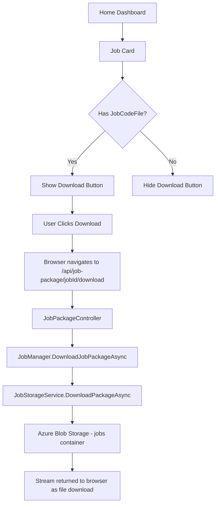
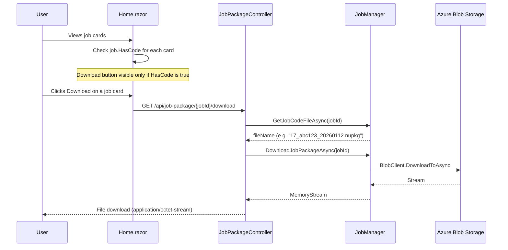
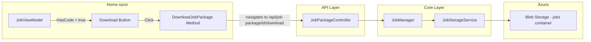
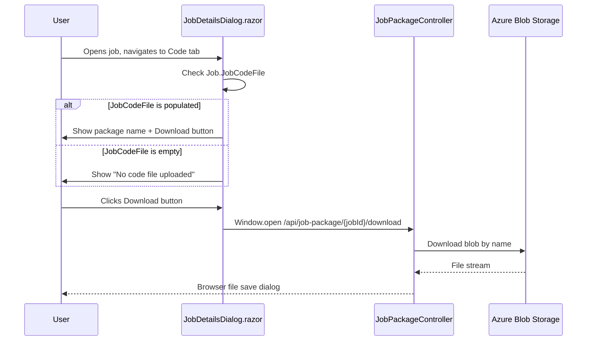

# Job Download Button Feature Plan

## Overview

Add a **Download** button to each job card on the Home dashboard that allows users to download the uploaded NuGet package (.nupkg) directly from Azure Blob Storage. The button should only be visible for jobs that have code uploaded (i.e., `JobCodeFile` is not null/empty).

## Current State

The application already has the following infrastructure in place:

| Component | Location | Purpose |
|---|---|---|
| `JobPackageController` | `BlazorOrchestrator.Web/Controllers/JobPackageController.cs` | API endpoint `GET /api/job-package/{jobId}/download` returning the .nupkg file |
| `DownloadJobPackageAsync` | `JobManager.cs` | Downloads blob stream by job ID |
| `GetPackageDownloadUriAsync` | `JobStorageService.cs` | Generates a time-limited SAS URL for blob access |
| `DownloadCodePackage()` | `JobDetailsDialog.razor` | Existing download action in the job editor dialog |
| `Job.JobCodeFile` | `Data/Job.cs` | Field storing the blob name; null/empty means no code uploaded |

The missing piece: the Home dashboard job cards do not expose the download action.

## Architecture



## Data Flow



## Implementation Steps

### Step 1: Add `HasCode` Property to `JobViewModel`

The `JobViewModel` class (defined in `Home.razor` code section) needs a new boolean property to track whether the job has uploaded code.

**File:** `src/BlazorOrchestrator.Web/Components/Pages/Home.razor`

Add to the `JobViewModel` class:

```csharp
private class JobViewModel
{
    public int Id { get; set; }
    public string Name { get; set; } = string.Empty;
    public bool IsRunning { get; set; }
    public bool IsEnabled { get; set; }
    public bool IsQueued { get; set; }
    public bool HasError { get; set; }
    public bool HasCode { get; set; }  // NEW: indicates job has an uploaded package
    public string LastRun { get; set; } = string.Empty;
    public string NextRun { get; set; } = string.Empty;
    public List<string> JobGroups { get; set; } = new();
    public List<int> JobGroupIds { get; set; } = new();
}
```

### Step 2: Populate `HasCode` in `LoadJobsAsync`

In the `LoadJobsAsync` method, set `HasCode` based on the `JobCodeFile` field from the database entity.

**File:** `src/BlazorOrchestrator.Web/Components/Pages/Home.razor`

```csharp
AllJobs.Add(new JobViewModel
{
    Id = j.Id,
    Name = j.JobName ?? "Unnamed Job",
    IsRunning = j.JobInProcess,
    IsEnabled = j.JobEnabled,
    IsQueued = j.JobQueued,
    HasError = j.JobInError,
    HasCode = !string.IsNullOrEmpty(j.JobCodeFile),  // NEW
    LastRun = GetLastRunDisplay(j),
    NextRun = GetNextRunDisplay(j),
    JobGroups = jobGroups.Select(g => g.JobGroupName ?? "Unnamed").ToList(),
    JobGroupIds = jobGroups.Select(g => g.Id).ToList()
});
```

### Step 3: Add Download Button to Job Card Markup

Add a conditional download button in the action buttons section of each job card. The button should appear only when `job.HasCode` is true.

**File:** `src/BlazorOrchestrator.Web/Components/Pages/Home.razor`

Insert the download button in the action buttons `RadzenStack`, after the existing Run Now / Stop buttons and before the flex spacer:

```razor
@* Action buttons *@
<RadzenStack Orientation="Orientation.Horizontal" Gap="0.5rem" Wrap="FlexWrap.Wrap" AlignItems="AlignItems.Center">
    <RadzenButton Text="Edit" ... />
    <RadzenButton Text="Schedule" ... />
    @if (job.IsRunning) { ... }
    else if (job.IsEnabled) { ... }

    @* NEW: Download button - only shown when job has uploaded code *@
    @if (job.HasCode)
    {
        <RadzenButton Text="Download" Icon="download" 
                      ButtonStyle="ButtonStyle.Light" Variant="Variant.Outlined" 
                      Size="ButtonSize.Small"
                      Style="border-color: #d1d5db; color: #374151;"
                      Click="@(() => DownloadJobPackage(job.Id))" />
    }

    <span style="flex: 1;"></span>
    <RadzenButton Text="View Logs" ... />
</RadzenStack>
```

### Step 4: Add `DownloadJobPackage` Method

Add the download handler method in the `@code` block of `Home.razor`.

**File:** `src/BlazorOrchestrator.Web/Components/Pages/Home.razor`

```csharp
private async Task DownloadJobPackage(int jobId)
{
    try
    {
        var downloadUrl = $"/api/job-package/{jobId}/download";
        await JSRuntime.InvokeVoidAsync("open", downloadUrl, "_blank");
    }
    catch (Exception ex)
    {
        NotificationService.Notify(NotificationSeverity.Error, "Error", 
            $"Failed to download package: {ex.Message}");
    }
}
```

### Step 5: Ensure `IJSRuntime` is Injected

Verify that `IJSRuntime` is already injected in `Home.razor`. If not, add:

```razor
@inject IJSRuntime JSRuntime
```

## Component Diagram



## UI Mockup

```
┌─────────────────────────────────────────────────────────────────┐
│  [icon]  My ETL Job                              [● Running]    │
│                                                                 │
│  📁 Production  Data-Team                                       │
│                                                                 │
│  LAST RUN           NEXT RUN                                    │
│  2 mins ago         In 58 mins                                  │
│                                                                 │
│  [Edit] [Schedule] [Run Now] [Download]           View Logs     │
│                                         ▲                       │
│                                         │                       │
│                              Only visible if HasCode = true      │
└─────────────────────────────────────────────────────────────────┘
```

## Security Considerations

| Concern | Mitigation |
|---|---|
| Unauthorized download | The `JobPackageController` uses `[AllowAnonymous]` currently; consider adding `[Authorize]` if the app requires authentication for downloads |
| Path traversal in blob name | `JobManager` uses internally generated blob names (GUID-based), not user-supplied paths |
| Large file streaming | The controller streams via `MemoryStream`; for very large packages, consider streaming directly from blob to response |

## Testing Checklist

- [ ] Job card shows Download button only when `JobCodeFile` is populated
- [ ] Job card hides Download button when `JobCodeFile` is null or empty
- [ ] Clicking Download on job card triggers browser file download with correct filename
- [ ] Code tab Download button displays text label "Download" alongside the icon
- [ ] Code tab Download button only visible when `JobCodeFile` is populated
- [ ] Clicking Download on Code tab triggers browser file download with correct filename
- [ ] Downloaded .nupkg file is valid and matches the uploaded package
- [ ] Download button styling is consistent with other action buttons
- [ ] No errors when job has code but blob is missing (graceful 404)

## Files to Modify

| File | Change |
|---|---|
| `src/BlazorOrchestrator.Web/Components/Pages/Home.razor` | Add `HasCode` to `JobViewModel`, populate in `LoadJobsAsync`, add Download button markup, add `DownloadJobPackage` method |
| `src/BlazorOrchestrator.Web/Components/Pages/Dialogs/JobDetailsDialog.razor` | Enhance existing download button with text label and outlined variant for better visibility |

---

## Part 2: Download Button in Job Details Dialog (Code Tab)

### Current State of the Code Tab

The Code tab inside `JobDetailsDialog.razor` already has a download button next to the "Current Code Package" label. It appears when `Job.JobCodeFile` is not empty and calls `DownloadCodePackage()`.

**Existing markup** (lines 337-338):

```razor
<RadzenButton Icon="download" ButtonStyle="ButtonStyle.Info" Size="ButtonSize.Small"
              Title="Download Package" Click="@DownloadCodePackage" />
```

**Existing method** (line 845):

```csharp
private async Task DownloadCodePackage()
{
    if (Job == null || string.IsNullOrEmpty(Job.JobCodeFile)) return;

    try
    {
        var downloadUrl = $"/api/job-package/{JobId}/download";
        await JSRuntime.InvokeVoidAsync("open", downloadUrl, "_blank");
    }
    catch (Exception ex)
    {
        NotificationService.Notify(NotificationSeverity.Error, "Error", 
            $"Failed to download package: {ex.Message}");
    }
}
```

### Enhancement: Make the Download Button More Prominent

The current download button is an icon-only button. To improve discoverability, enhance it to include text and better styling.

**File:** `src/BlazorOrchestrator.Web/Components/Pages/Dialogs/JobDetailsDialog.razor`

Replace the existing icon-only button:

```razor
@if (!string.IsNullOrEmpty(Job.JobCodeFile))
{
    <RadzenButton Icon="download" Text="Download" 
                  ButtonStyle="ButtonStyle.Info" Size="ButtonSize.Small"
                  Variant="Variant.Outlined"
                  Title="Download Package" Click="@DownloadCodePackage" />
}
```

### Code Tab Download Flow



### Code Tab UI Layout

```
┌─────────────────────────────────────────────────────────────────┐
│  Code Tab                                                       │
│                                                                 │
│  Current Code Package                                           │
│  ┌─────────────────────────────────────────────┐ ┌───────────┐ │
│  │ 17_abc123_20260112030033.nupkg              │ │ Download  │ │
│  └─────────────────────────────────────────────┘ └───────────┘ │
│                                                                 │
│  Upload NuGet Package (.nupkg)                                  │
│  [Choose File]                                                  │
│                                                                 │
└─────────────────────────────────────────────────────────────────┘
```

## No New Files Required

All required backend infrastructure (controller, service methods) already exists. This feature only requires UI changes to the Home dashboard and a minor styling enhancement in the Code tab dialog.
