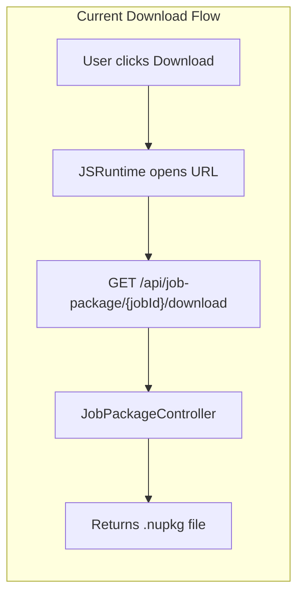
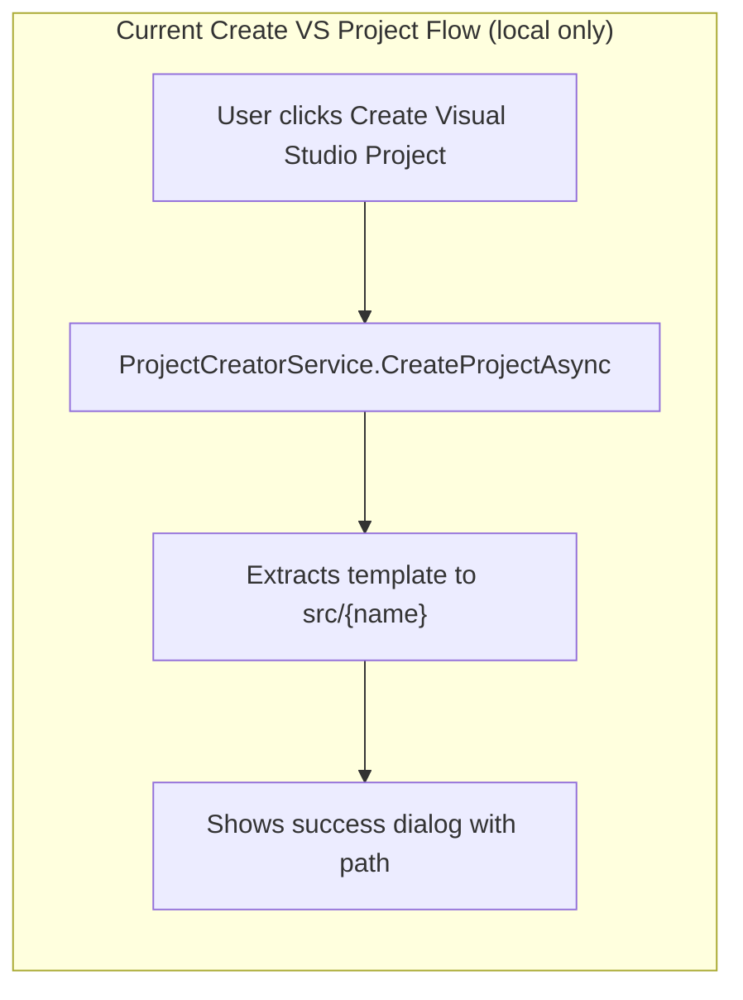
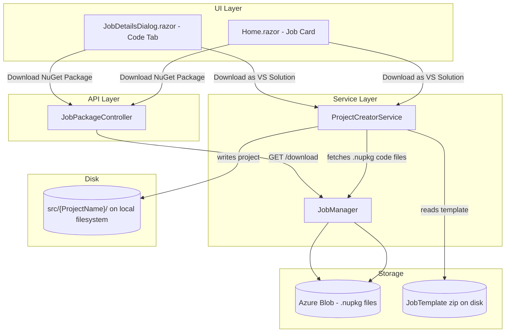
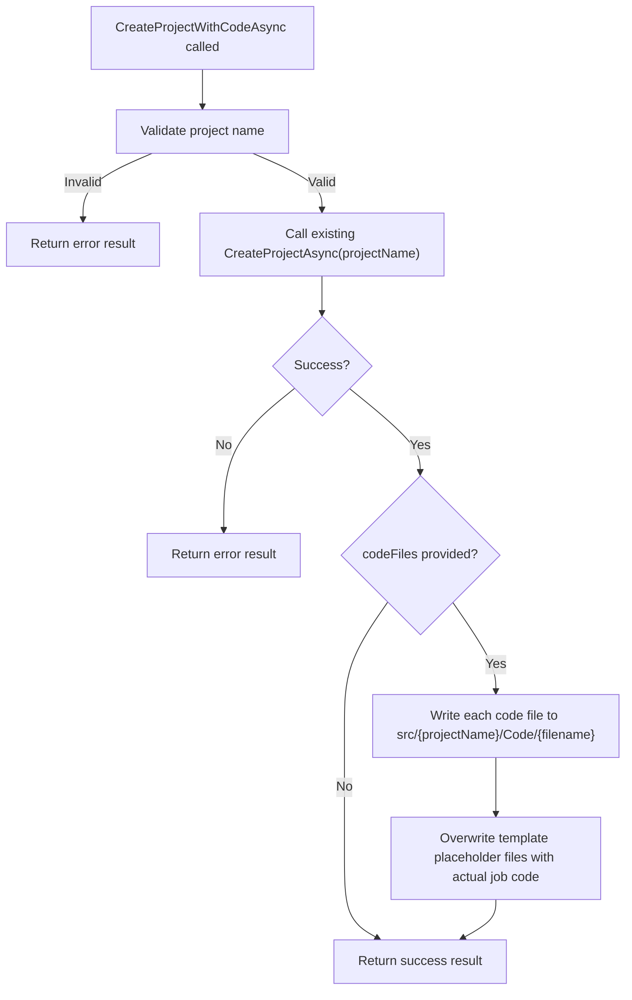
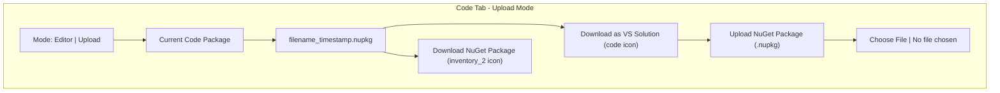
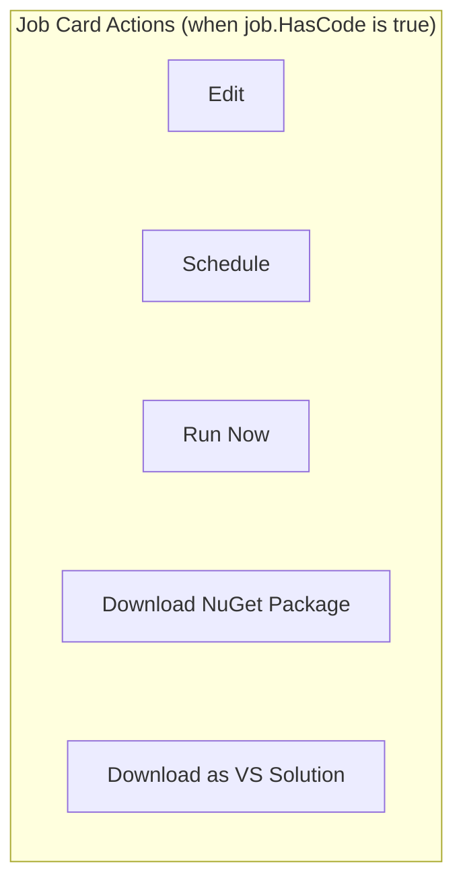
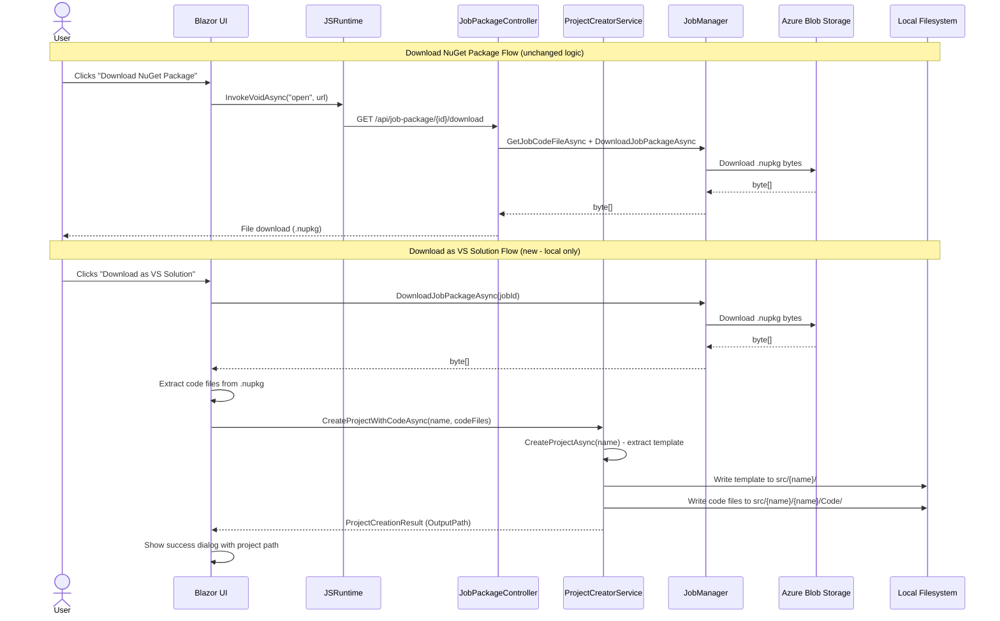

# Job Download Options Feature Plan

## Overview

This document describes the implementation plan for enhancing the job download experience in Blazor Data Orchestrator. The feature adds a **"Download as VS Solution"** button alongside the existing download button (renamed to **"Download NuGet Package"**). Instead of downloading a zip file, the "Download as VS Solution" button creates the project directly on disk in the `src/` directory (the same location used by "Create Visual Studio Project") and shows a success popup with the project path.

---

## Current State

| Element | Location | Behavior |
|---------|----------|----------|
| **Download** button (Code tab, Upload mode) | `JobDetailsDialog.razor` line ~335 | Downloads `.nupkg` via `/api/job-package/{jobId}/download` |
| **Download** button (Home page job card) | `Home.razor` line ~175 | Same endpoint, opens in new tab |
| **Create Visual Studio Project** button | `Home.razor` line ~66 | Local-only; calls `ProjectCreatorService.CreateProjectAsync()` to extract template to disk at `src/{ProjectName}` |
| **ProjectCreatorService** | `Services/ProjectCreatorService.cs` | Extracts `JobTemplate/BlazorDataOrchestrator.JobCreatorTemplate.zip`, renames files/contents, writes to `src/` sibling directory |
| **JobPackageController** | `Controllers/JobPackageController.cs` | `GET /api/job-package/{jobId}/download` — streams `.nupkg` blob |

### Output Directory Verification

`ProjectCreatorService.CreateProjectAsync()` writes to:
```
ContentRootPath = src/BlazorOrchestrator.Web/
parentDirectory = src/
outputDirectory = src/{ProjectName}/
```

This is the same `src/` directory that contains all solution projects (`BlazorOrchestrator.Web`, `BlazorOrchestrator.AppHost`, `BlazorDataOrchestrator.Core`, etc.). The new "Download as VS Solution" feature writes to the same location.





---

## Proposed Changes

### Summary of Changes

1. **Rename** existing "Download" button text to **"Download NuGet Package"** with a package-representative icon
2. **Add** a new **"Download as VS Solution"** button with a code icon (local-only, same guard as "Create Visual Studio Project")
3. **Add** a new overload in `ProjectCreatorService` that accepts code files to inject into the template project on disk
4. **Show** a success popup after project creation, telling the user where the project was created in `src/`
5. **Apply** the same rename on the Home page job card download button
6. **No new API endpoint** — the project is created directly on disk via service call, no HTTP download involved

### Component Architecture



---

## Detailed Implementation

### 1. Rename Existing Download Button

#### 1a. JobDetailsDialog.razor (Code Tab — Upload Mode)

**File:** `src/BlazorOrchestrator.Web/Components/Pages/Dialogs/JobDetailsDialog.razor`

**Current code (~line 335):**
```razor
<RadzenButton Text="Download" Icon="download" ButtonStyle="ButtonStyle.Info"
              Variant="Variant.Outlined" Size="ButtonSize.Small"
              Title="Download Package" Click="@DownloadCodePackage" />
```

**Updated code:**
```razor
<RadzenButton Text="Download NuGet Package" Icon="inventory_2" ButtonStyle="ButtonStyle.Info"
              Variant="Variant.Outlined" Size="ButtonSize.Small"
              Title="Download NuGet Package (.nupkg)" Click="@DownloadCodePackage" />
```

- **Icon change:** `download` to `inventory_2` (Material Icon representing a package/box)
- **Text change:** `"Download"` to `"Download NuGet Package"`
- **Title change:** Updated to clarify the file type

#### 1b. Home.razor (Job Card)

**File:** `src/BlazorOrchestrator.Web/Components/Pages/Home.razor`

**Current code (~line 175):**
```razor
<RadzenButton Text="Download" Icon="download" ButtonStyle="ButtonStyle.Light"
              Variant="Variant.Outlined" Size="ButtonSize.Small"
              Style="border-color: #d1d5db; color: #374151;"
              Click="@(() => DownloadJobPackage(job.Id))" />
```

**Updated code:**
```razor
<RadzenButton Text="Download NuGet Package" Icon="inventory_2" ButtonStyle="ButtonStyle.Light"
              Variant="Variant.Outlined" Size="ButtonSize.Small"
              Style="border-color: #d1d5db; color: #374151;"
              Click="@(() => DownloadJobPackage(job.Id))" />
```

---

### 2. Add "Download as VS Solution" Button

#### 2a. JobDetailsDialog.razor (Code Tab — Upload Mode)

Insert immediately after the renamed "Download NuGet Package" button. **Only visible when running locally** (same guard pattern as "Create Visual Studio Project" on Home.razor):

```razor
@if (IsRunningLocally)
{
    <RadzenButton Text="Download as VS Solution" Icon="code" ButtonStyle="ButtonStyle.Success"
                  Variant="Variant.Outlined" Size="ButtonSize.Small"
                  Title="Create Visual Studio Solution in src/ directory" Click="@CreateVSSolutionFromJob" />
}
```

- **Icon:** `code` (Material Icon — code brackets `</>` representing source code / VS solution)
- **ButtonStyle:** `ButtonStyle.Success` (green tint to visually distinguish from the NuGet download)
- **Guard:** `IsRunningLocally` — project creation on disk only makes sense locally

#### 2b. Home.razor (Job Card)

Insert after the renamed "Download NuGet Package" button, inside the `@if (job.HasCode)` block. Wrap in `@if (IsRunningLocally)`:

```razor
@if (IsRunningLocally)
{
    <RadzenButton Text="Download as VS Solution" Icon="code" ButtonStyle="ButtonStyle.Light"
                  Variant="Variant.Outlined" Size="ButtonSize.Small"
                  Style="border-color: #d1d5db; color: #4f46e5;"
                  Click="@(() => CreateVSSolutionFromJob(job.Id, job.Name))" />
}
```

#### 2c. Event Handlers

**JobDetailsDialog.razor — add method:**

The handler downloads the `.nupkg`, extracts code files, calls `ProjectCreatorService`, and shows a success dialog with the output path.

```csharp
private async Task CreateVSSolutionFromJob()
{
    try
    {
        // 1. Sanitize job name as project name
        var projectName = SanitizeProjectName(Job.Name);

        // 2. Download .nupkg bytes via JobManager
        var packageBytes = await JobManager.DownloadJobPackageAsync(JobId);
        if (packageBytes == null || packageBytes.Length == 0)
        {
            NotificationService.Notify(NotificationSeverity.Error, "Error",
                "Could not download the code package.");
            return;
        }

        // 3. Extract code files from .nupkg (skip NuGet metadata)
        var codeFiles = ExtractCodeFilesFromNupkg(packageBytes);

        // 4. Create project on disk with injected code files
        var result = await ProjectCreatorService.CreateProjectWithCodeAsync(projectName, codeFiles);

        if (!result.Success)
        {
            NotificationService.Notify(NotificationSeverity.Error, "Error", result.ErrorMessage);
            return;
        }

        // 5. Show success dialog with path
        await ShowVSSolutionSuccessDialog(projectName, result.OutputPath!);
    }
    catch (Exception ex)
    {
        NotificationService.Notify(NotificationSeverity.Error, "Error",
            $"Failed to create VS Solution: {ex.Message}");
    }
}

private static Dictionary<string, string> ExtractCodeFilesFromNupkg(byte[] packageBytes)
{
    var codeFiles = new Dictionary<string, string>();
    using var nupkgStream = new MemoryStream(packageBytes);
    using var archive = new ZipArchive(nupkgStream, ZipArchiveMode.Read);

    foreach (var entry in archive.Entries)
    {
        if (entry.FullName.StartsWith("[Content_Types]") ||
            entry.FullName.StartsWith("_rels/") ||
            entry.FullName.EndsWith(".nuspec") ||
            string.IsNullOrEmpty(entry.Name))
            continue;

        using var reader = new StreamReader(entry.Open());
        codeFiles[entry.Name] = reader.ReadToEnd();
    }
    return codeFiles;
}

private static string SanitizeProjectName(string jobName)
{
    var sanitized = new string(jobName
        .Replace(" ", "")
        .Where(c => char.IsLetterOrDigit(c) || c == '_' || c == '.')
        .ToArray());
    if (sanitized.Length > 20) sanitized = sanitized[..20];
    if (string.IsNullOrWhiteSpace(sanitized)) sanitized = "Job";
    return sanitized;
}
```

**Home.razor — add method** (same pattern, receives jobId and jobName as parameters):

```csharp
private async Task CreateVSSolutionFromJob(int jobId, string jobName)
{
    try
    {
        var projectName = SanitizeProjectName(jobName);

        var packageBytes = await JobManager.DownloadJobPackageAsync(jobId);
        if (packageBytes == null || packageBytes.Length == 0)
        {
            NotificationService.Notify(NotificationSeverity.Error, "Error",
                "Could not download the code package.");
            return;
        }

        var codeFiles = ExtractCodeFilesFromNupkg(packageBytes);
        var result = await ProjectCreatorService.CreateProjectWithCodeAsync(projectName, codeFiles);

        if (!result.Success)
        {
            NotificationService.Notify(NotificationSeverity.Error, "Error", result.ErrorMessage);
            return;
        }

        await ShowVSSolutionSuccessDialog(projectName, result.OutputPath!);
    }
    catch (Exception ex)
    {
        NotificationService.Notify(NotificationSeverity.Error, "Error",
            $"Failed to create VS Solution: {ex.Message}");
    }
}
```

#### 2d. Success Dialog

Both components show a dialog informing the user where the project was created. This follows the same pattern as the existing `ShowSuccessDialog` used by "Create Visual Studio Project".

```csharp
private async Task ShowVSSolutionSuccessDialog(string name, string outputPath)
{
    await DialogService.OpenAsync("VS Solution Created", ds =>
        @<RadzenStack Gap="1.5rem" Style="min-width: 450px; text-align: center; padding: 1rem;">
        <RadzenStack AlignItems="AlignItems.Center" Gap="0.5rem">
            <RadzenIcon Icon="check_circle" Style="font-size: 3rem; color: #22c55e;" />
            <RadzenText TextStyle="TextStyle.H6" Style="margin: 0;">
                Your project '@name' has been created with the job code!
            </RadzenText>
        </RadzenStack>

        <RadzenStack Gap="1rem" Style="text-align: left; background-color: #f8fafc; padding: 1rem; border-radius: 8px;">
            <RadzenText TextStyle="TextStyle.Subtitle1" Style="margin: 0; font-weight: 600;">
                Project location:
            </RadzenText>
            <RadzenText TextStyle="TextStyle.Caption"
                Style="margin: 0; padding: 0.5rem; background-color: #e2e8f0; border-radius: 4px; font-family: monospace; word-break: break-all;">
                @outputPath
            </RadzenText>
            <RadzenText TextStyle="TextStyle.Subtitle1" Style="margin: 0; font-weight: 600;">
                How to open:
            </RadzenText>
            <RadzenStack Gap="0.5rem">
                <RadzenText TextStyle="TextStyle.Body2" Style="margin: 0;">
                    <strong>1.</strong> Open Visual Studio
                </RadzenText>
                <RadzenText TextStyle="TextStyle.Body2" Style="margin: 0;">
                    <strong>2.</strong> Select <em>File > Open > Project/Solution</em>
                </RadzenText>
                <RadzenText TextStyle="TextStyle.Body2" Style="margin: 0;">
                    <strong>3.</strong> Navigate to the path above and open the <code>.csproj</code> or <code>.sln</code> file
                </RadzenText>
                <RadzenText TextStyle="TextStyle.Body2" Style="margin: 0;">
                    <strong>4.</strong> Your job code is in the <code>Code/</code> directory
                </RadzenText>
                <RadzenText TextStyle="TextStyle.Body2" Style="margin: 0;">
                    <strong>5.</strong> Press <strong>F5</strong> to build and run
                </RadzenText>
            </RadzenStack>
        </RadzenStack>

        <RadzenButton Text="OK" ButtonStyle="ButtonStyle.Primary"
            Click="@(() => ds.Close())" Style="min-width: 100px;" />
    </RadzenStack>,
    new DialogOptions { ShowTitle = true, CloseDialogOnEsc = true, CloseDialogOnOverlayClick = true }
    );
}
```

---

### 3. ProjectCreatorService — New Overload

**File:** `src/BlazorOrchestrator.Web/Services/ProjectCreatorService.cs`

Add a new method that extends the existing `CreateProjectAsync` to also inject code files from the job's `.nupkg` into the template. It uses the same disk-based extraction logic — writes to `src/{projectName}/` — and additionally copies the job's code files into the `Code/` subdirectory.

#### New Method Signature

```csharp
public async Task<ProjectCreationResult> CreateProjectWithCodeAsync(
    string projectName,
    Dictionary<string, string> codeFiles)
```

This returns the existing `ProjectCreationResult` (with `Success`, `OutputPath`, `ErrorMessage`) — no new model needed.

#### Implementation Logic



**Key differences from existing `CreateProjectAsync`:**

| Aspect | Existing method | New overload |
|--------|----------------|--------------|
| Output | Extracts template to `src/{name}/` | Same location, plus injects code files |
| Code files | Template defaults (placeholder) | Overwritten with actual job code from `.nupkg` |
| Caller | "Create Visual Studio Project" button (Home.razor) | "Download as VS Solution" button (Home.razor + JobDetailsDialog.razor) |
| Environment | Local-only | Local-only (same guard) |

#### Implementation

```csharp
public async Task<ProjectCreationResult> CreateProjectWithCodeAsync(
    string projectName,
    Dictionary<string, string> codeFiles)
{
    // 1. Use existing method to create the project on disk
    var result = await CreateProjectAsync(projectName);

    if (!result.Success || string.IsNullOrEmpty(result.OutputPath))
    {
        return result;
    }

    // 2. Inject code files into the Code/ subdirectory
    if (codeFiles != null && codeFiles.Count > 0)
    {
        // The template extracts with a nested folder: src/{projectName}/{projectName}/Code/
        var codeDirectory = Path.Combine(result.OutputPath, projectName, "Code");

        if (!Directory.Exists(codeDirectory))
        {
            Directory.CreateDirectory(codeDirectory);
        }

        foreach (var (fileName, fileContent) in codeFiles)
        {
            var filePath = Path.Combine(codeDirectory, fileName);
            await File.WriteAllTextAsync(filePath, fileContent);
            _logger.LogInformation("Injected code file: {FilePath}", filePath);
        }
    }

    return result;
}
```

> **Note:** This approach reuses `CreateProjectAsync` entirely — no duplicated template extraction or renaming logic. The only addition is writing the code files after the template is extracted.

---

### 4. No New API Endpoint Required

Since the project is created directly on disk via `ProjectCreatorService` (called from the Blazor component), **no new API endpoint is needed**. This eliminates the authentication concern entirely — the operation runs within the existing authenticated Blazor circuit.

The existing `GET /api/job-package/{jobId}/download` endpoint remains unchanged for the "Download NuGet Package" button.

> **Note:** The existing `JobPackageController` uses `[AllowAnonymous]` at the class level. This is unrelated to the new feature but is worth reviewing separately if authentication is a concern for NuGet package downloads.

---

### 5. Icon Selection

The project uses **Radzen Blazor** components which bundle **Material Icons** (Google Material Symbols). No Font Awesome or Bootstrap Icons library is loaded.

| Button | Icon Name | Material Icon Visual | Rationale |
|--------|-----------|---------------------|-----------|
| Download NuGet Package | `inventory_2` | Box/package icon | Represents a packaged artifact |
| Download as VS Solution | `code` | `</>` brackets | Represents source code / development project |

**Alternative icon options if preferred:**

| Button | Alt Icon | Visual |
|--------|----------|--------|
| Download NuGet Package | `archive` | Archive box |
| Download as VS Solution | `integration_instructions` | Code document with brackets |
| Download as VS Solution | `terminal` | Terminal window |

All icons are available through the Radzen `Icon` property which maps to Material Icons.

---

## UI Layout

### Code Tab — Upload Mode (After Changes)



### Home Page Job Card — Button Row (After Changes)



---

## Process Flow — End to End



---

## Files to Modify

| File | Change |
|------|--------|
| `src/BlazorOrchestrator.Web/Components/Pages/Dialogs/JobDetailsDialog.razor` | Rename button text/icon; add new "Download as VS Solution" button (local-only), handler, success dialog, and helper methods |
| `src/BlazorOrchestrator.Web/Components/Pages/Home.razor` | Rename button text/icon; add new "Download as VS Solution" button (local-only), handler, success dialog, and helper methods |
| `src/BlazorOrchestrator.Web/Services/ProjectCreatorService.cs` | Add `CreateProjectWithCodeAsync` overload that calls existing `CreateProjectAsync` then injects code files |

## Files NOT Modified

| File | Reason |
|------|--------|
| `JobTemplate/BlazorDataOrchestrator.JobCreatorTemplate.zip` | Reused as-is; no template changes needed |
| `scripts/Package-JobTemplate.ps1` | Packaging script unchanged |
| `Controllers/JobPackageController.cs` | No new API endpoint needed — project creation is done directly via service call |
| `Program.cs` / DI registration | `ProjectCreatorService` is already registered |

---

## Edge Cases and Considerations

| Scenario | Handling |
|----------|----------|
| Job has no code package uploaded | Both download buttons hidden (existing `@if` guard on `Job.JobCodeFile`) |
| Not running locally | "Download as VS Solution" button hidden (`@if (IsRunningLocally)` guard) |
| Job name contains special characters | `SanitizeProjectName` strips non-alphanumeric chars |
| Job name is empty after sanitization | Falls back to `"Job"` as project name |
| Job name exceeds 20 characters | Truncated to 20 (matching existing ProjectCreatorService validation) |
| Project with same name already exists in `src/` | Existing `CreateProjectAsync` returns error: "A project with the name already exists" |
| Template zip missing from deployment | Returns error via `ProjectCreationResult.ErrorMessage` |
| .nupkg contains only binary/metadata files | Code files dictionary will be empty; template generated with default placeholder code |
| Authentication | No concern — no new API endpoint; runs within authenticated Blazor circuit |

---

## Testing Checklist

- [ ] **Renamed button** — "Download NuGet Package" label and `inventory_2` icon render correctly on the Code tab
- [ ] **Renamed button** — "Download NuGet Package" label and `inventory_2` icon render correctly on the Home page job card
- [ ] **New button visibility (local)** — "Download as VS Solution" with `code` icon appears when running locally
- [ ] **New button visibility (remote)** — "Download as VS Solution" is hidden when not running locally
- [ ] **New button visibility (no code)** — Both download buttons are hidden when a job has no code package
- [ ] **NuGet download** — Clicking "Download NuGet Package" still downloads the `.nupkg` file as before
- [ ] **VS Solution creation** — Clicking "Download as VS Solution" creates a project in `src/{name}/`
- [ ] **Success dialog** — After creation, a popup shows the project path and instructions to open in Visual Studio
- [ ] **Code injection** — `main.cs` (or `main.py`) from the job package appears in the `Code/` directory of the created project
- [ ] **Project builds** — Created project can be opened in Visual Studio and builds successfully
- [ ] **Special characters** — Job names with spaces and special characters produce valid project names
- [ ] **Duplicate name** — Attempting to create when a project with the same name exists shows an error notification
- [ ] **Error handling** — Missing .nupkg in blob storage shows an error notification
