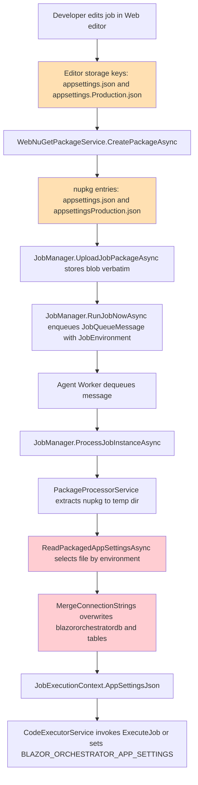
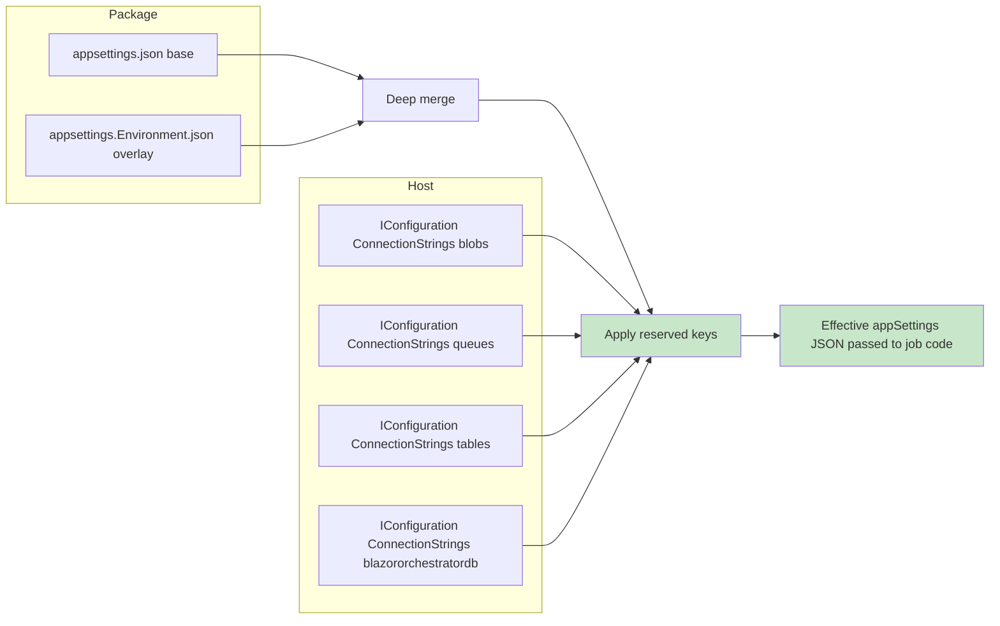
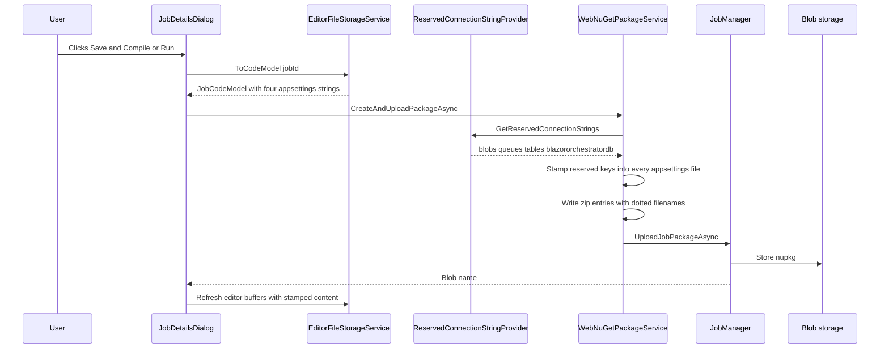
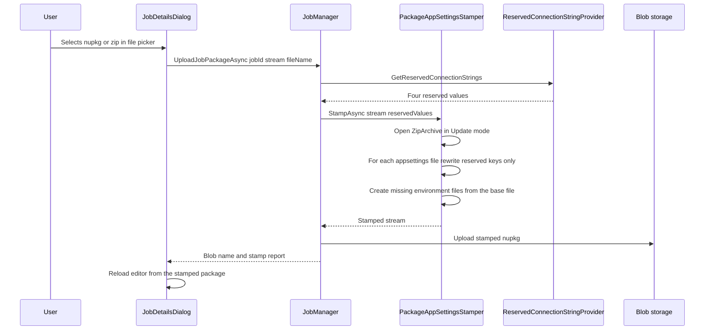
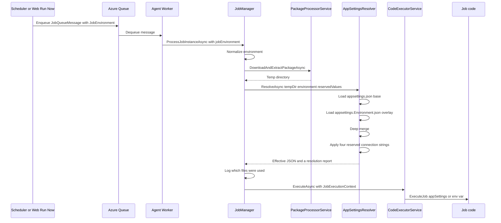
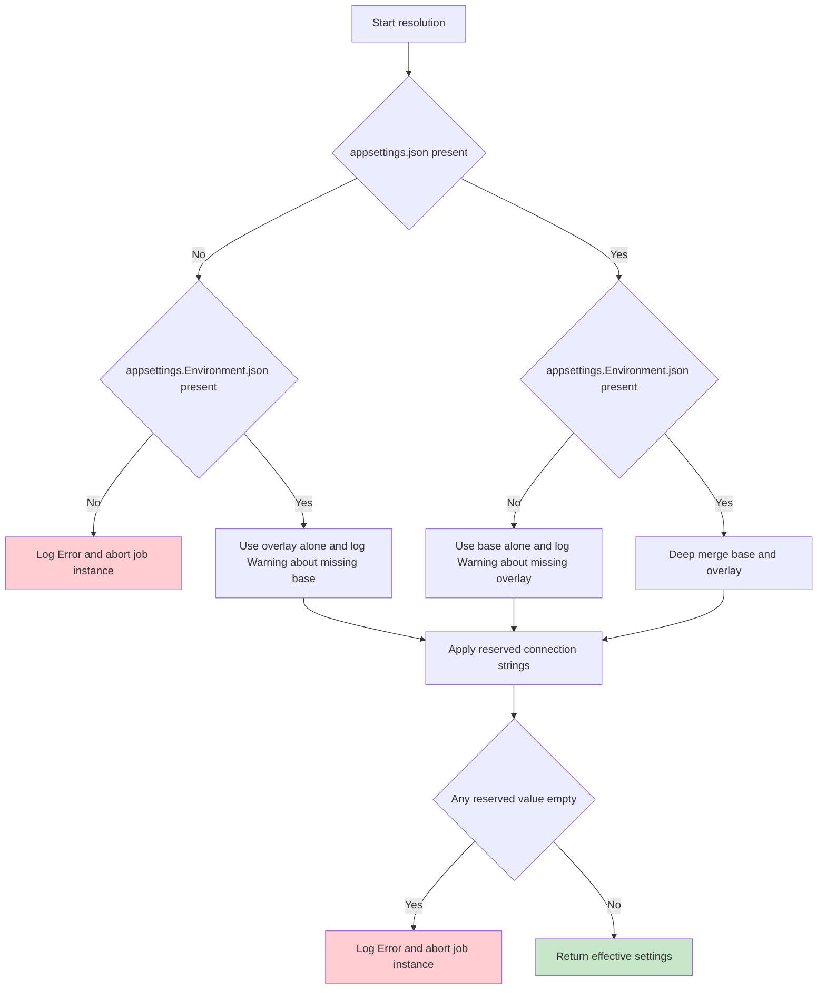
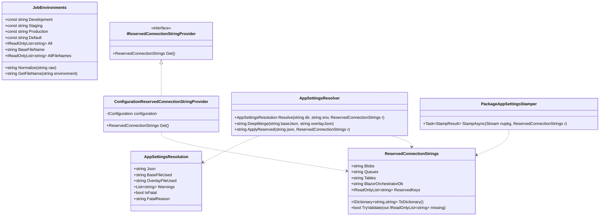
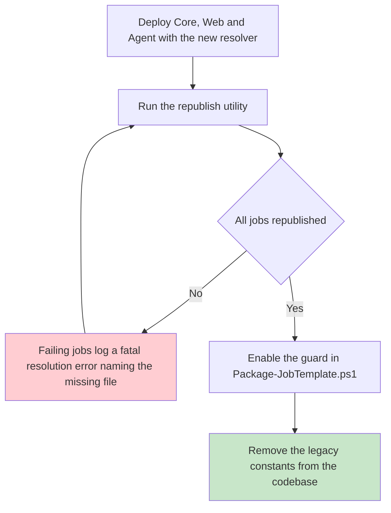
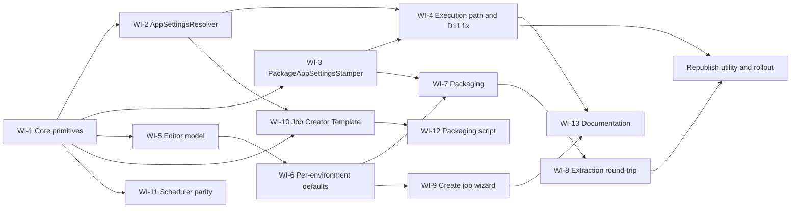

# Job Environment & AppSettings Resolution Plan

Canonicalizing per-environment `appsettings` for jobs across the Job Creator Template, the Web editor, the NuGet packaging pipeline, and the Agent runtime.

---

## 1. Executive Summary

### 1.1 The reported symptom

A job configured with **Environment = Production** was pushed to the Web project and executed successfully in a hosted environment, even though its packaged settings contained purely local values:

```json
"blobs": "UseDevelopmentStorage=true",
"tables": "UseDevelopmentStorage=true",
"queues": "UseDevelopmentStorage=true"
```

### 1.2 Why it "works" today

It works **by accident, not by design**. Three separate behaviours combine:

1. The Agent *does* locate and read a per-environment file from the extracted package — `appsettingsProduction.json` for Production — via `ReadPackagedAppSettingsAsync` in [JobManager.cs](../src/BlazorDataOrchestrator.Core/JobManager.cs#L1332).
2. It then calls `MergeConnectionStrings` ([JobManager.cs](../src/BlazorDataOrchestrator.Core/JobManager.cs#L1383)), which **unconditionally overwrites** `ConnectionStrings:blazororchestratordb` and `ConnectionStrings:tables` with the Agent host's own values. The packaged values for those two keys are therefore never used.
3. `blobs` and `queues` are **not** overwritten. Any job that uses blob or queue storage genuinely receives `UseDevelopmentStorage=true` in production and will fail (or silently no-op, because the reference `JobLogger` swallows storage exceptions).

So the answer to *"is it really a bug?"* is: **partly by design, partly a real bug.**

- **By design:** [docs/AppSettings.md](AppSettings.md) explicitly prescribes the merge step ("Merge/Override ConnectionStrings with Agent configured values").
- **Real bugs:** the Production template content is a byte-for-byte copy of the Development content; `blobs`/`queues` are excluded from the merge; the merge source is empty under the Agent's actual DI registration; `Staging` is selectable but never generated; and the file naming is inconsistent between the editor, the package, and the runtime.

### 1.3 Comparison with the reference project

The system was modelled on **Warehouse Orchestrator** (`C:\Repo\EPICMain\WarehouseOchestratorProjects`). The two designs diverged materially:

| Aspect | Warehouse Orchestrator (reference) | BlazorDataOrchestrator (current) |
| --- | --- | --- |
| Environment source | The **Agent's** `AgentEnvironment` from its own `App.config` | The **Job's** `Job.JobEnvironment` column, carried on the queue message |
| File naming | `{PackageName}.App.json`, `.AppDev.json`, `.AppUAT.json`, `.AppProd.json` | `appsettings.json` / `appsettingsProduction.json` / `appsettingsStaging.json` |
| Match rule | `entry.Name.Contains(appfilename)` — substring, inside the archive | `Directory.GetFiles(tempDir, exactName, AllDirectories)` — exact, post-extraction |
| Connection string override | **None.** The packaged file is passed verbatim to `RunIfScheduled` | `blazororchestratordb` + `tables` forcibly replaced |
| Environments | Local, Dev, UAT, Prod (plus OnPrem variants) | Development, Staging, Production (plus an undocumented "Designer") |
| Secrets | Real production secrets committed in plaintext per environment file | Placeholder localhost values in every file |

The reference project's "package always wins" model is only safe because a *separate agent deployment exists per environment*. BlazorDataOrchestrator routes many environments through potentially one agent, so the packaged file cannot be the source of truth for infrastructure connection strings.

### 1.4 Agreed target design

> **Package wins for everything, except four reserved connection string keys, for which the host always wins.**

The four **reserved keys** are:

- `ConnectionStrings:blobs`
- `ConnectionStrings:queues`
- `ConnectionStrings:tables`
- `ConnectionStrings:blazororchestratordb`

These are always sourced from the executing host's runtime configuration. Everything else in the selected `appsettings.{Environment}.json` — API keys, feature flags, business settings, custom connection strings — is honoured exactly as packaged.

Additionally:

- Reserved keys are **written into the package at upload/publish time** so the developer can *see* the effective values in the editor.
- Reserved keys are **re-applied at execution time**, which remains authoritative (so a stale package cannot pin an old connection string).
- Filenames become **dotted everywhere**, a clean break with no legacy fallback.
- New jobs default to **Production**.

---

## 2. Confirmed Current-State Analysis

### 2.1 End-to-end flow as it exists today



Orange nodes are the naming inconsistency. Red nodes are where the reported behaviour originates.

### 2.2 Where the environment is chosen

Environment selection happens in exactly three places today:

| # | Location | Behaviour |
| --- | --- | --- |
| 1 | [JobManager.cs](../src/BlazorDataOrchestrator.Core/JobManager.cs#L1160) | `effectiveEnvironment = jobEnvironment ?? job.JobEnvironment ?? "Development"` |
| 2 | [JobManager.cs](../src/BlazorDataOrchestrator.Core/JobManager.cs#L1335) | Filename switch: `production` → `appsettingsProduction.json`, `staging` → `appsettingsStaging.json`, everything else → `appsettings.json` |
| 3 | [Home.razor](../src/BlazorDataOrchestrator.JobCreatorTemplate/Components/Pages/Home.razor#L591) | Designer two-way branch: Production → `appsettingsProduction.json`, otherwise `appsettings.json` |

Note that `ASPNETCORE_ENVIRONMENT` / `DOTNET_ENVIRONMENT` play **no part** in job environment selection. They appear only in `launchSettings.json` files and in `Error.razor` help text. The job environment is entirely a database-driven, per-job value.

### 2.3 Confirmed defect register

| ID | Severity | Defect | Primary location |
| --- | --- | --- | --- |
| **D1** | High | `appsettings.Production.json` is scaffolded with *identical* content to `appsettings.json` — localhost SQL and `UseDevelopmentStorage=true` | [JobDetailsDialog.razor](../src/BlazorOrchestrator.Web/Components/Pages/Dialogs/JobDetailsDialog.razor#L1316), [JobCodeEditorService.cs](../src/BlazorOrchestrator.Web/Services/JobCodeEditorService.cs#L611) |
| **D2** | High | Runtime overwrites only `blazororchestratordb` + `tables`, masking the placeholder problem for those two keys | [JobManager.cs](../src/BlazorDataOrchestrator.Core/JobManager.cs#L1383) |
| **D3** | High | `blobs` and `queues` are **not** overwritten — a Production job talks to Azurite | [JobManager.cs](../src/BlazorDataOrchestrator.Core/JobManager.cs#L1383) |
| **D4** | High | `Staging` is offered by `JobService.GetEnvironments()` but no `appsettingsStaging.json` is ever created or packaged by the Web editor | [JobService.cs](../src/BlazorOrchestrator.Web/Services/JobService.cs#L214) vs [WebNuGetPackageService.cs](../src/BlazorOrchestrator.Web/Services/WebNuGetPackageService.cs#L86) |
| **D5** | Medium | Filename inconsistency: `appsettings.Production.json` (editor) vs `appsettingsProduction.json` (package + runtime) | [WebNuGetPackageService.cs](../src/BlazorOrchestrator.Web/Services/WebNuGetPackageService.cs#L93), [JobCodeEditorService.cs](../src/BlazorOrchestrator.Web/Services/JobCodeEditorService.cs#L757) |
| **D6** | Medium | The Scheduler uses a **different** `JobQueueMessage` class with no `JobEnvironment` property, serialized camelCase | [Scheduler/Messages/JobQueueMessage.cs](../src/BlazorOrchestrator.Scheduler/Messages/JobQueueMessage.cs) vs [Core/Models/JobQueueMessage.cs](../src/BlazorDataOrchestrator.Core/Models/JobQueueMessage.cs) |
| **D7** | Medium | A missing appsettings file does not abort the job; the code returns `"{}"` and continues, contradicting [AppSettings.md](AppSettings.md) | [JobManager.cs](../src/BlazorDataOrchestrator.Core/JobManager.cs#L1367) |
| **D8** | Medium | Designer-created jobs get `JobEnvironment = "Designer"`, which is not in the dropdown and silently falls into the default switch branch | [JobManager.cs](../src/BlazorDataOrchestrator.Core/JobManager.cs#L759) |
| **D9** | Medium | `CreateJobDialog` has no Environment field; every new job is created as `Development` | [CreateJobDialog.razor](../src/BlazorOrchestrator.Web/Components/Pages/Dialogs/CreateJobDialog.razor), [JobService.cs](../src/BlazorOrchestrator.Web/Services/JobService.cs#L52) |
| **D10** | Medium | The Designer run path has only a two-way Dev/Prod branch and independently patches host connection strings | [Home.razor](../src/BlazorDataOrchestrator.JobCreatorTemplate/Components/Pages/Home.razor#L591) |
| **D11** | **Critical** | The DI/service-client `JobManager` constructor sets `_blobConnectionString`, `_queueConnectionString` and `_tableConnectionString` to `string.Empty`. The Agent registers **this** overload, so `MergeConnectionStrings` writes `"tables": ""` into every job's appsettings | [JobManager.cs](../src/BlazorDataOrchestrator.Core/JobManager.cs#L79) and [Agent/Program.cs](../src/BlazorOrchestrator.Agent/Program.cs#L43) |
| **D12** | Low | `AzureAppSettingsBuilder.BuildFromEnvironment()` returns `null` unless `AzureEnvironmentDetector.IsAzureContainerApp` is true, so any non-ACA host always falls back to the hard-coded localhost constant | [AzureAppSettingsBuilder.cs](../src/BlazorDataOrchestrator.Core/Services/AzureAppSettingsBuilder.cs#L34) |

> **D11 is the most important discovery.** It means the current "merge" is not merely masking the problem — it is actively corrupting the `tables` connection string for every job executed by the Agent. It must be fixed before or alongside everything else.

### 2.4 Current file inventory

| Project | Files present today | Files required after this plan |
| --- | --- | --- |
| `BlazorDataOrchestrator.JobCreatorTemplate` | `appsettings.json`, `appsettingsProduction.json` | `appsettings.json`, `appsettings.Development.json`, `appsettings.Staging.json`, `appsettings.Production.json` |
| Web editor storage keys | `appsettings.json`, `appsettings.Production.json` | `appsettings.json`, `appsettings.Development.json`, `appsettings.Staging.json`, `appsettings.Production.json` |
| `.nupkg` content entries | `appsettings.json`, `appsettingsProduction.json` | `appsettings.json`, `appsettings.Development.json`, `appsettings.Staging.json`, `appsettings.Production.json` |
| Agent runtime lookup | `appsettings.json` / `appsettingsProduction.json` / `appsettingsStaging.json` | `appsettings.json` base + `appsettings.{Environment}.json` overlay |

---

## 3. Target Design

### 3.1 Canonical naming convention

One convention, used identically in the template project, the editor UI, the editor storage keys, the `.nupkg` entries, and the Agent runtime lookup:

| Environment value | File |
| --- | --- |
| *(base, always loaded)* | `appsettings.json` |
| `Development` | `appsettings.Development.json` |
| `Staging` | `appsettings.Staging.json` |
| `Production` | `appsettings.Production.json` |

**Clean break.** The non-dotted forms (`appsettingsProduction.json`, `appsettingsStaging.json`) are removed from every code path. Existing packages must be re-published. See §7 for the migration.

### 3.2 Layered resolution

`appsettings.json` becomes a genuine **base/shared** file rather than an alias for Development. The Agent performs a shallow-per-section deep merge:

```
effective = deepMerge(appsettings.json, appsettings.{Environment}.json)
effective.ConnectionStrings[reservedKey] = host.ConnectionStrings[reservedKey]   // for all four reserved keys
```

Merge semantics:

- Objects are merged recursively, key by key.
- Scalars and arrays in the environment file replace the base value outright.
- A key present only in the base file survives.
- The four reserved keys are applied last and always win.

### 3.3 Reserved connection string ownership



Every non-reserved key — custom connection strings, `TimezoneId`, API credentials, `Logging`, `AllowedHosts` — flows through untouched from the package.

### 3.4 Environment normalization

A single normalizer replaces the scattered string comparisons:

| Raw `Job.JobEnvironment` value | Normalized |
| --- | --- |
| `Production`, `production`, `Prod` | `Production` |
| `Staging`, `staging`, `UAT` | `Staging` |
| `Development`, `development`, `Dev`, `Local` | `Development` |
| `Designer` | `Development` *(with an informational log entry)* |
| `null`, empty, unrecognised | `Production` *(new default, with a Warning log entry)* |

This resolves **D8**. The `Designer` value continues to be written by the designer flow (it is meaningful as a provenance marker) but is explicitly mapped rather than falling through silently.

---

## 4. Target Runtime Flow

### 4.1 Publish / upload path



### 4.2 Manual `.nupkg` upload path

This is requirement (3): a hand-built package uploaded through the file picker must also have its reserved keys rewritten.



Stamping rules for the uploader:

- Only the four reserved keys inside `ConnectionStrings` are touched.
- If the `ConnectionStrings` section is missing, it is created containing only the four reserved keys.
- If a reserved key is absent from a file, it is **added**.
- All other JSON content, including key ordering elsewhere and unknown sections, is preserved.
- If an `appsettings.{Environment}.json` is missing entirely, it is created as `{ "ConnectionStrings": { ...four reserved keys... } }` so that the layered read in §3.2 always has a valid overlay.
- Non-JSON or malformed files are left untouched and reported as a warning on the job's log.

### 4.3 Execution path



### 4.4 Failure behaviour

Resolving **D7**:



Aborting on an empty reserved value directly guards against **D11** recurring: if the host cannot supply a connection string, the job fails loudly instead of writing `""` and silently losing all Table Storage logging.

---

## 5. Component Design

### 5.1 New and changed types



All of the above live in `BlazorDataOrchestrator.Core` so that the Web project, the Agent, and the Job Creator Template can share them.

Proposed file locations:

- `src/BlazorDataOrchestrator.Core/Configuration/JobEnvironments.cs`
- `src/BlazorDataOrchestrator.Core/Configuration/ReservedConnectionStrings.cs`
- `src/BlazorDataOrchestrator.Core/Configuration/IReservedConnectionStringProvider.cs`
- `src/BlazorDataOrchestrator.Core/Configuration/ConfigurationReservedConnectionStringProvider.cs`
- `src/BlazorDataOrchestrator.Core/Services/AppSettingsResolver.cs`
- `src/BlazorDataOrchestrator.Core/Services/PackageAppSettingsStamper.cs`

### 5.2 `JobEnvironments`

```csharp
namespace BlazorDataOrchestrator.Core.Configuration;

public static class JobEnvironments
{
    public const string Development = "Development";
    public const string Staging     = "Staging";
    public const string Production  = "Production";

    /// New jobs and unrecognised values resolve here.
    public const string Default = Production;

    public static readonly IReadOnlyList<string> All =
        new[] { Development, Staging, Production };

    public const string BaseFileName = "appsettings.json";

    public static string GetFileName(string environment) =>
        $"appsettings.{Normalize(environment)}.json";

    public static IReadOnlyList<string> AllFileNames =>
        new[] { BaseFileName }
            .Concat(All.Select(e => $"appsettings.{e}.json"))
            .ToArray();

    public static string Normalize(string? raw) => (raw ?? string.Empty).Trim().ToLowerInvariant() switch
    {
        "production" or "prod"                        => Production,
        "staging" or "stage" or "uat"                 => Staging,
        "development" or "dev" or "local" or "designer" => Development,
        _                                             => Default
    };
}
```

### 5.3 `ReservedConnectionStrings` and its provider

```csharp
public sealed record ReservedConnectionStrings(
    string Blobs,
    string Queues,
    string Tables,
    string BlazorOrchestratorDb)
{
    public static readonly IReadOnlyList<string> ReservedKeys =
        new[] { "blobs", "queues", "tables", "blazororchestratordb" };

    public IDictionary<string, string> ToDictionary() => new Dictionary<string, string>
    {
        ["blobs"]                = Blobs,
        ["queues"]               = Queues,
        ["tables"]               = Tables,
        ["blazororchestratordb"] = BlazorOrchestratorDb
    };

    public bool TryValidate(out IReadOnlyList<string> missing)
    {
        missing = ToDictionary()
            .Where(kv => string.IsNullOrWhiteSpace(kv.Value))
            .Select(kv => kv.Key)
            .ToArray();
        return missing.Count == 0;
    }
}
```

The provider reads, in priority order:

1. Azure Container Apps / Aspire environment variables via the existing `AzureAppSettingsBuilder` mapping table (`ConnectionStrings__blobs`, `BLAZORORCHESTRATORDB_JDBCCONNECTIONSTRING`, and so on).
2. `IConfiguration.GetConnectionString(key)`.

Fixing **D12**: the ACA-only gate in `AzureAppSettingsBuilder.ResolveConnectionStrings` is relaxed so that the env-var scan runs everywhere, with `IsAzureContainerApp` used only to decide whether the *absence* of values is fatal.

### 5.4 Fixing `JobManager`'s empty connection strings (D11)

The DI/service-client constructor must stop zeroing the storage connection strings:

```csharp
public JobManager(
    string sqlConnectionString,
    BlobServiceClient blobServiceClient,
    QueueServiceClient queueServiceClient,
    TableServiceClient tableServiceClient,
    ReservedConnectionStrings? reserved = null)
{
    _sqlConnectionString = sqlConnectionString;
    _reserved = reserved ?? new ReservedConnectionStrings(
        Blobs: string.Empty, Queues: string.Empty,
        Tables: string.Empty, BlazorOrchestratorDb: sqlConnectionString);
    // ... existing client wiring unchanged ...
}
```

Both DI registrations must pass a fully-populated instance:

- [src/BlazorOrchestrator.Agent/Program.cs](../src/BlazorOrchestrator.Agent/Program.cs#L43)
- [src/BlazorOrchestrator.Web/Program.cs](../src/BlazorOrchestrator.Web/Program.cs#L219)

```csharp
builder.Services.AddSingleton<IReservedConnectionStringProvider,
                              ConfigurationReservedConnectionStringProvider>();

builder.Services.AddSingleton<JobManager>(sp =>
{
    var reserved = sp.GetRequiredService<IReservedConnectionStringProvider>().Get();
    return new JobManager(
        reserved.BlazorOrchestratorDb,
        sp.GetRequiredService<BlobServiceClient>(),
        sp.GetRequiredService<QueueServiceClient>(),
        sp.GetRequiredService<TableServiceClient>(),
        reserved);
});
```

### 5.5 Replacing `ReadPackagedAppSettingsAsync` and `MergeConnectionStrings`

`MergeConnectionStrings` is deleted. `ReadPackagedAppSettingsAsync` becomes a thin wrapper over `AppSettingsResolver`, and `ProcessJobInstanceAsync` gains an abort path:

```csharp
var effectiveEnvironment = JobEnvironments.Normalize(jobEnvironment ?? job.JobEnvironment);

var resolution = _appSettingsResolver.Resolve(tempDir, effectiveEnvironment, _reserved);

foreach (var warning in resolution.Warnings)
    await LogAsync("ProcessJobInstance", warning, "Warning", jobId: jobId, jobInstanceId: jobInstanceId);

if (resolution.IsFatal)
    throw new InvalidOperationException(resolution.FatalReason);

await LogAsync(
    "ProcessJobInstance",
    $"AppSettings resolved for '{effectiveEnvironment}' using base '{resolution.BaseFileUsed}' and overlay '{resolution.OverlayFileUsed}'",
    jobId: jobId, jobInstanceId: jobInstanceId);

var appSettingsJson = resolution.Json;
```

**Log redaction:** the effective JSON must never be written to the job log or Table Storage in full. Log only the *file names used* and the *set of keys present*, never their values.

---

## 6. Work Items

### 6.1 WI-1 — Core: shared environment and configuration primitives

**Files**

- Add `Configuration/JobEnvironments.cs`
- Add `Configuration/ReservedConnectionStrings.cs`
- Add `Configuration/IReservedConnectionStringProvider.cs`
- Add `Configuration/ConfigurationReservedConnectionStringProvider.cs`
- Modify [Services/AzureAppSettingsBuilder.cs](../src/BlazorDataOrchestrator.Core/Services/AzureAppSettingsBuilder.cs) — relax the `IsAzureContainerApp` gate

**Acceptance**

- `JobEnvironments.Normalize(null)` returns `"Production"`.
- `JobEnvironments.Normalize("Designer")` returns `"Development"`.
- `JobEnvironments.GetFileName("staging")` returns `"appsettings.Staging.json"`.
- `JobEnvironments.AllFileNames` has exactly four entries.

### 6.2 WI-2 — Core: `AppSettingsResolver`

**Files**

- Add `Services/AppSettingsResolver.cs`
- Add `Models/AppSettingsResolution.cs`

**Behaviour**

- Locate `appsettings.json` and `appsettings.{Env}.json` under the extracted package using `Directory.GetFiles(dir, name, SearchOption.AllDirectories)`, preferring the shallowest match when duplicates exist.
- Deep merge using `JsonNode`.
- Apply reserved keys last.
- Populate `Warnings`, `IsFatal` and `FatalReason` per §4.4.

**Acceptance**

- Base-only package: overlay warning emitted, base values used.
- Overlay adds `ApiKey`, base has `TimezoneId`: result contains both.
- Overlay sets `"tables": "UseDevelopmentStorage=true"`: result contains the **host** value.
- Overlay sets a non-reserved custom connection string: result preserves the **package** value.
- Neither file present: `IsFatal` is true.
- Any reserved host value blank: `IsFatal` is true, and the message names the missing keys.

### 6.3 WI-3 — Core: `PackageAppSettingsStamper`

**Files**

- Add `Services/PackageAppSettingsStamper.cs`
- Modify [JobManager.cs](../src/BlazorDataOrchestrator.Core/JobManager.cs#L836) `UploadJobPackageAsync` to stamp before storing

**Behaviour** — per §4.2.

**Acceptance**

- Uploading a package whose `appsettings.Production.json` has blank reserved values results in a stored blob containing the host values.
- Uploading a package with **no** `appsettings.Staging.json` results in one being created.
- A custom section such as `"SendGrid": { "ApiKey": "..." }` survives stamping byte-identically.
- Stamping is idempotent.

### 6.4 WI-4 — Core: execution path rewrite

**Files**

- Modify [JobManager.cs](../src/BlazorDataOrchestrator.Core/JobManager.cs#L1129) `ProcessJobInstanceAsync`
- Modify [JobManager.cs](../src/BlazorDataOrchestrator.Core/JobManager.cs#L1332) `ReadPackagedAppSettingsAsync`
- **Delete** `MergeConnectionStrings`
- Modify both `JobManager` constructors to accept and store `ReservedConnectionStrings` (**D11**)
- Modify [Models/JobExecutionContext.cs](../src/BlazorDataOrchestrator.Core/Models/JobExecutionContext.cs) — change the `Environment` default from `"Development"` to `JobEnvironments.Default`

**Acceptance**

- A Production job whose package contains `UseDevelopmentStorage=true` for all four reserved keys receives the **host** values for all four.
- `_tableConnectionString` is never empty when the Agent runs under the service-client constructor.

### 6.5 WI-5 — Web: editor file model and storage keys

**Files**

- Modify [Services/JobCodeEditorService.cs](../src/BlazorOrchestrator.Web/Services/JobCodeEditorService.cs) — replace `AppSettingsProduction` on `JobCodeModel` with a dictionary keyed by environment
- Modify [Services/EditorFileStorageService.cs](../src/BlazorOrchestrator.Web/Services/EditorFileStorageService.cs#L236) — store all four dotted filenames
- Modify [Components/Pages/Dialogs/JobDetailsDialog.razor](../src/BlazorOrchestrator.Web/Components/Pages/Dialogs/JobDetailsDialog.razor#L517) — file lists at lines ~517, ~1294, ~1607, ~1638, ~1652, ~1779

**Proposed model change**

```csharp
public class JobCodeModel
{
    // Replaces: public string AppSettingsProduction { get; set; } = "{}";
    public string AppSettings { get; set; } = "{}";                       // base appsettings.json
    public Dictionary<string, string> EnvironmentAppSettings { get; set; } = new();
        // keys: "Development", "Staging", "Production"
}
```

**Acceptance**

- The editor's file dropdown lists `main.cs`, `appsettings.json`, `appsettings.Development.json`, `appsettings.Staging.json`, `appsettings.Production.json`, `BlazorDataOrchestrator.Job.nuspec`.
- Editing `appsettings.Staging.json`, saving, closing and reopening the dialog round-trips the content (guard against the regression described in [NuspecDependencyLossOnEditorReopening.md](NuspecDependencyLossOnEditorReopening.md)).

### 6.6 WI-6 — Web: distinct per-environment default content (D1, D4)

**Files**

- Modify [Services/JobCodeEditorService.cs](../src/BlazorOrchestrator.Web/Services/JobCodeEditorService.cs#L611) — replace the single `DefaultAppSettings` constant

**New API**

```csharp
public string GetDefaultAppSettings(string environment);   // environment == null means the base file
```

**Content strategy**

| File | Reserved keys | Other content |
| --- | --- | --- |
| `appsettings.json` | Live host values from the provider | `Logging`, `AllowedHosts`, `TimezoneId` |
| `appsettings.Development.json` | Live host values | `Logging.LogLevel.Default = "Debug"` |
| `appsettings.Staging.json` | Live host values | `Logging.LogLevel.Default = "Information"` |
| `appsettings.Production.json` | Live host values | `Logging.LogLevel.Default = "Warning"` |

The hard-coded `127.0.0.1,14330` / `UseDevelopmentStorage=true` constant remains **only** as a last-resort fallback when the provider yields nothing, and it must be accompanied by a visible banner in the editor reading *"Connection strings could not be resolved from the host; placeholder values are shown."*

**Acceptance**

- On a machine with Aspire-injected connection strings, a freshly scaffolded job shows real values in all four files.
- No two of the four generated files are byte-identical.

### 6.7 WI-7 — Web: packaging with dotted names and stamping (D5, requirement 3)

**Files**

- Modify [Services/WebNuGetPackageService.cs](../src/BlazorOrchestrator.Web/Services/WebNuGetPackageService.cs#L86)

**Replacement for lines ~86-96**

```csharp
// Base appsettings
await AddEntryAsync(archive,
    $"{contentBasePath}/{codeFolder}/{JobEnvironments.BaseFileName}",
    _stamper.ApplyReserved(codeModel.AppSettings, reserved));

// One entry per environment, dotted filenames
foreach (var env in JobEnvironments.All)
{
    var content = codeModel.EnvironmentAppSettings.TryGetValue(env, out var c) && !string.IsNullOrWhiteSpace(c)
        ? c
        : _editorService.GetDefaultAppSettings(env);

    await AddEntryAsync(archive,
        $"{contentBasePath}/{codeFolder}/{JobEnvironments.GetFileName(env)}",
        _stamper.ApplyReserved(content, reserved));
}
```

**Acceptance**

- Inspecting a generated `.nupkg` shows exactly four `appsettings*.json` entries, all dotted.
- No entry named `appsettingsProduction.json` or `appsettingsStaging.json` is produced anywhere.

### 6.8 WI-8 — Web: package extraction and round-trip

**Files**

- Modify [Services/JobCodeEditorService.cs](../src/BlazorOrchestrator.Web/Services/JobCodeEditorService.cs#L739) `ExtractCodeFromPackageAsync`
- Modify [Services/JobCodeEditorService.cs](../src/BlazorOrchestrator.Web/Services/JobCodeEditorService.cs#L930) `ExtractAllFilesFromPackageAsync`
- Modify [Components/Pages/Dialogs/JobDetailsDialog.razor](../src/BlazorOrchestrator.Web/Components/Pages/Dialogs/JobDetailsDialog.razor#L1004) `ExtractCodeFilesFromNupkg`

**Matching rule** — replace the current substring heuristics with an exact, ordinal-ignore-case match on `Path.GetFileName(entry.FullName)` against `JobEnvironments.AllFileNames`. The existing `!entryPath.Contains("production")` guard is deleted; it is fragile and breaks for `appsettings.Staging.json`.

**Acceptance**

- Round-tripping a package created by WI-7 through extraction and re-packaging is lossless.

### 6.9 WI-9 — Web: Create New Job wizard (requirement 4, D9)

**Files**

- Modify [Components/Pages/Dialogs/CreateJobDialog.razor](../src/BlazorOrchestrator.Web/Components/Pages/Dialogs/CreateJobDialog.razor)
- Modify [Services/JobService.cs](../src/BlazorOrchestrator.Web/Services/JobService.cs#L42) `CreateJobAsync`
- Modify [Services/JobService.cs](../src/BlazorOrchestrator.Web/Services/JobService.cs#L214) `GetEnvironments` to return `JobEnvironments.All`

**Changes**

Add an Environment dropdown between the Job Name and Job Groups fields:

```razor
<RadzenStack Gap="0.5rem">
    <RadzenLabel Text="Environment" Component="Environment" Style="font-weight: 500;" />
    <RadzenDropDown @bind-Value="@selectedEnvironment" Data="@JobEnvironments.All"
                    Name="Environment" Style="width: 100%;" />
    <RadzenText TextStyle="TextStyle.Caption" Style="color: #6b7280; margin: 0;">
        Determines which appsettings file the agent reads when running this job.
    </RadzenText>
</RadzenStack>
```

```csharp
private string selectedEnvironment = JobEnvironments.Default;   // "Production"
```

And in `JobService`:

```csharp
JobEnvironment = JobEnvironments.Normalize(environment),   // was: environment ?? "Development"
```

Immediately after `SaveChangesAsync`, the wizard scaffolds the four appsettings files into `EditorFileStorageService` using `GetDefaultAppSettings(env)`, so the new job's Production file already carries live runtime values.

**Scope note:** existing job rows are deliberately **not** back-filled. Only newly created jobs default to Production.

**Acceptance**

- Creating a job through the wizard without touching the dropdown yields `JobEnvironment = "Production"`.
- Opening the new job's editor shows a populated `appsettings.Production.json` with live values.

### 6.10 WI-10 — Job Creator Template (requirements 1 and 2, D10)

**Files**

- Rename `appsettingsProduction.json` → [appsettings.Production.json](../src/BlazorDataOrchestrator.JobCreatorTemplate/appsettings.Production.json)
- Add `appsettings.Development.json`
- Add `appsettings.Staging.json`
- Modify [BlazorDataOrchestrator.JobCreatorTemplate.csproj](../src/BlazorDataOrchestrator.JobCreatorTemplate/BlazorDataOrchestrator.JobCreatorTemplate.csproj) — ensure all four are `Content` with `CopyToOutputDirectory`
- Modify [Components/Pages/Home.razor](../src/BlazorDataOrchestrator.JobCreatorTemplate/Components/Pages/Home.razor#L549) — replace the two-way branch with `AppSettingsResolver`
- Modify [Services/NuGetPackageService.cs](../src/BlazorDataOrchestrator.JobCreatorTemplate/Services/NuGetPackageService.cs#L189) — supply all four paths
- Modify [Core/Services/NuGetPackageBuilderService.cs](../src/BlazorDataOrchestrator.Core/Services/NuGetPackageBuilderService.cs#L169) — replace `AppSettingsProductionPath` with a `Dictionary<string, string> EnvironmentAppSettingsPaths`

**Designer run path replacement for lines ~589-636 of `Home.razor`**

```csharp
var environment = JobEnvironments.Normalize(item?.Value?.ToString());
var reserved    = ReservedProvider.Get();
var resolution  = AppSettingsResolver.Resolve(Environment.ContentRootPath, environment, reserved);

if (resolution.IsFatal)
{
    // surface resolution.FatalReason in the designer console and stop
}

var appSettingsContent = resolution.Json;
```

This removes the bespoke `JsonNode` patching currently in `Home.razor` and makes the designer behave identically to the Agent.

**Acceptance**

- Selecting Staging in the designer's environment dropdown reads `appsettings.Staging.json`.
- The designer and the Agent produce byte-identical effective settings for the same package and environment.

### 6.11 WI-11 — Scheduler message parity (D6)

**Files**

- Modify [src/BlazorOrchestrator.Scheduler/Messages/JobQueueMessage.cs](../src/BlazorOrchestrator.Scheduler/Messages/JobQueueMessage.cs)
- Modify [src/BlazorOrchestrator.Scheduler/Services/JobQueueService.cs](../src/BlazorOrchestrator.Scheduler/Services/JobQueueService.cs#L32)

**Preferred approach:** delete the Scheduler-local `JobQueueMessage` and reference [Core/Models/JobQueueMessage.cs](../src/BlazorDataOrchestrator.Core/Models/JobQueueMessage.cs) directly, so there is one wire contract.

If that is too invasive for this iteration, the minimum change is to add `JobEnvironment` to the Scheduler message, populate it from `Job.JobEnvironment`, and align the serializer casing with the Agent's deserializer.

**Acceptance**

- A scheduled run and a Run Now of the same job produce identical `Environment` values in `JobExecutionContext`.
- Deserialization on the Agent side succeeds for messages produced by both the Web project and the Scheduler.

### 6.12 WI-12 — Packaging script and template distribution

**Files**

- Modify [scripts/Package-JobTemplate.ps1](../scripts/Package-JobTemplate.ps1)

**Changes**

- Ensure all four dotted appsettings files are included in the staged output.
- Add a guard that fails the script if any `appsettings*.json` in the staging directory still contains `UseDevelopmentStorage=true` or `127.0.0.1,14330` **and** the file is not `appsettings.Development.json`.

**Acceptance**

- The generated template zip contains four dotted appsettings files.
- The guard fires if someone reintroduces localhost values into the Production template.

### 6.13 WI-13 — Documentation

**Files**

- Modify [docs/AppSettings.md](AppSettings.md) — supersede the "merge two keys" rule with the reserved-key rule and the dotted naming convention
- Modify [docs/NuGetExecutionFeature.md](NuGetExecutionFeature.md) — document the stamping step in the upload pipeline
- Modify [wiki-content/Job-Development.md](../wiki-content/Job-Development.md) — document which file is read for each environment and which keys the developer must not bother filling in
- Modify [.github/copilot-instructions.md](../.github/copilot-instructions.md) — instruct the LLM to emit four dotted appsettings files and to leave the four reserved keys blank

---

## 7. Migration and Compatibility

Because the filename change is a **clean break with no runtime fallback**, existing packages will fail resolution after deployment. The rollout must be sequenced.



### 7.1 Republish utility

A one-time admin action, exposed as a button on the Jobs admin screen or a console command, that for every job with a non-empty `JobCodeFile`:

1. Downloads the `.nupkg` from blob storage.
2. Renames `appsettingsProduction.json` → `appsettings.Production.json` and `appsettingsStaging.json` → `appsettings.Staging.json` inside the archive.
3. Creates any of the four files that are missing, seeded from the base file.
4. Applies `PackageAppSettingsStamper` to write live reserved values.
5. Re-uploads under a new blob name and updates `Job.JobCodeFile`.
6. Writes a summary row per job into the job log.

The utility must be **idempotent** and must produce a dry-run report before making changes.

### 7.2 Database

No schema change is required. `Job.JobEnvironment` remains `nvarchar(250) NOT NULL` with no DB-level default; the default is applied in application code. Existing rows are left as-is per the agreed scope.

Optionally, add a **read-only** report to the admin UI listing jobs whose `JobEnvironment` is not one of the three canonical values, so `Designer` and any legacy values are visible.

---

## 8. Security Considerations

1. **Secrets at rest.** Stamping writes live connection strings into a `.nupkg` in blob storage. The `jobs` container must not be publicly accessible, and blob access should be restricted to the Web and Agent identities. This is a deliberate trade-off accepted for editor visibility; runtime injection remains authoritative, so a leaked package cannot be used to *change* what the Agent connects to.
2. **Secrets in logs.** `AppSettingsResolver` must never log resolved values. Log file names and key names only. Audit the existing `LogAsync` call sites in `ProcessJobInstanceAsync` for accidental value logging.
3. **Secrets in the download path.** Any "download job package" feature (see [JobDownloadButtonFeaturePlan.md](JobDownloadButtonFeaturePlan.md) and [JobDownloadOptionsFeaturePlan.md](JobDownloadOptionsFeaturePlan.md)) now hands the user a package containing live production credentials. Add an option to **redact reserved keys on download**, defaulting to redacted, and restrict the download to an appropriate role per [RolesFeaturePlan.md](RolesFeaturePlan.md).
4. **Zip handling.** `PackageAppSettingsStamper` opens user-supplied archives. Guard against path traversal (`..` in entry names), zip bombs (cap total uncompressed size and entry count), and oversized individual entries before reading them into memory.
5. **Reference project note.** The Warehouse Orchestrator repository stores live production secrets in plaintext per-environment JSON files. Do **not** replicate that pattern; the reserved-key design exists precisely so job packages never need to carry infrastructure secrets authored by hand.

---

## 9. Test Plan

### 9.1 Unit tests

| Area | Case | Expected |
| --- | --- | --- |
| `JobEnvironments` | `Normalize(null)` | `"Production"` |
| `JobEnvironments` | `Normalize("Designer")` | `"Development"` |
| `JobEnvironments` | `GetFileName("prod")` | `"appsettings.Production.json"` |
| `AppSettingsResolver` | Base + overlay both present | Deep-merged result |
| `AppSettingsResolver` | Overlay sets a reserved key | Host value wins |
| `AppSettingsResolver` | Overlay sets a non-reserved key | Package value wins |
| `AppSettingsResolver` | Neither file present | `IsFatal` true |
| `AppSettingsResolver` | Host reserved value blank | `IsFatal` true, message names the key |
| `AppSettingsResolver` | Malformed overlay JSON | Warning, base used, not fatal |
| `PackageAppSettingsStamper` | Missing `ConnectionStrings` section | Section created with four keys |
| `PackageAppSettingsStamper` | Custom sections present | Preserved verbatim |
| `PackageAppSettingsStamper` | Applied twice | Idempotent |
| `PackageAppSettingsStamper` | Entry name containing `..` | Rejected |

### 9.2 Integration tests

1. Create a job through the wizard, confirm `JobEnvironment == "Production"` and four scaffolded files.
2. Publish, download the blob, assert four dotted entries with live reserved values.
3. Execute against a local Agent, assert the job log names `appsettings.json` and `appsettings.Production.json`.
4. Set the job to Staging, re-run, assert the log names `appsettings.Staging.json`.
5. Hand-craft a `.nupkg` with blank reserved values, upload through the file picker, assert the stored blob is stamped.
6. Deliberately blank the Agent's `ConnectionStrings:tables`, run a job, assert the instance fails with a clear error rather than writing `""` (regression guard for **D11**).

### 9.3 Manual verification of the original symptom

Reproduce the reported scenario end to end:

- Author a job whose code reads `ConnectionStrings:blobs` and writes a blob.
- Set Environment to Production. Publish. Run.
- **Before this plan:** the job writes to Azurite, or fails, depending on host reachability.
- **After this plan:** the job writes to the host-configured storage account, and the log records which files were resolved.

---

## 10. Sequencing



**Suggested delivery order:** WI-4's D11 fix ships first as a standalone hotfix, since the empty `tables` connection string is actively corrupting job configuration today. Everything else follows as one coordinated release, because the filename change has no fallback.

---

## 11. Open Items

1. **Base-plus-overlay vs. overlay-only.** This plan specifies `appsettings.json` as a shared base that is deep-merged with the environment overlay, matching standard .NET semantics and giving `appsettings.json` a purpose. If you prefer strict overlay-only reads — where `appsettings.Development.json` must be self-contained and `appsettings.json` is ignored for all three environments — WI-2 is the only work item that changes.
2. **Per-environment agent routing.** Reserved values come from the executing host, so a Staging job running on a Production agent receives Production infrastructure. If Staging must genuinely target different infrastructure, route Staging jobs to a dedicated agent via the existing `JobQueue` / `QueueName` mechanism. That is out of scope here but should be confirmed operationally.
3. **`Designer` retention.** This plan maps `Designer` to `Development` while leaving the stored value intact. Confirm whether `Designer` should instead be normalized away at write time in `JobManager` (line ~759).
