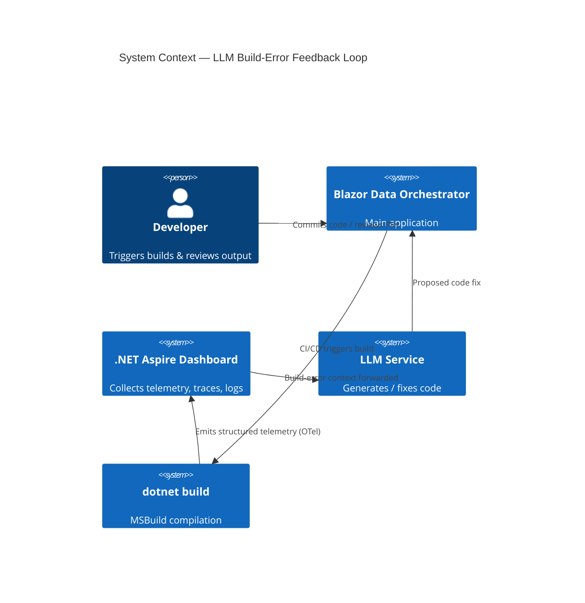
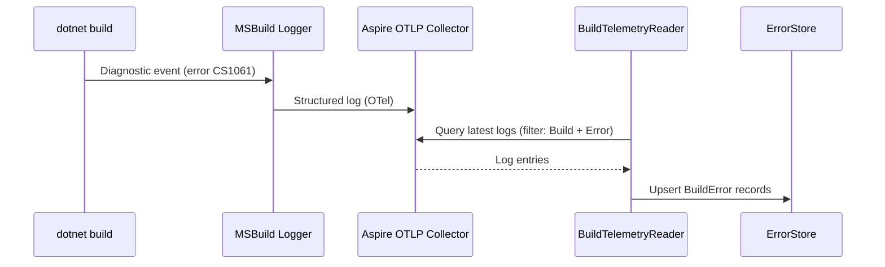
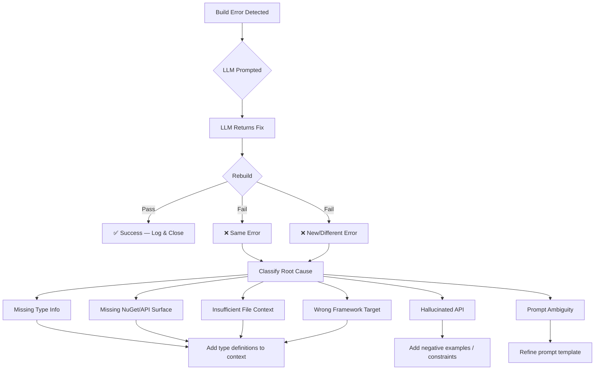
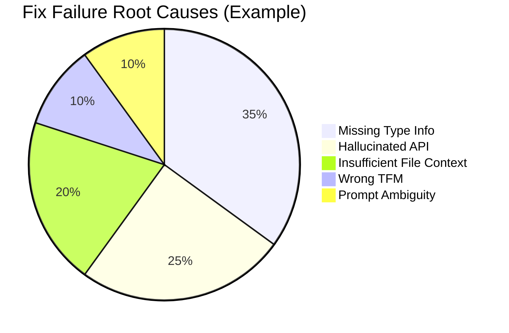
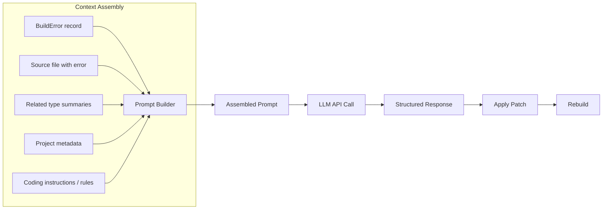
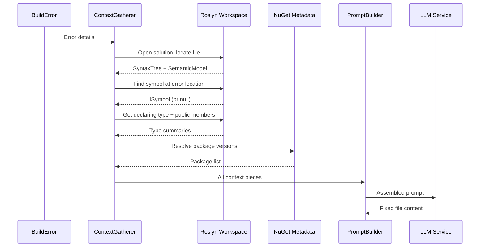
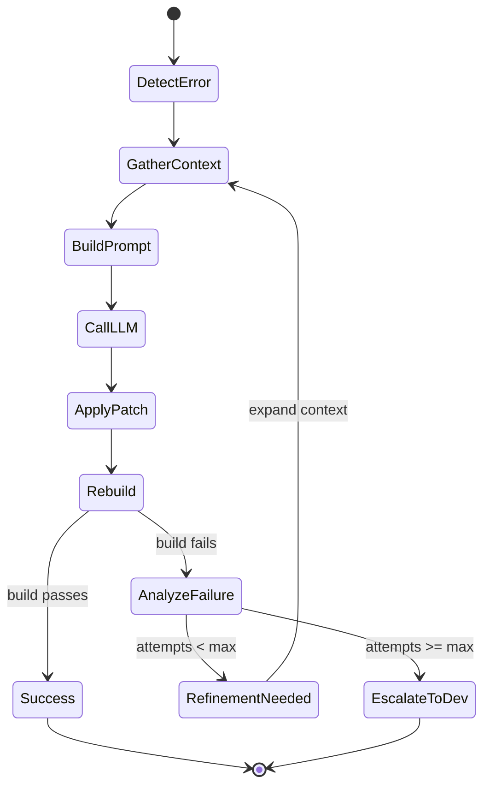
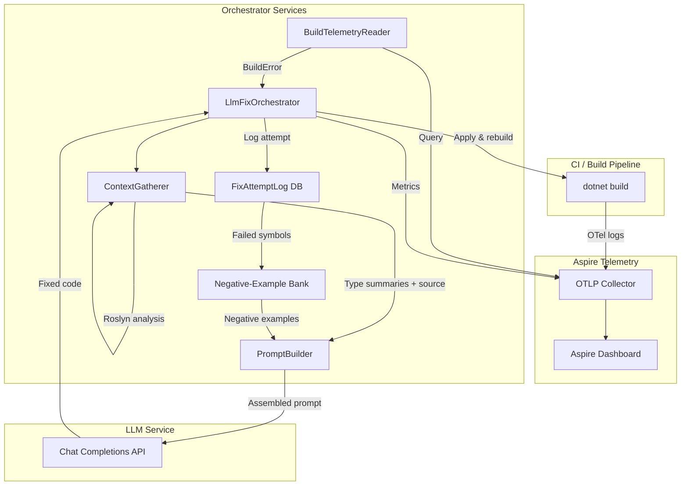
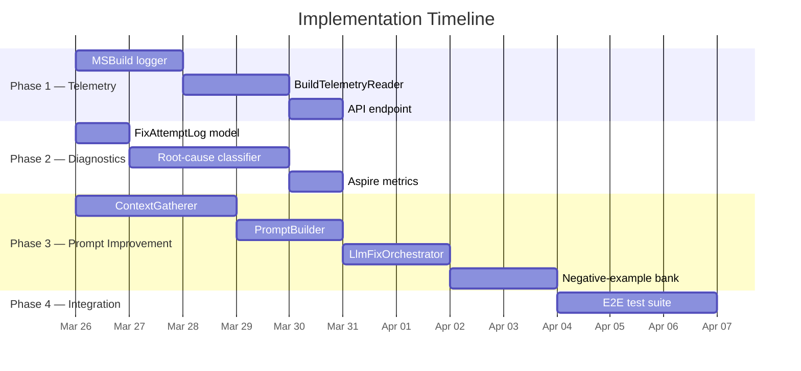

# LLM Build Error Resolution — Implementation Plan

## 1. Executive Summary

This document outlines a structured plan for diagnosing and improving the LLM-assisted code generation pipeline in the Blazor Data Orchestrator project. The three core objectives are:

1. **Instrument Aspire telemetry** to surface the latest build errors in a consumable format.
2. **Root-cause why the LLM fails** to fix those errors — identifying information gaps, context-window limits, and prompt deficiencies.
3. **Improve the LLM prompt** so that code generation succeeds more often on the first attempt.

---

## 2. System Context



---

## 3. Feature 1 — Surface Build Errors from Aspire Telemetry

### 3.1 Goal

Automatically collect the **latest build errors** from .NET Aspire's OpenTelemetry pipeline and present them in a structured, machine-readable format that downstream tooling (including the LLM) can consume.

### 3.2 Current State Analysis

| Signal | Source | Format |
|--------|--------|--------|
| Build warnings/errors | `dotnet build` stdout/stderr | Unstructured text |
| Traces | Aspire OTLP exporter | Protobuf / JSON |
| Structured logs | Aspire logging provider | `ILogger` → OTLP |
| Metrics | Aspire metrics | OTLP Metrics |

### 3.3 Implementation Steps

#### 3.3.1 Enable Structured Build Logging

Configure `Directory.Build.props` (or the AppHost) to emit MSBuild binary logs and forward diagnostics through a custom `ILogger` category:

- Add a custom MSBuild logger that writes `error`/`warning` events as **structured log entries** with these fields:
  - `error_code` (e.g. `CS1061`)
  - `file_path`
  - `line_number`
  - `column_number`
  - `message`
  - `project`
  - `target_framework`
- Register the logger in the Aspire AppHost service defaults so it flows through OTLP.

#### 3.3.2 Query Aspire Telemetry

Create a service (`BuildTelemetryReader`) that:

1. Connects to the Aspire Dashboard's OTLP endpoint (gRPC or HTTP).
2. Queries for the **most recent** structured logs where `CategoryName == "Build"` and `LogLevel >= Error`.
3. Deserializes them into a strongly-typed `BuildError` record.



#### 3.3.3 Data Model

```csharp
public sealed record BuildError(
    string ErrorCode,
    string Message,
    string FilePath,
    int Line,
    int Column,
    string Project,
    string TargetFramework,
    DateTimeOffset Timestamp);
```

#### 3.3.4 Dashboard Integration (Optional)

Expose a `/api/build-errors/latest` endpoint that returns the last N errors as JSON. This endpoint is consumed by both the UI and the LLM prompt-builder.

#### 3.3.5 Acceptance Criteria

- [ ] After a failed build, `BuildTelemetryReader` returns ≥ 1 `BuildError` within 5 seconds.
- [ ] Each `BuildError` contains all fields listed above (no nulls except `Column` when unavailable).
- [ ] Errors are queryable by project name and time range.

---

## 4. Feature 2 — Diagnose Why the LLM Fails to Fix Build Errors

### 4.1 Goal

Systematically determine **what information the LLM is missing** or **what contextual signals are inadequate**, causing it to produce invalid fixes for build errors.

### 4.2 Diagnostic Framework



### 4.3 Root-Cause Categories

| # | Category | Symptom | Likely Cause | Remediation |
|---|----------|---------|--------------|-------------|
| 1 | **Missing Type Information** | LLM references a property/method that doesn't exist on the type | Only the error message was provided; the type's public API surface was not included | Include the relevant `.cs` file or a summary of the type |
| 2 | **Missing NuGet / SDK API** | LLM invents an extension method or uses a removed overload | No package version or API reference was in context | Inject the relevant XML-doc summary or a link to the API reference |
| 3 | **Insufficient File Context** | Fix compiles in isolation but breaks usages elsewhere | Only the single file was sent | Expand context window to include **callers** and **dependents** |
| 4 | **Hallucinated API** | LLM fabricates a plausible-sounding method | Training data is stale or generic | Add explicit "do NOT use methods not present in the provided type summaries" constraint |
| 5 | **Wrong Target Framework** | Fix uses APIs available in `net9.0` but project targets `net8.0` | TFM not communicated | Include `<TargetFramework>` in prompt |
| 6 | **Prompt Ambiguity** | LLM returns multiple possible fixes or hedges | Prompt lacks a single, clear instruction | Rewrite prompt to be imperative with one expected output format |

### 4.4 Implementation Steps

#### 4.4.1 Build a Feedback Ledger

Create a `FixAttemptLog` that records every LLM interaction:

```csharp
public sealed record FixAttempt(
    Guid Id,
    BuildError OriginalError,
    string PromptSent,
    string LlmResponse,
    bool RebuildSucceeded,
    BuildError? ResidualError,
    string? RootCauseCategory,    // from enum
    DateTimeOffset Timestamp);
```

Persist this in an **in-memory store** (e.g., `ConcurrentDictionary` or an in-memory `IMemoryCache`) for runtime analysis. This avoids external database dependencies and keeps the feedback loop lightweight.

#### 4.4.2 Automated Classification

After a failed rebuild:

1. Compare `OriginalError.ErrorCode` with `ResidualError.ErrorCode`.
   - Same code + same location → **Insufficient context** or **Hallucinated API**.
   - Same code + different location → **Incomplete fix** (partial application).
   - Different code → **Regression** introduced by the fix.
2. Run a lightweight heuristic classifier:
   - If the LLM response references a symbol not present in any provided context → tag `HallucinatedAPI`.
   - If the error code is `CS0246` (type not found) and the type exists in a NuGet package not listed → tag `MissingNuGet`.
3. Store the tag in `RootCauseCategory`.

#### 4.4.3 Reporting Dashboard

Expose an Aspire-compatible metric:

- `llm.fix_attempt.total` (counter, tagged by `outcome: success|same_error|new_error`)
- `llm.fix_attempt.root_cause` (counter, tagged by category)



#### 4.4.4 Acceptance Criteria

- [ ] Every LLM fix attempt is logged with full prompt, response, and rebuild outcome.
- [ ] At least 80 % of failed attempts are auto-classified into one of the six categories.
- [ ] Metrics are visible in the Aspire dashboard within 10 seconds of a rebuild.

---

## 5. Feature 3 — Improve the LLM Prompt for Higher Fix Success Rate

### 5.1 Goal

Redesign the prompt template so the LLM receives **sufficient, well-structured context** and **clear constraints**, raising the first-attempt fix rate from its current baseline to ≥ 80 %.

### 5.2 Prompt Architecture



### 5.3 Prompt Template Design

The new prompt is composed of **six sections**, each injected dynamically:

#### Section 1 — System Role

```text
You are a senior C# / .NET developer. You fix build errors in a Blazor application
that uses .NET Aspire for orchestration. You MUST only use types, methods, and
properties that are explicitly listed in the "Available API Surface" section below.
Do NOT invent or hallucinate any APIs.
```

#### Section 2 — Project Metadata

```text
## Project Metadata
- Solution: Blazor-Data-Orchestrator
- Project: {{project_name}}
- Target Framework: {{target_framework}}
- Aspire version: {{aspire_version}}
- Key NuGet packages:
{{#each packages}}
  - {{this.Id}} {{this.Version}}
{{/each}}
```

#### Section 3 — Build Error

```text
## Build Error
- Code: {{error.ErrorCode}}
- Message: {{error.Message}}
- File: {{error.FilePath}}
- Line: {{error.Line}}, Column: {{error.Column}}
```

#### Section 4 — Source File

````text
## Source File ({{error.FilePath}})
```csharp
{{file_contents_with_line_numbers}}
```
````

#### Section 5 — Available API Surface

````text
## Available API Surface
The following type summaries are the ONLY APIs you may reference.

{{#each related_types}}
### {{this.FullName}}
```csharp
{{this.PublicMemberSummary}}
```
{{/each}}
````

#### Section 6 — Output Format Constraint

```text
## Instructions
1. Identify the root cause of the build error.
2. Produce a SINGLE corrected version of the file.
3. Output ONLY a fenced C# code block containing the entire corrected file.
4. Do NOT add explanatory text outside the code block.
5. Do NOT introduce new NuGet packages.
6. Preserve all existing `using` directives unless one is the cause of the error.
```

### 5.4 Context-Gathering Pipeline



### 5.5 Implementation Steps

#### 5.5.1 Build `ContextGatherer` Service

- Use `Microsoft.CodeAnalysis.MSBuild.MSBuildWorkspace` to open the solution.
- For a given `BuildError`, locate the `Document`, parse the `SyntaxTree`, and obtain the `SemanticModel`.
- At the error's `(Line, Column)`, find the enclosing `SyntaxNode` and resolve its `ISymbol`.
- Walk up to the declaring `INamedTypeSymbol`; extract public members as a summary string.
- Also include **immediate dependents**: any type referenced in the same method body.

#### 5.5.2 Build `PromptBuilder` Service

- Accept `BuildError`, source file text, list of type summaries, and project metadata.
- Render the six-section template (use a simple Handlebars-style or string-interpolation engine).
- Enforce a **token budget**: if the assembled prompt exceeds a configurable limit (e.g., 12 000 tokens), progressively trim:
  1. Remove the least-relevant type summaries (ranked by distance from the error symbol).
  2. Truncate the source file to ±50 lines around the error.
  3. Summarize NuGet packages (top 10 only).

#### 5.5.3 Build `LlmFixOrchestrator` Service

Coordinates the full loop:



- **Max attempts**: configurable (default 3).
- On each retry, the `ContextGatherer` **expands** its search radius (include more related types, callers, etc.).
- On final failure, create a structured report for the developer containing the full `FixAttemptLog` chain.

#### 5.5.4 Negative-Example Injection

For error codes that historically produce hallucinated fixes, inject a "Do NOT" section:

```text
## Common Mistakes to Avoid for {{error.ErrorCode}}
{{#each negative_examples}}
- Do NOT use `{{this.BadSymbol}}`; it does not exist. Use `{{this.CorrectAlternative}}` instead.
{{/each}}
```

Populate this from the `FixAttemptLog` — any symbol that appeared in a failed LLM response but was not in the provided API surface gets added to the negative-example bank.

#### 5.5.5 Acceptance Criteria

- [ ] Prompt template includes all six sections.
- [ ] `ContextGatherer` resolves the correct `INamedTypeSymbol` for ≥ 90 % of `CS1061` errors.
- [ ] Token budget is respected; prompt never exceeds the configured limit.
- [ ] First-attempt fix rate improves by ≥ 20 percentage points over baseline (measured on the `FixAttemptLog`).
- [ ] Negative-example bank is auto-populated after ≥ 5 failed attempts for the same error code.

---

## 6. End-to-End Architecture



---

## 7. Milestones & Sequencing

| Phase | Milestone | Depends On | Est. Effort |
|-------|-----------|------------|-------------|
| **1a** | MSBuild structured logger → Aspire OTLP | — | 2 days |
| **1b** | `BuildTelemetryReader` service | 1a | 2 days |
| **1c** | `/api/build-errors/latest` endpoint | 1b | 1 day |
| **2a** | `FixAttemptLog` data model + persistence | — | 1 day |
| **2b** | Automated root-cause classifier | 2a, 1b | 3 days |
| **2c** | Aspire metrics for fix outcomes | 2b | 1 day |
| **3a** | `ContextGatherer` (Roslyn workspace) | — | 3 days |
| **3b** | `PromptBuilder` (template + token budget) | 3a | 2 days |
| **3c** | `LlmFixOrchestrator` (retry loop) | 3b, 1b, 2a | 2 days |
| **3d** | Negative-example bank | 2b, 3b | 2 days |
| **4** | End-to-end integration test suite | All above | 3 days |



---

## 8. Key Design Decisions

| Decision | Rationale |
|----------|-----------|
| Use Roslyn `MSBuildWorkspace` for context gathering | Provides full semantic analysis — no guessing about types or members |
| Persist `FixAttemptLog` in-memory | Zero infrastructure overhead; no external database dependency; fast runtime access |
| Template-based prompt (not free-form) | Reproducible, testable, version-controlled |
| Token-budget trimming strategy | Prevents context-window overflow while keeping the most relevant information |
| Negative-example bank auto-populated from failures | Self-improving system; reduces repeat hallucinations over time |
| Max 3 retry attempts before escalation | Balances automation with developer time; avoids infinite loops |

---

## 9. Success Metrics

| Metric | Baseline | Target | Measurement |
|--------|----------|--------|-------------|
| First-attempt fix rate | TBD (measure in Phase 2) | ≥ 80 % | `FixAttemptLog` query |
| Mean time to successful fix | TBD | < 60 seconds | Aspire trace duration |
| Hallucinated API rate | TBD | < 5 % | Root-cause classifier |
| Developer escalation rate | 100 % (manual today) | < 20 % | `FixAttemptLog` |

---

## 10. Risks & Mitigations

| Risk | Impact | Mitigation |
|------|--------|------------|
| Roslyn workspace fails to open solution | Context gathering blocked | Fall back to regex-based type extraction from source files |
| LLM token limit exceeded despite trimming | Prompt rejected by API | Implement a hard fallback: send only error + source file (no type summaries) |
| Aspire OTLP endpoint not reachable in CI | No telemetry | Write build errors to a JSON file as a secondary channel |
| Negative-example bank grows unbounded | Prompt bloat | Cap at 10 entries per error code; evict oldest |
| LLM API rate limits | Retry loop stalls | Implement exponential backoff + circuit breaker |
