# LLM-Driven NuGet `.nuspec` Auto-Configuration Plan

This document describes the implementation plan for enabling the AI code assistant to **automatically generate and update the `.nuspec` file** when it produces C# job code that references third-party NuGet packages (e.g., `SendGrid`, `HtmlAgilityPack`). It also covers ensuring the `.nuspec` file is always visible and editable in the file dropdown for end-user manual editing.

---

## Table of Contents

1. [Problem Statement](#problem-statement)
2. [Current Architecture](#current-architecture)
3. [Proposed Solution Overview](#proposed-solution-overview)
4. [Feature 1: LLM Instructions for `.nuspec` Generation](#feature-1-llm-instructions-for-nuspec-generation)
5. [Feature 2: Auto-Parse `// NUGET:` Headers into `.nuspec`](#feature-2-auto-parse--nuget-headers-into-nuspec)
6. [Feature 3: Always Show `.nuspec` in File Dropdown](#feature-3-always-show-nuspec-in-file-dropdown)
7. [Feature 4: AI Chat Nuspec Context Awareness](#feature-4-ai-chat-nuspec-context-awareness)
8. [Detailed Implementation](#detailed-implementation)
9. [End-to-End Flow Diagrams](#end-to-end-flow-diagrams)
10. [File Change Summary](#file-change-summary)
11. [Testing & Validation](#testing--validation)
12. [Acceptance Criteria](#acceptance-criteria)

---

## Problem Statement

When a user asks the AI code assistant to generate C# job code that uses third-party NuGet packages (e.g., `SendGrid`, `HtmlAgilityPack`), the following problems occur:

1. **The AI generates `// NUGET:` comment headers** in the `main.cs` file (as instructed), but these comments are **never parsed into the `.nuspec` file** by the web editor — so the `CSharpCompilationService` sees "No NuGet dependencies to resolve" and compilation fails.

2. **The `.nuspec` file only appears in the file dropdown** when a NuGet package has been loaded (uploaded) that already contains one. For **new jobs** (created from the default template), there is no `.nuspec` file in the dropdown — the user has no way to declare NuGet dependencies.

3. **The AI assistant does not know** it should also generate or update the `.nuspec` file content. Its current instructions only tell it to put `// NUGET:` comments in the code, which is the format used by the `CodeExecutorService` (agent-side runtime), not the `CSharpCompilationService` (web-side Roslyn compilation).

### Observed Telemetry

| Metric | Before Fix | After Assembly Fix | Target |
|--------|-----------|-------------------|--------|
| Standard refs | 31 | 93 | 93+ |
| Final refs | 30 | 72 | 72+ NuGet |
| Compilation errors | 16 | 9 (all NuGet-related) | 0 |

The 9 remaining errors are all `SendGrid` and `HtmlAgilityPack` — packages that exist in the code's `using` statements but were never declared in a `.nuspec` for resolution.

---

## Current Architecture

### System Component Overview

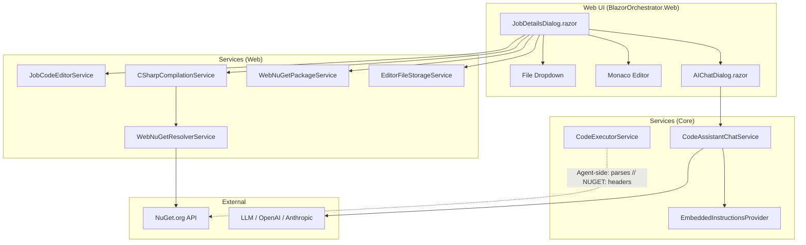

### Current NuGet Dependency Flow

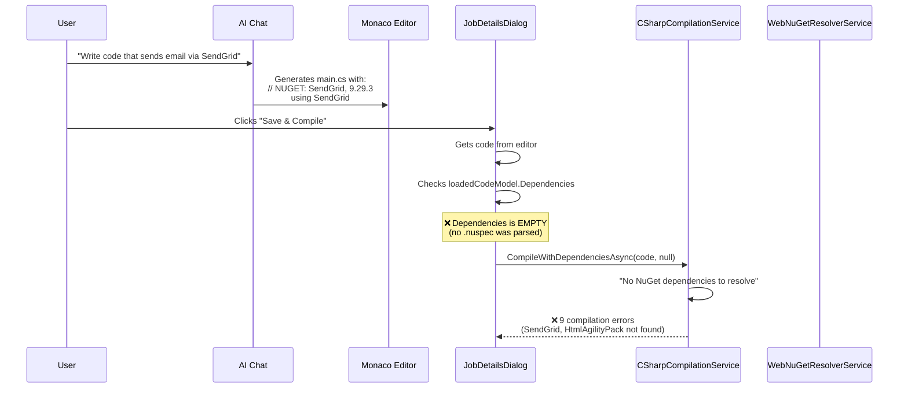

### Gap Analysis

| Step | What Happens | What Should Happen |
|------|-------------|-------------------|
| AI generates code | Adds `// NUGET:` comments to `main.cs` | Should **also** generate/update `.nuspec` XML |
| File dropdown (new job) | Shows: `main.cs`, `appsettings.json`, `appsettings.Production.json` | Should **also** show `.nuspec` |
| Save & Compile | Checks `loadedCodeModel.Dependencies` — empty | Should parse `// NUGET:` headers → populate `.nuspec` → pass to compiler |
| End-user editing | No `.nuspec` visible for new jobs | `.nuspec` always visible and editable |

---

## Proposed Solution Overview

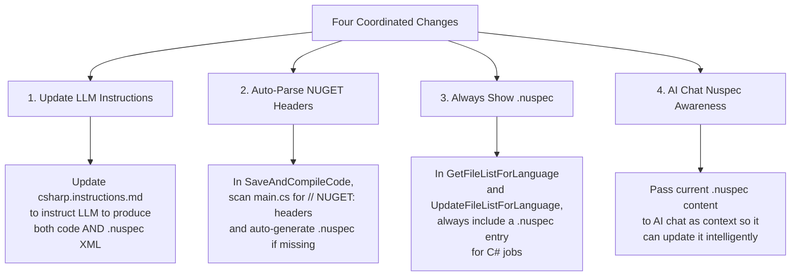

---

## Feature 1: LLM Instructions for `.nuspec` Generation

### 1.1 Two LLM Contexts — Why Both Must Be Updated

There are **two separate LLMs** that generate code for Blazor Data Orchestrator jobs. Each one loads its instructions from a different location and **neither can see the other's files**:

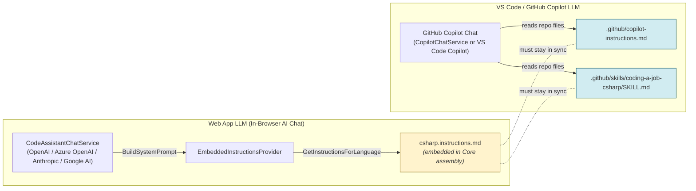

| LLM Context | Service Class | Instruction Source | Can See `.nuspec` File? |
|---|---|---|---|
| **Web App** AI Chat | `CodeAssistantChatService` | `EmbeddedInstructionsProvider` → `csharp.instructions.md` (embedded resource in `BlazorDataOrchestrator.Core.dll`) | ❌ Not by default — only what is passed via `SetCurrentEditorCode()` |
| **VS Code** Copilot Chat | `CopilotChatService` | Fallback chain: 1) Local `Resources/` folder → 2) Embedded resource → 3) `.github/skills/` path | ❌ Same limitation |
| **GitHub Copilot** (IDE) | VS Code Copilot agent | `.github/copilot-instructions.md` and `.github/skills/coding-a-job-csharp/SKILL.md` (repo files) | ❌ Cannot see `csharp.instructions.md` embedded in the assembly |

> **Key insight:** The GitHub Copilot LLM running in VS Code **cannot see** the `csharp.instructions.md` file embedded inside the `BlazorDataOrchestrator.Core` assembly. It reads `.github/copilot-instructions.md` and `.github/skills/coding-a-job-csharp/SKILL.md` from the repo root. All instruction sources must be updated **and kept in sync**.

### 1.2 Problem

The current instructions (in all four files) tell the AI to use `// NUGET:` comment headers. This format is only parsed by the **agent-side** `CodeExecutorService.ParseNuGetRequirements()`. The **web-side** compilation uses `.nuspec` XML parsed by `JobCodeEditorService.ParseNuSpecDependencies()`. None of the instruction files mention `.nuspec` at all.

### 1.3 Solution

Update **all four** instruction files to tell the AI to produce **both**:
1. The `// NUGET:` comment headers in `main.cs` (backward compatibility with agent execution).
2. A properly formatted `.nuspec` XML block (for web compilation via `WebNuGetResolverService`).

### 1.4 Instruction Files to Update

| File Path | Used By | Action |
|-----------|---------|--------|
| `src/BlazorDataOrchestrator.Core/Resources/csharp.instructions.md` | Web App LLM (`CodeAssistantChatService` via `EmbeddedInstructionsProvider`) | Add `.nuspec` section |
| `src/BlazorDataOrchestrator.JobCreatorTemplate/Resources/csharp.instructions.md` | Job Creator Template LLM (`CopilotChatService` embedded fallback) | Add same section (keep in sync) |
| `BlazorDataOrchestrator/.github/skills/coding-a-job-csharp/SKILL.md` | GitHub Copilot (VS Code — cannot see embedded resources) | Add same section (keep in sync) |
| `BlazorDataOrchestrator/.github/copilot-instructions.md` | GitHub Copilot (VS Code — repo-level instructions) | Add same section (keep in sync) |

### 1.5 Updated Instructions Content

The following section should be **appended** after the existing "## 1. NuGet Dependencies" section in all four files listed above. The existing `// NUGET:` header instructions should be preserved, and this new section added immediately after:

````markdown
## 1b. NuGet Package Configuration (`.nuspec` File)

When your code requires third-party NuGet packages, you MUST provide **two things**:

### A. Comment Headers in `main.cs` (required — keep existing behavior)

Place `// NUGET:` comments at the very top of `main.cs`:

```csharp
// NUGET: SendGrid, 9.29.3
// NUGET: HtmlAgilityPack, 1.11.72
using System;
using SendGrid;
using SendGrid.Helpers.Mail;
using HtmlAgilityPack;
// ... rest of code
```

### B. `.nuspec` File Content (required — NEW)

You MUST also provide the `.nuspec` file content so the web editor can resolve
and download the NuGet packages at compile time. Wrap the `.nuspec` XML between
the markers `###NUSPEC BEGIN###` and `###NUSPEC END###`:

###NUSPEC BEGIN###
```xml
<?xml version="1.0" encoding="utf-8"?>
<package xmlns="http://schemas.microsoft.com/packaging/2013/05/nuspec.xsd">
  <metadata>
    <id>BlazorDataOrchestrator.Job</id>
    <version>1.0.0</version>
    <authors>BlazorDataOrchestrator</authors>
    <description>Auto-generated job package (csharp)</description>
    <contentFiles>
      <files include="**/*" buildAction="Content" copyToOutput="true" />
    </contentFiles>
    <dependencies>
      <group targetFramework="net10.0">
        <dependency id="SendGrid" version="9.29.3" />
        <dependency id="HtmlAgilityPack" version="1.11.72" />
      </group>
    </dependencies>
  </metadata>
</package>
```
###NUSPEC END###

**Rules:**
- The `targetFramework` MUST be `net10.0`.
- Every package listed in `// NUGET:` headers MUST also appear as a `<dependency>` in the `.nuspec`.
- Use stable (non-prerelease) versions only.
- If updating existing code that already has packages, preserve existing dependencies and add new ones.
````

### 1.6 Full Worked Example — Expected LLM Output

This section shows the **complete expected response** from the LLM when a user asks:
> *"Write a job that sends an email via SendGrid and scrapes a web page with HtmlAgilityPack."*

The LLM should produce a response containing **both** the `main.cs` code block and the `.nuspec` block. Below is exactly what the AI assistant should output:

---

#### Expected AI Response (verbatim)

Here is the complete job code with SendGrid email and HtmlAgilityPack web scraping:

###UPDATED CODE BEGIN###
```csharp
// NUGET: SendGrid, 9.29.3
// NUGET: HtmlAgilityPack, 1.11.72
using System;
using System.Collections.Generic;
using System.Net.Http;
using System.Text.Json;
using System.Threading.Tasks;
using Microsoft.EntityFrameworkCore;
using BlazorDataOrchestrator.Core;
using BlazorDataOrchestrator.Core.Data;
using SendGrid;
using SendGrid.Helpers.Mail;
using HtmlAgilityPack;

public class BlazorDataOrchestratorJob
{
    public static async Task<List<string>> ExecuteJob(
        string appSettings, int jobAgentId, int jobId,
        int jobInstanceId, int jobScheduleId, string webAPIParameter)
    {
        var logs = new List<string>();
        string connectionString = "";
        string tableConnectionString = "";

        try
        {
            var settings = JsonSerializer.Deserialize<JsonElement>(appSettings);
            if (settings.TryGetProperty("ConnectionStrings", out var connStrings))
            {
                if (connStrings.TryGetProperty("blazororchestratordb", out var defaultConn))
                    connectionString = defaultConn.GetString() ?? "";
                if (connStrings.TryGetProperty("tables", out var tableConn))
                    tableConnectionString = tableConn.GetString() ?? "";
            }
        }
        catch { }

        ApplicationDbContext? dbContext = null;
        if (!string.IsNullOrEmpty(connectionString))
        {
            var optionsBuilder = new DbContextOptionsBuilder<ApplicationDbContext>();
            optionsBuilder.UseSqlServer(connectionString);
            dbContext = new ApplicationDbContext(optionsBuilder.Options);
        }

        try
        {
            if (jobId <= 0 && jobInstanceId > 0 && dbContext != null)
                jobId = await JobManager.GetJobIdFromInstanceAsync(dbContext, jobInstanceId);

            await JobManager.LogProgress(dbContext, jobInstanceId, "Job started", "Info", tableConnectionString);
            logs.Add("Job started");

            // --- Step 1: Scrape a web page with HtmlAgilityPack ---
            var web = new HtmlWeb();
            var doc = web.Load("https://example.com");
            var title = doc.DocumentNode.SelectSingleNode("//title")?.InnerText ?? "(no title)";
            string scrapeMsg = $"Scraped page title: {title}";
            await JobManager.LogProgress(dbContext, jobInstanceId, scrapeMsg, "Info", tableConnectionString);
            logs.Add(scrapeMsg);

            // --- Step 2: Send email via SendGrid ---
            string sendGridApiKey = "YOUR_SENDGRID_API_KEY"; // Replace or load from appSettings
            var client = new SendGridClient(sendGridApiKey);
            var from = new EmailAddress("sender@example.com", "Data Orchestrator");
            var to = new EmailAddress("recipient@example.com", "Recipient");
            var msg = MailHelper.CreateSingleEmail(
                from, to,
                $"Scraped Title: {title}",
                $"The page title is: {title}",
                $"<strong>The page title is:</strong> {title}");

            var response = await client.SendEmailAsync(msg);
            string emailMsg = $"SendGrid response: {response.StatusCode}";
            await JobManager.LogProgress(dbContext, jobInstanceId, emailMsg, "Info", tableConnectionString);
            logs.Add(emailMsg);

            await JobManager.LogProgress(dbContext, jobInstanceId, "Job completed successfully!", "Info", tableConnectionString);
            logs.Add("Job completed successfully!");
        }
        catch (Exception ex)
        {
            string errorMsg = $"Job execution error: {ex.Message}";
            Console.WriteLine(errorMsg);
            await JobManager.LogError(dbContext, jobInstanceId, errorMsg, ex.StackTrace, tableConnectionString);
            logs.Add(errorMsg);
            throw;
        }
        finally
        {
            dbContext?.Dispose();
        }

        return logs;
    }
}
```
###UPDATED CODE END###

The job also requires a `.nuspec` file for NuGet dependency resolution during compilation:

###NUSPEC BEGIN###
```xml
<?xml version="1.0" encoding="utf-8"?>
<package xmlns="http://schemas.microsoft.com/packaging/2013/05/nuspec.xsd">
  <metadata>
    <id>BlazorDataOrchestrator.Job</id>
    <version>1.0.0</version>
    <authors>BlazorDataOrchestrator</authors>
    <description>Auto-generated job package (csharp)</description>
    <contentFiles>
      <files include="**/*" buildAction="Content" copyToOutput="true" />
    </contentFiles>
    <dependencies>
      <group targetFramework="net10.0">
        <dependency id="SendGrid" version="9.29.3" />
        <dependency id="HtmlAgilityPack" version="1.11.72" />
      </group>
    </dependencies>
  </metadata>
</package>
```
###NUSPEC END###

---

> **Note for implementers:** The system's `OnAICodeApplied` handler (see [Feature 4](#feature-4-ai-chat-nuspec-context-awareness)) will parse the `###NUSPEC BEGIN###` / `###NUSPEC END###` block, extract the XML, store it in `EditorFileStorageService`, and strip the block before applying the code to the Monaco editor.

### 1.7 Instruction Flow — Both LLM Contexts

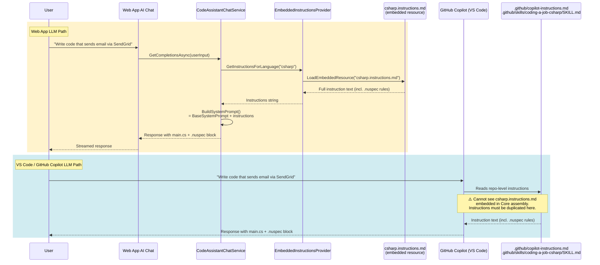

---

## Feature 2: Auto-Parse `// NUGET:` Headers into `.nuspec`

### 2.1 Problem

Even after updating the LLM instructions, there are scenarios where the `.nuspec` won't be updated:
- The user manually types `// NUGET:` headers without using the AI.
- The AI fails to produce the `.nuspec` block (model variability).
- The user edits `main.cs` code directly and adds new package references.

### 2.2 Solution

Add a **fallback mechanism** in `SaveAndCompileCode()` that:
1. Scans `main.cs` for `// NUGET:` comment headers.
2. If headers are found but no `.nuspec` dependencies exist, **auto-generates** a `.nuspec` file.
3. If a `.nuspec` already exists, **merges** any new `// NUGET:` dependencies into it.

### 2.3 Architecture

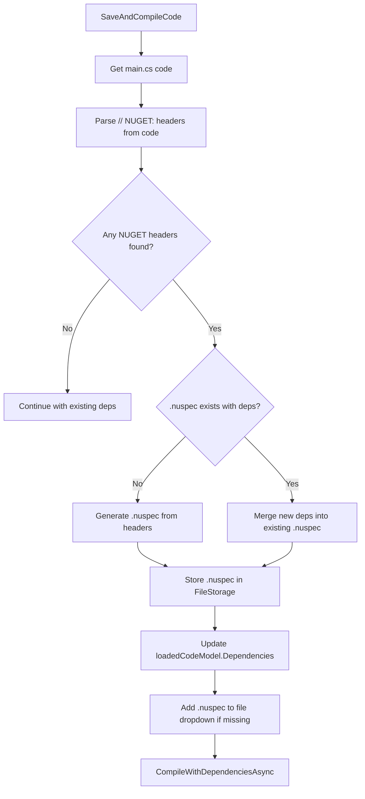

### 2.4 New Method: `ParseNuGetHeadersFromCode()`

Add to `JobCodeEditorService.cs`:

```csharp
/// <summary>
/// Parses // NUGET: comment headers from C# code.
/// Format: // NUGET: PackageId, Version
/// </summary>
public List<NuGetDependencyInfo> ParseNuGetHeadersFromCode(string code)
{
    var dependencies = new List<NuGetDependencyInfo>();
    var regex = new Regex(
        @"//\s*(?:NUGET|REQUIRES\s+NUGET):\s*(\S+)\s*,\s*(\S+)",
        RegexOptions.IgnoreCase | RegexOptions.Multiline);

    foreach (Match match in regex.Matches(code))
    {
        dependencies.Add(new NuGetDependencyInfo
        {
            PackageId = match.Groups[1].Value.Trim(),
            Version = match.Groups[2].Value.Trim(),
            TargetFramework = "net10.0"
        });
    }

    return dependencies;
}
```

### 2.5 New Method: `GenerateNuspecFromDependencies()`

Add to `JobCodeEditorService.cs`:

```csharp
/// <summary>
/// Generates a .nuspec XML string from a list of NuGet dependencies.
/// </summary>
public string GenerateNuspecFromDependencies(
    List<NuGetDependencyInfo> dependencies,
    string packageId = "BlazorDataOrchestrator.Job")
{
    var depElements = string.Join("\n        ",
        dependencies.Select(d =>
            $@"<dependency id=""{d.PackageId}"" version=""{d.Version}"" />"));

    return $@"<?xml version=""1.0"" encoding=""utf-8""?>
<package xmlns=""http://schemas.microsoft.com/packaging/2013/05/nuspec.xsd"">
  <metadata>
    <id>{packageId}</id>
    <version>1.0.0</version>
    <authors>BlazorDataOrchestrator</authors>
    <description>Auto-generated job package (csharp)</description>
    <contentFiles>
      <files include=""**/*"" buildAction=""Content"" copyToOutput=""true"" />
    </contentFiles>
    <dependencies>
      <group targetFramework=""net10.0"">
        {depElements}
      </group>
    </dependencies>
  </metadata>
</package>";
}
```

### 2.6 New Method: `MergeNuGetDependencies()`

Add to `JobCodeEditorService.cs`:

```csharp
/// <summary>
/// Merges new dependencies into an existing .nuspec, preserving existing ones.
/// Returns the updated .nuspec XML string.
/// </summary>
public string MergeNuGetDependencies(
    string existingNuspec,
    List<NuGetDependencyInfo> newDependencies)
{
    var existingDeps = ParseNuSpecDependencies(existingNuspec);
    var merged = new List<NuGetDependencyInfo>(existingDeps);

    foreach (var newDep in newDependencies)
    {
        if (!merged.Any(d =>
            d.PackageId.Equals(newDep.PackageId, StringComparison.OrdinalIgnoreCase)))
        {
            merged.Add(newDep);
        }
    }

    return GenerateNuspecFromDependencies(merged);
}
```

### 2.7 Updated `SaveAndCompileCode()` Flow

In `JobDetailsDialog.razor`, add the auto-parse step **before** compilation:

```csharp
// --- NEW: Auto-parse // NUGET: headers from main.cs ---
if (codeLanguage == "csharp")
{
    var mainCode = FileStorage.GetFile(JobId, "main.cs") ?? currentJobCode;
    var headerDeps = CodeEditorService.ParseNuGetHeadersFromCode(mainCode);

    if (headerDeps.Any())
    {
        var existingNuspec = loadedCodeModel?.NuspecContent;

        string updatedNuspec;
        if (!string.IsNullOrWhiteSpace(existingNuspec))
        {
            updatedNuspec = CodeEditorService.MergeNuGetDependencies(
                existingNuspec, headerDeps);
        }
        else
        {
            updatedNuspec = CodeEditorService.GenerateNuspecFromDependencies(headerDeps);
        }

        // Store the generated/updated .nuspec
        var nuspecFileName = $"BlazorDataOrchestrator.Job.nuspec";
        FileStorage.SetFile(JobId, nuspecFileName, updatedNuspec);
        FileStorage.SetNuspecContent(JobId, updatedNuspec, nuspecFileName);

        var parsedDeps = CodeEditorService.ParseNuSpecDependencies(updatedNuspec);
        FileStorage.SetDependencies(JobId, parsedDeps);

        if (loadedCodeModel != null)
        {
            loadedCodeModel.NuspecContent = updatedNuspec;
            loadedCodeModel.NuspecFileName = nuspecFileName;
            loadedCodeModel.Dependencies = parsedDeps;
        }

        // Ensure .nuspec appears in the file dropdown
        if (!codeFileList.Contains(nuspecFileName))
        {
            codeFileList.Add(nuspecFileName);
        }
    }
}
```

---

## Feature 3: Always Show `.nuspec` in File Dropdown

### 3.1 Problem

The `.nuspec` file only appears in the dropdown when:
- A package was uploaded that contained a `.nuspec` file.
- `loadedCodeModel.NuspecFileName` is not null.

For **new jobs** created from the default template, no `.nuspec` exists.

### 3.2 Solution

Always include a `.nuspec` entry in the file dropdown for C# jobs. If no `.nuspec` content exists yet, generate an **empty template** when the user selects it.

### 3.3 Changes

#### 3.3.1 Update `GetFileListForLanguage()` in `JobCodeEditorService.cs`

```csharp
public List<string> GetFileListForLanguage(string language)
{
    return language.ToLower() switch
    {
        "csharp" or "cs" => new List<string>
        {
            "main.cs",
            "appsettings.json",
            "appsettings.Production.json",
            "BlazorDataOrchestrator.Job.nuspec"   // ← Always include
        },
        "python" or "py" => new List<string>
        {
            "main.py",
            "requirements.txt",
            "appsettings.json",
            "appsettings.Production.json"
        },
        _ => new List<string>
        {
            "main.cs",
            "appsettings.json",
            "appsettings.Production.json",
            "BlazorDataOrchestrator.Job.nuspec"
        }
    };
}
```

#### 3.3.2 Update `UpdateFileListForLanguage()` in `JobDetailsDialog.razor`

```csharp
private void UpdateFileListForLanguage()
{
    if (codeLanguage == "csharp")
    {
        var files = new List<string>
        {
            "main.cs",
            "appsettings.json",
            "appsettings.Production.json"
        };

        // Add .nuspec — use the name from the loaded model if available,
        // otherwise use the default name.
        var nuspecName = loadedCodeModel?.NuspecFileName
            ?? "BlazorDataOrchestrator.Job.nuspec";
        if (!files.Contains(nuspecName))
        {
            files.Add(nuspecName);
        }

        codeFileList = files;
    }
    else
    {
        codeFileList = CodeEditorService.GetFileListForLanguage(codeLanguage);
    }

    // Preserve current selection if valid, otherwise select main file
    if (!codeFileList.Contains(selectedCodeFile))
    {
        selectedCodeFile = codeFileList.FirstOrDefault();
    }
}
```

#### 3.3.3 Add Default `.nuspec` Template in `GetFileContent()`

When the user selects the `.nuspec` file but no content exists, return a **default template**:

Add to `JobCodeEditorService.cs`:

```csharp
private const string DefaultNuspecTemplate = @"<?xml version=""1.0"" encoding=""utf-8""?>
<package xmlns=""http://schemas.microsoft.com/packaging/2013/05/nuspec.xsd"">
  <metadata>
    <id>BlazorDataOrchestrator.Job</id>
    <version>1.0.0</version>
    <authors>BlazorDataOrchestrator</authors>
    <description>Auto-generated job package (csharp)</description>
    <contentFiles>
      <files include=""**/*"" buildAction=""Content"" copyToOutput=""true"" />
    </contentFiles>
    <dependencies>
      <group targetFramework=""net10.0"">
        <!-- Add NuGet dependencies here, for example: -->
        <!-- <dependency id=""SendGrid"" version=""9.29.3"" /> -->
        <!-- <dependency id=""HtmlAgilityPack"" version=""1.11.72"" /> -->
      </group>
    </dependencies>
  </metadata>
</package>";
```

Update the `.nuspec` branch in `GetFileContent()`:

```csharp
if (lowerFileName.EndsWith(".nuspec"))
{
    return !string.IsNullOrEmpty(model.NuspecContent)
        ? model.NuspecContent
        : DefaultNuspecTemplate;
}
```

### 3.4 File Dropdown Comparison

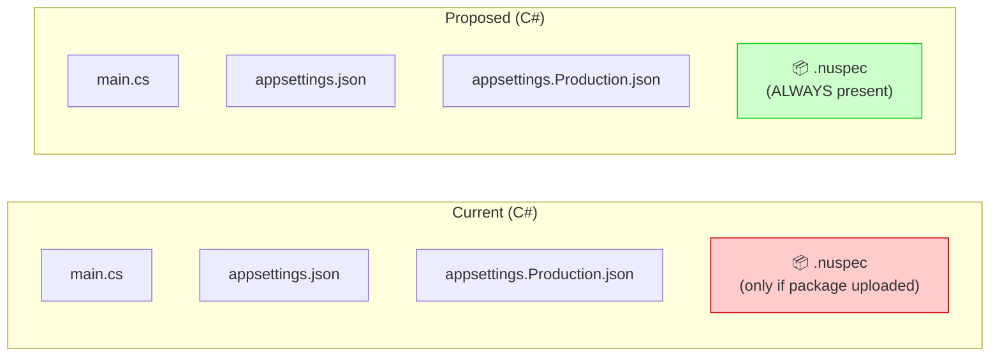

---

## Feature 4: AI Chat Nuspec Context Awareness

### 4.1 Problem

The `AIChatDialog` currently passes only `CurrentCode` (the code from the currently selected editor file) to the AI service via `ChatService.SetCurrentEditorCode(CurrentCode)`. It does **not** pass the `.nuspec` content. This means:

- The AI cannot see existing NuGet dependencies.
- The AI cannot intelligently update the `.nuspec` when adding new packages.
- The AI may suggest packages that are already declared.

### 4.2 Solution

Add a new parameter `NuspecContent` to `AIChatDialog.razor` and include it in the context sent to the AI.

### 4.3 Changes to `AIChatDialog.razor`

Add a new parameter:

```csharp
[Parameter] public string NuspecContent { get; set; } = "";
```

Update the AI context building to include `.nuspec`:

```csharp
// In the method that prepares context for the AI
var contextCode = CurrentCode;
if (!string.IsNullOrWhiteSpace(NuspecContent))
{
    contextCode += "\n\n// === Current .nuspec content ===\n"
                 + "// (Update the dependencies section if adding new NuGet packages)\n"
                 + NuspecContent;
}
ChatService.SetCurrentEditorCode(contextCode);
```

### 4.4 Changes to `JobDetailsDialog.razor`

Update the `AIChatDialog` component invocation to pass nuspec content:

```razor
@if (showAIChatDialog)
{
    <AIChatDialog CurrentCode="@currentJobCode"
                  NuspecContent="@GetCurrentNuspecContent()"
                  Language="@codeLanguage"
                  OnClose="@CloseAIChatDialog"
                  OnCodeApply="@OnAICodeApplied" />
}
```

Add helper method:

```csharp
private string GetCurrentNuspecContent()
{
    if (codeLanguage != "csharp") return "";

    // Try loadedCodeModel first
    if (!string.IsNullOrEmpty(loadedCodeModel?.NuspecContent))
        return loadedCodeModel.NuspecContent;

    // Try file storage
    var (content, _) = FileStorage.GetNuspecInfo(JobId);
    return content ?? "";
}
```

### 4.5 Handling AI Response with `.nuspec` Block

When the AI response contains a `###NUSPEC BEGIN###` / `###NUSPEC END###` block, the `OnAICodeApplied` handler should extract it and update the `.nuspec`:

```csharp
private async Task OnAICodeApplied(string code)
{
    // Check for embedded .nuspec content in the AI response
    var nuspecMatch = Regex.Match(code,
        @"###NUSPEC BEGIN###\s*```xml\s*(.*?)\s*```\s*###NUSPEC END###",
        RegexOptions.Singleline);

    if (nuspecMatch.Success && codeLanguage == "csharp")
    {
        var nuspecContent = nuspecMatch.Groups[1].Value.Trim();
        var nuspecFileName = loadedCodeModel?.NuspecFileName
            ?? "BlazorDataOrchestrator.Job.nuspec";

        // Store the .nuspec
        FileStorage.SetFile(JobId, nuspecFileName, nuspecContent);
        FileStorage.SetNuspecContent(JobId, nuspecContent, nuspecFileName);

        var parsedDeps = CodeEditorService.ParseNuSpecDependencies(nuspecContent);
        FileStorage.SetDependencies(JobId, parsedDeps);

        if (loadedCodeModel != null)
        {
            loadedCodeModel.NuspecContent = nuspecContent;
            loadedCodeModel.NuspecFileName = nuspecFileName;
            loadedCodeModel.Dependencies = parsedDeps;
        }

        // Remove the nuspec block from the code applied to the editor
        code = Regex.Replace(code,
            @"###NUSPEC BEGIN###.*?###NUSPEC END###",
            "", RegexOptions.Singleline).Trim();
    }

    // Apply the cleaned code to the editor
    currentJobCode = code;
    if (jobCodeEditor != null)
    {
        await jobCodeEditor.UpdateCodeAsync(code);
    }

    // Update file storage for the code file
    if (!string.IsNullOrEmpty(selectedCodeFile))
    {
        FileStorage.SetFile(JobId, selectedCodeFile, currentJobCode);
    }
}
```

---

## End-to-End Flow Diagrams

### Happy Path: AI Generates Code with NuGet Dependencies

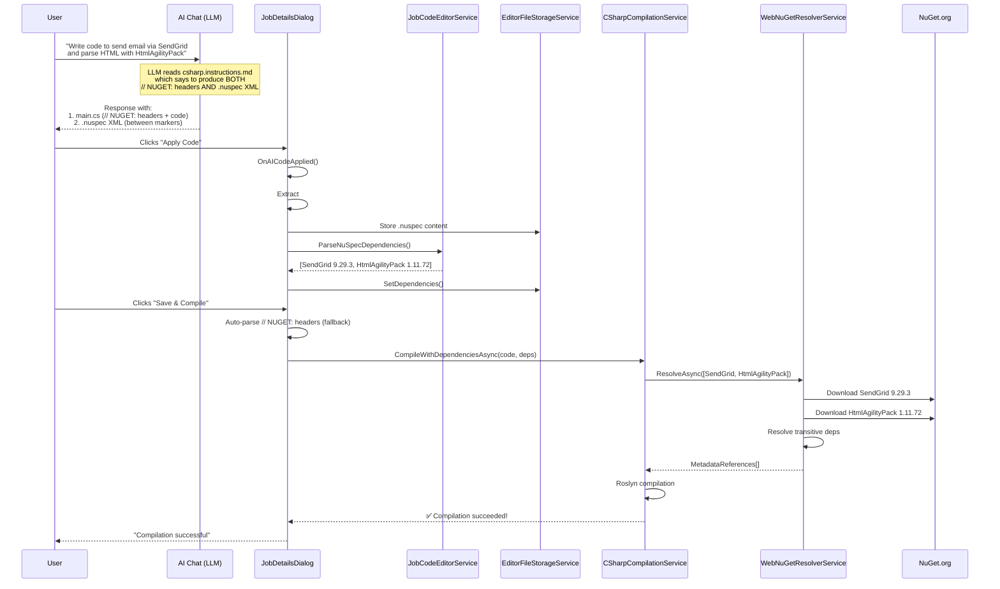

### Fallback Path: User Manually Edits Code with `// NUGET:` Headers

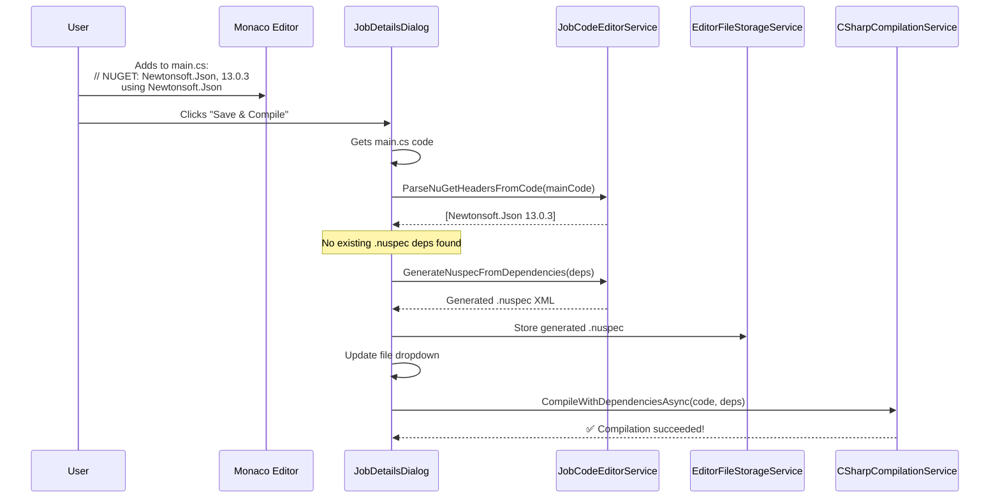

### Manual Path: User Edits `.nuspec` Directly

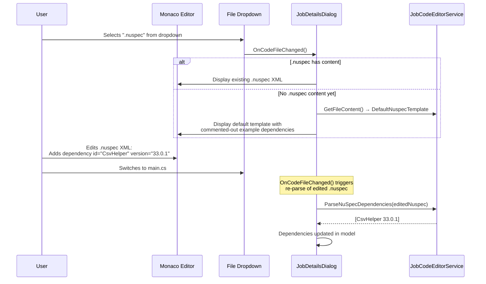

---

## Detailed Implementation

### Implementation Sequence

```mermaid
gantt
    title Implementation Order
    dateFormat X
    axisFormat %s

    section Feature 3 – Always Show .nuspec
    Add DefaultNuspecTemplate constant             : f3a, 0, 1
    Update GetFileListForLanguage                  : f3b, 1, 2
    Update UpdateFileListForLanguage               : f3c, 2, 3
    Update GetFileContent fallback                 : f3d, 3, 4

    section Feature 2 – Auto-Parse Headers
    Add ParseNuGetHeadersFromCode method           : f2a, 4, 6
    Add GenerateNuspecFromDependencies method       : f2b, 6, 7
    Add MergeNuGetDependencies method              : f2c, 7, 8
    Update SaveAndCompileCode with auto-parse      : f2d, 8, 10

    section Feature 1 – LLM Instructions
    Update Core csharp.instructions.md             : f1a, 10, 12
    Update JobCreatorTemplate instructions         : f1b, 12, 13
    Update .github skills and copilot-instructions : f1c, 13, 14

    section Feature 4 – AI Chat Context
    Add NuspecContent param to AIChatDialog        : f4a, 14, 15
    Pass nuspec to AI context                      : f4b, 15, 16
    Handle NUSPEC markers in OnAICodeApplied       : f4c, 16, 18
    Test end-to-end AI → compile flow              : f4d, 18, 20
```

### Key Design Decisions

| Decision | Rationale |
|----------|-----------|
| Keep `// NUGET:` headers in code | Backward compatible with agent-side `CodeExecutorService.ParseNuGetRequirements()` |
| Auto-generate `.nuspec` from headers | Covers scenarios where AI forgets or user edits manually |
| Merge (not replace) dependencies | Preserves user's manual `.nuspec` edits while adding new deps from code |
| Default `.nuspec` template with comments | Guides end-users who manually edit the file |
| `###NUSPEC BEGIN/END###` markers | Consistent with existing `###UPDATED CODE BEGIN/END###` marker pattern |

---

## File Change Summary

| File | Change Type | Used By | Description |
|------|-------------|---------|-------------|
| `src/BlazorDataOrchestrator.Core/Resources/csharp.instructions.md` | **Modify** | Web App LLM (`CodeAssistantChatService` via `EmbeddedInstructionsProvider`) | Add `.nuspec` generation instructions (Section 1b) with full worked example |
| `src/BlazorDataOrchestrator.JobCreatorTemplate/Resources/csharp.instructions.md` | **Modify** | Job Creator Template LLM (`CopilotChatService` embedded fallback) | Same changes — keep in sync with Core version |
| `BlazorDataOrchestrator/.github/skills/coding-a-job-csharp/SKILL.md` | **Modify** | GitHub Copilot (VS Code) — **cannot see embedded `csharp.instructions.md`** | Same changes — this is the only way the VS Code Copilot LLM sees the instructions |
| `BlazorDataOrchestrator/.github/copilot-instructions.md` | **Modify** | GitHub Copilot (VS Code) — repo-level instructions | Same changes — keep in sync |
| `src/BlazorOrchestrator.Web/Services/JobCodeEditorService.cs` | **Modify** | Web compilation pipeline | Add `ParseNuGetHeadersFromCode()`, `GenerateNuspecFromDependencies()`, `MergeNuGetDependencies()`, `DefaultNuspecTemplate`, update `GetFileListForLanguage()`, update `GetFileContent()` |
| `src/BlazorOrchestrator.Web/Components/Pages/Dialogs/JobDetailsDialog.razor` | **Modify** | Web UI | Update `SaveAndCompileCode()` with auto-parse, update `UpdateFileListForLanguage()`, update `OnAICodeApplied()`, add `GetCurrentNuspecContent()` |
| `src/BlazorOrchestrator.Web/Components/Pages/Dialogs/AIChatDialog.razor` | **Modify** | Web UI | Add `NuspecContent` parameter, include in AI context |

---

## Testing & Validation

### Test Scenarios

| # | Scenario | Expected Result |
|---|----------|----------------|
| 1 | New C# job — file dropdown | `.nuspec` appears in dropdown with default template |
| 2 | User selects `.nuspec` in dropdown (new job) | Monaco editor shows default template with commented examples |
| 3 | User edits `.nuspec` directly, adds `SendGrid` dep | Switching away re-parses deps; "Save & Compile" resolves SendGrid |
| 4 | AI generates code with `// NUGET:` headers only | Auto-parse creates `.nuspec`, compilation succeeds |
| 5 | AI generates code with `// NUGET:` headers AND `###NUSPEC###` block | `.nuspec` extracted from AI response, compilation succeeds |
| 6 | User manually adds `// NUGET:` header to existing code | Auto-parse merges into existing `.nuspec` |
| 7 | Existing package uploaded with `.nuspec` | `.nuspec` shown in dropdown with existing deps |
| 8 | AI chat receives nuspec context | AI can see existing deps and suggest additions |

### Aspire Telemetry Validation

After implementation, check Aspire structured logs for:
- `"After standard references: 93"` — transitive assembly scanning working.
- `"Resolving X NuGet dependencies"` — deps are being passed to resolver.
- `"Compilation with dependencies succeeded"` — full success.

Look for traces with the compilation button click (long-duration `RadzenButton.OnClick`) and verify no compilation errors remain.

---

## Acceptance Criteria

- [ ] `.nuspec` file **always** appears in the file dropdown for C# jobs (new and existing).
- [ ] Selecting `.nuspec` on a new job shows a sensible default template with example dependencies.
- [ ] User can **manually edit** `.nuspec` XML in the Monaco editor and the changes are preserved.
- [ ] `// NUGET:` comment headers in `main.cs` are **automatically parsed** and used to generate/update `.nuspec` during "Save & Compile".
- [ ] When the AI generates code with NuGet package references, the `.nuspec` is **automatically populated**.
- [ ] "Save & Compile" resolves NuGet dependencies from `.nuspec` and compilation succeeds for code using `SendGrid`, `HtmlAgilityPack`, etc.
- [ ] The AI chat dialog receives current `.nuspec` content as context so it can update dependencies intelligently.
- [ ] All changes are backward-compatible with the agent-side `CodeExecutorService.ParseNuGetRequirements()` (which reads `// NUGET:` headers at runtime).
- [ ] The LLM instructions files (`csharp.instructions.md`) in Core, JobCreatorTemplate, and `.github/` are all updated and in sync.
