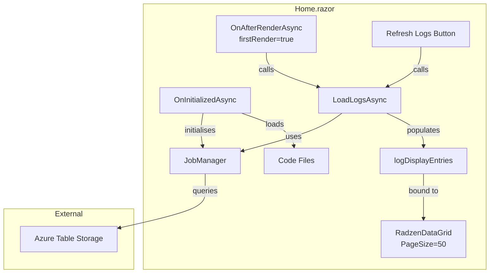
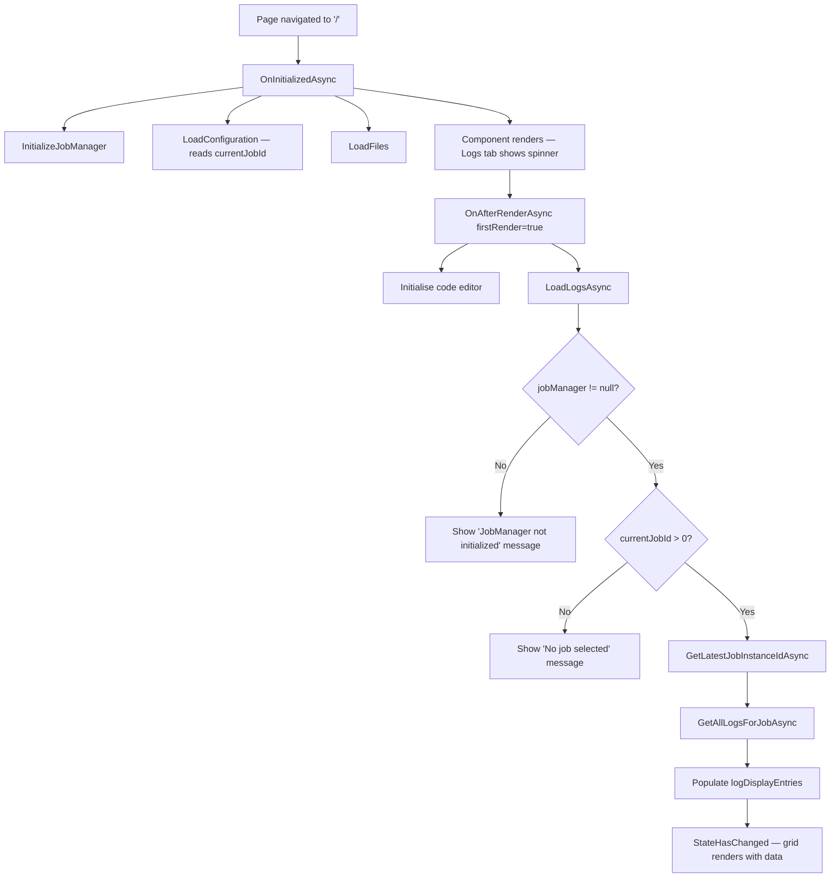

# Logs Page Auto-Load & Pagination Plan

## Overview

This document describes the implementation plan for two enhancements to the **Logs** tab on the `Home.razor` page in the `BlazorDataOrchestrator.JobCreatorTemplate` project:

1. **Auto-load logs on page initialization** — Logs should be fetched automatically when `Home.razor` first renders, eliminating the need for the user to manually click "Refresh Logs."
2. **Display 50 logs per page** — The `RadzenDataGrid` page size should be increased from 10 to 50.

---

## Current Behaviour

```mermaid
sequenceDiagram
    participant User
    participant Home.razor
    participant JobManager

    User->>Home.razor: Navigates to "/"
    Home.razor->>Home.razor: OnInitializedAsync()
    Note right of Home.razor: Initialises JobManager,<br/>loads code files,<br/>but does NOT load logs
    Home.razor-->>User: Logs tab shows "No logs available"
    User->>Home.razor: Clicks "Refresh Logs"
    Home.razor->>JobManager: GetAllLogsForJobAsync(jobId)
    JobManager-->>Home.razor: List&lt;LogEntry&gt;
    Home.razor-->>User: Renders log grid (PageSize=10)
```

### Problems

| # | Issue | Impact |
|---|-------|--------|
| 1 | Logs are **not loaded** until the user manually clicks "Refresh Logs". | Users see an empty "No logs available" message even when logs exist. |
| 2 | `PageSize` is set to **10**. | Users must page through many pages to review a moderately sized log set. |

---

## Proposed Behaviour

```mermaid
sequenceDiagram
    participant User
    participant Home.razor
    participant JobManager

    User->>Home.razor: Navigates to "/"
    Home.razor->>Home.razor: OnInitializedAsync()
    Note right of Home.razor: Initialises JobManager,<br/>loads code files
    Home.razor->>Home.razor: OnAfterRenderAsync(firstRender: true)
    Home.razor->>Home.razor: LoadLogsAsync() [auto-triggered]
    Home.razor->>JobManager: GetAllLogsForJobAsync(jobId)
    JobManager-->>Home.razor: List&lt;LogEntry&gt;
    Home.razor-->>User: Renders log grid (PageSize=50)
```

---

## Component Architecture



---

## Detailed Implementation Plan

### Feature 1: Auto-Load Logs on Page Load

#### 1.1 Extract a reusable `LoadLogsAsync` method

The existing `OnRefreshLogs()` method (line 1582) contains all the log-fetching logic. Extract the core logic into a separate private method named `LoadLogsAsync()` so it can be called from both `OnAfterRenderAsync` and the Refresh Logs button.

**Location:** `src/BlazorDataOrchestrator.JobCreatorTemplate/Components/Pages/Home.razor`, `@code` block.

```csharp
/// <summary>
/// Core method that fetches logs from Azure Table Storage for the current job
/// and populates logDisplayEntries. Called on initial page load and on manual refresh.
/// </summary>
private async Task LoadLogsAsync()
{
    if (_disposed) return;

    if (jobManager == null)
    {
        logOutput = $"[{DateTime.Now:HH:mm:ss}] JobManager not initialized. Check connection strings.\n";
        if (!_disposed) StateHasChanged();
        return;
    }

    isLoadingLogs = true;
    if (!_disposed) StateHasChanged();

    try
    {
        // Try to resolve JobId from InstanceId if missing
        if (currentJobId == 0 && currentJobInstanceId > 0)
        {
            var jobId = await jobManager.GetJobIdFromInstanceIdAsync(currentJobInstanceId);
            if (jobId.HasValue)
            {
                currentJobId = jobId.Value;
            }
        }

        if (currentJobId > 0)
        {
            var latestInstanceId = await jobManager.GetLatestJobInstanceIdAsync(currentJobId);
            if (latestInstanceId.HasValue)
            {
                currentJobInstanceId = latestInstanceId.Value;
                SaveConfiguration();
            }

            var allLogs = new List<LogDisplayEntry>();

            try
            {
                var azureLogs = await jobManager.GetAllLogsForJobAsync(currentJobId);
                var tableLogEntries = azureLogs.Select(l => new LogDisplayEntry
                {
                    Id = 0,
                    JobInstanceId = l.JobInstanceId,
                    Level = l.Level ?? "Info",
                    CreatedDate = l.Timestamp,
                    Message = $"[{l.Action}] {l.Details}",
                    Source = "AzureTable"
                });
                allLogs.AddRange(tableLogEntries);
            }
            catch
            {
                // If Azure Table logs fail, continue with empty list
            }

            logDisplayEntries = allLogs.OrderByDescending(l => l.CreatedDate).ToList();

            if (_disposed) return;
            logOutput = $"[{DateTime.Now:HH:mm:ss}] Loaded {logDisplayEntries.Count} log entries for Job {currentJobId}\n";
        }
        else
        {
            logDisplayEntries = new List<LogDisplayEntry>();
            logOutput = $"[{DateTime.Now:HH:mm:ss}] No job selected. Run a job first to see logs.\n";
        }
    }
    catch (Exception ex)
    {
        logOutput = $"[{DateTime.Now:HH:mm:ss}] Error loading logs: {ex.Message}\n";
    }
    finally
    {
        isLoadingLogs = false;
    }

    if (!_disposed)
    {
        StateHasChanged();
    }
}
```

#### 1.2 Simplify `OnRefreshLogs` to delegate

```csharp
private async Task OnRefreshLogs()
{
    await LoadLogsAsync();
}
```

#### 1.3 Call `LoadLogsAsync` in `OnAfterRenderAsync`

Add the log-loading call inside the existing `OnAfterRenderAsync` method, after the code-editor initialisation, guarded by `firstRender`:

```csharp
protected override async Task OnAfterRenderAsync(bool firstRender)
{
    if (firstRender && codeEditor != null && !string.IsNullOrEmpty(currentCode))
    {
        await codeEditor.UpdateCodeAsync(currentCode);
        var lang = selectedFile != null ? GetLanguageFromFile(selectedFile) : GetMonacoLanguage();
        await codeEditor.UpdateLanguageAsync(lang);
    }

    // Auto-load logs on first render
    if (firstRender)
    {
        await LoadLogsAsync();
    }
}
```

> **Why `OnAfterRenderAsync` instead of `OnInitializedAsync`?**
> `OnInitializedAsync` runs before the component is rendered. Placing the async log call there would **delay the initial render** of the entire page (code editor, chat panel, etc.) until logs finish loading. By using `OnAfterRenderAsync(firstRender: true)`, the page renders immediately with the loading spinner visible, and the logs populate asynchronously — resulting in a better user experience.

#### 1.4 Process-flow diagram for auto-load



---

### Feature 2: Show 50 Logs Per Page

#### 2.1 Change `PageSize` on the `RadzenDataGrid`

**Location:** `src/BlazorDataOrchestrator.JobCreatorTemplate/Components/Pages/Home.razor`, line 162.

**Current markup:**

```razor
<RadzenDataGrid Data="@logDisplayEntries" TItem="LogDisplayEntry"
                AllowPaging="true" PageSize="10" PagerHorizontalAlign="HorizontalAlign.Center"
                AllowSorting="true" AllowColumnResize="true" Style="flex-grow: 1;" Density="Density.Compact">
```

**Updated markup:**

```razor
<RadzenDataGrid Data="@logDisplayEntries" TItem="LogDisplayEntry"
                AllowPaging="true" PageSize="50" PagerHorizontalAlign="HorizontalAlign.Center"
                AllowSorting="true" AllowColumnResize="true" Style="flex-grow: 1;" Density="Density.Compact">
```

This is a single-property change (`PageSize="10"` → `PageSize="50"`).

#### 2.2 Optional: make page size configurable via a constant

To keep the value easy to locate and change in the future, consider introducing a constant at the top of the `@code` block:

```csharp
private const int LogPageSize = 50;
```

Then reference it in the markup:

```razor
<RadzenDataGrid ... PageSize="@LogPageSize" ...>
```

---

## Files Changed

| File | Change | Lines Affected |
|------|--------|----------------|
| `src/BlazorDataOrchestrator.JobCreatorTemplate/Components/Pages/Home.razor` | Extract `LoadLogsAsync()` from `OnRefreshLogs()` | ~1582–1664 |
| `src/BlazorDataOrchestrator.JobCreatorTemplate/Components/Pages/Home.razor` | Call `LoadLogsAsync()` in `OnAfterRenderAsync` | ~340–348 |
| `src/BlazorDataOrchestrator.JobCreatorTemplate/Components/Pages/Home.razor` | Change `PageSize` from `10` to `50` | ~162 |

---

## Testing Checklist

- [ ] **Auto-load**: Navigate to `/`. Confirm logs appear automatically without clicking "Refresh Logs" (assuming a valid `currentJobId` exists in `configuration.json`).
- [ ] **Loading indicator**: While logs are loading on first render, confirm the circular progress bar and "Loading logs…" text are displayed.
- [ ] **No job**: With `currentJobId = 0` and `currentJobInstanceId = 0`, confirm the "No logs available" or "No job selected" message is shown.
- [ ] **No JobManager**: With missing connection strings, confirm the "JobManager not initialized" message appears and the page does not crash.
- [ ] **Manual refresh**: Click "Refresh Logs" and confirm it still works correctly and fetches the latest logs.
- [ ] **Pagination at 50**: When more than 50 log entries exist, confirm the grid paginates at 50 rows per page.
- [ ] **Pagination at ≤50**: When 50 or fewer log entries exist, confirm no pager is shown (or a single page is displayed).
- [ ] **Sorting**: Confirm column sorting still works correctly with the new page size.
- [ ] **Disposed guard**: Navigate away from the page during log loading and confirm no `ObjectDisposedException` is thrown.

---

## Risk & Considerations

| Risk | Mitigation |
|------|------------|
| Large log sets could slow initial page load | `LoadLogsAsync` runs **after** first render, so the UI remains responsive. The loading spinner provides visual feedback. |
| `StateHasChanged` called after `await` in `OnAfterRenderAsync` | Guard with `_disposed` check (already in place). |
| 50 rows per page may be too many for narrow screens | `Density="Density.Compact"` is already set, keeping row height minimal. Could add `PageSizeOptions` to let users choose. |
| `configuration.json` has `LastJobId = 0` on first run | The code already handles this case — shows "No job selected" message. |

---

## Summary

These two changes are small, self-contained, and low-risk. Feature 1 improves the logs UX by pre-loading data on page init. Feature 2 reduces paging friction by increasing the visible log count from 10 to 50 per page.
