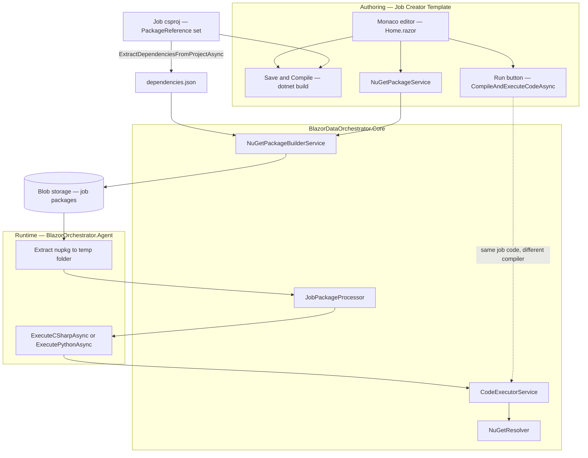
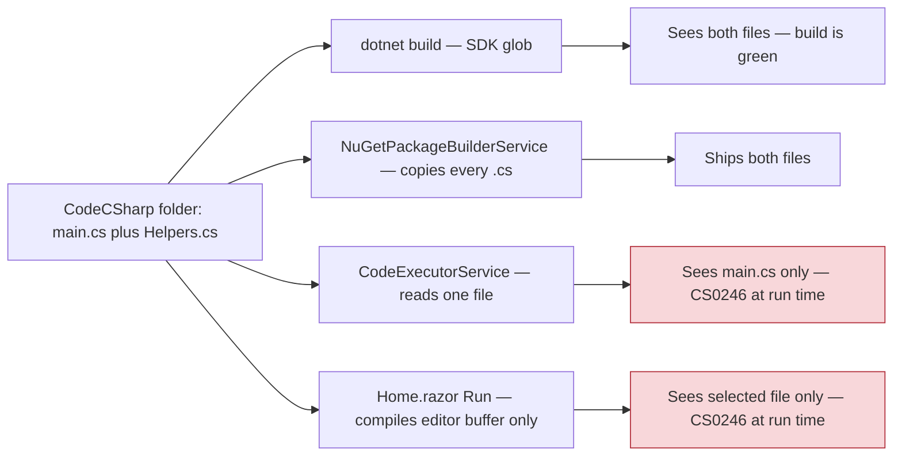
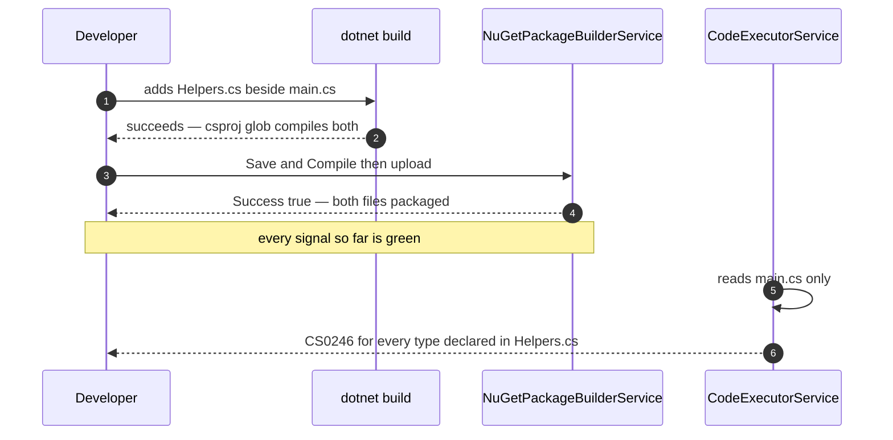
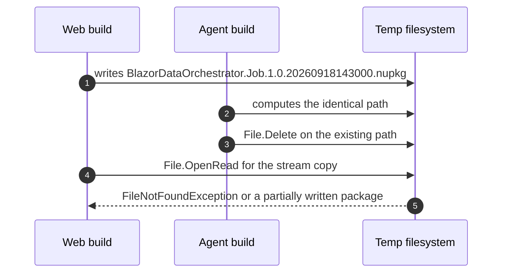
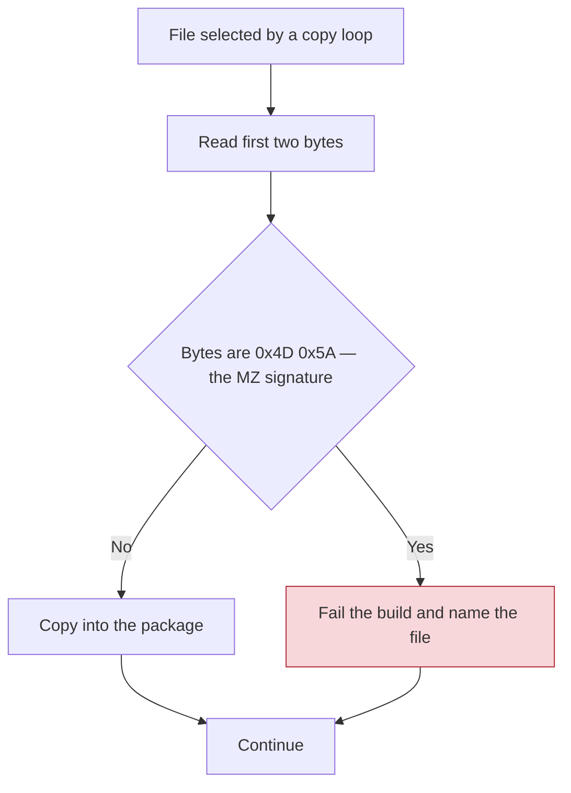
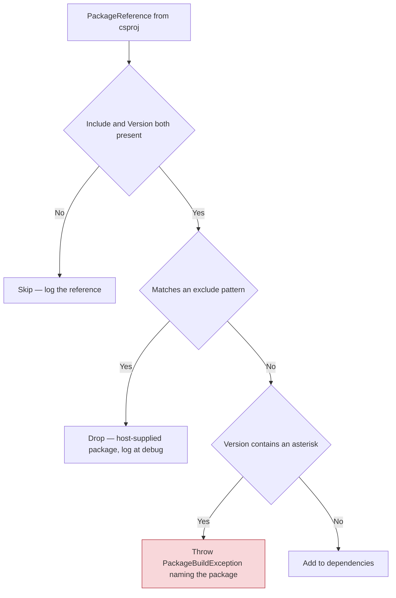
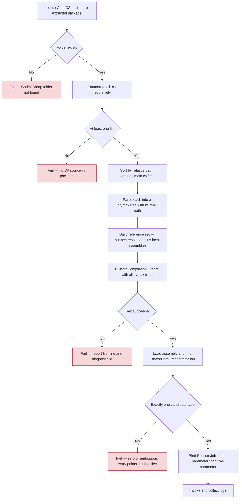
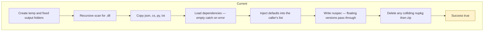
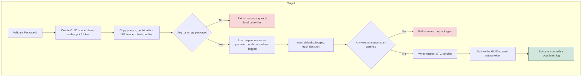
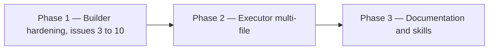

# NuGet Package Builder Service — Hardening Plan

**Status:** Implemented
**Primary target:** `src/BlazorDataOrchestrator.Core/Services/NuGetPackageBuilderService.cs`
**Secondary targets:** `src/BlazorDataOrchestrator.Core/Services/CodeExecutorService.cs`, `src/BlazorDataOrchestrator.JobCreatorTemplate/Services/NuGetPackageService.cs`
**Related issue register entries:** `I-001`, `I-004`, `I-012`, `I-019`, `I-020`, `I-021`

## Revision — owner decisions applied before implementation

| Change | Effect |
|---|---|
| §6.3 "Unify on Roslyn" — **withdrawn** | CS-Script is retained. It remains the local compiler for single-file jobs, which is every AI-authored job. Roslyn is used only where CS-Script cannot express the input: Azure Container Apps, and any job with more than one `.cs` file. |
| §6.5 "Template Run button" — **withdrawn** | `Home.razor` is not touched and the template zip is not rebuilt. The Run button keeps compiling the single editor buffer, so the place and shape of AI-generated code is unchanged. |
| §6.6 "Job csproj still needs the PackageReference" — **withdrawn** | The section restated existing behaviour and prescribed no change; it has been removed. |
| O-1 | CS-Script is **not** retired — see §6.3. |
| O-2 | `ParseNuGetRequirements` is run over **every** source file — see §6.2. |
| O-3 | The 24-hour temp sweep lives in the service constructor; there is no hosted background service. |
| O-4 | `PackageBuildResult.BuildId` is surfaced — see §5.3. |

---

## 1. Purpose

`NuGetPackageBuilderService` is the single choke point through which every authored job leaves the Job Creator Template and becomes a deployable artifact. It currently returns `Success = true` for several package shapes that cannot possibly run, and it packages a superset of what the runtime actually compiles.

This document catalogues every defect found during a full read of the service, records which ones are being fixed and which are accepted as-is, and specifies the implementation for each fix in enough detail to code from directly.

---

## 2. Decisions and non-goals

These were settled before drafting. They constrain the plan and must not be re-litigated during implementation.

| Area | Decision | Rationale |
|---|---|---|
| `DefaultDependencies` pinned versions | **No change** | Treated as intended platform behaviour. The per-job workaround recorded in `I-004` — declaring EF Core explicitly at a resolvable version — remains the supported approach. |
| `DefaultDependencies` mutability and caller-list aliasing | **No change** | Accepted risk. See [§5.2](#52-issue-2--shared-mutable-default-dependency-state-accepted) for the guardrail callers must observe. |
| Package version **format** `1.0.{yyyyMMddHHmmss}` | **No change** | The artifact is never pushed to a public feed. |
| Package version **clock** | **Change** `DateTime.Now` to `DateTime.UtcNow` | Format is unaffected; removes DST duplicate and backwards-ordered versions and matches the nuspec description, which already uses UTC. |
| `.nupkg` OPC conformance — `[Content_Types].xml`, `_rels/.rels`, `.psmdcp` | **No change** | The Agent unzips the artifact; it is never resolved as a package by a NuGet client. |
| Behaviour change tolerance | **Fail loudly** | Builds that silently succeed today with no code, malformed `dependencies.json`, or wildcard versions will start failing. This is intentional. |
| Multi-file C# | **Compile every `.cs`**, entry point located by reflection | `main.cs` ceases to be a required filename. |
| Execution paths covered | **The Agent executor only** | The template's Run button is deliberately left single-file — see the revision table above. |

---

## 3. System structure

### 3.1 Where the service sits



### 3.2 The three compilers that see different inputs

This divergence is the root of the headline defect.



---

## 4. The headline defect — packaged set is not the compiled set

`BuildPackageAsync` copies **every** `.cs` file found in `CodeCSharp` into `contentFiles/any/any/CodeCSharp/`. `CodeExecutorService.ExecuteCSharpAsync` then compiles **exactly one**:

```csharp
var mainCsPath = Path.Combine(codeFolder, "main.cs");
if (!File.Exists(mainCsPath))
{
    var csFiles = Directory.GetFiles(codeFolder, "*.cs", SearchOption.AllDirectories);
    if (csFiles.Length == 0) { /* fail */ }
    mainCsPath = csFiles[0];   // whichever file the filesystem returns first
}
```

Two distinct failure shapes follow.

### 4.1 Failure shape A — helper types vanish at run time



### 4.2 Failure shape B — non-deterministic entry point

If `main.cs` is absent, the executor runs `csFiles[0]`. `Directory.GetFiles` returns entries in filesystem order, which is not guaranteed and differs between the developer's NTFS volume and the Agent's Linux container. A package containing `alpha.cs` and `zeta.cs` may execute either one, silently, with no log line distinguishing the two runs beyond a filename in a single `result.Logs` entry.

### 4.3 Resolution

Unify on "compile the whole `CodeCSharp` folder, find the entry point by reflection". Detailed in [§6](#6-executor-changes).

The template's Run button (`B4`) is out of scope by decision — it still compiles the single editor buffer. A job split across files therefore cannot be exercised with **Run**; it must be tested through the Agent. This is recorded in the authoring instructions so no AI-authored job relies on helper files.

---

## 5. Issue catalogue

| # | Severity | Issue | Disposition |
|---|---|---|---|
| 0 | High | Packaged `.cs` set is not the compiled set; `csFiles[0]` fallback is non-deterministic | **Fix** — §4, §6 |
| 1 | High | `DefaultDependencies` pins EF Core `10.0.0`, which cannot restore against `Core` | **No change** — §5.1 |
| 2 | High | `DefaultDependencies` is mutable static state; caller's list is mutated and instances aliased | **No change, documented** — §5.2 |
| 3 | High | Concurrent builds collide on a fixed, non-GUID output path | **Fix** — §5.3 |
| 4 | High | A package containing no code reports `Success = true` | **Fix** — §5.4 |
| 5 | Medium | Version uses `DateTime.Now`; nuspec description uses `DateTime.UtcNow` | **Partial fix — clock only** — §5.5 |
| 6 | Medium | Empty `catch { }` turns configuration errors into runtime mysteries | **Fix** — §5.6 |
| 7 | Medium | `.dll` guard is extension-based and simultaneously over-broad | **Fix** — §5.7 |
| 8 | Medium | Wildcard versions silently dropped; `1.*` written verbatim | **Fix** — §5.8 |
| 9 | Low | Temp `.nupkg` files accumulate; `catch { return null; }` leaks stream and file | **Fix** — §5.9 |
| 10 | Low | `PackageId` flows unsanitized into file paths | **Fix** — §5.10 |
| 11 | Low | Output is a zip with a nuspec, not a conformant `.nupkg` | **No change** — §2 |

---

### 5.1 Issue 1 — pinned default dependency versions (accepted)

No code change. Record the following in the job authoring skill so authors are not surprised:

> Every C# job package receives `Microsoft.EntityFrameworkCore`, `Microsoft.EntityFrameworkCore.SqlServer` and `Azure.Data.Tables` unless the job already declares them. The injected EF Core version is older than the one `BlazorDataOrchestrator.Core` requires. Declare both EF Core packages explicitly in `dependencies.json` at the version `Core` uses, so the default never applies. This is the mitigation recorded as `I-004`.

Python jobs also receive these entries. Because the Python runner never reads the nuspec dependency group, the entries are inert — noted here so nobody files it as a new bug.

### 5.2 Issue 2 — shared mutable default dependency state (accepted)

No code change. The observable consequences, for the record:

* `BuildPackageAsync` appends the defaults into `config.Dependencies` itself when the caller supplied that list, so the caller's collection is mutated as a side effect of building.
* The appended `PackageDependency` objects are the shared static instances, aliased into every package's dependency list.
* `Core` is consumed by both `BlazorOrchestrator.Web` and `BlazorOrchestrator.Agent`; `List<T>` is not thread-safe.

**Guardrail for callers — enforce in review:** construct a fresh `PackageBuildConfiguration` with a fresh `Dependencies` list for every call to `BuildPackageAsync`. Never reuse a configuration instance across builds, and never read `config.Dependencies` after the call expecting it to be unchanged. `NuGetPackageService.CreateBuildConfiguration` already does this correctly; keep it that way.

### 5.3 Issue 3 — concurrent builds collide on the output path

**Current**

```csharp
var outputFolder = Path.Combine(Path.GetTempPath(), "NuGetPackages");
var version     = config.Version ?? $"1.0.{DateTime.Now:yyyyMMddHHmmss}";
var nupkgPath   = Path.Combine(outputFolder, $"{config.PackageId}.{version}.nupkg");
if (File.Exists(nupkgPath)) File.Delete(nupkgPath);
```

`PackageId` defaults to the constant `"BlazorDataOrchestrator.Job"` and that is what every caller passes. The version has one-second resolution. Two builds in the same second therefore compute an identical path, and the second build deletes the first build's file — potentially while `BuildPackageAsStreamAsync` is reading it.



**Fix**

Give the output the same GUID scoping the temp folder already has, and derive both from one identifier.

```csharp
var buildId       = Guid.NewGuid().ToString("N");
var tempFolder    = Path.Combine(Path.GetTempPath(), "NuGetBuild", buildId);
var outputFolder  = Path.Combine(Path.GetTempPath(), "NuGetPackages", buildId);
```

Because `outputFolder` is now unique per build, the `File.Exists` / `File.Delete` pre-step becomes dead code — remove it. Record `buildId` on `PackageBuildResult` so logs from concurrent builds can be told apart, and so cleanup can target the whole folder rather than a single file.

Add to `PackageBuildResult`:

```csharp
public string BuildId { get; set; } = string.Empty;
public string? OutputFolder { get; set; }
```

**O-4 — surfacing `BuildId`.** Resolved: yes. It is surfaced without changing any public signature, because the template zip ships its own copy of `NuGetPackageService.cs` and every existing job instance would fail to compile against a wider tuple:

* the first line of `result.Logs` is `[build {buildId}] Building package …`, and `NuGetPackageService.CreatePackageAsync` already writes every log line to `ILogger`;
* `BuildPackageAsStreamAsync` now **throws** `PackageBuildException` on a failed build rather than returning `null`, with the message `"{ErrorMessage} (build {BuildId})"`. The template's Run flow already catches and prints that message, so the operator sees both the real reason and the correlation handle. Previously the caller replaced it with the generic `"Failed to create package as stream"`.

### 5.4 Issue 4 — a package with no code reports success

This is `I-001` reproduced exactly: the flat-layout job produced a `.nupkg` containing four `appsettings` files and no code, and the build reported success. The register's prevention step was manual — "verify the `.nupkg` contains `contentFiles/any/any/CodeCSharp/main.cs`". The service should refuse instead.

**Fix** — after the copy loops, before the nuspec is written:

```csharp
var csharpCount = Directory.Exists(csharpContentFolder)
    ? Directory.GetFiles(csharpContentFolder, "*.cs").Length : 0;
var pythonCount = Directory.Exists(pythonContentFolder)
    ? Directory.GetFiles(pythonContentFolder, "*.py").Length : 0;

if (csharpCount == 0 && pythonCount == 0)
{
    var strays = Directory.Exists(config.CodeRootPath)
        ? Directory.GetFiles(config.CodeRootPath, "*.cs")
            .Concat(Directory.GetFiles(config.CodeRootPath, "*.py"))
            .Select(Path.GetFileName)
            .ToArray()
        : Array.Empty<string>();

    result.Success = false;
    result.ErrorMessage = strays.Length > 0
        ? $"No code was packaged. Found code files directly under the job root " +
          $"({string.Join(", ", strays)}); they must live in CodeCSharp or CodePython."
        : "No code was packaged. Expected at least one .cs file in CodeCSharp " +
          "or one .py file in CodePython.";
    result.Logs.Add(result.ErrorMessage);
    return result;
}
```

The stray-file branch turns `I-001`'s silent failure into a message that names the mistake and the correction.

`main.cs` is deliberately **not** required — see [§6](#6-executor-changes). Emit an informational log line when it is absent, nothing more.

### 5.5 Issue 5 — version clock

Format stays `1.0.{yyyyMMddHHmmss}`. Change only the clock so the same method does not mix local and UTC time:

```csharp
var version = config.Version ?? $"1.0.{DateTime.UtcNow:yyyyMMddHHmmss}";
```

The nuspec `<description>` already uses `DateTime.UtcNow`. Under British Summer Time fall-back, `DateTime.Now` produces an hour of timestamps that repeat and then run backwards relative to the previous hour; the version is used for filenames and for operator log correlation, so duplicates are not harmless.

Add a short comment recording why the value is not a valid `NuGetVersion`, so the next reader does not "fix" it:

```csharp
// Not a parseable NuGetVersion: the patch component overflows Int32. Intentional —
// the Agent unzips this artifact and never resolves it through a NuGet client.
```

### 5.6 Issue 6 — silent catch blocks

`LoadDependenciesAsync` and `ExtractDependenciesFromProjectAsync` both end in:

```csharp
catch { /* Return empty list on parse errors */ }
```

One typo in `dependencies.json` yields a package with **no** dependencies, no warning and no log entry. The job then fails at execution with a missing-type error that points nowhere near the actual cause — the same confusing failure shape as `I-019`, where a correct `PackageReference` still produced `CS0246`.

**Fix**

1. Introduce a dedicated exception in `Core.Services`:

   ```csharp
   public sealed class PackageBuildException : Exception
   {
       public PackageBuildException(string message, Exception? inner = null)
           : base(message, inner) { }
   }
   ```

2. Replace both empty catches with a rethrow that names the file and the underlying error:

   ```csharp
   catch (JsonException ex)
   {
       throw new PackageBuildException(
           $"Failed to parse dependencies file '{dependenciesFilePath}': {ex.Message}", ex);
   }
   ```

   and, in `ExtractDependenciesFromProjectAsync`:

   ```csharp
   catch (System.Xml.XmlException ex)
   {
       throw new PackageBuildException(
           $"Failed to parse project file '{projectFilePath}': {ex.Message}", ex);
   }
   ```

3. `BuildPackageAsync` already has an outer `try`/`catch (Exception ex)` that populates `Success = false` and `ErrorMessage`, so the new exception surfaces correctly with no further change there. Add an explicit first catch so the message is not diluted:

   ```csharp
   catch (PackageBuildException ex)
   {
       result.Success = false;
       result.ErrorMessage = ex.Message;
       result.Logs.Add($"Build failed: {ex.Message}");
       return result;
   }
   ```

4. `NuGetPackageService.ExtractAndSaveDependenciesFromProjectAsync` already wraps its call in `try`/`catch (Exception ex)` with `_logger.LogError`. It currently swallows the failure and returns an empty list — change it to rethrow, so the template surfaces the problem in the UI rather than writing an empty `dependencies.json` over a good one.

5. **Populate `result.Logs`.** `PackageBuildResult.Logs` exists and nothing in the dependency-loading path writes to it. Add, at minimum:
   * the resolved dependency source — `config.Dependencies` supplied by caller, versus a path that was read, versus "file not found, continuing with defaults only";
   * one line per dependency, `id` and `version`;
   * a line for each default that was injected and each that was skipped because the job already declared it.

   A "file not found" outcome stays non-fatal — a Python-only job legitimately has no `dependencies.json` — but it must be logged, not inferred from a zero count.

### 5.7 Issue 7 — the `.dll` guard

```csharp
var dllFiles = Directory.GetFiles(config.CodeRootPath, "*.dll", SearchOption.AllDirectories);
```

Wrong in both directions:

* **Under-detects.** `payload.dll` renamed to `payload.json` or `requirements.txt` passes the guard and is copied straight into the package by the JSON and TXT copy loops.
* **Over-rejects.** A stray `bin\` or `obj\` folder anywhere under `CodeRootPath` fails the entire build, even though the copy loops only ever take `.cs`, `.json`, `.py` and `.txt` from three specific folders and could never have shipped it.

**Fix** — inspect the content of the files actually being copied, and delete the recursive scan.



Implement as a guard inside the existing `CopyFileAsync` helper, so every copy path is covered without touching six call sites:

```csharp
private static async Task CopyFileAsync(string sourcePath, string destPath)
{
    await using var sourceStream = new FileStream(sourcePath, FileMode.Open, FileAccess.Read,
        FileShare.Read, bufferSize: 4096, useAsync: true);

    var header = new byte[2];
    if (await sourceStream.ReadAsync(header.AsMemory(0, 2)) == 2 &&
        header[0] == 0x4D && header[1] == 0x5A)
    {
        throw new PackageBuildException(
            $"'{Path.GetFileName(sourcePath)}' is a Windows executable image renamed to " +
            $"'{Path.GetExtension(sourcePath)}'. Compiled binaries cannot be packaged; " +
            "declare a NuGet dependency instead.");
    }

    sourceStream.Position = 0;
    await using var destStream = new FileStream(destPath, FileMode.Create, FileAccess.Write,
        FileShare.None, bufferSize: 4096, useAsync: true);
    await sourceStream.CopyToAsync(destStream);
}
```

Notes:

* `MZ` is the DOS header shared by every PE image, so this catches `.dll`, `.exe` and native images alike. A stricter check would follow the `e_lfanew` offset to the `PE\0\0` signature; `MZ` alone is sufficient here because no legitimate `.cs`, `.json`, `.py` or `.txt` file starts with those bytes.
* Files shorter than two bytes read fewer than two and fall through to the copy, which is correct.
* **Remove** the `Directory.GetFiles(config.CodeRootPath, "*.dll", SearchOption.AllDirectories)` block entirely.
* The equivalent guard in `CodeExecutorService.ExecuteCSharpAsync`, which scans the **extracted** package for `*.dll`, stays as-is. That one is scanning a package the builder produced, so it is a defence-in-depth check on a much smaller tree, and the builder-side content check now makes it near-redundant rather than wrong.

### 5.8 Issue 8 — wildcard versions

```csharp
if (version == "*") continue;   // silently dropped
```

`"1.*"` is not caught at all and is written verbatim into the nuspec, where a floating version is invalid. The Agent's `NuGetResolver` does resolve nuspec dependencies against a real feed, so an invalid version string here is a genuine runtime failure, not a cosmetic one.

**Fix — fail loudly, but only for packages that survive exclusion.**

Ordering matters. The current code skips wildcards **before** applying `excludePatterns`. The template csproj legitimately carries two floating references:

```xml
<PackageReference Include="GitHub.Copilot.SDK" Version="*" />
<PackageReference Include="Radzen.Blazor" Version="*" />
```

`Radzen.Blazor` is already in the default exclude list; `GitHub.Copilot.SDK` is not. If the wildcard check runs first, every template instance fails immediately.



Implementation steps:

1. Add `"GitHub.Copilot.SDK"` to the default `excludePatterns` array, alongside `"Radzen.Blazor"` and `"SimpleBlazorMonaco"`. It is a host-side authoring package that no job's `ExecuteJob` body can use.
2. Move the exclude-pattern test **above** the version test.
3. Replace `if (version == "*") continue;` with:

   ```csharp
   if (version.Contains('*'))
   {
       throw new PackageBuildException(
           $"Package '{id}' uses the floating version '{version}'. Floating versions " +
           "cannot be written to a job package. Pin an exact version in the project file, " +
           "or add the package to the exclusion list if the host supplies it.");
   }
   ```

   `Contains('*')` covers `*`, `1.*` and `1.2.*` in one test.
4. Apply the same validation immediately before the nuspec is written, so a hand-edited `dependencies.json` cannot bypass it:

   ```csharp
   var floating = dependencies.Where(d => d.Version.Contains('*')).ToList();
   if (floating.Count > 0)
   {
       throw new PackageBuildException(
           "Floating versions are not permitted in a job package: " +
           string.Join(", ", floating.Select(d => $"{d.Id} {d.Version}")));
   }
   ```

Bracketed NuGet range syntax such as `[1.2.3]` or `[1.0,2.0)` remains permitted — it is valid in a nuspec and the resolver understands it.

### 5.9 Issue 9 — temp file and stream leaks

Two separate leaks:

* `BuildPackageAsync` never cleans `outputFolder`. Every build leaves a `.nupkg` in `%TEMP%\NuGetPackages` forever. Only `BuildPackageAsStreamAsync` deletes anything, and only on its success path.
* `BuildPackageAsStreamAsync`'s `catch { return null; }` runs **after** the `MemoryStream` is allocated and **before** `CleanupPackage` is called, leaking both the managed stream and the on-disk file.

**Fix**

```csharp
public async Task<(MemoryStream PackageStream, string FileName, string Version)?>
    BuildPackageAsStreamAsync(PackageBuildConfiguration config)
{
    var result = await BuildPackageAsync(config);
    if (!result.Success || string.IsNullOrEmpty(result.PackagePath))
    {
        CleanupBuild(result);
        throw new PackageBuildException(
            $"{result.ErrorMessage ?? "Package build failed."} (build {result.BuildId})");
    }

    MemoryStream? memoryStream = null;
    try
    {
        memoryStream = new MemoryStream();
        await using (var fileStream = File.OpenRead(result.PackagePath))
        {
            await fileStream.CopyToAsync(memoryStream);
        }
        memoryStream.Position = 0;
        return (memoryStream, result.FileName!, result.Version!);
    }
    catch
    {
        memoryStream?.Dispose();
        throw;
    }
    finally
    {
        CleanupBuild(result);
    }
}
```

`CleanupBuild` deletes the whole GUID-scoped `OutputFolder` introduced in [§5.3](#53-issue-3--concurrent-builds-collide-on-the-output-path), not just one file, and swallows its own errors.

Retain `BuildPackageAsync`'s callers' ownership of the file: `BuildPackageAsync` still leaves the package on disk, because `NuGetPackageService.CreatePackageAsync` returns the path to its caller. Add a startup sweep instead — on service construction, delete any `%TEMP%\NuGetPackages\*` subfolder older than 24 hours. That bounds the leak without changing the ownership contract.

**O-3 resolved — constructor, not a hosted service.** There is no hosted background service in `Core`, and `Core` is consumed by both the Web app and the Agent, so a constructor sweep is the only placement that covers both. It is guarded by a static timestamp so it runs at most once per 24 hours per process rather than on every construction, and it swallows every error — sweeping must never fail construction. A folder locked by a concurrent build is skipped and collected on the next sweep.

Note the signature change: `BuildPackageAsStreamAsync` now **throws** rather than returning `null`, both on a copy failure and on a failed build. `NuGetPackageService.CreatePackageAsStreamAsync` already threw `InvalidOperationException` on `null`, so callers above it are unaffected in shape — but the message they see is now the real one, carrying the build id.

### 5.10 Issue 10 — unsanitized `PackageId`

`config.PackageId` flows straight into `$"{config.PackageId}.nuspec"` and `$"{config.PackageId}.{version}.nupkg"`. Both are constants today, but `PackageId` is a settable property on a public configuration class and is reachable from the UI.

**Fix** — validate on entry to `BuildPackageAsync`, against the NuGet package-ID grammar, which is strictly narrower than any path-traversal payload:

```csharp
private static readonly Regex PackageIdPattern =
    new(@"^[A-Za-z0-9][A-Za-z0-9._-]{0,99}$", RegexOptions.Compiled);

if (!PackageIdPattern.IsMatch(config.PackageId))
{
    result.Success = false;
    result.ErrorMessage =
        $"Invalid package id '{config.PackageId}'. Use letters, digits, dot, underscore " +
        "and hyphen only, starting with a letter or digit, maximum 100 characters.";
    return result;
}
```

Because the pattern excludes `/`, `\`, `:` and `..`, no separate path-traversal check is needed. Validate before any directory is created.

---

## 6. Executor changes

### 6.1 Target contract

> A job's C# source is **every `.cs` file under `CodeCSharp`**. They are compiled together into one assembly. The entry point is the public static `ExecuteJob` method on a type named `BlazorDataOrchestratorJob`, located by reflection. No filename is significant.

`main.cs` remains the convention the authoring skill generates and the only file the editor opens by default, but it is no longer load-bearing.

### 6.2 `CodeExecutorService.ExecuteCSharpAsync`



**Replace** the `main.cs` / `csFiles[0]` block with:

```csharp
var sourceFiles = Directory
    .GetFiles(codeFolder, "*.cs", SearchOption.AllDirectories)
    .OrderBy(p => !Path.GetFileName(p).Equals("main.cs", StringComparison.OrdinalIgnoreCase))
    .ThenBy(p => Path.GetRelativePath(codeFolder, p), StringComparer.Ordinal)
    .ToList();

if (sourceFiles.Count == 0)
{
    result.Success = false;
    result.ErrorMessage = "No C# files found in CodeCSharp folder.";
    return result;
}

result.Logs.Add($"Compiling {sourceFiles.Count} C# file(s): " +
    string.Join(", ", sourceFiles.Select(f => Path.GetRelativePath(codeFolder, f))));

var sources = new List<(string Path, string Text)>();
foreach (var file in sourceFiles)
{
    sources.Add((file, await File.ReadAllTextAsync(file)));
}
```

The ordering expression is deterministic and puts `main.cs` first when present, purely so diagnostics read naturally. Compilation order does not affect semantics.

**NuGet requirement parsing — O-2 resolved.** `ParseNuGetRequirements(code)` currently reads the single file's `// NUGET:` comment headers. The value is informational only: it produces one `result.Logs` line and never feeds resolution, which comes from the nuspec dependency group. Three options were considered:

| Option | Behaviour | Verdict |
|---|---|---|
| A — `main.cs` only | Status quo. A helper file's headers are silently ignored, and a job with no `main.cs` logs nothing at all. | Rejected — preserves a silent gap for no benefit. |
| B — union across every source file | Headers from all files, de-duplicated case-insensitively and sorted. | **Chosen.** Costs nothing, and the log line then matches what the author actually declared. |
| C — union plus conflict detection | As B, but fail the run when two files declare the same package at different versions. | Rejected — the parsed values do not drive resolution, so a "conflict" is a comment mismatch, not a runtime fault. Failing a job over a comment is disproportionate. |

Implemented as B:

```csharp
var nugetPackages = sources
    .SelectMany(s => ParseNuGetRequirements(s.Text))
    .Distinct(StringComparer.OrdinalIgnoreCase)
    .OrderBy(p => p, StringComparer.Ordinal)
    .ToList();
```

### 6.3 Compiler selection — CS-Script retained (O-1)

The original proposal was to retire the CS-Script branch and route every compilation through Roslyn. **Withdrawn.** CS-Script remains the local compiler for single-file jobs, which is every job the AI code editor produces. Roslyn is used only where CS-Script cannot express the input.

```csharp
Assembly assembly;

if (AzureEnvironmentDetector.IsAzureContainerApp)
{
    // Azure path — compile in-memory to avoid CS-Script assembly probing issues
    assembly = CompileWithRoslyn(sources, result.Logs, resolvedAssemblyPaths);
}
else if (sources.Count > 1)
{
    // CS-Script's CompileCode takes a single script string, so multi-file jobs
    // go through Roslyn even locally. Single-file jobs keep the CS-Script path.
    assembly = CompileWithRoslyn(sources, result.Logs, resolvedAssemblyPaths);
}
else
{
    // Local path — use existing CS-Script evaluator
    assembly = evaluator.CompileCode(sources[0].Text);
}
```

Local behaviour for every existing job is therefore bit-identical to before this change. The blast radius is limited to jobs that did not previously work at all.

`CompileWithRoslyn`'s signature widens to accept the source set:

```csharp
private Assembly CompileWithRoslyn(
    IReadOnlyList<(string Path, string Text)> sources,
    List<string> logs,
    List<string> resolvedAssemblyPaths)
```

and its parse step:

```csharp
var syntaxTrees = sources
    .Select(s => CSharpSyntaxTree.ParseText(
        SourceText.From(s.Text, Encoding.UTF8), path: s.Path))
    .ToArray();
```

Passing the real `path` makes every diagnostic and every stack frame name the correct file, which the previous `ParseText(code)` call did not do.

The CS-Script evaluator setup earlier in the method — `evaluator.Reset()`, `ReferenceAssembly`, `ReferenceAssemblyOf<JobManager>()` — is unchanged and still runs on every path, because `resolvedAssemblyPaths` is populated as a side effect of it and `CompileWithRoslyn` consumes that list.

### 6.4 Entry-point discovery and ambiguity

Multi-file compilation makes it possible for two files to declare `BlazorDataOrchestratorJob`. Roslyn rejects that with `CS0101` when they share a namespace, but not when they are in different namespaces. The existing lookup silently takes the first:

```csharp
var jobType = assembly.GetTypes().FirstOrDefault(t => t.Name == "BlazorDataOrchestratorJob");
```

**Replace** with an explicit ambiguity check:

```csharp
var candidates = assembly.GetTypes()
    .Where(t => t.Name == "BlazorDataOrchestratorJob")
    .ToList();

if (candidates.Count == 0)
{
    result.Success = false;
    result.ErrorMessage = "Class 'BlazorDataOrchestratorJob' not found. " +
        "Code must define a class named 'BlazorDataOrchestratorJob'.";
    return result;
}

if (candidates.Count > 1)
{
    result.Success = false;
    result.ErrorMessage = "Multiple 'BlazorDataOrchestratorJob' types were found: " +
        string.Join(", ", candidates.Select(t => t.FullName)) +
        ". Exactly one is required.";
    return result;
}

var jobType = candidates[0];
```

The six-parameter then five-parameter `GetMethod` fallback below it is unchanged.

### 6.5 Template Run button — deliberately unchanged

The original §6.5 proposed making `Home.razor.CompileAndExecuteCodeAsync` enumerate and compile every `.cs` file, and rebuilding the template zip. **Withdrawn.**

The Run button is the harness the AI code editor writes against; it expects the job in one buffer, in one place, in one shape. Changing where it reads source from — and re-seeding that change into every future job through the template zip — carries more risk to AI-authored jobs than the defect it fixes. `Home.razor` is not modified.

`BlazorDataOrchestrator.JobCreatorTemplate.zip` **is** regenerated, but not by hand: `BlazorOrchestrator.Web.csproj` carries a `PackageJobTemplate` target that runs `scripts/Package-JobTemplate.ps1` `BeforeTargets="BeforeBuild"` whenever the template sources are newer than the zip. Because `Home.razor` is untouched, the Run button inside the refreshed zip behaves exactly as before; the only template change it picks up is the `NuGetPackageService` rethrow from §5.6. The `I-017` re-seeding hazard does not apply here — there is no manual step to forget.

**Consequence, documented rather than fixed:** a job split across several `.cs` files runs correctly under the Agent but not under **Run**, which still sees only the selected file. The authoring instructions now state this explicitly and direct authors to keep the whole job in `main.cs`. Recorded as `I-021`.

---

## 7. Build flow — before and after





---

## 8. Files to change

| File | Change |
|---|---|
| `src/BlazorDataOrchestrator.Core/Services/NuGetPackageBuilderService.cs` | Issues 3, 4, 5, 6, 7, 8, 9, 10 |
| `src/BlazorDataOrchestrator.Core/Services/PackageBuildException.cs` | **New** — typed exception, §5.6 |
| `src/BlazorDataOrchestrator.Core/Services/CodeExecutorService.cs` | Multi-file enumeration, multi-file Roslyn path, entry-point ambiguity check, §6.2–6.4 |
| `src/BlazorDataOrchestrator.JobCreatorTemplate/Services/NuGetPackageService.cs` | Rethrow instead of swallowing extraction failures, §5.6 step 4; build id in the failure message, §5.3 |
| `.github/copilot-instructions.md`, `.github/skills/coding-a-job-csharp/SKILL.md`, and the two `Resources/csharp.instructions.md` copies | Source-file layout and package validation rules, §5.1 and §9 |
| `src/BlazorOrchestrator.Web/JobTemplate/BlazorDataOrchestrator.JobCreatorTemplate.zip` | **Regenerated automatically** by the `PackageJobTemplate` target in `BlazorOrchestrator.Web.csproj`, which runs `scripts/Package-JobTemplate.ps1` before every Web build. It picks up the `NuGetPackageService` change; `Home.razor` is unchanged, so Run behaviour is unaffected. Commit the rebuilt zip. |

**Not changed, by decision:** `src/BlazorDataOrchestrator.JobCreatorTemplate/Components/Pages/Home.razor` — see §6.5.

---

## 9. Documentation updates

The authoring instructions currently state that a job is a single `main.cs`. Four copies exist and must stay in step:

* `.github/copilot-instructions.md`
* `.github/skills/coding-a-job-csharp/SKILL.md`
* `src/BlazorDataOrchestrator.Core/Resources/csharp.instructions.md`
* `src/BlazorDataOrchestrator.JobCreatorTemplate/Resources/csharp.instructions.md`

Added to each, as **Source File Layout** and **Package Validation Rules**:

* Write the whole job into `CodeCSharp/main.cs` — that is what the AI editor writes and the only file the template's **Run** button compiles.
* The Agent compiles every `.cs` file under `CodeCSharp` together, so hand-authored helper files are packaged and compiled at run time, but cannot be exercised with **Run**.
* No filename is load-bearing; `main.cs` is a convention.
* Exactly one type named `BlazorDataOrchestratorJob` may exist across all files.
* The four new build-time refusals: no code packaged, unparseable `dependencies.json` or csproj, a floating version, a compiled binary regardless of extension.
* Declare the EF Core packages explicitly at the version `Core` uses, so the injected default never applies — `I-004`.

---

## 10. Test plan

### 10.1 Unit tests — `NuGetPackageBuilderService`

| Test | Arrange | Assert |
|---|---|---|
| Empty package refused | `CodeRootPath` with only `appsettings.json` | `Success == false`, message mentions `CodeCSharp` or `CodePython` |
| Flat layout diagnosed | `main.cs` at the job root, `CodeCSharp` absent | `Success == false`, message names `main.cs` and says where it belongs — reproduces `I-001` |
| Python-only package builds | `CodePython/main.py` only | `Success == true` |
| Renamed DLL rejected | A file starting `0x4D 0x5A` named `data.json` | `Success == false`, message names the file |
| Stray bin folder tolerated | A real `.dll` under `CodeRootPath/bin/Debug` plus valid `CodeCSharp/main.cs` | `Success == true`, and no `.dll` is present in the package |
| Malformed dependencies file | `dependencies.json` containing `{` | `Success == false`, message names the file and the JSON error |
| Missing dependencies file | No `dependencies.json` | `Success == true`, `Logs` contains a "not found" line |
| Floating version rejected | `dependencies.json` with `"Version": "1.*"` | `Success == false`, message names the package |
| Excluded floating reference tolerated | csproj with `Radzen.Blazor Version="*"` and `GitHub.Copilot.SDK Version="*"` | Extraction succeeds; neither package appears in the result |
| Concurrent builds isolated | Ten parallel `BuildPackageAsync` calls with identical config | Ten distinct `PackagePath` values, all files present and non-zero length |
| Caller list not required to be fresh | Two sequential builds sharing one config instance | Documented behaviour only — assert the known mutation so a future change is caught, per §5.2 |
| Invalid package id rejected | `PackageId = "../../evil"` | `Success == false`, nothing written outside the temp folder |
| Version uses UTC | Freeze the clock | Version matches `1.0.` plus the UTC timestamp |

### 10.2 Integration tests — execution paths

| Test | Assert |
|---|---|
| Two-file C# job via `CodeExecutorService` | Compiles and runs; helper types resolve |
| Single-file C# job via `CodeExecutorService`, locally | Still compiles through CS-Script — regression guard for the O-1 decision |
| No `main.cs`, entry point in `Job.cs` | Runs correctly; no filename dependency |
| Duplicate `BlazorDataOrchestratorJob` in two namespaces | Fails with the ambiguity message listing both full names |
| Compile error in a helper file | Diagnostic names `Helpers.cs`, the correct line, and the diagnostic id |
| Job source over 32 KB | Still saves and runs — regression guard for `I-018` |
| Job using a lazily-loaded package, for example `Newtonsoft.Json` | Compiles — regression guard for `I-019` |

The template Run button is out of scope; a two-file job is expected to fail there. See §6.5.

> **No C# test project exists in this repository** — `tests/` holds a Playwright smoke spec only. The tables above are the verification contract to be executed manually, or automated when a test project is introduced.

### 10.3 Manual verification

1. Build a job with `main.cs` plus `Helpers.cs`; unzip the produced `.nupkg` and confirm both files are under `contentFiles/any/any/CodeCSharp/`.
2. Run the job through the Agent and confirm the log line reports two files compiled.
3. Delete `CodeCSharp` and confirm the build now fails instead of producing a code-free package.
4. Check `%TEMP%\NuGetPackages` after a stream build; the GUID folder should be gone.

---

## 11. Rollout



* **Phase 1** is self-contained in `Core` and ships independently. It changes no runtime behaviour for packages that were already valid.
* **Phase 2** must ship before or with any job that relies on helper files. Until it ships, keep authoring single-file jobs.
* **Phase 3** is documentation only but should not lag, since the authoring skills are what the AI code generator reads.

The former Phases 3 and 4 — the template Run path and the zip rebuild — are withdrawn. See §6.5.

### Breaking-change notice

Announce before Phase 1 merges. Builds that currently report success will begin to fail when:

* no `.cs` or `.py` file is packaged;
* `dependencies.json` or the job csproj cannot be parsed;
* any dependency version contains `*`;
* a file being packaged has a PE header regardless of its extension.

Each failure carries a message naming the file or package and the required correction, so remediation is mechanical. Audit existing job folders for these four conditions before the merge and fix any that are affected.

---

## 12. Open items — closed

| # | Item | Decision |
|---|---|---|
| O-1 | Retire the CS-Script branch in `ExecuteCSharpAsync`, or keep it — §6.3 | **Keep.** CS-Script still compiles every single-file job locally. Roslyn handles Azure and multi-file only. |
| O-2 | Whether `ParseNuGetRequirements` comment headers in helper files should be honoured — §6.2 | **Honour them.** Option B: union across all files, de-duplicated and sorted. The value is informational, so conflict detection (option C) was rejected as disproportionate. |
| O-3 | Whether the 24-hour temp sweep belongs in the service constructor or in a hosted background service — §5.9 | **Constructor.** There is no hosted background service, and `Core` is shared by the Web app and the Agent. Guarded so it runs at most once per 24 hours per process. |
| O-4 | Whether `PackageBuildResult.BuildId` should be surfaced in the UI — §5.3 | **Yes**, via the first log line and the failure message, with no public signature change — widening the stream tuple would break every existing job instance at compile time. |
