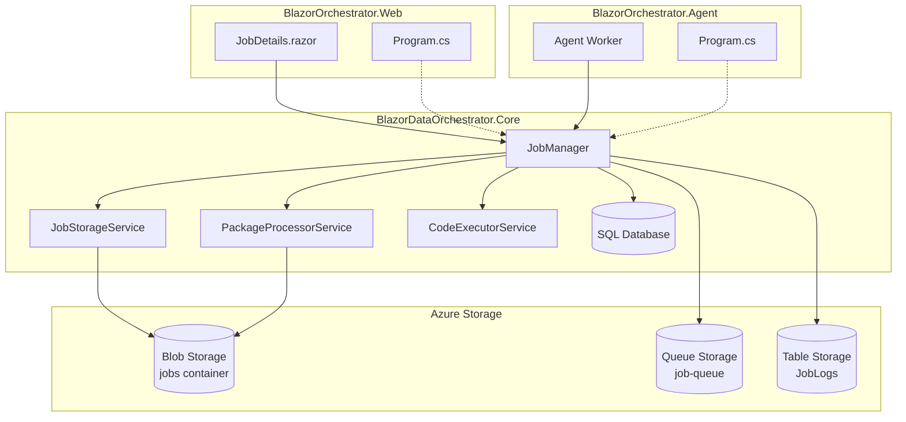
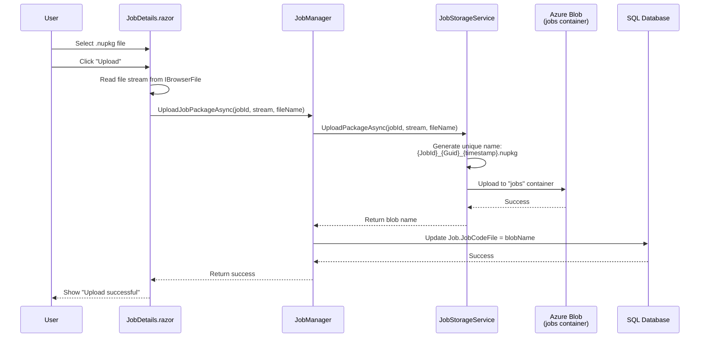
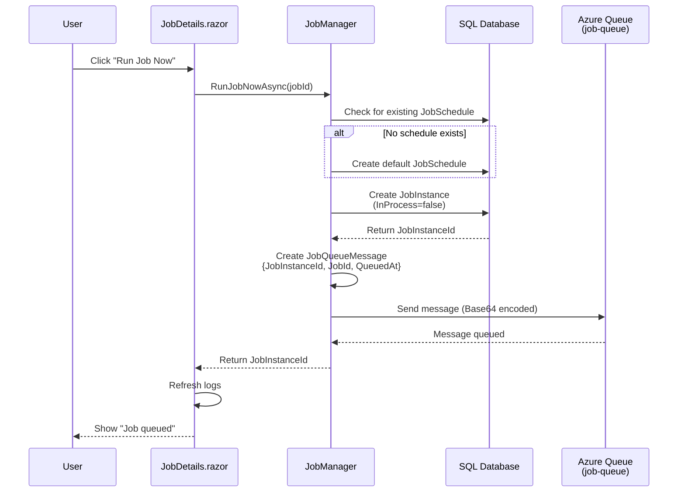
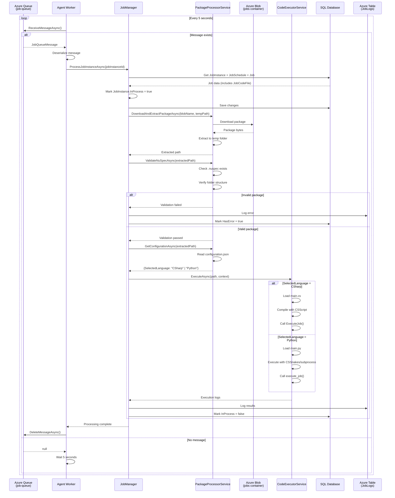
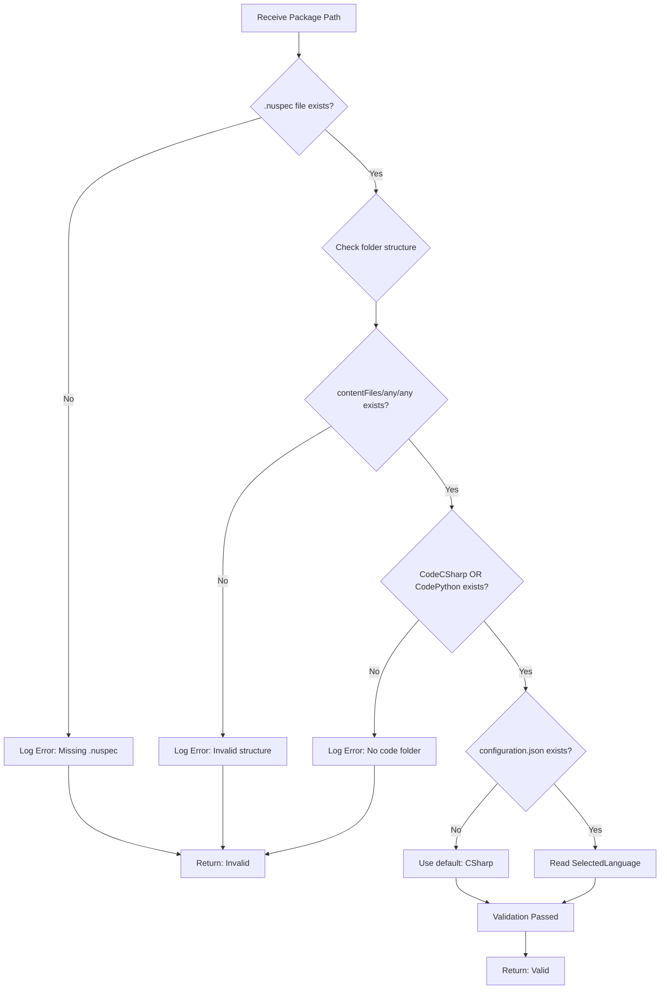
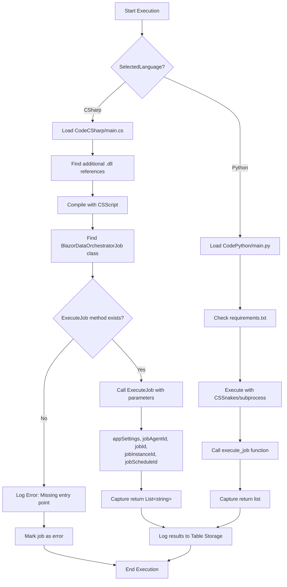
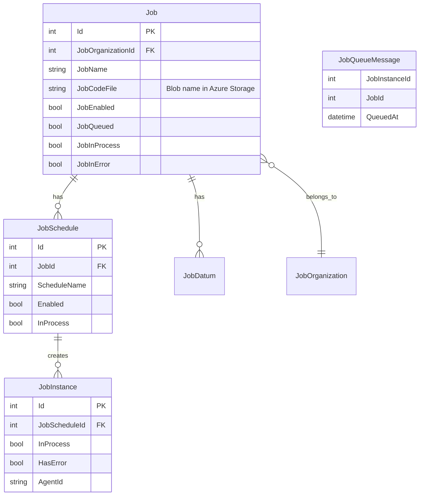
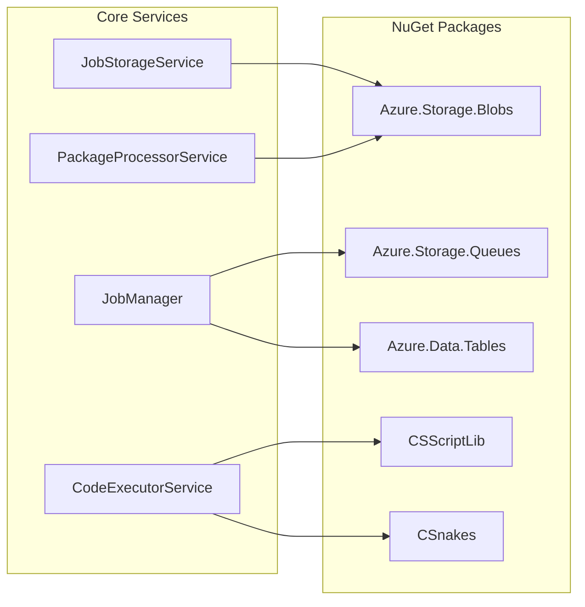

# NuGet Execution Feature - Process Diagrams

## Overall System Architecture

---

## Flow 1: Upload NuGet Package

---

## Flow 2: Run Job Now

---

## Flow 3: Agent Processing

---

## Flow 4: Package Validation Detail

---

## Flow 5: Code Execution Detail

---

## Data Model Relationships

---

## Component Dependencies

