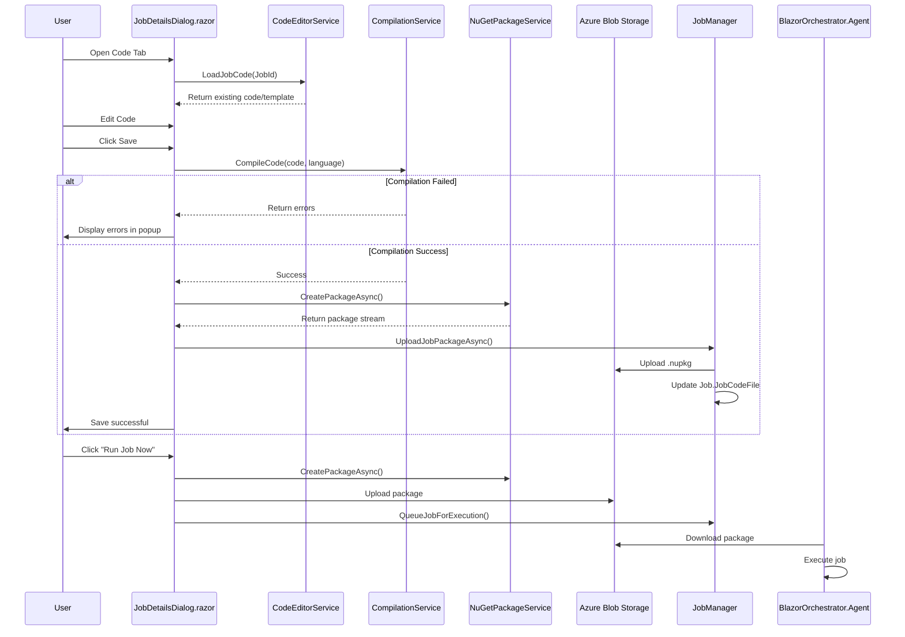
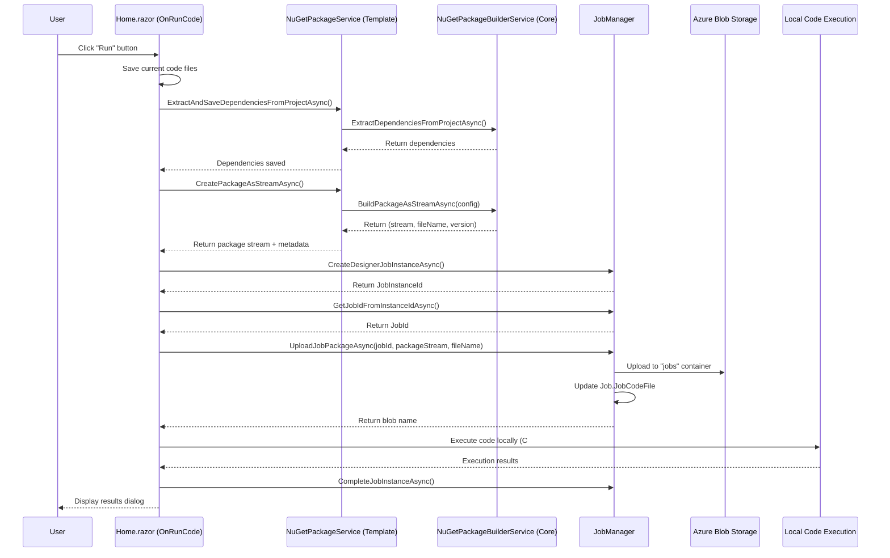

# Implementation Plan: Online C#/Python Code Editor

## Status Summary

| Feature | Status | Location |
|---------|--------|----------|
| Job Creator "Run Code" Feature | ✅ Complete | `BlazorDataOrchestrator.JobCreatorTemplate` |
| Online Code Editor in JobDetailsDialog | ✅ Complete | `BlazorOrchestrator.Web` |

---

## Part 1: Online Code Editor in JobDetailsDialog

### Status: ✅ Complete

---

### Overview

This plan implements an **Online Code Editor** feature within the `JobDetailsDialog.razor` page, enabling users to write, edit, compile, and deploy C# or Python code directly from the browser. The feature builds upon the existing code editor implementation in `BlazorDataOrchestrator.JobCreatorTemplate\Components\Pages\Home.razor`.

### Key Capabilities:
1. **In-browser code editing** for C# and Python
2. **Language selection** that updates `configuration.json`
3. **AppSettings editing** for job configuration
4. **Code compilation validation** with error display
5. **NuGet package creation and deployment** to Azure Blob Storage
6. **Job module registration**
7. **Run Job Now** functionality with Agent execution

---

## Code Tab UI Requirements

The Code Tab UI on the `JobDetailsDialog.razor` page must implement the following requirements:

### UI Mode Selection
1. **Two Modes**: The Code Tab UI must have two modes selectable by a dropdown:
   - **Code Edit** - For editing code directly in the browser
   - **Code Upload** - For uploading pre-packaged NuGet files
2. **Default Mode**: The default mode is **"Code Edit"**

### Run Now Button Behavior
3. **Run Now Button Visibility on Code Tab**: The "Run Now" button on the Code Tab UI must **only show when Code Tab UI is in Code Edit mode**
4. **Run Now Button on Details Tab**: A "Run Job Now" button already exists on the Details tab (first tab) of the `JobDetailsDialog.razor` page
5. **Run Now Button Action**: The user must click a "Run Now" button to run the code/job

### Code Compilation and Package Management
5. **Compilation and NuGet Package Creation**: If the code compiles successfully, the code is saved as a NuGet package that is then associated with the Job
6. **Package Retrieval on Mode Switch**: If the user switches to "Code Upload" mode and then switches back to "Code Edit" mode, if there is a saved NuGet package associated with the job, the NuGet package is retrieved and unzipped to restore the code in the editor

### NuGet References (C#)
7. **NuGet Package References**: When using C#, a NuGet package can be referenced using CS-Script NuGet Support: https://github.com/oleg-shilo/cs-script/wiki/NuGet-Support

---

## Architecture Overview



---

## Phase 1: Add Monaco Code Editor Component

### 1.1 Install Required NuGet Packages
- [ ] **Project:** `BlazorOrchestrator.Web`

Add the following packages:
```xml
<PackageReference Include="SimpleBlazorMonaco" Version="*" />
<PackageReference Include="Microsoft.CodeAnalysis.CSharp" Version="*" />
```

### 1.2 Create Code Editor Service
- [ ] **File:** `src/BlazorOrchestrator.Web/Services/JobCodeEditorService.cs`

```csharp
using BlazorOrchestrator.Web.Data.Data;
using BlazorDataOrchestrator.Core;
using Microsoft.CodeAnalysis;
using Microsoft.CodeAnalysis.CSharp;

namespace BlazorOrchestrator.Web.Services;

public class JobCodeEditorService
{
    private readonly JobManager _jobManager;
    private readonly IConfiguration _configuration;
    
    // Default code templates
    private const string DefaultCSharpTemplate = @"using System;
using System.Threading.Tasks;

public class JobExecutor
{
    public async Task ExecuteAsync()
    {
        // Your job code here
        Console.WriteLine(""Job executed successfully!"");
        await Task.CompletedTask;
    }
}";

    private const string DefaultPythonTemplate = @"# Job Python Script
import json

def execute():
    """"""Main job execution entry point.""""""
    print(""Job executed successfully!"")

if __name__ == ""__main__"":
    execute()
";

    public JobCodeEditorService(JobManager jobManager, IConfiguration configuration)
    {
        _jobManager = jobManager;
        _configuration = configuration;
    }

    public string GetDefaultTemplate(string language)
    {
        return language.ToLower() switch
        {
            "csharp" or "cs" => DefaultCSharpTemplate,
            "python" or "py" => DefaultPythonTemplate,
            _ => DefaultCSharpTemplate
        };
    }

    public async Task<JobCodeModel> LoadJobCodeAsync(int jobId)
    {
        // Load existing code from job or return default template
        // Implementation to load from blob storage or database
    }

    public async Task<CompilationResult> CompileCodeAsync(string code, string language)
    {
        // Compile and validate code
    }

    public async Task<string> SaveJobCodeAsync(int jobId, JobCodeModel codeModel)
    {
        // Save code and create NuGet package
    }
}

public class JobCodeModel
{
    public string MainCode { get; set; } = "";
    public string Language { get; set; } = "csharp";
    public string AppSettings { get; set; } = "{}";
    public string AppSettingsProduction { get; set; } = "{}";
}

public class CompilationResult
{
    public bool Success { get; set; }
    public List<CompilationError> Errors { get; set; } = new();
}

public class CompilationError
{
    public string Message { get; set; } = "";
    public int Line { get; set; }
    public int Column { get; set; }
    public string Severity { get; set; } = "Error";
}
```

### 1.3 Register Service in Program.cs
- [ ] **File:** `src/BlazorOrchestrator.Web/Program.cs`

```csharp
builder.Services.AddScoped<JobCodeEditorService>();
```

---

## Phase 2: Update JobDetailsDialog.razor - Code Tab UI

### 2.1 Add Code Editor Imports and Injections
- [ ] **File:** `src/BlazorOrchestrator.Web/Components/Pages/Dialogs/JobDetailsDialog.razor`

Add to the top of the file:
```razor
@using SimpleBlazorMonaco
@using MonacoRazor
@inject JobCodeEditorService CodeEditorService
```

### 2.2 Replace Existing Code Tab Content
- [ ] **File:** `src/BlazorOrchestrator.Web/Components/Pages/Dialogs/JobDetailsDialog.razor`

Replace the existing `<RadzenTabsItem Text="Code" Icon="code">` section with:

```razor
<RadzenTabsItem Text="Code" Icon="code">
    @* Code Editor Tab Content *@
    <RadzenStack Gap="1rem" Style="padding: 1rem 0; height: 500px;">
        @* Toolbar *@
        <RadzenStack Orientation="Orientation.Horizontal" AlignItems="AlignItems.Center" 
                     JustifyContent="JustifyContent.SpaceBetween" Gap="1rem">
            <RadzenStack Orientation="Orientation.Horizontal" AlignItems="AlignItems.Center" Gap="0.5rem">
                @* Language Selection *@
                <RadzenLabel Text="Language:" Style="font-weight: 500;" />
                <RadzenDropDown @bind-Value="@codeLanguage" Data="@languageOptions"
                                TextProperty="Name" ValueProperty="Value"
                                Style="min-width: 120px;" Change="@OnLanguageChanged"
                                Disabled="@(codeEditMode == CodeEditMode.Upload)" />
                
                @* Edit Mode Toggle *@
                <RadzenLabel Text="Mode:" Style="font-weight: 500; margin-left: 1rem;" />
                <RadzenSelectBar @bind-Value="@codeEditMode" TValue="CodeEditMode" Size="ButtonSize.Small">
                    <Items>
                        <RadzenSelectBarItem Text="Editor" Value="CodeEditMode.Editor" />
                        <RadzenSelectBarItem Text="Upload" Value="CodeEditMode.Upload" />
                    </Items>
                </RadzenSelectBar>
                
                @* File Selector (when in Editor mode) *@
                @if (codeEditMode == CodeEditMode.Editor)
                {
                    <RadzenDropDown @bind-Value="@selectedCodeFile" Data="@codeFileList"
                                    Style="min-width: 180px; margin-left: 1rem;"
                                    Change="@OnCodeFileChanged" AllowClear="false" />
                }
            </RadzenStack>
            
            <RadzenStack Orientation="Orientation.Horizontal" Gap="0.5rem">
                @if (codeEditMode == CodeEditMode.Editor)
                {
                    <RadzenButton Text="Save & Compile" Icon="save" ButtonStyle="ButtonStyle.Primary" 
                                  Size="ButtonSize.Small" Click="@SaveAndCompileCode" 
                                  IsBusy="@isCompilingCode" />
                }
                <RadzenButton Text="Run Job Now" Icon="play_arrow" ButtonStyle="ButtonStyle.Success" 
                              Size="ButtonSize.Small" Click="@RunJobWithCode" 
                              IsBusy="@isRunningJobWithCode" />
            </RadzenStack>
        </RadzenStack>

        @* Editor or Upload Section *@
        @if (codeEditMode == CodeEditMode.Editor)
        {
            @* Code Editor Area *@
            <div style="flex-grow: 1; border: 1px solid #e8e8e8; border-radius: 8px; overflow: hidden;">
                <CodeEditor @ref="jobCodeEditor"
                            Language="@GetMonacoLanguageForJob()"
                            Code="@currentJobCode"
                            Height="100%"
                            Width="100%"
                            Border="0"
                            Margin="0" />
            </div>
        }
        else
        {
            @* File Upload Section *@
            <RadzenStack Gap="1rem" Style="padding: 1rem; background: #f8f9fa; border-radius: 8px; flex-grow: 1;">
                <RadzenStack Gap="0.5rem">
                    <RadzenText TextStyle="TextStyle.Subtitle2" Style="font-weight: 600;">
                        Current Code Package
                    </RadzenText>
                    <RadzenText TextStyle="TextStyle.Body2" 
                                Style="font-family: monospace; background: #ffffff; padding: 0.5rem; border-radius: 4px;">
                        @(string.IsNullOrEmpty(Job.JobCodeFile) ? "No code file uploaded" : Job.JobCodeFile)
                    </RadzenText>
                </RadzenStack>

                <RadzenStack Gap="0.5rem">
                    <RadzenText TextStyle="TextStyle.Subtitle2" Style="font-weight: 600;">
                        Upload NuGet Package (.nupkg)
                    </RadzenText>
                    <RadzenStack Orientation="Orientation.Horizontal" Gap="0.5rem" AlignItems="AlignItems.Center">
                        <InputFile OnChange="@OnFileSelected" accept=".nupkg,.zip" Disabled="@IsUploading" />
                        @if (IsUploading)
                        {
                            <RadzenProgressBarCircular ShowValue="false" 
                                                       Mode="ProgressBarMode.Indeterminate" 
                                                       Size="ProgressBarCircularSize.Small" />
                            <RadzenText TextStyle="TextStyle.Body2">Uploading...</RadzenText>
                        }
                    </RadzenStack>
                </RadzenStack>
            </RadzenStack>
        }

        @* AppSettings Editor (visible in Editor mode) *@
        @if (codeEditMode == CodeEditMode.Editor && selectedCodeFile?.EndsWith(".json") == true)
        {
            <RadzenStack Gap="0.5rem">
                <RadzenText TextStyle="TextStyle.Subtitle2" Style="font-weight: 600;">
                    AppSettings Configuration
                </RadzenText>
                <RadzenAlert AlertStyle="AlertStyle.Info" Shade="Shade.Lighter" AllowClose="false" Size="AlertSize.Small">
                    Edit the appsettings.json file to configure your job's settings.
                </RadzenAlert>
            </RadzenStack>
        }
    </RadzenStack>
</RadzenTabsItem>
```

### 2.3 Add Code Editor State Variables
- [ ] **File:** `src/BlazorOrchestrator.Web/Components/Pages/Dialogs/JobDetailsDialog.razor`

Add to the `@code` section:
```csharp
// Code Editor State
private CodeEditor? jobCodeEditor;
private string currentJobCode = "";
private string codeLanguage = "csharp";
private CodeEditMode codeEditMode = CodeEditMode.Editor;
private string? selectedCodeFile;
private List<string> codeFileList = new List<string> { "Program.cs", "appsettings.json", "appsettings.Production.json" };
private bool isCompilingCode = false;
private bool isRunningJobWithCode = false;

private List<LanguageOption> languageOptions = new List<LanguageOption>
{
    new LanguageOption { Name = "C#", Value = "csharp" },
    new LanguageOption { Name = "Python", Value = "python" }
};

public enum CodeEditMode
{
    Editor,
    Upload
}

public class LanguageOption
{
    public string Name { get; set; } = "";
    public string Value { get; set; } = "";
}
```

---

## Phase 3: Implement Code Editor Functionality

### 3.1 Add Language Change Handler
- [ ] **File:** `src/BlazorOrchestrator.Web/Components/Pages/Dialogs/JobDetailsDialog.razor`

```csharp
private async Task OnLanguageChanged()
{
    // Update file list based on language
    if (codeLanguage == "csharp")
    {
        codeFileList = new List<string> { "Program.cs", "appsettings.json", "appsettings.Production.json" };
    }
    else if (codeLanguage == "python")
    {
        codeFileList = new List<string> { "main.py", "requirements.txt", "appsettings.json" };
    }
    
    selectedCodeFile = codeFileList.FirstOrDefault();
    
    // Load default template or existing code
    currentJobCode = CodeEditorService.GetDefaultTemplate(codeLanguage);
    
    if (jobCodeEditor != null)
    {
        await jobCodeEditor.UpdateCodeAsync(currentJobCode);
        await jobCodeEditor.UpdateLanguageAsync(GetMonacoLanguageForJob());
    }
    
    StateHasChanged();
}

private string GetMonacoLanguageForJob()
{
    if (selectedCodeFile == null) return codeLanguage;
    
    var ext = Path.GetExtension(selectedCodeFile).ToLowerInvariant();
    return ext switch
    {
        ".cs" => "csharp",
        ".py" => "python",
        ".json" => "json",
        ".txt" => "plaintext",
        _ => codeLanguage
    };
}

private async Task OnCodeFileChanged()
{
    // Load content for selected file
    // This would load from in-memory storage or blob
    if (jobCodeEditor != null)
    {
        await jobCodeEditor.UpdateLanguageAsync(GetMonacoLanguageForJob());
    }
    StateHasChanged();
}
```

### 3.2 Implement Save and Compile Functionality
- [ ] **File:** `src/BlazorOrchestrator.Web/Components/Pages/Dialogs/JobDetailsDialog.razor`

```csharp
private async Task SaveAndCompileCode()
{
    if (jobCodeEditor == null || Job == null) return;
    
    isCompilingCode = true;
    StateHasChanged();
    
    try
    {
        // Get current code from editor
        currentJobCode = await jobCodeEditor.GetCodeAsync();
        
        // Attempt compilation
        var compilationResult = await CodeEditorService.CompileCodeAsync(currentJobCode, codeLanguage);
        
        if (!compilationResult.Success)
        {
            // Show compilation errors in popup dialog
            await ShowCompilationErrorsDialog(compilationResult.Errors);
            return;
        }
        
        // Compilation successful - create NuGet package and upload
        var packageResult = await CodeEditorService.SaveJobCodeAsync(Job.Id, new JobCodeModel
        {
            MainCode = currentJobCode,
            Language = codeLanguage,
            AppSettings = GetAppSettingsContent(),
            AppSettingsProduction = GetAppSettingsProductionContent()
        });
        
        // Update job record
        Job.JobCodeFile = packageResult;
        
        NotificationService.Notify(NotificationSeverity.Success, "Success", 
            "Code compiled and saved successfully!");
    }
    catch (Exception ex)
    {
        NotificationService.Notify(NotificationSeverity.Error, "Error", 
            $"Failed to save code: {ex.Message}");
    }
    finally
    {
        isCompilingCode = false;
        StateHasChanged();
    }
}

private async Task ShowCompilationErrorsDialog(List<CompilationError> errors)
{
    var errorMessage = string.Join("\n", errors.Select(e => 
        $"Line {e.Line}, Col {e.Column}: {e.Severity} - {e.Message}"));
    
    await DialogService.OpenAsync("Compilation Errors", ds =>
        @<RadzenStack Gap="1rem" Style="padding: 1rem;">
            <RadzenAlert AlertStyle="AlertStyle.Danger" AllowClose="false">
                The code could not be compiled. Please fix the errors below before saving.
            </RadzenAlert>
            <div style="max-height: 300px; overflow-y: auto; background: #1e1e1e; color: #d4d4d4; 
                        padding: 1rem; border-radius: 8px; font-family: 'Consolas', monospace; font-size: 12px;">
                @foreach (var error in errors)
                {
                    <div style="margin-bottom: 0.5rem; border-left: 3px solid @(error.Severity == "Error" ? "#f44336" : "#ff9800"); padding-left: 0.5rem;">
                        <span style="color: #9cdcfe;">Line @error.Line, Col @error.Column:</span>
                        <span style="color: @(error.Severity == "Error" ? "#f44336" : "#ff9800");">[@error.Severity]</span>
                        <span>@error.Message</span>
                    </div>
                }
            </div>
            <RadzenStack Orientation="Orientation.Horizontal" JustifyContent="JustifyContent.End">
                <RadzenButton Text="Close" ButtonStyle="ButtonStyle.Light" Click="@(() => ds.Close())" />
            </RadzenStack>
        </RadzenStack>,
        new DialogOptions { Width = "600px", Height = "auto" }
    );
}
```

### 3.3 Implement Run Job Now Functionality
- [ ] **File:** `src/BlazorOrchestrator.Web/Components/Pages/Dialogs/JobDetailsDialog.razor`

```csharp
private async Task RunJobWithCode()
{
    if (Job == null) return;
    
    isRunningJobWithCode = true;
    StateHasChanged();
    
    try
    {
        // If in editor mode, save and compile first
        if (codeEditMode == CodeEditMode.Editor && jobCodeEditor != null)
        {
            currentJobCode = await jobCodeEditor.GetCodeAsync();
            
            // Compile code
            var compilationResult = await CodeEditorService.CompileCodeAsync(currentJobCode, codeLanguage);
            
            if (!compilationResult.Success)
            {
                await ShowCompilationErrorsDialog(compilationResult.Errors);
                return;
            }
            
            // Create and upload NuGet package
            var packageResult = await CodeEditorService.SaveJobCodeAsync(Job.Id, new JobCodeModel
            {
                MainCode = currentJobCode,
                Language = codeLanguage,
                AppSettings = GetAppSettingsContent(),
                AppSettingsProduction = GetAppSettingsProductionContent()
            });
            
            Job.JobCodeFile = packageResult;
        }
        
        // Queue job for execution with Agent
        await JobManager.QueueJobForExecutionAsync(Job.Id);
        
        NotificationService.Notify(NotificationSeverity.Success, "Job Queued", 
            "Job has been queued for execution. Check the Logs tab for results.");
        
        // Switch to Logs tab
        SelectedTabIndex = 3; // Logs tab index
        await RefreshLogs();
    }
    catch (Exception ex)
    {
        NotificationService.Notify(NotificationSeverity.Error, "Error", 
            $"Failed to run job: {ex.Message}");
    }
    finally
    {
        isRunningJobWithCode = false;
        StateHasChanged();
    }
}

private string GetAppSettingsContent()
{
    // Return appsettings.json content from editor storage
    return "{}"; // TODO: Implement
}

private string GetAppSettingsProductionContent()
{
    // Return appsettings.Production.json content from editor storage
    return "{}"; // TODO: Implement
}
```

---

## Phase 4: Implement Compilation Service

### 4.1 Create C# Compilation Service
- [ ] **File:** `src/BlazorOrchestrator.Web/Services/CSharpCompilationService.cs`

```csharp
using Microsoft.CodeAnalysis;
using Microsoft.CodeAnalysis.CSharp;
using Microsoft.CodeAnalysis.Emit;
using System.Reflection;

namespace BlazorOrchestrator.Web.Services;

public class CSharpCompilationService
{
    private readonly ILogger<CSharpCompilationService> _logger;
    
    public CSharpCompilationService(ILogger<CSharpCompilationService> logger)
    {
        _logger = logger;
    }
    
    public CompilationResult Compile(string code, string assemblyName = "JobAssembly")
    {
        var result = new CompilationResult();
        
        try
        {
            var syntaxTree = CSharpSyntaxTree.ParseText(code);
            
            // Get references from current runtime
            var references = GetMetadataReferences();
            
            var compilation = CSharpCompilation.Create(
                assemblyName,
                new[] { syntaxTree },
                references,
                new CSharpCompilationOptions(OutputKind.DynamicallyLinkedLibrary));
            
            using var ms = new MemoryStream();
            var emitResult = compilation.Emit(ms);
            
            result.Success = emitResult.Success;
            
            if (!emitResult.Success)
            {
                result.Errors = emitResult.Diagnostics
                    .Where(d => d.Severity == DiagnosticSeverity.Error || 
                                d.Severity == DiagnosticSeverity.Warning)
                    .Select(d => new CompilationError
                    {
                        Message = d.GetMessage(),
                        Line = d.Location.GetLineSpan().StartLinePosition.Line + 1,
                        Column = d.Location.GetLineSpan().StartLinePosition.Character + 1,
                        Severity = d.Severity == DiagnosticSeverity.Error ? "Error" : "Warning"
                    })
                    .ToList();
            }
        }
        catch (Exception ex)
        {
            _logger.LogError(ex, "Compilation failed with exception");
            result.Success = false;
            result.Errors.Add(new CompilationError
            {
                Message = $"Compilation exception: {ex.Message}",
                Line = 1,
                Column = 1,
                Severity = "Error"
            });
        }
        
        return result;
    }
    
    private IEnumerable<MetadataReference> GetMetadataReferences()
    {
        var assemblies = new[]
        {
            typeof(object).Assembly,
            typeof(Console).Assembly,
            typeof(Task).Assembly,
            Assembly.Load("System.Runtime"),
            Assembly.Load("System.Collections"),
            Assembly.Load("System.Linq"),
            Assembly.Load("System.Threading.Tasks"),
            Assembly.Load("netstandard")
        };
        
        return assemblies.Select(a => MetadataReference.CreateFromFile(a.Location));
    }
}
```

### 4.2 Create Python Validation Service
- [ ] **File:** `src/BlazorOrchestrator.Web/Services/PythonValidationService.cs`

```csharp
namespace BlazorOrchestrator.Web.Services;

public class PythonValidationService
{
    private readonly ILogger<PythonValidationService> _logger;
    
    public PythonValidationService(ILogger<PythonValidationService> logger)
    {
        _logger = logger;
    }
    
    public CompilationResult Validate(string code)
    {
        var result = new CompilationResult { Success = true };
        
        // Basic Python syntax validation
        // Note: Full Python compilation validation would require a Python runtime
        // This performs basic structural checks
        
        var lines = code.Split('\n');
        var indentStack = new Stack<int>();
        indentStack.Push(0);
        
        for (int i = 0; i < lines.Length; i++)
        {
            var line = lines[i];
            if (string.IsNullOrWhiteSpace(line)) continue;
            
            // Check for basic syntax errors
            var trimmedLine = line.TrimEnd();
            
            // Check for unclosed strings
            var singleQuotes = trimmedLine.Count(c => c == '\'');
            var doubleQuotes = trimmedLine.Count(c => c == '"');
            
            // Very basic checks - real validation would use Python parser
            if (trimmedLine.Contains("def ") && !trimmedLine.EndsWith(":"))
            {
                result.Success = false;
                result.Errors.Add(new CompilationError
                {
                    Message = "Function definition should end with ':'",
                    Line = i + 1,
                    Column = 1,
                    Severity = "Error"
                });
            }
            
            if (trimmedLine.Contains("if ") && !trimmedLine.EndsWith(":") && !trimmedLine.Contains(" else "))
            {
                result.Success = false;
                result.Errors.Add(new CompilationError
                {
                    Message = "If statement should end with ':'",
                    Line = i + 1,
                    Column = 1,
                    Severity = "Error"
                });
            }
        }
        
        return result;
    }
}
```

---

## Phase 5: Update NuGet Package Creation for Web Context

### 5.1 Create Web-Compatible Package Service
- [ ] **File:** `src/BlazorOrchestrator.Web/Services/WebNuGetPackageService.cs`

```csharp
using System.IO.Compression;
using System.Text;
using System.Xml.Linq;

namespace BlazorOrchestrator.Web.Services;

public class WebNuGetPackageService
{
    private readonly ILogger<WebNuGetPackageService> _logger;
    private readonly JobManager _jobManager;
    
    public WebNuGetPackageService(ILogger<WebNuGetPackageService> logger, JobManager jobManager)
    {
        _logger = logger;
        _jobManager = jobManager;
    }
    
    public async Task<(MemoryStream PackageStream, string FileName, string Version)> CreatePackageAsync(
        JobCodeModel codeModel,
        string packageId = "BlazorDataOrchestrator.Job",
        string? version = null)
    {
        version ??= $"1.0.{DateTime.Now:yyyyMMddHHmmss}";
        var fileName = $"{packageId}.{version}.nupkg";
        
        var packageStream = new MemoryStream();
        
        using (var archive = new ZipArchive(packageStream, ZipArchiveMode.Create, true))
        {
            // Add .nuspec file
            var nuspecContent = GenerateNuspec(packageId, version, codeModel.Language);
            var nuspecEntry = archive.CreateEntry($"{packageId}.nuspec");
            using (var writer = new StreamWriter(nuspecEntry.Open()))
            {
                await writer.WriteAsync(nuspecContent);
            }
            
            // Add code files based on language
            if (codeModel.Language == "csharp")
            {
                var codeEntry = archive.CreateEntry("content/Code/CodeCSharp/Program.cs");
                using (var writer = new StreamWriter(codeEntry.Open()))
                {
                    await writer.WriteAsync(codeModel.MainCode);
                }
            }
            else if (codeModel.Language == "python")
            {
                var codeEntry = archive.CreateEntry("content/Code/CodePython/main.py");
                using (var writer = new StreamWriter(codeEntry.Open()))
                {
                    await writer.WriteAsync(codeModel.MainCode);
                }
            }
            
            // Add configuration.json
            var configEntry = archive.CreateEntry("content/Code/configuration.json");
            using (var writer = new StreamWriter(configEntry.Open()))
            {
                var configJson = $"{{\"SelectedLanguage\": \"{codeModel.Language}\"}}";
                await writer.WriteAsync(configJson);
            }
            
            // Add appsettings files
            var appSettingsEntry = archive.CreateEntry("content/appsettings.json");
            using (var writer = new StreamWriter(appSettingsEntry.Open()))
            {
                await writer.WriteAsync(codeModel.AppSettings);
            }
            
            var appSettingsProdEntry = archive.CreateEntry("content/appsettingsProduction.json");
            using (var writer = new StreamWriter(appSettingsProdEntry.Open()))
            {
                await writer.WriteAsync(codeModel.AppSettingsProduction);
            }
        }
        
        packageStream.Position = 0;
        return (packageStream, fileName, version);
    }
    
    private string GenerateNuspec(string packageId, string version, string language)
    {
        var suffix = language == "python" ? ".PYTHON" : "";
        
        return $@"<?xml version=""1.0"" encoding=""utf-8""?>
<package xmlns=""http://schemas.microsoft.com/packaging/2013/05/nuspec.xsd"">
  <metadata>
    <id>{packageId}{suffix}</id>
    <version>{version}</version>
    <authors>BlazorDataOrchestrator</authors>
    <description>Auto-generated job package</description>
    <contentFiles>
      <files include=""**/*"" buildAction=""Content"" copyToOutput=""true"" />
    </contentFiles>
  </metadata>
</package>";
    }
    
    public async Task<string> UploadPackageAsync(int jobId, MemoryStream packageStream, string fileName)
    {
        return await _jobManager.UploadJobPackageAsync(jobId, packageStream, fileName);
    }
}
```

---

## Phase 6: Initialize Code Editor on Tab Selection

### 6.1 Load Existing Job Code on Tab Change
- [ ] **File:** `src/BlazorOrchestrator.Web/Components/Pages/Dialogs/JobDetailsDialog.razor`

```csharp
private async Task OnTabChanged(int index)
{
    SelectedTabIndex = index;
    
    // If Code tab selected (index 4), initialize code editor
    if (index == 4 && Job != null)
    {
        await InitializeCodeEditor();
    }
}

private async Task InitializeCodeEditor()
{
    if (Job == null) return;
    
    try
    {
        // Try to load existing code from job
        var codeModel = await CodeEditorService.LoadJobCodeAsync(Job.Id);
        
        if (codeModel != null && !string.IsNullOrEmpty(codeModel.MainCode))
        {
            currentJobCode = codeModel.MainCode;
            codeLanguage = codeModel.Language;
        }
        else
        {
            // Load default template
            currentJobCode = CodeEditorService.GetDefaultTemplate(codeLanguage);
        }
        
        // Update file list based on language
        await OnLanguageChanged();
        
        // Update editor
        if (jobCodeEditor != null)
        {
            await jobCodeEditor.UpdateCodeAsync(currentJobCode);
        }
    }
    catch (Exception ex)
    {
        NotificationService.Notify(NotificationSeverity.Warning, "Warning", 
            $"Could not load existing code: {ex.Message}");
        currentJobCode = CodeEditorService.GetDefaultTemplate(codeLanguage);
    }
    
    StateHasChanged();
}
```

---

## Phase 7: Configuration.json Language Setting

### 7.1 Update Configuration on Language Change
- [ ] **File:** `src/BlazorOrchestrator.Web/Services/JobCodeEditorService.cs`

Add method to update configuration:
```csharp
public async Task UpdateJobLanguageConfigurationAsync(int jobId, string language)
{
    // Store language preference in job metadata or configuration
    // This will be included in the NuGet package's configuration.json
}
```

---

## Phase 8: In-Memory File Storage for Editor

### 8.1 Create Editor File Storage Service
- [ ] **File:** `src/BlazorOrchestrator.Web/Services/EditorFileStorageService.cs`

```csharp
namespace BlazorOrchestrator.Web.Services;

public class EditorFileStorageService
{
    private readonly Dictionary<int, Dictionary<string, string>> _jobFiles = new();
    
    public void SetFile(int jobId, string fileName, string content)
    {
        if (!_jobFiles.ContainsKey(jobId))
        {
            _jobFiles[jobId] = new Dictionary<string, string>();
        }
        _jobFiles[jobId][fileName] = content;
    }
    
    public string? GetFile(int jobId, string fileName)
    {
        if (_jobFiles.TryGetValue(jobId, out var files))
        {
            return files.TryGetValue(fileName, out var content) ? content : null;
        }
        return null;
    }
    
    public Dictionary<string, string> GetAllFiles(int jobId)
    {
        return _jobFiles.TryGetValue(jobId, out var files) 
            ? new Dictionary<string, string>(files) 
            : new Dictionary<string, string>();
    }
    
    public void ClearFiles(int jobId)
    {
        _jobFiles.Remove(jobId);
    }
}
```

---

## Testing Plan

### Unit Tests
- [ ] Test C# code compilation with valid code
- [ ] Test C# code compilation with invalid code (verify errors returned)
- [ ] Test Python validation with valid code
- [ ] Test Python validation with invalid code
- [ ] Test NuGet package creation
- [ ] Test package upload to Azure Blob Storage

### Integration Tests
- [ ] Test full flow: Edit → Compile → Save → Run
- [ ] Test language switching preserves code for each language
- [ ] Test error dialog display with multiple errors
- [ ] Test Run Job Now with Agent execution

### UI Tests
- [ ] Test code editor loads correctly
- [ ] Test language dropdown changes editor syntax highlighting
- [ ] Test file selector switches between files
- [ ] Test Edit/Upload mode toggle
- [ ] Test Save & Compile button state during compilation

---

## Dependencies

### NuGet Packages Required
```xml
<PackageReference Include="SimpleBlazorMonaco" Version="1.0.0" />
<PackageReference Include="Microsoft.CodeAnalysis.CSharp" Version="4.8.0" />
```

### Existing Services Used
- `JobManager` - For job operations and blob storage
- `JobService` - For job CRUD operations
- `NotificationService` - For user notifications
- `DialogService` - For popup dialogs

---

## File Changes Summary

| File | Action | Description |
|------|--------|-------------|
| `BlazorOrchestrator.Web.csproj` | Modify | Add NuGet package references |
| `Program.cs` | Modify | Register new services |
| `JobDetailsDialog.razor` | Modify | Add code editor UI and functionality |
| `JobCodeEditorService.cs` | Create | Main code editor service |
| `CSharpCompilationService.cs` | Create | C# compilation service |
| `PythonValidationService.cs` | Create | Python validation service |
| `WebNuGetPackageService.cs` | Create | NuGet package creation for web |
| `EditorFileStorageService.cs` | Create | In-memory file storage |

---

## Timeline Estimate

| Phase | Description | Estimated Time |
|-------|-------------|----------------|
| Phase 1 | Monaco Editor Setup | 2 hours |
| Phase 2 | UI Implementation | 3 hours |
| Phase 3 | Editor Functionality | 4 hours |
| Phase 4 | Compilation Services | 3 hours |
| Phase 5 | NuGet Package Service | 2 hours |
| Phase 6 | Tab Initialization | 1 hour |
| Phase 7 | Configuration Management | 1 hour |
| Phase 8 | File Storage Service | 1 hour |
| Testing | All phases | 3 hours |
| **Total** | | **20 hours** |

---

## Notes

1. **Monaco Editor**: The same Monaco editor component used in `JobCreatorTemplate\Home.razor` should be reused for consistency.

2. **Compilation Limitations**: Full Python compilation validation requires a Python runtime. The validation service provides basic syntax checking only.

3. **Security Considerations**: Code execution happens on the Agent, not in the browser. The web interface only creates packages.

4. **Blob Storage**: Packages are stored in Azure Blob Storage and referenced by the `Job.JobCodeFile` property.

5. **Agent Execution**: The "Run Job Now" feature queues the job for the `BlazorOrchestrator.Agent` to execute, following the existing job execution pattern.

---
---

## Part 2: Job Creator "Run Code" Feature - NuGet Upload & Job Association

### Status: ✅ Complete

---

### Overview

This section documents the completed functionality in the `OnRunCode` method in `Home.razor` (JobCreatorTemplate) to:
1. **Create a NuGet package** from the current code files
2. **Upload the package to Azure Blob Storage**
3. **Associate the uploaded package with the Job record** that is created
4. **Continue to execute the code locally** for debugging in Visual Studio

The goal is to ensure that every time code is run from the Job Creator, a deployable NuGet package is created, stored, and linked to the job - enabling the same job to be executed later by the Agent service.

---

### Architecture Overview (Job Creator)



---

### Phase 1: Update NuGetPackageService

#### 1.1 Add Method to Return Package as Stream
- [x] **File:** `src/BlazorDataOrchestrator.JobCreatorTemplate/Services/NuGetPackageService.cs`

**Implementation:** The `NuGetPackageService` now wraps the Core `NuGetPackageBuilderService` and provides the `CreatePackageAsStreamAsync()` method:

```csharp
/// <summary>
/// Creates a NuGet package and returns it as a MemoryStream along with metadata.
/// </summary>
public async Task<(MemoryStream PackageStream, string FileName, string Version)> CreatePackageAsStreamAsync(
    string packageId = "BlazorDataOrchestrator.Job",
    string? version = null,
    string? description = null,
    string? authors = null)
{
    var config = CreateBuildConfiguration(packageId, version, description, authors);
    
    var result = await _builderService.BuildPackageAsStreamAsync(config);

    if (result == null)
    {
        _logger.LogError("Failed to create package as stream");
        throw new InvalidOperationException("Failed to create package as stream");
    }

    _logger.LogInformation("Created package as stream: {FileName} (version {Version})", result.Value.FileName, result.Value.Version);

    return result.Value;
}
```

---

### Phase 2: Register JobManager in JobCreatorTemplate

#### 2.1 Add JobManager Service Registration
- [x] **File:** `src/BlazorDataOrchestrator.JobCreatorTemplate/Program.cs`

```csharp
builder.Services.AddScoped<JobManager>(sp =>
{
    var config = sp.GetRequiredService<IConfiguration>();
    var sqlConnectionString = config.GetConnectionString("blazororchestratordb") ?? "";
    var blobConnectionString = config.GetConnectionString("blobs") ?? "";
    var queueConnectionString = config.GetConnectionString("queues") ?? "";
    var tableConnectionString = config.GetConnectionString("tables") ?? "";
    return new JobManager(sqlConnectionString, blobConnectionString, queueConnectionString, tableConnectionString);
});
```

---

### Phase 3: Update Home.razor OnRunCode Method

#### 3.1 Inject Required Services
- [x] **File:** `src/BlazorDataOrchestrator.JobCreatorTemplate/Components/Pages/Home.razor`

```razor
@inject JobManager InjectedJobManager
```

#### 3.2 OnRunCode Flow
- [x] The updated flow:
  1. Save current code files
  2. Create NuGet package as stream
  3. Load and patch AppSettings with connection strings from Aspire environment
  4. Create Job Instance (get JobId from existing or create new)
  5. Upload package to Azure Blob Storage and associate with Job
  6. Execute code locally for debugging (C# or Python)
  7. Complete job instance and display results

---

### Phase 4: Testing Checklist

#### Manual Testing
- [x] Run code in Development mode
- [x] Run code in Production mode
- [x] Verify package contents
- [x] Verify Job record in database

#### Edge Cases
- [x] Run when Azure Storage is unavailable (logs error but still executes locally)
- [x] Run multiple times in succession (creates new package with unique name)
- [x] Run with unsaved changes (changes saved before package creation)

---

### Files Modified (Job Creator Feature)

| File | Changes |
|------|---------|
| `src/BlazorDataOrchestrator.Core/Services/NuGetPackageBuilderService.cs` | **NEW** - Shared NuGet package building logic |
| `src/BlazorDataOrchestrator.Core/Models/NuGetDependency.cs` | **NEW** - Dependency model classes |
| `src/BlazorDataOrchestrator.JobCreatorTemplate/Services/NuGetPackageService.cs` | Refactored as wrapper around Core service |
| `src/BlazorDataOrchestrator.JobCreatorTemplate/Program.cs` | Registered `JobManager` as scoped service |
| `src/BlazorDataOrchestrator.JobCreatorTemplate/Components/Pages/Home.razor` | Updated `OnRunCode` with package creation/upload |

---

### Implementation Notes

1. **JobManager Fallback Pattern**: Uses `var activeJobManager = jobManager ?? InjectedJobManager;` to support both manual initialization and dependency injection.

2. **Graceful Degradation**: Package creation and upload failures are logged as warnings but do not prevent local code execution.

3. **Stream Management**: Package streams are properly disposed in a `finally` block to prevent memory leaks.

4. **Connection String Patching**: Patches connection strings from Aspire environment variables into the appsettings JSON at runtime.

5. **Job Instance Lifecycle**: Properly calls `CompleteJobInstanceAsync()` with success/failure status after code execution.

6. **Package Versioning**: Auto-generated using `1.0.{DateTime.Now:yyyyMMddHHmmss}` format.

7. **Content Files Structure**: NuGet packages use standard `contentFiles/any/any/` structure.

---

### Code Refactoring Summary

The following code was moved from `JobCreatorTemplate` to `BlazorDataOrchestrator.Core` for shared use:

**Moved to Core:**
- `PackageDependency`, `DependenciesConfig`, `NuGetDependency`, `NuGetDependencyGroup`, `NuGetResolutionResult` → `BlazorDataOrchestrator.Core.Models.NuGetDependency.cs`
- Package building logic → `NuGetPackageBuilderService` in `BlazorDataOrchestrator.Core.Services`

**Default Dependencies:**
- `Microsoft.EntityFrameworkCore` v10.0.0
- `Microsoft.EntityFrameworkCore.SqlServer` v10.0.0
- `Azure.Data.Tables` v12.9.1

**Benefits:**
- Core project can create NuGet packages independently
- Shared models eliminate duplication
- Better separation of concerns

---

### Summary

This feature enables a seamless workflow where:
1. Developer writes/edits code in the Job Creator
2. Clicking "Run" automatically packages the code
3. Package is uploaded and associated with the Job record
4. Code is also executed locally for immediate debugging
5. The same job can later be run by the Agent service using the uploaded package

This bridges the gap between development/debugging in the Job Creator and production execution by the Agent.
