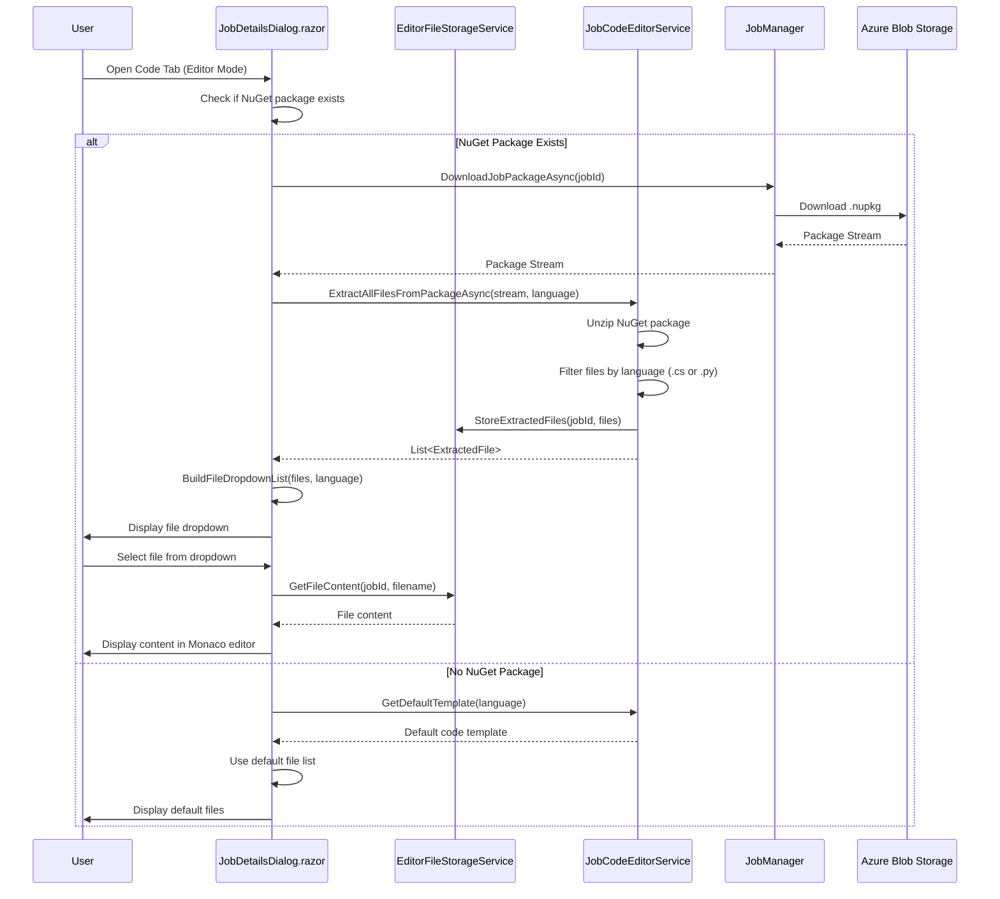

# Online Job Editor Enhancements Plan

## Status Summary

| Feature | Status | Location |
|---------|--------|----------|
| NuGet Package File Extraction in Editor Mode | ✅ Implemented | `JobDetailsDialog.razor`, `JobCodeEditorService.cs` |
| Dynamic File Dropdown Based on Language | ✅ Implemented | `JobDetailsDialog.razor` |
| Support for Additional .cs/.py Files | ✅ Implemented | `JobCodeEditorService.cs`, `EditorFileStorageService.cs` |

---

## Overview

This plan enhances the **Code Tab UI** in the `JobDetailsDialog.razor` page to support dynamic file listing from NuGet packages. When a user selects **Editor mode** and there is an existing NuGet package associated with the Job, the system will:

1. Unzip the NuGet package
2. Extract all relevant files based on the selected language
3. Populate the file dropdown with the appropriate files
4. Allow users to edit any of these files in the online editor

---

## Requirements

### Requirement #1: NuGet Package File Extraction in Editor Mode

**Description:** In the Code Tab UI in the `JobDetailsDialog.razor` page, when Editor mode is selected, if there is a NuGet package associated with the Job, the NuGet package should be unzipped and the files displayed in the online editor according to the language-specific rules below.

#### 1a. C# Language File Rules

When **C#** is selected for Language, the files displayed in the dropdown should be:

| File | Priority | Description |
|------|----------|-------------|
| `main.cs` | Required | Primary entry point code file |
| `appsettings.json` | Required | Development/default configuration |
| `appsettings.Production.json` | Required | Production configuration |
| `*.cs` (other) | Optional | Any additional .cs files found in the NuGet package |

**File Discovery Order:**
1. Look for `main.cs` (or `Program.cs` for backward compatibility)
2. Look for `appsettings.json`
3. Look for `appsettings.Production.json`
4. Enumerate any other `.cs` files found in the package

#### 1b. Python Language File Rules

When **Python** is selected for Language, the files displayed in the dropdown should be:

| File | Priority | Description |
|------|----------|-------------|
| `main.py` | Required | Primary entry point script |
| `appsettings.json` | Required | Development/default configuration |
| `appsettings.Production.json` | Required | Production configuration |
| `*.py` (other) | Optional | Any additional .py files found in the NuGet package |

**File Discovery Order:**
1. Look for `main.py`
2. Look for `appsettings.json`
3. Look for `appsettings.Production.json`
4. Enumerate any other `.py` files found in the package

---

## Architecture Diagram



---

## Implementation Phases

### Phase 1: Extend JobCodeModel and Data Structures

#### 1.1 Update JobCodeModel

**File:** `src/BlazorOrchestrator.Web/Services/JobCodeEditorService.cs`

Add support for additional code files:

```csharp
public class JobCodeModel
{
    public string MainCode { get; set; } = "";
    public string Language { get; set; } = "csharp";
    public string AppSettings { get; set; } = "{}";
    public string AppSettingsProduction { get; set; } = "{}";
    public string? RequirementsTxt { get; set; }
    
    // NEW: Dictionary to store additional code files
    // Key = filename, Value = file content
    public Dictionary<string, string> AdditionalCodeFiles { get; set; } = new();
    
    // NEW: List of all discovered files for dropdown
    public List<string> DiscoveredFiles { get; set; } = new();
}
```

#### 1.2 Create ExtractedFileInfo Class

**File:** `src/BlazorOrchestrator.Web/Services/JobCodeEditorService.cs`

```csharp
public class ExtractedFileInfo
{
    public string FileName { get; set; } = "";
    public string RelativePath { get; set; } = "";
    public string Content { get; set; } = "";
    public bool IsMainFile { get; set; }
    public bool IsConfigFile { get; set; }
}
```

---

### Phase 2: Enhance JobCodeEditorService

#### 2.1 Add ExtractAllFilesFromPackageAsync Method

**File:** `src/BlazorOrchestrator.Web/Services/JobCodeEditorService.cs`

```csharp
/// <summary>
/// Extracts all relevant files from a NuGet package based on the selected language.
/// </summary>
/// <param name="packageStream">The NuGet package stream.</param>
/// <param name="language">The programming language (csharp or python).</param>
/// <returns>A JobCodeModel with all extracted files.</returns>
public async Task<JobCodeModel> ExtractAllFilesFromPackageAsync(Stream packageStream, string language)
{
    var model = new JobCodeModel { Language = language };
    var codeExtension = language.ToLower() == "python" ? ".py" : ".cs";
    var mainFileName = language.ToLower() == "python" ? "main.py" : "main.cs";
    
    using var archive = new ZipArchive(packageStream, ZipArchiveMode.Read);
    
    foreach (var entry in archive.Entries)
    {
        var entryPath = entry.FullName.Replace('\\', '/');
        var fileName = Path.GetFileName(entryPath);
        var lowerFileName = fileName.ToLowerInvariant();
        var lowerPath = entryPath.ToLowerInvariant();
        
        // Skip directories and metadata files
        if (string.IsNullOrEmpty(fileName) || 
            lowerPath.Contains(".nuspec") || 
            lowerPath.Contains("[content_types]") ||
            lowerPath.Contains("_rels/"))
        {
            continue;
        }
        
        using var reader = new StreamReader(entry.Open());
        var content = await reader.ReadToEndAsync();
        
        // Check for main code file
        if (lowerFileName == mainFileName || 
            (language == "csharp" && lowerFileName == "program.cs"))
        {
            model.MainCode = content;
            if (!model.DiscoveredFiles.Contains(mainFileName))
            {
                model.DiscoveredFiles.Insert(0, mainFileName); // Main file first
            }
        }
        // Check for appsettings files
        else if (lowerFileName == "appsettings.json")
        {
            model.AppSettings = content;
            if (!model.DiscoveredFiles.Contains("appsettings.json"))
            {
                model.DiscoveredFiles.Add("appsettings.json");
            }
        }
        else if (lowerFileName == "appsettings.production.json" || 
                 lowerFileName == "appsettingsproduction.json")
        {
            model.AppSettingsProduction = content;
            if (!model.DiscoveredFiles.Contains("appsettings.Production.json"))
            {
                model.DiscoveredFiles.Add("appsettings.Production.json");
            }
        }
        // Check for additional code files
        else if (fileName.EndsWith(codeExtension, StringComparison.OrdinalIgnoreCase))
        {
            model.AdditionalCodeFiles[fileName] = content;
            if (!model.DiscoveredFiles.Contains(fileName))
            {
                model.DiscoveredFiles.Add(fileName);
            }
        }
        // Check for requirements.txt (Python)
        else if (lowerFileName == "requirements.txt" && language == "python")
        {
            model.RequirementsTxt = content;
            if (!model.DiscoveredFiles.Contains("requirements.txt"))
            {
                model.DiscoveredFiles.Add("requirements.txt");
            }
        }
        // Check for configuration.json
        else if (lowerFileName == "configuration.json")
        {
            try
            {
                var config = JsonSerializer.Deserialize<ConfigurationModel>(content);
                if (config != null && !string.IsNullOrEmpty(config.SelectedLanguage))
                {
                    model.Language = config.SelectedLanguage;
                }
            }
            catch
            {
                // Ignore configuration parsing errors
            }
        }
    }

    // Ensure default file order: main file, appsettings, appsettings.Production, then others
    var orderedFiles = new List<string>();
    
    // Add main file first
    if (model.DiscoveredFiles.Contains(mainFileName))
    {
        orderedFiles.Add(mainFileName);
    }
    else if (language == "csharp" && model.DiscoveredFiles.Contains("Program.cs"))
    {
        orderedFiles.Add("Program.cs");
    }
    
    // Add config files
    if (model.DiscoveredFiles.Contains("appsettings.json"))
    {
        orderedFiles.Add("appsettings.json");
    }
    if (model.DiscoveredFiles.Contains("appsettings.Production.json"))
    {
        orderedFiles.Add("appsettings.Production.json");
    }
    
    // Add requirements.txt for Python
    if (language == "python" && model.DiscoveredFiles.Contains("requirements.txt"))
    {
        orderedFiles.Add("requirements.txt");
    }
    
    // Add remaining code files
    foreach (var file in model.DiscoveredFiles)
    {
        if (!orderedFiles.Contains(file))
        {
            orderedFiles.Add(file);
        }
    }
    
    model.DiscoveredFiles = orderedFiles;

    // Set defaults if main code not found
    if (string.IsNullOrEmpty(model.MainCode))
    {
        model.MainCode = GetDefaultTemplate(language);
        if (!model.DiscoveredFiles.Contains(mainFileName))
        {
            model.DiscoveredFiles.Insert(0, mainFileName);
        }
    }
    if (string.IsNullOrEmpty(model.AppSettings))
    {
        model.AppSettings = DefaultAppSettings;
        if (!model.DiscoveredFiles.Contains("appsettings.json"))
        {
            model.DiscoveredFiles.Add("appsettings.json");
        }
    }
    if (string.IsNullOrEmpty(model.AppSettingsProduction))
    {
        model.AppSettingsProduction = DefaultAppSettings;
        if (!model.DiscoveredFiles.Contains("appsettings.Production.json"))
        {
            model.DiscoveredFiles.Add("appsettings.Production.json");
        }
    }

    return model;
}
```

#### 2.2 Add GetFileContent Helper Method

**File:** `src/BlazorOrchestrator.Web/Services/JobCodeEditorService.cs`

```csharp
/// <summary>
/// Gets the content of a specific file from the JobCodeModel.
/// </summary>
/// <param name="model">The job code model.</param>
/// <param name="fileName">The name of the file to retrieve.</param>
/// <returns>The file content, or empty string if not found.</returns>
public string GetFileContent(JobCodeModel model, string fileName)
{
    var lowerFileName = fileName.ToLowerInvariant();
    var mainFileName = model.Language.ToLower() == "python" ? "main.py" : "main.cs";
    
    // Check main file
    if (lowerFileName == mainFileName.ToLower() || lowerFileName == "program.cs")
    {
        return model.MainCode;
    }
    
    // Check config files
    if (lowerFileName == "appsettings.json")
    {
        return model.AppSettings;
    }
    if (lowerFileName == "appsettings.production.json")
    {
        return model.AppSettingsProduction;
    }
    
    // Check requirements.txt
    if (lowerFileName == "requirements.txt" && !string.IsNullOrEmpty(model.RequirementsTxt))
    {
        return model.RequirementsTxt;
    }
    
    // Check additional files
    if (model.AdditionalCodeFiles.TryGetValue(fileName, out var content))
    {
        return content;
    }
    
    // Case-insensitive search in additional files
    var matchingKey = model.AdditionalCodeFiles.Keys
        .FirstOrDefault(k => k.Equals(fileName, StringComparison.OrdinalIgnoreCase));
    
    if (matchingKey != null)
    {
        return model.AdditionalCodeFiles[matchingKey];
    }
    
    return "";
}

/// <summary>
/// Updates the content of a specific file in the JobCodeModel.
/// </summary>
/// <param name="model">The job code model.</param>
/// <param name="fileName">The name of the file to update.</param>
/// <param name="content">The new content.</param>
public void SetFileContent(JobCodeModel model, string fileName, string content)
{
    var lowerFileName = fileName.ToLowerInvariant();
    var mainFileName = model.Language.ToLower() == "python" ? "main.py" : "main.cs";
    
    if (lowerFileName == mainFileName.ToLower() || lowerFileName == "program.cs")
    {
        model.MainCode = content;
    }
    else if (lowerFileName == "appsettings.json")
    {
        model.AppSettings = content;
    }
    else if (lowerFileName == "appsettings.production.json")
    {
        model.AppSettingsProduction = content;
    }
    else if (lowerFileName == "requirements.txt")
    {
        model.RequirementsTxt = content;
    }
    else
    {
        model.AdditionalCodeFiles[fileName] = content;
    }
}
```

---

### Phase 3: Update JobDetailsDialog.razor

#### 3.1 Add New State Variables

**File:** `src/BlazorOrchestrator.Web/Components/Pages/Dialogs/JobDetailsDialog.razor`

Add to the `@code` section:

```csharp
// Extended Code Editor State
private JobCodeModel? loadedCodeModel;
private bool isLoadingCodeFiles = false;
private bool hasLoadedPackageFiles = false;
```

#### 3.2 Add LoadPackageFilesAsync Method

**File:** `src/BlazorOrchestrator.Web/Components/Pages/Dialogs/JobDetailsDialog.razor`

```csharp
/// <summary>
/// Loads all files from the job's NuGet package when entering Editor mode.
/// </summary>
private async Task LoadPackageFilesAsync()
{
    if (Job == null || string.IsNullOrEmpty(Job.JobCodeFile) || hasLoadedPackageFiles)
    {
        return;
    }
    
    isLoadingCodeFiles = true;
    StateHasChanged();
    
    try
    {
        // Download the package from blob storage
        var packageStream = await JobManager.DownloadJobPackageAsync(Job.Id);
        
        if (packageStream != null)
        {
            // Extract all files based on current language
            loadedCodeModel = await CodeEditorService.ExtractAllFilesFromPackageAsync(
                packageStream, codeLanguage);
            
            // Update the file dropdown list
            if (loadedCodeModel.DiscoveredFiles.Any())
            {
                codeFileList = loadedCodeModel.DiscoveredFiles;
                selectedCodeFile = codeFileList.FirstOrDefault();
                
                // Load the first file's content
                if (selectedCodeFile != null)
                {
                    currentJobCode = CodeEditorService.GetFileContent(loadedCodeModel, selectedCodeFile);
                }
            }
            
            hasLoadedPackageFiles = true;
            _logger.LogInformation("Loaded {Count} files from package for job {JobId}", 
                codeFileList.Count, Job.Id);
        }
    }
    catch (Exception ex)
    {
        _logger.LogError(ex, "Failed to load package files for job {JobId}", Job?.Id);
        NotificationService.Notify(NotificationSeverity.Warning, "Warning", 
            "Could not load existing code package. Using default template.");
    }
    finally
    {
        isLoadingCodeFiles = false;
        StateHasChanged();
    }
}
```

#### 3.3 Update OnEditModeChanged Method

**File:** `src/BlazorOrchestrator.Web/Components/Pages/Dialogs/JobDetailsDialog.razor`

```csharp
private async Task OnEditModeChanged()
{
    if (codeEditMode == CodeEditMode.Editor)
    {
        // When switching to Editor mode, load package files if available
        await LoadPackageFilesAsync();
        
        // Initialize editor if needed
        if (!codeEditorInitialized && !string.IsNullOrEmpty(currentJobCode))
        {
            codeEditorInitialized = true;
            await Task.Delay(100); // Allow component to render
            if (jobCodeEditor != null)
            {
                await jobCodeEditor.UpdateCodeAsync(currentJobCode);
            }
        }
    }
    StateHasChanged();
}
```

#### 3.4 Update OnLanguageChanged Method

**File:** `src/BlazorOrchestrator.Web/Components/Pages/Dialogs/JobDetailsDialog.razor`

```csharp
private async Task OnLanguageChanged()
{
    // Reset loaded state when language changes
    hasLoadedPackageFiles = false;
    loadedCodeModel = null;
    
    // Set default file list based on language
    if (codeLanguage == "csharp")
    {
        codeFileList = new List<string> { "main.cs", "appsettings.json", "appsettings.Production.json" };
    }
    else if (codeLanguage == "python")
    {
        codeFileList = new List<string> { "main.py", "appsettings.json", "appsettings.Production.json" };
    }
    
    selectedCodeFile = codeFileList.FirstOrDefault();
    
    // If we have a package, reload files for the new language
    if (Job != null && !string.IsNullOrEmpty(Job.JobCodeFile))
    {
        await LoadPackageFilesAsync();
    }
    else
    {
        // Load default template for new language
        currentJobCode = CodeEditorService.GetDefaultTemplate(codeLanguage);
    }
    
    if (jobCodeEditor != null)
    {
        await jobCodeEditor.UpdateCodeAsync(currentJobCode);
        await jobCodeEditor.UpdateLanguageAsync(GetMonacoLanguageForJob());
    }
    
    StateHasChanged();
}
```

#### 3.5 Update OnCodeFileChanged Method

**File:** `src/BlazorOrchestrator.Web/Components/Pages/Dialogs/JobDetailsDialog.razor`

```csharp
private async Task OnCodeFileChanged()
{
    if (selectedCodeFile == null) return;
    
    // Save current file content before switching
    if (loadedCodeModel != null && jobCodeEditor != null)
    {
        var currentContent = await jobCodeEditor.GetCodeAsync();
        var previousFile = codeFileList.FirstOrDefault(f => 
            CodeEditorService.GetFileContent(loadedCodeModel, f) == currentJobCode);
        
        if (!string.IsNullOrEmpty(previousFile))
        {
            CodeEditorService.SetFileContent(loadedCodeModel, previousFile, currentContent);
        }
    }
    
    // Load content for selected file
    if (loadedCodeModel != null)
    {
        currentJobCode = CodeEditorService.GetFileContent(loadedCodeModel, selectedCodeFile);
    }
    else
    {
        // Fall back to default content
        currentJobCode = GetDefaultContentForFile(selectedCodeFile);
    }
    
    if (jobCodeEditor != null)
    {
        await jobCodeEditor.UpdateCodeAsync(currentJobCode);
        await jobCodeEditor.UpdateLanguageAsync(GetMonacoLanguageForJob());
    }
    
    StateHasChanged();
}

private string GetDefaultContentForFile(string fileName)
{
    var lowerFileName = fileName.ToLowerInvariant();
    
    if (lowerFileName.EndsWith(".json"))
    {
        return CodeEditorService.GetDefaultAppSettings();
    }
    if (lowerFileName.EndsWith(".cs") || lowerFileName.EndsWith(".py"))
    {
        return CodeEditorService.GetDefaultTemplate(codeLanguage);
    }
    if (lowerFileName == "requirements.txt")
    {
        return "# Python dependencies\n# Add your pip packages here\n";
    }
    
    return "";
}
```

#### 3.6 Update Code Tab UI for Loading State

**File:** `src/BlazorOrchestrator.Web/Components/Pages/Dialogs/JobDetailsDialog.razor`

Update the Code Tab to show loading indicator:

```razor
<RadzenTabsItem Text="Code" Icon="code">
    @* Code Editor Tab Content *@
    <RadzenStack Gap="1rem" Style="padding: 1rem 0; height: 500px;">
        @if (isLoadingCodeFiles)
        {
            <RadzenStack AlignItems="AlignItems.Center" JustifyContent="JustifyContent.Center" 
                         Style="flex-grow: 1;">
                <RadzenProgressBarCircular ShowValue="false" Mode="ProgressBarMode.Indeterminate" />
                <RadzenText TextStyle="TextStyle.Body1">Loading code files from package...</RadzenText>
            </RadzenStack>
        }
        else
        {
            @* Existing toolbar and editor content *@
            @* ... existing code ... *@
        }
    </RadzenStack>
</RadzenTabsItem>
```

---

### Phase 4: Update WebNuGetPackageService

#### 4.1 Update Package Creation to Include Additional Files

**File:** `src/BlazorOrchestrator.Web/Services/WebNuGetPackageService.cs`

```csharp
/// <summary>
/// Creates a NuGet package from a JobCodeModel including all additional files.
/// </summary>
/// <param name="model">The job code model with all files.</param>
/// <param name="packageId">The package ID.</param>
/// <param name="version">The package version.</param>
/// <returns>The package stream.</returns>
public async Task<Stream> CreatePackageFromModelAsync(
    JobCodeModel model, 
    string packageId, 
    string version)
{
    var memoryStream = new MemoryStream();
    
    using (var archive = new ZipArchive(memoryStream, ZipArchiveMode.Create, leaveOpen: true))
    {
        var codeFolder = model.Language.ToLower() == "python" ? "CodePython" : "CodeCSharp";
        var mainFileName = model.Language.ToLower() == "python" ? "main.py" : "main.cs";
        
        // Add main code file
        await AddEntryAsync(archive, $"contentFiles/any/any/{codeFolder}/{mainFileName}", model.MainCode);
        
        // Add appsettings files
        await AddEntryAsync(archive, $"contentFiles/any/any/{codeFolder}/appsettings.json", model.AppSettings);
        await AddEntryAsync(archive, $"contentFiles/any/any/{codeFolder}/appsettings.Production.json", model.AppSettingsProduction);
        
        // Add requirements.txt for Python
        if (model.Language.ToLower() == "python" && !string.IsNullOrEmpty(model.RequirementsTxt))
        {
            await AddEntryAsync(archive, $"contentFiles/any/any/{codeFolder}/requirements.txt", model.RequirementsTxt);
        }
        
        // Add additional code files
        foreach (var kvp in model.AdditionalCodeFiles)
        {
            await AddEntryAsync(archive, $"contentFiles/any/any/{codeFolder}/{kvp.Key}", kvp.Value);
        }
        
        // Add configuration.json
        var config = new ConfigurationModel { SelectedLanguage = model.Language };
        var configJson = JsonSerializer.Serialize(config);
        await AddEntryAsync(archive, "contentFiles/any/any/configuration.json", configJson);
        
        // Add .nuspec file
        var nuspec = GenerateNuspec(packageId, version, model.Language);
        await AddEntryAsync(archive, $"{packageId}.nuspec", nuspec);
    }
    
    memoryStream.Position = 0;
    return memoryStream;
}

private async Task AddEntryAsync(ZipArchive archive, string entryName, string content)
{
    var entry = archive.CreateEntry(entryName);
    using var writer = new StreamWriter(entry.Open());
    await writer.WriteAsync(content);
}
```

---

## Testing Checklist

### Test Case 1: C# Package with Multiple Files
- [ ] Create a NuGet package with `main.cs`, `appsettings.json`, `appsettings.Production.json`, and additional `.cs` files
- [ ] Open the job in JobDetailsDialog
- [ ] Switch to Editor mode
- [ ] Verify all files appear in the dropdown in correct order
- [ ] Verify each file can be selected and edited
- [ ] Verify Save & Compile saves all files

### Test Case 2: Python Package with Multiple Files
- [ ] Create a NuGet package with `main.py`, `appsettings.json`, `appsettings.Production.json`, and additional `.py` files
- [ ] Open the job in JobDetailsDialog
- [ ] Select Python language
- [ ] Verify all files appear in the dropdown in correct order
- [ ] Verify each file can be selected and edited

### Test Case 3: No Existing Package
- [ ] Create a new job without a NuGet package
- [ ] Open JobDetailsDialog in Editor mode
- [ ] Verify default file list is shown (main.cs/main.py, appsettings.json, appsettings.Production.json)
- [ ] Verify default templates are loaded

### Test Case 4: Language Switch
- [ ] Open a job with a C# package
- [ ] Switch language to Python
- [ ] Verify file list updates to Python files
- [ ] Switch back to C#
- [ ] Verify C# files are restored

### Test Case 5: Mode Switch
- [ ] Open a job in Upload mode
- [ ] Switch to Editor mode
- [ ] Verify package files are loaded
- [ ] Switch back to Upload mode
- [ ] Switch to Editor mode again
- [ ] Verify files are still available (cached)

---

## File Changes Summary

| File | Change Type | Description |
|------|-------------|-------------|
| `JobCodeEditorService.cs` | Modify | Add `ExtractAllFilesFromPackageAsync`, `GetFileContent`, `SetFileContent` methods |
| `JobCodeModel` class | Modify | Add `AdditionalCodeFiles` dictionary and `DiscoveredFiles` list |
| `JobDetailsDialog.razor` | Modify | Update file dropdown logic, add package loading on Editor mode |
| `WebNuGetPackageService.cs` | Modify | Update package creation to include additional files |

---

## Notes

1. **Backward Compatibility:** The implementation should handle both old package formats (with `Program.cs`) and new formats (with `main.cs`).

2. **Performance:** Package extraction is cached in `loadedCodeModel` to avoid re-downloading when switching between files.

3. **File Naming:** The dropdown should display just the filename, not the full path within the package.

4. **Monaco Language Detection:** The editor language is automatically detected from the file extension.

5. **Save Behavior:** When saving, all modified files in `loadedCodeModel` should be included in the new package.
