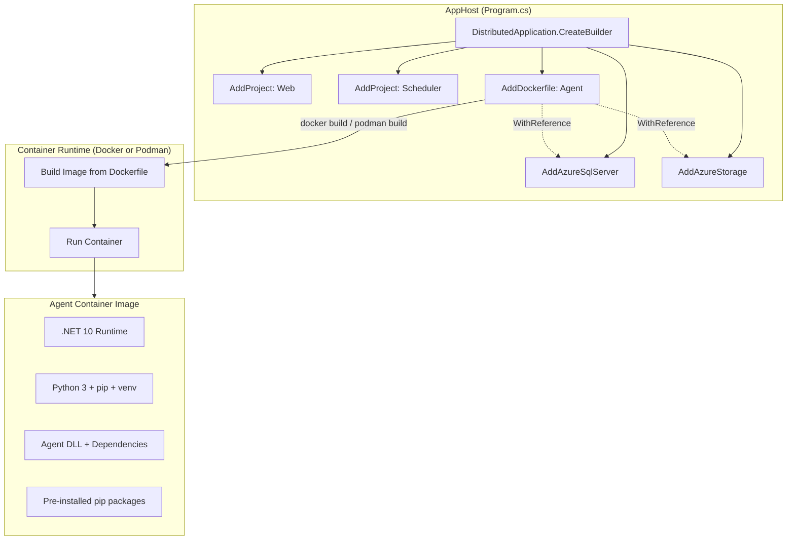
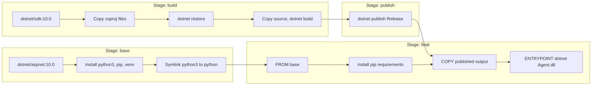
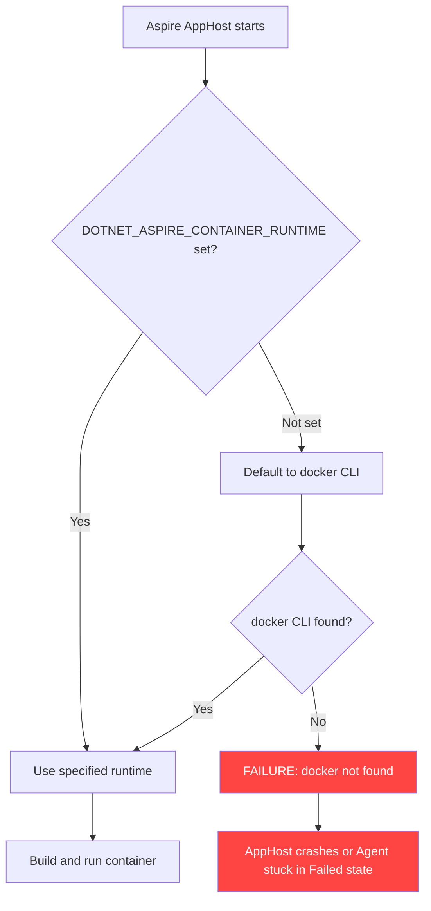
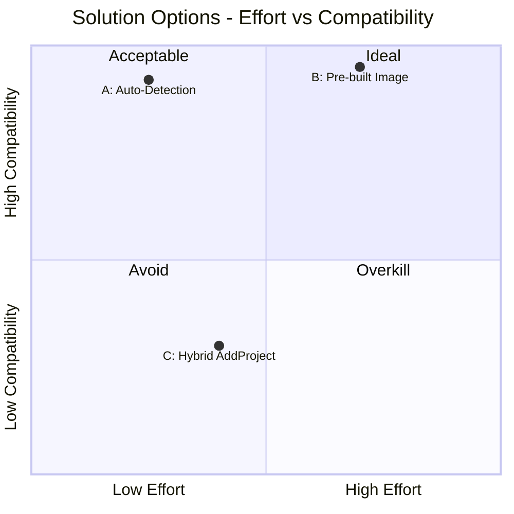
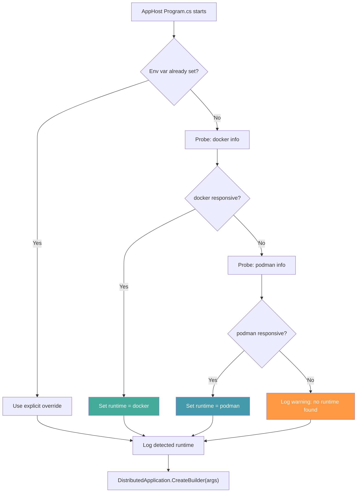
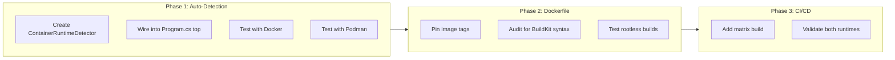
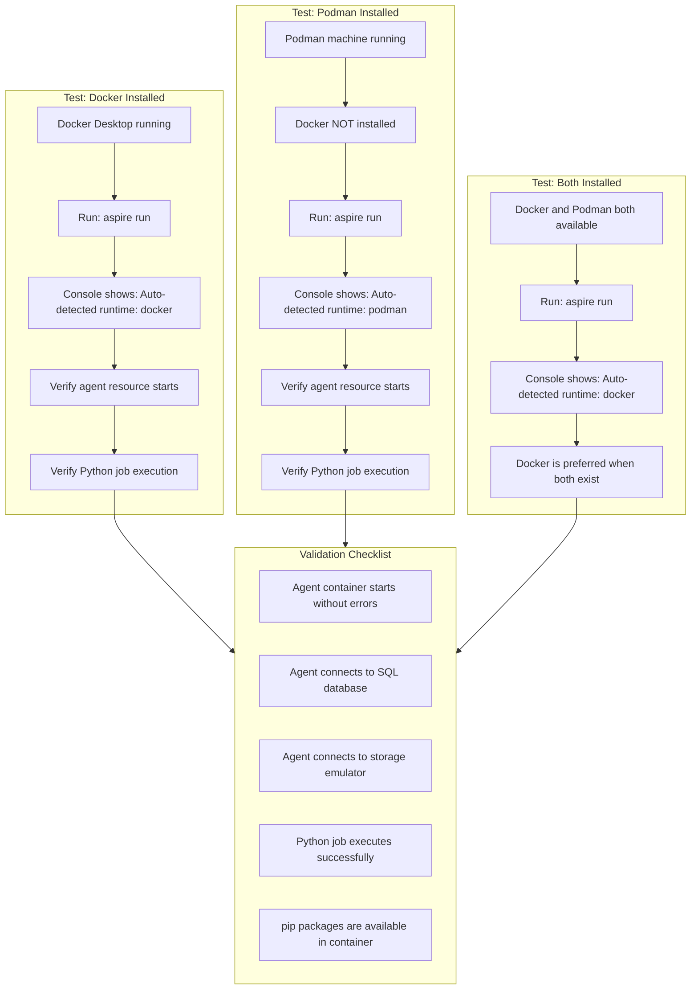
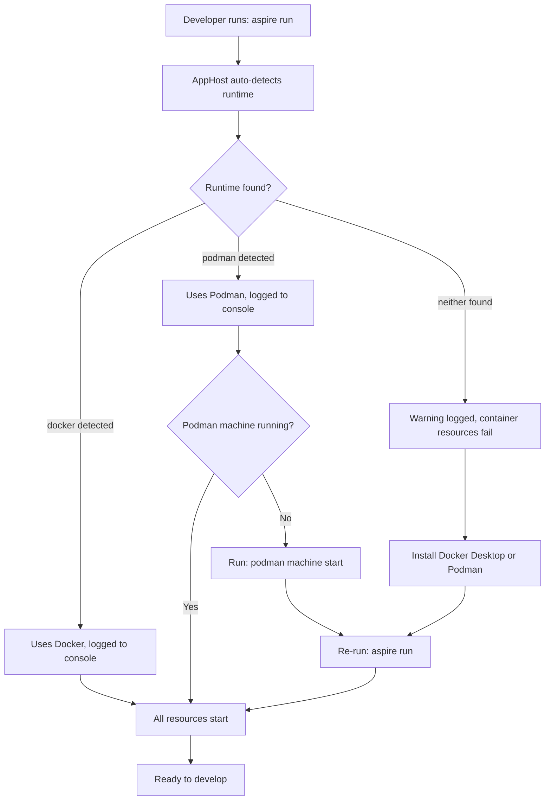

# Podman and Docker Dual-Runtime Compatibility Plan

## Overview

The Blazor Data Orchestrator Agent service uses `AddDockerfile` in the Aspire AppHost to build a custom container image that includes Python 3 for executing Python-based jobs. This works well with Docker Desktop but causes failures when developers use **Podman** as their container runtime.

This document provides a structured plan for making the Agent container build and run correctly under **both Docker and Podman**, with **automatic runtime detection** so developers never need to manually configure environment variables.

---

## Table of Contents

1. [Problem Statement](#problem-statement)
2. [Current Architecture](#current-architecture)
3. [Root Cause Analysis](#root-cause-analysis)
4. [Solution Options](#solution-options)
5. [Recommended Approach: Automatic Runtime Detection](#recommended-approach-automatic-runtime-detection)
6. [Implementation Plan](#implementation-plan)
7. [Dockerfile Compatibility Audit](#dockerfile-compatibility-audit)
8. [Testing Strategy](#testing-strategy)
9. [Troubleshooting Guide](#troubleshooting-guide)

---

## Problem Statement

The AppHost currently registers the Agent service like this:

```csharp
var agent = builder.AddDockerfile("agent", "..", "BlazorOrchestrator.Agent/Dockerfile")
    .WithReference(db).WaitFor(db)
    .WithReference(blobs).WithReference(tables).WithReference(queues);
```

The `AddDockerfile` API builds a container image from the specified Dockerfile. Aspire delegates the actual `build` and `run` commands to the **configured container runtime**. When Docker is installed, this works seamlessly. When a developer uses **Podman** instead, the build or launch may fail because:

- Aspire defaults to `docker` as the CLI executable and the Docker socket path.
- Podman on Windows runs inside a Linux VM (`podman machine`) with different socket paths.
- Build context resolution, volume mounts, and networking can differ between runtimes.

The goal is to support both Docker and Podman **automatically**. Developers should simply run `aspire run` and the AppHost should detect and use whichever runtime is installed.

---

## Current Architecture



### Current Dockerfile Structure



---

## Root Cause Analysis

Aspire uses the concept of a **container runtime** to abstract over Docker and Podman. The runtime determines which CLI (`docker` or `podman`) is invoked for `build`, `run`, `pull`, etc. The failures with Podman fall into several categories:

### Category 1: Runtime Detection Gap

Aspire reads the `DOTNET_ASPIRE_CONTAINER_RUNTIME` environment variable to determine which CLI to use. If this variable is not set, Aspire falls back to `docker`. If only Podman is installed, `docker` is not found and Aspire fails. This is the core problem: **Aspire does not auto-probe for alternative runtimes.**

### Category 2: Socket and API Differences

| Aspect | Docker Desktop (Windows) | Podman (Windows) |
|--------|--------------------------|-------------------|
| CLI binary | `docker` | `podman` |
| Daemon | `dockerd` (always running via Docker Desktop) | Daemonless; uses `podman machine` VM |
| Socket | `//./pipe/docker_engine` | `//./pipe/podman-machine-default` |
| Rootless default | No (runs as root in container) | Yes (rootless by default) |
| Build command | `docker build` | `podman build` (uses Buildah) |
| Compose | `docker compose` | `podman-compose` or `podman compose` |

### Category 3: Dockerfile Compatibility

The Dockerfile itself is OCI-compliant and **should work with both runtimes**. However, there are subtle differences:

- **`apt-get` in rootless mode**: Podman rootless containers may fail on `apt-get install` during `RUN` instructions if user namespace mapping conflicts occur. This typically manifests during `build`, not `run`.
- **Multi-stage builds**: Fully supported by both. No issues expected.
- **`COPY --from`**: Supported by both. No issues expected.
- **`pip3 install --break-system-packages`**: System-level flag; no runtime difference.

### Current Failure Flow (Without Auto-Detection)



---

## Solution Options

### Option A: Automatic Runtime Detection in AppHost Code (Recommended)

Add a small startup block to `Program.cs` that probes for `docker` and `podman` on the system PATH and sets `DOTNET_ASPIRE_CONTAINER_RUNTIME` automatically before the Aspire builder reads it. The developer never needs to configure anything.

| Pros | Cons |
|------|------|
| Fully automatic, zero developer setup | Adds a small block of code to Program.cs |
| Works for Docker, Podman, or both installed | Process-based CLI probing adds ~100ms at startup |
| Can log which runtime was detected | |
| Developer can still override via env var | |

### Option B: Pre-built Image with AddContainer

Replace `AddDockerfile` with `AddContainer`, referencing a pre-built image pushed to a container registry (e.g., ACR or GitHub Container Registry).

| Pros | Cons |
|------|------|
| No local container build needed | Requires a CI/CD pipeline to build and push the image |
| Eliminates runtime build differences entirely | Developers cannot iterate on the Dockerfile locally as easily |
| Fastest local startup (pull vs build) | Adds registry dependency and cost |

### Option C: Hybrid AddProject with PublishAsDockerFile

Use `AddProject<T>()` for local development (no container) and `PublishAsDockerFile()` for deployment.

| Pros | Cons |
|------|------|
| Local dev runs without any container runtime | Python is NOT available in local `AddProject` mode |
| Deployment still uses the Dockerfile | Breaks Python job execution during local dev |
| Simplest local dev experience | Defeats the purpose of the Dockerfile |

### Comparison Matrix



---

## Recommended Approach: Automatic Runtime Detection

**Option A (Automatic Runtime Detection)** is the recommended approach because:

1. It provides a **zero-configuration experience** for developers using either Docker or Podman.
2. It respects an explicit override if a developer sets `DOTNET_ASPIRE_CONTAINER_RUNTIME` manually.
3. It logs the detected runtime at startup for transparency.
4. It is a small, self-contained change confined to the top of `Program.cs`.

### How It Works

The detection logic runs **before** `DistributedApplication.CreateBuilder` is called. It follows this priority order:

1. If `DOTNET_ASPIRE_CONTAINER_RUNTIME` is already set, respect it (explicit override wins).
2. Otherwise, check if `docker` CLI is available and responsive.
3. If Docker is not available, check if `podman` CLI is available and responsive.
4. Set the environment variable to whichever runtime is found.
5. If neither is found, log a warning and let Aspire fail with its default error message.

### Detection Flow



---

## Implementation Plan

### Phase 1: Add Container Runtime Auto-Detection to AppHost

#### Step 1.1: Create the Detection Helper

Add a static helper method to `Program.cs` (or a separate `ContainerRuntimeDetector.cs` file in the AppHost project) that probes for available runtimes:

```csharp
using System.Diagnostics;

/// <summary>
/// Detects and configures the container runtime (Docker or Podman) for Aspire.
/// Must be called BEFORE DistributedApplication.CreateBuilder().
/// </summary>
static class ContainerRuntimeDetector
{
    private const string EnvVar = "DOTNET_ASPIRE_CONTAINER_RUNTIME";

    public static void EnsureRuntimeConfigured()
    {
        // If the developer has explicitly set the env var, respect it.
        var existing = Environment.GetEnvironmentVariable(EnvVar);
        if (!string.IsNullOrEmpty(existing))
        {
            Console.WriteLine($"[AppHost] Container runtime explicitly set: {existing}");
            return;
        }

        // Probe for available runtimes in order of preference.
        if (IsRuntimeAvailable("docker"))
        {
            Environment.SetEnvironmentVariable(EnvVar, "docker");
            Console.WriteLine("[AppHost] Auto-detected container runtime: docker");
        }
        else if (IsRuntimeAvailable("podman"))
        {
            Environment.SetEnvironmentVariable(EnvVar, "podman");
            Console.WriteLine("[AppHost] Auto-detected container runtime: podman");
        }
        else
        {
            Console.WriteLine(
                "[AppHost] WARNING: No container runtime detected. " +
                "Install Docker Desktop or Podman to run container-based resources.");
        }
    }

    private static bool IsRuntimeAvailable(string command)
    {
        try
        {
            using var process = new Process();
            process.StartInfo = new ProcessStartInfo
            {
                FileName = command,
                Arguments = "info",
                RedirectStandardOutput = true,
                RedirectStandardError = true,
                UseShellExecute = false,
                CreateNoWindow = true
            };
            process.Start();
            process.WaitForExit(5000); // 5-second timeout
            return process.ExitCode == 0;
        }
        catch
        {
            // FileName not found or other launch error
            return false;
        }
    }
}
```

#### Step 1.2: Wire Detection into Program.cs

Call the detector at the very top of `Program.cs`, before `CreateBuilder`:

```csharp
using Aspire.Hosting;
using Aspire.Hosting.ApplicationModel;
using Microsoft.Extensions.Hosting;

// Auto-detect Docker or Podman before Aspire reads the env var.
ContainerRuntimeDetector.EnsureRuntimeConfigured();

var builder = DistributedApplication.CreateBuilder(args);

// ... rest of Program.cs unchanged ...
```

The `AddDockerfile` call and everything else in `Program.cs` remain exactly as they are today.

#### Step 1.3: Complete Updated Program.cs

For clarity, here is the full `Program.cs` with the detection integrated:

```csharp
using System.Diagnostics;
using Aspire.Hosting;
using Aspire.Hosting.ApplicationModel;
using Microsoft.Extensions.Hosting;

// Auto-detect Docker or Podman before Aspire reads the env var.
ContainerRuntimeDetector.EnsureRuntimeConfigured();

var builder = DistributedApplication.CreateBuilder(args);

// Configure the Azure App Container environment
builder.AddAzureContainerAppEnvironment("env");

// Database configuration
var sqlServer = builder.AddAzureSqlServer("sqlserver")
    .RunAsContainer(container =>
    {
        container.WithEnvironment("ACCEPT_EULA", "Y");
        container.WithDataVolume();
        container.WithLifetime(ContainerLifetime.Persistent);
        container.WithEndpoint("tcp", endpoint => endpoint.Port = 14330);
    });

var db = sqlServer.AddDatabase("blazororchestratordb");

// Storage configuration
var storage = builder.AddAzureStorage("storage")
    .RunAsEmulator(emulator =>
    {
        emulator.WithLifetime(ContainerLifetime.Persistent);
        emulator.WithDataVolume();
        emulator.WithEndpoint("blob", endpoint => endpoint.Port = 10000);
        emulator.WithEndpoint("queue", endpoint => endpoint.Port = 10001);
        emulator.WithEndpoint("table", endpoint => endpoint.Port = 10002);
    });

var blobs = storage.AddBlobs("blobs");
var tables = storage.AddTables("tables");
var queues = storage.AddQueues("queues");

// Blazor Server Web App
var webApp = builder.AddProject<Projects.BlazorOrchestrator_Web>("webapp")
    .WithExternalHttpEndpoints()
    .WithReference(db).WaitFor(db)
    .WithReference(blobs).WithReference(tables).WithReference(queues);

// Scheduler service
var scheduler = builder.AddProject<Projects.BlazorOrchestrator_Scheduler>("scheduler")
    .WithReference(db).WaitFor(db)
    .WithReference(blobs).WithReference(tables).WithReference(queues);

// Agent service — AddDockerfile so Python 3 is installed in the image.
// The auto-detection above ensures this works with Docker or Podman.
var agent = builder.AddDockerfile("agent", "..", "BlazorOrchestrator.Agent/Dockerfile")
    .WithReference(db).WaitFor(db)
    .WithReference(blobs).WithReference(tables).WithReference(queues);

builder.Build().Run();

// ---------------------------------------------------------------------------
// Container runtime auto-detection
// ---------------------------------------------------------------------------
static class ContainerRuntimeDetector
{
    private const string EnvVar = "DOTNET_ASPIRE_CONTAINER_RUNTIME";

    public static void EnsureRuntimeConfigured()
    {
        var existing = Environment.GetEnvironmentVariable(EnvVar);
        if (!string.IsNullOrEmpty(existing))
        {
            Console.WriteLine($"[AppHost] Container runtime (explicit): {existing}");
            return;
        }

        if (IsRuntimeAvailable("docker"))
        {
            Environment.SetEnvironmentVariable(EnvVar, "docker");
            Console.WriteLine("[AppHost] Auto-detected container runtime: docker");
        }
        else if (IsRuntimeAvailable("podman"))
        {
            Environment.SetEnvironmentVariable(EnvVar, "podman");
            Console.WriteLine("[AppHost] Auto-detected container runtime: podman");
        }
        else
        {
            Console.WriteLine(
                "[AppHost] WARNING: No container runtime found (docker, podman). "
                + "Container-based resources will fail to start.");
        }
    }

    private static bool IsRuntimeAvailable(string command)
    {
        try
        {
            using var process = new Process();
            process.StartInfo = new ProcessStartInfo
            {
                FileName = command,
                Arguments = "info",
                RedirectStandardOutput = true,
                RedirectStandardError = true,
                UseShellExecute = false,
                CreateNoWindow = true
            };
            process.Start();
            process.WaitForExit(5000);
            return process.ExitCode == 0;
        }
        catch
        {
            return false;
        }
    }
}
```

### Phase 2: Dockerfile Hardening for OCI Compatibility

Although the current Dockerfile is already OCI-compliant, apply these minor hardening changes to maximize compatibility across both runtimes.

#### Step 2.1: Pin Base Image Tags

Pin to a specific OS variant tag rather than just `10.0` to avoid cross-platform image resolution differences. Use the same pinned tag in both `base` and `build` stages:

```dockerfile
FROM mcr.microsoft.com/dotnet/aspnet:10.0-bookworm-slim AS base
```

and

```dockerfile
FROM mcr.microsoft.com/dotnet/sdk:10.0-bookworm-slim AS build
```

This ensures both Docker and Podman pull the exact same image layers, eliminating any ambiguity in multi-arch resolution.

#### Step 2.2: Ensure Rootless Build Compatibility

The existing Dockerfile runs `apt-get install` in the base stage. This works in rootless Podman builds because Buildah (Podman's build engine) executes `RUN` instructions in a user-namespaced environment that simulates root. No changes needed here, but verify during testing.

#### Step 2.3: Avoid Docker-Specific Syntax

Audit the Dockerfile for any Docker BuildKit-specific syntax (`# syntax=`, `RUN --mount=`, `--security=insecure`) that Podman/Buildah may not support. The current Dockerfile does **not** use any of these, so no changes are required.

### Phase 3: CI/CD Dual-Runtime Validation

#### Step 3.1: Add Podman Build Step to CI

In the GitHub Actions / Azure Pipelines workflow, add a matrix build that tests the Dockerfile with both runtimes:

```yaml
strategy:
  matrix:
    runtime:
      - docker
      - podman
```

For the Podman variant, install Podman in the CI runner:

```yaml
- name: Build Agent image with Podman
  if: matrix.runtime == 'podman'
  run: |
    podman build -f src/BlazorOrchestrator.Agent/Dockerfile -t agent:ci src/
```

For Docker:

```yaml
- name: Build Agent image with Docker
  if: matrix.runtime == 'docker'
  run: |
    docker build -f src/BlazorOrchestrator.Agent/Dockerfile -t agent:ci src/
```

This ensures the Dockerfile remains compatible with both runtimes on every commit.

### Implementation Flow



---

## Dockerfile Compatibility Audit

A line-by-line review of the current Dockerfile for Podman compatibility:

| Line | Instruction | Docker | Podman | Notes |
|------|-------------|--------|--------|-------|
| 1 | `FROM ... AS base` | OK | OK | Multi-stage aliases supported |
| 2 | `WORKDIR /app` | OK | OK | |
| 4-9 | `RUN apt-get update && install ...` | OK | OK | Works in rootless via Buildah user-ns |
| 10 | `ln -sf /usr/bin/python3 /usr/bin/python` | OK | OK | |
| 14 | `FROM ... AS build` | OK | OK | |
| 17-19 | `COPY *.csproj ...` | OK | OK | |
| 20 | `RUN dotnet restore` | OK | OK | Network access during build |
| 23-25 | `COPY ... source dirs` | OK | OK | |
| 26 | `RUN dotnet build` | OK | OK | |
| 29 | `FROM build AS publish` | OK | OK | |
| 30 | `RUN dotnet publish` | OK | OK | |
| 33 | `FROM base AS final` | OK | OK | |
| 37 | `COPY requirements.txt` | OK | OK | |
| 38-39 | `RUN pip3 install --break-system-packages` | OK | OK | Flag is Python/pip-level, not runtime-level |
| 41 | `COPY --from=publish` | OK | OK | |
| 42 | `ENTRYPOINT [...]` | OK | OK | Exec form, fully compatible |

**Result: No Dockerfile changes are required for Podman compatibility.** The Dockerfile is fully OCI-compliant.

---

## Testing Strategy

### Local Testing Matrix



### Test Cases

| # | Test Case | Docker Only | Podman Only | Both Installed |
|---|-----------|-------------|-------------|----------------|
| 1 | Auto-detects runtime | Detects docker | Detects podman | Prefers docker |
| 2 | Console log confirms runtime | Yes | Yes | Yes |
| 3 | `aspire run` starts all resources | All healthy | All healthy | All healthy |
| 4 | Agent container image builds | Built successfully | Built successfully | Built successfully |
| 5 | Agent container starts | Running | Running | Running |
| 6 | C# job executes | Logs returned | Logs returned | Logs returned |
| 7 | Python job executes | Script runs | Script runs | Script runs |
| 8 | `python --version` in container | Python 3.x | Python 3.x | Python 3.x |
| 9 | Pre-installed pip packages present | Yes | Yes | Yes |
| 10 | Explicit env var override honored | N/A | N/A | Can force podman |

### Podman-Specific Prerequisites

The auto-detection handles runtime selection, but Podman itself must still be operational. Ensure:

1. **Podman Desktop** is installed, or `podman` CLI is available in PATH.
2. **Podman machine is initialized and running:**
   ```powershell
   podman machine init   # Only once
   podman machine start
   ```
3. **Verify Podman is operational:**
   ```powershell
   podman info
   ```
4. **Rootful mode may be required** if Aspire's emulator containers (SQL Server, Azurite) need elevated permissions:
   ```powershell
   podman machine set --rootful
   podman machine stop
   podman machine start
   ```

---

## Troubleshooting Guide

### Symptom: "WARNING: No container runtime found" in console

**Cause:** Neither `docker` nor `podman` CLI is installed or in PATH.

**Fix:** Install Docker Desktop or Podman Desktop, then verify:
```powershell
docker info    # or
podman info
```

---

### Symptom: Auto-detection picks Docker but you want Podman

**Cause:** Both runtimes are installed, and Docker is preferred by default.

**Fix:** Override with the explicit environment variable:
```powershell
$env:DOTNET_ASPIRE_CONTAINER_RUNTIME = "podman"
aspire run
```

This is the only scenario where manually setting the env var is necessary.

---

### Symptom: Agent resource stuck in "Starting" or "Failed" state

**Cause:** Podman machine is not running, or `podman info` returns an error.

**Fix:**
```powershell
podman machine start
podman info   # Verify it is running
```

---

### Symptom: "apt-get: Permission denied" during image build

**Cause:** Podman is running in rootless mode and cannot simulate root for `apt-get`.

**Fix:** Switch Podman machine to rootful mode:
```powershell
podman machine set --rootful
podman machine stop
podman machine start
```

---

### Symptom: Container cannot reach SQL Server or Azurite

**Cause:** Podman networking differs from Docker. Aspire-managed containers might have network isolation differences.

**Fix:** Aspire handles container networking automatically. Verify that all resources are on the same Aspire-managed network by checking the dashboard. If issues persist, restart with a clean state:
```powershell
podman system prune -f
aspire run
```

---

### Symptom: Build succeeds but container fails to start

**Cause:** Volume mount or port mapping differences between runtimes.

**Fix:** Check Aspire dashboard logs for the agent resource. Look for connection string or port binding errors. Ensure Podman machine has enough resources allocated:
```powershell
podman machine set --cpus 4 --memory 4096
podman machine stop
podman machine start
```

---

### Developer Experience Flowchart



---

## Summary of Changes

| Item | Change Type | Description |
|------|-------------|-------------|
| `Program.cs` (AppHost) | Add | `ContainerRuntimeDetector` class with auto-detection logic at startup |
| `Dockerfile` | Optional | Pin base image tags to `-bookworm-slim` variants |
| CI/CD | Add | Matrix build testing both Docker and Podman |
| `Program.cs` (AppHost) | **None** | `AddDockerfile` call remains unchanged |
| Developer workflow | **None** | No manual env var or profile selection required |

### What Developers Experience

- **Docker user**: Runs `aspire run`. Console says `Auto-detected container runtime: docker`. Everything works.
- **Podman user**: Runs `aspire run`. Console says `Auto-detected container runtime: podman`. Everything works.
- **Both installed**: Runs `aspire run`. Docker is preferred. To force Podman, set `DOTNET_ASPIRE_CONTAINER_RUNTIME=podman`.
- **Neither installed**: Console warns no runtime found. Developer installs one and re-runs.

The `AddDockerfile` API call in the AppHost **does not need to change**. The auto-detection sets the environment variable that Aspire already respects, making the solution fully transparent.
