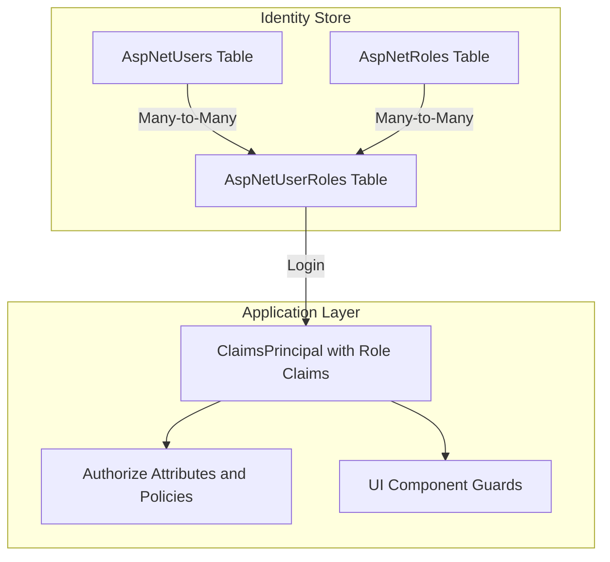
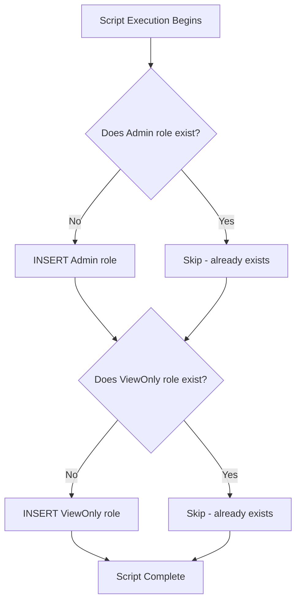
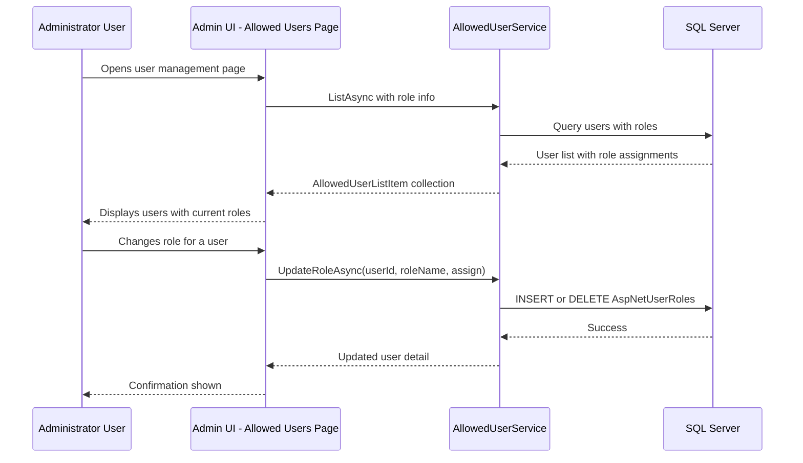
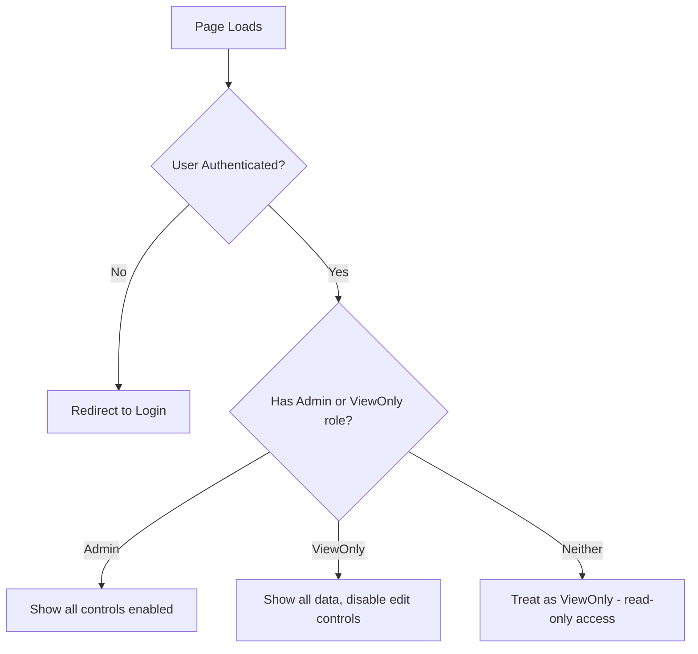

# Roles Feature Plan

## Overview

This document describes the implementation plan for adding two application roles — **Administrator** and **ViewOnly** — to the Blazor Data Orchestrator. The existing codebase already uses ASP.NET Core Identity with `AspNetRoles` / `AspNetUserRoles` tables and a custom `AllowedUserService` that manages an "Admin" role. This plan extends that foundation with clearly defined role semantics and a new SQL migration script.

---

## 1. Roles Definition

| Role | Name (DB) | NormalizedName | Permissions |
|------|-----------|----------------|-------------|
| Admin | `Admin` | `ADMIN` | Full access: manage users, assign roles, CRUD all entities |
| ViewOnly | `ViewOnly` | `VIEWONLY` | Read-only access: can view all pages/data but cannot create, update, or delete |

> **Note:** The "Admin" role name matches the existing legacy role already in use by `AllowedUserService`, so no user migration is required.

---

## 2. System Architecture



---

## 3. SQL Migration: `01.20.00.sql`

A new SQL script will be created at `src/BlazorOrchestrator.Web/!SQL/01.20.00.sql`. All statements are idempotent using `IF NOT EXISTS` guards.

### 3.1 Script Contents

The script will:

1. Insert the **Admin** role into `AspNetRoles` if it does not already exist.
2. Insert the **ViewOnly** role into `AspNetRoles` if it does not already exist.

Since the role name remains `"Admin"` (matching the existing role), no user migration is needed.

### 3.2 Idempotency Strategy



---

## 4. Role Assignment Flow

Only users with the **Admin** role can assign or revoke roles for other users.



---

## 5. Authorization Enforcement Strategy

### 5.1 Policy Definitions

Register authorization policies in `Program.cs`:

```csharp
builder.Services.AddAuthorizationBuilder()
    .AddPolicy("AdminOnly", policy => policy.RequireRole("Admin"))
    .AddPolicy("Authenticated", policy => policy.RequireRole("Admin", "ViewOnly"));
```

> **Default role behaviour:** Authenticated users with no explicit role assignment are treated as ViewOnly (read-only access). Roles are mutually exclusive — a user is either Admin OR ViewOnly, never both.

### 5.2 Page-Level Authorization

All pages require at least the **ViewOnly** role. ViewOnly users can see everything (including admin pages) but cannot perform mutations.

| Page/Area | Viewable By | Can Mutate | Enforcement |
|-----------|-------------|------------|-------------|
| Admin Home | Admin, ViewOnly | Admin only | `@attribute [Authorize(Roles = "Admin,ViewOnly")]` |
| Allowed Users | Admin, ViewOnly | Admin only | `@attribute [Authorize(Roles = "Admin,ViewOnly")]` |
| Jobs (view) | Admin, ViewOnly | Admin only | `@attribute [Authorize(Roles = "Admin,ViewOnly")]` |
| Logs (view) | Admin, ViewOnly | Admin only | `@attribute [Authorize(Roles = "Admin,ViewOnly")]` |
| Job Edit/Create | Admin, ViewOnly | Admin only | UI guards disable controls for ViewOnly |

### 5.3 UI Component Guards

For ViewOnly users, editing controls (buttons, forms, inputs) should be disabled or hidden:



### 5.4 Server-Side Enforcement

API endpoints and service methods must also enforce role checks — UI-only guards are insufficient:

- Use `[Authorize(Roles = "Admin")]` on controller actions that mutate data.
- In Blazor Server components, check `AuthenticationStateProvider` before executing write operations.
- The `AllowedUserService` admin operations should verify the calling user has the Admin role.

---

## 6. Existing Code Impact

### 6.1 `AllowedUserService.cs`

Already uses `"Admin"` as the role name — no rename needed.

- Add a `ViewOnlyRoleName` constant set to `"ViewOnly"`.
- Add method: `SetRoleAsync(string userId, string roleName)` for managing role assignments (mutually exclusive — assigning one role removes the other).
- Add method: `GetAvailableRolesAsync()` to list assignable roles.
- Scope changes to the Web project only; no changes to Agent or Scheduler projects.

### 6.2 `AccountController.cs`

The `AddRoleClaimsAsync` method already dynamically loads role names from the database and adds them as claims. No changes needed — it will automatically pick up the new roles.

### 6.3 UI Components

- `AllowedUsers.razor` — Add a role dropdown/selector per user (Admin or ViewOnly; mutually exclusive).
- All editable pages — Wrap mutation controls in `<AuthorizeView Roles="Admin">` so ViewOnly users see data but cannot edit.

### 6.4 Navigation

- `NavMenu.razor` — Conditionally show admin-only nav items using `<AuthorizeView>`.

---

## 7. Migration Path

No migration is required. The application already uses `"Admin"` as the role name in `AllowedUserService`. The SQL script simply ensures the role row exists (for fresh installs) and adds the new `"ViewOnly"` role. Existing user-role assignments remain untouched.

---

## 8. Implementation Checklist

- [ ] Create SQL migration `01.20.00.sql` with idempotent role seeding (done)
- [ ] Add `ViewOnlyRoleName` constant and `SetRoleAsync` method to `AllowedUserService`
- [ ] Add authorization policies in `Program.cs`
- [ ] Update `AllowedUsers.razor` to support multi-role assignment (Admin, ViewOnly)
- [ ] Add `<AuthorizeView Roles="Admin">` guards to editable UI sections
- [ ] Disable/hide mutation controls for ViewOnly users
- [ ] Add `[Authorize(Roles = "Admin")]` to server-side mutation endpoints
- [ ] Test role claims are emitted correctly on login
- [ ] Verify ViewOnly users cannot bypass restrictions via direct API calls
- [ ] Update `SQLVersion` file to `01.20.00` (already done)

---

## 9. Security Considerations

- **Defense in Depth**: Role checks at both UI and server layers.
- **Principle of Least Privilege**: New users default to ViewOnly (read-only) access. Only an Admin can promote a user to the Admin role.
- **Mutually Exclusive Roles**: A user can have either Admin or ViewOnly, never both. Assigning one removes the other.
- **Last Admin Guard**: Prevent removing the Admin role from the last remaining admin (existing logic in `AllowedUserService`).
- **Idempotent Migrations**: SQL script safe to re-run without side effects.
