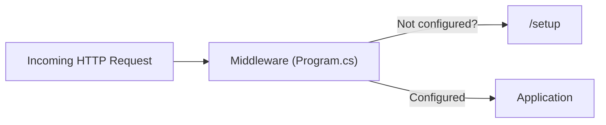
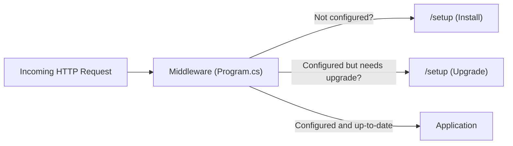
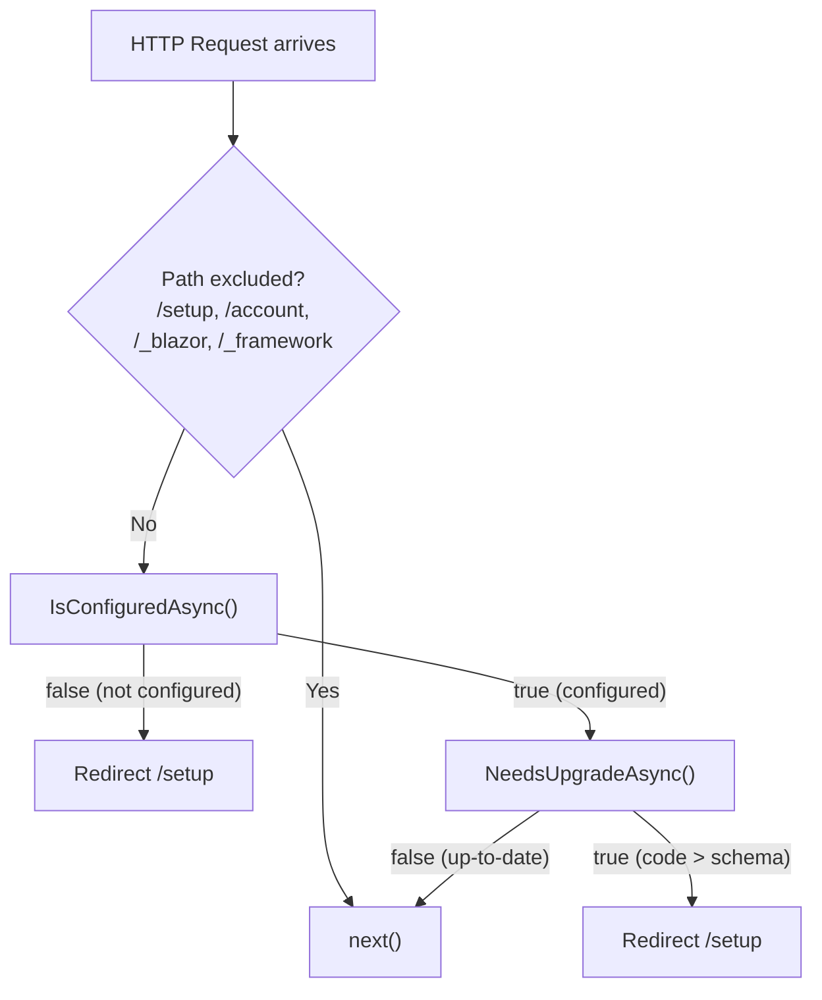
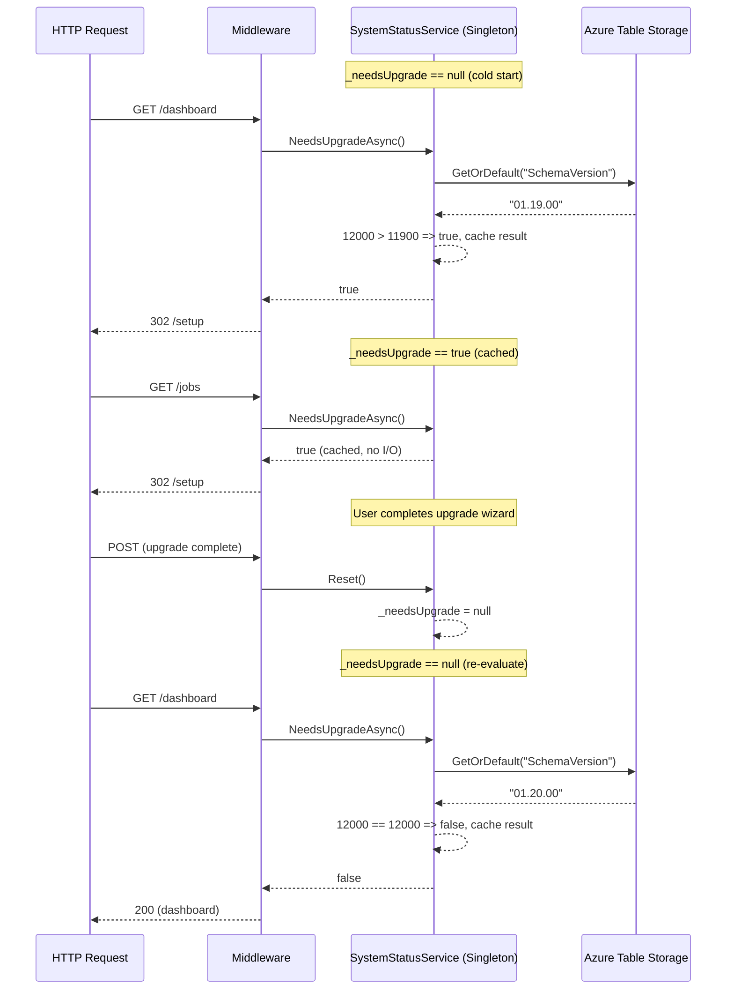

# Schema Version Check in Middleware

## Overview

Add a startup-path schema version check so that **any** authenticated request is redirected to `/setup` when the running code version (`ApplicationVersion.Current`) is ahead of the `SchemaVersion` stored in Azure Table Storage. This closes a gap where a user could reach the dashboard on stale schema after a code deployment without running the upgrade wizard.

---

## Current Architecture



Today the middleware in `Program.cs` only calls `ISystemStatusService.IsConfiguredAsync()`. If the system **is** configured (DB reachable, admin user exists), every request passes through — even when the code version is newer than the database schema.

### Key Files

| File | Role |
|---|---|
| [ISystemStatusService.cs](../src/BlazorOrchestrator.Web/Services/ISystemStatusService.cs) | Service contract — currently exposes `IsConfiguredAsync()` and `Reset()` |
| [SystemStatusService.cs](../src/BlazorOrchestrator.Web/Services/SystemStatusService.cs) | Implementation — caches the "configured" flag in memory |
| [Program.cs](../src/BlazorOrchestrator.Web/Program.cs#L275-L291) | Middleware pipeline — redirects unconfigured systems to `/setup` |
| [ApplicationVersion.cs](../src/BlazorDataOrchestrator.Core/ApplicationVersion.cs) | Single source of truth for the running code version (`Current`) |
| [SettingsService.cs](../src/BlazorDataOrchestrator.Core/Services/SettingsService.cs) | Reads/writes key-value pairs from Azure Table Storage (`Settings` table) |
| [Setup.razor](../src/BlazorOrchestrator.Web/Components/Pages/Setup.razor) | Setup/upgrade wizard — already has `IsCodeAheadOfDatabaseAsync()` logic |

---

## Desired Architecture



After the middleware confirms the system **is** configured, it must also confirm the schema is **up to date** before letting the request through.

---

## Detailed Design

### 1. Extend `ISystemStatusService`

Add a `NeedsUpgradeAsync()` method to the interface.

```csharp
// Services/ISystemStatusService.cs
namespace BlazorOrchestrator.Web.Services;

public interface ISystemStatusService
{
    Task<bool> IsConfiguredAsync();
    Task<bool> NeedsUpgradeAsync();
    void Reset();
}
```

### 2. Implement `NeedsUpgradeAsync()` in `SystemStatusService`

The method compares `ApplicationVersion.Current` (the compiled code version) against the `SchemaVersion` setting persisted in Azure Table Storage via `SettingsService`.

The result is cached in a nullable `bool` (`_needsUpgrade`) — identical to the pattern already used for `_isConfigured` — so subsequent requests in the same app lifetime pay zero cost.

`Reset()` must also clear the upgrade cache so that completing the upgrade wizard immediately unblocks requests.

#### Version Comparison Logic

Reuse the same integer-conversion strategy already present in `Setup.razor` and `UpgradeWorkflow.razor`:

| Version string | Integer |
|---|---|
| `"01.20.00"` | `1 * 10000 + 20 * 100 + 0 * 1 = 12000` |
| `"01.19.00"` | `1 * 10000 + 19 * 100 + 0 * 1 = 11900` |

If `ConvertVersionToInteger(ApplicationVersion.Current)` > `ConvertVersionToInteger(schemaVersion)`, the method returns `true`.

```csharp
// Services/SystemStatusService.cs  (additions only — existing code unchanged)
private bool? _needsUpgrade;

public async Task<bool> NeedsUpgradeAsync()
{
    if (_needsUpgrade.HasValue)
        return _needsUpgrade.Value;

    try
    {
        using var scope = _serviceProvider.CreateScope();
        var settingsService = scope.ServiceProvider.GetRequiredService<SettingsService>();

        var schemaVersion = await settingsService.GetOrDefaultAsync(
            "SchemaVersion", ApplicationVersion.Current);

        _needsUpgrade = ConvertVersionToInteger(ApplicationVersion.Current)
                      > ConvertVersionToInteger(schemaVersion);
        return _needsUpgrade.Value;
    }
    catch (Exception ex)
    {
        _logger.LogDebug(ex, "Schema version check failed — assuming no upgrade needed");
        _needsUpgrade = false;
        return false;
    }
}

public void Reset()
{
    _isConfigured = null;
    _needsUpgrade = null;   // <-- clear upgrade cache too
}

private static int ConvertVersionToInteger(string version)
{
    if (string.IsNullOrEmpty(version)) return 0;
    int result = 0;
    var segments = version.Split('.');
    var multipliers = new[] { 10000, 100, 1 };
    for (int i = 0; i < segments.Length && i < multipliers.Length; i++)
    {
        if (int.TryParse(segments[i], out int segment))
            result += segment * multipliers[i];
    }
    return result;
}
```

### 3. Extend the Middleware in `Program.cs`

The current middleware block (approximately lines 275-291) already redirects to `/setup` when `IsConfiguredAsync()` returns `false`. Immediately after that check passes, add a second check for `NeedsUpgradeAsync()`.

```csharp
// Program.cs — inside the existing app.Use(...) block
app.Use(async (context, next) =>
{
    var path = context.Request.Path;
    if (!path.StartsWithSegments("/setup") &&
        !path.StartsWithSegments("/account") &&
        !path.StartsWithSegments("/_blazor") &&
        !path.StartsWithSegments("/_framework"))
    {
        var systemStatus = context.RequestServices
            .GetRequiredService<ISystemStatusService>();

        if (!await systemStatus.IsConfiguredAsync())
        {
            context.Response.Redirect("/setup");
            return;
        }

        // NEW: also redirect when a schema upgrade is pending
        if (await systemStatus.NeedsUpgradeAsync())
        {
            context.Response.Redirect("/setup");
            return;
        }
    }
    await next();
});
```

---

## Process Flow



---

## Caching and Lifecycle



---

## Setup Page Interaction

The `/setup` page (`Setup.razor`) already handles the upgrade scenario internally:

1. It calls `IsCodeAheadOfDatabaseAsync()` using the same `SettingsService.GetOrDefaultAsync("SchemaVersion", ...)` call.
2. When it detects `Code > DB`, it sets `WizardMode = "UPGRADE"` and renders `UpgradeWorkflow.razor`.
3. After the upgrade wizard finishes, `OnUpgradeComplete()` calls `systemStatus.Reset()` — which clears both `_isConfigured` and `_needsUpgrade`, allowing subsequent requests through.

No changes are needed in `Setup.razor` or `UpgradeWorkflow.razor`.

---

## Failure Modes and Edge Cases

| Scenario | Behavior |
|---|---|
| Azure Table Storage unreachable | `NeedsUpgradeAsync()` catches the exception and returns `false` (fail-open), letting users reach the app |
| `SchemaVersion` row missing | `GetOrDefaultAsync` returns `ApplicationVersion.Current` as default, so code == schema => `false` (no upgrade) |
| Fresh install (no DB, no tables) | `IsConfiguredAsync()` returns `false` first, so `NeedsUpgradeAsync()` is never called |
| Code version equals schema version | `ConvertVersionToInteger` produces equal integers => `false` |
| Code version is somehow behind schema | Comparison is strictly `>`, so `false` — no redirect |

---

## Files to Change

| File | Change Type | Details |
|---|---|---|
| [ISystemStatusService.cs](../src/BlazorOrchestrator.Web/Services/ISystemStatusService.cs) | **Modify** | Add `Task<bool> NeedsUpgradeAsync()` to the interface |
| [SystemStatusService.cs](../src/BlazorOrchestrator.Web/Services/SystemStatusService.cs) | **Modify** | Add `_needsUpgrade` field, implement `NeedsUpgradeAsync()`, add `ConvertVersionToInteger()` helper, update `Reset()` |
| [Program.cs](../src/BlazorOrchestrator.Web/Program.cs#L275-L291) | **Modify** | Add `NeedsUpgradeAsync()` check after the existing `IsConfiguredAsync()` block |

No new files are created. No NuGet packages are required.

---

## Checklist

- [ ] Add `NeedsUpgradeAsync()` to `ISystemStatusService`
- [ ] Implement `NeedsUpgradeAsync()` in `SystemStatusService` with caching
- [ ] Add `ConvertVersionToInteger()` private helper to `SystemStatusService`
- [ ] Update `Reset()` to clear `_needsUpgrade`
- [ ] Add the upgrade redirect to the middleware in `Program.cs`
- [ ] Verify `Setup.razor` calls `Reset()` after upgrade completes (already does)
- [ ] Test: deploy new code version with higher `ApplicationVersion.Current` and confirm redirect
- [ ] Test: complete upgrade wizard and confirm normal navigation resumes
- [ ] Test: Azure Table Storage unreachable — confirm fail-open behavior
