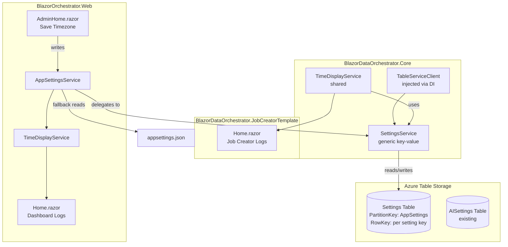
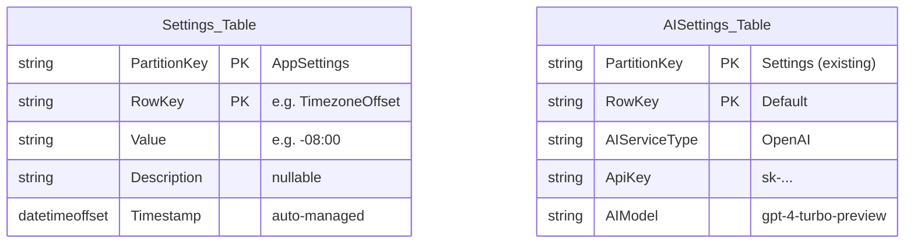
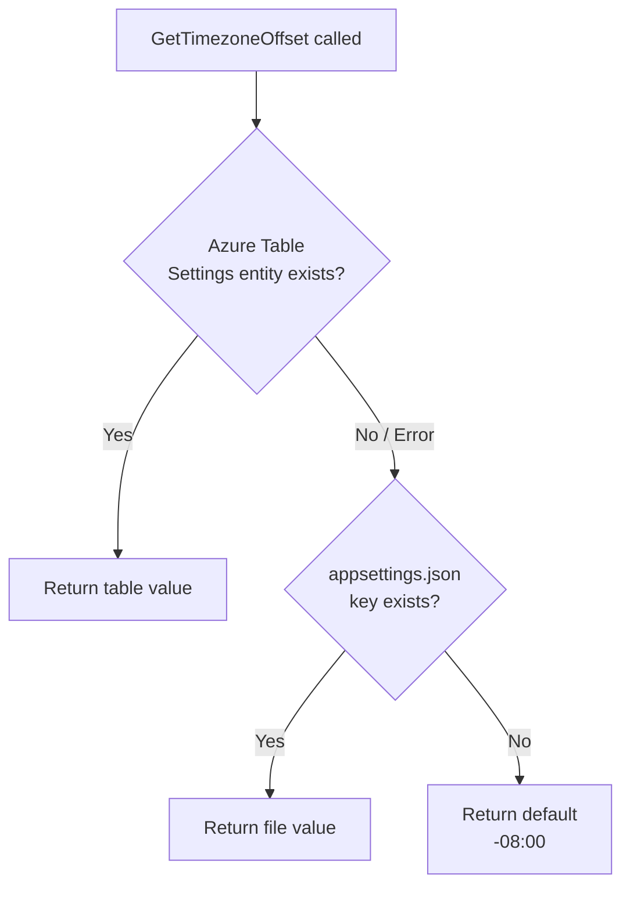
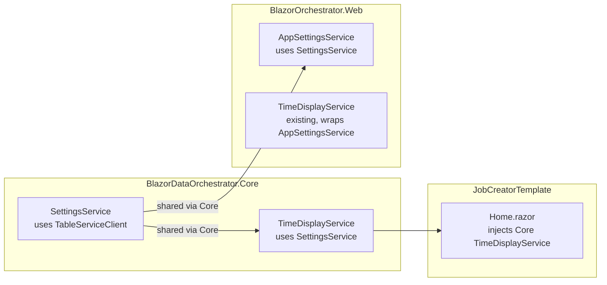
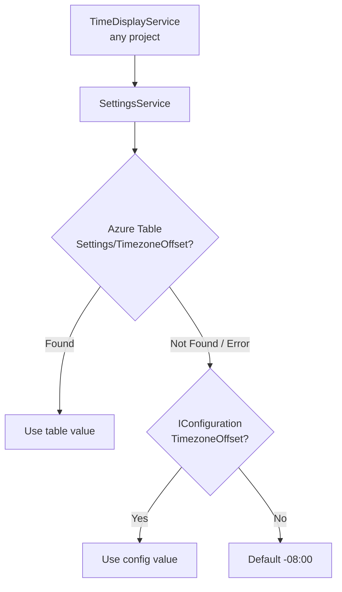
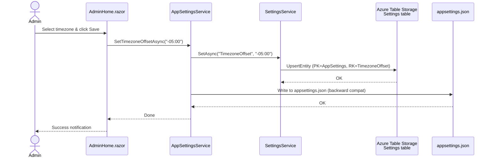
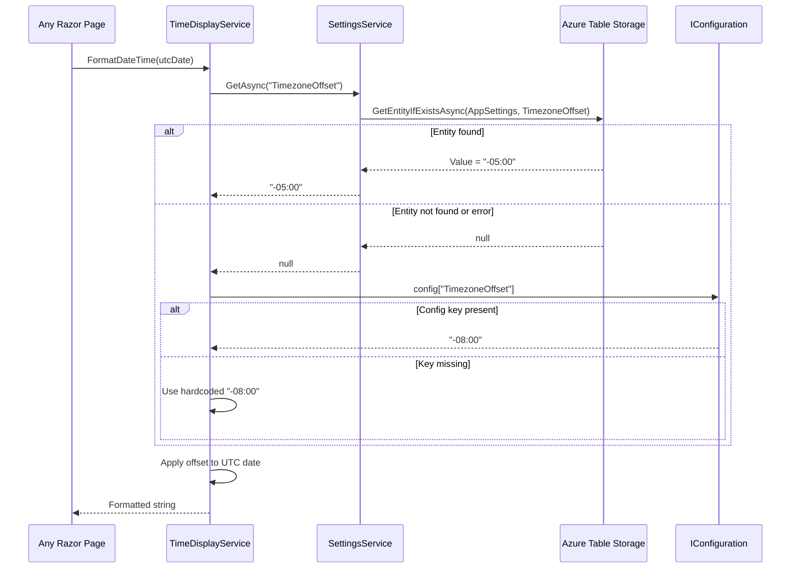

# Timezone Offset — Azure Table Storage Settings & Log Display Integration

## Overview

This plan covers two related features:

1. **Store the timezone offset in an Azure Table Storage `Settings` table** (instead of relying solely on `appsettings.json`), following the same pattern as the existing `AISettingsService`, with graceful fallback when the entity does not exist.
2. **Apply the timezone offset to all log timestamps** in the `Home.razor` pages of both the **BlazorOrchestrator.Web** project and the **BlazorDataOrchestrator.JobCreatorTemplate** project.

### Current State

| Aspect | Status |
|--------|--------|
| Timezone offset storage | `appsettings.json` only (file-based, per-deployment) |
| `AppSettingsService` | Reads/writes `TimezoneOffset` from the JSON file |
| `TimeDisplayService` | Wraps `AppSettingsService`; used in some grid columns |
| Web `Home.razor` logs dialog | Uses `TimeDisplayService.FormatDateTime()` ✅ |
| Web `Home.razor` Last/Next Run | Raw `DateTime` formatting — **no offset applied** ❌ |
| JobCreatorTemplate `Home.razor` logs | `ToString("yyyy-MM-dd HH:mm:ss")` — **no offset applied** ❌ |
| Azure Table Storage `Settings` table | **Does not exist** ❌ |

### Target State

| Aspect | Target |
|--------|--------|
| Primary storage | `Settings` table in Azure Table Storage |
| Fallback | Graceful default to `-08:00` if entity missing |
| `AppSettingsService` | Reads from Azure Table first, falls back to file |
| Web `Home.razor` | All dates (logs, Last Run, Next Run) use `TimeDisplayService` |
| JobCreatorTemplate `Home.razor` | Logs column uses timezone offset via shared `TimeDisplayService` |

### Existing Pattern — `AISettingsService`

The new `SettingsService` follows the **exact same pattern** as the existing `AISettingsService`:

- Inject `TableServiceClient` (already registered via `builder.AddAzureTableServiceClient("tables")` in all projects)
- Use `CreateIfNotExistsAsync()` for auto-provisioning
- Use `GetEntityIfExistsAsync()` for safe reads (no exception on missing entity)
- Use `UpsertEntityAsync()` for writes
- Catch `RequestFailedException` for graceful degradation

---

## System Architecture



---

## Phase 1 — Azure Table Storage Settings Entity

### 1.1 Create the `SettingsEntity` Table Entity

**Project:** `BlazorDataOrchestrator.Core`  
**File:** `Models/SettingsEntity.cs`

This follows the same `ITableEntity` pattern as `AISettingsEntity`:

```csharp
using Azure;
using Azure.Data.Tables;

namespace BlazorDataOrchestrator.Core.Models;

/// <summary>
/// Azure Table Storage entity for application settings.
/// PartitionKey = "AppSettings", RowKey = setting key (e.g. "TimezoneOffset").
/// </summary>
public class SettingsEntity : ITableEntity
{
    public string PartitionKey { get; set; } = "AppSettings";
    public string RowKey { get; set; } = string.Empty;
    public DateTimeOffset? Timestamp { get; set; }
    public ETag ETag { get; set; }

    /// <summary>The stored setting value, e.g. "-08:00".</summary>
    public string? Value { get; set; }

    /// <summary>Optional human-readable description.</summary>
    public string? Description { get; set; }
}
```

### 1.2 Table Schema

| Property | Type | Example | Notes |
|----------|------|---------|-------|
| `PartitionKey` | `string` | `"AppSettings"` | Fixed — groups all app settings together |
| `RowKey` | `string` | `"TimezoneOffset"` | The unique setting key |
| `Value` | `string` | `"-08:00"` | The setting value |
| `Description` | `string?` | `"Display timezone offset"` | Optional metadata |
| `Timestamp` | `DateTimeOffset?` | *(auto-managed)* | Azure Table built-in |
| `ETag` | `ETag` | *(auto-managed)* | Azure Table built-in |

### 1.3 Table Storage Structure Diagram



> **No EF migration required.** Azure Table Storage creates the table automatically via `CreateIfNotExistsAsync()`.

---

## Phase 2 — SettingsService (Azure Table Storage-Backed)

### 2.1 Create `SettingsService` in Core

**Project:** `BlazorDataOrchestrator.Core`  
**File:** `Services/SettingsService.cs`

This service mirrors `AISettingsService` but provides **generic key-value** operations:

```csharp
using Azure;
using Azure.Data.Tables;
using BlazorDataOrchestrator.Core.Models;

namespace BlazorDataOrchestrator.Core.Services;

public class SettingsService
{
    private readonly TableServiceClient _tableServiceClient;
    private const string TableName = "Settings";
    private const string PartitionKey = "AppSettings";

    public SettingsService(TableServiceClient tableServiceClient)
    {
        _tableServiceClient = tableServiceClient;
    }

    /// <summary>
    /// Gets a setting value by key. Returns null if not found.
    /// </summary>
    public async Task<string?> GetAsync(string key)
    {
        try
        {
            var tableClient = _tableServiceClient.GetTableClient(TableName);
            await tableClient.CreateIfNotExistsAsync();

            var response = await tableClient.GetEntityIfExistsAsync<SettingsEntity>(
                PartitionKey, key);

            if (response.HasValue && response.Value != null)
            {
                return response.Value.Value;
            }
        }
        catch (RequestFailedException)
        {
            // Table or entity doesn't exist yet — return null
        }

        return null;
    }

    /// <summary>
    /// Gets a setting value by key, returning defaultValue if not found.
    /// </summary>
    public async Task<string> GetOrDefaultAsync(string key, string defaultValue)
    {
        var value = await GetAsync(key);
        return value ?? defaultValue;
    }

    /// <summary>
    /// Upserts a setting into Azure Table Storage.
    /// </summary>
    public async Task SetAsync(string key, string value, string? description = null)
    {
        var tableClient = _tableServiceClient.GetTableClient(TableName);
        await tableClient.CreateIfNotExistsAsync();

        var entity = new SettingsEntity
        {
            PartitionKey = PartitionKey,
            RowKey = key,
            Value = value,
            Description = description,
            Timestamp = DateTimeOffset.UtcNow
        };

        await tableClient.UpsertEntityAsync(entity, TableUpdateMode.Replace);
    }
}
```

### 2.2 Key Behaviours

| Scenario | Behaviour |
|----------|-----------|
| Entity exists | Return `Value` property |
| Entity missing | Return `null` (via `GetEntityIfExistsAsync`) |
| Table missing (first run) | `CreateIfNotExistsAsync()` auto-provisions it |
| Save | `UpsertEntityAsync` — insert if missing, replace if present |
| Azure Storage unreachable | Catch `RequestFailedException`, return `null` |

### 2.3 Service Registration

`TableServiceClient` is **already registered** in all projects via Aspire:

| Project | Code (already exists) |
|---------|----------------------|
| Web | `builder.AddAzureTableServiceClient("tables");` |
| JobCreatorTemplate | `builder.AddAzureTableServiceClient("tables");` |
| Scheduler | `builder.AddAzureTableServiceClient("tables");` |
| Agent | `builder.AddAzureTableServiceClient("tables");` |

Register `SettingsService` the same way as `AISettingsService`:

```csharp
builder.Services.AddScoped<SettingsService>(sp =>
{
    var tableServiceClient = sp.GetRequiredService<TableServiceClient>();
    return new SettingsService(tableServiceClient);
});
```

### 2.4 Update `AppSettingsService` to Read from Azure Table

**File:** `src/BlazorOrchestrator.Web/Services/AppSettingsService.cs`

Modify the constructor to accept `SettingsService`:

```csharp
public AppSettingsService(
    IConfiguration configuration,
    IWebHostEnvironment environment,
    SettingsService settingsService)
```

Modify `GetTimezoneOffset()` to:

1. Try `SettingsService.GetAsync("TimezoneOffset")`.
2. If `null`, fall back to `IConfiguration["TimezoneOffset"]`.
3. If still `null`, return default `-08:00`.

Modify `SetTimezoneOffsetAsync()` to:

1. Write to the Azure Table Storage `Settings` table via `SettingsService`.
2. **Also** write to `appsettings.json` (backward compatibility).

> **Note:** Because `GetTimezoneOffset()` is currently synchronous and Azure Table calls are async, either:
> - Add an async overload `GetTimezoneOffsetAsync()` and update callers, **or**
> - Use an in-memory cache populated on startup / first async call.

### 2.5 Fallback Flow



---

## Phase 3 — Fix Remaining Web `Home.razor` Time Displays

### 3.1 Files & Locations Requiring Changes

**Project:** `BlazorOrchestrator.Web`

| File | Method / Line | Current Code | Required Change |
|------|---------------|-------------|-----------------|
| `Home.razor` | `GetLastRunDisplay()` | `lastRun.Value.ToString("HH:mm")` | `TimeDisplayService.FormatDateTime(lastRun.Value, "HH:mm")` |
| `Home.razor` | `GetLastRunDisplay()` | `lastRun.Value.ToString("MMM d, HH:mm")` | `TimeDisplayService.FormatDateTime(lastRun.Value, "MMM d, HH:mm")` |
| `Home.razor` | `GetNextRunDisplay()` | `nextRun.ToString("HH:mm")` and `"MMM d, HH:mm"` | Same pattern via `TimeDisplayService` |
| `Home.razor` | `GetLastRunDisplay()` | `DateTime.UtcNow` comparisons | Compare against `TimeDisplayService.ConvertToDisplayTime(…)` |
| `EditJobScheduleDialog.razor` | line ~57 | `Schedule.LastRun?.ToString("g")` | `TimeDisplayService.FormatDateTime(Schedule.LastRun)` |

### 3.2 Updated `GetLastRunDisplay` Logic

The "Today" / "Yesterday" / relative-time comparisons currently compare raw UTC. After applying the offset, comparisons must use display-time dates:

```csharp
private string GetLastRunDisplay(Job job)
{
    var lastRun = job.JobSchedules?
        .Where(s => s.LastRun.HasValue)
        .OrderByDescending(s => s.LastRun)
        .FirstOrDefault()?.LastRun;

    if (!lastRun.HasValue) return "Never";

    var displayTime = TimeDisplayService.ConvertToDisplayTime(lastRun.Value);
    var nowDisplay  = TimeDisplayService.GetCurrentDisplayTime();
    var diff = nowDisplay - displayTime;

    if (diff.TotalMinutes < 1)           return "Just now";
    if (diff.TotalHours < 1)             return $"{(int)diff.TotalMinutes}m ago";
    if (displayTime.Date == nowDisplay.Date)
        return $"Today {displayTime:HH:mm}";
    if (displayTime.Date == nowDisplay.Date.AddDays(-1))
        return $"Yesterday {displayTime:HH:mm}";

    return TimeDisplayService.FormatDateTime(lastRun.Value, "MMM d, HH:mm");
}
```

Apply the same pattern to `GetNextRunDisplay`.

---

## Phase 4 — JobCreatorTemplate `Home.razor` Timezone Support

### 4.1 Problem

The `JobCreatorTemplate` is a **separate Blazor project**. It does not reference `BlazorOrchestrator.Web`, so it cannot use `AppSettingsService` or the Web `TimeDisplayService`. It also has no `TimezoneOffset` key in its own `appsettings.json`.

However, it **already has** `TableServiceClient` registered via `builder.AddAzureTableServiceClient("tables")` and references `BlazorDataOrchestrator.Core`.

### 4.2 Solution — Shared Service in Core



Both projects already reference Core and already have `TableServiceClient` in DI. The `SettingsService` added in Phase 2 is in Core, so the Template can use it directly.

### 4.3 Implementation Steps

#### 4.3.1 Create `TimeDisplayService` in Core

**File:** `src/BlazorDataOrchestrator.Core/Services/TimeDisplayService.cs`

```csharp
using BlazorDataOrchestrator.Core.Services;

namespace BlazorDataOrchestrator.Core.Services;

public class TimeDisplayService
{
    private readonly SettingsService _settingsService;
    private readonly IConfiguration _configuration;
    private const string SettingKey = "TimezoneOffset";
    private const string DefaultOffset = "-08:00";

    // Cached offset to avoid repeated Azure Table calls
    private TimeSpan? _cachedOffset;
    private DateTime _cacheExpiry = DateTime.MinValue;
    private static readonly TimeSpan CacheDuration = TimeSpan.FromMinutes(5);

    public TimeDisplayService(SettingsService settingsService,
                               IConfiguration configuration)
    {
        _settingsService = settingsService;
        _configuration = configuration;
    }

    public async Task<TimeSpan> GetTimezoneOffsetAsync() { … }
    public DateTime ConvertToDisplayTime(DateTime utcTime) { … }
    public string FormatDateTime(DateTime dateTime, string format = "g") { … }
    public string FormatDateTime(DateTime? dateTime, string format = "g",
                                  string nullDisplay = "-") { … }
}
```

#### 4.3.2 Register in JobCreatorTemplate `Program.cs`

```csharp
// Register Settings service (uses Azure Table Storage)
builder.Services.AddScoped<SettingsService>(sp =>
{
    var tableServiceClient = sp.GetRequiredService<TableServiceClient>();
    return new SettingsService(tableServiceClient);
});

builder.Services.AddScoped<TimeDisplayService>();
```

#### 4.3.3 Inject into JobCreatorTemplate `Home.razor`

```razor
@inject BlazorDataOrchestrator.Core.Services.TimeDisplayService TimeDisplayService
```

#### 4.3.4 Update Log Grid Column

Replace:

```razor
@log.CreatedDate.ToString("yyyy-MM-dd HH:mm:ss")
```

With:

```razor
@TimeDisplayService.FormatDateTime(log.CreatedDate, "yyyy-MM-dd HH:mm:ss")
```

### 4.4 Fallback Chain (Same Across All Projects)

Because every project connects to the **same Azure Table Storage account** (via the Aspire `"tables"` connection), they all read from the same `Settings` table automatically.



To support local-dev fallback, add `TimezoneOffset` to `appsettings.json` in the JobCreatorTemplate project:

```json
{
  "TimezoneOffset": "-08:00",
  ...
}
```

---

## Phase 5 — Admin UI Updates

### 5.1 `AdminHome.razor` — Save to Azure Table Storage

The Admin timezone settings tab currently writes to `appsettings.json` via `AppSettingsService.SetTimezoneOffsetAsync()`. Update that method so it **also** persists to the Azure Table Storage `Settings` table, making the value available to all projects sharing the same storage account.

### 5.2 Sequence Diagram — Save Flow



### 5.3 Read Flow — Shared Across Projects



---

## Implementation Checklist

| # | Task | Project | Files |
|---|------|---------|-------|
| 1 | Create `SettingsEntity` model (ITableEntity) | Core | `Models/SettingsEntity.cs` |
| 2 | Create `SettingsService` (Azure Table Storage) | Core | `Services/SettingsService.cs` |
| 3 | Create shared `TimeDisplayService` in Core | Core | `Services/TimeDisplayService.cs` |
| 4 | Register `SettingsService` in Web `Program.cs` | Web | `Program.cs` |
| 5 | Update `AppSettingsService` to use `SettingsService` | Web | `Services/AppSettingsService.cs` |
| 6 | Fix `GetLastRunDisplay` / `GetNextRunDisplay` | Web | `Home.razor` |
| 7 | Fix `EditJobScheduleDialog` date display | Web | `EditJobScheduleDialog.razor` |
| 8 | Add `TimezoneOffset` to Template `appsettings.json` | Template | `appsettings.json` |
| 9 | Register `SettingsService` + `TimeDisplayService` in Template `Program.cs` | Template | `Program.cs` |
| 10 | Inject `TimeDisplayService` in Template `Home.razor` | Template | `Home.razor` |
| 11 | Update Template log grid date column | Template | `Home.razor` |
| 12 | Update Admin save flow to write to Azure Table | Web | `AdminHome.razor`, `AppSettingsService.cs` |

---

## Data Flow — End to End

```mermaid
flowchart LR
    subgraph Azure Table Storage
        ATS[(Settings Table)]
    end

    subgraph Local File
        FS[appsettings.json]
    end

    subgraph Write Path
        Admin[Admin UI] -->|save| ASS[AppSettingsService]
        ASS -->|upsert| ATS
        ASS -->|write| FS
    end

    subgraph Read Path – Web
        W_TDS[TimeDisplayService<br/>Web] -->|get offset| ASS
        ASS -->|1. try Azure Table| ATS
        ASS -->|2. fallback file| FS
        ASS -->|3. default -08:00| DEF[Hardcoded Default]
    end

    subgraph Read Path – Template
        T_TDS[TimeDisplayService<br/>Core] -->|get offset| SS[SettingsService]
        SS -->|1. try Azure Table| ATS
        SS -->|2. fallback IConfig| FS2[Template appsettings.json]
        SS -->|3. default -08:00| DEF2[Hardcoded Default]
    end

    W_TDS -->|format dates| WebPages[Web Home.razor<br/>Dialogs]
    T_TDS -->|format dates| TmplPages[Template Home.razor]
```

---

## Technical Considerations

1. **All stored `DateTime` values remain UTC.** The timezone offset is applied **only at display time**.
2. **No database migration required.** Azure Table Storage auto-provisions via `CreateIfNotExistsAsync()`.
3. **Follows existing pattern.** `SettingsService` mirrors `AISettingsService` exactly — same DI, same error handling, same table client usage.
4. **Caching**: `TimeDisplayService` should cache the offset in memory with a short TTL (e.g., 5 minutes) to avoid repeated Azure Table calls on every date render.
5. **DST**: This implementation uses a **fixed offset**, not a named timezone. It does not adjust for daylight saving time. A future enhancement could store a `TimeZoneInfo.Id` instead.
6. **Shared storage**: All projects (Web, Template, Scheduler, Agent) connect to the **same** Azure Table Storage account via Aspire's `"tables"` connection, so a single write from the Admin UI is visible everywhere.
7. **Backward compatibility**: Continuing to write to `appsettings.json` ensures that any component reading from `IConfiguration` still works without Azure Table Storage.
8. **Graceful degradation**: Every read path has a triple fallback (Azure Table → file → hardcoded default), so missing configuration never causes an error.
9. **PartitionKey design**: Using a fixed `"AppSettings"` partition key groups all settings together for efficient batch reads if more settings are added in the future.

---

## Files to Create

| File | Project |
|------|---------|
| `src/BlazorDataOrchestrator.Core/Models/SettingsEntity.cs` | Core |
| `src/BlazorDataOrchestrator.Core/Services/SettingsService.cs` | Core |
| `src/BlazorDataOrchestrator.Core/Services/TimeDisplayService.cs` | Core |

## Files to Modify

| File | Project | Change Summary |
|------|---------|----------------|
| `src/BlazorOrchestrator.Web/Services/AppSettingsService.cs` | Web | Add `SettingsService` dependency; read from Azure Table first, write to both |
| `src/BlazorOrchestrator.Web/Program.cs` | Web | Register `SettingsService` (same pattern as `AISettingsService`) |
| `src/BlazorOrchestrator.Web/Components/Pages/Home.razor` | Web | Fix `GetLastRunDisplay` / `GetNextRunDisplay` to use `TimeDisplayService` |
| `src/BlazorOrchestrator.Web/Components/Pages/Dialogs/EditJobScheduleDialog.razor` | Web | Use `TimeDisplayService` for `LastRun` display |
| `src/BlazorOrchestrator.Web/Components/Pages/Admin/AdminHome.razor` | Web | Save flow also writes to Azure Table |
| `src/BlazorDataOrchestrator.JobCreatorTemplate/appsettings.json` | Template | Add `TimezoneOffset` fallback key |
| `src/BlazorDataOrchestrator.JobCreatorTemplate/Program.cs` | Template | Register `SettingsService`, `TimeDisplayService` |
| `src/BlazorDataOrchestrator.JobCreatorTemplate/Components/Pages/Home.razor` | Template | Inject service, update log column |
