# Upcoming Features Plan

> **Created:** March 31, 2026  
> **Status:** Draft  
> **Scope:** Blazor Data Orchestrator — New Feature Proposals

---

## Table of Contents

1. [Dashboard Analytics](#1-dashboard-analytics)
2. [Notifications & Alerts](#2-notifications--alerts)
3. [Agent Monitoring Page](#3-agent-monitoring-page)
4. [User & Role Management](#4-user--role-management)
5. [Job Dependency Chains](#5-job-dependency-chains)
6. [Secrets / Shared Variable Management](#6-secrets--shared-variable-management)
7. [Bulk Operations](#7-bulk-operations)
8. [Job Templates Library](#8-job-templates-library)
9. [Export / Import Jobs](#9-export--import-jobs)
10. [Audit Log](#10-audit-log)

---

## Priority Overview

| # | Feature | Impact | Effort | Priority |
|---|---------|--------|--------|----------|
| 1 | Dashboard Analytics | High | Medium | 🔴 Critical |
| 2 | Notifications & Alerts | High | Medium | 🔴 Critical |
| 3 | Agent Monitoring Page | High | Low | 🟠 High |
| 4 | User & Role Management | Medium | High | 🟠 High |
| 5 | Job Dependency Chains | High | High | 🟡 Medium |
| 6 | Secrets / Shared Variable Management | Medium | Medium | 🟡 Medium |
| 7 | Bulk Operations | Medium | Low | 🟡 Medium |
| 8 | Job Templates Library | Medium | Medium | 🟢 Low |
| 9 | Export / Import Jobs | Medium | Medium | 🟢 Low |
| 10 | Audit Log | Medium | Medium | 🟢 Low |

---

## 1. Dashboard Analytics

### Overview

Replace the flat job grid with a rich analytics dashboard showing real-time KPIs, success/failure trends, and execution performance metrics. Users get an instant health check of all their jobs without drilling into individual logs.

### Data Flow

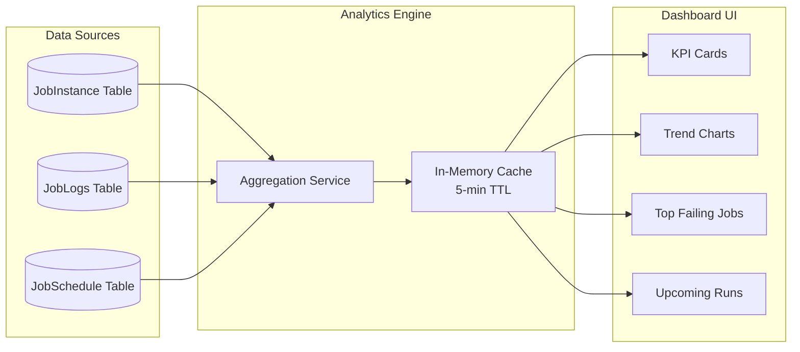

### UI Mockup

```
┌──────────────────────────────────────────────────────────────────────────────┐
│  DASHBOARD                                                    [Last 7 Days ▼] │
├──────────────┬──────────────┬──────────────┬──────────────────────────────────┤
│  ✅ SUCCESS  │  ❌ FAILED   │  ⏱ AVG TIME  │  📊 TOTAL RUNS                  │
│    1,247     │     23       │    4m 32s    │    1,270                        │
│   +12% ↑    │   -5% ↓     │   -8% ↓     │   +11% ↑                       │
├──────────────┴──────────────┴──────────────┴──────────────────────────────────┤
│                                                                              │
│  Success / Failure Trend (7 Days)                                            │
│  ┌────────────────────────────────────────────────────────────────────┐      │
│  │ 200 ┤ ██                                                          │      │
│  │ 180 ┤ ██ ██                                              ██       │      │
│  │ 160 ┤ ██ ██ ██                                    ██    ██       │      │
│  │ 140 ┤ ██ ██ ██ ██                          ██    ██    ██       │      │
│  │ 120 ┤ ██ ██ ██ ██ ██                ██    ██    ██    ██       │      │
│  │     └──Mon──Tue──Wed──Thu──Fri──Sat──Sun─────────────────────────│      │
│  │       ██ Success   ░░ Failed                                      │      │
│  └────────────────────────────────────────────────────────────────────┘      │
│                                                                              │
├───────────────────────────────────┬──────────────────────────────────────────┤
│  TOP 5 FAILING JOBS               │  LONGEST RUNNING JOBS                    │
│  ─────────────────────────────── │  ────────────────────────────────────── │
│  1. Data Sync (ETL)    8 fails   │  1. Full DB Backup         12m 03s     │
│  2. Email Report        5 fails   │  2. Data Sync (ETL)         9m 47s     │
│  3. API Health Check    4 fails   │  3. Report Generation       7m 22s     │
│  4. Cleanup Temp        3 fails   │  4. Log Archival            6m 11s     │
│  5. Weather Fetch       3 fails   │  5. Email Report            4m 55s     │
├───────────────────────────────────┴──────────────────────────────────────────┤
│  UPCOMING RUNS (Next 6 Hours)                                                │
│  ─────────────────────────────────────────────────────────────────────────── │
│  10:30 AM  │ Data Sync (ETL)          │ Every 30 min │ Agent-1             │
│  10:45 AM  │ Email Report             │ Daily        │ Agent-2             │
│  11:00 AM  │ API Health Check         │ Every 15 min │ Agent-1             │
│  11:30 AM  │ Data Sync (ETL)          │ Every 30 min │ Agent-1             │
└──────────────────────────────────────────────────────────────────────────────┘
```

### Requirements

- KPI cards: total runs, success, failures, avg duration (with period-over-period change)
- Bar/line chart for daily success/failure trends
- Top failing jobs table (clickable to job detail)
- Longest running jobs table
- Upcoming runs list (next 6 hours)
- Date range selector (Today, 7d, 30d, Custom)
- Auto-refresh every 60 seconds

---

## 2. Notifications & Alerts

### Overview

Enable users to receive alerts when jobs fail, exceed duration thresholds, or get stuck. Supports email, webhook-out, and in-app notification channels.

### Notification Flow

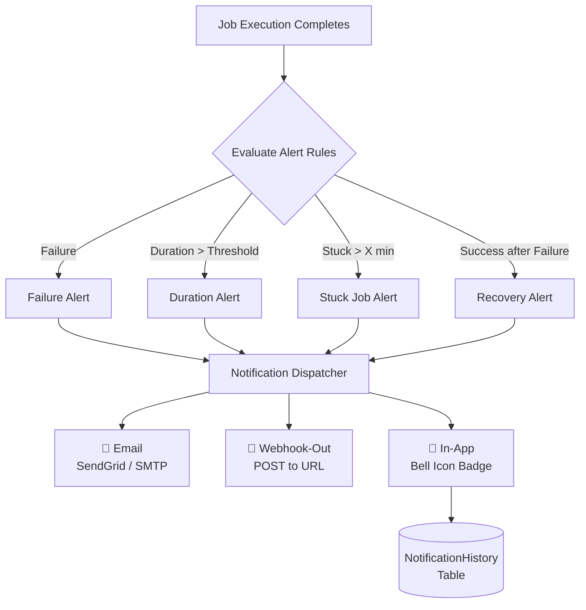

### Alert Rule Configuration Mockup

```
┌──────────────────────────────────────────────────────────────────────────────┐
│  ADMINISTRATION > NOTIFICATION RULES                         [+ New Rule]    │
├──────────────────────────────────────────────────────────────────────────────┤
│                                                                              │
│  ┌─ Rule: Critical Job Failure ─────────────────────────────────────────┐   │
│  │  Trigger:   [Job Failure ▼]                                          │   │
│  │  Scope:     [All Jobs ▼]  or  [Select Jobs...]                       │   │
│  │  Channels:  [✅ Email] [✅ Webhook] [☐ In-App]                       │   │
│  │                                                                       │   │
│  │  Email Recipients:  admin@company.com, devops@company.com             │   │
│  │  Webhook URL:       https://hooks.slack.com/services/T00/B00/xxx      │   │
│  │                                                                       │   │
│  │  Cooldown:  [15 minutes ▼]  (suppress duplicate alerts)              │   │
│  │  Status:    [● Enabled]                                              │   │
│  │                                                      [Save] [Delete] │   │
│  └───────────────────────────────────────────────────────────────────────┘   │
│                                                                              │
│  ┌─ Rule: Long Running Alert ───────────────────────────────────────────┐   │
│  │  Trigger:   [Duration Exceeds ▼]  [10] minutes                       │   │
│  │  Scope:     [Job Group: ETL ▼]                                       │   │
│  │  Channels:  [✅ Email] [☐ Webhook] [✅ In-App]                       │   │
│  │                                                      [Save] [Delete] │   │
│  └───────────────────────────────────────────────────────────────────────┘   │
│                                                                              │
│  ┌─ Rule: Stuck Job Detection ──────────────────────────────────────────┐   │
│  │  Trigger:   [Job Stuck ▼]  for more than [30] minutes                │   │
│  │  Scope:     [All Jobs ▼]                                             │   │
│  │  Channels:  [✅ Email] [✅ Webhook] [✅ In-App]                       │   │
│  │                                                      [Save] [Delete] │   │
│  └───────────────────────────────────────────────────────────────────────┘   │
└──────────────────────────────────────────────────────────────────────────────┘
```

### In-App Notification Bell Mockup

```
┌──────────────────────────────────────────────────┐
│  BlazorDataOrchestrator          🔔 (3)  👤 Admin │
├──────────────────────────────────────────────────┤
│  ┌─ Notifications ───────────────────────────┐   │
│  │                                            │   │
│  │  🔴 Job "Data Sync" failed                │   │
│  │     2 min ago • Click to view logs         │   │
│  │  ─────────────────────────────────────── │   │
│  │  🟡 Job "Report Gen" exceeded 10m         │   │
│  │     15 min ago • Duration: 12m 41s         │   │
│  │  ─────────────────────────────────────── │   │
│  │  🟢 Job "Data Sync" recovered             │   │
│  │     18 min ago • After 2 consecutive fails │   │
│  │                                            │   │
│  │          [Mark All Read]  [View All →]     │   │
│  └────────────────────────────────────────────┘   │
└──────────────────────────────────────────────────┘
```

### Requirements

- Alert rule types: Failure, Duration Exceeded, Stuck Job, Recovery
- Channels: Email (SMTP/SendGrid), Webhook-Out (POST JSON), In-App
- Scoping: All jobs, specific job, job group
- Cooldown period to suppress duplicates
- Notification history page with read/unread state
- Webhook payload includes: jobId, jobName, status, duration, errorMessage, timestamp

---

## 3. Agent Monitoring Page

### Overview

Dedicated page to monitor the health and activity of all job execution agents. Shows heartbeat status, current workload, queue depth, and resource utilization.

### Agent Lifecycle

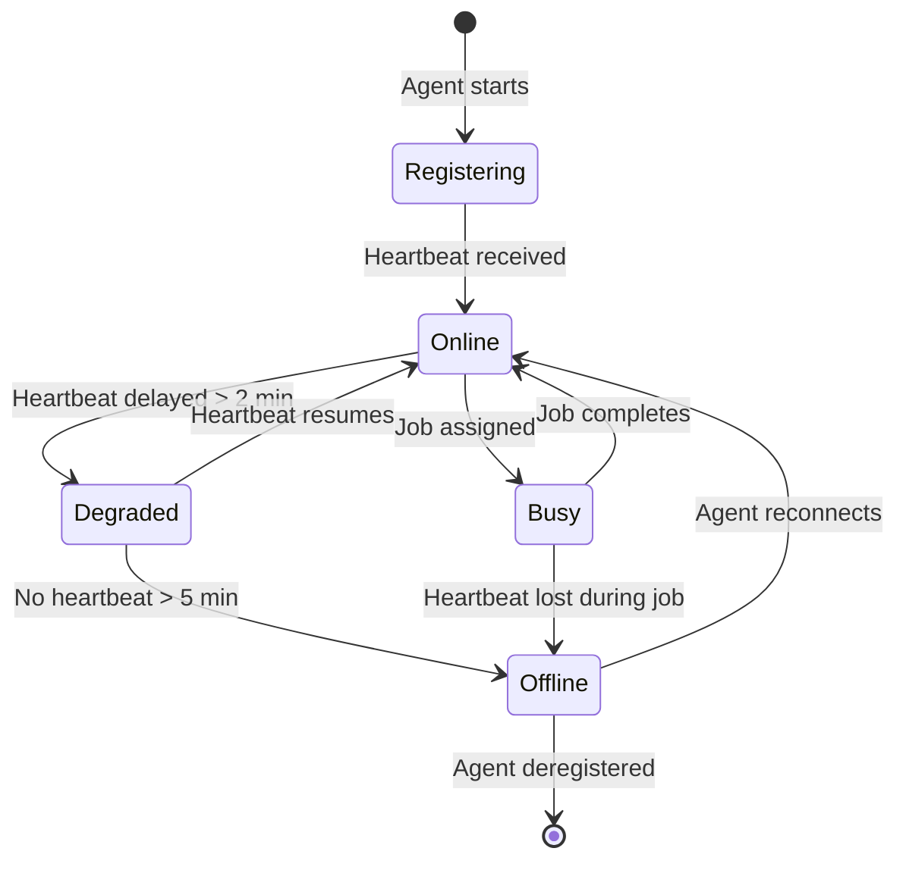

### UI Mockup

```
┌──────────────────────────────────────────────────────────────────────────────┐
│  ADMINISTRATION > AGENT MONITORING                          [Auto-Refresh ⟳] │
├──────────────────────────────────────────────────────────────────────────────┤
│                                                                              │
│  AGENT OVERVIEW                                                              │
│  ┌────────────┐  ┌────────────┐  ┌────────────┐  ┌────────────┐            │
│  │  🟢 Online │  │  🔵 Busy   │  │  🟡 Degraded│  │  🔴 Offline│            │
│  │     3      │  │     2      │  │     0      │  │     1      │            │
│  └────────────┘  └────────────┘  └────────────┘  └────────────┘            │
│                                                                              │
├──────────────────────────────────────────────────────────────────────────────┤
│  AGENT DETAILS                                                               │
│  ┌────────────────────────────────────────────────────────────────────────┐  │
│  │ Status │ Agent Name    │ Host         │ Queue Depth │ Current Job     │  │
│  │────────┼───────────────┼──────────────┼─────────────┼─────────────────│  │
│  │  🟢    │ Agent-Prod-01 │ aca-agent-01 │     3       │ —               │  │
│  │  🔵    │ Agent-Prod-02 │ aca-agent-02 │     7       │ Data Sync (ETL) │  │
│  │  🔵    │ Agent-Prod-03 │ aca-agent-03 │     2       │ Email Report    │  │
│  │  🟢    │ Agent-Dev-01  │ localhost     │     0       │ —               │  │
│  │  🟢    │ Agent-Dev-02  │ localhost     │     1       │ —               │  │
│  │  🔴    │ Agent-QA-01   │ aca-agent-qa │     —       │ —               │  │
│  └────────────────────────────────────────────────────────────────────────┘  │
│                                                                              │
│  ┌─ Agent-Prod-02 (Detail Panel) ────────────────────────────────────────┐  │
│  │  Host:          aca-agent-02.azurecontainerapps.io                     │  │
│  │  Last Heartbeat: 12 seconds ago                                        │  │
│  │  Uptime:         4d 7h 22m                                             │  │
│  │  Jobs Today:     47 completed, 1 failed                                │  │
│  │  Avg Duration:   3m 18s                                                │  │
│  │  Queue:          ████████░░ 7 / 10                                     │  │
│  │                                                                        │  │
│  │  RECENT ACTIVITY                                                       │  │
│  │  10:14 AM  Started "Data Sync (ETL)" — Instance #8842                  │  │
│  │  10:12 AM  Completed "Cleanup Temp" — 1m 04s ✅                        │  │
│  │  10:08 AM  Completed "Weather Fetch" — 0m 22s ✅                       │  │
│  │  10:01 AM  Failed "API Health Check" — timeout ❌                      │  │
│  └────────────────────────────────────────────────────────────────────────┘  │
└──────────────────────────────────────────────────────────────────────────────┘
```

### Requirements

- Agent status badges (Online, Busy, Degraded, Offline) based on heartbeat
- Summary cards at top (count per status)
- Detail panel on row click showing uptime, recent activity, queue gauge
- Auto-refresh every 30 seconds
- Alert integration: trigger notification when agent goes Offline

---

## 4. User & Role Management

### Overview

Multi-user support with role-based access control. Enables teams to share the orchestrator safely with appropriate permission boundaries.

### Role Hierarchy

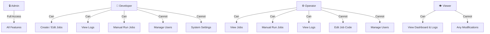

### Permission Matrix

| Permission | Admin | Developer | Operator | Viewer |
|-----------|-------|-----------|----------|--------|
| View Dashboard | ✅ | ✅ | ✅ | ✅ |
| View Logs | ✅ | ✅ | ✅ | ✅ |
| Manual Run Job | ✅ | ✅ | ✅ | ❌ |
| Create / Edit Jobs | ✅ | ✅ | ❌ | ❌ |
| Delete Jobs | ✅ | ✅ | ❌ | ❌ |
| Manage Schedules | ✅ | ✅ | ❌ | ❌ |
| Manage Job Groups | ✅ | ✅ | ❌ | ❌ |
| System Settings | ✅ | ❌ | ❌ | ❌ |
| Manage Users | ✅ | ❌ | ❌ | ❌ |
| Manage Agents | ✅ | ❌ | ❌ | ❌ |
| Audit Log Access | ✅ | ❌ | ❌ | ❌ |

### UI Mockup

```
┌──────────────────────────────────────────────────────────────────────────────┐
│  ADMINISTRATION > USER MANAGEMENT                            [+ Invite User] │
├──────────────────────────────────────────────────────────────────────────────┤
│                                                                              │
│  ┌────────────────────────────────────────────────────────────────────────┐  │
│  │ Avatar │ Name           │ Email                │ Role      │ Status   │  │
│  │────────┼────────────────┼──────────────────────┼───────────┼──────────│  │
│  │  AS    │ Awais Saad     │ awais@company.com    │ Admin     │ 🟢 Active│  │
│  │  JD    │ Jane Doe       │ jane@company.com     │ Developer │ 🟢 Active│  │
│  │  BW    │ Bob Wilson     │ bob@company.com      │ Operator  │ 🟢 Active│  │
│  │  TS    │ Tom Smith      │ tom@company.com      │ Viewer    │ 🟡 Invited│  │
│  └────────────────────────────────────────────────────────────────────────┘  │
│                                                                              │
│  ┌─ Edit User: Jane Doe ────────────────────────────────────────────────┐   │
│  │                                                                       │   │
│  │  Name:    [Jane Doe                    ]                              │   │
│  │  Email:   [jane@company.com            ]  (read-only)                 │   │
│  │  Role:    [Developer ▼]                                               │   │
│  │                                                                       │   │
│  │  Job Group Access:                                                    │   │
│  │    [✅ ETL Jobs]  [✅ Reporting]  [☐ Infrastructure]  [☐ DevOps]      │   │
│  │                                                                       │   │
│  │  Last Login: March 30, 2026 at 9:14 AM                                │   │
│  │                                                                       │   │
│  │                              [Deactivate]  [Cancel]  [Save Changes]   │   │
│  └───────────────────────────────────────────────────────────────────────┘   │
└──────────────────────────────────────────────────────────────────────────────┘
```

### Requirements

- Roles: Admin, Developer, Operator, Viewer
- Invite users via email
- Optional: Job Group-scoped access (Developer sees only their group's jobs)
- User list with status (Active, Invited, Deactivated)
- Integration with existing Identity/auth system

---

## 5. Job Dependency Chains

### Overview

Allow users to define execution dependencies between jobs, enabling DAG-style workflows where downstream jobs trigger automatically when upstream jobs succeed.

### Dependency DAG Example

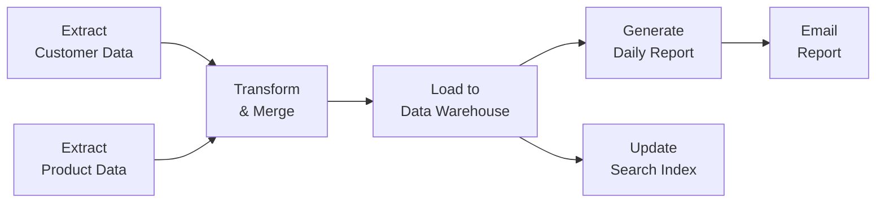

### Execution Flow

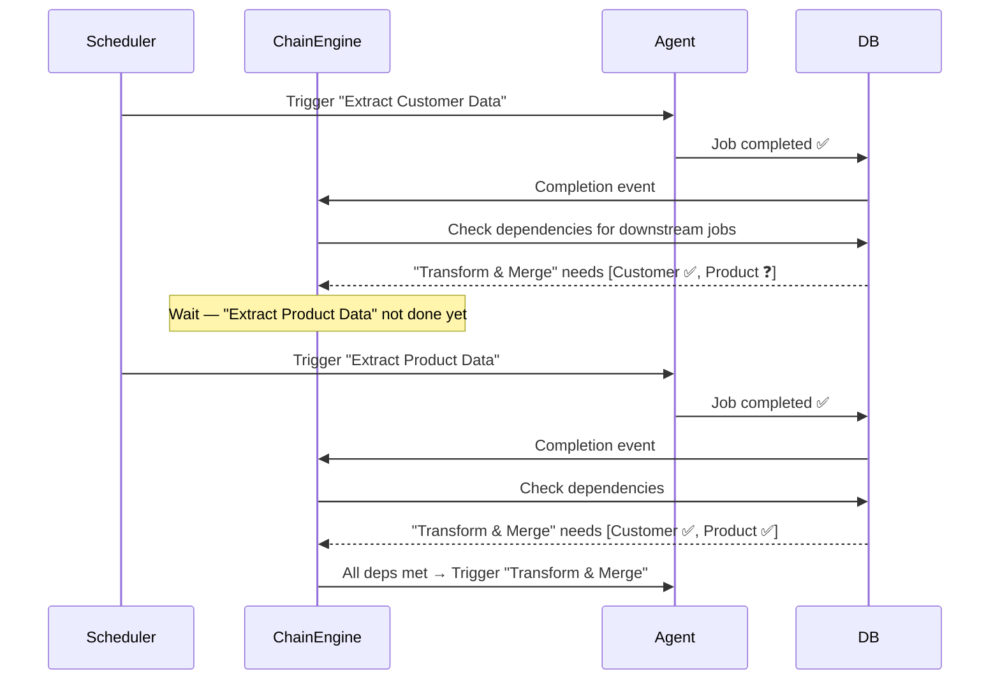

### UI Mockup — Chain Builder

```
┌──────────────────────────────────────────────────────────────────────────────┐
│  JOB DETAIL > DEPENDENCIES                                                   │
├──────────────────────────────────────────────────────────────────────────────┤
│                                                                              │
│  Chain: "Daily ETL Pipeline"                                                 │
│                                                                              │
│  ┌─────────────────────────────────────────────────────────────────────┐    │
│  │                                                                     │    │
│  │   [Extract Customer] ──┐                                            │    │
│  │                        ├──→ [Transform & Merge] ──→ [Load to DW]   │    │
│  │   [Extract Product]  ──┘                               │            │    │
│  │                                                   ┌────┴────┐       │    │
│  │                                              [Report]  [Search]     │    │
│  │                                                   │                 │    │
│  │                                              [Email Report]         │    │
│  └─────────────────────────────────────────────────────────────────────┘    │
│                                                                              │
│  UPSTREAM DEPENDENCIES (this job runs AFTER these complete):                 │
│  ┌────────────────────────────────────────────────────────────────────────┐  │
│  │  [+ Add Dependency]                                                    │  │
│  │                                                                        │  │
│  │  • Extract Customer Data   │ Condition: [Success ▼] │ [✕ Remove]      │  │
│  │  • Extract Product Data    │ Condition: [Success ▼] │ [✕ Remove]      │  │
│  └────────────────────────────────────────────────────────────────────────┘  │
│                                                                              │
│  DOWNSTREAM JOBS (these run AFTER this job):                                 │
│  ┌────────────────────────────────────────────────────────────────────────┐  │
│  │  • Load to Data Warehouse  │ Condition: Success                        │  │
│  └────────────────────────────────────────────────────────────────────────┘  │
│                                                                              │
│  Failure Policy: [Stop Chain ▼]   ○ Stop Chain  ○ Skip & Continue           │
│                                                                              │
│                                                        [Cancel]  [Save]     │
└──────────────────────────────────────────────────────────────────────────────┘
```

### Requirements

- Define upstream dependencies per job (runs after X completes)
- Dependency conditions: Success, Failure, Any Completion
- Visual DAG view of the entire chain
- Chain failure policies: Stop chain, Skip downstream & continue
- Circular dependency detection and prevention
- Chain execution history view

---

## 6. Secrets / Shared Variable Management

### Overview

Centralized vault for storing sensitive credentials and shared configuration values that jobs can reference by name instead of hardcoding or duplicating across job appsettings.

### Secret Resolution Flow

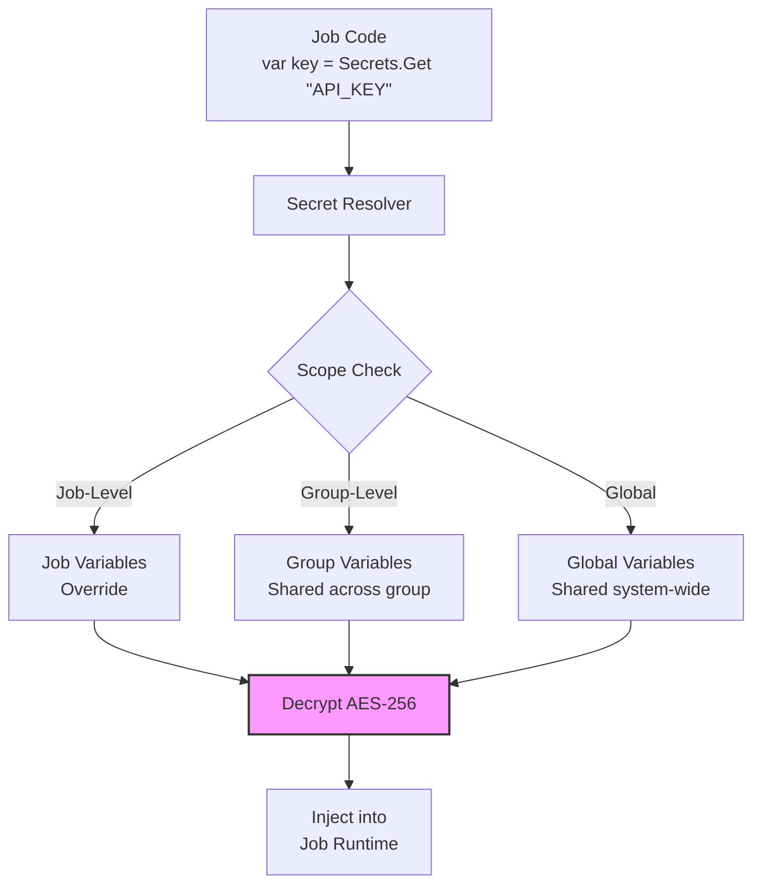

### Secret Scope Precedence

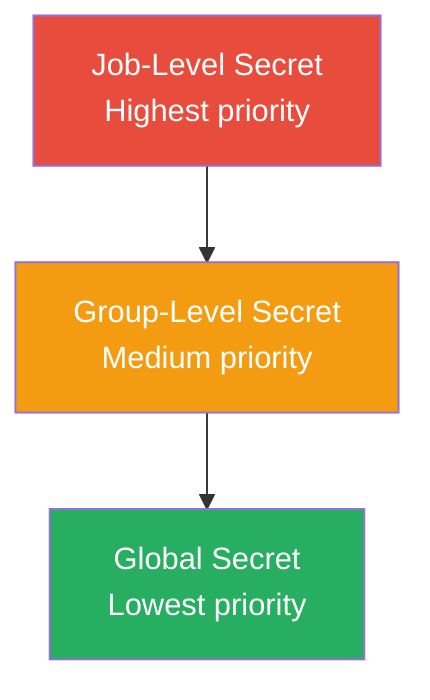

### UI Mockup

```
┌──────────────────────────────────────────────────────────────────────────────┐
│  ADMINISTRATION > SECRETS & VARIABLES                    [+ New Variable]    │
├──────────────────────────────────────────────────────────────────────────────┤
│                                                                              │
│  SCOPE: [🔘 Global] [○ Group: ETL] [○ Job: Data Sync]                       │
│                                                                              │
│  ┌────────────────────────────────────────────────────────────────────────┐  │
│  │  Key                  │ Type     │ Scope    │ Used By     │ Actions   │  │
│  │───────────────────────┼──────────┼──────────┼─────────────┼───────────│  │
│  │  DB_CONNECTION_STR    │ 🔒 Secret │ Global   │ 12 jobs     │ [✏️] [🗑️]│  │
│  │  SENDGRID_API_KEY     │ 🔒 Secret │ Global   │ 3 jobs      │ [✏️] [🗑️]│  │
│  │  FTP_PASSWORD         │ 🔒 Secret │ ETL      │ 5 jobs      │ [✏️] [🗑️]│  │
│  │  REPORT_EMAIL_TO      │ 📝 Text   │ Global   │ 4 jobs      │ [✏️] [🗑️]│  │
│  │  API_BASE_URL         │ 📝 Text   │ Global   │ 8 jobs      │ [✏️] [🗑️]│  │
│  │  RETRY_COUNT          │ 📝 Text   │ ETL      │ 5 jobs      │ [✏️] [🗑️]│  │
│  └────────────────────────────────────────────────────────────────────────┘  │
│                                                                              │
│  ┌─ Edit: SENDGRID_API_KEY ─────────────────────────────────────────────┐   │
│  │                                                                       │   │
│  │  Key:      [SENDGRID_API_KEY          ]                               │   │
│  │  Type:     [🔒 Secret ▼]                                              │   │
│  │  Value:    [••••••••••••••••••••••••••]  [👁️ Show]                     │   │
│  │  Scope:    [Global ▼]                                                 │   │
│  │                                                                       │   │
│  │  Usage:  Referenced in 3 jobs                                         │   │
│  │          • Email Daily Report                                         │   │
│  │          • Send Alert Digest                                          │   │
│  │          • Welcome Email Sender                                       │   │
│  │                                                                       │   │
│  │                                            [Cancel]  [Save Changes]   │   │
│  └───────────────────────────────────────────────────────────────────────┘   │
└──────────────────────────────────────────────────────────────────────────────┘
```

### Requirements

- Variables stored encrypted at rest (AES-256)
- Secret types: Secret (masked), Text (visible)
- Scopes: Global, Group-level, Job-level (with override precedence)
- Usage tracking: show which jobs reference each variable
- Secrets never logged or returned in API responses
- Access in job code via `Secrets.Get("KEY_NAME")` helper or injected env vars

---

## 7. Bulk Operations

### Overview

Select and operate on multiple jobs simultaneously — enable/disable, trigger, delete, or reassign to different agents/groups.

### UI Mockup

```
┌──────────────────────────────────────────────────────────────────────────────┐
│  DASHBOARD                                           [3 selected] actions ▼  │
│                                                      ┌─────────────────────┐ │
│                                                      │ ▶ Run Selected      │ │
│                                                      │ ⏸ Disable Selected  │ │
│                                                      │ ▶ Enable Selected   │ │
│                                                      │ 📁 Move to Group... │ │
│                                                      │ 🔄 Reassign Agent...│ │
│                                                      │ ───────────────── │ │
│                                                      │ 🗑️ Delete Selected  │ │
│                                                      └─────────────────────┘ │
├──────────────────────────────────────────────────────────────────────────────┤
│  [☑ Select All]                                                              │
│  ┌────────────────────────────────────────────────────────────────────────┐  │
│  │ [✅] │ Data Sync (ETL)       │ Running  │ Every 30 min │ Agent-01    │  │
│  │ [☐]  │ Email Report          │ Idle     │ Daily 9 AM   │ Agent-02    │  │
│  │ [✅] │ API Health Check      │ Idle     │ Every 15 min │ Agent-01    │  │
│  │ [☐]  │ Cleanup Temp          │ Disabled │ Daily 2 AM   │ Agent-01    │  │
│  │ [✅] │ Weather Fetch         │ Idle     │ Hourly       │ Agent-03    │  │
│  │ [☐]  │ Report Generation     │ Running  │ Daily 6 AM   │ Agent-02    │  │
│  └────────────────────────────────────────────────────────────────────────┘  │
│                                                                              │
│  ┌─ Confirmation Dialog ─────────────────────────────────────────────┐      │
│  │                                                                    │      │
│  │   ⚠️ Disable 3 selected jobs?                                     │      │
│  │                                                                    │      │
│  │   • Data Sync (ETL)                                                │      │
│  │   • API Health Check                                               │      │
│  │   • Weather Fetch                                                  │      │
│  │                                                                    │      │
│  │   These jobs will not run until re-enabled.                        │      │
│  │                                                                    │      │
│  │                                    [Cancel]  [Disable 3 Jobs]      │      │
│  └────────────────────────────────────────────────────────────────────┘      │
└──────────────────────────────────────────────────────────────────────────────┘
```

### Requirements

- Checkbox-based multi-select in job grid
- Actions: Run, Enable, Disable, Move to Group, Reassign Agent, Delete
- Confirmation dialog listing affected jobs before destructive actions
- "Select All" / "Select Filtered" support
- Progress indicator during bulk operations

---

## 8. Job Templates Library

### Overview

Pre-built starter templates that users can browse and clone to quickly create new jobs. Reduces boilerplate and guides best practices.

### Template Selection Flow

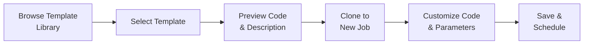

### UI Mockup

```
┌──────────────────────────────────────────────────────────────────────────────┐
│  NEW JOB > TEMPLATE LIBRARY                      [Search templates...  🔍]   │
├──────────────────────────────────────────────────────────────────────────────┤
│                                                                              │
│  CATEGORIES:  [All] [Data] [API] [Email] [Files] [Database] [Custom]         │
│                                                                              │
│  ┌──────────────────────┐  ┌──────────────────────┐  ┌──────────────────┐   │
│  │  🔄 HTTP API Poller  │  │  🗄️ DB Table Cleanup │  │  📧 Email Sender │   │
│  │                      │  │                      │  │                  │   │
│  │  Poll a REST API at  │  │  Delete rows older   │  │  Send templated  │   │
│  │  regular intervals   │  │  than N days from a  │  │  emails via SMTP │   │
│  │  and store results.  │  │  SQL table.          │  │  or SendGrid.    │   │
│  │                      │  │                      │  │                  │   │
│  │  Lang: C# | Python   │  │  Lang: C# | Python   │  │  Lang: C#        │   │
│  │  Difficulty: Easy     │  │  Difficulty: Easy     │  │  Difficulty: Easy │   │
│  │        [Use →]        │  │        [Use →]        │  │      [Use →]     │   │
│  └──────────────────────┘  └──────────────────────┘  └──────────────────┘   │
│                                                                              │
│  ┌──────────────────────┐  ┌──────────────────────┐  ┌──────────────────┐   │
│  │  📂 FTP/SFTP Sync    │  │  🔗 Webhook Handler  │  │  📊 CSV to DB    │   │
│  │                      │  │                      │  │    Importer      │   │
│  │  Upload or download  │  │  Process incoming    │  │                  │   │
│  │  files from FTP/SFTP │  │  webhook payloads    │  │  Parse CSV and   │   │
│  │  servers.            │  │  and trigger actions. │  │  bulk insert to  │   │
│  │                      │  │                      │  │  SQL Server.     │   │
│  │  Lang: C# | Python   │  │  Lang: C#             │  │  Lang: Python    │   │
│  │  Difficulty: Medium   │  │  Difficulty: Medium   │  │  Difficulty: Med │   │
│  │        [Use →]        │  │        [Use →]        │  │      [Use →]     │   │
│  └──────────────────────┘  └──────────────────────┘  └──────────────────┘   │
│                                                                              │
│  ┌──────────────────────┐  ┌──────────────────────┐  ┌──────────────────┐   │
│  │  🧹 Blob Storage     │  │  📡 Queue Consumer   │  │  🏗️ Blank Job    │   │
│  │     Cleanup          │  │                      │  │                  │   │
│  │                      │  │  Process messages    │  │  Empty template  │   │
│  │  Delete old blobs    │  │  from Azure Storage  │  │  with boilerplate│   │
│  │  based on age/prefix │  │  or Service Bus.     │  │  only.           │   │
│  │                      │  │                      │  │                  │   │
│  │  Lang: C#             │  │  Lang: C#             │  │  Lang: C# | Py   │   │
│  │  Difficulty: Easy     │  │  Difficulty: Medium   │  │  Difficulty: —   │   │
│  │        [Use →]        │  │        [Use →]        │  │      [Use →]     │   │
│  └──────────────────────┘  └──────────────────────┘  └──────────────────┘   │
└──────────────────────────────────────────────────────────────────────────────┘
```

### Requirements

- Template library with categories and search
- Each template: name, description, language(s), difficulty, code, default parameters
- "Use" button clones template into a new job with pre-filled code
- Allow community/custom templates (admin can add custom templates)
- Template versioning for updates

---

## 9. Export / Import Jobs

### Overview

Backup and restore job configurations (code, schedules, parameters, dependencies) as portable JSON/ZIP packages. Enables migration between environments (dev → staging → prod).

### Export / Import Flow

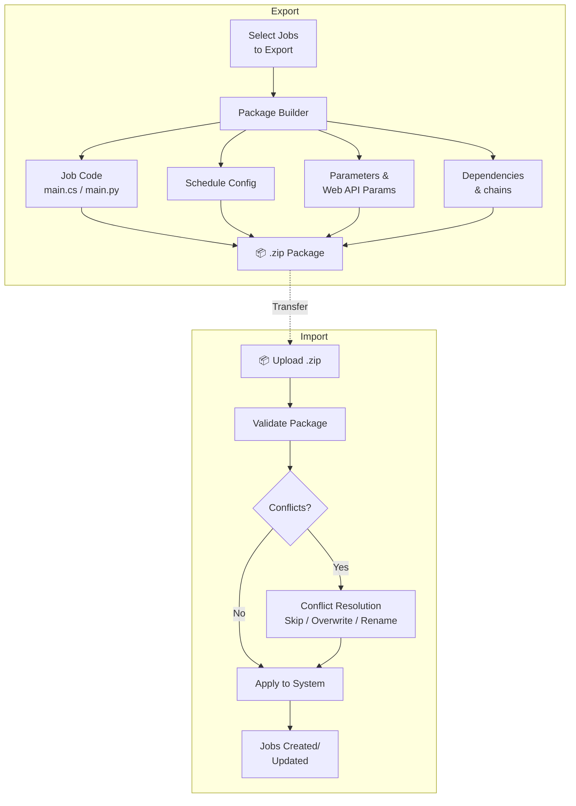

### UI Mockup — Export

```
┌──────────────────────────────────────────────────────────────────────────────┐
│  ADMINISTRATION > EXPORT JOBS                                                │
├──────────────────────────────────────────────────────────────────────────────┤
│                                                                              │
│  Select jobs to export:                                                      │
│                                                                              │
│  Quick Select:  [All Jobs]  [By Group ▼]  [By Agent ▼]                       │
│                                                                              │
│  ┌────────────────────────────────────────────────────────────────────────┐  │
│  │ [✅] │ Data Sync (ETL)       │ C#     │ Group: ETL    │ 3 schedules  │  │
│  │ [✅] │ Email Report          │ C#     │ Group: Reports│ 1 schedule   │  │
│  │ [☐]  │ API Health Check      │ Python │ Group: Infra  │ 2 schedules  │  │
│  │ [✅] │ Report Generation     │ C#     │ Group: Reports│ 1 schedule   │  │
│  └────────────────────────────────────────────────────────────────────────┘  │
│                                                                              │
│  Include:                                                                    │
│    [✅ Code]  [✅ Schedules]  [✅ Parameters]  [✅ Dependencies]              │
│    [☐ Execution History]  [☐ Secrets (encrypted)]                            │
│                                                                              │
│  Format:  [🔘 ZIP]  [○ JSON]                                                │
│                                                                              │
│                                        [Cancel]  [📥 Export 3 Jobs]          │
└──────────────────────────────────────────────────────────────────────────────┘
```

### UI Mockup — Import

```
┌──────────────────────────────────────────────────────────────────────────────┐
│  ADMINISTRATION > IMPORT JOBS                                                │
├──────────────────────────────────────────────────────────────────────────────┤
│                                                                              │
│  ┌─────────────────────────────────────────────────────────────────┐        │
│  │                                                                 │        │
│  │       📦  Drop .zip file here or [Browse...]                    │        │
│  │                                                                 │        │
│  └─────────────────────────────────────────────────────────────────┘        │
│                                                                              │
│  Package: etl-jobs-export-2026-03-31.zip (3 jobs)                            │
│                                                                              │
│  ┌────────────────────────────────────────────────────────────────────────┐  │
│  │  Job Name              │ Status        │ Action               │       │  │
│  │────────────────────────┼───────────────┼──────────────────────│       │  │
│  │  Data Sync (ETL)       │ ⚠️ Exists     │ [Overwrite ▼]        │       │  │
│  │  Email Report          │ ⚠️ Exists     │ [Skip ▼]             │       │  │
│  │  Report Generation     │ ✅ New         │ [Create ▼]           │       │  │
│  └────────────────────────────────────────────────────────────────────────┘  │
│                                                                              │
│  Target Agent: [Agent-Prod-01 ▼]                                             │
│  Target Group: [Keep Original ▼]                                             │
│                                                                              │
│                                          [Cancel]  [📤 Import 3 Jobs]        │
└──────────────────────────────────────────────────────────────────────────────┘
```

### Requirements

- Export selected jobs as ZIP containing JSON manifests and code files
- Include: code, schedules, parameters, dependencies, NuGet/pip configs
- Import with conflict detection (skip, overwrite, rename)
- Target agent/group assignment during import
- Optionally exclude execution history and secrets
- Package validation before import

---

## 10. Audit Log

### Overview

Immutable log of all significant user and system actions for compliance, debugging, and accountability. Tracks who changed what and when.

### Audit Event Flow

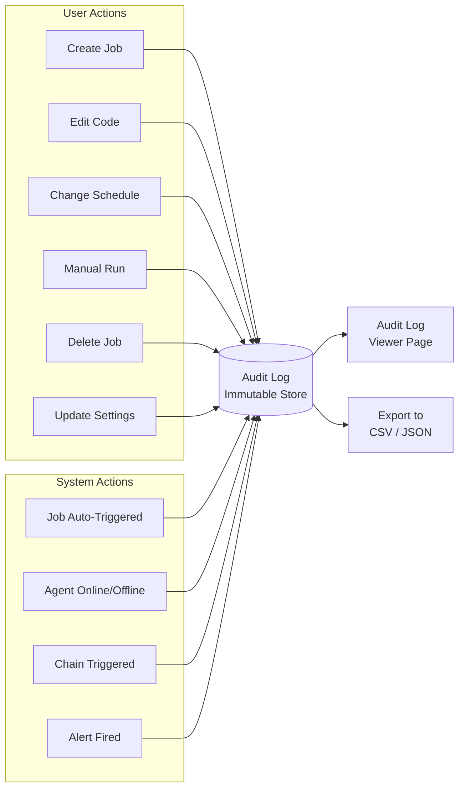

### UI Mockup

```
┌──────────────────────────────────────────────────────────────────────────────┐
│  ADMINISTRATION > AUDIT LOG                                                  │
├──────────────────────────────────────────────────────────────────────────────┤
│                                                                              │
│  FILTERS:                                                                    │
│  Date: [2026-03-01] to [2026-03-31]   User: [All Users ▼]                   │
│  Action: [All Actions ▼]              Resource: [All ▼]    [🔍 Search]       │
│                                                                              │
│  ┌────────────────────────────────────────────────────────────────────────┐  │
│  │ Timestamp            │ User        │ Action         │ Resource        │  │
│  │──────────────────────┼─────────────┼────────────────┼─────────────────│  │
│  │ 2026-03-31 10:14 AM  │ awais       │ Manual Run     │ Data Sync (ETL) │  │
│  │ 2026-03-31 10:08 AM  │ jane        │ Edit Code      │ Email Report    │  │
│  │ 2026-03-31 09:55 AM  │ SYSTEM      │ Job Triggered  │ API Health Chk  │  │
│  │ 2026-03-31 09:45 AM  │ awais       │ Edit Schedule  │ Data Sync (ETL) │  │
│  │ 2026-03-31 09:30 AM  │ SYSTEM      │ Agent Online   │ Agent-Prod-02   │  │
│  │ 2026-03-31 09:22 AM  │ bob         │ Disable Job    │ Cleanup Temp    │  │
│  │ 2026-03-31 09:15 AM  │ awais       │ Update Setting │ Timezone: EST   │  │
│  │ 2026-03-31 09:00 AM  │ SYSTEM      │ Alert Fired    │ Data Sync fail  │  │
│  └────────────────────────────────────────────────────────────────────────┘  │
│                                                                              │
│  ┌─ Detail: Edit Code — Email Report ────────────────────────────────────┐  │
│  │                                                                        │  │
│  │  User:      jane (jane@company.com)                                    │  │
│  │  Timestamp: 2026-03-31 10:08:42 AM UTC                                 │  │
│  │  Action:    Edit Code                                                  │  │
│  │  Resource:  Email Report (Job #42)                                     │  │
│  │  IP:        10.0.1.55                                                  │  │
│  │                                                                        │  │
│  │  Changes:                                                              │  │
│  │  - Modified lines 45-52 in main.cs                                     │  │
│  │  - Added NuGet: SendGrid 9.29.3                                        │  │
│  │                                                                        │  │
│  │  [View Diff →]                                                         │  │
│  └────────────────────────────────────────────────────────────────────────┘  │
│                                                                              │
│  Showing 1-8 of 1,247 entries          [← Prev] [1] [2] [3] ... [Next →]   │
│                                                                              │
│                                                          [📥 Export CSV]     │
└──────────────────────────────────────────────────────────────────────────────┘
```

### Requirements

- Immutable append-only log (no edits or deletes)
- Track: user, action, resource, timestamp, IP address, details/diff
- Action types: Create, Edit, Delete, Enable, Disable, Manual Run, Settings Change
- System actions: Auto-trigger, Agent status change, Alert fired, Chain triggered
- Filter by date range, user, action type, resource
- Detail panel with change summary and optional diff view
- Export to CSV/JSON
- Retention policy configuration (e.g., keep 90 days)

---

## Implementation Roadmap

```mermaid
gantt
    title Feature Implementation Roadmap
    dateFormat YYYY-MM
    axisFormat %b %Y

    section Critical
    Dashboard Analytics         :crit, dash, 2026-04, 2026-05
    Notifications & Alerts      :crit, notif, 2026-05, 2026-06

    section High
    Agent Monitoring Page       :high, agent, 2026-06, 2026-07
    User & Role Management      :high, users, 2026-07, 2026-08

    section Medium
    Job Dependency Chains       :med, deps, 2026-08, 2026-10
    Secrets Management          :med, secrets, 2026-09, 2026-10
    Bulk Operations             :med, bulk, 2026-10, 2026-11

    section Low
    Job Templates Library       :low, templates, 2026-11, 2026-12
    Export / Import Jobs        :low, exportimport, 2026-12, 2027-01
    Audit Log                   :low, audit, 2027-01, 2027-02
```

---

## Database Schema Additions (High-Level)

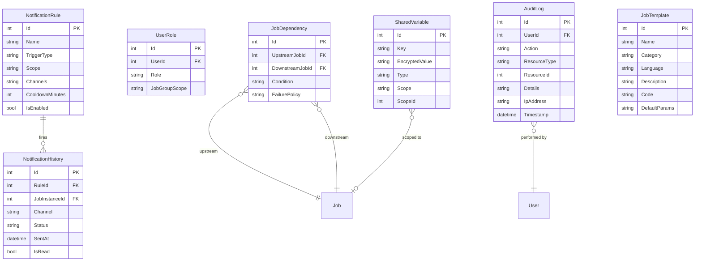

---

## Next Steps

1. Review and prioritize this plan with stakeholders
2. Create GitHub issues for each feature
3. Begin with **Dashboard Analytics** — leverages existing data, highest user impact
4. Follow with **Notifications & Alerts** — most requested production feature
