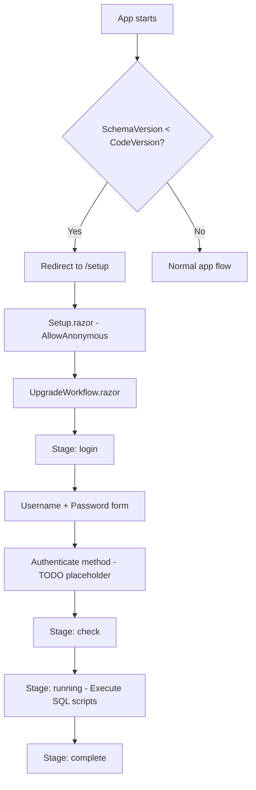
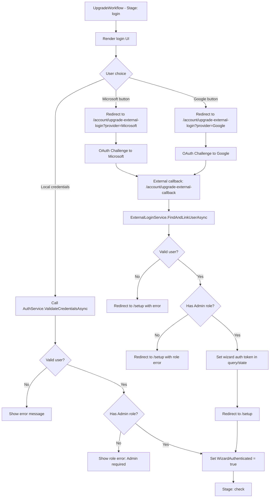
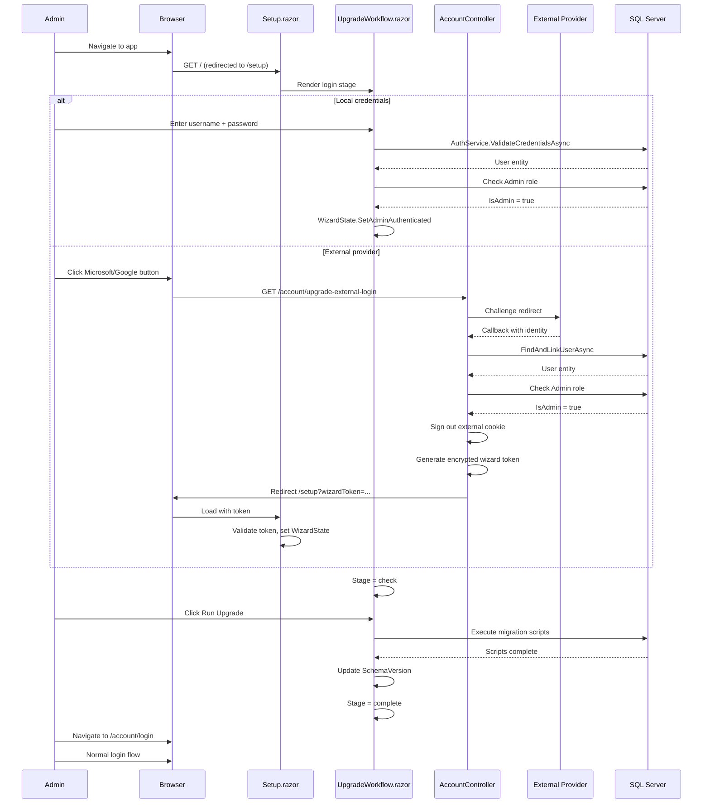
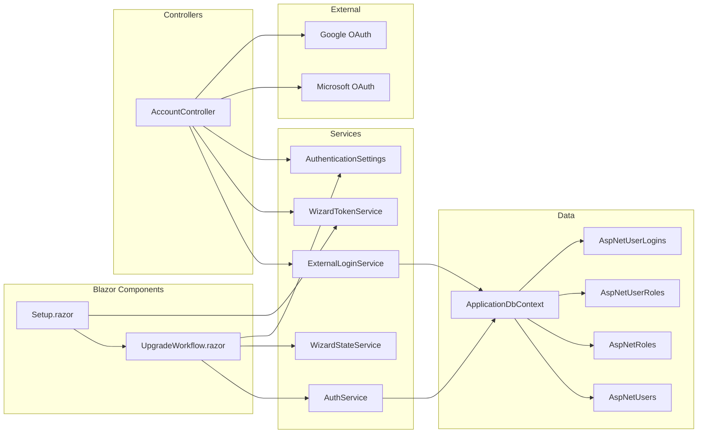

# Upgrade Wizard External Authentication Plan

## Overview

When the application version is upgraded (e.g., to `01.20.00`), the upgrade wizard blocks access to the app and requires an administrator to authenticate before running migration scripts. Currently, the wizard only presents a local username/password form with no actual authentication logic (a `// TODO` placeholder). Administrators whose accounts are configured to use Microsoft or Google authentication cannot proceed because they have no local password.

This plan describes how to implement full administrator authentication in the upgrade wizard, supporting **both local credentials and external OAuth providers (Microsoft/Google)**, while enforcing the **Admin role** requirement. Authentication is **wizard-scoped only** — the admin must still log in via the normal login page after the upgrade completes.

---

## Goals

| # | Goal |
|---|------|
| 1 | Allow admins to authenticate in the upgrade wizard using local username/password |
| 2 | Allow admins to authenticate via Microsoft or Google OAuth (external providers) |
| 3 | Enforce Admin role — only users assigned the `Admin` role can proceed |
| 4 | Hide external provider buttons when that provider is not configured |
| 5 | Keep authentication wizard-scoped (no persistent app cookie issued) |
| 6 | Maintain the `[AllowAnonymous]` nature of the `/setup` page |

---

## Current Architecture



### Key Files

| File | Purpose |
|------|---------|
| `Components/Pages/Setup.razor` | Host page for install/upgrade wizard, `[AllowAnonymous]` |
| `Components/Pages/InstallUpgrade/UpgradeWorkflow.razor` | Upgrade flow with login, check, run, complete stages |
| `Controllers/AccountController.cs` | HTTP endpoints for login, logout, external OAuth challenge/callback |
| `Services/AuthService.cs` | Validates local credentials against `AspNetUsers` |
| `Services/ExternalLoginService.cs` | Links external identity to local account |
| `Services/AuthenticationSettings.cs` | Singleton flags: `IsMicrosoftConfigured`, `IsGoogleConfigured` |
| `Services/AuthenticationSettingsService.cs` | Refreshes provider configuration from Settings table |

---

## Proposed Architecture



---

## Detailed Implementation

### 1. Wizard Authentication State

The upgrade wizard needs a **wizard-scoped** authentication flag that does not persist as an app cookie. This will be stored in the `WizardStateService` (already injected into `UpgradeWorkflow.razor`).

#### Changes to `WizardStateService`

Add the following properties:

```csharp
public bool IsAdminAuthenticated { get; private set; }
public string AuthenticatedAdminName { get; private set; } = string.Empty;

public void SetAdminAuthenticated(string adminName)
{
    IsAdminAuthenticated = true;
    AuthenticatedAdminName = adminName;
}

public void ClearAdminAuthenticated()
{
    IsAdminAuthenticated = false;
    AuthenticatedAdminName = string.Empty;
}
```

Since `WizardStateService` is a scoped service (one per SignalR circuit), this state naturally resets when the user navigates away or the circuit ends.

---

### 2. Local Credential Authentication in UpgradeWorkflow

Replace the `// TODO` in the `Authenticate()` method with actual validation logic.

#### Updated `Authenticate()` Method

```csharp
[Inject] private AuthService AuthService { get; set; } = default!;
[Inject] private ApplicationDbContext DbContext { get; set; } = default!;

private async Task Authenticate()
{
    ErrorMessage = string.Empty;

    if (string.IsNullOrEmpty(Username) || string.IsNullOrEmpty(Password))
    {
        ErrorMessage = "Please enter username and password.";
        return;
    }

    var user = await AuthService.ValidateCredentialsAsync(Username, Password);
    if (user == null)
    {
        ErrorMessage = "Invalid username or password.";
        return;
    }

    // Check Admin role
    var isAdmin = await DbContext.AspNetUsers
        .Where(u => u.Id == user.Id)
        .SelectMany(u => u.Roles)
        .AnyAsync(r => r.NormalizedName == "ADMIN");

    if (!isAdmin)
    {
        ErrorMessage = "Only administrators can perform upgrades.";
        return;
    }

    WizardState.SetAdminAuthenticated(user.UserName ?? Username);
    Stage = "check";
}
```

---

### 3. External Provider Authentication Endpoints

External OAuth requires HTTP redirect flow (not possible purely within Blazor Server SignalR). Two new controller endpoints handle this.

#### New Endpoints in `AccountController.cs`

```csharp
/// <summary>
/// Initiates an external login challenge specifically for the upgrade wizard.
/// Does NOT issue a persistent app cookie — only redirects back to /setup with a token.
/// </summary>
[HttpGet("/account/upgrade-external-login")]
public IActionResult UpgradeExternalLogin(string provider)
{
    if (!string.Equals(provider, "Microsoft", StringComparison.Ordinal)
        && !string.Equals(provider, "Google", StringComparison.Ordinal))
    {
        return Redirect("/setup?authError=Unsupported+provider");
    }

    var isConfigured = provider switch
    {
        "Microsoft" => _authSettings.IsMicrosoftConfigured,
        "Google" => _authSettings.IsGoogleConfigured,
        _ => false
    };

    if (!isConfigured)
    {
        return Redirect($"/setup?authError={Uri.EscapeDataString($"{provider} is not configured")}");
    }

    var properties = new AuthenticationProperties
    {
        RedirectUri = Url.Action("UpgradeExternalLoginCallback"),
        Items = { { "provider", provider } }
    };
    return Challenge(properties, provider);
}

/// <summary>
/// Handles the OAuth callback for upgrade wizard authentication.
/// Validates the user is an admin, then redirects to /setup with success indicator.
/// No app-level cookie is issued.
/// </summary>
[HttpGet("/account/upgrade-external-callback")]
public async Task<IActionResult> UpgradeExternalLoginCallback()
{
    var result = await HttpContext.AuthenticateAsync(
        CookieAuthenticationDefaults.AuthenticationScheme);

    if (!result.Succeeded || result.Principal == null)
    {
        return Redirect("/setup?authError=External+authentication+failed");
    }

    var externalClaims = result.Principal.Claims.ToList();
    var providerKey = externalClaims
        .FirstOrDefault(c => c.Type == ClaimTypes.NameIdentifier)?.Value;
    var email = externalClaims
        .FirstOrDefault(c => c.Type == ClaimTypes.Email)?.Value
        ?? externalClaims
        .FirstOrDefault(c => c.Type == "preferred_username")?.Value;
    var name = externalClaims
        .FirstOrDefault(c => c.Type == ClaimTypes.Name)?.Value ?? email ?? "";
    var provider = result.Properties?.Items
        .TryGetValue("provider", out var p) == true ? p : null;

    if (string.IsNullOrEmpty(providerKey) || string.IsNullOrEmpty(email)
        || string.IsNullOrEmpty(provider))
    {
        return Redirect("/setup?authError=Could+not+retrieve+identity");
    }

    // Find the linked local user
    var user = await _externalLoginService
        .FindAndLinkUserAsync(provider, providerKey, email, name);

    if (user == null)
    {
        return Redirect("/setup?authError=No+local+account+found+for+this+email");
    }

    // Verify Admin role
    var isAdmin = await _dbContext.AspNetUsers
        .Where(u => u.Id == user.Id)
        .SelectMany(u => u.Roles)
        .AnyAsync(r => r.NormalizedName == "ADMIN");

    if (!isAdmin)
    {
        return Redirect("/setup?authError=Only+administrators+can+perform+upgrades");
    }

    // Sign out the external cookie immediately (wizard-scoped only)
    await HttpContext.SignOutAsync(CookieAuthenticationDefaults.AuthenticationScheme);

    // Pass admin identity back via a short-lived encrypted token
    var token = GenerateWizardToken(user.Id, user.UserName ?? name);
    return Redirect($"/setup?wizardToken={token}");
}
```

---

### 4. Wizard Token Mechanism

To securely pass the authenticated admin identity from the HTTP callback back to the Blazor circuit, use ASP.NET Core Data Protection to generate a short-lived encrypted token.

#### Token Generation (in AccountController)

```csharp
[Inject or constructor] IDataProtectionProvider DataProtection;

private string GenerateWizardToken(string userId, string userName)
{
    var protector = DataProtection.CreateProtector("UpgradeWizard");
    var payload = $"{userId}|{userName}|{DateTimeOffset.UtcNow.AddMinutes(5).ToUnixTimeSeconds()}";
    return protector.Protect(payload);
}
```

#### Token Validation (new service: `WizardTokenService`)

```csharp
public class WizardTokenService
{
    private readonly IDataProtectionProvider _dataProtection;

    public WizardTokenService(IDataProtectionProvider dataProtection)
    {
        _dataProtection = dataProtection;
    }

    public (bool IsValid, string UserId, string UserName) ValidateToken(string token)
    {
        try
        {
            var protector = _dataProtection.CreateProtector("UpgradeWizard");
            var payload = protector.Unprotect(token);
            var parts = payload.Split('|');

            if (parts.Length != 3) return (false, "", "");

            var expiry = DateTimeOffset.FromUnixTimeSeconds(long.Parse(parts[2]));
            if (expiry < DateTimeOffset.UtcNow) return (false, "", "");

            return (true, parts[0], parts[1]);
        }
        catch
        {
            return (false, "", "");
        }
    }
}
```

---

### 5. Updated UpgradeWorkflow UI

The login stage UI must present both options and conditionally show external provider buttons.

#### Login Stage Markup

```razor
@if (Stage == "login")
{
    <div class="upgrade-login-container">
        <h4>Administrator Authentication Required</h4>
        <p class="text-muted">
            Only administrators can run database upgrades.
            Sign in with your admin account to continue.
        </p>

        @if (!string.IsNullOrEmpty(ErrorMessage))
        {
            <div class="alert alert-danger">@ErrorMessage</div>
        }

        <!-- Local credentials -->
        <div class="card mb-3">
            <div class="card-body">
                <h6>Sign in with credentials</h6>
                <div class="mb-2">
                    <label>Username or Email</label>
                    <input type="text" class="form-control" @bind="Username" />
                </div>
                <div class="mb-2">
                    <label>Password</label>
                    <input type="password" class="form-control" @bind="Password" />
                </div>
                <button class="btn btn-primary" @onclick="Authenticate">
                    Sign In
                </button>
            </div>
        </div>

        <!-- External providers (shown only when configured) -->
        @if (AuthSettings.IsMicrosoftConfigured || AuthSettings.IsGoogleConfigured)
        {
            <div class="card">
                <div class="card-body">
                    <h6>Or sign in with an external provider</h6>
                    @if (AuthSettings.IsMicrosoftConfigured)
                    {
                        <a href="/account/upgrade-external-login?provider=Microsoft"
                           class="btn btn-outline-primary me-2">
                            <i class="bi bi-microsoft"></i> Microsoft
                        </a>
                    }
                    @if (AuthSettings.IsGoogleConfigured)
                    {
                        <a href="/account/upgrade-external-login?provider=Google"
                           class="btn btn-outline-danger">
                            <i class="bi bi-google"></i> Google
                        </a>
                    }
                </div>
            </div>
        }
    </div>
}
```

---

### 6. Handling the Redirect Back from External Provider

When the user is redirected back to `/setup?wizardToken=...`, the `Setup.razor` page must extract the token and pass it to the `UpgradeWorkflow` component.

#### Changes to `Setup.razor`

```razor
@inject WizardTokenService WizardTokenService
@inject NavigationManager Navigation

[SupplyParameterFromQuery] public string? WizardToken { get; set; }
[SupplyParameterFromQuery] public string? AuthError { get; set; }

protected override void OnInitialized()
{
    // Handle external auth callback token
    if (!string.IsNullOrEmpty(WizardToken))
    {
        var (isValid, userId, userName) = WizardTokenService.ValidateToken(WizardToken);
        if (isValid)
        {
            WizardState.SetAdminAuthenticated(userName);
        }
        // Clear query string to prevent token reuse
        Navigation.NavigateTo("/setup", replace: true);
    }
}
```

---

### 7. Security Considerations

| Concern | Mitigation |
|---------|-----------|
| Token replay | 5-minute expiry encoded in the token payload |
| Token tampering | ASP.NET Core Data Protection encryption |
| Open redirect | All redirects are to hard-coded local paths (`/setup`) |
| No persistent session | External cookie is signed out immediately after validation |
| Brute force (local) | Existing lockout logic in `AspNetUsers` is respected by `AuthService` |
| Role escalation | Admin role check happens server-side after identity is confirmed |
| CSRF on external login | OAuth state parameter handled by ASP.NET Core middleware |

---

## Process Flow: Complete Upgrade Lifecycle



---

## Component Dependency Diagram



---

## Implementation Checklist

### Phase 1: Core Authentication Logic

- [ ] Add `IsAdminAuthenticated` and `AuthenticatedAdminName` to `WizardStateService`
- [ ] Create `WizardTokenService` with Data Protection-based token generation and validation
- [ ] Register `WizardTokenService` in DI (`Program.cs`)
- [ ] Implement local credential validation in `UpgradeWorkflow.Authenticate()` with Admin role check
- [ ] Inject `AuthService`, `ApplicationDbContext` into `UpgradeWorkflow.razor`

### Phase 2: External Provider Support

- [ ] Add `UpgradeExternalLogin` endpoint to `AccountController`
- [ ] Add `UpgradeExternalLoginCallback` endpoint to `AccountController`
- [ ] Inject `IDataProtectionProvider` into `AccountController`
- [ ] Add `GenerateWizardToken` private method to `AccountController`

### Phase 3: UI Updates

- [ ] Update `UpgradeWorkflow.razor` login stage markup to show both options
- [ ] Inject `AuthenticationSettings` into `UpgradeWorkflow.razor` for provider visibility
- [ ] Add `[SupplyParameterFromQuery]` parameters to `Setup.razor` for `WizardToken` and `AuthError`
- [ ] Add token validation logic to `Setup.razor` `OnInitialized`
- [ ] Display `AuthError` message in the wizard UI when present

### Phase 4: Testing

- [ ] Test local admin login (valid credentials, Admin role)
- [ ] Test local login rejection (valid credentials, non-Admin role)
- [ ] Test local login rejection (invalid credentials)
- [ ] Test Microsoft OAuth flow for Admin user
- [ ] Test Google OAuth flow for Admin user
- [ ] Test external login rejection for non-Admin user
- [ ] Test external login when provider is not configured (buttons hidden)
- [ ] Test token expiry (wait 5+ minutes, token should be rejected)
- [ ] Test that no app-level cookie persists after wizard auth
- [ ] Test fresh install scenario (no providers configured, only local login shown)

---

## Edge Cases

| Scenario | Expected Behavior |
|----------|-------------------|
| Admin has no local password (external-only) | External provider buttons are available; local form shows clear error on attempt |
| Neither provider is configured | Only local credentials form is shown |
| Token in URL is expired | Token validation fails silently; user sees login form again |
| Token in URL is tampered | Data Protection decryption fails; user sees login form again |
| Database is unreachable during auth | Error message displayed; user cannot proceed |
| Admin account is locked out | Both local and external paths reject the user |
| Multiple admins | Any admin can authenticate; first one to complete the wizard wins |
| Browser back button after auth | `WizardState` is circuit-scoped; state persists within the same circuit |

---

## Files to Create or Modify

| Action | File Path |
|--------|-----------|
| Create | `Services/WizardTokenService.cs` |
| Modify | `Services/WizardStateService.cs` — add admin auth state |
| Modify | `Components/Pages/InstallUpgrade/UpgradeWorkflow.razor` — implement auth + UI |
| Modify | `Components/Pages/Setup.razor` — handle query params and token |
| Modify | `Controllers/AccountController.cs` — add upgrade endpoints |
| Modify | `Program.cs` — register `WizardTokenService` |
