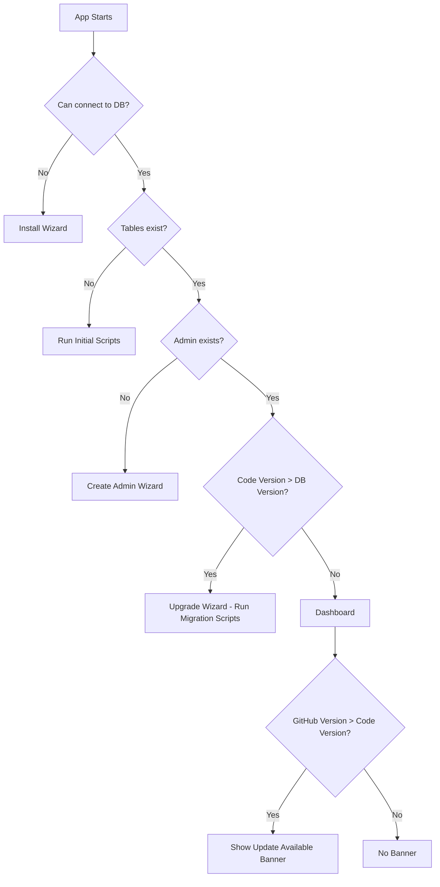
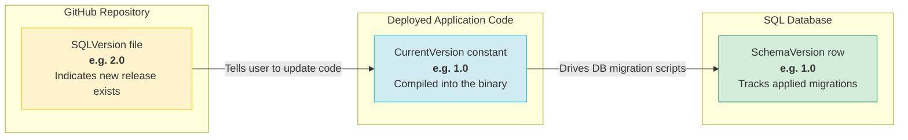
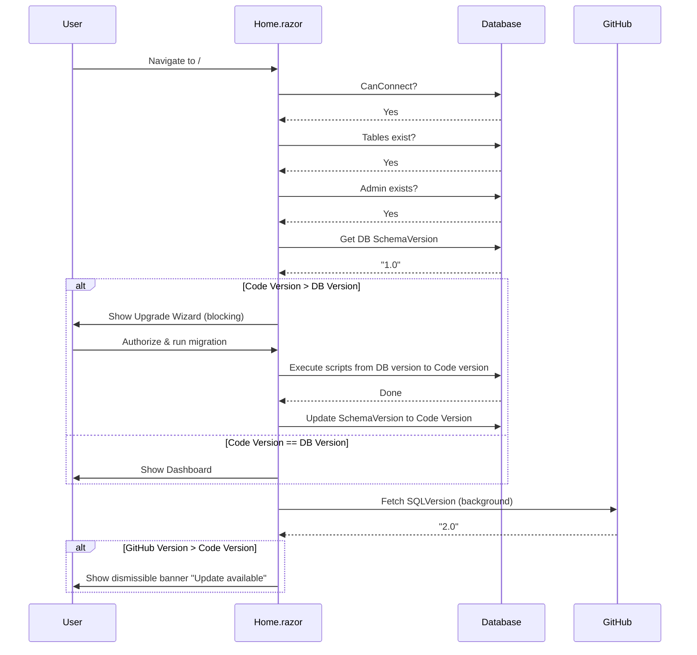
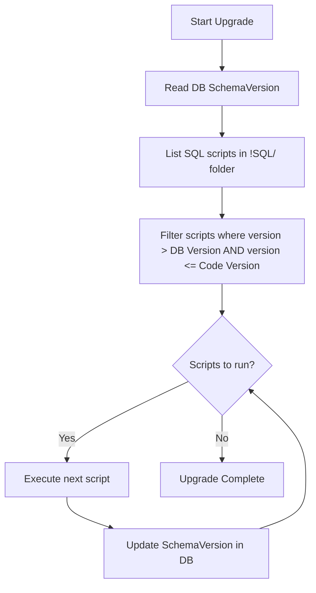
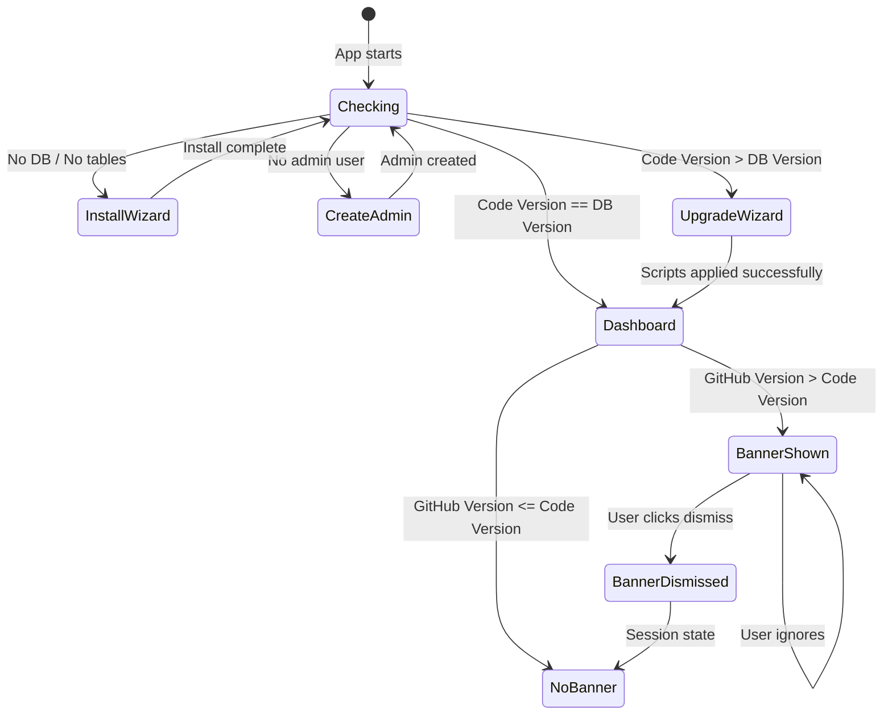

# Upgrade Wizard Refactor Plan

## Problem Statement

The current upgrade wizard **forces** the user into a blocking wizard flow when the GitHub `SQLVersion` file version is higher than the local `CurrentVersion` constant. This is incorrect because:

1. Changing the GitHub `SQLVersion` file immediately blocks all users on startup.
2. Users cannot dismiss the wizard — they are locked out of the dashboard.
3. The upgrade should only run when the **local code version** has been updated (i.e., user pulled new code), not simply because GitHub says a new version exists.

## Current vs. Desired Behavior

| Aspect | Current (Broken) | Desired |
|---|---|---|
| GitHub version > Code version | **Blocks** user with upgrade wizard | Shows a **dismissible banner** on the dashboard |
| User pulls new code | No special handling | Code version updates; if code > DB, upgrade wizard triggers |
| What triggers DB migration | GitHub version mismatch | **Code version > DB version** mismatch |
| User can skip banner | No (forced wizard) | Yes (banner is informational only) |
| DB version tracking | Not tracked in DB | Stored in a `SystemSettings` or `__SchemaVersion` table |

## Architecture Overview



## Three Version Concepts



| Version | Where it lives | Purpose |
|---|---|---|
| **GitHub Version** | `SQLVersion` file in GitHub repo | Advertise that a new release is available |
| **Code Version** | `CurrentVersion` constant in `Home.razor` | The version compiled into the running application |
| **DB Version** | `SystemSettings` table in SQL | The schema version currently applied to the database |

## Detailed Flow



## Implementation Steps

### Step 1: Add DB Schema Version Tracking

Add a `SchemaVersion` row to the existing `SystemSettings` table (or create a dedicated table if `SystemSettings` doesn't exist).

```sql
-- Add to initial install script or as a migration
IF NOT EXISTS (SELECT 1 FROM SystemSettings WHERE [Key] = 'SchemaVersion')
    INSERT INTO SystemSettings ([Key], [Value]) VALUES ('SchemaVersion', '1.0');
```

The DB version is read at startup and compared against `CurrentVersion`.

### Step 2: Refactor `IsDatabaseNeedUpgradeAsync()`

**Current logic (wrong):**
```
if (GitHub Version > Code Version) → force upgrade wizard
```

**New logic:**
```
DB Version = read from SystemSettings
if (Code Version > DB Version) → show upgrade wizard (blocking, runs scripts)
```

### Step 3: Add Background GitHub Version Check

After the dashboard loads, check GitHub version in the background:

```
GitHub Version = fetch from GitHub
if (GitHub Version > Code Version) → set ShowUpdateBanner = true
```

This is **non-blocking** — the user sees the dashboard with an informational banner.

### Step 4: Add Dismissible Banner Component

A banner at the top of the dashboard:

```
┌──────────────────────────────────────────────────────────────┐
│ ⬆ Update Available: Version 2.0 is available on GitHub.     │
│   Pull the latest code to upgrade.                    [ ✕ ] │
└──────────────────────────────────────────────────────────────┘
```

- Dismissible (stores state in session so it doesn't reappear until next session)
- Shows GitHub version and current code version
- Links to release notes or repo if applicable

### Step 5: Refactor Upgrade Workflow to Be Script-Driven

The `UpgradeWorkflow.razor` should:

1. Determine which scripts to run based on `DB Version → Code Version` gap
2. Look for SQL files in `!SQL/` named by version (e.g., `01.00.00.sql`, `02.00.00.sql`)
3. Execute scripts sequentially in version order
4. Update `SchemaVersion` in the DB after each script succeeds



## File Changes Summary

| File | Change |
|---|---|
| `Home.razor` | Split version check: DB version for upgrade wizard, GitHub version for banner |
| `Home.razor` | Add `ShowUpdateBanner` state and dismissible banner markup |
| `Home.razor` | Rename `IsDatabaseNeedUpgradeAsync()` to check Code vs DB version |
| `Home.razor` | Add `CheckForGitHubUpdate()` method (non-blocking, runs after dashboard loads) |
| `UpgradeWorkflow.razor` | Accept `DatabaseVersion` parameter instead of `LatestGitHubVersion` |
| `UpgradeWorkflow.razor` | Implement real script execution based on version gap |
| `DatabaseInitializer.cs` | After initial install, write `SchemaVersion = CurrentVersion` to DB |
| `!SQL/` folder | Future upgrade scripts named by version (e.g., `02.00.00.sql`) |

## State Diagram



## Key Principles

1. **GitHub version is advisory only** — it tells the user "a new release exists, go pull the code."
2. **Code version drives migrations** — the compiled `CurrentVersion` constant determines what DB schema is expected.
3. **DB version is the source of truth** — the `SchemaVersion` in the database tells us what migrations have already been applied.
4. **Never block the user for an advisory notification** — the update-available banner is always dismissible.
5. **The upgrade wizard only appears when the code demands it** — i.e., the user has pulled new code that requires DB changes.
