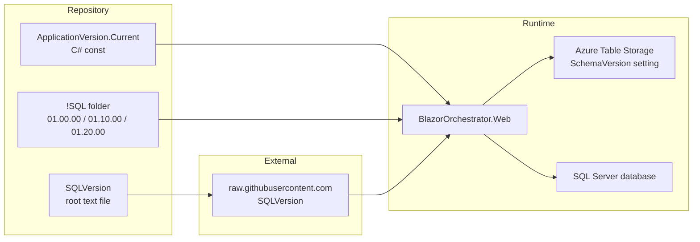
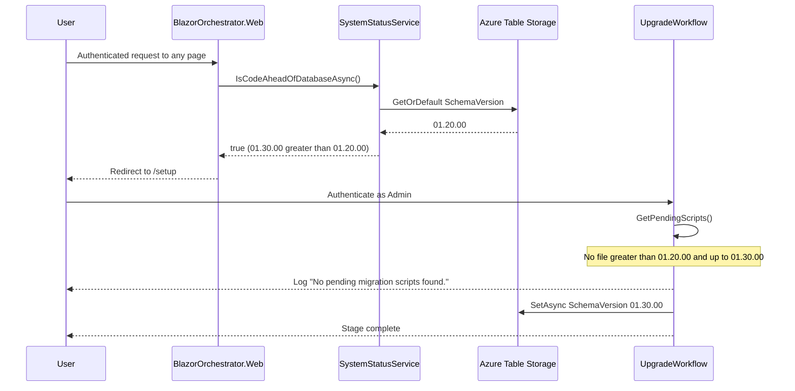
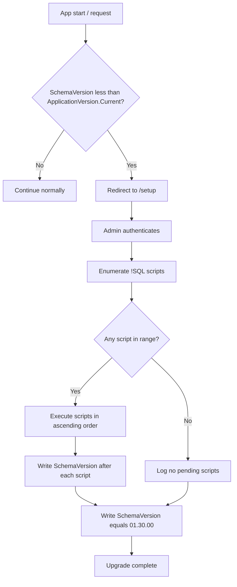
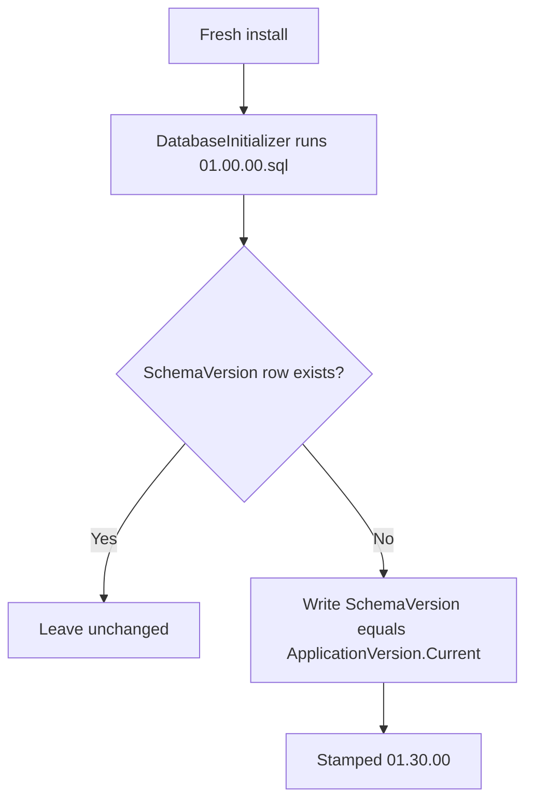

# Version Bump Plan: 01.20.00 → 01.30.00

## 1. Overview

This document describes how to raise the Blazor Data Orchestrator application version
from `01.20.00` to `01.30.00`.

**Key decision:** *no new `.sql` migration script is required.* The upgrade wizard
already supports a "no pending scripts" path — when the code version is ahead of the
stored `SchemaVersion` but no matching script file exists, it simply writes the new
`SchemaVersion` value and reports success. The bump is therefore a metadata-only
change spread across three artifacts.

## 2. Version Concepts

The system tracks three distinct version values. Understanding the difference is
essential before editing anything.

| Version | Location | Purpose |
| --- | --- | --- |
| **Code version** | `ApplicationVersion.Current` (C# const) | The version compiled into the running binaries. Source of truth for "what the code expects". |
| **Schema version** | `SchemaVersion` row in Azure Table Storage (via `SettingsService`) | The version last successfully applied to the database. |
| **Published version** | `SQLVersion` file at repository root | Fetched over HTTP from GitHub `main` by the Home page to advertise that a newer release exists. |



## 3. Current State (01.20.00)

| Artifact | Path | Current value |
| --- | --- | --- |
| Code version const | `src/BlazorDataOrchestrator.Core/ApplicationVersion.cs` | `01.20.00` |
| Published version file | `SQLVersion` (repo root) | `01.20.00` |
| Migration scripts | `src/BlazorOrchestrator.Web/!SQL/` | `01.00.00.sql`, `01.10.00.sql`, `01.20.00.sql` |
| Copy-to-output entries | `src/BlazorOrchestrator.Web/BlazorOrchestrator.Web.csproj` | three `<None Update="!SQL\...">` items |

## 4. Target State (01.30.00)

| Artifact | New value / action |
| --- | --- |
| `ApplicationVersion.Current` | `01.30.00` |
| `SQLVersion` | `01.30.00` |
| `!SQL/` folder | **unchanged** — no `01.30.00.sql` |
| `.csproj` | **unchanged** — no new `<None Update>` item |

## 5. Implementation Steps

### 5.1 Update the code version constant

File: `src/BlazorDataOrchestrator.Core/ApplicationVersion.cs`

```csharp
public const string Current = "01.30.00";
```

Keep the zero-padded `NN.NN.NN` format. `ConvertVersionToInteger` parses each segment
with `int.Parse`, so any deviation (for example `1.3.0`) will still parse but will
break the visual match against script filenames.

### 5.2 Update the published version file

File: `SQLVersion` (repository root)

Replace the single line `01.20.00` with `01.30.00`. The file has no trailing content
requirements; `Home.razor` trims the fetched body before comparison.

> **Ordering note:** this file is fetched from the `main` branch at runtime. Once
> merged, every deployed instance still on `01.20.00` will start advertising that a
> new release is available. If that is undesirable before the binaries ship, land the
> `SQLVersion` change in the same commit as the release build, or as a follow-up
> commit merged at release time.

### 5.3 Confirm no SQL artifacts are needed

Explicitly verify — do not create:

- No `src/BlazorOrchestrator.Web/!SQL/01.30.00.sql`
- No new `<None Update="!SQL\01.30.00.sql">` entry in `BlazorOrchestrator.Web.csproj`

`GetPendingScripts()` enumerates `*.sql` in the output `!SQL` directory and selects
files where `dbVersionInt < versionInt <= codeVersionInt`. With no `01.30.00.sql`
present, an instance at `01.20.00` yields an empty list, which is a supported case.

### 5.4 Search for any other hardcoded version strings

Run a repository-wide search for `01.20.00` and confirm every remaining hit is either
a historical reference (documentation, plan files, past migration filenames) or an XML
doc comment example. Only the two artifacts in 5.1 and 5.2 are functional.

## 6. Upgrade Flow After the Bump



### 6.1 Decision logic



## 7. Fresh Install Path

`DatabaseInitializer` runs `!SQL/01.00.00.sql` to create the baseline schema, then
seeds `SchemaVersion` from `ApplicationVersion.Current`. After this change a fresh
install is stamped `01.30.00` immediately.

> **Important:** `01.00.00.sql` remains the full baseline. Because `01.10.00.sql` and
> `01.20.00.sql` are not replayed on a fresh install, any schema they introduced must
> already be folded into `01.00.00.sql`. This bump does not change that invariant, but
> confirm it still holds before releasing.



## 8. Files Changed

| File | Change |
| --- | --- |
| `src/BlazorDataOrchestrator.Core/ApplicationVersion.cs` | `Current` const to `01.30.00` |
| `SQLVersion` | contents to `01.30.00` |

No project file, no SQL script, no service code changes.

## 9. Verification

### 9.1 Build

- `dotnet build BlazorDataOrchestrator.slnx` succeeds.
- `aspire run` starts the AppHost with all resources healthy.

### 9.2 Upgrade path (existing database at 01.20.00)

1. Start with an environment whose `SchemaVersion` setting is `01.20.00`.
2. Launch the app and sign in as a non-admin user; confirm redirect to `/setup`.
3. Sign in to the wizard as an Admin.
4. Confirm the check stage shows database `01.20.00` and code `01.30.00`.
5. Run the upgrade; confirm the log reads `No pending migration scripts found.`
   followed by a schema version update.
6. Confirm the `SchemaVersion` row in Table Storage now reads `01.30.00`.
7. Reload the app; confirm no further redirect to `/setup`.

### 9.3 Fresh install path

1. Point at an empty database and empty Table Storage.
2. Run the install; confirm `01.00.00.sql` executes and `SchemaVersion` is seeded
   as `01.30.00`.
3. Confirm no upgrade redirect occurs afterwards.

### 9.4 Home page banner

1. With `SQLVersion` on `main` reading `01.30.00`, load the Home page on an instance
   running `01.30.00`; confirm no "new version available" prompt.
2. On an instance still running `01.20.00`, confirm the prompt appears.

## 10. Rollback

Revert the two file edits. Instances whose `SchemaVersion` was already advanced to
`01.30.00` will then have a stored schema version *ahead* of the code version;
`IsCodeAheadOfDatabaseAsync` returns `false` in that case, so the app continues to run
without a redirect loop. To fully restore, manually set the `SchemaVersion` setting
back to `01.20.00`.

## 11. Risks and Considerations

| Risk | Mitigation |
| --- | --- |
| `SQLVersion` on `main` advertises a release before binaries are published | Merge the `SQLVersion` change at release time, or in the release commit |
| A future feature needs schema changes at `01.30.00` | Add `01.30.00.sql` plus its `<None Update>` csproj entry, and fold the DDL into `01.00.00.sql` for fresh installs |
| Version string format drift | Keep zero-padded `NN.NN.NN`; add a unit test asserting the format if desired |
| Stale `SchemaVersion` on multi-instance deployments | The middleware check runs per request, so any instance will redirect until the wizard runs once |

## 12. Definition of Done

- [ ] `ApplicationVersion.Current` reads `01.30.00`
- [ ] Root `SQLVersion` file reads `01.30.00`
- [ ] No `01.30.00.sql` exists and no csproj entry was added
- [ ] Solution builds and `aspire run` is healthy
- [ ] Upgrade path verified against a `01.20.00` database
- [ ] Fresh install verified to stamp `01.30.00`
- [ ] Home page version banner behaves as expected
