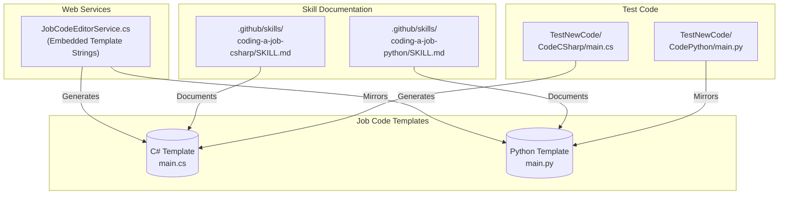
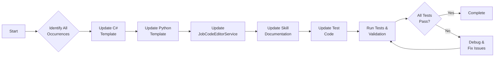
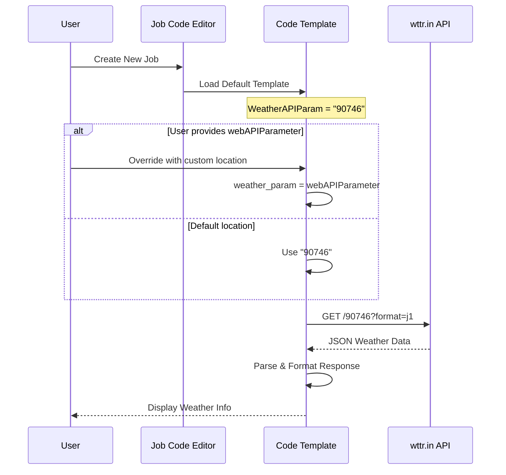
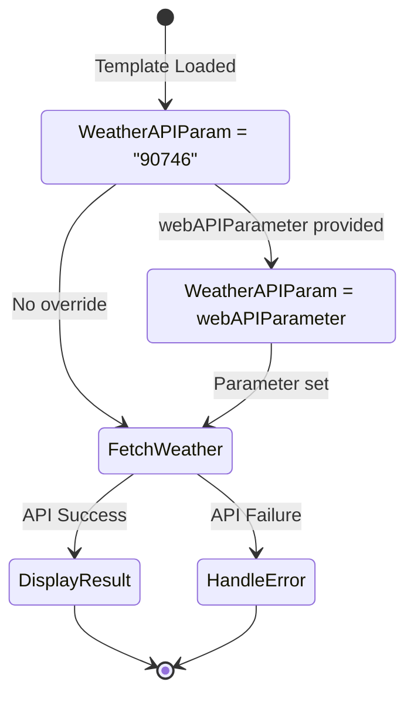
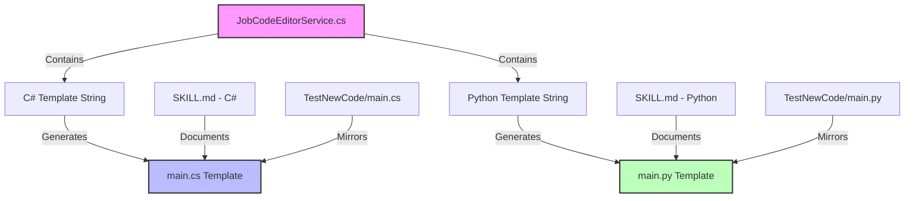
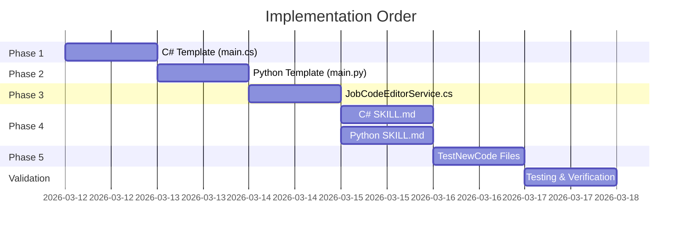

# Weather API Parameter Update Plan

This document outlines the implementation plan for updating the default weather API parameter from `Los+Angeles,CA` to `90746` (ZIP code format) across all job templates in the Blazor Data Orchestrator project.

## Overview

The weather demonstration in the job templates currently uses `Los+Angeles,CA` as the default location parameter. This plan details the changes required to update this to a ZIP code format (`90746`) for improved API compatibility and consistency.

### Goals

1. Update the default weather API parameter to use ZIP code format
2. Maintain backward compatibility with the `webAPIParameter` override functionality
3. Ensure consistency across C# and Python templates
4. Update all related documentation and embedded template strings

---

## System Architecture

The following diagram illustrates the components that contain weather API parameter references:



---

## Affected Files Summary

| File Path | Language | Changes Required |
|-----------|----------|------------------|
| `src/BlazorDataOrchestrator.JobCreatorTemplate/Code/CodeCSharp/main.cs` | C# | 2 locations |
| `src/BlazorDataOrchestrator.JobCreatorTemplate/Code/CodePython/main.py` | Python | 2 locations |
| `src/BlazorOrchestrator.Web/Services/JobCodeEditorService.cs` | C# | 4 locations |
| `.github/skills/coding-a-job-csharp/SKILL.md` | Markdown | 5 locations |
| `.github/skills/coding-a-job-python/SKILL.md` | Markdown | 5 locations |
| `src/TestNewCode/Code/CodeCSharp/main.cs` | C# | 1 location (verify) |
| `src/TestNewCode/Code/CodePython/main.py` | Python | 2 locations |

---

## Implementation Process Flow



---

## Detailed Implementation Steps

### Phase 1: C# Template Update

#### File: `src/BlazorDataOrchestrator.JobCreatorTemplate/Code/CodeCSharp/main.cs`

**Location 1 - Line 109: Default Parameter**

```diff
- string WeatherAPIParam = "Los+Angeles,CA";
+ string WeatherAPIParam = "90746";
```

**Location 2 - Line 144: Weather Info Display String**

Update the display string to be dynamic based on the location parameter:

```diff
- string weatherInfo = $"Los Angeles, CA - Temperature: {tempF}°F ({tempC}°C), Humidity: {humidity}%, Conditions: {weatherDesc}";
+ string weatherInfo = $"{WeatherAPIParam} - Temperature: {tempF}°F ({tempC}°C), Humidity: {humidity}%, Conditions: {weatherDesc}";
```

**Alternative Approach for Location 2:**

If you want to maintain a user-friendly display name, consider adding a separate display variable:

```csharp
string WeatherAPIParam = "90746";
string WeatherDisplayName = "90746"; // ZIP code serves as both

// If webAPIParameter is passed, use it for both
if (!string.IsNullOrEmpty(webAPIParameter))
{
    WeatherAPIParam = webAPIParameter.Replace(" ", "+");
    WeatherDisplayName = webAPIParameter;
}
```

---

### Phase 2: Python Template Update

#### File: `src/BlazorDataOrchestrator.JobCreatorTemplate/Code/CodePython/main.py`

**Location 1 - Line 250: API Parameter**

```diff
- weather_api_param = "Los+Angeles,CA"
+ weather_api_param = "90746"
```

**Location 2 - Line 251: Location Display Name**

```diff
- weather_location = "Los Angeles,CA"
+ weather_location = "90746"
```

**Contextual Code Block:**

```python
# Set default weather API parameter
weather_api_param = "90746"
weather_location = "90746"

# If web_api_parameter is passed, use it to fetch weather data
if web_api_parameter:
    weather_api_param = web_api_parameter.replace(" ", "+")
    weather_location = web_api_parameter
```

---

### Phase 3: JobCodeEditorService Update

#### File: `src/BlazorOrchestrator.Web/Services/JobCodeEditorService.cs`

This file contains embedded template strings that are used to generate new job code. All references must be updated.

**Location 1 - Line ~127: C# Template String**

```diff
- string WeatherAPIParam = ""Los+Angeles,CA"";
+ string WeatherAPIParam = ""90746"";
```

**Location 2 - Line ~162: C# Weather Info String**

```diff
- string weatherInfo = $""Los Angeles, CA - Temperature: ...
+ string weatherInfo = $""{WeatherAPIParam} - Temperature: ...
```

**Location 3 - Line ~483: Python API Param**

```diff
- weather_api_param = ""Los+Angeles,CA""
+ weather_api_param = ""90746""
```

**Location 4 - Line ~484: Python Location**

```diff
- weather_location = ""Los Angeles,CA""
+ weather_location = ""90746""
```

---

### Phase 4: Documentation Updates

#### File: `.github/skills/coding-a-job-csharp/SKILL.md`

Update the following lines:

| Line | Original | Updated |
|------|----------|---------|
| 166 | `// Fetch weather data for Los Angeles, CA` | `// Fetch weather data for the specified location` |
| 167 | `"Fetching weather data for Los Angeles, CA"` | `"Fetching weather data for " + WeatherAPIParam` |
| 168 | `logs.Add("Fetching weather data for Los Angeles, CA")` | `logs.Add($"Fetching weather data for {WeatherAPIParam}")` |
| 175 | `string weatherUrl = "https://wttr.in/Los+Angeles,CA?format=j1"` | `string weatherUrl = $"https://wttr.in/{WeatherAPIParam}?format=j1"` |
| 193 | `$"Los Angeles, CA - Temperature: ..."` | `$"{WeatherAPIParam} - Temperature: ..."` |

#### File: `.github/skills/coding-a-job-python/SKILL.md`

Update the following lines:

| Line | Original | Updated |
|------|----------|---------|
| 302 | `# Fetch weather data for Los Angeles, CA` | `# Fetch weather data for the specified location` |
| 303 | `"Fetching weather data for Los Angeles, CA"` | `f"Fetching weather data for {weather_location}"` |
| 304 | `logs.append("Fetching weather data for Los Angeles, CA")` | `logs.append(f"Fetching weather data for {weather_location}")` |
| 307 | `weather_url = "https://wttr.in/Los+Angeles,CA?format=j1"` | `weather_url = f"https://wttr.in/{weather_api_param}?format=j1"` |
| 324 | `f"Los Angeles, CA - Temperature: ..."` | `f"{weather_location} - Temperature: ..."` |

---

### Phase 5: Test Code Updates

#### File: `src/TestNewCode/Code/CodeCSharp/main.cs`

**Status:** Line 103 already uses `90746`. Verify line 135 for consistency.

```diff
- string weatherInfo = $"Los Angeles, CA - Temperature: ...
+ string weatherInfo = $"{WeatherAPIParam} - Temperature: ...
```

#### File: `src/TestNewCode/Code/CodePython/main.py`

**Location 1 - Line 250:**

```diff
- weather_api_param = "Los+Angeles,CA"
+ weather_api_param = "90746"
```

**Location 2 - Line 251:**

```diff
- weather_location = "Los Angeles,CA"
+ weather_location = "90746"
```

---

## Data Flow Diagram



---

## State Transition Diagram



---

## Validation Checklist

After implementing the changes, verify the following:

### Unit Tests

- [ ] C# template compiles without errors
- [ ] Python template executes without syntax errors
- [ ] Weather API call succeeds with ZIP code format
- [ ] `webAPIParameter` override functionality still works
- [ ] Log messages display correct location

### Integration Tests

- [ ] New job creation generates correct template code
- [ ] JobCodeEditorService produces valid C# template
- [ ] JobCodeEditorService produces valid Python template
- [ ] Weather data is fetched and parsed correctly

### Documentation Verification

- [ ] SKILL.md files contain updated code examples
- [ ] All hardcoded "Los Angeles" references removed
- [ ] Code examples in documentation compile/run

---

## Rollback Plan

If issues are discovered after deployment:

1. **Immediate:** Revert commits related to this change
2. **Restore:** Replace updated files with previous versions from source control
3. **Verify:** Ensure all templates generate the original `Los+Angeles,CA` parameter
4. **Document:** Record issues encountered for future reference

---

## Component Dependency Graph



---

## Implementation Order

To minimize risk and ensure consistency, implement changes in this order:



---

## Summary

This plan provides a comprehensive roadmap for updating the weather API parameter from `Los+Angeles,CA` to `90746` across all affected files in the Blazor Data Orchestrator project. The changes span:

- **2 primary template files** (C# and Python)
- **1 service file** with embedded templates
- **2 skill documentation files**
- **2 test code files**

Total estimated lines to modify: **~20 lines** across **7 files**

Following this plan ensures consistent updates across the entire codebase while maintaining backward compatibility with the parameter override functionality.
