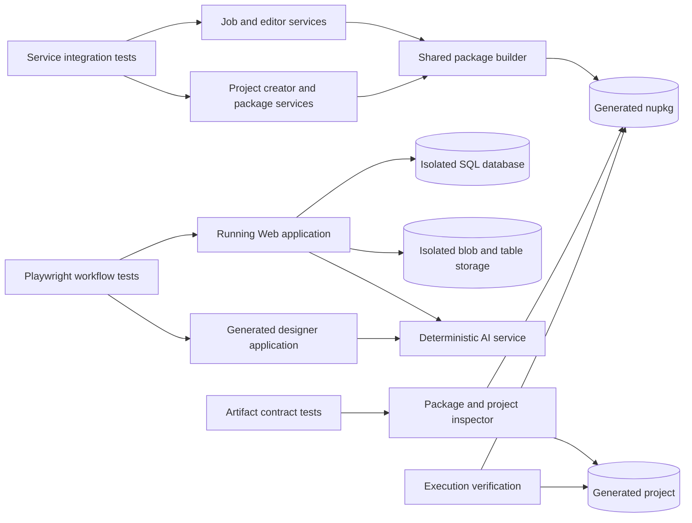
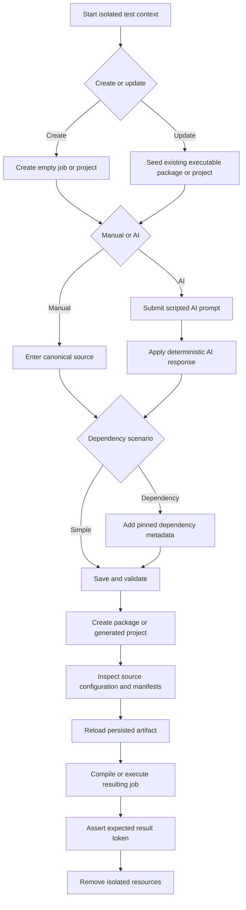

# Web and Visual Studio Job Testing Plan

## Purpose

Implement automated coverage for creating and updating Web Jobs and Visual Studio Jobs in C# and Python, both manually and through AI-assisted editing, with and without an added third-party dependency. The suite must prove that source code, dependency metadata, generated packages, persisted job records, exported Visual Studio projects, and executable behavior remain consistent across every supported path.

This plan defines 32 required scenarios:

- 2 job surfaces: Web Job and Visual Studio Job.
- 2 languages: C# and Python.
- 2 operations: Create and Update.
- 2 authoring modes: Without AI and With AI.
- 2 module types: Simple module and module with a dependency.

## Terminology and Scope

### Web Job

A job created from the main dashboard and edited in `JobDetailsDialog.razor`. Its code is compiled or validated, packaged as a `.nupkg`, uploaded through `JobManager`, and associated with `Job.JobCodeFile`.

### Visual Studio Job

A job authored in the generated `BlazorDataOrchestrator.JobCreatorTemplate` application. Coverage includes creating a blank project through `ProjectCreatorService`, exporting an existing Web Job into a generated project, editing code in the generated designer, creating the job package, and validating the generated project and package.

### Create

- For a Web Job, create a new database job, initialize its editor files, author the first valid module, and save the first package.
- For a Visual Studio Job, create a new generated project, author and package its first module, and verify the corresponding job registration when that workflow is used.

### Update

- For a Web Job, begin with an existing persisted package, load it into the editor, change behavior, save a replacement package, reopen it, and verify the change survived the round trip.
- For a Visual Studio Job, begin with a generated project containing an existing valid module, modify it in the designer, create a replacement package, restart or reload the designer, and verify the change survived.

### Dependency Scenario

For C#, “Add NuGet Package” means a pinned NuGet dependency represented in the `// NUGET:` header, the generated `.nuspec`, and, where applicable, `dependencies.json` or the generated project file. For Python, the equivalent scenario means a pinned PyPI dependency represented by a `# ADD TO REQUIREMENTS.txt:` header and `requirements.txt`. Python code is still distributed inside a `.nupkg`, but its runtime libraries are not NuGet dependencies.

### Out of Scope

- Performance, load, and soak testing.
- Testing third-party AI model quality.
- Testing NuGet.org or PyPI availability as a product behavior.
- Production Azure resource provisioning.
- Visual Studio IDE automation; generated solutions are validated through their files, build result, application startup, and browser workflow.

## Current Implementation Anchors

| Area | Current owner | Test relevance |
|---|---|---|
| Web Job creation | `src/BlazorOrchestrator.Web/Components/Pages/Home.razor` and `JobService.cs` | Creates the job, initializes appsettings files, and opens job details. |
| Web Job editing | `src/BlazorOrchestrator.Web/Components/Pages/Dialogs/JobDetailsDialog.razor` | Loads packages, invokes AI, compiles or validates code, and saves replacement packages. |
| Editor state | `src/BlazorOrchestrator.Web/Services/EditorFileStorageService.cs` | Preserves source, appsettings, `.nuspec`, and dependency state during editing. |
| Web package creation | `src/BlazorOrchestrator.Web/Services/WebNuGetPackageService.cs` | Produces and uploads C# and Python `.nupkg` artifacts. |
| Project generation | `src/BlazorOrchestrator.Web/Services/ProjectCreatorService.cs` | Creates blank projects and injects exported job files into language-specific folders. |
| Visual Studio designer | `src/BlazorDataOrchestrator.JobCreatorTemplate/Components/Pages/Home.razor` | Saves, runs, AI-updates, and packages generated-project code. |
| Visual Studio packaging | `src/BlazorDataOrchestrator.JobCreatorTemplate/Services/NuGetPackageService.cs` | Extracts C# project dependencies and creates the package. |
| Shared package builder | `src/BlazorDataOrchestrator.Core/Services/NuGetPackageBuilderService.cs` | Enforces package layout and dependency rules used by generated projects. |
| Package execution | `src/BlazorDataOrchestrator.Core/Services/CodeExecutorService.cs` | Provides the final executable contract for packaged jobs. |

## Proposed Test System Structure



## Test Projects and Responsibilities

Create a dedicated test solution area with the following logical projects. Keep test-only dependencies out of production projects.

| Test project | Responsibility |
|---|---|
| `BlazorDataOrchestrator.Core.Tests` | Package layout, dependency parsing, package build, extraction, and execution contract tests. |
| `BlazorOrchestrator.Web.Tests` | `JobService`, `EditorFileStorageService`, `JobCodeEditorService`, `WebNuGetPackageService`, and `ProjectCreatorService` integration tests. |
| `BlazorOrchestrator.E2E.Tests` | Browser workflows for the main Web application and generated designer applications. |
| `BlazorOrchestrator.Testing` | Shared fixtures, deterministic code samples, fake AI responses, artifact inspectors, process lifetime management, unique-name generation, and cleanup. |

Use the repository target framework for all .NET test projects. Use xUnit as the test runner, Playwright for browser automation, and the existing Aspire AppHost as the system-under-test coordinator. Add bUnit only for component states that cannot be covered more reliably at service or browser level. Add the three executable test projects to `BlazorDataOrchestrator.slnx`; `BlazorOrchestrator.Testing` is a shared support library and is not itself discoverable as a test project.

## Visual Studio Test Explorer Support

Visual Studio Test Explorer discovery is a required deliverable, not an optional consequence of command-line support. The implementation must satisfy all requirements in this section before the test work is considered complete.

### Test Project Configuration

Each executable test project must:

- Use `Microsoft.NET.Sdk` and target the repository's supported .NET target framework.
- Set `<IsTestProject>true</IsTestProject>` and `<IsPackable>false</IsPackable>`.
- Reference xUnit v3 using one exact stable version selected for all test projects.
- Reference `xunit.runner.visualstudio` and `Microsoft.NET.Test.Sdk` using exact stable, mutually compatible versions so Visual Studio can discover and run the tests.
- Mark runner-only package assets as private so test adapters do not flow into production projects.
- Include any Microsoft.Testing.Platform properties and packages required by the selected xUnit v3 configuration.
- Build without warnings that indicate a missing or incompatible test adapter.

Use central package management when it is introduced for the test projects so every project uses the same runner and SDK versions. Do not depend on a developer having installed a separate xUnit Visual Studio extension; repository package references must provide discovery support.

The implementation must choose and document one tested runner configuration. The preferred configuration is xUnit v3 with Microsoft.Testing.Platform for .NET 10 command-line execution while retaining `xunit.runner.visualstudio` and `Microsoft.NET.Test.Sdk` for Visual Studio Test Explorer integration. If that combination is incompatible with the repository's installed Visual Studio version, use the xUnit-supported VSTest configuration consistently and update the isolated command examples accordingly.

### Solution Membership

Add these projects to `BlazorDataOrchestrator.slnx` under a `/Tests/` solution folder:

- `tests/BlazorDataOrchestrator.Core.Tests/BlazorDataOrchestrator.Core.Tests.csproj`
- `tests/BlazorOrchestrator.Web.Tests/BlazorOrchestrator.Web.Tests.csproj`
- `tests/BlazorOrchestrator.E2E.Tests/BlazorOrchestrator.E2E.Tests.csproj`
- `tests/BlazorOrchestrator.Testing/BlazorOrchestrator.Testing.csproj`

Opening `BlazorDataOrchestrator.slnx` in Visual Studio must therefore load every test assembly required for discovery. Add only generated-project-specific tests to `JobTemplate.slnx`; do not require users to open two solutions to discover the primary 32-scenario matrix.

### Test Names and Test Explorer Layout

Implement each matrix scenario as its own public `[Fact]` test method or its own discoverable wrapper test. Shared parameterized helpers may contain the workflow implementation, but the 32 matrix rows must not be hidden behind one theory node.

Use a test method or `DisplayName` that begins with the stable scenario ID, for example:

```csharp
[Fact(DisplayName = "WCS-01 Create Web Job C# without AI using a simple module")]
[Trait("ScenarioId", "WCS-01")]
public Task WCS_01_CreateWebJobCSharpWithoutAiSimple()
{
    return RunScenarioAsync(JobScenario.WCS_01);
}
```

This naming rule ensures that searching Test Explorer for `WCS-01` returns one obvious test. Keep the `ScenarioId`, `Surface`, `Language`, `Operation`, `Authoring`, `Module`, and `Category` traits so Visual Studio can group and filter the suite.

### Running from Visual Studio

Document this workflow in the test README created with the test projects:

1. Open `BlazorDataOrchestrator.slnx` in a supported Visual Studio version.
2. Build the solution with **Build > Build Solution**.
3. Open **Test > Test Explorer** and wait for discovery to complete.
4. Group by **Project**, **Traits**, or **Class** as needed.
5. Search for a scenario ID such as `WCS-01` to isolate one matrix test.
6. Select that single test and choose **Run** or **Debug** from its context menu.
7. Use **Run All** only when the complete discovered suite is intended.

The fixture must generate `BDO_TEST_RUN_ID` automatically when Visual Studio starts a test without that environment variable. Running a selected test from Test Explorer must therefore provide the same resource isolation as the PowerShell wrapper and must not require manual environment setup.

Add a solution-level `.runsettings` file only where Visual Studio settings are required. If added, document selecting it through **Test > Configure Run Settings > Select Solution Wide Runsettings File**. Do not use the file as a substitute for run-scoped resource names and cleanup. Any option that disables parallel execution must be limited to shared external-resource collections rather than unnecessarily serializing all fast unit tests.

### Test Explorer Acceptance Checks

- A clean checkout with restored packages discovers tests after building `BlazorDataOrchestrator.slnx`.
- Test Explorer shows all three executable test projects and no tests under the shared `BlazorOrchestrator.Testing` library.
- Searching by each scenario ID returns exactly one runnable test; all 32 IDs from WCS-01 through VPY-08 are visible.
- Running one selected scenario executes only that scenario and uses a new isolated run ID.
- **Debug Selected Tests** reaches a breakpoint in the selected test and in referenced production code.
- Traits are visible for grouping or filtering by surface, language, operation, authoring mode, module type, and category.
- During initial adapter setup, a temporary deliberately failing probe is reported as failed rather than silently omitted; remove or skip that probe after verification so normal runs remain green.
- Command-line discovery and Visual Studio Test Explorer report the same matrix scenario count.
- The test README contains recovery steps for an empty Test Explorer: restore packages, build the solution, inspect build output for adapter errors, confirm solution membership, and restart discovery.

## Required Test Seams

### Deterministic AI

The automated suite must never call GitHub Copilot, OpenAI, Azure OpenAI, or another live model. Introduce or use an injectable AI abstraction at each UI surface and register a scripted fake in the test environment.

The fake must:

- Match requests by scenario key rather than fragile full-prompt equality.
- Return a valid simple C# module, dependency-based C# module, simple Python module, or dependency-based Python module.
- Return update variants containing a distinct behavior marker.
- Include `###UPDATED CODE BEGIN###` and `###UPDATED CODE END###` when the consumer expects them.
- Include `###NUSPEC BEGIN###` and `###NUSPEC END###` for C# dependency responses consumed by the Web editor.
- Support an intentional failure response for separate negative tests.
- Record request count, selected language, supplied current code, and prompt so tests can prove the AI path was actually used.

### Artifact Inspector

Add a shared helper that reads `.nupkg` and generated `.zip` files with `ZipArchive` and parses JSON and XML with structured parsers. It must expose assertions for:

- Exactly one language entry point in the expected language folder.
- `configuration.json` with the expected `SelectedLanguage` and job identity.
- The four dotted appsettings filenames.
- No reserved connection-string value leaked from a fixture into an exported artifact unexpectedly.
- A valid `.nuspec` with `net10.0` dependency grouping.
- Exact C# dependency ID and pinned version.
- Exact Python requirement and pinned version.
- Updated source marker present and obsolete marker absent.
- No duplicate `BlazorDataOrchestratorJob` type.
- No binary payload masquerading as source.

### Job Store Fixture

Provide a fresh logical tenant or uniquely prefixed test data set per test. The fixture must create the minimum organization and default queue records, expose created job IDs, and remove jobs, schedules, instances, group links, blobs, and table entities during teardown. Tests must not depend on execution order or shared job names.

### Generated Project Fixture

Create each generated project under a unique temporary root, point `ProjectCreatorService` at a controlled copy of the packaged template, and delete the root after the test. The fixture must be able to build the generated project, start its designer, discover its HTTP endpoint, wait for readiness, and terminate the process even after a failed assertion.

### Dependency Fixtures

Centralize exact, known-good package choices and versions in one fixture. Select a small C# package not already provided by the host and a small pure-Python package. Cache packages in CI where permitted, but retain at least one scheduled test that performs a real restore to detect ecosystem integration regressions.

## Canonical Code Fixtures

Each code fixture must satisfy the production entry-point contract and emit a unique result token.

| Fixture | Initial token | Updated token | Additional contract |
|---|---|---|---|
| C# simple | `CS_CREATE_SIMPLE` | `CS_UPDATE_SIMPLE` | `BlazorDataOrchestratorJob.ExecuteJob` returns the token in `List<string>`. |
| C# dependency | `CS_CREATE_DEP` | `CS_UPDATE_DEP` | Uses a type or method from the pinned NuGet package so compilation proves resolution. |
| Python simple | `PY_CREATE_SIMPLE` | `PY_UPDATE_SIMPLE` | `execute_job` returns the token in `list[str]`. |
| Python dependency | `PY_CREATE_DEP` | `PY_UPDATE_DEP` | Imports and invokes the pinned PyPI package so execution proves installation. |

Every update fixture must alter executable behavior, not only comments. AI fixtures must produce semantically equivalent code to manual fixtures while retaining a separate marker that identifies the AI response used.

## End-to-End Process Flow



## Complete Scenario Matrix

The matrix uses `S` for simple module and `D` for dependency module. Every row is a separately reported test case, even when implemented with shared parameterized helpers.

### Web Job C#

| ID | Operation | Authoring | Variant | Required result |
|---|---|---|---|---|
| WCS-01 | Create | Without AI | S | First package is stored, reloads, compiles, and returns `CS_CREATE_SIMPLE`. |
| WCS-02 | Create | Without AI | D | Header and `.nuspec` agree; package compiles and returns `CS_CREATE_DEP`. |
| WCS-03 | Create | With AI | S | Fake AI is invoked and applied; package returns `CS_CREATE_SIMPLE`. |
| WCS-04 | Create | With AI | D | AI code and `.nuspec` are extracted, persisted, and executable with the dependency. |
| WCS-05 | Update | Without AI | S | Existing package is replaced; reload returns `CS_UPDATE_SIMPLE` and not the create token. |
| WCS-06 | Update | Without AI | D | Existing dependency survives update; replacement package returns `CS_UPDATE_DEP`. |
| WCS-07 | Update | With AI | S | AI receives existing code, replacement persists, and returns `CS_UPDATE_SIMPLE`. |
| WCS-08 | Update | With AI | D | AI update preserves or changes pinned metadata coherently and returns `CS_UPDATE_DEP`. |

### Web Job Python

| ID | Operation | Authoring | Variant | Required result |
|---|---|---|---|---|
| WPY-01 | Create | Without AI | S | First Python package is stored, reloads, validates, and returns `PY_CREATE_SIMPLE`. |
| WPY-02 | Create | Without AI | D | `requirements.txt` contains the pinned PyPI dependency and execution returns `PY_CREATE_DEP`. |
| WPY-03 | Create | With AI | S | Fake AI is invoked and applied; package returns `PY_CREATE_SIMPLE`. |
| WPY-04 | Create | With AI | D | AI response updates source and requirements; packaged execution returns `PY_CREATE_DEP`. |
| WPY-05 | Update | Without AI | S | Existing package is replaced; reload returns `PY_UPDATE_SIMPLE` and not the create token. |
| WPY-06 | Update | Without AI | D | Existing requirement survives update and replacement execution returns `PY_UPDATE_DEP`. |
| WPY-07 | Update | With AI | S | AI receives existing Python code, replacement persists, and returns `PY_UPDATE_SIMPLE`. |
| WPY-08 | Update | With AI | D | AI update keeps source and requirements coherent and returns `PY_UPDATE_DEP`. |

### Visual Studio Job C#

| ID | Operation | Authoring | Variant | Required result |
|---|---|---|---|---|
| VCS-01 | Create | Without AI | S | Generated project builds, creates a valid package, and returns `CS_CREATE_SIMPLE`. |
| VCS-02 | Create | Without AI | D | Project dependency, `dependencies.json`, `.nuspec`, and compiled use all agree. |
| VCS-03 | Create | With AI | S | Designer fake AI is invoked and applied; generated package returns `CS_CREATE_SIMPLE`. |
| VCS-04 | Create | With AI | D | AI-authored dependency code packages with exact metadata and returns `CS_CREATE_DEP`. |
| VCS-05 | Update | Without AI | S | Existing generated source is changed, rebuilt, repackaged, and returns `CS_UPDATE_SIMPLE`. |
| VCS-06 | Update | Without AI | D | Dependency remains restorable after update and package returns `CS_UPDATE_DEP`. |
| VCS-07 | Update | With AI | S | AI receives existing source, applies the update, and package returns `CS_UPDATE_SIMPLE`. |
| VCS-08 | Update | With AI | D | AI update and project dependency metadata remain synchronized and return `CS_UPDATE_DEP`. |

### Visual Studio Job Python

| ID | Operation | Authoring | Variant | Required result |
|---|---|---|---|---|
| VPY-01 | Create | Without AI | S | Generated project builds, packages Python source, and returns `PY_CREATE_SIMPLE`. |
| VPY-02 | Create | Without AI | D | Generated `requirements.txt` is packaged and installed execution returns `PY_CREATE_DEP`. |
| VPY-03 | Create | With AI | S | Designer fake AI is invoked and applied; package returns `PY_CREATE_SIMPLE`. |
| VPY-04 | Create | With AI | D | AI-authored Python and requirement metadata package and return `PY_CREATE_DEP`. |
| VPY-05 | Update | Without AI | S | Existing Python source is changed, repackaged, and returns `PY_UPDATE_SIMPLE`. |
| VPY-06 | Update | Without AI | D | Requirement survives update and replacement execution returns `PY_UPDATE_DEP`. |
| VPY-07 | Update | With AI | S | AI receives existing source, applies the update, and package returns `PY_UPDATE_SIMPLE`. |
| VPY-08 | Update | With AI | D | AI update keeps source and requirements synchronized and returns `PY_UPDATE_DEP`. |

## Shared Scenario Procedure

### Arrange

1. Allocate a unique scenario name containing the matrix ID.
2. Start with an isolated database and storage scope.
3. Register the deterministic AI fake for AI scenarios and a guard fake that fails on unexpected calls for non-AI scenarios.
4. For update scenarios, create the initial artifact through the same production packaging path used by create scenarios; do not use a hand-built ZIP that could mask create-path defects.
5. Record the original package identity, source token, dependency set, and persisted job state.

### Act

1. Open the appropriate Web or generated designer workflow.
2. Select C# or Python explicitly and verify the editor language changed.
3. Enter canonical source manually or submit the scenario prompt and apply the fake AI response.
4. Add dependency metadata only for dependency scenarios.
5. Save and compile or validate the code.
6. Create or upload the package.
7. For update cases, close and reopen the editor or restart the generated designer before assertions.

### Assert

1. Confirm success UI and absence of compile, validation, upload, or package errors.
2. Confirm non-AI scenarios made zero AI calls and AI scenarios made exactly the expected call count.
3. Confirm the persisted job points to a non-empty package and update scenarios point to a replacement artifact.
4. Inspect package entries, configuration, appsettings files, source, `.nuspec`, and `requirements.txt` as applicable.
5. Reopen the artifact and verify the editor displays the expected updated source and dependency metadata.
6. Compile or execute the packaged entry point and assert the exact result token.
7. Confirm update scenarios no longer expose the create token.

### Cleanup

1. Stop generated designer processes in a guaranteed teardown path.
2. Remove scenario-owned job records and related entities.
3. Remove scenario-owned blob and table-storage entries.
4. Remove temporary generated projects, downloaded archives, package extraction roots, and Python virtual environments.
5. Preserve artifacts only when a test fails, and attach their paths and sanitized metadata to the test result.

## Surface-Specific Assertions

### Web Job Create

- Dashboard creation produces one enabled job under the expected organization and default queue.
- The Code tab initializes `main.cs` or `main.py` and all four appsettings files.
- First save sets `Job.JobCodeFile` and makes package download available.
- C# compilation uses parsed dependencies; Python validation rejects syntax errors before upload.

### Web Job Update

- `LoadPackageFilesAsync` discovers language from `configuration.json` rather than a stale UI default.
- `EditorFileStorageService` preserves dependencies and `.nuspec` content across editor mode changes.
- Saving creates a new package version or blob identity and leaves one current job association.
- Reopening from storage, not in-memory editor state, reproduces the updated files.

### Visual Studio Job Create

- The template token is replaced in directory names, project files, namespaces, and visible project identity.
- C# files route to `Code/CodeCSharp`; Python files and `requirements.txt` route to `Code/CodePython`; `configuration.json` remains at the code root.
- The generated project builds before its designer workflow begins.
- Package creation includes the selected language only and all required configuration files.

### Visual Studio Job Update

- The designer reloads the previously saved language and file selection from `configuration.json`.
- Saving writes the current editor value to disk before packaging or execution.
- Package replacement contains the updated source and no stale copy in another language folder.
- Exporting an updated Web Job into a Visual Studio solution preserves the same source and dependency contract.

## Dependency Assertions

### C#

- Every dependency version is exact and contains no wildcard.
- The source header, `dependencies.json` when present, project package reference when present, and `.nuspec` dependency element identify the same package and version.
- The `.nuspec` dependency belongs to the `net10.0` group.
- Default Entity Framework Core dependencies remain present at the repository-compatible versions when required by the job contract.
- The source invokes the dependency, and compilation fails in a negative control when the dependency metadata is removed.
- A save, reopen, second save, and second reopen cycle retains the dependency.

### Python

- `requirements.txt` contains one exact `name==version` line for the fixture package.
- The source requirement header and `requirements.txt` agree.
- The requirement is stored under `CodePython` in generated projects and packages.
- Execution occurs in a scenario-specific environment with the requirement installed.
- A negative control without installation fails on the expected import, proving the positive test did not pass through a host-global package.
- A save, reopen, second save, and second reopen cycle retains the requirement.

## Additional Negative and Boundary Coverage

These tests supplement the required 32 positive scenarios and should be implemented after the core matrix is stable.

| Area | Required negative case |
|---|---|
| C# source | Missing or duplicate `BlazorDataOrchestratorJob`, wrong signature, syntax failure, and unresolved dependency. |
| Python source | Missing `execute_job`, syntax failure, malformed requirement, and unavailable import. |
| Dependency metadata | Wildcard version, mismatched header and manifest, malformed `.nuspec`, duplicate dependency, and prerelease version when stable-only policy applies. |
| AI response | Missing markers, invalid code, C# dependency response without `.nuspec`, and user cancels before applying. |
| Package | Missing language folder, both language entry points, compiled binary disguised as source, missing configuration, and unsafe entry path. |
| Update | Package download unavailable, save interrupted, upload failure, stale editor state, and dependency removed intentionally. |
| Project generation | Invalid name, duplicate output name, missing template ZIP, path traversal filename, and generated build failure. |

## Test Data and Isolation Rules

- Generate names from the scenario ID plus a random suffix; never depend on fixed database IDs.
- Use UTC timestamps only for diagnostics, not assertions about exact values.
- Freeze package versions through an injected clock or version provider so assertions are deterministic.
- Do not place credentials in fixtures or snapshots. Supply reserved connection strings from the test host and compare only sanitized structure.
- Do not run two generated designers from the same project directory.
- Assign unique HTTP endpoints and temporary roots for parallel tests.
- Mark only genuinely shared external-resource tests as serialized; keep service and artifact tests parallelizable.
- Retain browser traces, screenshots, logs, package manifests, and sanitized artifact inventories on failure.

## Running Tests in Isolation

The test harness must support running any scenario without selecting, starting, or sharing mutable state with another test. Isolation has two parts:

1. **Selection isolation:** `dotnet test` selects exactly one scenario by its stable matrix ID.
2. **Resource isolation:** the selected test receives a unique database and storage namespace, temporary directory, package name, generated-project directory, browser context, and HTTP endpoint.

### Required Test Metadata

Apply stable xUnit traits to every matrix test. Do not rely on generated display names as the primary filter because parameterized test names can change during refactoring.

```csharp
[Trait("ScenarioId", "WCS-01")]
[Trait("Surface", "WebJob")]
[Trait("Language", "CSharp")]
[Trait("Operation", "Create")]
[Trait("Authoring", "WithoutAI")]
[Trait("Module", "Simple")]
```

Each of the 32 scenario IDs must occur on exactly one independently runnable test. Supporting contract and negative tests should use `Category` traits such as `Contract`, `Integration`, `Browser`, or `ExternalRestore`.

### Run One Scenario Only

The planned test projects use xUnit v3 with Microsoft.Testing.Platform on .NET 10. From the repository root, run one scenario with `--filter-trait`. This command selects WCS-01 and no other test:

```powershell
$env:BDO_TEST_RUN_ID = "WCS-01-$([guid]::NewGuid().ToString('N'))"
dotnet test --project tests/BlazorOrchestrator.E2E.Tests/BlazorOrchestrator.E2E.Tests.csproj -- --filter-trait "ScenarioId=WCS-01"
Remove-Item Env:BDO_TEST_RUN_ID
```

Replace `WCS-01` with any matrix ID from WCS-01 through VPY-08. The wrapper verifies that exactly one source declaration owns the selected ID before execution. The `--` separator forwards the xUnit v3 trait filter through the .NET 10 Microsoft.Testing.Platform runner.

To run a single non-matrix test, filter by its fully qualified class or method:

```powershell
dotnet test --project tests/BlazorDataOrchestrator.Core.Tests/BlazorDataOrchestrator.Core.Tests.csproj --filter-method "PackageInspectorTests.ReadsPinnedDependency"
```

Before relying on a filter in CI, list the selected tests and confirm the command resolves to exactly one test. The test harness should provide a `scripts/Test-IsolatedScenario.ps1` wrapper that performs this count check, creates `BDO_TEST_RUN_ID`, executes the test, and clears the environment variable in a `finally` block:

```powershell
./scripts/Test-IsolatedScenario.ps1 -ScenarioId WCS-01
```

The wrapper must fail before execution when the scenario ID is unknown or resolves to zero or multiple tests.

### Run One Category or Project

Use a trait filter when intentionally running a related group while excluding all other categories:

```powershell
dotnet test --project tests/BlazorOrchestrator.Web.Tests/BlazorOrchestrator.Web.Tests.csproj -- --filter-trait "Category=Integration"
```

Running a test project without a filter runs every test in that project but does not run tests from the other test projects:

```powershell
dotnet test --project tests/BlazorDataOrchestrator.Core.Tests/BlazorDataOrchestrator.Core.Tests.csproj
```

### VSTest Fallback

If the implementation retains VSTest with xUnit v2 instead of the planned xUnit v3 and Microsoft.Testing.Platform setup, use the equivalent VSTest trait expression:

```powershell
$env:BDO_TEST_RUN_ID = "WCS-01-$([guid]::NewGuid().ToString('N'))"
dotnet test tests/BlazorOrchestrator.E2E.Tests/BlazorOrchestrator.E2E.Tests.csproj --filter "ScenarioId=WCS-01"
Remove-Item Env:BDO_TEST_RUN_ID
```

Do not mix the VSTest `--filter` syntax with xUnit v3 Microsoft.Testing.Platform `--filter-trait` syntax. The final test README must state which runner was implemented and retain only the applicable primary commands.

### Prevent Shared-Resource Interference

Filtering prevents other tests in the same command from running, but it does not prevent another developer or CI process from targeting the same external services. The test infrastructure must therefore enforce these controls:

- Derive every mutable resource prefix from `BDO_TEST_RUN_ID`; generate one when the variable is absent.
- Validate at startup that the database, blob container, table partition, temporary root, generated-project path, and ports all belong to that run ID.
- Put tests that must use a singleton Aspire resource in an xUnit collection with parallelization disabled.
- Acquire a named cross-process lease before mutating a singleton database or storage namespace. Fail with a clear owner and timeout message instead of running concurrently.
- Create a fresh Playwright browser context for each test and never reuse authenticated storage state across run IDs.
- Kill only processes recorded by the current fixture; never terminate another run's designer or AppHost.
- Clean only resources bearing the current run ID. A test must never perform broad table, container, database, or temporary-directory cleanup.

For the strongest local isolation, start a dedicated Aspire instance with isolated ports and test resources, run the single scenario through the wrapper, and stop that same instance in `finally`. If an already-running shared AppHost is used, the cross-process lease and run-scoped data prefixes remain mandatory.

### Isolation Acceptance Checks

- Running `Test-IsolatedScenario.ps1 -ScenarioId WPY-06` reports exactly one discovered and one executed test.
- Two different isolated scenarios can run concurrently without sharing names, files, ports, browser state, database rows, blobs, or table partitions.
- Two scenarios requiring a singleton resource cannot mutate it concurrently; one waits or exits with a clear lease error.
- A failed isolated run leaves other runs' data and processes untouched.
- Repeating the same scenario creates a new run ID and succeeds without depending on artifacts from the previous run.

## CI Test Layers

| Layer | Frequency | Coverage |
|---|---|---|
| Fast contract tests | Every change | Parsers, editor storage, package layout, project injection, fake AI response extraction, and negative validation. |
| Service integration tests | Every change | Database CRUD, package upload/download, create/update round trips, and executable package verification. |
| Core browser matrix | Every change | One simple and one dependency case per surface and language, including both AI and non-AI paths selected for highest risk. |
| Full 32-scenario browser matrix | Scheduled and release validation | Every matrix row with clean generated projects and isolated persisted jobs. |
| Live ecosystem canary | Scheduled | Real NuGet and PyPI restore using the centralized pinned fixtures; no live AI calls. |

The full matrix remains the release gate. A smaller pull-request browser subset is an optimization for feedback time, not a replacement for the 32 required scenarios.

## Implementation Phases

### Phase 1: Establish Test Infrastructure

1. Add the four logical test projects under `tests/` and include them in the `/Tests/` folder of `BlazorDataOrchestrator.slnx`.
2. Configure exact compatible xUnit, `xunit.runner.visualstudio`, `Microsoft.NET.Test.Sdk`, and Microsoft.Testing.Platform package versions.
3. Add one discovery smoke test per executable test project and verify all three projects appear in Visual Studio Test Explorer.
4. Implement shared unique-name, temporary-root, artifact-inspection, process-lifetime, and result-token helpers.
5. Add isolated database and storage fixtures compatible with the Aspire local environment.
6. Add failure artifact collection and automatic cleanup.
7. Add a test README covering Visual Studio Test Explorer and command-line workflows.

### Phase 2: Add Deterministic AI Seams

1. Identify the smallest injectable abstraction used by `AIChatDialog` and the generated designer chat service.
2. Register scripted implementations only in the test environment.
3. Add contract tests for marker extraction, `.nuspec` extraction, code application, and request recording.
4. Prove non-AI tests fail if an AI call occurs.

### Phase 3: Cover Shared Services

1. Test C# header and `.nuspec` parsing and merging.
2. Test Python requirement preservation and package placement.
3. Test `EditorFileStorageService` initialize, mutate, convert, clear, and second-reopen behavior.
4. Test `WebNuGetPackageService` package content for both languages.
5. Test `ProjectCreatorService` blank generation, code injection, remote ZIP generation, and path sanitization.
6. Test package execution using all four canonical fixtures.

### Phase 4: Implement Web Job Matrix

1. Build a parameterized workflow covering language, operation, authoring mode, and dependency mode.
2. Implement WCS-01 through WCS-08 and WPY-01 through WPY-08.
3. Add package reopen and second-save checks to every update dependency case.
4. Verify database and storage cleanup under success and forced failure.

### Phase 5: Implement Visual Studio Job Matrix

1. Build generated-project lifecycle support and readiness detection.
2. Implement VCS-01 through VCS-08 and VPY-01 through VPY-08.
3. Exercise both blank project creation and export-from-Web-Job injection paths.
4. Validate generated build, designer behavior, package output, and executable result.

### Phase 6: Add Negative Tests and CI Partitioning

1. Implement the boundary cases listed above.
2. Tag tests by layer, surface, language, AI mode, dependency mode, and external-network requirement.
3. Configure fast change validation, scheduled full matrix execution, and release gating.
4. Document failure triage using captured browser trace, application logs, package inventory, and scenario ID.

## Definition of Done

- Opening and building `BlazorDataOrchestrator.slnx` discovers all executable test projects in Visual Studio Test Explorer.
- All 32 matrix scenarios appear as distinct Test Explorer entries whose visible names begin with their scenario IDs.
- Any single matrix scenario can be run or debugged from Test Explorer without running another scenario.
- Test Explorer and command-line discovery return the same 32 matrix scenario IDs.
- All 32 scenario IDs exist as independently reported automated tests.
- Every AI scenario uses a deterministic fake and proves the fake was called; every non-AI scenario proves it was not called.
- Every create scenario produces a reloadable artifact and the expected executable token.
- Every update scenario proves the replacement survives a fresh reload and the original behavior is absent.
- Every C# dependency scenario verifies source header, `.nuspec`, project or dependency manifest, restore, compilation, and execution.
- Every Python dependency scenario verifies source header, `requirements.txt`, isolated installation, package placement, and execution.
- Web tests verify persisted database and storage state, not only UI notifications.
- Visual Studio tests verify generated project build and package behavior, not only file creation.
- Tests run independently, support parallel execution where safe, and clean up all scenario-owned resources.
- Failed tests retain enough sanitized evidence to reproduce the exact scenario.
- The full 32-scenario matrix passes before release.

## Implementation Checklist

- [x] Add test projects and shared testing library.
- [x] Add all test projects to the `/Tests/` solution folder in `BlazorDataOrchestrator.slnx`.
- [x] Configure xUnit, Visual Studio adapter, test SDK, and Microsoft.Testing.Platform packages.
- [ ] Verify all three executable projects and all 32 matrix scenarios appear in Visual Studio Test Explorer.
- [x] Add one discovery smoke test to each executable test project.
- [x] Add the Test Explorer usage and empty-discovery troubleshooting README.
- [x] Add deterministic C# and Python source fixtures.
- [x] Add deterministic AI response fixtures and injectable fakes.
- [x] Add package and generated-project inspectors.
- [ ] Add isolated job-store and generated-project fixtures.
- [x] Implement initial shared service and artifact contract tests.
- [x] Implement WCS-01 through WCS-08.
- [x] Implement WPY-01 through WPY-08.
- [x] Implement VCS-01 through VCS-08.
- [x] Implement VPY-01 through VPY-08.
- [x] Add initial negative package-builder tests.
- [x] Add generated-project ZIP routing and path-sanitization coverage.
- [ ] Add failure artifact retention and cleanup verification.
- [ ] Partition fast, full-matrix, and live-ecosystem CI layers.

Automated validation currently passes all 40 tests in the solution: the 32 matrix scenarios, three discovery smoke tests, and five service or artifact contract tests. The unchecked items require Visual Studio GUI verification or the broader browser, database, storage, process-lifecycle, artifact-retention, and CI fixtures described above.
- [ ] Require the full matrix as a release gate.