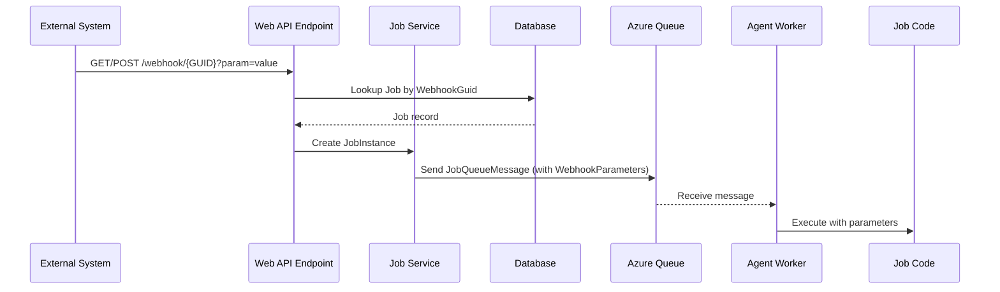

# Webhook Feature Implementation Plan

## Overview

This document outlines the implementation plan for enabling webhook functionality in Blazor Data Orchestrator. The feature allows jobs to be triggered via HTTP endpoints using unique GUIDs, enabling external systems to initiate job execution.

## Feature Summary

- Add a **Webhook** tab to the Job Edit dialog (JobDetailsDialog.razor)
- Enable/disable webhooks using a slider toggle
- Generate unique GUIDs for webhook identification
- Expose HTTP endpoints at `/webhook/{GUID}?{webAPIParameter}`
- Queue jobs when webhook endpoints are called
- Pass webhook parameters to executing code

---

## Architecture Diagram



---

## Implementation Tasks

### 1. Database Changes

#### 1.1 Verify WebhookGuid Field Exists
**File:** `src/BlazorDataOrchestrator.Core/Data/Job.cs`

The `WebhookGuid` field already exists in the Job entity:
```csharp
public string WebhookGuid { get; set; }
```

**Status:** ✅ Already exists - no changes needed

---

### 2. Update JobQueueMessage Model

**File:** `src/BlazorDataOrchestrator.Core/Models/JobQueueMessage.cs`

Add a new property to carry webhook parameters:

```csharp
/// <summary>
/// Optional webhook parameters passed when the job is triggered via webhook.
/// Contains the query string or request body from the webhook call.
/// </summary>
public string? WebhookParameters { get; set; }
```

---

### 3. Add Webhook Service

**File:** `src/BlazorOrchestrator.Web/Services/WebhookService.cs` (New)

Create a new service to handle webhook operations:

```csharp
using BlazorOrchestrator.Web.Data.Data;
using Microsoft.EntityFrameworkCore;

namespace BlazorOrchestrator.Web.Services;

public class WebhookService
{
    private readonly ApplicationDbContext _dbContext;
    private readonly ILogger<WebhookService> _logger;

    public WebhookService(ApplicationDbContext dbContext, ILogger<WebhookService> logger)
    {
        _dbContext = dbContext;
        _logger = logger;
    }

    /// <summary>
    /// Enables webhook for a job by generating a unique GUID.
    /// </summary>
    public async Task<string> EnableWebhookAsync(int jobId)
    {
        var job = await _dbContext.Jobs.FindAsync(jobId);
        if (job == null)
            throw new InvalidOperationException($"Job {jobId} not found");

        job.WebhookGuid = Guid.NewGuid().ToString();
        job.UpdatedDate = DateTime.UtcNow;
        job.UpdatedBy = "System";
        await _dbContext.SaveChangesAsync();
        
        _logger.LogInformation("Enabled webhook for job {JobId} with GUID {WebhookGuid}", jobId, job.WebhookGuid);
        return job.WebhookGuid;
    }

    /// <summary>
    /// Disables webhook for a job by clearing the GUID.
    /// </summary>
    public async Task DisableWebhookAsync(int jobId)
    {
        var job = await _dbContext.Jobs.FindAsync(jobId);
        if (job == null)
            throw new InvalidOperationException($"Job {jobId} not found");

        var oldGuid = job.WebhookGuid;
        job.WebhookGuid = null;
        job.UpdatedDate = DateTime.UtcNow;
        job.UpdatedBy = "System";
        await _dbContext.SaveChangesAsync();
        
        _logger.LogInformation("Disabled webhook for job {JobId} (removed GUID {WebhookGuid})", jobId, oldGuid);
    }

    /// <summary>
    /// Gets a job by its webhook GUID.
    /// </summary>
    public async Task<Job?> GetJobByWebhookGuidAsync(string webhookGuid)
    {
        return await _dbContext.Jobs
            .Include(j => j.JobSchedules)
            .Include(j => j.JobQueueNavigation)
            .FirstOrDefaultAsync(j => j.WebhookGuid == webhookGuid && j.JobEnabled);
    }
}
```

---

### 4. Add Webhook Controller/Endpoint

**File:** `src/BlazorOrchestrator.Web/Controllers/WebhookController.cs` (New)

Create a minimal API endpoint to handle webhook calls:

```csharp
using BlazorOrchestrator.Web.Services;
using BlazorDataOrchestrator.Core;
using Microsoft.AspNetCore.Mvc;

namespace BlazorOrchestrator.Web.Controllers;

[ApiController]
[Route("webhook")]
public class WebhookController : ControllerBase
{
    private readonly WebhookService _webhookService;
    private readonly JobManager _jobManager;
    private readonly ILogger<WebhookController> _logger;

    public WebhookController(
        WebhookService webhookService,
        JobManager jobManager,
        ILogger<WebhookController> logger)
    {
        _webhookService = webhookService;
        _jobManager = jobManager;
        _logger = logger;
    }

    /// <summary>
    /// Webhook endpoint to trigger a job execution.
    /// GET or POST /webhook/{guid}?webAPIParameter=value
    /// </summary>
    [HttpGet("{guid}")]
    [HttpPost("{guid}")]
    public async Task<IActionResult> TriggerJob(string guid)
    {
        try
        {
            _logger.LogInformation("Webhook triggered for GUID: {WebhookGuid}", guid);

            // Get the job by webhook GUID
            var job = await _webhookService.GetJobByWebhookGuidAsync(guid);
            if (job == null)
            {
                _logger.LogWarning("Webhook GUID not found or job disabled: {WebhookGuid}", guid);
                return NotFound(new { error = "Webhook not found or job is disabled" });
            }

            // Capture query string parameters
            var webhookParameters = Request.QueryString.HasValue 
                ? Request.QueryString.Value?.TrimStart('?') 
                : null;

            // For POST requests, also capture body if present
            if (HttpContext.Request.Method == "POST" && Request.ContentLength > 0)
            {
                using var reader = new StreamReader(Request.Body);
                var body = await reader.ReadToEndAsync();
                if (!string.IsNullOrEmpty(body))
                {
                    webhookParameters = string.IsNullOrEmpty(webhookParameters) 
                        ? body 
                        : $"{webhookParameters}&__body__={Uri.EscapeDataString(body)}";
                }
            }

            _logger.LogInformation("Running job {JobId} via webhook with parameters: {Parameters}", 
                job.Id, webhookParameters ?? "(none)");

            // Trigger job execution with webhook parameters
            var jobInstanceId = await _jobManager.RunJobNowWithWebhookAsync(job.Id, webhookParameters);

            return Ok(new 
            { 
                success = true,
                jobId = job.Id,
                jobInstanceId = jobInstanceId,
                message = $"Job '{job.JobName}' queued for execution"
            });
        }
        catch (Exception ex)
        {
            _logger.LogError(ex, "Error processing webhook for GUID: {WebhookGuid}", guid);
            return StatusCode(500, new { error = "Internal server error", message = ex.Message });
        }
    }
}
```

---

### 5. Update JobManager

**File:** `src/BlazorDataOrchestrator.Core/JobManager.cs`

Add a new method to run jobs with webhook parameters:

```csharp
/// <summary>
/// Runs a job immediately via webhook trigger, passing webhook parameters to the queue message.
/// </summary>
/// <param name="jobId">The job ID to run</param>
/// <param name="webhookParameters">Optional parameters passed via webhook query string or body</param>
/// <returns>The created job instance ID</returns>
public async Task<int> RunJobNowWithWebhookAsync(int jobId, string? webhookParameters)
{
    using var context = CreateDbContext();
    var job = await context.Jobs
        .Include(j => j.JobSchedules)
        .Include(j => j.JobQueueNavigation)
        .FirstOrDefaultAsync(j => j.Id == jobId);

    if (job == null)
    {
        throw new InvalidOperationException($"Job {jobId} not found.");
    }

    if (!job.JobEnabled)
    {
        throw new InvalidOperationException($"Job {jobId} is disabled.");
    }

    await LogAsync("WebhookTrigger", $"Webhook triggered for Job {job.JobName}", jobId: jobId);

    // Get or create a default schedule for webhook-triggered runs
    var schedule = job.JobSchedules.FirstOrDefault()
        ?? await CreateWebhookScheduleAsync(context, job);

    // Create job instance
    var instance = new JobInstance
    {
        JobScheduleId = schedule.Id,
        InProcess = false,
        HasError = false,
        CreatedDate = DateTime.UtcNow,
        CreatedBy = "Webhook"
    };
    context.JobInstances.Add(instance);
    await context.SaveChangesAsync();

    await LogAsync("WebhookTrigger", $"Created JobInstance {instance.Id}", jobId: jobId, jobInstanceId: instance.Id);

    // Determine target queue name
    var targetQueueName = job.JobQueueNavigation?.QueueName ?? "default";

    // Get or create the target queue client
    var queueServiceClient = new QueueServiceClient(_queueConnectionString);
    var targetQueueClient = queueServiceClient.GetQueueClient(targetQueueName);
    await targetQueueClient.CreateIfNotExistsAsync();

    // Create and send queue message with webhook parameters
    var queueMessage = new JobQueueMessage
    {
        JobInstanceId = instance.Id,
        JobId = jobId,
        QueuedAt = DateTime.UtcNow,
        JobEnvironment = job.JobEnvironment,
        JobQueueName = targetQueueName,
        WebhookParameters = webhookParameters
    };

    var messageJson = JsonSerializer.Serialize(queueMessage);
    var messageBytes = System.Text.Encoding.UTF8.GetBytes(messageJson);
    var base64Message = Convert.ToBase64String(messageBytes);

    await targetQueueClient.SendMessageAsync(base64Message);

    await LogAsync("WebhookTrigger", $"Queue message sent with webhook parameters", jobId: jobId, jobInstanceId: instance.Id);
    return instance.Id;
}

private async Task<JobSchedule> CreateWebhookScheduleAsync(ApplicationDbContext context, Job job)
{
    var schedule = new JobSchedule
    {
        JobId = job.Id,
        ScheduleName = "Webhook Trigger",
        Enabled = true,
        InProcess = false,
        HadError = false,
        Monday = true,
        Tuesday = true,
        Wednesday = true,
        Thursday = true,
        Friday = true,
        Saturday = true,
        Sunday = true,
        StartTime = 0,
        StopTime = 23,
        CreatedDate = DateTime.UtcNow,
        CreatedBy = "System"
    };
    context.JobSchedules.Add(schedule);
    await context.SaveChangesAsync();
    return schedule;
}
```

---

### 6. Update Agent Worker

**File:** `src/BlazorOrchestrator.Agent/Worker.cs`

Update to pass webhook parameters to the code executor:

In the message processing section, extract and pass webhook parameters:

```csharp
// After deserializing queueMessage, log webhook parameters if present
if (!string.IsNullOrEmpty(queueMessage.WebhookParameters))
{
    _logger.LogInformation("Job triggered via webhook with parameters: {WebhookParameters}", 
        queueMessage.WebhookParameters);
}

// Update ProcessJobInstanceAsync call to pass webhook parameters
await _jobManager.ProcessJobInstanceAsync(
    queueMessage.JobInstanceId,
    _packageProcessor,
    _codeExecutor,
    _agentId,
    queueMessage.JobEnvironment,
    queueMessage.WebhookParameters);  // Add this parameter
```

---

### 7. Update ProcessJobInstanceAsync

**File:** `src/BlazorDataOrchestrator.Core/JobManager.cs`

Update the method signature and pass webhook parameters to the code executor:

```csharp
public async Task ProcessJobInstanceAsync(
    int jobInstanceId,
    PackageProcessorService packageProcessor,
    CodeExecutorService codeExecutor,
    string? agentId = null,
    string? jobEnvironment = null,
    string? webhookParameters = null)  // Add this parameter
{
    // ... existing code ...
    
    // When calling the code executor, pass the webhook parameters
    // This will be available to the executing code via environment or parameters
}
```

---

### 8. Update CodeExecutorService

**File:** `src/BlazorDataOrchestrator.Core/Services/CodeExecutorService.cs`

Update to accept and pass webhook parameters to the executed code:

```csharp
/// <summary>
/// Executes the job code with optional webhook parameters.
/// </summary>
public async Task<bool> ExecuteAsync(
    string extractPath,
    Dictionary<string, object> jobParameters,
    string? environment = null,
    string? webhookParameters = null)  // Add this parameter
{
    // Parse webhook parameters and add to job parameters
    if (!string.IsNullOrEmpty(webhookParameters))
    {
        var webhookDict = ParseWebhookParameters(webhookParameters);
        jobParameters["WebhookParameters"] = webhookDict;
        jobParameters["RawWebhookParameters"] = webhookParameters;
    }
    
    // ... continue with execution ...
}

private Dictionary<string, string> ParseWebhookParameters(string parameters)
{
    var result = new Dictionary<string, string>();
    var pairs = parameters.Split('&', StringSplitOptions.RemoveEmptyEntries);
    foreach (var pair in pairs)
    {
        var keyValue = pair.Split('=', 2);
        if (keyValue.Length == 2)
        {
            result[Uri.UnescapeDataString(keyValue[0])] = Uri.UnescapeDataString(keyValue[1]);
        }
        else if (keyValue.Length == 1)
        {
            result[Uri.UnescapeDataString(keyValue[0])] = string.Empty;
        }
    }
    return result;
}
```

---

### 9. Add Webhook Tab to Job Details Dialog

**File:** `src/BlazorOrchestrator.Web/Components/Pages/Dialogs/JobDetailsDialog.razor`

Add a new tab for webhook configuration after the existing tabs:

```razor
<RadzenTabsItem Text="Webhook" Icon="link">
    @* Webhook Tab Content *@
    <RadzenStack Gap="1rem" Style="padding: 1rem 0;">
        <RadzenStack Orientation="Orientation.Horizontal" Gap="1rem" AlignItems="AlignItems.Center">
            <RadzenLabel Text="Enable Webhook" Style="font-weight: 500;" />
            <RadzenSwitch @bind-Value="@IsWebhookEnabled" Change="@OnWebhookToggle" />
        </RadzenStack>

        @if (IsWebhookEnabled && !string.IsNullOrEmpty(Job.WebhookGuid))
        {
            <RadzenStack Gap="0.5rem">
                <RadzenText TextStyle="TextStyle.Subtitle2" Style="font-weight: 600;">Webhook URL</RadzenText>
                <RadzenStack Orientation="Orientation.Horizontal" Gap="0.5rem" AlignItems="AlignItems.Center">
                    <RadzenTextBox Value="@WebhookUrl" ReadOnly="true" Style="width: 100%; font-family: monospace;" />
                    <RadzenButton Icon="content_copy" ButtonStyle="ButtonStyle.Light" Size="ButtonSize.Small"
                                  Click="@CopyWebhookUrl" title="Copy to clipboard" />
                </RadzenStack>
                <RadzenText TextStyle="TextStyle.Caption" Style="color: #6b7280;">
                    Use this URL to trigger the job from external systems. Query parameters will be passed to the job.
                </RadzenText>
            </RadzenStack>

            <RadzenStack Gap="0.5rem">
                <RadzenText TextStyle="TextStyle.Subtitle2" Style="font-weight: 600;">Example Usage</RadzenText>
                <RadzenText TextStyle="TextStyle.Caption" Style="font-family: monospace; background: #f1f5f9; padding: 0.75rem; border-radius: 4px; white-space: pre-wrap;">
GET @WebhookUrl?webAPIParameter=value

POST @WebhookUrl
Content-Type: application/json
{"key": "value"}
                </RadzenText>
            </RadzenStack>

            <RadzenStack Gap="0.5rem">
                <RadzenText TextStyle="TextStyle.Subtitle2" Style="font-weight: 600;">Webhook GUID</RadzenText>
                <RadzenText TextStyle="TextStyle.Body2" Style="font-family: monospace; background: #f1f5f9; padding: 0.5rem; border-radius: 4px;">
                    @Job.WebhookGuid
                </RadzenText>
            </RadzenStack>
        }
        else if (!IsWebhookEnabled)
        {
            <RadzenAlert AlertStyle="AlertStyle.Info" Shade="Shade.Lighter" AllowClose="false">
                Enable the webhook to generate a unique URL for triggering this job from external systems.
            </RadzenAlert>
        }
    </RadzenStack>
</RadzenTabsItem>
```

Add the code-behind logic:

```csharp
@inject WebhookService WebhookService
@inject IJSRuntime JSRuntime
@inject NavigationManager NavigationManager

// In @code section:
private bool IsWebhookEnabled => !string.IsNullOrEmpty(Job?.WebhookGuid);
private string WebhookUrl => $"{NavigationManager.BaseUri}webhook/{Job?.WebhookGuid}";

private async Task OnWebhookToggle(bool enabled)
{
    if (Job == null) return;

    if (enabled)
    {
        // Enable webhook - generate new GUID
        try
        {
            var guid = await WebhookService.EnableWebhookAsync(Job.Id);
            Job.WebhookGuid = guid;
            NotificationService.Notify(NotificationSeverity.Success, "Webhook Enabled", 
                "A new webhook URL has been generated.");
        }
        catch (Exception ex)
        {
            NotificationService.Notify(NotificationSeverity.Error, "Error", 
                $"Failed to enable webhook: {ex.Message}");
        }
    }
    else
    {
        // Disable webhook - show confirmation if GUID exists
        if (!string.IsNullOrEmpty(Job.WebhookGuid))
        {
            var confirmed = await DialogService.Confirm(
                "Are you sure you want to disable the webhook? The unique GUID will be deleted and any integrations using this webhook URL will stop working.",
                "Disable Webhook",
                new ConfirmOptions 
                { 
                    OkButtonText = "Disable", 
                    CancelButtonText = "Cancel" 
                });

            if (confirmed == true)
            {
                try
                {
                    await WebhookService.DisableWebhookAsync(Job.Id);
                    Job.WebhookGuid = null;
                    NotificationService.Notify(NotificationSeverity.Warning, "Webhook Disabled", 
                        "The webhook has been disabled and the GUID has been deleted.");
                }
                catch (Exception ex)
                {
                    NotificationService.Notify(NotificationSeverity.Error, "Error", 
                        $"Failed to disable webhook: {ex.Message}");
                }
            }
        }
    }
    StateHasChanged();
}

private async Task CopyWebhookUrl()
{
    await JSRuntime.InvokeVoidAsync("navigator.clipboard.writeText", WebhookUrl);
    NotificationService.Notify(NotificationSeverity.Info, "Copied", "Webhook URL copied to clipboard.");
}
```

---

### 10. Register Services in Program.cs

**File:** `src/BlazorOrchestrator.Web/Program.cs`

Add the webhook service registration and controller setup:

```csharp
// Add controllers for webhook API
builder.Services.AddControllers();

// Register webhook service
builder.Services.AddScoped<WebhookService>();

// After app.Build(), add:
app.MapControllers();
```

---

## Implementation Order

1. **Update JobQueueMessage Model** (Core) - Add WebhookParameters property
2. **Create WebhookService** (Web) - New service for webhook operations
3. **Create WebhookController** (Web) - New API endpoint
4. **Update JobManager** (Core) - Add RunJobNowWithWebhookAsync method
5. **Update ProcessJobInstanceAsync** (Core) - Add webhookParameters parameter
6. **Update CodeExecutorService** (Core) - Pass parameters to executed code
7. **Update Agent Worker** (Agent) - Extract and pass webhook parameters
8. **Update JobDetailsDialog** (Web) - Add Webhook tab UI
9. **Update Program.cs** (Web) - Register services and controllers
10. **Test end-to-end** - Verify webhook functionality

---

## Files to Create/Modify Summary

| Status | File | Change Type |
|--------|------|-------------|
| 📝 | `src/BlazorDataOrchestrator.Core/Models/JobQueueMessage.cs` | Add WebhookParameters property |
| ➕ | `src/BlazorOrchestrator.Web/Services/WebhookService.cs` | New file |
| ➕ | `src/BlazorOrchestrator.Web/Controllers/WebhookController.cs` | New file |
| 📝 | `src/BlazorDataOrchestrator.Core/JobManager.cs` | Add RunJobNowWithWebhookAsync method |
| 📝 | `src/BlazorDataOrchestrator.Core/Services/CodeExecutorService.cs` | Add webhook parameter handling |
| 📝 | `src/BlazorOrchestrator.Agent/Worker.cs` | Pass webhook parameters |
| 📝 | `src/BlazorOrchestrator.Web/Components/Pages/Dialogs/JobDetailsDialog.razor` | Add Webhook tab |
| 📝 | `src/BlazorOrchestrator.Web/Program.cs` | Register services and controllers |

---

## Security Considerations

1. **GUID Security**: The webhook GUID acts as an authentication token. Consider:
   - Using longer GUIDs or combining with additional secret
   - Rate limiting webhook endpoints
   - Logging webhook access for auditing

2. **Input Validation**: Sanitize webhook parameters before passing to job execution

3. **Job Enabled Check**: Only enabled jobs can be triggered via webhook

4. **HTTPS Only**: Ensure webhooks are only accessible over HTTPS in production

---

## Testing Plan

1. **Unit Tests**
   - WebhookService: Enable/disable/lookup operations
   - JobManager: RunJobNowWithWebhookAsync method
   - Parameter parsing

2. **Integration Tests**
   - Webhook endpoint returns correct response
   - Job is queued when webhook is called
   - Parameters are passed through the pipeline

3. **Manual Testing**
   - Enable webhook via UI
   - Copy URL and test in browser/Postman
   - Verify job runs with parameters
   - Disable webhook and verify URL no longer works

---

## Future Enhancements

- Webhook authentication (API keys, signatures)
- Webhook request logging/history
- Retry configuration for failed webhooks
- Webhook response customization
- Support for different content types (JSON, XML, form-data)
