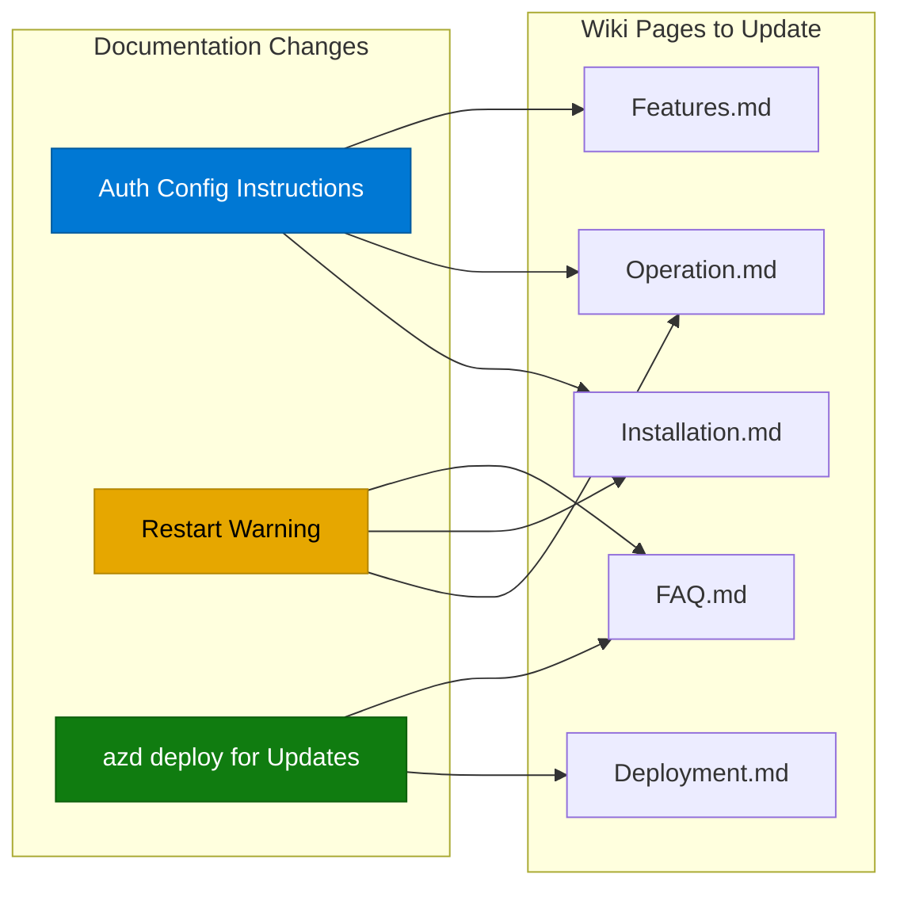
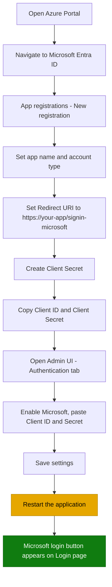
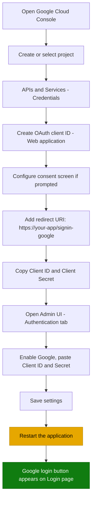
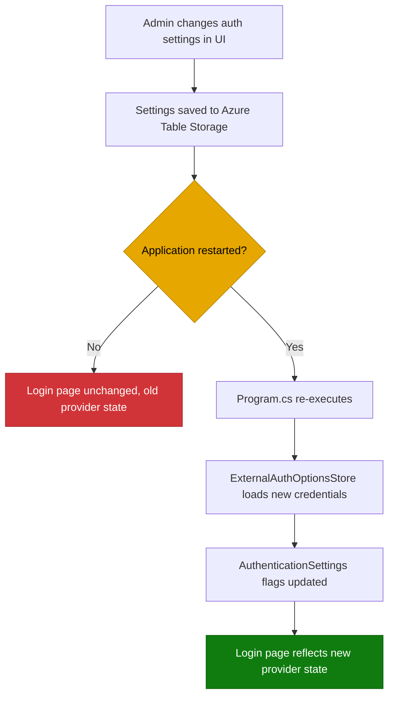
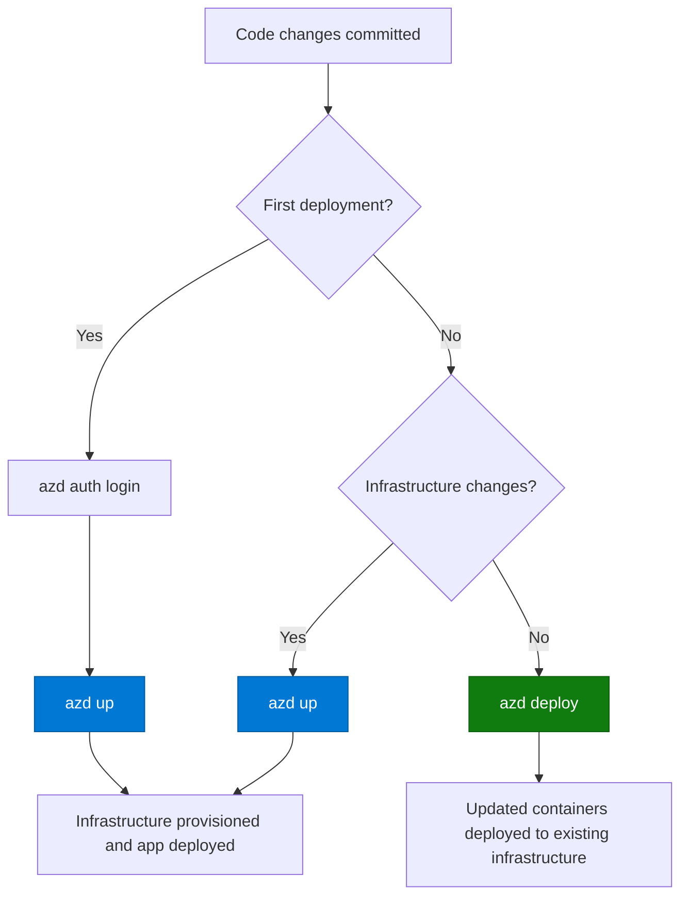
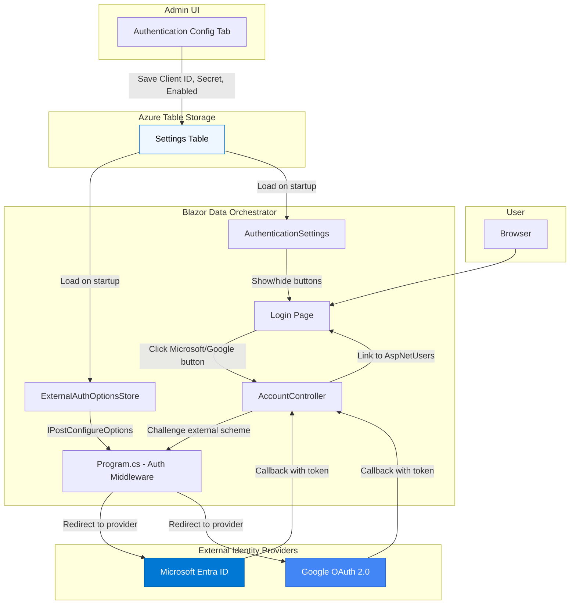

# Wiki Content Documentation Update Plan

This plan covers three documentation updates to the existing wiki-content pages:

1. **Microsoft and Google Authentication configuration instructions**
2. **App restart requirement when changing Authentication providers**
3. **`azd deploy` as the recommended method for updates**

---

## Table of Contents

- [Overview](#overview)
- [1. Authentication Provider Configuration Instructions](#1-authentication-provider-configuration-instructions)
  - [1.1 Target Wiki Pages](#11-target-wiki-pages)
  - [1.2 Microsoft Authentication Setup](#12-microsoft-authentication-setup)
  - [1.3 Google Authentication Setup](#13-google-authentication-setup)
  - [1.4 Admin UI Configuration](#14-admin-ui-configuration)
  - [1.5 Azure Container Apps Redirect URIs](#15-azure-container-apps-redirect-uris)
- [2. App Restart Requirement for Authentication Changes](#2-app-restart-requirement-for-authentication-changes)
  - [2.1 Target Wiki Pages](#21-target-wiki-pages)
  - [2.2 Content to Add](#22-content-to-add)
- [3. AZD Deploy for Updates](#3-azd-deploy-for-updates)
  - [3.1 Target Wiki Pages](#31-target-wiki-pages)
  - [3.2 Content Changes](#32-content-changes)
- [System Architecture Diagram](#system-architecture-diagram)
- [Implementation Checklist](#implementation-checklist)

---

## Overview

The Blazor Data Orchestrator currently supports optional Microsoft and Google OAuth 2.0 / OpenID Connect authentication. The implementation is already in place in the codebase:

- `AuthSettingKeys.cs` defines six keys: `Authentication:{Microsoft|Google}:{ClientId|ClientSecret|Enabled}`
- `Program.cs` registers both Microsoft and Google authentication schemes with placeholder credentials
- `ExternalAuthOptionsStore` injects real credentials at runtime via `IPostConfigureOptions`
- Authentication settings are stored in Azure Table Storage and managed through the Admin UI
- External logins link to existing `AspNetUsers` records — they never auto-create accounts

The wiki-content pages need to document how users configure these providers, the restart requirement, and the recommended upgrade workflow using `azd deploy`.



---

## 1. Authentication Provider Configuration Instructions

### 1.1 Target Wiki Pages

| Wiki Page | Section | Action |
|-----------|---------|--------|
| `Installation.md` | After "Install Wizard" section | Add new section: "Configure External Authentication (Optional)" |
| `Operation.md` | Under "Administration" section | Add subsection: "External Authentication Providers" |
| `Features.md` | After "Webhook Triggers" or at end of feature list | Add feature entry: "External Authentication (Microsoft & Google)" |
| `Frequently-Asked-Questions.md` | Under "Installation" or new "Authentication" section | Add Q&A entries for auth setup |

### 1.2 Microsoft Authentication Setup

Add the following content to `Installation.md` as a new section after the Install Wizard steps, and to `Operation.md` under Administration.

#### Content: Azure Portal App Registration

The documentation must walk the user through the following steps with enough detail to complete them independently:

**Step 1 — Register an Application in Azure Entra ID (formerly Azure AD)**

1. Navigate to the [Azure Portal](https://portal.azure.com) and go to **Microsoft Entra ID** > **App registrations** > **New registration**
2. Set the application name (e.g., `BlazorDataOrchestrator`)
3. Set **Supported account types** to the appropriate scope:
   - *Single tenant* — only users in your Azure AD directory
   - *Multitenant* — users from any Azure AD directory
   - *Multitenant + personal Microsoft accounts* — broadest scope
4. Set the **Redirect URI**:
   - Type: **Web**
   - URI: `https://<your-app-url>/signin-microsoft`
   - For local development: `https://localhost:<port>/signin-microsoft`

**Step 2 — Create a Client Secret**

1. Go to **Certificates & secrets** > **Client secrets** > **New client secret**
2. Set a description and expiration period
3. Copy the **Value** immediately (it is shown only once)

**Step 3 — Copy the Application (Client) ID**

1. Go to the app registration **Overview** page
2. Copy the **Application (client) ID**

**Step 4 — Enter Credentials in the Admin UI**

1. In Blazor Data Orchestrator, go to **Administration** > **Authentication**
2. Enable **Microsoft Authentication**
3. Paste the **Client ID** and **Client Secret**
4. Save the settings
5. **Restart the application** (see [Section 2](#2-app-restart-requirement-for-authentication-changes))



### 1.3 Google Authentication Setup

#### Content: Google Cloud Console Configuration

**Step 1 — Create OAuth 2.0 Credentials in Google Cloud Console**

1. Navigate to [Google Cloud Console](https://console.cloud.google.com/)
2. Create a new project or select an existing one
3. Go to **APIs & Services** > **Credentials** > **Create Credentials** > **OAuth client ID**
4. Configure the **OAuth consent screen** if prompted:
   - Set app name, support email, and authorized domains
   - Add scopes: `openid`, `email`, `profile`
5. Set **Application type** to **Web application**
6. Add **Authorized redirect URIs**:
   - `https://<your-app-url>/signin-google`
   - For local development: `https://localhost:<port>/signin-google`

**Step 2 — Copy Credentials**

1. Copy the **Client ID** and **Client Secret** from the credentials page

**Step 3 — Enter Credentials in the Admin UI**

1. In Blazor Data Orchestrator, go to **Administration** > **Authentication**
2. Enable **Google Authentication**
3. Paste the **Client ID** and **Client Secret**
4. Save the settings
5. **Restart the application** (see [Section 2](#2-app-restart-requirement-for-authentication-changes))



### 1.4 Admin UI Configuration

Add the following reference table to `Operation.md` under a new **External Authentication Providers** subsection within Administration:

| Setting | Storage Key | Description |
|---------|-------------|-------------|
| Microsoft Enabled | `Authentication:Microsoft:Enabled` | Toggles Microsoft login button on the Login page |
| Microsoft Client ID | `Authentication:Microsoft:ClientId` | Application (client) ID from Azure Entra ID |
| Microsoft Client Secret | `Authentication:Microsoft:ClientSecret` | Client secret value from Azure Entra ID |
| Google Enabled | `Authentication:Google:Enabled` | Toggles Google login button on the Login page |
| Google Client ID | `Authentication:Google:ClientId` | OAuth 2.0 Client ID from Google Cloud Console |
| Google Client Secret | `Authentication:Google:ClientSecret` | OAuth 2.0 Client Secret from Google Cloud Console |

> **Important:** These settings are stored in Azure Table Storage, not in `appsettings.json`. They are managed exclusively through the Admin UI.

### 1.5 Azure Container Apps Redirect URIs

Add a note to `Deployment.md` in the Production Configuration section:

When deploying to Azure Container Apps, the redirect URIs must use the Container App's FQDN:

| Provider | Redirect URI Pattern |
|----------|---------------------|
| Microsoft | `https://<container-app-fqdn>/signin-microsoft` |
| Google | `https://<container-app-fqdn>/signin-google` |

The FQDN is assigned by Azure Container Apps after deployment. Retrieve it from the Azure Portal or via:

```bash
az containerapp show --name <webapp-name> --resource-group <rg-name> --query properties.configuration.ingress.fqdn -o tsv
```

If using a custom domain, use that domain in the redirect URIs instead.

---

## 2. App Restart Requirement for Authentication Changes

### 2.1 Target Wiki Pages

| Wiki Page | Location | Action |
|-----------|----------|--------|
| `Installation.md` | Inside new "Configure External Authentication" section | Add warning callout |
| `Operation.md` | Inside "External Authentication Providers" subsection | Add warning callout and explanation |
| `Frequently-Asked-Questions.md` | New Q&A entry | Add troubleshooting question |

### 2.2 Content to Add

#### Why a Restart Is Required

The authentication middleware in ASP.NET Core is configured during application startup in `Program.cs`. Microsoft and Google authentication schemes are registered with placeholder credentials at startup. The `ExternalAuthOptionsStore` injects real credentials via `IPostConfigureOptions`, but certain changes — particularly enabling or disabling a provider — require the authentication pipeline to be fully re-initialized, which only happens on application restart.

#### Warning Callout (for Installation.md and Operation.md)

Add the following blockquote/warning in both pages wherever auth configuration is discussed:

> **Warning: Application Restart Required**
>
> After enabling, disabling, or changing the Client ID / Client Secret for any external authentication provider (Microsoft or Google), you **must restart the application** for the changes to take effect.
>
> - **Local development:** Stop and re-run `aspire run`
> - **Azure Container Apps:** Restart the Container App via the Azure Portal, Azure CLI, or redeploy using `azd deploy`
>
> The Login page will not show or hide provider buttons until the restart is complete.

#### FAQ Entry (for Frequently-Asked-Questions.md)

Add under a new **Authentication** heading or under the existing **Troubleshooting** section:

**Q: I configured Microsoft/Google authentication but the login buttons do not appear.**

A: After changing any authentication settings in the Admin UI, you must restart the application. Authentication middleware is initialized at startup, and changes are not picked up at runtime. For local development, stop and re-run `aspire run`. For Azure, restart the Container App or redeploy with `azd deploy`.



---

## 3. AZD Deploy for Updates

### 3.1 Target Wiki Pages

| Wiki Page | Location | Action |
|-----------|----------|--------|
| `Deployment.md` | Replace/update the "Upgrade" subsection | Replace Visual Studio publish with `azd deploy` as primary method |
| `Features.md` | "One-command deployment" bullet | Mention `azd deploy` for updates alongside `azd up` for initial |
| `Frequently-Asked-Questions.md` | Under "General" or "Operations" | Add Q&A about updating a deployed instance |
| `Home.md` | Quick Start section | Add a note about `azd deploy` for subsequent updates |

### 3.2 Content Changes

#### Deployment.md — Replace the "Upgrade" Subsection

Replace the current "Upgrade" subsection (which references Visual Studio right-click publish) with:

---

**Updating a Deployed Instance**

After the initial deployment with `azd up`, use `azd deploy` for all subsequent updates. This rebuilds and redeploys all services without re-provisioning infrastructure.

From the AppHost directory, run:

```bash
azd deploy
```

This command:
1. Builds all projects (Web, Scheduler, Agent)
2. Containerizes the services
3. Pushes updated images to Azure Container Registry
4. Deploys updated containers to Azure Container Apps

**When to use each command:**

| Command | Use When |
|---------|----------|
| `azd up` | First-time deployment (provisions infrastructure + deploys) |
| `azd deploy` | Updating an existing deployment with code or configuration changes |
| `azd provision` | Updating only infrastructure (e.g., adding new Azure resources) |

> **Note:** If you have changed the Aspire AppHost topology (added or removed services/resources in `Program.cs`), run `azd up` instead to ensure infrastructure is updated.

**Deploying a single service:**

To deploy only one service (e.g., after a change to only the web app):

```bash
azd deploy webapp
```

Service names match those defined in the AppHost: `webapp`, `scheduler`, `agent`.

---

#### Deployment.md — Keep Visual Studio as Alternative

Keep the existing Visual Studio publish screenshot but reframe it as an alternative:

> **Alternative: Visual Studio Publish**
>
> You can also publish from Visual Studio by right-clicking the AppHost project and selecting **Publish**. However, `azd deploy` is the recommended approach as it is scriptable, repeatable, and consistent with the initial deployment workflow.

#### Update Flowchart for Deployment Lifecycle

Add this diagram to `Deployment.md` after the updated Upgrade section:



#### Features.md — Update Deployment Bullet

Change the existing "One-command deployment (`azd up`)" bullet to:

> - **One-command deployment** — `azd up` for initial deployment; `azd deploy` for subsequent updates. Both commands handle build, containerization, and deployment automatically.

#### FAQ Entry

Add under **Operations** or **General**:

**Q: How do I update my deployed instance after making code changes?**

A: Run `azd deploy` from the AppHost directory. This rebuilds all services, pushes updated container images, and deploys them to Azure Container Apps without re-provisioning infrastructure. Use `azd up` only for the initial deployment or when the AppHost topology has changed.

**Q: Can I deploy just one service instead of all three?**

A: Yes. Run `azd deploy <service-name>` where the service name is `webapp`, `scheduler`, or `agent`. This deploys only the specified service.

---

## System Architecture Diagram

This diagram shows the full authentication flow and how external providers integrate with the existing system:



---

## Implementation Checklist

Each item below is a discrete edit to a wiki-content Markdown file. A developer can work through these sequentially.

| # | Wiki File | Change Description | Section Reference |
|---|-----------|-------------------|-------------------|
| 1 | `Features.md` | Add "External Authentication (Microsoft & Google)" feature entry | [1.1](#11-target-wiki-pages) |
| 2 | `Features.md` | Update deployment bullet to mention `azd deploy` for updates | [3.2](#32-content-changes) |
| 3 | `Installation.md` | Add "Configure External Authentication (Optional)" section after Install Wizard | [1.2](#12-microsoft-authentication-setup), [1.3](#13-google-authentication-setup) |
| 4 | `Installation.md` | Add restart warning callout inside auth section | [2.2](#22-content-to-add) |
| 5 | `Operation.md` | Add "External Authentication Providers" subsection under Administration | [1.4](#14-admin-ui-configuration) |
| 6 | `Operation.md` | Add restart warning callout inside auth subsection | [2.2](#22-content-to-add) |
| 7 | `Deployment.md` | Replace "Upgrade" subsection with `azd deploy` instructions | [3.2](#32-content-changes) |
| 8 | `Deployment.md` | Add redirect URI table for Azure Container Apps | [1.5](#15-azure-container-apps-redirect-uris) |
| 9 | `Deployment.md` | Reframe Visual Studio publish as alternative | [3.2](#32-content-changes) |
| 10 | `Deployment.md` | Add deployment lifecycle flowchart | [3.2](#32-content-changes) |
| 11 | `Frequently-Asked-Questions.md` | Add Authentication section with restart troubleshooting Q&A | [2.2](#22-content-to-add) |
| 12 | `Frequently-Asked-Questions.md` | Add `azd deploy` update Q&A entries | [3.2](#32-content-changes) |
| 13 | `Home.md` | Add note about `azd deploy` for subsequent updates in Quick Start | [3.1](#31-target-wiki-pages) |
