# Implementation Plan: Wiki Content Documentation Update

## Overview

The `wiki-content/` directory contains stub pages for the [Blazor Data Orchestrator Wiki](https://github.com/Blazor-Data-Orchestrator/BlazorDataOrchestrator/wiki). All pages currently have placeholder text `(Content to be added)`. This plan details populating each wiki page with accurate, comprehensive help documentation derived from the application source code, architecture, and existing feature documentation in the `docs/` folder.

Changes to files in `wiki-content/` are automatically synchronized to the GitHub wiki via the `update-wiki.yml` GitHub Action workflow.

---

## Current State Assessment

| Wiki Page | Current State | Target State |
|-----------|--------------|--------------|
| `Home.md` | Navigation links only | Navigation + overview + quick-start |
| `Features.md` | Stub | Full feature catalogue with descriptions |
| `Requirements.md` | Stub | System prerequisites & infrastructure |
| `Installation.md` | Stub | Step-by-step install/setup guide |
| `Operation.md` | Stub | Day-to-day operational guide |
| `Deployment.md` | Stub | Azure deployment instructions |
| `Job-Development.md` | Stub | Job development overview |
| `Online.md` | Stub | Online code editor guide |
| `Visual-Studio.md` | Screenshots only | Full VS development walkthrough |
| `Frequently-Asked-Questions.md` | Stub | Common Q&A from codebase patterns |

---

## System Architecture Reference

The following diagram represents the overall system architecture that documentation should reference:

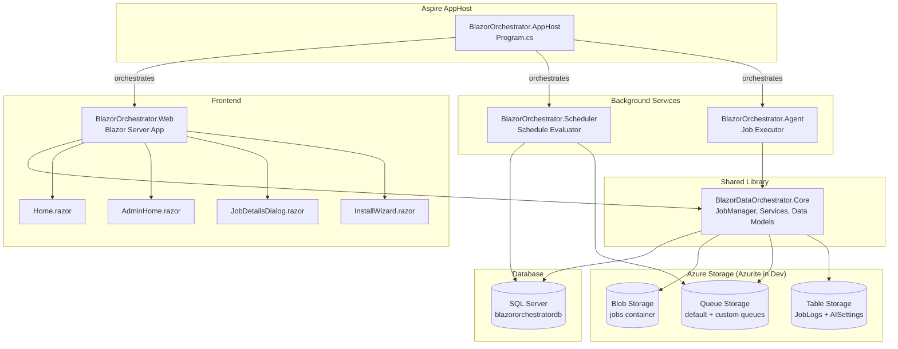

---

## Content Source Mapping

Each wiki page draws content from specific code and doc sources:

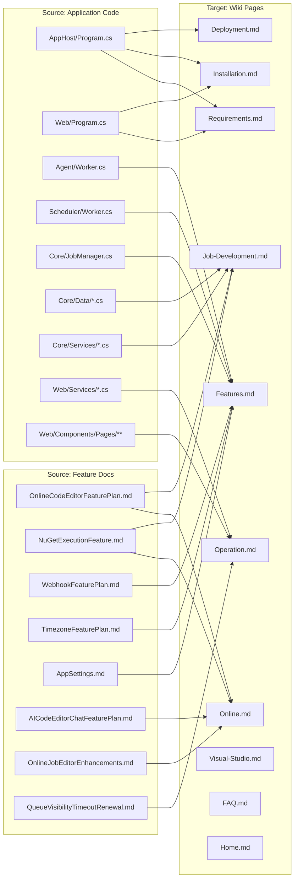

---

## Detailed Page Plans

### 1. Home.md

**Purpose:** Landing page for the wiki with project overview and navigation.

**Content Outline:**

1. **Project Logo & Title** — Blazor Data Orchestrator logo and tagline
2. **What is Blazor Data Orchestrator?** — 2–3 paragraph overview derived from `README.md`
   - .NET Aspire-based distributed job orchestration platform
   - Blazor Server web UI for job management
   - Supports C# and Python job code
   - Azure Storage for packages, queues, logs
3. **Architecture Overview** — Inline simplified Mermaid diagram (from Architecture Reference above)
4. **Quick Start** — 3-step numbered list: prerequisites → clone → `aspire run`
5. **Navigation** — Existing link structure (keep current content)

**Source Files:**
- `README.md` (overview, architecture screenshots)
- `src/BlazorOrchestrator.AppHost/Program.cs` (component list)

---

### 2. Features.md

**Purpose:** Comprehensive feature catalogue.

**Content Outline:**

1. **Job Management**
   - Create, edit, enable/disable jobs via web UI
   - Job Groups for organizational categorization
   - Job Queues for routing to different agent pools
   - Job Parameters (key-value, date, JSON)
   - Source: `Job.cs`, `JobGroup.cs`, `JobQueue.cs`, `JobDatum.cs`, `JobDetailsDialog.razor`

2. **Job Scheduling**
   - Configurable schedules: day-of-week, start/stop time, run-every-N-hours
   - Multiple schedules per job
   - Automatic stuck-instance detection
   - Source: `JobSchedule.cs`, `Scheduler/Worker.cs`

3. **Online Code Editor**
   - Monaco-based in-browser editor for C# and Python
   - Multi-file editing (main + additional code files + appsettings)
   - Save & Compile with Roslyn-based validation (C#) or syntax check (Python)
   - NuGet package creation and deployment from editor
   - Source: `OnlineCodeEditorFeaturePlan.md`, `OnlineJobEditorEnhancements.md`

4. **AI Code Assistant**
   - AI-powered chat dialog for code help
   - Supports OpenAI and Azure OpenAI backends
   - Context-aware — receives current editor code
   - Code-block application from AI responses
   - Source: `AICodeEditorChatFeaturePlan.md`, `AIChatDialog.razor`

5. **NuGet Package Execution**
   - Upload pre-built `.nupkg` files or compile from editor
   - Multi-language support: C# (CS-Script/Roslyn) and Python
   - Automatic dependency resolution via `dotnet restore`
   - Source: `NuGetExecutionFeature.md`, `NestedNuGetDependencyResolutionPlan.md`

6. **Webhook Triggers**
   - Enable webhooks per job with unique GDP
   - HTTP GET/POST endpoint: `/webhook/{GUID}?params`
   - Parameters forwarded to job execution context
   - Source: `WebhookFeaturePlan.md`, `WebhookController.cs`

7. **Environment-Specific Configuration**
   - `appsettings.json`, `appsettingsProduction.json`, `appsettingsStaging.json`
   - Queue-based routing to different agent containers
   - Connection-string merging at runtime
   - Source: `AppSettings.md`

8. **Timezone Configuration**
   - Configurable timezone offset for log display
   - Administration settings UI
   - Source: `TimezoneFeaturePlan.md`

9. **Logging & Monitoring**
   - Azure Table Storage structured logs
   - Per-job-instance log viewer in UI
   - Execution history and error tracking
   - Source: `JobManager.cs` (`LogAsync`), `JobDetailsDialog.razor` (Logs tab)

10. **Queue Visibility Timeout Renewal**
    - Heartbeat pattern for long-running jobs
    - Prevents duplicate processing
    - Source: `QueueVisibilityTimeoutRenewal.md`, `Agent/Worker.cs`

11. **Install Wizard**
    - Step-by-step setup: Database → Storage → Admin → Summary
    - Automatic schema creation
    - Source: `InstallWizard.razor`, `StepDatabase.razor`, `StepStorage.razor`

**Diagram — Feature Overview:**

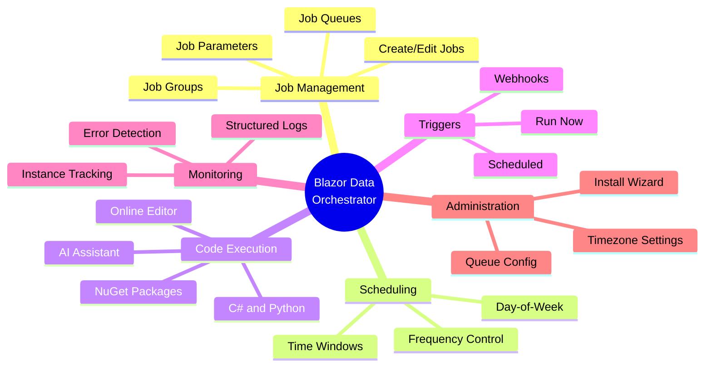

---

### 3. Requirements.md

**Purpose:** System prerequisites and infrastructure requirements.

**Content Outline:**

1. **Development Prerequisites**
   - .NET 10.0 SDK
   - Docker Desktop or Podman (for SQL Server and Azurite containers)
   - Visual Studio 2022+ or Visual Studio Code
   - .NET Aspire workload (via `dotnet workload restore`, NOT legacy aspire workload)
   - Source: `README.md`, `.csproj` files

2. **Runtime Infrastructure**
   - SQL Server (2019+ or Azure SQL)
   - Azure Storage Account (or Azurite emulator for local development)
     - Blob Storage — job package storage (`jobs` container)
     - Queue Storage — job scheduling queue (`default` + custom queues)
     - Table Storage — job logs (`JobLogs` table), AI settings
   - Source: `AppHost/Program.cs`, `JobManager.cs`

3. **Optional: AI Features**
   - OpenAI API key or Azure OpenAI endpoint
   - Source: `AICodeEditorChatFeaturePlan.md`, `AISettings.cs`

4. **Optional: Python Execution**
   - Python 3.x runtime on the agent host
   - Source: `CodeExecutorService.cs`

5. **Network Requirements**
   - Port 1433 (SQL Server)
   - Ports 10000, 10001, 10002 (Azurite blob, queue, table)
   - Outbound HTTPS for NuGet.org package resolution
   - Source: `AppHost/Program.cs` (port configuration)

**Diagram — Infrastructure:**

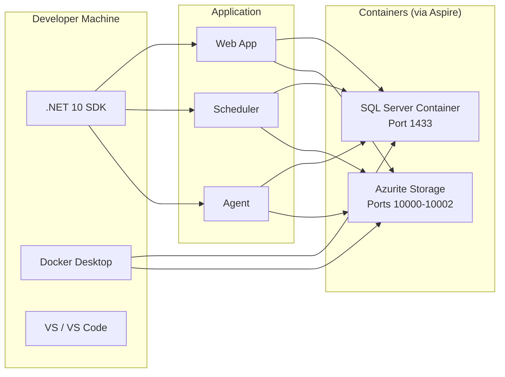

---

### 4. Installation.md

**Purpose:** Step-by-step setup from clone to first run.

**Content Outline:**

1. **Clone the Repository**
   ```
   git clone https://github.com/Blazor-Data-Orchestrator/BlazorDataOrchestrator.git
   ```

2. **Restore Workloads & Dependencies**
   ```
   dotnet workload restore
   dotnet restore
   ```

3. **Start with Aspire**
   ```
   aspire run
   ```
   - Aspire AppHost starts SQL Server, Azurite, Web, Scheduler, and Agent automatically
   - Source: `AppHost/Program.cs`

4. **Install Wizard**
   - On first launch, the web app detects no database schema and presents the Install Wizard
   - Steps: Database connection → Storage connection → Admin user → Summary
   - Source: `InstallWizard.razor`, `StepDatabase.razor`, `StepStorage.razor`, `StepAdmin.razor`, `StepSummary.razor`

5. **Verify Installation**
   - Navigate to the home page — job list should display (empty)
   - Check Aspire dashboard for all services healthy
   - Verify Azurite containers are running

6. **Configuration Files**
   - `appsettings.json` — connection strings, app settings
   - `appsettings.Development.json` — development overrides
   - Aspire manages connection string injection between services
   - Source: `Web/appsettings.json`, `Agent/appsettings.json`, `Scheduler/appsettings.json`

**Diagram — Installation Flow:**

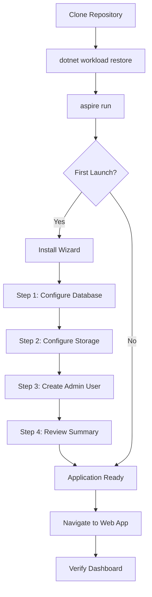

---

### 5. Operation.md

**Purpose:** Day-to-day operational guide for managing jobs.

**Content Outline:**

1. **Dashboard Overview**
   - Home page shows all jobs with status indicators
   - Columns: Job Name, Enabled, Queued, In Process, Error status
   - Quick actions: Run Now, Edit, View Logs
   - Source: `Home.razor`

2. **Creating a Job**
   - Click "Create Job" → `CreateJobDialog.razor`
   - Enter: Job Name, Organization, Environment
   - Source: `CreateJobDialog.razor`

3. **Editing Job Details**
   - `JobDetailsDialog.razor` tabs:
     - **Details Tab** — Name, enabled toggle, environment, queue assignment, Run Now button
     - **Schedules Tab** — Add/edit schedules (days, time window, frequency)
     - **Parameters Tab** — Key-value parameters passed to job code
     - **Code Tab** — Online editor or NuGet upload (see Job Development)
     - **Webhook Tab** — Enable/disable webhook, copy endpoint URL
     - **Logs Tab** — View execution history and log entries

4. **Running a Job**
   - **Scheduled:** Scheduler service evaluates enabled schedules every N seconds
   - **Manual:** Click "Run Job Now" — creates a JobInstance and queues a message
   - **Webhook:** External system calls `/webhook/{GUID}`
   - Source: `NuGetExecutionFeature.md`, `WebhookFeaturePlan.md`

5. **Monitoring Execution**
   - Logs Tab shows per-instance logs from Azure Table Storage
   - Log entries include: Action, Details, Level, Timestamp
   - Timezone offset applied based on admin settings
   - Source: `JobManager.cs`, `TimezoneFeaturePlan.md`

6. **Administration**
   - Navigate to Administration page via link on home page
   - **Job Groups Tab** — Create/manage organizational groups
   - **Job Queues Tab** — Create/manage queue configurations
   - **Settings Tab** — Configure timezone offset for log display
   - Source: `AdminHome.razor`, `AppSettings.md`, `TimezoneFeaturePlan.md`

7. **Agent Behavior**
   - Agent polls queue every 5 seconds
   - Downloads job package from blob storage
   - Resolves NuGet dependencies via `dotnet restore`
   - Executes C# or Python code
   - Visibility timeout renewal for long-running jobs (heartbeat every 3 min)
   - Source: `Agent/Worker.cs`, `QueueVisibilityTimeoutRenewal.md`

**Diagram — Job Lifecycle:**

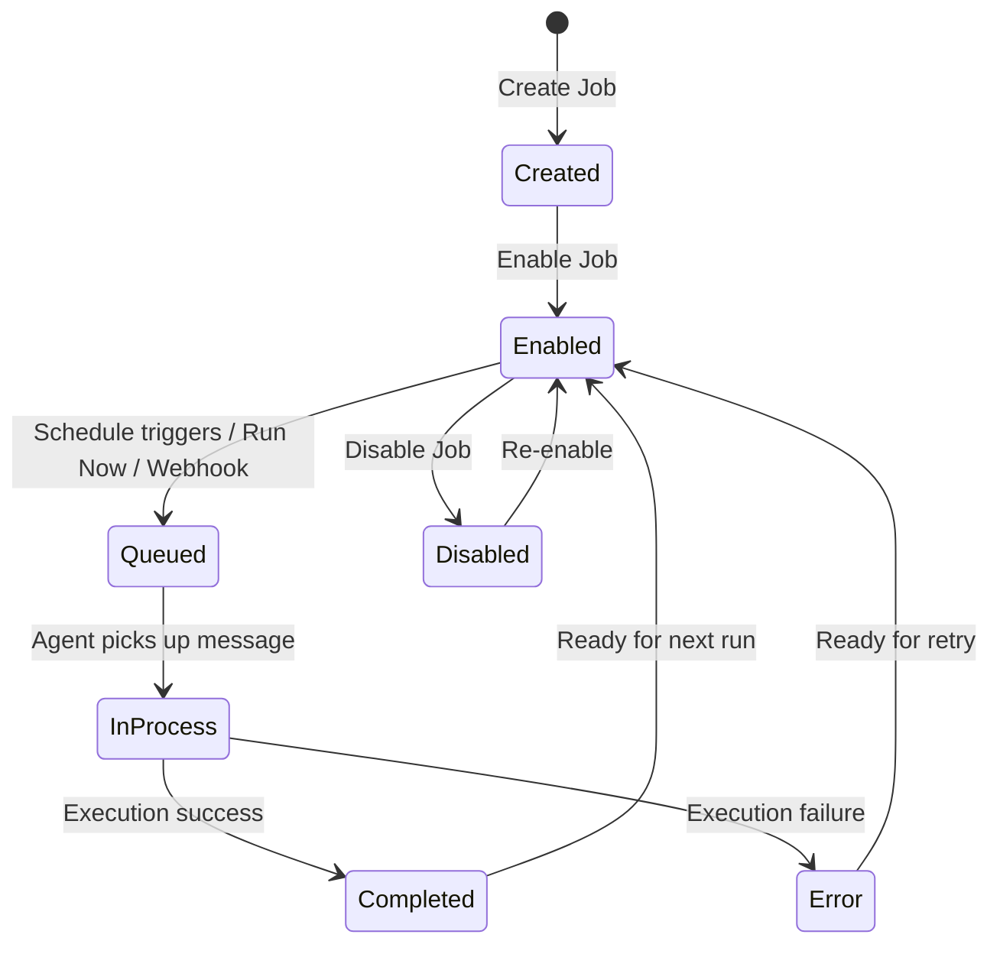

---

### 6. Deployment.md

**Purpose:** Production deployment instructions.

**Content Outline:**

1. **Deployment Options**
   - Azure Container Apps (recommended with Aspire)
   - Azure App Service
   - Self-hosted with Docker

2. **Azure Deployment with Aspire**
   - `azd init` → `azd provision` → `azd deploy`
   - `azure.yaml` already present in `AppHost/`
   - Source: `BlazorOrchestrator.AppHost/azure.yaml`

3. **Azure Resources Required**
   - Azure SQL Database
   - Azure Storage Account (Blob + Queue + Table)
   - Azure Container Apps for: Web, Scheduler, Agent
   - Source: `AppHost/Program.cs`

4. **Configuration for Production**
   - Set connection strings as environment variables or app settings
   - Configure agent queue name via `QueueName` setting
   - Scale agents horizontally by deploying multiple replicas
   - Source: `Agent/appsettings.json`, `Web/appsettings.json`

5. **CI/CD**
   - Wiki content synced via `update-wiki.yml` GitHub Action
   - Application deployment via Azure Developer CLI (`azd`)

**Diagram — Deployment Architecture:**

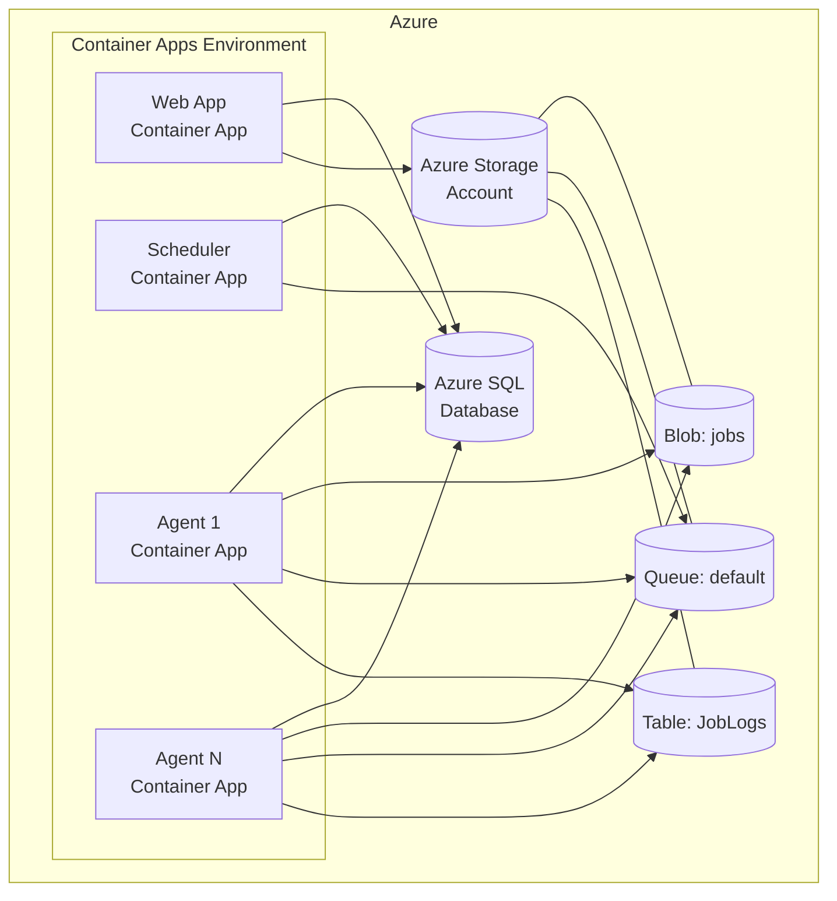

---

### 7. Job-Development.md

**Purpose:** Overview of job development approaches.

**Content Outline:**

1. **What is a Job?**
   - A unit of work packaged as a NuGet package (`.nupkg`)
   - Contains code files (`main.cs` or `main.py`), configuration (`appsettings.json`), and dependency metadata (`.nuspec`)
   - Uploaded to Azure Blob Storage and executed by the Agent
   - Source: `NuGetExecutionFeature.md`, `Job.cs`

2. **Supported Languages**
   - **C#** — Compiled and executed via CS-Script/Roslyn
   - **Python** — Executed via subprocess
   - Language set via `configuration.json` in the NuGet package (`SelectedLanguage`)
   - Source: `CodeExecutorService.cs`, `JobConfiguration.cs`

3. **Package Structure**
   ```
   BlazorDataOrchestrator.Job.1.0.nupkg
   ├── BlazorDataOrchestrator.Job.nuspec
   └── contentFiles/
       └── any/
           └── any/
               ├── configuration.json
               ├── CodeCSharp/          (or CodePython/)
               │   ├── main.cs          (or main.py)
               │   └── *.cs / *.py      (additional files)
               ├── appsettings.json
               └── appsettingsProduction.json
   ```

4. **C# Job Template**
   - Entry point: `BlazorDataOrchestratorJob.ExecuteJob()` method
   - NuGet dependencies declared in `.nuspec`
   - Transitive dependencies resolved via `dotnet restore` at execution time
   - Source: `OnlineCodeEditorFeaturePlan.md` (default template)

5. **Python Job Template**
   - Entry point: `execute_job()` function in `main.py`
   - `requirements.txt` support for pip dependencies
   - Source: `OnlineCodeEditorFeaturePlan.md`

6. **Development Options**
   - [Online Editor](Online) — Edit code directly in the browser
   - [Visual Studio](Visual-Studio) — Develop jobs locally using the Job Creator Template
   - Source: `OnlineCodeEditorFeaturePlan.md`

7. **Environment-Specific Configuration**
   - `appsettings.json` — default/development settings
   - `appsettingsProduction.json` — production overrides
   - Agent merges connection strings from its own configuration
   - Source: `AppSettings.md`

**Diagram — Job Execution Pipeline:**

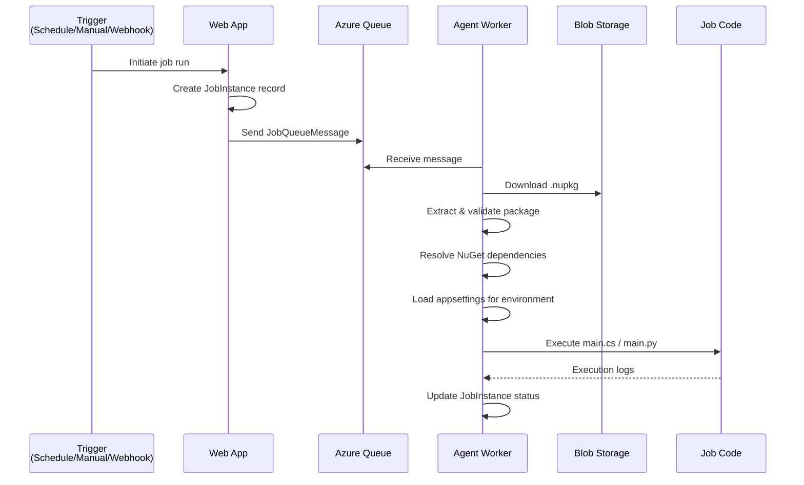

---

### 8. Online.md

**Purpose:** Guide for using the online code editor.

**Content Outline:**

1. **Overview**
   - Monaco-based code editor embedded in the Code Tab of JobDetailsDialog
   - Edit, compile, and deploy jobs without leaving the browser
   - Source: `OnlineCodeEditorFeaturePlan.md`

2. **Code Tab UI Modes**
   - **Code Edit** (default) — Write/edit code in the Monaco editor
   - **Code Upload** — Upload a pre-built `.nupkg` file
   - Toggle between modes via dropdown
   - Source: `OnlineCodeEditorFeaturePlan.md`

3. **File Navigation**
   - Dropdown lists all files from the job package
   - C# files: `main.cs`, `appsettings.json`, `appsettingsProduction.json`, `.nuspec`, additional `.cs` files
   - Python files: `main.py`, `appsettings.json`, `appsettingsProduction.json`, additional `.py` files
   - Source: `OnlineJobEditorEnhancements.md`

4. **Save & Compile**
   - Click "Save & Compile" to validate code
   - C#: Roslyn compilation with NuGet dependency resolution
   - Python: Syntax validation
   - Errors displayed in a popup dialog
   - On success: creates NuGet package and uploads to Blob Storage
   - Source: `CSharpCompilationService.cs`, `CodeTabCompilationReferencesIssue.md`

5. **Run Job Now**
   - Available in Code Edit mode only
   - Compiles, packages, uploads, then queues the job for immediate execution
   - Source: `OnlineCodeEditorFeaturePlan.md`

6. **NuGet Dependencies (C#)**
   - Reference NuGet packages via CS-Script syntax in code: `//css_nuget PackageName`
   - Dependencies declared in `.nuspec` are resolved automatically at execution time
   - View/edit `.nuspec` directly in the file dropdown
   - Source: `NestedNuGetDependencyResolutionPlan.md`, `NuspecDependencyLossOnEditorReopening.md`

7. **AI Code Assistant**
   - Click the AI button (visible in Editor mode) to open chat dialog
   - AI receives current code as context
   - Supports OpenAI and Azure OpenAI
   - "Apply Code" button to insert AI-generated code into editor
   - Configure AI settings via the configure dialog
   - Source: `AICodeEditorChatFeaturePlan.md`, `AIChatDialog.razor`

**Diagram — Code Tab User Flow:**

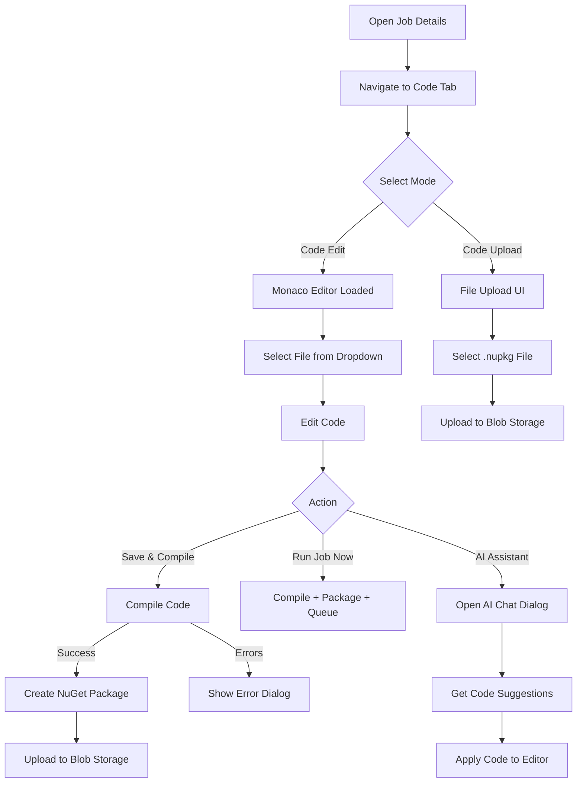

---

### 9. Visual-Studio.md

**Purpose:** Guide for developing jobs using Visual Studio with the Job Creator Template.

**Content Outline:**

1. **Overview**
   - `BlazorDataOrchestrator.JobCreatorTemplate` is a standalone Blazor project
   - Provides a local development experience with the same Monaco editor
   - Generates NuGet packages for upload to the main application
   - Source: `src/BlazorDataOrchestrator.JobCreatorTemplate/`

2. **Getting Started**
   - Open `JobTemplate.slnx` in Visual Studio
   - Run the project — opens a local web UI with code editor
   - Source: `JobTemplate.slnx`, `BlazorDataOrchestrator.JobCreatorTemplate/Program.cs`

3. **Project Structure**
   - `Components/Pages/Home.razor` — Main editor page
   - `Code/` — Template code files
   - `Services/` — Compilation and packaging services
   - `appsettings.json` / `appsettingsProduction.json` — Job configuration

4. **Development Workflow**
   - Write job code in the local editor
   - Click "Run Code" to test locally
   - Package as `.nupkg`
   - Upload via the web application's Code Upload mode

5. **Screenshots** — Retain existing screenshot references from current `Visual-Studio.md`

**Diagram — Local Development Flow:**

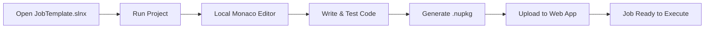

---

### 10. Frequently-Asked-Questions.md

**Purpose:** Common questions and troubleshooting tips.

**Content Outline:**

1. **General**
   - *What is Blazor Data Orchestrator?* — .NET Aspire-based distributed job orchestration platform
   - *What languages are supported for jobs?* — C# and Python
   - *Do I need Azure to run this locally?* — No, Aspire starts Azurite (storage emulator) and SQL Server containers

2. **Installation**
   - *The app won't start — what should I check?* — Ensure Docker is running, .NET 10 SDK installed, run `dotnet workload restore`
   - *What is the Install Wizard?* — First-launch setup that configures database, storage, and admin account
   - *Can I use an existing SQL Server?* — Yes, configure the connection string in `appsettings.json`

3. **Job Development**
   - *How do I add NuGet dependencies to my C# job?* — Add them to the `.nuspec` file; dependencies are resolved at execution time
   - *Why does my code compile in VS but fail in the online editor?* — The online editor may need NuGet references added; ensure the `.nuspec` includes all dependencies
   - *Can I use multiple code files?* — Yes, add additional `.cs` or `.py` files alongside `main.cs`/`main.py`

4. **Operations**
   - *How do I trigger a job manually?* — Click "Run Job Now" on the Details tab or Code tab
   - *How do I set up a webhook?* — Go to the Webhook tab in Job Details, enable the webhook, and use the generated URL
   - *Why was my job executed twice?* — The agent uses visibility timeout renewal; check for agent scaling issues

5. **Troubleshooting**
   - *Where are job logs stored?* — Azure Table Storage (`JobLogs` table), viewable in the Logs tab
   - *How do I change the timezone for log display?* — Administration → Settings → Timezone Offset
   - *The agent isn't picking up jobs* — Check the queue name in agent `appsettings.json` matches the job's assigned queue

---

## Implementation Process

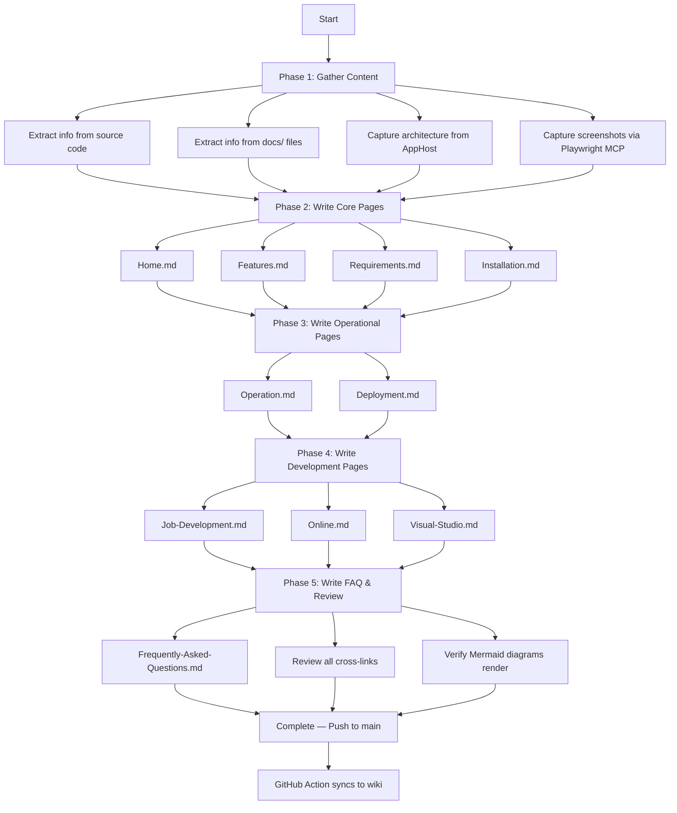

---

## Phase Breakdown & Task Checklist

### Phase 1: Content Gathering (Research Only)

- [ ] Review all `docs/*.md` files for feature descriptions and status
- [ ] Review `src/BlazorOrchestrator.AppHost/Program.cs` for architecture details
- [ ] Review `src/BlazorOrchestrator.Web/Program.cs` for service registrations
- [ ] Review `src/BlazorOrchestrator.Web/Components/Pages/` for UI structure
- [ ] Review `src/BlazorDataOrchestrator.Core/Data/*.cs` for data model understanding
- [ ] Review `src/BlazorOrchestrator.Agent/Worker.cs` for agent behavior
- [ ] Review `src/BlazorOrchestrator.Scheduler/Worker.cs` for scheduler behavior
- [ ] Review `README.md` for existing project description
- [ ] Capture application screenshots using Playwright MCP server (see Screenshot Capture Process below)

### Phase 2: Core Pages

- [ ] Write `wiki-content/Home.md` — Overview + quick start + navigation
- [ ] Write `wiki-content/Features.md` — Full feature catalogue
- [ ] Write `wiki-content/Requirements.md` — System prerequisites
- [ ] Write `wiki-content/Installation.md` — Step-by-step setup guide

### Phase 3: Operational Pages

- [ ] Write `wiki-content/Operation.md` — Day-to-day usage guide
- [ ] Write `wiki-content/Deployment.md` — Production deployment instructions

### Phase 4: Development Pages

- [ ] Write `wiki-content/Job-Development.md` — Job development overview
- [ ] Write `wiki-content/Online.md` — Online code editor guide
- [ ] Write `wiki-content/Visual-Studio.md` — Add text alongside existing screenshots

### Phase 5: FAQ, Screenshots & Quality

- [ ] Write `wiki-content/Frequently-Asked-Questions.md` — Common Q&A
- [ ] Capture all required screenshots via Playwright MCP (see Screenshot Capture Process)
- [ ] Crop and annotate screenshots to highlight relevant UI areas
- [ ] Add screenshot images to wiki pages with descriptive alt text
- [ ] Verify all cross-page links use correct GitHub Wiki URL format
- [ ] Verify all Mermaid diagrams render correctly
- [ ] Review for accuracy against current codebase state

---

## Content Guidelines

### Writing Style
- Use second-person ("you") for instructions
- Use present tense for descriptions
- Keep paragraphs concise (3-5 sentences)
- Use code blocks for commands, file paths, and configuration examples
- Use tables for structured reference data

### Cross-Linking Convention
All wiki page links should use the format:
```
[Page Title](https://github.com/Blazor-Data-Orchestrator/BlazorDataOrchestrator/wiki/Page-Name)
```

### Mermaid Diagrams
- Use `graph`, `sequenceDiagram`, `flowchart`, or `stateDiagram-v2` as appropriate
- Keep diagrams focused — one concept per diagram
- Use subgraphs to group related components
- Test rendering on GitHub before merging

### Code Examples
- Include only minimal, representative code snippets
- Reference source file paths for full implementation details
- Use language-specific code fence identifiers (`csharp`, `python`, `json`, `xml`)

### Screenshots via Playwright MCP Server

The Playwright MCP server is configured in this repository and **must** be used to capture screenshots of live application screens for inclusion in the wiki documentation. This ensures screenshots are accurate, reproducible, and up to date.

#### Screenshot Capture Process

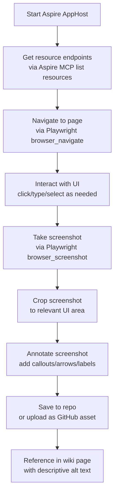

#### Screenshots Required Per Page

| Wiki Page | Screenshots Needed |
|-----------|-------------------|
| `Home.md` | Dashboard overview showing job list |
| `Features.md` | Key feature highlights (editor, webhook tab, AI chat, admin settings) |
| `Installation.md` | Install Wizard steps (Database, Storage, Admin, Summary) |
| `Operation.md` | Job Details dialog tabs (Details, Schedules, Parameters, Code, Webhook, Logs), Administration page |
| `Online.md` | Code Tab in Editor mode, file dropdown, Save & Compile result, AI chat dialog, error dialog |
| `Visual-Studio.md` | Job Creator Template UI (retain and supplement existing screenshots) |
| `Deployment.md` | Aspire dashboard showing healthy resources |

#### Playwright MCP Workflow

1. **Get endpoints** — Use the Aspire MCP `list_resources` tool to retrieve HTTP endpoints for the running web application.
2. **Navigate** — Use `mcp_playwright_browser_navigate` to open each target page.
3. **Interact** — Use `mcp_playwright_browser_click`, `mcp_playwright_browser_type`, and `mcp_playwright_browser_select_option` to reach the desired UI state (e.g., open a dialog, switch tabs, populate forms).
4. **Capture** — Use the Playwright screenshot tool to take a full-page or element-level screenshot.
5. **Crop & Annotate** — Crop the screenshot to the relevant region and add annotations (arrows, labels, highlights) to call out key UI elements being documented.
6. **Embed in wiki** — Reference the image in the Markdown file using standard GitHub image syntax:
   ```markdown
   
   ```

#### Best Practices for Screenshots

- **Consistency** — Use the same browser window size for all captures (e.g., 1280×800) via `mcp_playwright_browser_resize`.
- **Clean state** — Populate the application with representative sample data before capturing.
- **Annotations** — Use numbered callouts matching the step descriptions in the wiki text.
- **Alt text** — Always provide descriptive alt text for accessibility (e.g., `"Job Details dialog showing the Code Tab in Editor mode with the file dropdown open"`).
- **Reproducibility** — Document the navigation steps taken so screenshots can be recaptured when the UI changes.

---

## Data Model Reference for Content Writers

The following database entities should be referenced accurately in documentation:

| Entity | Key Fields | Purpose |
|--------|-----------|---------|
| `Job` | Id, JobName, JobEnabled, JobEnvironment, JobCodeFile, WebhookGuid, JobQueue | Core job definition |
| `JobSchedule` | Id, JobId, Enabled, StartTime, StopTime, RunEveryHour, Day flags | Schedule configuration |
| `JobInstance` | Id, JobScheduleId, InProcess, HasError, AgentId | Single execution instance |
| `JobGroup` | Id, JobGroupName, IsActive | Organizational grouping |
| `JobQueue` | Id, QueueName | Queue routing configuration |
| `JobDatum` | Associated with Job | Job parameters (key-value) |
| `JobOrganization` | Associated with Job | Multi-tenant organization |

---

## Service Reference for Content Writers

| Service | Project | Purpose |
|---------|---------|---------|
| `JobManager` | Core | Central orchestration: CRUD, queuing, execution, logging |
| `JobStorageService` | Core | Azure Blob Storage operations for packages |
| `PackageProcessorService` | Core | NuGet package validation and extraction |
| `CodeExecutorService` | Core | C#/Python code compilation and execution |
| `NuGetResolverService` | Core | `dotnet restore`-based dependency resolution |
| `CodeAssistantChatService` | Core | AI chat integration (OpenAI/Azure OpenAI) |
| `AISettingsService` | Core | AI configuration persistence (Table Storage) |
| `JobService` | Web | Web-layer job operations |
| `JobCodeEditorService` | Web | Online editor file management |
| `CSharpCompilationService` | Web | Browser-side Roslyn compilation |
| `WebNuGetPackageService` | Web | NuGet package creation from editor |
| `WebhookService` | Web | Webhook enable/disable/lookup |
| `AppSettingsService` | Web | Timezone and app settings management |
| `EditorFileStorageService` | Web | In-memory file storage for editor sessions |
