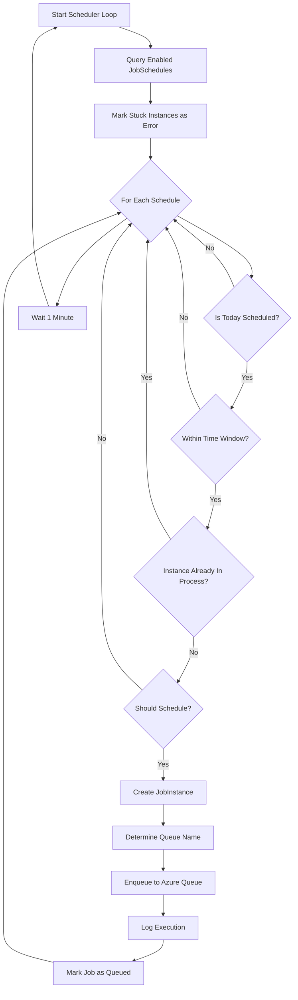
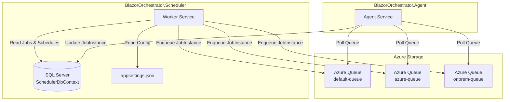
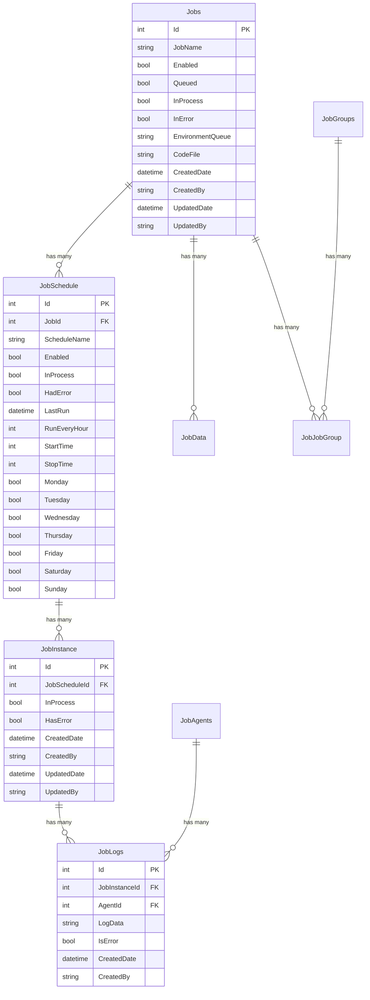
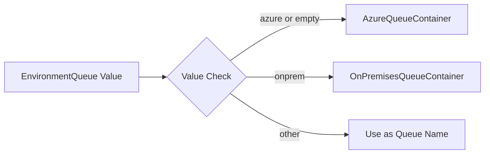
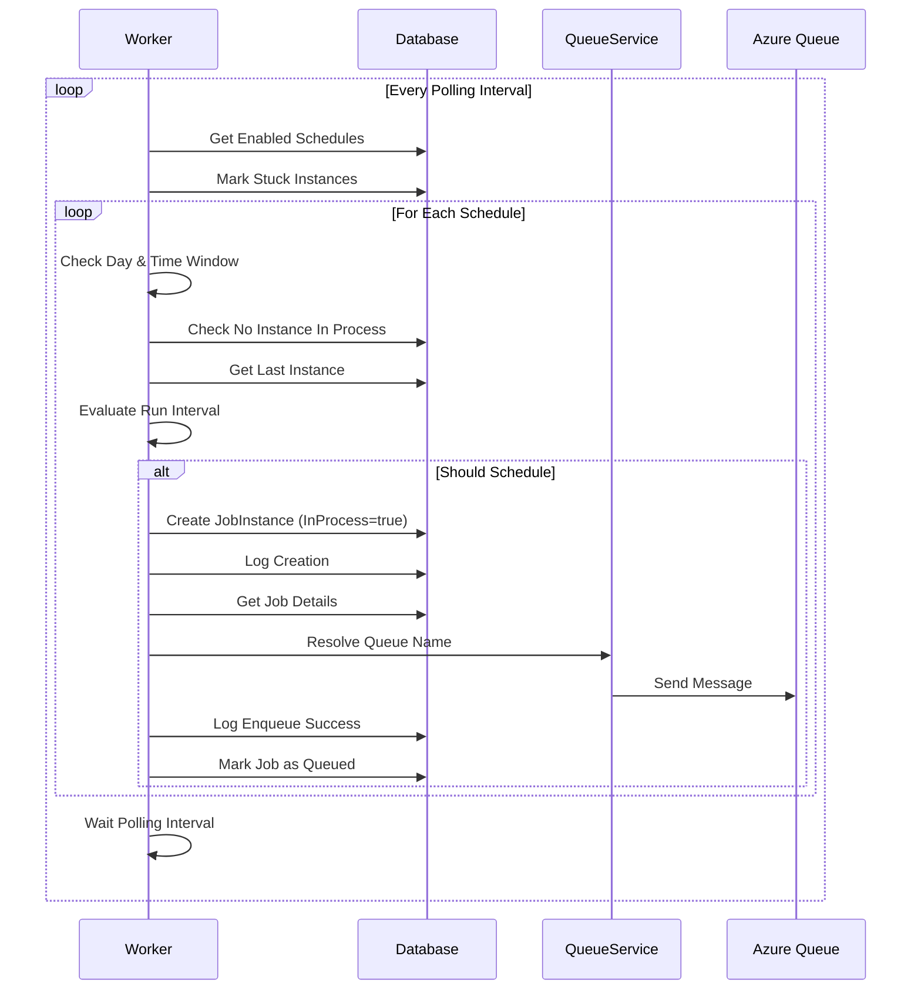
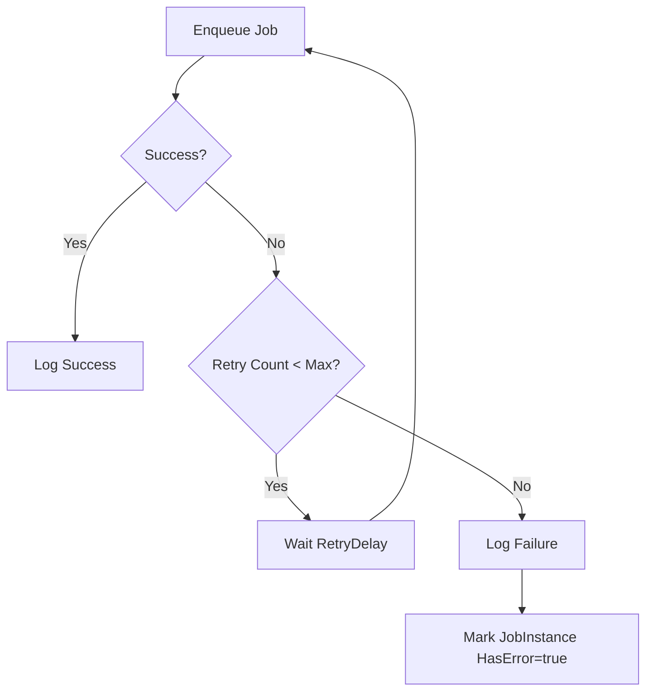
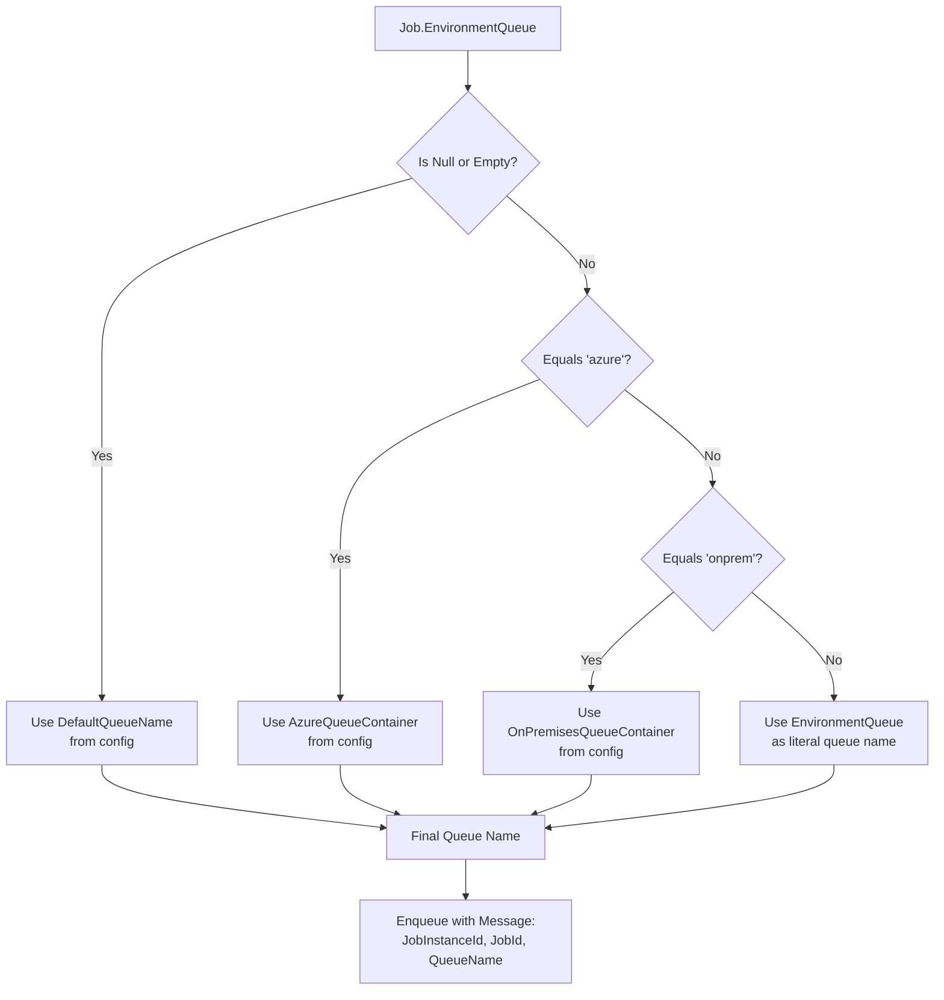

# BlazorOrchestrator.Scheduler Implementation Plan

## Overview

This document outlines the plan to implement a job scheduler service based on the reference WarehouseOrchestratorScheduler project, adapted for the BlazorOrchestrator architecture with custom queue assignment logic.

---

## Current State Analysis

### What's Already Implemented ✅

| Component | Status | Description |
|-----------|--------|-------------|
| Entity Models | ✅ Complete | Jobs, JobSchedule, JobInstance, JobLogs, JobAgents, JobData, JobGroups, JobJobGroup |
| DbContext | ✅ Complete | SchedulerDbContext with all DbSets |
| Worker Service | ✅ Partial | Basic scheduling loop with queue integration |
| Configuration | ✅ Complete | Azure Storage and queue settings in appsettings.json |

### Current Worker Logic Flow



---

## Gaps & Improvements Needed

### 1. Configuration-Driven Queue Selection
**Current:** Queue name is read directly from `job.EnvironmentQueue` or defaults to `"default"`.  
**Needed:** Use configuration settings (`AzureQueueContainer`, `AzureQueueContainerOnPremises`) to map environment values to actual queue names.

### 2. Inject Azure Queue Client via DI
**Current:** Queue client is created inline with environment variable.  
**Needed:** Use the Aspire-registered `QueueServiceClient` for proper dependency injection and configuration.

### 3. Robust Error Handling & Retry Logic
**Current:** Basic try-catch with logging.  
**Needed:** Configurable retry policy for queue failures.

### 4. Configurable Polling Interval
**Current:** Hardcoded 1-minute delay.  
**Needed:** Read polling interval from configuration.

### 5. Verbose Logging Option
**Current:** Standard logging only.  
**Needed:** Add verbose logging toggle in configuration.

### 6. Time Zone Handling
**Current:** Uses `DateTime.UtcNow`.  
**Needed:** Option to use local/Pacific time as in reference project.

---

## Architecture Diagram



---

## Database Entity Relationships



---

## Implementation Plan

### Phase 1: Configuration Improvements

#### Task 1.1: Add Scheduler Settings Class
Create a strongly-typed settings class for scheduler configuration.

```csharp
public class SchedulerSettings
{
    public int PollingIntervalSeconds { get; set; } = 60;
    public bool VerboseLogging { get; set; } = false;
    public string DefaultQueueName { get; set; } = "default-queue";
    public string AzureQueueContainer { get; set; } = "azure-queue";
    public string OnPremisesQueueContainer { get; set; } = "onprem-queue";
    public int StuckJobTimeoutHours { get; set; } = 24;
}
```

#### Task 1.2: Update appsettings.json
```json
{
  "SchedulerSettings": {
    "PollingIntervalSeconds": 60,
    "VerboseLogging": false,
    "DefaultQueueName": "default-queue",
    "AzureQueueContainer": "azure-queue",
    "OnPremisesQueueContainer": "onprem-queue",
    "StuckJobTimeoutHours": 24
  }
}
```

#### Task 1.3: Register Settings in Program.cs
```csharp
builder.Services.Configure<SchedulerSettings>(
    builder.Configuration.GetSection("SchedulerSettings"));
```

---

### Phase 2: Queue Service Improvements

#### Task 2.1: Create Queue Service Interface
```csharp
public interface IJobQueueService
{
    Task<bool> EnqueueJobAsync(int jobInstanceId, int jobId, string queueName);
    string ResolveQueueName(string environmentQueue);
}
```

#### Task 2.2: Implement Queue Service
- Use Aspire's registered `QueueServiceClient`
- Map `EnvironmentQueue` values to actual queue names from configuration
- Include retry logic with configurable policy



---

### Phase 3: Worker Service Refactoring

#### Task 3.1: Inject Dependencies
- `IJobQueueService`
- `IOptions<SchedulerSettings>`
- `ILogger<Worker>`

#### Task 3.2: Extract Methods
| Method | Responsibility |
|--------|---------------|
| `ProcessScheduledJobsAsync` | Main scheduling loop logic |
| `MarkStuckJobInstancesAsync` | Identify and mark timed-out instances |
| `ShouldScheduleJob` | Determine if job meets scheduling criteria |
| `CreateAndEnqueueJobAsync` | Create instance and send to queue |

#### Task 3.3: Improve Scheduling Logic Flow



---

### Phase 4: Message Format for Agent Compatibility

#### Task 4.1: Define Message Contract
Create a shared message format that the Agent project can deserialize:

```csharp
public class JobQueueMessage
{
    public int JobInstanceId { get; set; }
    public int JobId { get; set; }
    public string QueueName { get; set; }
    public DateTime ScheduledAt { get; set; }
    public Dictionary<string, string> Metadata { get; set; }
}
```

#### Task 4.2: Serialize as JSON
Ensure the message is properly JSON-serialized for cross-service compatibility.

---

### Phase 5: Error Handling & Retry

#### Task 5.1: Retry Policy Configuration
```json
{
  "SchedulerSettings": {
    "RetryCount": 3,
    "RetryDelaySeconds": 5
  }
}
```

#### Task 5.2: Implement Polly Retry Policy
Use Polly for resilient queue operations with exponential backoff.



---

## Files to Create/Modify

### New Files
| File | Purpose |
|------|---------|
| `Settings/SchedulerSettings.cs` | Strongly-typed configuration |
| `Services/IJobQueueService.cs` | Queue service interface |
| `Services/JobQueueService.cs` | Queue service implementation |
| `Messages/JobQueueMessage.cs` | Queue message contract |

### Files to Modify
| File | Changes |
|------|---------|
| `Program.cs` | Register settings and services |
| `Worker.cs` | Refactor to use new services and settings |
| `appsettings.json` | Add SchedulerSettings section |
| `appsettings.Development.json` | Add SchedulerSettings section |

---

## Queue Assignment Logic (Your Custom Requirement)

As you mentioned, jobs have a queue ID assigned, and the agent needs to know which queue the job belongs to.



---

## Testing Strategy

### Unit Tests
- [ ] `ShouldScheduleJob` logic with various schedule configurations
- [ ] Queue name resolution logic
- [ ] Message serialization format

### Integration Tests
- [ ] End-to-end scheduling with in-memory database
- [ ] Azure Queue integration with Azurite emulator

### Manual Testing
- [ ] Verify jobs are enqueued to correct queues
- [ ] Verify stuck job detection works after 24 hours
- [ ] Verify polling interval respects configuration

---

## Rollout Plan

1. **Phase 1-2**: Configuration and Queue Service (Low Risk)
2. **Phase 3**: Worker Refactoring (Medium Risk - test thoroughly)
3. **Phase 4**: Message Format (Coordinate with Agent team)
4. **Phase 5**: Retry Logic (Low Risk)

---

## Summary

| Task | Priority | Effort | Risk |
|------|----------|--------|------|
| Configuration Settings Class | High | Low | Low |
| Queue Service with DI | High | Medium | Low |
| Worker Refactoring | High | Medium | Medium |
| Message Format Contract | High | Low | Low |
| Retry Policy | Medium | Low | Low |
| Verbose Logging | Low | Low | Low |
| Time Zone Handling | Low | Low | Low |

---

## Approval

- [ ] Plan reviewed by: _______________
- [ ] Approved for execution: Yes / No
- [ ] Execution start date: _______________

---

*Document created: January 26, 2026*  
*Last updated: January 26, 2026*
