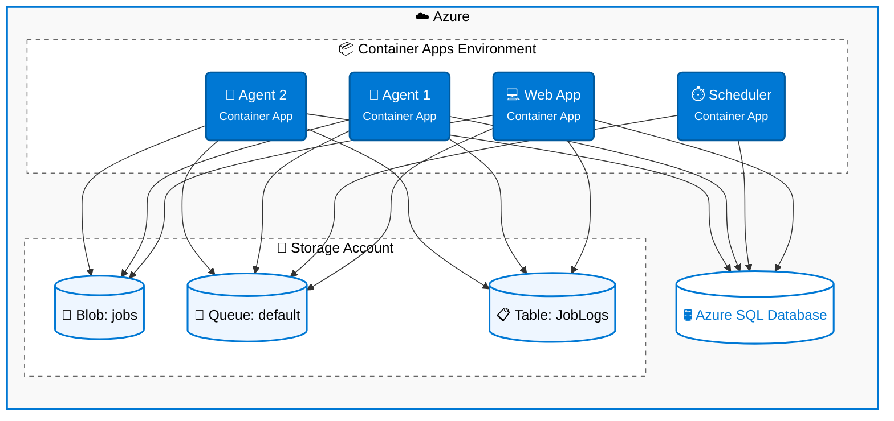

# Deployment

This guide covers deploying Blazor Data Orchestrator to production environments. The platform is designed to go from `git clone` to a fully deployed Azure Container Apps environment with a single `azd up` command — including Azure SQL, Storage, and Container Registry provisioning.

---

## Deployment Architecture


```mermaid
graph TB
    %% Styling Definitions
    classDef container fill:#0078d4,stroke:#005a9e,stroke-width:2px,color:#fff,rx:5,ry:5;
    classDef database fill:#ffffff,stroke:#0078d4,stroke-width:2px,color:#0078d4;
    classDef storage fill:#eef6ff,stroke:#0078d4,stroke-width:2px,color:#000;

    subgraph Azure ["☁️ Azure"]
        direction TB

        subgraph CAEnv ["📦 Container Apps Environment"]
            WEBAPP("💻 Web App<br/><small>Container App</small>"):::container
            SCHEDULER("⏱️ Scheduler<br/><small>Container App</small>"):::container
            AGENT1("🤖 Agent 1<br/><small>Container App</small>"):::container
            AGENT2("🤖 Agent 2<br/><small>Container App</small>"):::container
        end

        SQLDB[("🛢️ Azure SQL Database")]:::database

        subgraph Storage ["💾 Storage Account"]
            BLOB[("📄 Blob: jobs")]:::storage
            QUEUE[("📨 Queue: default")]:::storage
            TABLE[("📋 Table: JobLogs")]:::storage
        end
    end

    %% Dependencies
    WEBAPP --> SQLDB & BLOB & QUEUE & TABLE
    SCHEDULER --> SQLDB & QUEUE
    AGENT1 --> SQLDB & BLOB & QUEUE & TABLE
    AGENT2 --> SQLDB & BLOB & QUEUE & TABLE

    %% Subgraph Styling
    style Azure fill:#f9f9f9,stroke:#0078d4,stroke-width:2px,color:#000
    style CAEnv fill:#fff,stroke:#666,stroke-width:1px,stroke-dasharray: 5 5,color:#000
    style Storage fill:#fff,stroke:#666,stroke-width:1px,stroke-dasharray: 5 5,color:#000
```

---

## Deployment Options

| Option | Description | Best For |
|--------|-------------|----------|
| **Azure Container Apps** (recommended) | Deploy via Azure Developer CLI with Aspire integration | Cloud-native, auto-scaling |
| **Azure App Service** | Deploy as App Service web apps and WebJobs | Simpler PaaS hosting |
| **Self-hosted with Docker** | Run containers on your own infrastructure | On-premises or hybrid |

---

## Azure Deployment with Azure Developer CLI

The repository includes an `azure.yaml` file in the AppHost project, enabling deployment via the [Azure Developer CLI (azd)](https://learn.microsoft.com/azure/developer/azure-developer-cli/overview). This is the recommended deployment path — it provisions all required Azure resources and deploys all services in one operation.

### One-Command Deployment

The fastest way to deploy is a single command that combines provisioning and deployment.

Navigate to the AppHost root directory and run:

```bash
azd auth login
```
After authenticating, run:

```bash
azd up
```

This command:
1. Creates all required Azure resources (Container Apps Environment, Azure SQL Database, Storage Account, Container Registry)
2. Builds and containerizes all services (Web, Scheduler, Agent)
3. Deploys everything to Azure Container Apps

No manual infrastructure setup is required. The Aspire AppHost defines the entire application topology, and `azd` translates it into Azure resources automatically.

### Step-by-Step Deployment

If you prefer more control, you can run each step separately:

1. **Install Azure Developer CLI**

   ```bash
   winget install Microsoft.Azd
   ```

2. **Authenticate**

   ```bash
   azd auth login
   ```

3. **Initialize** (first time only)

   ```bash
   azd init
   ```

   Follow the prompts to select your Azure subscription and region.

4. **Provision infrastructure**

   ```bash
   azd provision
   ```

   This creates all required Azure resources: Container Apps Environment, Azure SQL Database, Storage Account, and Container Registry.

5. **Deploy the application**

   ```bash
   azd deploy
   ```

   This builds, containerizes, and deploys all services (Web, Scheduler, Agent) to Azure Container Apps.

---

## Azure Resources Required

| Resource | Service | Purpose |
|----------|---------|---------|
| **Azure SQL Database** | Azure SQL | Job definitions, schedules, instances, users |
| **Azure Storage Account** | Blob, Queue, Table | Job packages, execution queue, structured logs |
| **Azure Container Apps** | Web App | Blazor Server web application |
| **Azure Container Apps** | Scheduler | Background scheduling service |
| **Azure Container Apps** | Agent (1+ replicas) | Job execution workers |
| **Azure Container Registry** | Registry | Container image storage |

---

## Configuration for Production

### Connection Strings

Set connection strings as environment variables or app settings on each Container App:

| Setting | Description |
|---------|-------------|
| `ConnectionStrings__blazororchestratordb` | Azure SQL connection string |
| `ConnectionStrings__blobs` | Azure Storage connection string for Blob |
| `ConnectionStrings__queues` | Azure Storage connection string for Queue |
| `ConnectionStrings__tables` | Azure Storage connection string for Table |

### Agent Configuration

Configure each agent instance via environment variables:

| Setting | Description | Default |
|---------|-------------|---------|
| `QueueName` | The queue this agent monitors | `default` |

### Scaling Agents

You can scale agents horizontally by deploying multiple replicas or multiple Container Apps with different `QueueName` configurations. For example:

- **Default pool**: 2 replicas monitoring the `default` queue
- **Large job pool**: 1 replica monitoring `jobs-large-container` with more CPU/memory allocated

---

*Back to [Home](https://github.com/Blazor-Data-Orchestrator/BlazorDataOrchestrator/wiki/Home)*
