# Deployment

This guide covers deploying Blazor Data Orchestrator to production environments.

---

## Deployment Architecture

```mermaid
graph TB
    %% Styling Definitions
    classDef container fill:#0078d4,stroke:#005a9e,stroke-width:2px,color:#fff,rx:5,ry:5;
    classDef database fill:#ffffff,stroke:#0078d4,stroke-width:2px,color:#0078d4;
    classDef storage fill:#eef6ff,stroke:#0078d4,stroke-width:2px,color:#000;

    subgraph Azure ["☁️ Azure"]
        direction TB

        subgraph CAEnv ["📦 Container Apps Environment"]
            WEBAPP("💻 Web App<br/><small>Container App</small>"):::container
            SCHEDULER("⏱️ Scheduler<br/><small>Container App</small>"):::container
            AGENT1("🤖 Agent 1<br/><small>Container App</small>"):::container
            AGENT2("🤖 Agent 2<br/><small>Container App</small>"):::container
        end

        SQLDB[("🛢️ Azure SQL Database")]:::database

        subgraph Storage ["💾 Storage Account"]
            BLOB[("📄 Blob: jobs")]:::storage
            QUEUE[("📨 Queue: default")]:::storage
            TABLE[("📋 Table: JobLogs")]:::storage
        end
    end

    %% Dependencies
    WEBAPP --> SQLDB & BLOB & QUEUE & TABLE
    SCHEDULER --> SQLDB & QUEUE
    AGENT1 --> SQLDB & BLOB & QUEUE & TABLE
    AGENT2 --> SQLDB & BLOB & QUEUE & TABLE

    %% Subgraph Styling
    style Azure fill:#f9f9f9,stroke:#0078d4,stroke-width:2px,color:#000
    style CAEnv fill:#fff,stroke:#666,stroke-width:1px,stroke-dasharray: 5 5,color:#000
    style Storage fill:#fff,stroke:#666,stroke-width:1px,stroke-dasharray: 5 5,color:#000
```



---

## Deployment Options

| Option | Description | Best For |
|--------|-------------|----------|
| **Azure Container Apps** (recommended) | Deploy via Azure Developer CLI with Aspire integration | Cloud-native, auto-scaling |
| **Azure App Service** | Deploy as App Service web apps and WebJobs | Simpler PaaS hosting |
| **Self-hosted with Docker** | Run containers on your own infrastructure | On-premises or hybrid |

---

## Azure Deployment with Azure Developer CLI

The repository includes an `azure.yaml` file in the AppHost project, enabling deployment via the [Azure Developer CLI (azd)](https://learn.microsoft.com/azure/developer/azure-developer-cli/overview).

### Steps

1. **Install Azure Developer CLI**

   ```bash
   winget install Microsoft.Azd
   ```

2. **Authenticate**

   ```bash
   azd auth login
   ```

3. **Initialize** (first time only)

   ```bash
   azd init
   ```

   Follow the prompts to select your Azure subscription and region.

4. **Provision infrastructure**

   ```bash
   azd provision
   ```

   This creates all required Azure resources: Container Apps Environment, Azure SQL Database, Storage Account, and Container Registry.

5. **Deploy the application**

   ```bash
   azd deploy
   ```

   This builds, containerizes, and deploys all services (Web, Scheduler, Agent) to Azure Container Apps.

### One-step deployment

You can combine provision and deploy:

```bash
azd up
```

---

## Azure Resources Required

| Resource | Service | Purpose |
|----------|---------|---------|
| **Azure SQL Database** | Azure SQL | Job definitions, schedules, instances, users |
| **Azure Storage Account** | Blob, Queue, Table | Job packages, execution queue, structured logs |
| **Azure Container Apps** | Web App | Blazor Server web application |
| **Azure Container Apps** | Scheduler | Background scheduling service |
| **Azure Container Apps** | Agent (1+ replicas) | Job execution workers |
| **Azure Container Registry** | Registry | Container image storage |

---

## Configuration for Production

### Connection Strings

Set connection strings as environment variables or app settings on each Container App:

| Setting | Description |
|---------|-------------|
| `ConnectionStrings__blazororchestratordb` | Azure SQL connection string |
| `ConnectionStrings__blobs` | Azure Storage connection string for Blob |
| `ConnectionStrings__queues` | Azure Storage connection string for Queue |
| `ConnectionStrings__tables` | Azure Storage connection string for Table |

### Agent Configuration

Configure each agent instance via environment variables:

| Setting | Description | Default |
|---------|-------------|---------|
| `QueueName` | The queue this agent monitors | `default` |

### Scaling Agents

You can scale agents horizontally by deploying multiple replicas or multiple Container Apps with different `QueueName` configurations. For example:

- **Default pool**: 2 replicas monitoring the `default` queue
- **Large job pool**: 1 replica monitoring `jobs-large-container` with more CPU/memory allocated

---

## CI/CD

### Wiki Content Synchronization

Wiki content in the `wiki-content/` directory is automatically synchronized to the GitHub Wiki via the `update-wiki.yml` GitHub Action. Any changes pushed to `wiki-content/` on the `main` branch are reflected in the wiki.

### Application Deployment Pipeline

Use `azd pipeline config` to set up a CI/CD pipeline in GitHub Actions:

```bash
azd pipeline config
```

This generates a GitHub Actions workflow that runs `azd provision` and `azd deploy` on each push to the main branch.

---

## Self-Hosted Deployment

For on-premises or non-Azure deployments:

1. **Build container images:**

   ```bash
   docker compose build
   ```

2. **Configure environment variables** for SQL Server and Azure Storage (or use a compatible storage emulator).

3. **Run services** using Docker Compose or your container orchestrator (Kubernetes, Docker Swarm, etc.).

4. **Database setup** — Point the connection string to your SQL Server instance. The Install Wizard handles schema creation on first launch.

---

*Back to [Home](https://github.com/Blazor-Data-Orchestrator/BlazorDataOrchestrator/wiki/Home)*
