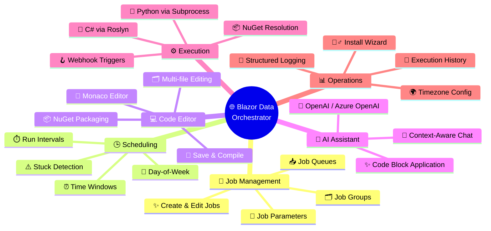

# Features

Blazor Data Orchestrator provides a comprehensive set of features for distributed job orchestration. It fills the gap between simple scheduled tasks (like Azure Functions with Timer Triggers) and heavyweight enterprise platforms (like Azure Data Factory or Apache Airflow) — giving Azure developers a lightweight, self-hosted job platform built on services they already know.


```mermaid
mindmap
  root((🌐 Blazor Data<br/>Orchestrator))
    📂 Job Management
      ✨ Create & Edit Jobs
      🗂️ Job Groups
      📥 Job Queues
      🔢 Job Parameters
    🕒 Scheduling
      📅 Day-of-Week
      ⏰ Time Windows
      ⏱️ Run Intervals
      ⚠️ Stuck Detection
    💻 Code Editor
      📝 Monaco Editor
      🗂️ Multi-file Editing
      🔨 Save & Compile
      📦 NuGet Packaging
    🤖 AI Assistant
      🧠 OpenAI / Azure OpenAI
      💬 Context-Aware Chat
      ✨ Code Block Application
    ⚙️ Execution
      🔷 C# via Roslyn
      🐍 Python via Subprocess
      📦 NuGet Resolution
      🪝 Webhook Triggers
    📊 Operations
      📝 Structured Logging
      📜 Execution History
      🌍 Timezone Config
      🧙‍♂️ Install Wizard
```

---

## Job Management

You can create, edit, enable, and disable jobs through the web UI. Each job represents a unit of work — a code package that the Agent downloads and executes.

| Capability | Description |
|-----------|-------------|
| **Create & Edit Jobs** | Define jobs with a name, organization, environment, and optional queue assignment. Toggle jobs on/off with a single click. |
| **Job Groups** | Organize jobs into groups for categorical management. Groups can be activated or deactivated. |
| **Job Queues** | Route jobs to specific Azure Queues (e.g., `default`, `jobs-large-container`). Agents monitor a configured queue and only process messages from that queue. |
| **Job Parameters** | Attach key-value parameters to jobs via the Parameters tab. Supports integer, string, and date values. Parameters are accessible to job code at execution time. |

---

## Job Scheduling

The **Scheduler** background service evaluates enabled schedules at a configurable polling interval (default: 60 seconds) and enqueues jobs that are due for execution.

- **Day-of-week selection** — Enable or disable each day (Monday through Sunday) per schedule.
- **Time windows** — Set start and stop times in military format (e.g., `800` for 8:00 AM, `1700` for 5:00 PM). Jobs only trigger within the configured window.
- **Run interval** — Set a `RunEveryHour` value to control how frequently a job runs within the time window. The scheduler checks the last completion time before re-queuing.
- **Multiple schedules per job** — A single job can have multiple schedules with different day/time/interval configurations.
- **Stuck instance detection** — If a job instance has not been updated within the timeout period (default: 24 hours), the scheduler automatically marks it as an error.

---

## Online Code Editor

The platform includes a **Monaco-based** in-browser code editor embedded in the Code Tab of the Job Details dialog. You can write, compile, and deploy jobs without leaving the browser.

- **Multi-file editing** — Switch between `main.cs`, `appsettings.json`, `appsettingsProduction.json`, `.nuspec`, and additional code files using a dropdown.
- **Save & Compile** — Validates C# code using Roslyn compilation with NuGet dependency resolution, or performs syntax checking for Python. Errors are displayed in a popup dialog.
- **NuGet package creation** — On successful compilation, the editor creates a `.nupkg` package and uploads it to Azure Blob Storage automatically.
- **Code Edit vs Code Upload** — Toggle between writing code in the editor or uploading a pre-built `.nupkg` file.

See the [Online](https://github.com/Blazor-Data-Orchestrator/BlazorDataOrchestrator/wiki/Online) guide for detailed usage instructions.

---

## AI Code Assistant

An AI-powered chat dialog assists you while writing job code in the online editor.

- **Backend support** — Works with both OpenAI and Azure OpenAI endpoints, configured via the Administration settings.
- **Context-aware** — The AI receives the current editor code as context, enabling targeted help and suggestions.
- **Code block application** — AI responses containing code blocks can be applied directly to the editor with a single click.
- **Streaming responses** — Responses stream in real-time for a responsive chat experience.

---

## NuGet Package Execution

Jobs are packaged as NuGet packages (`.nupkg`) and executed by the Agent service.

- **C# execution** — Compiled and executed via CS-Script/Roslyn. The entry point is the `BlazorDataOrchestratorJob.ExecuteJob()` method in `main.cs`.
- **Python execution** — Executed via subprocess. The entry point is the `execute_job()` function in `main.py`.
- **Automatic dependency resolution** — NuGet dependencies declared in the `.nuspec` file are resolved at execution time using `dotnet restore`. Transitive dependencies are included automatically.
- **Package structure** — Each package contains code files, configuration files (`appsettings.json`, `appsettingsProduction.json`), and a `.nuspec` manifest.

---

## Webhook Triggers

You can enable webhook triggers on a per-job basis. Each webhook-enabled job receives a unique GUID endpoint.

- **Endpoint format** — `GET` or `POST` to `/webhook/{GUID}?param1=value1&param2=value2`
- **Parameter forwarding** — Query string parameters and request body content are forwarded to the job execution context.
- **Toggle on/off** — Enable or disable the webhook from the Webhook tab in Job Details. A new GUID is generated when first enabled.

---

## Environment-Specific Configuration

Jobs support per-environment configuration files that are loaded at execution time based on the job's `JobEnvironment` setting.

| File | Purpose |
|------|---------|
| `appsettings.json` | Default settings for development |
| `appsettingsProduction.json` | Production overrides |
| `appsettingsStaging.json` | Staging overrides |

The Agent merges connection strings from its own configuration into the job's settings at runtime, so jobs can access shared infrastructure without hardcoding connection strings.

---

## Timezone Configuration

Administrators can configure a timezone offset for log display through the Administration > Settings page. This offset is applied to all log timestamps shown in the UI, allowing teams in different timezones to view logs in their local time.

---

## Logging & Monitoring

All job execution logs are stored in **Azure Table Storage** (`JobLogs` table) and viewable in the Logs tab of the Job Details dialog.

- **Structured log entries** — Each entry includes an Action, Details, Level, and Timestamp.
- **Per-instance logs** — View logs for each individual job execution instance.
- **Execution history** — Track which agent processed each instance, start/end times, and error details.

---

## Queue Visibility Timeout Renewal (Heartbeat)

For long-running jobs, the Agent implements a **heartbeat pattern** to prevent duplicate processing and ensure reliability:

- The initial visibility timeout is set to **5 minutes** when a message is received.
- A background task renews the visibility timeout every **3 minutes**, keeping the message hidden from other agents.
- If the Agent crashes, the message becomes visible again after the timeout expires and can be picked up by another agent.

This pattern is critical for production workloads — it ensures that jobs are never silently lost, even when agents fail unexpectedly.

---

## Install Wizard

On first launch, the web application detects that no database schema exists and presents a step-by-step Install Wizard:

1. **Database** — Configure the SQL Server connection string and create the database schema.
2. **Storage** — Configure the Azure Storage connection (or use Azurite for local development).
3. **Admin User** — Create the initial administrator account.
4. **Summary** — Review the configuration and complete the setup.

---

## One-Command Azure Deployment

The repository includes full Azure Developer CLI (`azd`) integration. A single command provisions all required Azure resources — Azure SQL, Storage Account, Container Registry, and Container Apps Environment — then builds, containerizes, and deploys all services:

```bash
azd up
```

This takes you from `git clone` to a fully deployed Azure Container Apps environment with no manual infrastructure setup. See the [Deployment](https://github.com/Blazor-Data-Orchestrator/BlazorDataOrchestrator/wiki/Deployment) guide for details.

---

*Back to [Home](https://github.com/Blazor-Data-Orchestrator/BlazorDataOrchestrator/wiki/Home)*
