# Features

Blazor Data Orchestrator provides a comprehensive set of features for distributed job orchestration. This page catalogues every major capability of the platform.

```mermaid
mindmap
  root((🌐 Blazor Data<br/>Orchestrator))
    📂 Job Management
      ✨ Create & Edit Jobs
      🗂️ Job Groups
      📥 Job Queues
      🔢 Job Parameters
    🕒 Scheduling
      📅 Day-of-Week
      ⏰ Time Windows
      ⏱️ Run Intervals
      ⚠️ Stuck Detection
    💻 Code Editor
      📝 Monaco Editor
      🗂️ Multi-file Editing
      🔨 Save & Compile
      📦 NuGet Packaging
    🤖 AI Assistant
      🧠 OpenAI / Azure OpenAI
      💬 Context-Aware Chat
      ✨ Code Block Application
    ⚙️ Execution
      🔷 C# via Roslyn
      🐍 Python via Subprocess
      📦 NuGet Resolution
      🪝 Webhook Triggers
    📊 Operations
      📝 Structured Logging
      📜 Execution History
      🌍 Timezone Config
      🧙‍♂️ Install Wizard
```

---

## Job Management

You can create, edit, enable, and disable jobs through the web UI. Each job represents a unit of work — a code package that the Agent downloads and executes.

| Capability | Description |
|-----------|-------------|
| **Create & Edit Jobs** | Define jobs with a name, organization, environment, and optional queue assignment. Toggle jobs on/off with a single click. |
| **Job Groups** | Organize jobs into groups for categorical management. Groups can be activated or deactivated. |
| **Job Queues** | Route jobs to specific Azure Queues (e.g., `default`, `jobs-large-container`). Agents monitor a configured queue and only process messages from that queue. |
| **Job Parameters** | Attach key-value parameters to jobs via the Parameters tab. Supports integer, string, and date values. Parameters are accessible to job code at execution time. |

---

## Job Scheduling

The **Scheduler** background service evaluates enabled schedules at a configurable polling interval (default: 60 seconds) and enqueues jobs that are due for execution.

- **Day-of-week selection** — Enable or disable each day (Monday through Sunday) per schedule.
- **Time windows** — Set start and stop times in military format (e.g., `800` for 8:00 AM, `1700` for 5:00 PM). Jobs only trigger within the configured window.
- **Run interval** — Set a `RunEveryHour` value to control how frequently a job runs within the time window. The scheduler checks the last completion time before re-queuing.
- **Multiple schedules per job** — A single job can have multiple schedules with different day/time/interval configurations.
- **Stuck instance detection** — If a job instance has not been updated within the timeout period (default: 24 hours), the scheduler automatically marks it as an error.

---

## Online Code Editor

The platform includes a **Monaco-based** in-browser code editor embedded in the Code Tab of the Job Details dialog. You can write, compile, and deploy jobs without leaving the browser.

- **Multi-file editing** — Switch between `main.cs`, `appsettings.json`, `appsettingsProduction.json`, `.nuspec`, and additional code files using a dropdown.
- **Save & Compile** — Validates C# code using Roslyn compilation with NuGet dependency resolution, or performs syntax checking for Python. Errors are displayed in a popup dialog.
- **NuGet package creation** — On successful compilation, the editor creates a `.nupkg` package and uploads it to Azure Blob Storage automatically.
- **Code Edit vs Code Upload** — Toggle between writing code in the editor or uploading a pre-built `.nupkg` file.

See the [Online](https://github.com/Blazor-Data-Orchestrator/BlazorDataOrchestrator/wiki/Online) guide for detailed usage instructions.

---

## AI Code Assistant

An AI-powered chat dialog assists you while writing job code in the online editor.

- **Backend support** — Works with both OpenAI and Azure OpenAI endpoints, configured via the Administration settings.
- **Context-aware** — The AI receives the current editor code as context, enabling targeted help and suggestions.
- **Code block application** — AI responses containing code blocks can be applied directly to the editor with a single click.
- **Streaming responses** — Responses stream in real-time for a responsive chat experience.

---

## NuGet Package Execution

Jobs are packaged as NuGet packages (`.nupkg`) and executed by the Agent service.

- **C# execution** — Compiled and executed via CS-Script/Roslyn. The entry point is the `BlazorDataOrchestratorJob.ExecuteJob()` method in `main.cs`.
- **Python execution** — Executed via subprocess. The entry point is the `execute_job()` function in `main.py`.
- **Automatic dependency resolution** — NuGet dependencies declared in the `.nuspec` file are resolved at execution time using `dotnet restore`. Transitive dependencies are included automatically.
- **Package structure** — Each package contains code files, configuration files (`appsettings.json`, `appsettingsProduction.json`), and a `.nuspec` manifest.

---

## Webhook Triggers

You can enable webhook triggers on a per-job basis. Each webhook-enabled job receives a unique GUID endpoint.

- **Endpoint format** — `GET` or `POST` to `/webhook/{GUID}?param1=value1&param2=value2`
- **Parameter forwarding** — Query string parameters and request body content are forwarded to the job execution context.
- **Toggle on/off** — Enable or disable the webhook from the Webhook tab in Job Details. A new GUID is generated when first enabled.

---

## Environment-Specific Configuration

Jobs support per-environment configuration files that are loaded at execution time based on the job's `JobEnvironment` setting.

| File | Purpose |
|------|---------|
| `appsettings.json` | Default settings for development |
| `appsettingsProduction.json` | Production overrides |
| `appsettingsStaging.json` | Staging overrides |

The Agent merges connection strings from its own configuration into the job's settings at runtime, so jobs can access shared infrastructure without hardcoding connection strings.

---

## Timezone Configuration

Administrators can configure a timezone offset for log display through the Administration > Settings page. This offset is applied to all log timestamps shown in the UI, allowing teams in different timezones to view logs in their local time.

---

## Logging & Monitoring

All job execution logs are stored in **Azure Table Storage** (`JobLogs` table) and viewable in the Logs tab of the Job Details dialog.

- **Structured log entries** — Each entry includes an Action, Details, Level, and Timestamp.
- **Per-instance logs** — View logs for each individual job execution instance.
- **Execution history** — Track which agent processed each instance, start/end times, and error details.

---

## Queue Visibility Timeout Renewal

For long-running jobs, the Agent implements a **heartbeat pattern** to prevent duplicate processing:

- The initial visibility timeout is set to **5 minutes** when a message is received.
- A background task renews the visibility timeout every **3 minutes**, keeping the message hidden from other agents.
- If the Agent crashes, the message becomes visible again after the timeout expires and can be picked up by another agent.

---

## Install Wizard

On first launch, the web application detects that no database schema exists and presents a step-by-step Install Wizard:

1. **Database** — Configure the SQL Server connection string and create the database schema.
2. **Storage** — Configure the Azure Storage connection (or use Azurite for local development).
3. **Admin User** — Create the initial administrator account.
4. **Summary** — Review the configuration and complete the setup.

---

*Back to [Home](https://github.com/Blazor-Data-Orchestrator/BlazorDataOrchestrator/wiki/Home)*
