# Blazor Data Orchestrator

Welcome to the **Blazor Data Orchestrator** wiki — your comprehensive guide to installing, configuring, and operating the platform.

## What is Blazor Data Orchestrator?

Blazor Data Orchestrator is a distributed job orchestration platform built on **.NET Aspire** and **Blazor Server**. It provides a web-based interface for creating, scheduling, and monitoring automated jobs written in **C#** or **Python**.

The platform packages job code as NuGet packages and executes them through a queue-based agent architecture. Jobs can be triggered on a schedule, manually from the UI, or via webhook endpoints. Azure Storage provides the backbone for package storage (Blob), job queuing (Queue), and structured logging (Table), while SQL Server stores all job configuration and metadata.

Key capabilities include an in-browser Monaco code editor with AI-assisted development, multi-environment configuration support, horizontal agent scaling, and a step-by-step install wizard for first-time setup.

## Architecture Overview

```mermaid
graph TB
    %% Styling
    classDef app fill:#e1dfdd,stroke:#333,stroke-width:2px;
    classDef front fill:#0078d4,stroke:#005a9e,stroke-width:2px,color:#fff;
    classDef back fill:#fff,stroke:#0078d4,stroke-width:2px,stroke-dasharray: 5 5;
    classDef storage fill:#eef6ff,stroke:#0078d4,stroke-width:2px;
    classDef db fill:#fff,stroke:#0078d4,stroke-width:2px;

    subgraph "Aspire AppHost"
        AH[🚀 AppHost<br/>Orchestrator]:::app
    end

    subgraph "Frontend"
        WEB[💻 Web App<br/>Blazor Server]:::front
    end

    subgraph "Background Services"
        SCHED[⏱️ Scheduler<br/>Schedule Evaluator]:::back
        AGENT[🤖 Agent<br/>Job Executor]:::back
    end

    subgraph "Shared Library"
        CORE[📚 Core<br/>JobManager & Services]:::app
    end

    subgraph "Azure Storage"
        BLOB[(📄 Blob Storage<br/>Job Packages)]:::storage
        QUEUE[(📨 Queue Storage<br/>Job Messages)]:::storage
        TABLE[(📋 Table Storage<br/>Job Logs)]:::storage
    end

    subgraph "Database"
        SQL[(🛢️ SQL Server)]:::db
    end

    AH -->|orchestrates| WEB
    AH -->|orchestrates| SCHED
    AH -->|orchestrates| AGENT

    WEB --> CORE
    AGENT --> CORE
    SCHED --> SQL
    SCHED --> QUEUE
    CORE --> SQL
    CORE --> BLOB
    CORE --> QUEUE
    CORE --> TABLE
```

## Quick Start

1. **Prerequisites** — Install [.NET 10 SDK](https://dotnet.microsoft.com/download) and [Docker Desktop](https://www.docker.com/products/docker-desktop/) (or Podman).
2. **Clone & restore** — `git clone https://github.com/Blazor-Data-Orchestrator/BlazorDataOrchestrator.git && cd BlazorDataOrchestrator && dotnet workload restore`
3. **Run** — `aspire run` — Aspire starts SQL Server, Azurite, and all application services automatically. Complete the Install Wizard on first launch.

See the [Installation](https://github.com/Blazor-Data-Orchestrator/BlazorDataOrchestrator/wiki/Installation) guide for detailed instructions.

## Navigation

* [Features](https://github.com/Blazor-Data-Orchestrator/BlazorDataOrchestrator/wiki/Features) — Full feature catalogue
* [Requirements](https://github.com/Blazor-Data-Orchestrator/BlazorDataOrchestrator/wiki/Requirements) — System prerequisites and infrastructure
* [Installation](https://github.com/Blazor-Data-Orchestrator/BlazorDataOrchestrator/wiki/Installation) — Step-by-step setup guide
* [Operation](https://github.com/Blazor-Data-Orchestrator/BlazorDataOrchestrator/wiki/Operation) — Day-to-day usage guide
* [Job Development](https://github.com/Blazor-Data-Orchestrator/BlazorDataOrchestrator/wiki/Job-Development) — Overview of job development approaches
  - [Online](https://github.com/Blazor-Data-Orchestrator/BlazorDataOrchestrator/wiki/Online) — Browser-based code editor
  - [Visual Studio](https://github.com/Blazor-Data-Orchestrator/BlazorDataOrchestrator/wiki/Visual-Studio) — Local development with the Job Creator Template
* [Deployment](https://github.com/Blazor-Data-Orchestrator/BlazorDataOrchestrator/wiki/Deployment) — Production deployment instructions
* [Frequently Asked Questions](https://github.com/Blazor-Data-Orchestrator/BlazorDataOrchestrator/wiki/Frequently-Asked-Questions) — Common Q&A and troubleshooting
