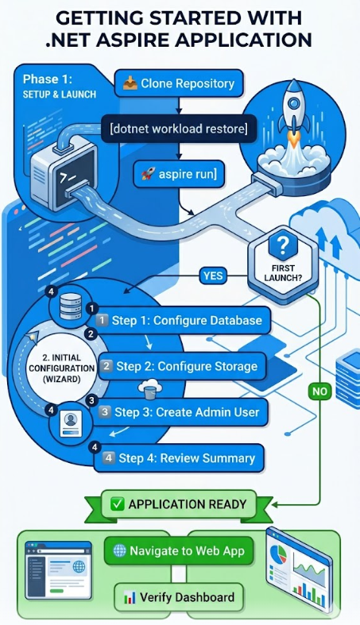
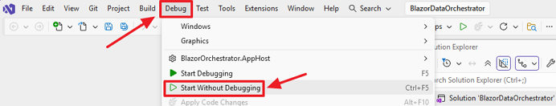
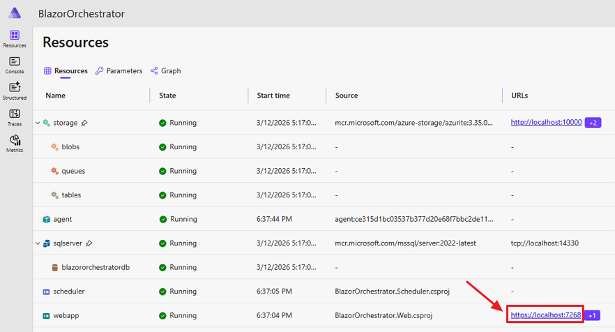
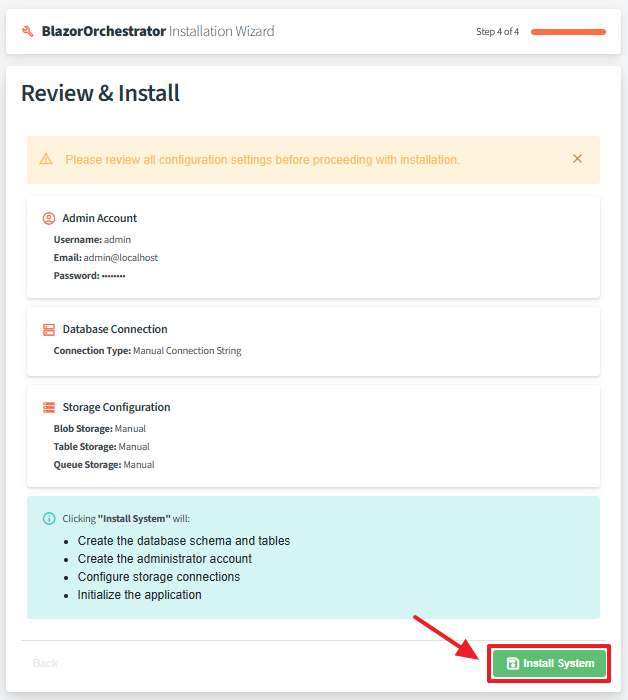
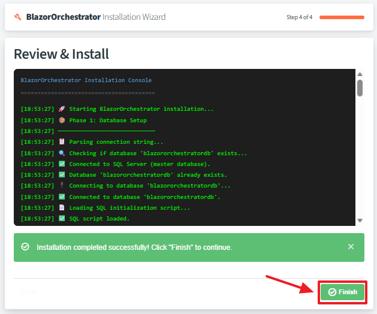
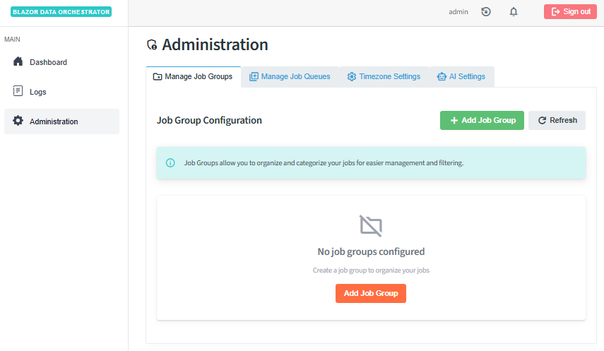

# Installation

This guide walks you through setting up Blazor Data Orchestrator from a fresh clone to a running application. The entire process takes minutes — Aspire handles all infrastructure (SQL Server, Azure Storage emulator) automatically, and a guided Install Wizard walks you through first-time configuration.

> **Prerequisites:** Make sure you have met all the [Requirements](https://github.com/Blazor-Data-Orchestrator/BlazorDataOrchestrator/wiki/Requirements) before starting.
>
> **Deploying to Azure?** See the [Deployment](https://github.com/Blazor-Data-Orchestrator/BlazorDataOrchestrator/wiki/Deployment) guide to go from `git clone` to a fully deployed Azure Container Apps environment with a single `azd up` command.

---

## Installation Flow



---

## 1. Clone the Repository

```bash
git clone https://github.com/Blazor-Data-Orchestrator/BlazorDataOrchestrator.git
cd BlazorDataOrchestrator
```

---

## 2. Restore Workloads and Dependencies

```bash
dotnet workload restore
dotnet restore
```

> **Note:** Do not run `dotnet workload install aspire` — the legacy Aspire workload is obsolete. The `dotnet workload restore` command restores only the workloads declared by the solution.

---

## 3. Start with Aspire

```bash
aspire run
```

The Aspire AppHost orchestrates all services automatically:

| Resource | Type | Description |
|----------|------|-------------|
| `sqlServer` | Container | SQL Server with persistent volume, port 1433 |
| `storage` | Container | Azurite emulator with Blob (10000), Queue (10001), and Table (10002) |
| `webapp` | Project | Blazor Server web application |
| `scheduler` | Project | Background scheduling service |
| `agent` | Project | Job execution worker |

All connection strings and service references are injected automatically by Aspire — no manual configuration is needed for local development.



Or open in **Visual Studio** or **Visual Studio Code** and Debug/Start Without Debugging.

---

## 4. Install Wizard



The Aspire Dashboard will open in your web browser. Locate the line that has the `webapp` and click the `https` hyperlink.




On first launch, the web application presents the **Install Wizard**. 



Complete the installation.

---

## 5. Verify Installation



After the Install Wizard completes:

1. **Home page** — You should see the job list (empty on first install).
2. **Aspire Dashboard** — Open the Aspire dashboard URL (shown in the terminal output) to verify all services show a healthy status.
3. **Containers** — Confirm that the SQL Server and Azurite containers are running in Docker Desktop.

---

## 6. Configure External Authentication (Optional)

Blazor Data Orchestrator supports optional sign-in via **Microsoft** (Azure Entra ID) and **Google** (OAuth 2.0). These providers are configured entirely through the Admin UI — no changes to configuration files are needed.

### Microsoft Authentication

1. Navigate to the [Azure Portal](https://portal.azure.com) and go to **Microsoft Entra ID** > **App registrations** > **New registration**.
2. Set the application name (e.g., `BlazorDataOrchestrator`).
3. Set **Supported account types** to the appropriate scope:
   - *Single tenant* — only users in your Azure AD directory
   - *Multitenant* — users from any Azure AD directory
   - *Multitenant + personal Microsoft accounts* — broadest scope
4. Set the **Redirect URI**:
   - Type: **Web**
   - URI: `https://<your-app-url>/signin-microsoft`
   - For local development: `https://localhost:<port>/signin-microsoft`
5. Go to **Certificates & secrets** > **Client secrets** > **New client secret**. Copy the **Value** immediately (it is only shown once).
6. Go to the app registration **Overview** page and copy the **Application (client) ID**.
7. In Blazor Data Orchestrator, navigate to **Administration** > **Authentication**.
8. Enable **Microsoft Authentication**, paste the **Client ID** and **Client Secret**, and click **Save**.
9. **Restart the application** (see warning below).

### Google Authentication

1. Navigate to [Google Cloud Console](https://console.cloud.google.com/) and create or select a project.
2. Go to **APIs & Services** > **Credentials** > **Create Credentials** > **OAuth client ID**.
3. If prompted, configure the **OAuth consent screen** — set the app name, support email, and add scopes: `openid`, `email`, `profile`.
4. Set **Application type** to **Web application**.
5. Add **Authorized redirect URIs**:
   - `https://<your-app-url>/signin-google`
   - For local development: `https://localhost:<port>/signin-google`
6. Copy the **Client ID** and **Client Secret** from the credentials page.
7. In Blazor Data Orchestrator, navigate to **Administration** > **Authentication**.
8. Enable **Google Authentication**, paste the **Client ID** and **Client Secret**, and click **Save**.
9. **Restart the application** (see warning below).

> **⚠️ Warning: Application Restart Required**
>
> After enabling, disabling, or changing the Client ID / Client Secret for any external authentication provider (Microsoft or Google), you **must restart the application** for the changes to take effect.
>
> - **Local development:** Stop and re-run `aspire run`
> - **Azure Container Apps:** Restart the Container App via the Azure Portal, Azure CLI, or redeploy using `azd deploy`
>
> The Login page will not show or hide provider buttons until the restart is complete.

> **Note:** External logins only **link to existing user accounts**. They do not auto-create new accounts. The user must already exist in the system before they can sign in with an external provider.

---

## Configuration Files

Blazor Data Orchestrator uses standard .NET configuration files. In development, Aspire injects connection strings automatically, so you typically do not need to edit these files.

| File | Project | Purpose |
|------|---------|---------|
| `appsettings.json` | Web, Scheduler, Agent | Base configuration with connection strings |
| `appsettings.Development.json` | Web, Scheduler, Agent | Development-specific overrides |
| `appsettings.json` | AppHost | Aspire host configuration |

### Key Configuration Settings

```json
{
  "ConnectionStrings": {
    "blazororchestratordb": "Server=localhost,14330;Database=blazororchestratordb;...",
    "blobs": "UseDevelopmentStorage=true",
    "queues": "UseDevelopmentStorage=true",
    "tables": "UseDevelopmentStorage=true"
  }
}
```

> **Tip:** When running via `aspire run`, connection strings are injected by the AppHost and override values in `appsettings.json`. You only need to edit these files for standalone execution or production deployment.

---

## Troubleshooting

| Problem | Solution |
|---------|----------|
| `aspire run` fails to start | Ensure Docker Desktop is running and the .NET 10 SDK is installed |
| SQL Server container won't start | Check that port 14330 is not in use by another process |
| Azurite ports conflict | Check that ports 10000, 10001, 10002 are free |
| Install Wizard doesn't appear | Clear the browser cache and navigate to the web app root URL |
| Database connection fails | Verify the SQL Server container is healthy in the Aspire dashboard |

---

*Back to [Home](https://github.com/Blazor-Data-Orchestrator/BlazorDataOrchestrator/wiki/Home)*
