# Installation

This guide walks you through setting up Blazor Data Orchestrator from a fresh clone to a running application.

> **Prerequisites:** Make sure you have met all the [Requirements](https://github.com/Blazor-Data-Orchestrator/BlazorDataOrchestrator/wiki/Requirements) before starting.

---

## Installation Flow

```mermaid
flowchart TD
    %% Styling
    classDef step fill:#0078d4,stroke:#005a9e,stroke-width:2px,color:#fff,rx:5,ry:5;
    classDef decision fill:#fff,stroke:#0078d4,stroke-width:2px,rx:5,ry:5;
    classDef final fill:#dff6dd,stroke:#107c10,stroke-width:2px,rx:5,ry:5;

    A[📥 Clone Repository]:::step --> B[dotnet workload restore]:::step
    B --> C[🚀 aspire run]:::step
    C --> D{First Launch?}:::decision
    D -->|Yes| E[🧙‍♂️ Install Wizard]:::step
    E --> E1[1️⃣ Step 1: Configure Database]:::step
    E1 --> E2[2️⃣ Step 2: Configure Storage]:::step
    E2 --> E3[3️⃣ Step 3: Create Admin User]:::step
    E3 --> E4[4️⃣ Step 4: Review Summary]:::step
    E4 --> F[✅ Application Ready]:::final
    D -->|No| F
    F --> G[🌐 Navigate to Web App]:::step
    G --> H[📊 Verify Dashboard]:::final
```



---

## 1. Clone the Repository

```bash
git clone https://github.com/Blazor-Data-Orchestrator/BlazorDataOrchestrator.git
cd BlazorDataOrchestrator
```

---

## 2. Restore Workloads and Dependencies

```bash
dotnet workload restore
dotnet restore
```

> **Note:** Do not run `dotnet workload install aspire` — the legacy Aspire workload is obsolete. The `dotnet workload restore` command restores only the workloads declared by the solution.

---

## 3. Start with Aspire

```bash
aspire run
```

The Aspire AppHost orchestrates all services automatically:

| Resource | Type | Description |
|----------|------|-------------|
| `sqlServer` | Container | SQL Server with persistent volume, port 1433 |
| `storage` | Container | Azurite emulator with Blob (10000), Queue (10001), and Table (10002) |
| `webapp` | Project | Blazor Server web application |
| `scheduler` | Project | Background scheduling service |
| `agent` | Project | Job execution worker |

All connection strings and service references are injected automatically by Aspire — no manual configuration is needed for local development.

---

## 4. Install Wizard

On first launch, the web application detects that the database schema has not been created and presents the **Install Wizard**. Follow the steps below to complete the initial setup.

### Step 1: Configure Database

- The wizard displays the current SQL Server connection string (auto-configured by Aspire).
- Click **Test Connection** to verify connectivity.
- Click **Create Database** to run the schema creation scripts.

### Step 2: Configure Storage

- The wizard displays the current Azure Storage connection (Azurite in development).
- Click **Test Connection** to verify Blob, Queue, and Table access.
- The required containers and tables are created automatically.

### Step 3: Create Admin User

- Enter the initial administrator username and password.
- This account is used to sign in and manage the application.

### Step 4: Review Summary

- Review all configuration settings.
- Click **Finish** to complete the setup.
- The application redirects to the home page.

---

## 5. Verify Installation

After the Install Wizard completes:

1. **Home page** — You should see the job list (empty on first install).
2. **Aspire Dashboard** — Open the Aspire dashboard URL (shown in the terminal output) to verify all services show a healthy status.
3. **Containers** — Confirm that the SQL Server and Azurite containers are running in Docker Desktop.

---

## Configuration Files

Blazor Data Orchestrator uses standard .NET configuration files. In development, Aspire injects connection strings automatically, so you typically do not need to edit these files.

| File | Project | Purpose |
|------|---------|---------|
| `appsettings.json` | Web, Scheduler, Agent | Base configuration with connection strings |
| `appsettings.Development.json` | Web, Scheduler, Agent | Development-specific overrides |
| `appsettings.json` | AppHost | Aspire host configuration |

### Key Configuration Settings

```json
{
  "ConnectionStrings": {
    "blazororchestratordb": "Server=localhost,1433;Database=blazororchestratordb;...",
    "blobs": "UseDevelopmentStorage=true",
    "queues": "UseDevelopmentStorage=true",
    "tables": "UseDevelopmentStorage=true"
  }
}
```

> **Tip:** When running via `aspire run`, connection strings are injected by the AppHost and override values in `appsettings.json`. You only need to edit these files for standalone execution or production deployment.

---

## Troubleshooting

| Problem | Solution |
|---------|----------|
| `aspire run` fails to start | Ensure Docker Desktop is running and the .NET 10 SDK is installed |
| SQL Server container won't start | Check that port 1433 is not in use by another process |
| Azurite ports conflict | Check that ports 10000, 10001, 10002 are free |
| Install Wizard doesn't appear | Clear the browser cache and navigate to the web app root URL |
| Database connection fails | Verify the SQL Server container is healthy in the Aspire dashboard |

---

*Back to [Home](https://github.com/Blazor-Data-Orchestrator/BlazorDataOrchestrator/wiki/Home)*
